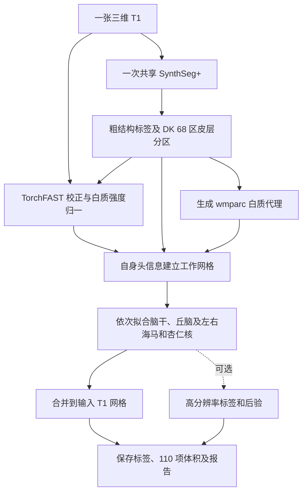

# Fudan Neuroimaging Toolkit (FNIT)

**本工具包仍处于开发阶段，部分算法尚未完成严格验证，目前不宜作为常规数据处理与分析的默认工具。**

FNIT 提供人脑磁共振（MRI）处理和群体分析的 Python 与命令行接口。主要计算由 PyTorch 实现，NIfTI 读写使用 Nibabel。Python 包名为 `fnit`，统一命令行入口为 `fnit`。各功能的运行依赖与安装要求见对应功能页；当前 Connectome 的自动结构重建仍需用户安装并许可的官方 FreeSurfer `recon-all`。

CUDA 路径默认启用 NVIDIA TF32 矩阵乘法和 cuDNN 内核；BWAS 为匹配原版统计结果，使用普通 float32 连接计算和 QR 正交化回归。模型、影像张量与 NIfTI 输出保持 float32，不自动使用 float16 或 bfloat16。

影像处理以单被试 Python API 和命令行接口为主；多被试任务可在包外通过任务调度器、进程池或作业系统分配 CPU/GPU。recon-all、Connectome、BigFLICA 和 BWAS 的处理范围与调用方式见对应功能页。

## 功能

### 一般功能

| 函数名 | 原软件函数名 | 功能 |
|---|---|---|
| [run_fslmaths](docs/fslmaths/README.md) | FSL `fslmaths` | 3D/4D NIfTI 算术、阈值、滤波、形态学与时间统计。 |

### 多模态

| 函数名 | 原软件函数名 | 功能 |
|---|---|---|
| [TorchFLIRT](docs/flirt/README.md) | FSL `flirt` | 线性配准；`applyxfm` 应用已知矩阵或按 qform/sform 在 MNI152 不同分辨率间重采样。 |
| [TorchFNIRT](docs/fnirt/README.md) | FSL `fnirt` | 非线性配准、Jacobian 与系数场。 |
| [TorchApplyWarp](docs/applywarp/README.md) | FSL `applywarp` | 应用形变场及前后仿射矩阵。 |
| [TorchConvertWarp](docs/convertwarp/README.md) | FSL `convertwarp` | 组合线性与非线性变换，转换 MMORF 场。 |
| [TorchInvWarp](docs/invwarp/README.md) | FSL `invwarp` | 在指定网格上计算位移场的反场。 |
| [convert_space](docs/space_conversion/README.md) | CBIG RF-ANTs；HCP Workbench `-metric-resample` | MNI152、fsaverage 与 fsLR 皮层标量或标签图互转，支持多种体素网格与表面密度。 |

### sMRI

| 函数名 | 原软件函数名 | 功能 |
|---|---|---|
| [SynthStrip](docs/synthstrip/README.md) | FreeSurfer `mri_synthstrip` | 脑图、脑掩膜和有符号距离场。 |
| [SynthMorph](docs/synthmorph/README.md) | FreeSurfer `mri_synthmorph` | 刚性、仿射和非线性配准。 |
| [WMHSynthSeg](docs/wmh_synthseg/README.md) | FreeSurfer `mri_WMHsynthseg` | 脑结构与白质高信号标签、软体积。 |
| [SynthSeg](docs/synthseg/README.md) | FreeSurfer `mri_synthseg` | 33 类脑结构标签与软体积。 |
| [SynthSegPlus](docs/synthseg_plus/README.md) | FreeSurfer `mri_synthseg --parc` | 33 类结构与 68 区皮层分区。 |
| [SynthSR](docs/synthsr/README.md) | FreeSurfer `mri_synthsr` | 合成 1 mm T1w 图像。 |
| [TorchFAST](docs/fast/README.md) | FSL `fast` | 三组织分割、部分体积分数与偏置场。 |
| [FastVBM](docs/fast_vbm/README.md) | FSL `fslvbm` | 从 T1w 生成标准空间灰质、Jacobian 与调制灰质图；[全流程 benchmark](validation/fast_vbm/README.md)。 |
| [segment_4_subregions](docs/subregions/README.md) | FreeSurfer `segment_subregions brainstem/thalamus/hippo-amygdala` | 一张 T1 完成脑干、双侧丘脑、海马和杏仁核分割，保存原网格标签、110 项硬/软体积及高分辨率结果；CPU/GPU 均支持。[十张公开 T1 benchmark](validation/subregions/ten_public_t1_20261002/latest_main_regression/official_comparison.md)：H100 完整流程 4.32 ± 0.11 分钟/例，官方 CPU 125.45 ± 12.28 分钟/例；[110 分区 Dice 与脑图](docs/subregions/README.md#最新精度运行时间与脑图)。 |
| [run_recon_all_python](docs/recon_all/README.md) | FreeSurfer `recon-all` | 从 T1w 生成脑分割、皮层表面、顶点指标与脑区统计；[两例当前性能与精度](validation/recon_all/optimizations/20261002_parallel/FINAL_RESULTS.md)。 |

### fMRI

| 函数名 | 原软件函数名 | 功能 |
|---|---|---|
| [TorchMCFLIRT](docs/mcflirt/README.md) | FSL `mcflirt` | BOLD 每帧刚体运动估计、FSL 矩阵与六列参数、图像重采样；[真实数据对照](validation/mcflirt/README.md)。 |
| [parcellate](docs/mshbm/README.md) | CBIG `CBIG_MSHBM_parcellation_single_subject.m` | fsLR32k 或 MNI BOLD 到个体 17 网络标签与连接矩阵。 |
| [fMRIVolume_pipeline](docs/fmri/README.md) | FSL FEAT、ICA-AROMA；fMRIPrep 单次重采样 | 原始 BIDS 单 run 同时生成 T1w 原生 BOLD 分辨率/MNI 2 mm preproc 与 FEAT/AROMA clean 体积 BOLD；默认关闭 slice timing；[验证记录](validation/fmri/README.md)。 |
| [fMRISurface_pipeline](docs/fmri/surface.md) | fMRIPrep fsLR 重采样、Workbench | 默认读取 volume preproc 和同源 T1 recon-all 的已有中层面，输出 fsLR32k GIFTI、91k CIFTI、注册球面与 QC；可显式选 clean。 |
| [fnit.msm.run_msmsulc](docs/msm/README.md) | newMSM MSMSulc | 独立的 HOCR/FastPD 脑沟球面配准。 |
| [fnit.msm.run_msmall](docs/msm/msmall.md) | newMSM / HCP MSMAll | 独立的加权多特征球面配准；附 [VN、DR/WRN 与 C/CA/CAT 特征准备](docs/msm/features.md)，可接入 surface。真实 C 模式的完整一级/三级配置与固定 490 帧投影逐值匹配官方；[测量记录](validation/msm/README.md#独立-msmall-验证)。 |
| [fnit.melodic.run_melodic_bids](docs/melodic/README.md) | FSL MELODIC | 独立的 PyTorch 单被试空间 PICA，输入和输出均为 BIDS Derivatives。 |

### dMRI

| 函数名 | 原软件函数名 | 功能 |
|---|---|---|
| [TorchTOPUP](docs/topup/README.md) | FSL `topup` | AP/PA b0 畸变场估计与校正。 |
| [TorchEDDY](docs/eddy/README.md) | FSL `eddy` | DWI 运动及涡流校正、bvec 旋转。 |
| [TorchDTIFIT](docs/dtifit/README.md) | FSL `dtifit` | FA、MD、特征值/向量、S0 与张量拟合。 |
| [TorchAMICONODDI](docs/amico_noddi/README.md) | AMICO `NODDI`；NODDI Toolbox `WatsonSHStickTortIsoV_B0` | AMICO 或经典连续 Watson 拟合；输出 NDI、ODI、FWF、方向与拟合误差。 |
| [TorchMMORF](docs/mmorf/README.md) | FSL `MMORF` | 多标量与扩散张量联合配准，自动估计线性初始化。 |
| [TorchBEDPOSTX](docs/bedpostx/README.md) | FSL `bedpostx` | 纤维方向、体积分数与后验不确定性。 |
| [TorchProbtrackX](docs/probtrackx/README.md) | FSL `probtrackx2` | 概率纤维追踪、路径密度和连接矩阵。 |
| [DMRIPipeline](docs/dmri_pipeline/README.md) | UK Biobank dMRI pipeline（FSL `topup`、`eddy`、`dtifit`、TBSS） | 原始 AP/PA 或 BIDS DWI → 九张 native/标准参数图；无 T1w 用 TBSS，有 T1w 可选 MMORF。PyTorch SynthStrip 脑 mask＋新版 TOPUP。[最新同 raw 整链](validation/dmri_pipeline/end_to_end_synthstrip_topup_20261002.md)：FNIT 6.75 分钟、独立官方 SynthStrip＋FSL/AMICO 34.26 分钟；标准九图固定 ROI r=0.9880–0.9987。对旧 BET 协议 r=0.8465–0.9597；尚非逐值相等。 |
| [UKBConnectome_pipeline](docs/connectome/README.md) | BIDS DWI/T1 结构连接组网 | 从原始 BIDS 自动执行 TOPUP、EDDY、必要时的官方 recon-all，并从一次追踪输出单套或多套 atlas 矩阵；[本轮精度验收](docs/connectome/ACCURACY_OPTIMIZATION_20261003.md)与[前轮真实结果](docs/connectome/actual_cohort_comparison.md)分开记录。 |

### Connectome 两轮验证

- **前轮数据流加速（2026-10-02 轮）**：十例两版的 320 张矩阵逐值一致，raw-DWI CLI 中位数 761.722→643.623 s；共享 GPU 下的实测时间见[前轮十例报告](docs/connectome/actual_cohort_comparison.md)。对独立官方 raw 链的通过率为 57.96%，整体未进入官方重复范围，见[前轮完整矩阵判定](docs/connectome/FINAL_RAW_MATRIX_RESULTS.md)。
- **本轮精度优化（2026-10-03）**：复用相同十例原始 BIDS 与已完成的官方 FreeSurfer subject，正式候选保留梯度/张量解释、归一化四分位索引及 ACT 的 SGM 弦方向修正。十例候选与 CON01/03 两次基线配对正在运行，完整精度、耗时及显存结论待实际验收，见[本轮总说明](docs/connectome/ACCURACY_OPTIMIZATION_20261003.md)。

本轮组件记录：[1 TOPUP/EDDY](validation/connectome/accuracy_20261003/task_01/README.md)、[2 梯度/建模](validation/connectome/accuracy_20261003/task_02/README.md)、[3 iFOD2/ACT](validation/connectome/accuracy_20261003/task_03/README.md)、[4 解剖/atlas](validation/connectome/accuracy_20261003/task_04/README.md)、[5 固定轨迹矩阵](validation/connectome/accuracy_20261003/task_05/README.md)。各项保留实际采用或拒绝的候选、官方对照、耗时和脑图。

### 后续分析（Post analysis）

| 函数名 | 原软件函数名 | 功能 |
|---|---|---|
| [fit_dictionary_learning / fit_dictionary_learning_streaming](docs/dictionary_learning/README.md) | sklearn `MiniBatchDictionaryLearning` | 独立拟合稀疏字典：CPU 接受样本×特征数组，GPU 分块读取 HDF5；返回按特征中心化、整体 RMS 归一化的字典。真实1000人 R500/D200 的字典与 LASSO 指标通过原容差，FA/MD 的 OMP30 重建差仍待改进；[报告与复现](validation/dictionary_learning/README.md)。 |
| [run_bigflica / apply_model](docs/bigflica/README.md) | [BigFLICA](https://github.com/weikanggong/BigFLICA) mMIGP、DicL、FLICA | 从每人一目录的多模态标准空间 NIfTI 提取成分，保存 course、各模态 z 图、阈值图及新被试模型。压缩流程调用独立字典学习模块，也支持直接体素 FLICA；压缩流程的有效 C20 和最终脑图仍待验收。 |
| [run_superbigflica / apply_model / plot_superbigflica](docs/superbigflica/README.md) | [SuperBigFLICA](https://github.com/weikanggong/SuperBigFLICA) | 沿用 BigFLICA 的多模态影像目录，以被试 ID 匹配独立 CSV；随机初始化监督共享成分，预测连续表型、二分类或多分类；自动绘制成分权重、Top 3 脑图与测试集散点/ROC 图，并保存新被试模型。 |
| [run_bwas / plot_bwas_connectivity](docs/bwas/README.md) | [weikanggong/BWAS](https://github.com/weikanggong/BWAS) | 对多被试 2 mm BIDS volume BOLD 的逐体素连接做表型 GLM、6D 连接簇校正、MA 图和多视角连接可视化。 |

各功能页说明输入、输出、参数与调用示例，并汇总已有的真实数据验证结果、原软件命令、参考文献和原实现链接。统一入口中的子命令用 `fnit <子命令> --help` 查看；fMRI 使用 `fnit-fmri --help`，MS-HBM 使用 `fnit-mshbm --help`，recon-all 使用 `fnit-recon-all --help`。全部独立入口见 [pyproject.toml](pyproject.toml)。 MS-HBM 的 HCP_40 prior 随包提供；MNI 体积投影的表面和掩膜按[专属说明](docs/mshbm/README.md#mni-2-mm-体积输入)从固定 CBIG 原站部署。

## 安装

推荐从仓库根目录创建独立 Conda 环境：

```bash
git clone https://github.com/weikanggong1/Fudan-Neuroimaging-toolkit.git
cd Fudan-Neuroimaging-toolkit
conda env create -f environment.yml
conda activate fnit
python -c "import fnit, torch; print(fnit.__version__, torch.__version__, torch.cuda.is_available())"
fnit --help
```

`environment.yml` 固定 Python 3.11、PyTorch 2.5.1、CUDA 11.8、Triton 3.1.0、Connectome Workbench 2.1.0、构建 MSM 原生扩展所需的 C++ 编译器，以及 AMICO 逐体素对照使用的 NumPy 1.26.4 x86_64 wheel。目标 GPU 节点为 glibc 2.17 时，可在共享文件系统上按该 ABI 求解：

```bash
FNIT_ENV_PREFIX=/path/on/shared-storage/fnit-conda
CONDA_OVERRIDE_GLIBC=2.17 conda env create -p "$FNIT_ENV_PREFIX" -f environment.yml
conda activate "$FNIT_ENV_PREFIX"
```

[Conda 环境验证](validation/environment/README.md)和[机器可读报告](validation/environment/report.public.json)记录了依赖解析、目标 ABI、固定 wheel 的下载校验与实际导入结果。具体安装结果以目标机器上的环境创建和导入检查为准。

也可使用 Python 虚拟环境安装；需预先安装支持 C++17 的编译器，以构建 MSMSulc/MSMAll 共用的原生扩展：

```bash
python3 -m venv .venv
source .venv/bin/activate
python -m pip install .
```

recon-all 的 Python 依赖和原生编译工具链已列入主页 Conda 环境；创建环境后按 [recon-all 安装说明](docs/recon_all/CONDA_CPP_BUILD.md)编译固定源码程序并获取外置权重、图谱。Connectome 的兼容依赖及其安装边界见功能页。

## 下载和配置权重

Git 仓库与 wheel 不包含模型权重。配置脚本优先从 [FNIT 固定版本 Release](https://github.com/weikanggong1/Fudan-Neuroimaging-toolkit/releases/tag/assets-v1)下载；Release 不可用时回退到原作者地址。每个文件均检查大小和 SHA-256，再保存到默认权重目录。统一脑亚区接口在首次缺少所需资源时会自动准备；离线运行请先配置权重和图谱。

下载全部模型：

```bash
python tools/setup_weights.py --all
```

只下载所需模型：

```bash
python tools/setup_weights.py --model synthstrip --model synthmorph-joint
python tools/setup_weights.py --model wmh-synthseg
python tools/setup_weights.py --model synthseg
python tools/setup_weights.py --model synthseg-plus
python tools/setup_weights.py --model synthsr
python tools/setup_weights.py --model fast-vbm
python tools/setup_weights.py --model fmri
```

安装包后可将 `python tools/setup_weights.py` 替换为 `fnit-setup-weights`。自定义存放位置与离线校验：

```bash
fnit-setup-weights --all --dest /path/to/weights
fnit-setup-weights --all --dest /path/to/weights --verify-only
```

fsLR32k 表面投影的 HCP 公开模板不属于模型权重，同样优先从固定版本 Release 下载并逐文件校验；`--fmriprep` 的 TemplateFlow MNI152NLin6Asym 2 mm T1w、脑掩膜和 HCP dseg 仅从原站获取，核对固定大小和 SHA-256：

```bash
fnit-setup-fmri-surface-assets --output-dir /absolute/path/hcp_surface_assets --fmriprep
```

该命令包含 fsLR32k/MSMSulc 的球面、脑沟参考图、ROI 与配置，以及 `fmriprep/` 下的三个 TemplateFlow 文件。volume 核对模板体素内容身份，surface 默认使用其单次插值 preproc；缺少 preproc 或身份字段的旧 volume 需重新运行。被试须提供同源 recon-all 的 white、pial、sphere、sphere.reg、sulc、thickness，及每侧已有的 midthickness 或 graymid；完整参数与源 T1/世界仿射要求见 [fMRI 表面投影](docs/fmri/surface.md)，模板大小和 SHA-256 见[原站模板清单](docs/WEIGHTS.md#fmri-templateflow-原站模板)。

使用可选 [MSMAll](docs/msm/msmall.md) 时，资源命令加 `--msmall`，下载多特征配准配置、d40 参考及 WRN 的 d7–d21 图，并校验固定大小和 SHA-256。无个体髓鞘图时须明确选择连接特征 `C`；默认 surface 仍使用 T1w-only MSMSulc。

统一脑亚区分割使用经哈希校验的 BrainstemSS、ThalamicNuclei 和 HippoSF 图谱。可提前准备，以便离线运行；脑干沿用预计算先验，丘脑和海马先验在个体仿射变换后的参考网格上平滑：

```bash
# --output-root：生成四个结构目录的根路径；--device：先验计算设备
fnit-setup-subregion-atlases --output-root /absolute/path/subregion_atlases --device cpu
```



```python
from fnit import segment_4_subregions

subregion_result = segment_4_subregions(
    t1="/absolute/path/sub-01_T1w.nii.gz",          # 输入：一张原始 T1
    atlas_root="/absolute/path/subregion_atlases",  # 输入：已准备的统一图谱
    output_dir="/absolute/path/sub-01_subregions", # 输出：标签、表格和报告目录
    device="cuda:0",                             # 输入：CUDA 设备；也支持 cpu
    threads=4,                                  # 输入：PyTorch CPU 线程数
    optimization="fast",                         # 输入：默认速度配置
)
```

默认运行全部四项结构，设置输出目录后自动保存原 T1 网格的 `subregions_native.nii.gz`、`labels.tsv`、`volumes.tsv`、`report.json` 和四项 `highres/` 标签。`save_posteriors=False` 默认不写较大的后验图；需要时显式设为 `True`。完整参数、命令行和官方对照见[统一脑亚区说明](docs/subregions/README.md)。

API 的显式 `weights=`、CLI 的 `--weights`、`FNIT_WEIGHTS` 环境变量、已保存目录和默认缓存按此顺序解析。TorchFAST、TorchFLIRT、TorchMCFLIRT、TorchFNIRT、TorchApplyWarp、TorchConvertWarp、TorchInvWarp、TorchTOPUP、TorchEDDY、TorchDTIFIT、TorchAMICONODDI、TorchMMORF、TorchBEDPOSTX 与 TorchProbtrackX 本身没有预训练权重。DMRIPipeline 从原始 DWI 启动时使用 PyTorch SynthStrip 提取 b0 脑掩膜，需要 `synthstrip.1.pt`；有 T1w 的流程也可复用该模型。文件清单、官方 URL、SHA-256、许可和离线部署见[权重说明](docs/WEIGHTS.md)。

## 验证、样例与许可

[验证索引](validation/README.md)汇总当前源码对应的真实数据精度、运行时间、峰值显存和示意图，并链接机器可读报告。公开样例见 [T1w](examples/README.md)与 [FLAIR](examples/WMH.md)。各功能的验证范围和运行依赖以对应功能页为准。

FSL 派生代码及随包保存的上游源码受 [FSL Software Licence 6.0](licenses/FSL-6.0.txt) 的非商业使用条款约束；其他第三方来源、许可与引用见 [THIRD_PARTY_NOTICES.md](THIRD_PARTY_NOTICES.md) 和 [来源记录](docs/provenance.json)。
