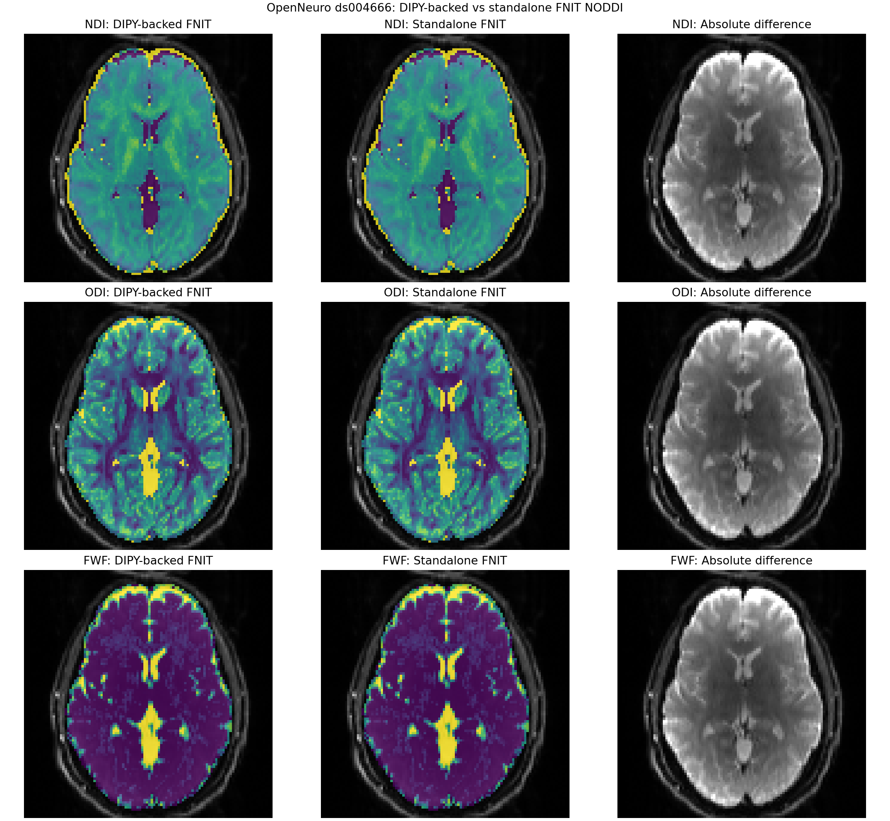

# AMICO-NODDI：无 DIPY 运行时依赖的 PyTorch 实现

`fnit.amico_noddi.TorchAMICONODDI` 生成 AMICO 2.0.3 风格的 145 原子 NODDI dictionary，并在 PyTorch 上执行三阶段拟合。当前代码的 OLS 主方向与 12 阶实球谐基由 NumPy/SciPy 实现；安装和运行 FNIT 不需要 DIPY。DIPY 1.12.1 与官方 [AMICO 2.0.3](https://github.com/daducci/AMICO/tree/v2.0.3) 仅用于**独立参考**。默认允许 CUDA TF32，方向和球谐几何用 float64，dictionary/影像用 float32，活动集求解用 float64；不使用 float16/bfloat16。包内的 AMICO 方向表及许可见 [`licenses/AMICO-2.0.txt`](../../licenses/AMICO-2.0.txt)。

本次替换的验收分两层：**相同真实输入下，新代码与替换前 FNIT 的五张输出逐元素一致；与既有冻结官方 AMICO 输出的 `1e-7` 阈值未通过**。后者的差异在替换前代码中同样存在，成因尚未证实。因此目前只主张消除了 DIPY 依赖且保留旧 FNIT 数值，不主张在当前环境中与官方 AMICO 全输出一致。完整公开聚合数值见[验证记录](../../validation/amico_noddi/report.public.json)。

## 完整拟合的输入与输出

| 参数 | 输入结构 | 含义 |
|---|---|---|
| `data` | 4D NIfTI `[X,Y,Z,V]` | EDDY 校正后的 DWI，至少一个 b0 和一个扩散加权 volume。 |
| `mask` | 3D NIfTI `[X,Y,Z]` | 与 DWI 对齐；只有数值**等于 1**的体素进入拟合。 |
| `bvecs` | 文本 `3×V` 或 `V×3` | 与 DWI volume 顺序相同的 EDDY rotated b-vector。 |
| `bvals` | 长度 `V` 文本 | 默认按 100 s/mm² 取整；`b<=100` 为 b0。 |
| `device` | `"cuda:0"` 或 `"cpu"` | PyTorch 拟合设备；GPU 是默认使用方式。 |
| `config` | `AMICONODDIConfig` 或 `None` | `None` 采用 AMICO 2.0.3 的默认 NODDI 参数。 |
| `output_dir` | 路径 | 五张 NIfTI 的输出目录。 |
| `naming` | `"amico"` 或 `"ukb"` | 选择文件名约定，数值定义不变。 |
| `overwrite` | `bool` | 是否覆盖同名输出。 |

`run` 返回 `AMICONODDIResult`：`ndi`、`odi`、`fwf`、`directions`、`rmse` 均为 nibabel NIfTI 图像，前三者分别是细胞内/神经突密度、方向离散度、游离水比例，后两者是 `[X,Y,Z,3]` 主方向和 `[X,Y,Z]` 归一化信号拟合 RMSE；mask 外为零。`qc` 字典记录设备、时间、峰值显存、有效体素数和 solver 诊断。`qc["amico_numerically_equivalent"]` 当前为 `False`，表示固定真实数据的官方 `1e-7` 对照未通过；`qc["amico_reference_compared_for_this_input"]` 为 `False`，因为每次 `run()` 不会自动运行官方参考。`naming="amico"` 的文件名依次为 `fit_NDI.nii.gz`、`fit_ODI.nii.gz`、`fit_FWF.nii.gz`、`fit_dir.nii.gz`、`fit_RMSE.nii.gz`；`naming="ukb"` 为 `NODDI_ICVF.nii.gz`、`NODDI_OD.nii.gz`、`NODDI_ISOVF.nii.gz`、`NODDI_dir.nii.gz`、`NODDI_RMSE.nii.gz`。影像 shape、dtype 与 affine 的对照结果见下表。

```python
from fnit import TorchAMICONODDI

# data: 单例 4D EDDY 校正 DWI；mask: 相同网格上的 3D 二值脑掩膜。
# bvecs: EDDY 旋转后的梯度文本；bvals: 与 DWI 第四维顺序相同的 b 值文本。
model = TorchAMICONODDI(device="cuda:0", config=None)
result = model.run(
    data="eddy/data.nii.gz",
    mask="eddy/nodif_brain_mask.nii.gz",
    bvecs="eddy/data.eddy_rotated_bvecs",
    bvals="AP.bval",
    output_dir="noddi",   # 写入五张参数/方向/残差 NIfTI。
    naming="amico",      # 使用官方 AMICO 的 fit_* 文件名。
    overwrite=False,     # 同名文件已存在时停止。
)
# result.ndi/odi/fwf/directions/rmse: 五张 nibabel 图像；result.qc: 运行诊断。
```

命令行与上述五个输入和输出目录一一对应：

```bash
fnit amico-noddi \
  -k eddy/data.nii.gz \
  -m eddy/nodif_brain_mask.nii.gz \
  -r eddy/data.eddy_rotated_bvecs \
  -b AP.bval \
  -o noddi \
  --naming amico \
  --device cuda:0
```

其中 `-k/-m/-r/-b/-o` 分别传 DWI、mask、b-vector、b-value 和输出目录；`--naming` 选文件名；`--device` 选 PyTorch 设备。需要覆盖时显式增加 `--overwrite`。默认每次处理一个受试者。

## 三个替换算子及原软件操作

内部算子可从 `fnit.amico_noddi.kernels` 导入；它们由上面的 `run` 自动调用。`amico_scheme` 先将 b-value 取整并建立 `[V,4]` 的 `raw`（前三列 b-vector、末列 b-value）、`[V]` 布尔 b0 掩膜和一维 shells 数组。下例中的 `signal` 是 mask 内 `[M,V]` float64 归一化 DWI，`bvals`/`bvecs` 是相同输入的 NumPy 数组。

```python
from fnit.amico_noddi.kernels import (
    _rotation_auxiliary, _subject_basis, amico_scheme, principal_directions,
)

raw, b0, shells = amico_scheme(
    bvals=bvals,
    bvecs=bvecs,
    b0_threshold=100.0,
    b_step=100.0,
)
directions = principal_directions(signal=signal, raw=raw)
fit, rotated, constants, m0 = _rotation_auxiliary()
volume_indices, basis = _subject_basis(raw=raw, shells=shells, b0=b0)
```

| 算子 | 输入 → 输出结构 | 计算及独立官方对应 | 真实数据同输入结果；CPU 计算时间 |
|---|---|---|---|
| `principal_directions(signal, raw)` | `[M,V]` 归一化信号和 `[V,4]` 梯度方案 → `[M,3]` float64 主方向 | OLS 设计矩阵、最小二乘、3×3 对称张量特征分解，对应 AMICO 中 DIPY `TensorModel(..., fit_method="OLS")`。 | 207,696 体素的 623,088 个方向分量与 DIPY 1.12.1 完全相同；FNIT 0.642 s、DIPY 1.753 s。 |
| `_rotation_auxiliary()` | 无参数 → `fit [91,500]`、`rotated [500,91]`、`constants [91]`、`m0 [91]` | 用 AMICO 固定 500 方向表计算 12 阶 legacy Descoteaux 实球谐旋转基，对应 AMICO `generate_kernels()` 使用的 DIPY `real_sh_descoteaux`。内部 `_real_sh_descoteaux(vectors)` 接收 `[N,3]`、返回 `[N,91]` float64。 | `fit` 和 `rotated` 各 45,500 个系数逐元素相同；FNIT 0.042 s、DIPY 0.377 s。 |
| `_subject_basis(raw, shells, b0)` | `[V,4]` 方案、`[S]` shell 列表、`[V]` b0 掩膜 → `[V_dwi]` int32 原 volume 索引和 `[V_dwi,91S]` float32 球谐基 | 按 shell 排列 DWI，建立 AMICO `generate_kernels()` 的采样基。 | 100 个 volume 索引和 18,200 个 SH 系数逐元素相同；FNIT 0.0039 s、DIPY 0.0046 s。 |

构建完整 NODDI dictionary 后，真实数据上 7,560,000 个 white-matter kernel 元素、105 个 isotropic 元素及 14,400 个 normalization 元素亦逐元素相同；FNIT 0.405 s、DIPY-backed 旧版 0.425 s。该分阶段计时在 CPU 节点以四个 BLAS/OMP 线程分别测量，已载入真实 DWI；不包含文件 I/O。三函数和内部 SH helper 都不导入 DIPY。

官方 AMICO 没有单行等价 shell 命令。以下 Python 序列是独立参考；`DWI.nii.gz`、`mask.nii.gz`、`bvals`、`bvecs` 应与 FNIT 输入指向**同一文件**，`bvals.scheme` 是生成的中间梯度表，`AMICO/fit_*` 是输出：

```python
import amico

amico.core.setup(lmax=12)
ae = amico.Evaluation(study_path=".", subject=".", output_path=None)
amico.util.fsl2scheme(
    bvalsFilename="bvals",
    bvecsFilename="bvecs",
    schemeFilename="bvals.scheme",
    flipAxes=[False, False, False],
    bStep=100.0,
    delimiter=None,
)
ae.load_data(
    dwi_filename="DWI.nii.gz",
    scheme_filename="bvals.scheme",
    mask_filename="mask.nii.gz",
    b0_thr=100,
    b0_min_signal=0,
    replace_bad_voxels=None,
)
ae.set_model(model_name="NODDI")
ae.generate_kernels(regenerate=True, lmax=12, ndirs=500)
ae.load_kernels()
ae.set_solver(lambda1=0.5, lambda2=1e-3)
ae.CONFIG["doComputeRMSE"] = True
ae.fit()
ae.save_results(path_suffix=None, save_dir_avg=False)
```

这段参考序列只在 benchmark 环境运行；FNIT 包没有 AMICO、DIPY 或 SPAMS 的运行时导入或依赖。

## 实际数据的完整输出比较

冻结的一例真实 UKB 格式 EDDY 校正 DWI 为 `104×104×72×105`，有 5 个 b0、100 个扩散方向，mask 内 242,261 体素。当前 FNIT 与替换前 FNIT 在**同一环境、同一输入哈希**下逐元素相同：NDI、ODI、FWF、RMSE 各 `242,261/242,261`，方向 `726,783/726,783`，输出 shape、dtype、affine 相同。当前进程末尾未加载 `dipy`。

冻结的官方 AMICO 输出来自先前的独立环境。当前 FNIT **与替换前 FNIT 对它的误差完全相同**，所以如下误差不是本次依赖替换引入的；但 `max_abs≤1e-7` 的官方一致性门槛在当前环境**未通过**。跨环境差异有方向符号变化和数值求解差异，当前证据不足以确定单一原因。

| 与冻结 AMICO 输出比较 | MAE | 最大绝对误差 | 超过 `1e-7` 的元素 |
|---|---:|---:|---:|
| NDI | 2.25e-6 | 0.04073 | 75,235 / 242,261 |
| ODI | 7.91e-6 | 0.05376 | 76,620 / 242,261 |
| FWF | 3.15e-6 | 0.06689 | 71,702 / 242,261 |
| RMSE | 7.79e-9 | 0.000354 | 165 / 242,261 |
| 主方向分量 | 0.06736 | 1.99926 | 48,657 / 726,783 |

| 实现 | 完整进程墙钟 | `run()` 墙钟 | 峰值内存 |
|---|---:|---:|---:|
| 冻结官方 AMICO 2.0.3，CPU，先前独立参考 | 29.24 s | — | 旧参考 RSS 3.30 GB |
| 替换前 FNIT，H100，同次配对 | 26.77 s | 22.752 s | PyTorch 分配 12.432 GB |
| 当前无 DIPY FNIT，H100，同次配对 | 26.59 s | 22.965 s | PyTorch 分配 12.432 GB；进程 RSS 峰值 1.75 GB |

完整进程计时使用 `/usr/bin/time`，包含 Python 启动、kernel/方向/拟合、NIfTI 读写；`run()` 计时从接口调用到五张输出保存。官方记录是之前独立运行，不能把这三项看作严格配对加速比。当前主方向 1.115 s、kernel 0.657 s、solver 14.858 s；在同一环境的替换前版本分别为 1.358、0.801、14.325 s。峰值是 `torch.cuda.max_memory_allocated()`，不是整卡占用。上述冻结官方输入的 12.432 GB 低于 20 GB；公开样本的峰值另见下表。详细精度、时间与验收布尔量见[机器可读报告](../../validation/amico_noddi/report.public.json)。私人影像、逐文件输入哈希和官方结果只留在授权服务器。

## 公开 ds004666 示例图与显存边界

独立的公开 OpenNeuro ds004666 单例使用同一 FSL EDDY 校正 AP DWI、旋转 b-vector、b-value 和与其 affine 完全一致的脑掩膜，shape 同为 `104×104×72×105`，mask 内 227,343 体素。旧 FNIT（DIPY-backed）与当前无 DIPY FNIT 的 NDI、ODI、FWF、RMSE 各 `227,343/227,343` 逐元素相同，方向 `682,029/682,029` 个分量相同，五图 shape、dtype、affine 也相同。该公开样本**没有独立官方 AMICO 输出**，图只验证本次依赖替换的逐值保持；上文冻结官方对照采用另一例真实 DWI。

| ds004666 运行 | 完整进程墙钟 | `run()` 墙钟 | PyTorch 峰值已分配显存 |
|---|---:|---:|---:|
| 替换前 FNIT | 34.32 s | 28.614 s | 20.916 GB |
| 当前无 DIPY FNIT | 30.01 s | 25.063 s | 20.916 GB（19.48 GiB） |

该样本**超过项目的 20 GB 十进制目标**。曾在同一数据上试验方向组分批：可降低峰值，但另一真实输入的求解耗时明显增加，因此已回退，当前代码仍按 500 个 LUT 方向一起求解。这里不将未保留的分批结果列为当前性能。两次运行顺序固定、节点共享，时间不应解读为严格加速比。



图为同一公开 DWI 的轴向切片，背景是平均 b0，左、中列分别为 DIPY-backed 旧 FNIT 与当前无 DIPY FNIT，右列是绝对差；全体积三张参数图均逐元素相同。图中不包含 UKB 个人影像。绘图工具 `tools/plot_noddi_public_comparison.py` 接收 `--brain` 平均 b0、`--mask` 相同 DWI 网格掩膜、`--reference-dir` 旧版五图目录、`--candidate-dir` 当前五图目录、`--output` PNG 路径和 `--title` 图题。

## 复现同输入比较

`tools/benchmark_noddi_dipy_replacement.py` 固定真实 DWI 的 mask 内方向、LUT、SH 和 kernel 数组；`tools/benchmark_noddi_dipy_full.py` 对五张真实输出计算逐元素差、时间与显存。前者以 `--mode reference` 配合替换前源码、`--mode candidate` 配合当前源码运行；两次应使用同一 Python/NumPy/SciPy 环境和完全相同的输入路径。后者还以 `--official-dir` 指定独立官方 AMICO `fit_*` 输出，以 `--old-fnit-dir` 指定替换前 FNIT 输出。两个工具的详细内部 JSON 包含路径和输入哈希，应只留在受控服务器，公开仓库只保留汇总数值。`--dwi`/`--data` 是校正 DWI，`--mask` 是脑掩膜，`--bvals`/`--bvecs` 是配对梯度，`--output-dir` 是输出目录，`--device` 是计算设备，`--label` 标记比较角色。
