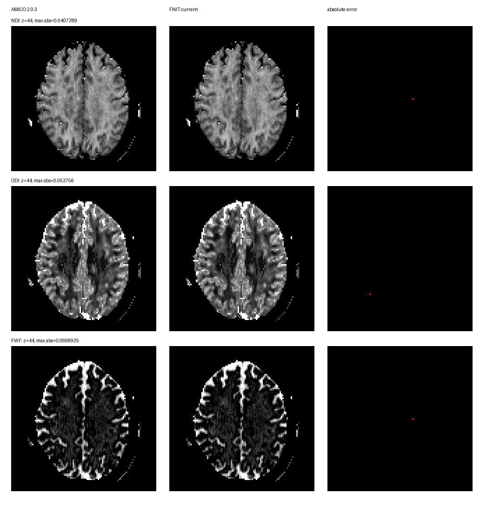

# PyTorch AMICO-NODDI

`TorchAMICONODDI` 根据 [AMICO 2.0.3](https://github.com/daducci/AMICO/tree/v2.0.3) 的 NODDI 参数和 500 个查找表方向，生成 response kernel 并在 PyTorch 中完成三阶段拟合。OLS 张量主方向由 NumPy 计算，12 阶实球谐基由 SciPy 计算。安装和推理均不需要 DIPY 或 AMICO。包内的方向表许可见 [AMICO 许可证](../../licenses/AMICO-2.0.txt)。

DWI、response kernel 和结果图使用 float32；活动集求解使用 float64。GPU 的 float32 运算默认允许 TF32，未使用 float16 或 bfloat16。默认每批最多处理 400 个 LUT 方向，实测峰值 PyTorch 显存为 9.95 GB。当前默认 Conda 安装的输出**未通过**与官方 AMICO 2.0.3 的 `1e-7` 数值一致门槛；具体差异见下文。

## 输入

| 参数 | 含义与格式 | 检查条件 |
|---|---|---|
| `data` / `--data` / `-k` | 单被试 EDDY 校正后的 4D NIfTI DWI | 至少一个 b0 和一个扩散加权 volume；最后一维按采集顺序排列 |
| `mask` / `--mask` / `-m` | 同一 DWI 网格上的 3D NIfTI 脑掩模 | 仅值等于 1 的体素参与拟合；前三维与 DWI 相同 |
| `bvecs` / `--bvecs` / `-r` | 与 DWI 各 volume 对应的 FSL 3×N 或 N×3 文本矩阵 | 推荐 EDDY 输出的旋转后 bvec；扩散加权方向需接近单位长度 |
| `bvals` / `--bvals` / `-b` | 与 bvec 顺序一致的 N 个 b-value，单位 s/mm² | 默认按 100 取整，`b ≤ 100` 为 b0 |
| `output_dir` / `--output-dir` / `-o` | 五张结果 NIfTI 的目标目录 | 已有同名文件时须明确设置 `overwrite=True` 或 `--overwrite` |
| `device` / `--device` | PyTorch 设备，如 `cuda:0` 或 `cpu` | 不指定时优先使用 CUDA |
| `naming` / `--naming` | `amico` 或 `ukb` | `amico` 输出 `fit_*`，`ukb` 输出 `NODDI_*`；默认 `ukb` |
| `overwrite` / `--overwrite` | 是否覆盖已有结果 | 默认 `False` |

`AMICONODDIConfig` 控制 `d_par`、`d_iso`（轴突内和各向同性扩散率）、`ic_vfs`、`ic_ods`（字典网格）、`lambda1`、`lambda2`（求解正则）、`b0_threshold`、`b_step`（梯度预处理）、`kkt_tolerance`、`cg_tolerance`、`maximum_active_steps`（活动集停止条件），以及 `lut_batch_size`（一次进入 GPU 的 LUT 方向数）。默认建立 145 个 dictionary atom 和 500 个 LUT 方向；只调整批大小不会改变模型定义。完整默认值在 [`AMICONODDIConfig`](../../src/fnit/amico_noddi/core.py) 中。

## Python 调用

```python
from fnit import AMICONODDIConfig, TorchAMICONODDI

config = AMICONODDIConfig(
    lut_batch_size=400,  # 同时送入 GPU 的 LUT 方向上限；正整数
)
model = TorchAMICONODDI(
    device="cuda:0",  # 执行拟合的 PyTorch 设备
    config=config,   # NODDI 参数、求解阈值和显存批大小
)
result = model.run(
    data="eddy/data.nii.gz",               # 单被试 4D DWI
    mask="eddy/nodif_brain_mask.nii.gz",  # 与 DWI 同网格的 3D 掩模
    bvecs="eddy/data.eddy_rotated_bvecs", # 与 volume 对应的旋转后 bvec
    bvals="AP.bval",                       # 与 volume 对应的 b-value
    output_dir="noddi",                   # 五张 NIfTI 输出所在目录
    naming="amico",                       # 使用 fit_* 输出名称
    overwrite=False,                       # 已有同名文件时停止
)

ndi = result.ndi               # float32 NIfTI：细胞内体积分数
odi = result.odi               # float32 NIfTI：方向离散指数
aqueous_fraction = result.fwf  # float32 NIfTI：各向同性游离水比例
directions = result.directions # float32 4D NIfTI：OLS 张量主方向，末维为 3
rmse = result.rmse             # float32 NIfTI：归一化信号拟合 RMSE
qc = result.qc                 # 参数、体素数、分阶段耗时及峰值显存字典
```

`run()` 读取输入、计算 kernel、估计主方向、拟合并写出文件；返回的 `AMICONODDIResult` 还持有五个 `nibabel.Nifti1Image`。只需内存结果时可调用 `model(data="eddy/data.nii.gz", mask="eddy/nodif_brain_mask.nii.gz", bvecs="eddy/data.eddy_rotated_bvecs", bvals="AP.bval")`，四个具名输入的含义与上例相同。`result.save(output_dir="noddi", naming="amico", overwrite=False)` 返回 `{输出路径: NIfTI 对象}` 字典，三个具名参数的含义也与上例相同。

| 结果字段 | `naming="amico"` | `naming="ukb"` | 数据结构与含义 |
|---|---|---|---|
| `ndi` | `fit_NDI.nii.gz` | `NODDI_ICVF.nii.gz` | 3D float32，细胞内体积分数 |
| `odi` | `fit_ODI.nii.gz` | `NODDI_OD.nii.gz` | 3D float32，方向离散指数 |
| `fwf` | `fit_FWF.nii.gz` | `NODDI_ISOVF.nii.gz` | 3D float32，游离水比例 |
| `directions` | `fit_dir.nii.gz` | `NODDI_dir.nii.gz` | 4D float32，最后一维为 x、y、z 三个主方向分量 |
| `rmse` | `fit_RMSE.nii.gz` | `NODDI_RMSE.nii.gz` | 3D float32，归一化信号拟合误差 |
| `qc` | 不单独写文件 | 不单独写文件 | Python 字典，包含设备、耗时、显存和验证状态 |

上述图像在 mask 外为零，沿用输入的空间信息。`qc["amico_numerically_equivalent"]` 当前固定为 `False`，表示默认安装未取得官方严格数值一致认证；它不是针对本次输入自动完成的比较。

## 命令行调用

```bash
DWI=eddy/data.nii.gz                    # EDDY 校正后的 4D 图像
MASK=eddy/nodif_brain_mask.nii.gz      # 与 DWI 同网格的 3D mask
BVECS=eddy/data.eddy_rotated_bvecs     # 旋转后的 3×N bvec
BVALS=AP.bval                          # N 个 b-value
OUT=noddi                              # 五张结果图的输出目录
fnit-amico-noddi \
  --data "$DWI" \
  --mask "$MASK" \
  --bvecs "$BVECS" \
  --bvals "$BVALS" \
  --output-dir "$OUT" \
  --naming amico \
  --device cuda:0
```

`--naming amico` 选择 `fit_*` 文件名，`--device cuda:0` 选择第一块可见 GPU。需要覆盖同名结果时加 `--overwrite`。`fnit amico-noddi` 与 `fnit-amico-noddi` 使用同一参数；命令行一次处理一个被试。

## 官方 AMICO 2.0.3 对照命令

官方 AMICO 使用 Python 调用序列，没有等价的单行 shell 命令。下例仅用于独立基准核验，FNIT 推理不会导入或调用它。

```python
import amico

amico.core.setup()  # 准备官方查找表
amico.util.fsl2scheme(
    bvalsFilename="bvals",          # N 个 b-value 的文本文件
    bvecsFilename="bvecs",          # 对应的 3×N 梯度方向
    schemeFilename="DWI.scheme",    # 写出的 AMICO scheme 文件
    bStep=100,                       # b-value 的取整间隔
)
evaluation = amico.Evaluation(
    study_path=".",  # 包含被试目录的路径
    subject=".",     # 当前被试目录
)
evaluation.load_data(
    dwi_filename="DWI.nii.gz",  # 4D DWI
    scheme_filename="DWI.scheme",  # 上一步生成的 scheme
    mask_filename="mask.nii.gz",  # 同网格脑掩模
    b0_thr=100,  # b0 阈值，单位 s/mm²
)
evaluation.set_model(model_name="NODDI")  # 选择 NODDI 模型
evaluation.generate_kernels(regenerate=True)  # 按当前 scheme 生成 response kernel
evaluation.load_kernels()  # 读取刚生成的 kernel
evaluation.set_solver(lambda1=0.5, lambda2=1e-3)  # 三阶段求解所用正则系数
evaluation.CONFIG["doComputeRMSE"] = True  # 同时输出 RMSE
evaluation.fit()  # 计算五张结果图
evaluation.save_results()  # 在 AMICO 输出目录写出图像
```

## 真实 DWI 验证

gpucw1 的同一例真实 UKB 格式 DWI 大小为 `104×104×72×105`，含 5 个 b0、50 个约 b1000、50 个约 b2000，mask 内共有 242,261 个体素。四个输入文件的 SHA256、逐图误差和计时见[机器可读报告](../../validation/amico_noddi/report.public.json)。本次重新运行的官方 AMICO 五图与原官方归档逐元素相同。

新 NumPy/SciPy 实现与同一环境、仍调用 DIPY 的旧 FNIT 完整输出逐元素相同：NDI、ODI、FWF、RMSE、方向图的最大绝对差均为 0。OLS 中间方向与 DIPY 1.12.1 的 726,783 个 float64 分量逐元素相同；旋转球谐矩阵和被试基矩阵也逐元素相同。新实现运行结束没有导入 DIPY。

默认 Conda NumPy 1.26.4 下，FNIT 与新跑出的官方 AMICO 比较如下。前三张图的门槛为最大绝对误差 `≤ 1e-7`；方向图要求每个分量完全相同。

| 输出 | 平均绝对误差 | 最大绝对误差 | 超过 `1e-7` 的元素 |
|---|---:|---:|---:|
| NDI | 2.25e-6 | 0.040729 | 75,235 / 242,261 |
| ODI | 7.91e-6 | 0.053756 | 76,620 / 242,261 |
| FWF | 3.15e-6 | 0.066893 | 71,702 / 242,261 |
| RMSE | 7.79e-9 | 0.000354 | 165 / 242,261 |
| 方向分量 | 0.067358 | 1.999260 | 48,657 / 726,783 |

官方 AMICO 的离线参考环境使用 PyPI NumPy 1.26.4 `cp311-cp311-manylinux_2_17_x86_64` wheel。仅在验证进程中将这个 NumPy 放到当前 FNIT 源码之后的 `PYTHONPATH`，其余代码与输入不变，方向图和 RMSE 与官方逐元素相同，NDI、ODI、FWF 最大绝对误差均为 `5.96e-8`。这一条件性结果说明 NumPy 二进制线性代数实现影响了严格逐元素验收。仓库的 Conda 安装目前仍使用 conda-forge NumPy，因此不能把 wheel 条件下的通过结果写成默认安装保证，也没有为了 AMICO 改动全仓 NumPy 来源。

| 实测运行 | 设备 | 进程 wall time | 主方向阶段 | PyTorch 峰值显存 |
|---|---|---:|---:|---:|
| 新实现，默认 Conda NumPy | H100 PCIe | 34.82 s | 0.97 s | 9.95 GB |
| 旧 FNIT，默认 Conda NumPy + DIPY | H100 PCIe | 36.21 s | 1.82 s | 9.95 GB |
| 新实现，参考 PyPI NumPy wheel | H100 PCIe | 25.17 s | 见机器报告 | 9.95 GB |

这些是共享节点上的单次实际运行。官方 AMICO 本次完整写出五图后用时 28.65 s，但验证脚本随后的路径检查写错而返回状态 1；经独立脚本核验，五图与原官方归档逐元素相同。原有一次干净的官方运行耗时 29.24 s。不同 NumPy 环境和节点负载不能构成成对加速比。



原始 DWI、官方结果和开发期中间量不进入仓库。
