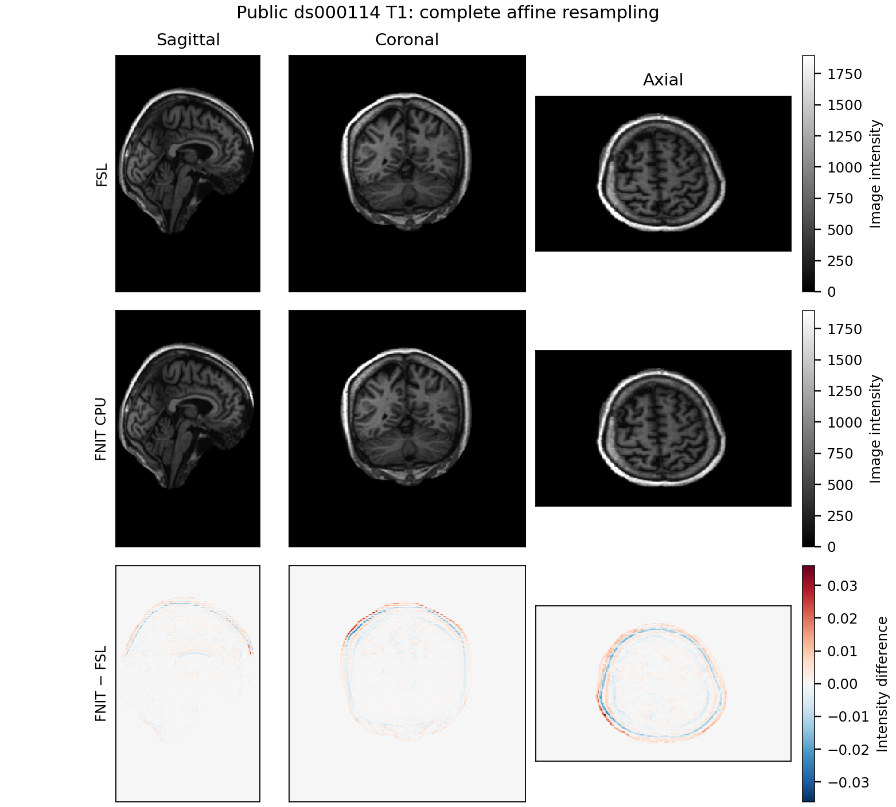

# ApplyWarp：2026-10-04 CPU 官方 benchmark

## 1. 功能与本轮范围

本报告覆盖 FSL scaled-mm 普通入口的 25 个完整真实操作，各用 1 和 8 线程预算，共 50 组配对。包括 dense 场三种约定、FNIRT cubic coefficient、premat/postmat、五种保存类型、nearest/trilinear、完整 105 帧 DWI 的分帧政策及多图 `prepare()`。显式 RAS world 入口与普通 FSL 入口使用不同坐标和边界协议，其结果另列，不能套用本表的官方速度比。

CPU 优化复用原 PyTorch 浮点算术：按轴生成坐标、优化源张量布局、对大网格分批查询。整数输出修复为 FSL NEWIMAGE 的直接 C cast：先截断，再按目标整数类型转换。nearest 的公开全 T1 五种输出均与官方逐值一致；trilinear 接近整数边界的浮点差异仍可能变成整数差异。

## 2. Python、输入与输出

完整参数、变量名和注释示例见 [功能说明](README.md#2-python-调用输入和输出)。本轮公开 T1 来自已去脸的 [OpenNeuro ds000114 v1.0.2](https://openneuro.org/datasets/ds000114/versions/1.0.2)，CC0；输入 `256×156×256`，输出同样是完整三维网格。另用一例完整 `104×104×72×105` DWI，通过 premat 仿射矩阵采样到同一原输入网格，共 81,768,960 个输出值；这组三种分帧配置没有传入 warp。所有变换在配对内使用同一文件，测试不裁剪或减少帧。

多图计划包含一次坐标准备、FA、MD 和完整 105 帧 DWI 三份影像的读取、采样和保存；官方链包含三次完整 `applywarp`。三份输入共享原输入空间与输出网格，使用同一 premat，未传入 warp。默认分帧与 chunk=1/8 都输出完整 105 帧；它们是内存政策，不是不同样本规模。

## 3. 命令行复现

```bash
python tools/benchmark_multimodal_cpu.py run \
  --manifest /private/real_applywarp_cases.json \
  --candidate-root /path/to/frozen_candidate \
  --baseline-root /path/to/frozen_baseline \
  --output-dir /private/applywarp_cpu_results \
  --cpuset 35,39,43,47,51,55,59,63 --threads 1,8 \
  --repetitions 3 --api-repetitions 0 --backends official,candidate \
  --lock-file /private/applywarp.cpu-timing.lock
```

案例 schema 见 [cpu_benchmark_case_schema.json](cpu_benchmark_case_schema.json)。真实文件路径保存在服务器私有 manifest；公开 JSON 只含功能标签、聚合指标和本项目源码 SHA-256。

## 4. 官方对应

```bash
applywarp --in=input.nii --ref=reference.nii --warp=coefficients.nii \
  --interp=trilinear --datatype=float --out=warped.nii
applywarp --in=labels.nii --ref=reference.nii --warp=dense.nii \
  --rel --interp=nn --datatype=short --out=labels_warped.nii
```

参照端固定 FSL 6.0.7.4。适配器 [benchmark_multimodal_cpu_applywarp.py](../../tools/benchmark_multimodal_cpu_applywarp.py) 生成完整命令；官方只由隔离 benchmark 启动。FNIT 生产运行时仍仅使用项目内的计算核。

## 5. 精度与耗时

nodecw10，Xeon Gold 6418H；双方用同一 CPU 亲和性和 1/8 线程上限。每项排除一组完整 warmup，保留三组交替 AB/BA，表中为完整进程中位数，包含启动、import、加载、完整计算及保存。节点为共享节点；实际 user/system CPU 使用另见 JSON。线程上限相同不意味着官方自动使用全部线程。

首个 adapter 调用的时间也单独保存：它排除 Python 启动与 Torch 配置，但包含功能模块的首次 import、完整读写。`--api-repetitions 0` 没有产生独立的已加载 API 重复，不把这个数称为“纯计算”或与官方 CLI 计算加速比。

| 完整操作 | 1线程 FSL / FNIT（s） | 8线程 FSL / FNIT（s） | 全网格相对 L2 / 最大绝对差 |
|---|---:|---:|---:|
| 公开全 T1，trilinear / char | 2.2452 / 4.7652 | 2.3238 / 3.0940 | 0.00352 / 255 |
| 公开全 T1，trilinear / short | 2.3045 / 5.2872 | 2.2042 / 3.3584 | 6.24e-05 / 1 |
| 公开全 T1，trilinear / int | 2.4069 / 4.9215 | 2.3157 / 3.6859 | 6.24e-05 / 1 |
| 公开全 T1，trilinear / float | 2.2967 / 5.6365 | 2.5488 / 3.7319 | 4.24e-06 / 0.0360107 |
| 公开全 T1，trilinear / double | 2.6722 / 5.3187 | 2.7814 / 3.3275 | 4.24e-06 / 0.0360107 |
| 公开全 T1，nearest / char | 2.0835 / 4.9361 | 1.6969 / 2.9845 | 0 / 0 |
| 公开全 T1，nearest / short | 1.7208 / 4.3641 | 1.8400 / 3.4253 | 0 / 0 |
| 公开全 T1，nearest / int | 1.7374 / 4.4747 | 1.9754 / 3.6627 | 0 / 0 |
| 公开全 T1，nearest / float | 1.8466 / 4.7489 | 1.9695 / 3.6132 | 0 / 0 |
| 公开全 T1，nearest / double | 2.1052 / 4.8756 | 2.4010 / 3.7823 | 0 / 0 |
| 真实 T1，coefficient / trilinear | 0.4642 / 2.3845 | 0.4722 / 2.1771 | 1.72e-06 / 0.0345001 |
| 真实 T1，coefficient / nearest | 0.6066 / 2.4844 | 0.4704 / 2.1744 | 0.000339 / 164.835 |
| 真实 T1，dense relative | 0.4571 / 2.5396 | 0.4919 / 2.3473 | 8.35e-07 / 0.0187988 |
| 真实 T1，dense absolute | 0.3951 / 2.5325 | 0.9555 / 2.7152 | 1.15e-06 / 0.0291138 |
| 真实 T1，dense auto | 2.4283 / 2.6544 | 2.3444 / 2.3999 | 1.6e-06 / 0.0376587 |
| 真实 T1，premat + postmat | 4.8405 / 2.4571 | 4.2642 / 2.1764 | 1.75e-06 / 0.0336304 |
| 真实图像，矩阵路径 / char | 0.1698 / 2.2332 | 0.1674 / 2.0143 | 0 / 0 |
| 真实图像，矩阵路径 / short | 0.1620 / 2.1524 | 0.1429 / 2.0933 | 0 / 0 |
| 真实图像，矩阵路径 / int | 0.1202 / 2.0402 | 0.2671 / 2.1021 | 0 / 0 |
| 真实图像，矩阵路径 / float | 0.1416 / 2.2076 | 0.1285 / 1.8597 | 0 / 0 |
| 真实图像，矩阵路径 / double | 0.1466 / 2.2983 | 0.1585 / 1.9281 | 0 / 0 |
| 完整 DWI，默认分帧 | 49.8613 / 8.8752 | 34.2808 / 5.5406 | 1.79e-06 / 0.523438 |
| 完整 DWI，chunk=1 | 51.6771 / 10.1288 | 49.5500 / 7.2684 | 1.79e-06 / 0.523438 |
| 完整 DWI，chunk=8 | 41.2591 / 7.7769 | 46.6313 / 6.4106 | 1.79e-06 / 0.523438 |
| 同网格真实 FA/MD/DWI，多图计划 | 38.1582 / 8.2667 | 40.3285 / 6.6266 | 1.96e-06 / 0.523438 |

50 组中，10 组满足完整进程速度不慢于官方。当前 50 组的完整 4D 分支是 premat 仿射路径，非线性 coefficient/dense 的官方对照为完整 3D 输入。2026-10-02 的完整 DWI→MNI 非线性历史另见功能页，不套用本表的时钟。完整 DWI 默认策略为 1 线程 `49.8613→8.8752 s`、8 线程 `34.2808→5.5406 s`；小型 3D 冷进程多数尚未达到速度目标，启动与 import 占比较高。

精度解释：公开 T1 的 nearest 五种类型都逐值一致。私有 coefficient nearest 有 4/902,629 个体素选择相邻源点，定位为累计坐标浮点精度落在半体素边界；最近邻不是普遍逐值一致。公开 T1 trilinear 连续值相对 L2 为 `4.24×10^-6`；char 有 2,307 个整数差异，其中少量跨 uint8 环绕边界，最大差 255，不能称为整数逐值一致。short/int 最大差 1。完整 DWI 相对 L2 为 `1.79×10^-6`。

### 独立完整 API 的分步骤时间

另对公开完整 T1、真实 coefficient T1 和完整 105 帧 DWI 做 1/8 线程完整路径 API 的一次 warmup 加三次重复。每轮重新读取输入并新建计划；排除 imports 和设备配置。步骤依次为读取/解码、变换坐标准备、全部采样与类型转换、保存。与原完整 worker 的输出逐值一致。官方 binary 没有公开相同分步骤计时，本节不计算阶段官方速度比。

| 完整操作 / 线程 | 读取（s） | 准备坐标（s） | 采样和 cast（s） | 保存（s） | 完整 API（s） |
|---|---:|---:|---:|---:|---:|
| 公开全 T1 / 1 | 0.1969 | 2.9284 | 0.5283 | 0.2041 | 3.8311 |
| 真实 coefficient T1 / 1 | 0.1060 | 0.3937 | 0.0589 | 0.0175 | 0.5753 |
| 完整 105 帧 DWI / 1 | 2.3080 | 0.2057 | 3.2734 | 1.4140 | 7.2338 |
| 公开全 T1 / 8 | 0.1334 | 0.9015 | 0.1839 | 0.1939 | 1.4152 |
| 真实 coefficient T1 / 8 | 0.0853 | 0.1700 | 0.0144 | 0.0169 | 0.2901 |
| 完整 105 帧 DWI / 8 | 1.9681 | 0.0501 | 0.5832 | 1.2771 | 4.0138 |

各列是自身三次中位数，不能将列中位数相加当作完整 API 中位数。原完整进程表与本节使用不同计时边界，各自保留。

### H100 GPU 回归

同一 H100 PCIe UUID、共同 GPU 计时锁、20 GB allocation 上限；每个操作两组 AB/BA，组内排除一次 warmup、三次完整 API。GPU 服务器存在其他作业，两个组的中位数分别展示，不合并成稳定加速结论。

| 完整操作 | 基线两个 API 中位数（s） | 候选两个 API 中位数（s） | peak allocation（GB） | 精度 |
|---|---:|---:|---:|---|
| 公开 T1 nearest / char | 0.4532 / 0.4353 | 0.4413 / 0.3887 | 1.536 | 官方与 CPU 逐值一致；修复旧 clip |
| 公开 T1 trilinear / char | 0.4788 / 0.4434 | 0.4056 / 0.3992 | 1.536 | 官方边界差异保留；GPU 对 CPU 最大差 1；CPU 对官方最大差 255 |
| 完整 105 帧 DWI | 3.5468 / 4.2189 | 3.6699 / 4.2000 | 0.720 | 与同 GPU 基线逐位一致 |

CUDA 的普通采样分支没有改变；完整 DWI 结果与同 GPU 基线逐位一致，峰值 allocation 相同。整数 cast 是 CPU/CUDA 共用的精度修复，因此 nearest char 与旧版输出发生有意变化，验收参照是官方。trilinear char 不作逐位官方一致声明。

聚合结果见 [benchmark_20261004.public.json](benchmark_20261004.public.json)。公开全 T1 图为三线性 float32 输出；图像只来自已核验的 CC0 公开案例。



## 6. 最近版本

| 版本 | 修改与结果 |
|---|---|
| all_v8，2026-10-04 | 当前完整 50 组官方 CPU 配对；按 FSL 直接 C cast 修正整数输出。 |
| all_v5，2026-10-04 | CPU 布局与网格分配优化；旧共享 CPU 组结果保留为历史，现由本报告取代当前结论。 |
| 2026-10-02 | 完整 105 帧分帧策略、计划复用与公共 world 入口；历史完整 pipeline 结果见功能页。 |

## 7. 参考文献与源码

- [FSL FNIRT User Guide：applywarp](https://fsl.fmrib.ox.ac.uk/fsl/docs/registration/fnirt/user_guide.html#applywarp)。
- Andersson, Jenkinson & Smith. *Non-linear registration, aka spatial normalisation*. FMRIB Technical Report TR07JA2 (2007)。
- [FSL 源码仓库](https://git.fmrib.ox.ac.uk/fsl)，本轮 native binary 版本与本项目源码 hash 已分别绑定。
- 原许可与派生代码范围见 [THIRD_PARTY_NOTICES.md](../../THIRD_PARTY_NOTICES.md)。
