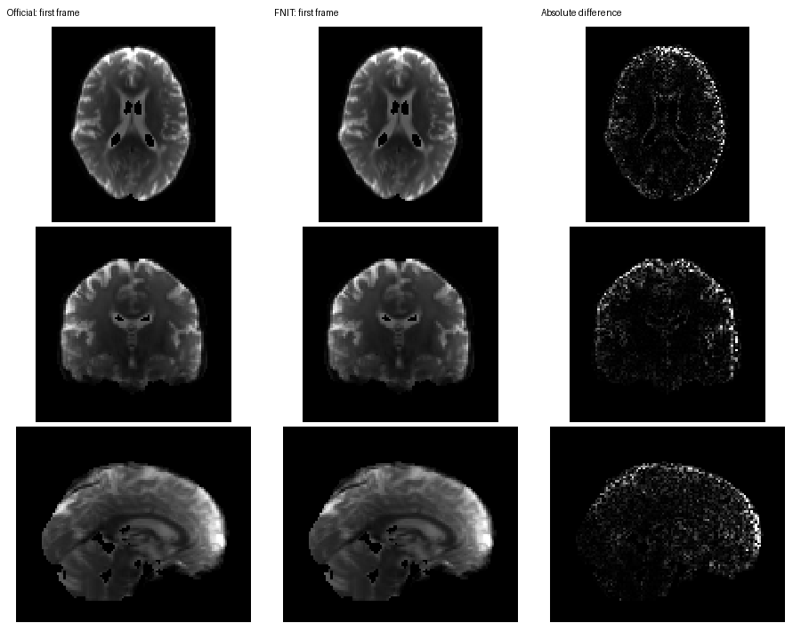
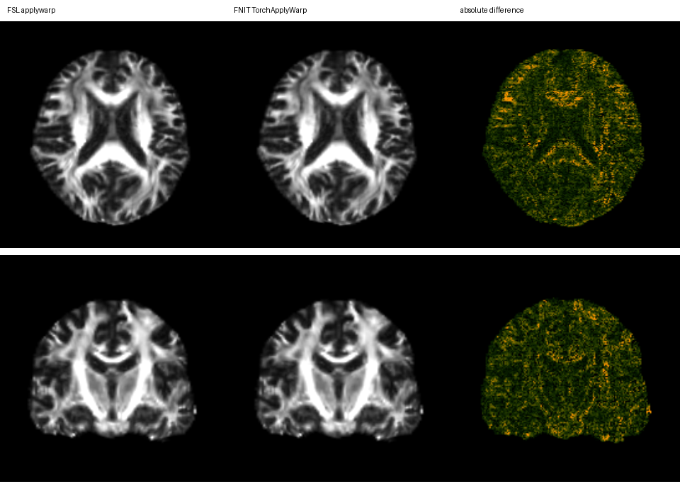

# TorchApplyWarp：FSL 变形场与显式 world 变换重采样

## 1. 功能简介

`TorchApplyWarp` 读取 FSL dense warp 或 FNIRT cubic coefficient，将 3D 图像或完整 4D 序列重采样到参考网格。新增 `apply_world()` / `run_world()` 接受显式 RAS world 变换链，支持 fMRI 的样条插值与逐帧运动组合。几何与 CUDA 计算使用 PyTorch，普通 CPU 入口复用 PyTorch 采样；World 的 `fmriprep` / `grid-constant` CPU 路径使用项目已有 SciPy，以匹配原版查询。NIfTI 读写使用 nibabel，运行时不调用 FSL。

同一 warp 可应用于全部时间帧，也可先创建采样计划，再传播同网格上的 FA、MD、组织概率图或标签图。计划复用变换坐标、插值网格、有效掩膜和最近邻索引；4D 采样按 channel 分块，复用 GPU 输入 buffer，并将结果直接回传到最终 CPU 数组。分块改变数据流，不减少体素或时间帧。

CUDA 默认开启 TF32 全局开关；FSL 几何和 cubic coefficient 展开显式使用 float64，影像插值保留原 float32。输出 dtype 由输入类型和 `output_dtype` 决定；float64 输出仍使用 float32 影像插值。没有使用 float16/bfloat16，也没有新增依赖。

## 2. Python 调用、输入和输出

### 2.1 完整 4D 序列

```python
from fnit.applywarp import TorchApplyWarp

corrected_dwi_path = "corrected_dwi.nii.gz"  # 输入：(X, Y, Z, T)，所有帧使用同一空间变换
reference_template_path = "FMRIB58_FA_1mm.nii.gz"  # 输入：定义输出空间网格的参考图
fnirt_coefficients_path = "dwi_to_template_coefficients.nii.gz"  # 输入：已估计的 intent-2007 系数
warped_dwi_path = "corrected_dwi_in_template.nii.gz"  # 输出：(Xref, Yref, Zref, T)

warper = TorchApplyWarp(
    device="cuda:0",  # 第一张可见 GPU；也可指定 "cpu"
    frame_chunk_size=None,  # CUDA 自动选择分帧大小；CPU 保持一次全通道采样
)
warped_dwi_result = warper(
    input=corrected_dwi_path,
    reference=reference_template_path,
    warp=fnirt_coefficients_path,
    premat=None,  # 可选：input → warp source 的 FLIRT scaled-mm 矩阵
    postmat=None,  # 可选：warp reference → output reference 的 FLIRT scaled-mm 矩阵
    interpolation="trilinear",  # 连续强度图；离散标签选择 "nearest"
    warp_convention="auto",  # 对无专用 intent 的 dense field 自动判断约定
    output_dtype="float",  # 输出 float32
)
warped_dwi_result.save(output=warped_dwi_path)
```

需要在同一次调用中保存时，使用相同 `warper.run(input=..., reference=..., output=..., warp=...)`。`save()` 的路径参数名是 `output`。

### 2.2 同网格多图复用

```python
import nibabel as nib
from fnit.applywarp import TorchApplyWarp

native_fa_image = nib.load("native_FA.nii.gz")  # 输入：采样计划的源空间几何
reference_template_image = nib.load("FMRIB58_FA_1mm.nii.gz")  # 输入：输出网格和 header
fnirt_coefficients_path = "dwi_to_template_coefficients.nii.gz"

warper = TorchApplyWarp(device="cuda:0", frame_chunk_size=32)
sampling_plan = warper.prepare(
    input=native_fa_image,
    reference=reference_template_image,
    warp=fnirt_coefficients_path,
    interpolation="trilinear",
    warp_convention="auto",
)

warped_md_result = sampling_plan.apply(
    input="native_MD.nii.gz",  # 与 native_FA 的空间 shape、affine 和 pixdim 完全相同
    output_dtype="float",  # 每张图独立决定输出类型
)
warped_md_result.save(output="MD_in_template.nii.gz")

warped_series_result = sampling_plan.apply(
    input="corrected_dwi.nii.gz",  # 时间帧数可以不同，源空间网格须相同
    reference=reference_template_image,  # 可省略；提供时核验完整 header 和 extensions
    output_dtype="float",
    frame_chunk_size=16,  # 只覆盖本次采样的分帧大小
)
warped_series_result.save(output="dwi_in_template.nii.gz")
```

`prepare()` 捕获 warp、矩阵、插值方式及源/参考几何。源空间发生变化时，重新创建计划；修改 warp 后也重新创建计划。计划不能在创建后切换插值方式。`plan.apply(frame_chunk_size=None)` 沿用创建计划时的政策。

函数入口也支持分帧参数：

```python
from fnit.applywarp import applywarp

warped_image_result = applywarp(
    input="corrected_dwi.nii.gz",  # 输入：完整 4D 序列
    reference="FMRIB58_FA_1mm.nii.gz",  # 输入：输出参考图
    warp="dwi_to_template_coefficients.nii.gz",  # 输入：已有 FNIRT warp
    device="cuda:0",  # 计算设备
    frame_chunk_size=32,  # 每块最多 32 帧
    interpolation="trilinear",  # 输入图像插值方式
    output_dtype="float",  # 输出 float32
)
warped_image_result.save(output="dwi_in_template.nii.gz")
```

### 2.3 参数

| 参数 | 输入格式、默认值和含义 |
|---|---|
| `device` | 构造函数/函数入口参数；`None` 自动选择可用 CUDA，否则 CPU；也可显式 `cpu`、`cuda`、`cuda:N`。CLI 默认 CPU。 |
| `frame_chunk_size` | 构造函数/函数入口参数；`None` 使用自动政策，正整数指定每块帧数。`plan.apply()` 的正整数覆盖仅限当前调用。 |
| `input` | NIfTI 路径或 NIfTI image；3D `(X,Y,Z)` 或 4D `(X,Y,Z,T)`，数据须有限。 |
| `reference` | NIfTI 路径或 image；前三维、affine、空间 pixdim 和 header 定义输出。`plan.apply()` 可省略，沿用创建计划的参考图。 |
| `warp` | 可选 NIfTI 路径或 image；dense field 或 intent-2007 cubic coefficients。省略时仅应用矩阵。 |
| `premat` | 可选有限可逆 4×4 数组或文本文件；input → warp source，采用 FLIRT scaled-mm 坐标。 |
| `postmat` | 可选有限可逆 4×4 数组或文本文件；warp reference → output reference，同样采用 FLIRT scaled-mm 坐标。 |
| `interpolation` | 默认 `trilinear`；也支持 `nearest`、`nn`、`nearest-neighbour`、`nearest_neighbor`。warp field 本身始终三线性采样。 |
| `warp_convention` | 默认 `auto`；可选 `relative`/`rel`、`absolute`/`abs`。只控制无专用 intent 的 dense field。 |
| `output_dtype` | 默认 `None`，遵循下方类型规则；可指定 `char`/uint8、`short`/int16、`int`/int32、`float`/float32、`double`/float64。不属于 `prepare()` 参数。 |
| `output` | `run()` 或 `result.save()` 的输出路径，支持 `.nii`/`.nii.gz`；保存会创建父目录并原子替换文件。 |

CUDA 自动分帧将帧工作 buffer 的估算预算限制为 8 GiB，不另设固定帧数上限；每帧按 `4 × (源体素数 + 2 × 目标体素数)` bytes 保守计入输入及输出。全部帧满足预算时，一次全通道采样；较长序列自动分块。该预算还扣除当前 PyTorch allocated 的张量，并相对十进制 20 GB 留 512 MiB 余量；已有计划坐标也包含在 allocated 中。显式分帧大小仍检查 20 GB 预算，单帧无法满足时报告错误。该政策不依据其他进程的全卡空闲显存选块。CPU 默认全通道，也可显式分帧。

### 2.4 输出结构

`ApplyWarpResult` 包含：

- `image`：3D 输入输出 `(Xref,Yref,Zref)`；4D 输入输出 `(Xref,Yref,Zref,T)`，包括保留单帧 4D 的末维。空间 affine、qform/sform code 和 voxel size 来自 reference，4D 的 `pixdim[4]`/TR 来自 input；其余 header 字段及时间单位沿用 reference。
- `valid_mask`：`(Xref,Yref,Zref)` 的 NumPy bool 数组。warp 和 input 均在支持域内时为真；所有帧共享该空间掩膜。
- `qc`：设备、实际 TF32 开关、warp representation/intent/convention、插值方式、有效比例和输出 dtype。

无效体素仍按原规则乘以 0，因此保留原结果可能出现的负零符号位。整数输出遵循原版 NEWIMAGE 的直接类型转换，向零截断，不做饱和裁剪；例如显式 `char` 会将大于 255 的有限 MRI 强度回绕到 uint8。未指定类型时，浮点输入输出 float32/float64；整数输入通常根据输出动态范围小于 100 时改为 float32，否则保留原类型。超过 10 帧的整数输入沿用 FSL 原有范围规则，比较第一帧最大值与第二帧最小值；不会对每块重新选择 dtype。

### 2.5 坐标、文件格式和范围

FSL scaled-mm 根据 header voxel size 缩放存储轴；当 NIfTI affine 的行列式为正时，翻转并平移第一轴。warp 三分量使用这三个 scaled-mm 轴的毫米值，不是 world-RAS。

对 output voxel `x`，`Vref`/`Vin` 为 reference/input 的 voxel → scaled-mm 矩阵：

```text
q = Vref x
r = inverse(postmat) q
dense relative: s = r + sample(warp, r)
dense absolute: s = sample(warp, r)
intent 2007:    s = inverse(embedded_affine) r + sample(cubic_residual, r)
u = inverse(Vin) inverse(premat) s
output(x) = input(u)
```

从输入描述变换顺序为 `premat → warp → postmat`；重采样从输出反查输入。nearest 使用 FSL 正半整数向上取整规则。

| intent | 表示 | 支持情况 |
|---:|---|---|
| 0 或其他 | `(Xwarp,Ywarp,Zwarp,3)` dense field | 支持 relative/absolute；`auto` 使用 FSL 标准差判别。 |
| 2006 | FNIRT dense displacement | 按 FSL 规则始终 relative。 |
| 2007 | cubic B-spline coefficients | 从 qform offset 读取 field size、intent 读取 voxel size、pixdim 读取 knot spacing、sform 读取 embedded affine；完全由 PyTorch 展开。 |
| 2008、2009 | DCT、quadratic coefficients | 明确拒绝。 |

仅支持一个 premat 和一个 postmat，同一变换应用全部帧。输入影像的 sinc/spline 插值、supersampling、padding、`--mask`、`--usesqform` 和逐帧矩阵未实现。

以上限制和坐标规则属于 FSL `__call__()` / `run()` 入口。SynthMorph 的 RAS pull displacement 使用该入口时，先经 `fnit.synthmorph.convert_warp_to_fsl(warp, moving=..., fixed=...)` 转为 intent-2006。显式 world 入口直接接受下面的 `WorldTransformChain`；两个入口的场数组和矩阵约定不能混用。

### 2.6 fMRI 的显式 world 变换链

```python
import numpy as np
from fnit.applywarp import TorchApplyWarp, WorldTransformChain

world_transform_chain = WorldTransformChain(
    reference="MNI152_T1_2mm.nii.gz",  # 3D 输出网格；空间 header 来自此文件
    reference_to_source_world=np.load("mni_affine_to_bold_world.npy"),  # 4×4 RAS mm pull affine
    pre_affine_pull_ras="mni_pull_ras.nii.gz",  # (Xref,Yref,Zref,3)，RAS mm 位移
    motion_pull_world=np.load("motion_pull_world.npy"),  # (T,4,4)，参考 BOLD → 每帧原始 BOLD
    coordinate_precision="fmriprep",  # 保留 volume preproc 已有的坐标舍入顺序
)
world_warper = TorchApplyWarp(device="cuda:0")
world_warper.run_world(
    input="original_bold.nii.gz",  # 完整 4D 原始 BOLD，不滤波时间轴
    transformation=world_transform_chain,
    output="preproc_bold_in_mni.nii.gz",
    interpolation="spline",  # nearest / linear / spline
    boundary="grid-constant",  # preproc 使用网格外零延拓
    output_mask="bold_mask_mni.nii.gz",  # 可省略；阈值 >0.5
    batch_size=8,  # 同时处理的帧数；不减少完整序列
    spatial_chunk_size=262144,  # 样条查询分块，不改变输出网格
)
```

| 参数 | 结构、含义及默认值 |
|---|---|
| `input` | 3D 或 4D NIfTI 路径/图像；含单帧的 4D 仍输出 4D。 |
| `transformation.reference` | 3D NIfTI 路径/图像，定义输出 shape、affine 和空间 header。 |
| `reference_to_source_world` | 4×4 RAS mm pull affine，从参考世界坐标到源参考帧世界坐标。 |
| `pre_affine_pull_ras` | 可选 target-grid `(Xref,Yref,Zref,3)` 位移。先加位移，再应用 affine；保留输入场的 float64。 |
| `motion_pull_world` | 可选 `(T,4,4)` RAS mm 矩阵，每帧在 affine 后应用；省略表示所有帧用同一变换。 |
| `coordinate_precision` | 默认 `float64`；`fmriprep` 保留已实现的场查询/坐标舍入顺序。 |
| `interpolation` | 默认 `spline`；可选 `linear`、`nearest`。CPU `fmriprep` / `grid-constant` 的 nearest 按 SciPy 原版查询；其余路径保留 PyTorch 最近邻舍入。 |
| `boundary` | 默认 `grid-constant`：样条使用 12 体素零预填充及 float64 系数；`periodic`：空间周期系数使用 float32，再按原输入支持域裁剪。 |
| `output_mask` | 可选 3D 输出空间 NIfTI，值 >0.5 为有效；乘法保留可能的负零。 |
| `batch_size` | 默认 8，正整数帧上限。CUDA 按坐标、FFT 系数和查询工作区保守检查十进制 20 GB 预算，超限报错；显式减小此值后重试。 |
| `spatial_chunk_size` | 默认 262144，正整数空间查询上限；可减小以降低工作区显存。 |
| `output` | `run_world()` 的输出路径，自动创建父目录。 |

`apply_world()` 返回 `nib.Nifti1Image`，`run_world()` 保存该图像并返回 `Path`。输出总是 float32，空间 qform/sform 及 code、extensions 来自 reference，4D TR 和时间单位来自 input。时间轴不插值。逐帧运动变换分别应用于完整帧，不能提前折叠成一张静态场。

fMRI volume 的 FNIRT 分支调用此入口；SynthMorph 分支调用共享同一数值核的 `apply_transform(WorldTransformChain)`。[volume 流程和终节点说明](../fmri/normalization.md)。已运动校正和清理的 `clean_mni` 使用 `periodic` 并省略 `motion_pull_world`，避免再次应用运动变换。

## 3. 命令行调用

```bash
# 输入为完整已校正 DWI；沿用同一 warp，不减帧。
fnit applywarp \
  --in corrected_dwi.nii.gz \
  --ref FMRIB58_FA_1mm.nii.gz \
  --warp dwi_to_template_coefficients.nii.gz \
  --interp trilinear \
  --datatype float \
  --device cuda:0 \
  --frame-chunk-size 32 \
  --out corrected_dwi_in_template.nii.gz
```

`fnit-applywarp` 使用相同参数。省略 `--frame-chunk-size` 使用自动政策。

volume 流程自动构造 `WorldTransformChain`。在 `fnit-fmri volume` 中选择 `--registration-backend fnirt`，其最终采样调用 `TorchApplyWarp.run_world()`；选择 `--registration-backend synthmorph` 则调用 `apply_transform()`。[完整 BIDS 命令和所有参数](../fmri/README.md#命令行调用)。

| CLI 参数 | Python 对应或作用 |
|---|---|
| `--in`、`--ref`、`--warp` | `input`、`reference`、`warp`。 |
| `--premat`、`--postmat` | 对应矩阵文本文件。 |
| `--interp` | `trilinear`、`nearest`、`nn`。 |
| `--rel` / `--abs` | 显式 relative/absolute，二者互斥；省略为 auto。 |
| `--datatype` | `char`、`short`、`int`、`float`、`double`。 |
| `--device` | 默认 CPU；GPU 显式指定 `cuda:N`。 |
| `--frame-chunk-size` | 正整数帧数上限；省略时自动。 |
| `--out` | 输出路径。 |
| `--overwrite` | 允许覆盖已有输出；默认拒绝覆盖。 |

## 4. 原软件调用

上述操作对应 FSL：

```bash
applywarp \
  --in=corrected_dwi.nii.gz \
  --ref=FMRIB58_FA_1mm.nii.gz \
  --warp=dwi_to_template_coefficients.nii.gz \
  --interp=trilinear \
  --datatype=float \
  --out=corrected_dwi_in_template.nii.gz
```

FSL 没有 FNIT 的 `--device`/`--frame-chunk-size` 参数。输入、warp、premat/postmat、插值和输出类型需相同，才构成固定变换比较。官方用法见 [FNIRT User Guide：applywarp](https://fsl.fmrib.ox.ac.uk/fsl/docs/registration/fnirt/user_guide.html#applywarp)。

## 5. 最新验证、精度和运行时间

### 最新完整 CPU 与 GPU 记录

CPU 完整进程包含启动、导入、全部输入读取、计算和保存；双方固定相同物理核和线程上限。普通入口参照为 FSL 6.0.7.4，World 参照为 fMRIPrep 25.2.4 的原生重采样函数。每行保留实际冻结版本与统计协议。

| 完整操作及来源 | 1 CPU：原版 / FNIT（s） | 8 CPU：原版 / FNIT（s） | 统计范围 |
|---|---:|---:|---|
| 公开全 T1，trilinear / float，[v23 补测](cpu_normalization_all23_official_20261004.public.json) | 2.493 / 4.545 | 1.996 / 3.052 | 各一次完整观察；小型操作仍慢于官方。 |
| 105 帧 DWI，原网格 premat，[v8 矩阵](benchmark_20261004.public.json) | 49.861 / 8.875 | 34.281 / 5.541 | warmup 后三组配对中位数；81,768,960 值。 |
| 同病例 105 帧 DWI→MNI 系数，[CPU25](mni_dwi_105_20261004.public.json) | 457.843 / 11.243 | 431.278 / 7.571 | 各一次完整观察；94,776,045 值。 |
| World 完整 490 帧，[v20 数值核](world_cpu_latest_20261004.public.json) | 301.475 / 241.778 | 56.297 / 46.831 | 各一次完整观察；442,288,210 值。 |

GPU 表比较起始 FNIT `1d31e7b` 与各冻结候选。完整 API 包含输入读取、计算、CPU 回传及保存，排除进程启动和入口导入，函数内惰性导入计入。普通两例和 MNI 例各完成两组 AB/BA，每进程 warmup 一次再测三次，共 16 次保存；World 为两版各一次完整 490 帧调用，无 warmup。

| 完整 H100 操作 | 起始 FNIT API（s） | 候选 API（s） | 两版 peak allocation（B） | 全输出门槛 |
|---|---:|---:|---:|---|
| 公开全 T1，GPU23 | 0.594 / 0.573 | 0.564 / 0.540 | 1,536,427,520 | 16 次的 10,223,616 值及完整 metadata 逐位一致。 |
| 105 帧原网格 premat，GPU23 | 3.930 / 3.764 | 3.912 / 3.908 | 719,979,008 | 16 次的 81,768,960 值及完整 metadata 逐位一致。 |
| 105 帧→MNI 系数，GPU26 | 5.836 / 6.107 | 5.498 / 5.395 | 777,303,040 | 16 次的 94,776,045 值及完整 metadata 逐位一致。 |
| World 完整 490 帧，GPU20 | 34.103 | 36.943 | 2,002,300,416 | 442,288,210 值及整份保存文件逐字节一致。 |

[GPU23 普通入口](../../validation/multimodal_cpu_20261004/gpu_final_v23_20261004.public.json)、[GPU26 MNI 传播](../../validation/multimodal_cpu_20261004/gpu_inv_mni_v26_20261004.public.json)与 [GPU20 World](../../validation/multimodal_cpu_20261004/gpu_world_v20_20261004.public.json)分别保存源码 SHA、协议和 GPU 负载。当前普通入口 core 与 GPU26 的 SHA 相同，World 数值核与 GPU20 相同；GPU23 保留当时的冻结来源，后续 prepared CPU 门控没有改变 CUDA 算式。GPU 均使用同一 H100 UUID、TF32 和十进制 20 GB allocation 上限；共享负载时钟不作稳定速度结论。

### 普通入口 CPU 功能矩阵与实现

2026-10-04 的 CPU 候选保留原 PyTorch 三线性算术、float64 变换坐标和 float32 影像采样。源张量改用适合逐体素读取各时间帧的内存布局；较大的输出网格将查询点分成互不重叠的 batch，复用同一个只读源张量，使 PyTorch CPU 原有线程池能并行采样。线程数沿用调用方设置；代码不会更改全局线程预算。CUDA 仍调用原单 batch 内核；普通 nearest 保持原算法。world 的独立 CPU 精度修复及实现范围见 [World CPU 报告](WORLD_CPU_BENCHMARK_20261004.md)。

第二版 CPU 候选将对角 scaled-mm 网格改为逐轴广播，减少完整 voxel mesh 的分配；float32 插值 grid 逐轴写入最终数组，保留原 float64 归一化算术和最后的 float32 转换。系数场的 float64 采样仍使用原 grid 路径。每份官方对照报告另外给出完整输出、明确指定的脑掩膜或参考非零区域及其外部的误差、不同值数量、保存 dtype 和实际存储 slope/intercept。参考非零区域不自动称作脑掩膜。

在冻结初版的真实 T1 coefficient 最近邻对照中，完整 `91×109×91` 输出有 4 个体素不同（902,629 个中的 `4.43×10^-6`），均在参考脑内且距半体素边界 `1.30×10^-6` 至 `7.27×10^-6` voxel。最大强度差来自选中相邻源体素；不是零掩膜或输出边界错误。官方 `warpfns` 将各级坐标和矩阵系数求值为 float，FNIT 几何保持 float64；仅把最终坐标转为 float32 反而产生 7 个不同体素，因此不据此修改最近邻规则。该诊断绑定初版 core `06ddc20de69be9519e079448feb2419a6fa1eb9de35232b55cf4dddbbaf2112a`，不能代替第二版完整官方回归。

源 all_v8 的普通 FSL 入口在 nodecw10 完成 25 个完整真实操作、各 1/8 线程，共 50 组配对。每项排除一次完整 warmup、保留三组交替 AB/BA；双方使用相同 CPU 亲和性和线程上限。完整结果、所有保存类型与 H100 回归见 [CPU 官方报告](CPU_BENCHMARK_20261004.md)和[聚合 JSON](benchmark_20261004.public.json)。后文的历史 GPU 数字保留其原测量范围。

| 完整操作 | 1 线程 FSL / FNIT（s） | 8 线程 FSL / FNIT（s） | 精度 |
|---|---:|---:|---|
| 完整 105 帧 DWI，原网格 premat，默认分帧 | 49.8613 / 8.8752 | 34.2808 / 5.5406 | 全部 81,768,960 个值，相对 L2 `1.79×10^-6`。 |
| 同网格 FA/MD/105帧 DWI，计划复用 | 38.1582 / 8.2667 | 40.3285 / 6.6266 | 一次计划、三份影像完整读写；相同 premat，无 warp；逐图误差见 JSON。 |
| 公开全 T1，trilinear / float | 2.2967 / 5.6365 | 2.5488 / 3.7319 | 相对 L2 `4.24×10^-6`，最大差 0.0360。 |
| 公开全 T1，nearest / char | 2.0835 / 4.9361 | 1.6969 / 2.9845 | 与官方逐值一致。 |

本轮 105 帧输入与输出均为 `104×104×72×105`，通过 premat 采样，未使用非线性 warp。表中时间包含完整进程启动、import、输入加载、完整计算和保存。50 组有 10 组达到不慢于官方的完整进程速度目标；小型 3D 冷进程多数尚未达标。另记录首个 adapter 调用的时间，它仍包含功能模块首次 import，不能称为纯计算或已加载 API。完整 DWI 与同 GPU 基线逐位一致，GPU 峰值 allocation 保持 0.720 GB。

成熟子函数的整数输出发现并修复一个实际错误：旧版先 clip 到整数范围，FSL NEWIMAGE 则直接执行 C cast。现按官方截断与整数环绕规则转换；公开全 T1 的 nearest 五种保存类型均逐值一致。trilinear 在接近整数边界处仍有浮点舍入差异，char 最大差 255、short/int 最大差 1，不作整数逐值一致声明。这项精度修复同时适用于 CPU/CUDA。

| 公共功能 | 真实数据官方对应 | 覆盖方式 |
|---|---|---|
| 3D 连续强度与完整 4D 序列 | FSL `applywarp --interp=trilinear` | 完整网格及所有帧，分别保存 `.nii` / `.nii.gz`，相同后缀配对。 |
| dense relative / absolute / auto | FSL `--rel` / `--abs` / 省略约定参数 | 固定真实变换，relative 与 absolute 由同一场转换；专用 intent 2006 按 FSL 约定处理。 |
| FNIRT cubic coefficient，intent 2007 | FSL `applywarp --warp=<coefficient>` | 固定同一系数文件，包括嵌入仿射。 |
| nearest / `nn` | FSL `--interp=nn` | 已完成完整 T1 最近邻及五种保存类型；解剖标签输入另做逐标签 Dice 检查。 |
| premat、postmat、两者组合、无 warp 的矩阵路径 | FSL 对应矩阵参数 | 按 FLIRT scaled-mm 方向使用相同文件；完整输入输出。 |
| 自动 dtype / char / short / int / float / double | FSL 默认或 `--datatype` | 保存后检查数据类型、数值范围、截断及空间/时间 metadata。 |
| `prepare()` 多图复用 | 每张图各一次 FSL `applywarp` | 候选包含一次计划创建和所有图读写；官方包含全部逐图命令。 |
| `frame_chunk_size` | 同一完整 FSL 4D 操作 | 属于 FNIT 的内存政策，官方没有此参数；不减少任何时间帧。 |
| `apply_world()` / `run_world()` | 显式 RAS 位移、仿射和逐帧运动的组合链 | linear/nearest/spline、两种 boundary 和坐标精度分别核对；没有通用的同名 FSL 参数，未建立相同原始操作链前不计算官方速度比。 |

适配器 [benchmark_multimodal_cpu_applywarp.py](../../tools/benchmark_multimodal_cpu_applywarp.py) 只生成隔离参照端的官方命令，生产代码不调用 FSL。真实文件路径通过私有 manifest 提供。完整进程、首个 adapter 调用与独立 warmup 后的 API 分别记录；本轮 50 组未执行独立已加载 API 重复。

### 同病例完整105帧DWI→MNI系数路径

新增同一实际 EDDY/FA pipeline 的完整105帧输入，经最新原版TBSS三阶段系数到`91×109×91×105`，共94,776,045个值。CPU25各一次完整官方/FNIT进程为457.8428/11.2433 s（1线程上限）、431.2784/7.5706 s（8线程上限）；官方实际平均约一核。全网格RMSE为0.002595、相对L2为`2.08846×10⁻⁶`，所有值有限，已核对的dtype、空间/时间几何与保存缩放一致；两预算每个后端的保存文件互相完全相同。这是新单次观察；CPU50的原网格premat记录继续按原范围保留。

完整输入来源、所有参数、官方命令、步骤时钟及最新H10026全16次位级/显存门槛见[本例七段说明](MNI_DWI_CPU_BENCHMARK_20261004.md)和[JSON](mni_dwi_105_20261004.public.json)。临床影像仅公开聚合数据，图示复用已公开CC0 T1。

### 显式 world 入口：完整 fMRI volume

最新 World 对照固定完整 `88×88×64×490` 输入和 `91×109×91×490` 输出。1/8 CPU 的原版→FNIT 完整 API 为 291.460→239.193 s、46.610→45.040 s，各一次观察；双方均限制 OpenBLAS 子线程为 1，8 CPU 的原版原生帧并发数为 8。全部 442,288,210 值对正确官方参照仅有 113 个不同，max 0.00048828125；脑内仅 10 个不同，max 1.52588e-5。header、extensions、affine、TR 和时间单位相同。功能覆盖、并发异常诊断和 GPU20 完整记录见 [World CPU 专页](WORLD_CPU_BENCHMARK_20261004.md#55-最新-cpu-输出布局修订完整-490-帧-18-cpu-通过)。

2026-10-02 将 FNIRT 分支的最终脑掩膜、clean MNI、preproc T1w 和 preproc MNI 接入 `run_world()` / `apply_world()`。从相同 BIDS 输入开始重新运行，原 FNIT `6f67cc0` 与候选的 12 幅保存影像逐位相同，包含全部 490 帧、正负零、完整 header 与 extensions；文本及 FNIRT 求解 QC 一致。实际调用栈确认四个节点均走公共入口。allocated / reserved 峰值为 6.50 / 10.78 GB。完整 API 含保存为 511.09→542.12 s，这是共享服务器的单轮观测，本轮没有整链提速证据。[完整报告及脑图](../../validation/fmri/public_resamplers_20261002/README.md)。

下面是 2026-10-02 完整 DWI→MNI 非线性历史，属于另一份真实输入/参考/warp 合同。它与上方 2026-10-04 的原网格 premat CPU50 记录分开保留，不挪用旧时钟。

2026-10-02 已完成最终自动策略的完整 105 帧 DWI、3D FA，以及 FastVBM、volume、dMRI 三条 FNIRT pipeline 验证。原 FNIT 与新代码在同一设备上的输出逐位一致；全部记录见 [registration lossless 验收](../../validation/registration_lossless_20261002/README.md)。

### 最终默认策略：105 帧完整 DWI

输入为 `104×104×72×105`，输出为 `91×109×91×105`，固定同一官方 FNIRT coefficient。最终 auto 在本例选择全部 105 帧；全部 94,776,045 个输出值的位模式、完整 header、TR、有效掩膜和保存后重读均通过。

| 当前配置 | 冻结旧版 | 最新自动策略 | 计时范围 |
|---|---:|---:|---|
| API 中位数 / s | 0.886 | 0.813 | 已解码完整输入，两次；含坐标和 GPU/CPU 搬运，排除读写与校验。 |
| 路径输入 API / s | 3.700 | 3.838 | 单次，含读取、计算和回传，排除保存；本例未见稳定文件入口加速。 |
| peak allocated / GB | 1.157 | 0.777 | API 运行，十进制 GB。 |

独立 FSL `applywarp` 的模板脑内 23,990,715 个值：Pearson r=0.999999999997，MAE=0.001514，RMSE=0.004125，最大绝对误差=0.446289。shape、affine、dtype、TR 和空间/时间单位相同；未使用的 `pixdim[5:8]` 分别为 FSL 的 0 与 FNIT 的 1。跨软件仍有微小浮点差异，同一 FNIT 设备的无损门禁为逐位一致。

完整 CLI 另行实测，包含进程启动、读取和 gzip 保存：FNIT 单 GPU **18.43 s**，FSL CPU 8 线程 **500.62 s**，均为全 105 帧、同一输入与变换。这是各一次、共享服务器上的观测；不把 API 时间与原软件文件入口直接计算比值。[最终 API 报告](../../validation/registration_lossless_20261002/components_apply_final.public.json)、[完整 CLI 报告](../../validation/registration_lossless_20261002/cli_final.public.json)、[官方对照](../../validation/registration_lossless_20261002/official_warp.public.json)。



### 第一阶段配置记录：分帧选择

输入为 `104×104×72×105`，输出为 `91×109×91×105`，固定同一 FNIRT warp。各配置完整 warmup 输出逐位一致，包括正负零、header/TR 和有效掩膜；正式 API 使用已解码输入，排除加载、保存和校验，每配置两次计时。

| 第一阶段配置 | 正式 API 中位数 / s | peak allocated / GB |
|---|---:|---:|
| 冻结旧版全通道 | 0.8256 | 1.157 |
| 当时 auto：最多 64 帧、1 GiB | 0.9985 | 0.501 |
| 显式 128，上限截为全部 105 帧 | 0.7984 | 0.777 |

本例一次处理全部 105 帧比拆成 64 帧更快，并满足显存预算。因此自动政策改为按 8 GiB 工作预算和 resident 张量后的 20 GB 预算选块，取消固定 64 帧上限。表中数字保留为第一阶段显式配置记录；最终默认入口的完整 105 帧结果见上表。3D FA 的最终完整输出也逐位一致，API 约 0.051 s、peak allocated 1.969 GB；该 3D 单次观测未显示计算加速。阶段聚合及全部配置见 [component_tuning.public.json](../../validation/registration_lossless_20261002/component_tuning.public.json)。

本轮无损门禁使用冻结 FNIT `7473452` 与最新代码在**同一设备、同一输入和变换**上的对照：全部体素的位模式，包括正负零；完整 header/extensions、affine、shape、dtype、TR、有效掩膜；保存后重读。单独记录读取、API、坐标准备、采样、保存、CUDA allocated/reserved 与分帧参数。正式计时不使用 profiler；CUDA profiler 仅用于另外的诊断运行。复现工具为 [benchmark_warp_4d_lossless.py](../../tools/benchmark_warp_4d_lossless.py)，使用服务器私有 JSON 指定真实路径，不裁剪或减少帧。

### 2026-09-27：固定官方 FNIRT warp 的真实 3D FA

一例真实 UKB 格式 dMRI，输入 TBSS 预处理后 native FA、`FMRIB58_FA_1mm` 和 FSL intent-2007 coefficient，参照为 FSL 6.0.7.4 `applywarp`。当时 core SHA-256 为 `cf6de438f3ac1551804d38682ce3fbb11b8fb042ad881562ebc93aada80f2df5`。

| 指标 | 结果 |
|---|---:|
| 输出 shape / affine / dtype | 一致 |
| 非零并集体素 | 1,548,144 |
| Pearson r | 0.999999999994 |
| MAE / RMSE | 3.55e-7 / 5.87e-7 |
| 最大绝对误差 | 1.18e-5 |
| 有效比例 | 0.565360 |
| H100 peak allocated | 1.958 GB |
| FNIT 三次 wall，中位数 | 0.337 / 0.259 / 0.364 s，0.337 s |
| FSL 三次 wall，中位数 | 6.19 / 5.11 / 5.67 s，5.67 s |

FNIT 包含读取、展开、重采样和 CPU 回传，排除保存；FSL 包含读取、计算和保存。计时边界不同，不计算加速比。这是单例、连续 FA、三线性和固定 coefficient 的历史官方对照。



原始聚合记录见 [report.real.current.json](../../validation/applywarp/report.real.current.json)，复现入口见 [validate_real.py](../../validation/applywarp/validate_real.py)。另一对公开 T1w 的 intent-2006 固定 warp 对照见 [SynthMorph 转换验证](../synthmorph/README.md#fsl-warp-转换真实-t1w)。

## 6. 最近更新与 benchmark 记录

| 日期 | 更新 | 验证记录 |
|---|---|---|
| 2026-10-04，GPU23/26/20 汇总 | 普通全 T1、原网格 premat、同病例 MNI 系数传播与 World 完整 490 帧分别保留实际来源。 | 本页最新表列完整 CPU 进程、GPU API 与显存；GPU 数值和完整 metadata 一致，共享时钟不作稳定速度结论。 |
| 2026-10-04，CPU25/GPU26补测 | 同病例真实EDDY105帧和最新TBSS系数的完整MNI2mm传播，另核对重复CPU FP64 prepared查询的静态坐标优化。 | [MNI完整官方对照与步骤](MNI_DWI_CPU_BENCHMARK_20261004.md)、[CPU坐标门槛](CPU_NORMALIZATION_20261004.md)；H10026的全部array/header/ext/affine与基线位级一致，peak相同。 |
| 2026-10-04，all_v8 | CPU 三线性布局、query batch 与坐标分配优化；修复整数 clip 与 FSL 直接 cast 不一致。 | [50 组真实 CPU 官方配对及 H100 回归](CPU_BENCHMARK_20261004.md)；10 组达到完整进程速度目标，公开 nearest 五种保存类型逐值一致。 |
| 2026-10-02，公共 world 入口 | 新增 `WorldTransformChain` 与 `apply_world()` / `run_world()`；共享成熟的 world 数值核，保留样条边界、逐帧运动与 metadata。 | [完整 490 帧与实际调用验证](../../validation/fmri/public_resamplers_20261002/README.md)。 |
| 2026-10-02，上一轮 | 4D channel 分块、GPU 输入 buffer 复用、直接回传最终数组、nearest 索引缓存、原地乘法 mask；新增构造函数/函数入口/CLI 分帧参数。按第一阶段完整 DWI 的吞吐结果，自动政策改为 8 GiB 工作预算、取消固定 64 帧上限。 | [最终默认与三条 pipeline 验收](../../validation/registration_lossless_20261002/README.md)通过；保留[第一阶段配置实测](../../validation/registration_lossless_20261002/component_tuning.public.json)。 |
| 2026-10-02，前轮 | `ApplyWarpPlan` 复用 float64 几何和 float32 grid；跨图严格核验源网格及参考 header/extensions。 | 同一真实病例九图传播：原逐图调用→计划，热调用中位数 0.365734295→0.180841511 s；全部 voxel/header/affine/mask 及 TBSS 后处理一致。[九图报告](../../validation/dmri_pipeline/map_propagation_20261002.md)。 |
| 2026-09-27 | 固定官方 coefficient 的 3D FA 采样。 | 上节官方精度和时间。[聚合 JSON](../../validation/applywarp/report.real.current.json)。 |

九图计时包含计划创建、九图采样和 CPU 回传，排除输入读取、FA 预处理、保存及配准估计；它衡量固定 warp 传播，不代表 FNIRT 或整个 pipeline 的耗时。定向测试在 [tests/applywarp](../../tests/applywarp)，覆盖 3D/4D、dense/coefficient、nearest/linear、整数类型、完整 header、缓存失效和正负零。

## 7. 参考文献和原实现

- Andersson, Jenkinson & Smith. *Non-linear registration, aka spatial normalisation*. FMRIB Technical Report TR07JA2 (2007)，[原文](https://www.fmrib.ox.ac.uk/datasets/techrep/tr07ja2/tr07ja2.pdf)。
- [FSL FNIRT User Guide：applywarp](https://fsl.fmrib.ox.ac.uk/fsl/docs/registration/fnirt/user_guide.html#applywarp)。
- [官方 `applywarp.cc` 源码](https://git.fmrib.ox.ac.uk/fsl/fugue/-/blob/master/applywarp.cc)，位于 FSL `fugue` 仓库；[FNIRT 系数/场工具源码](https://git.fmrib.ox.ac.uk/fsl/fnirt)。
- [FNIT 当前实现](../../src/fnit/applywarp/core.py)。
