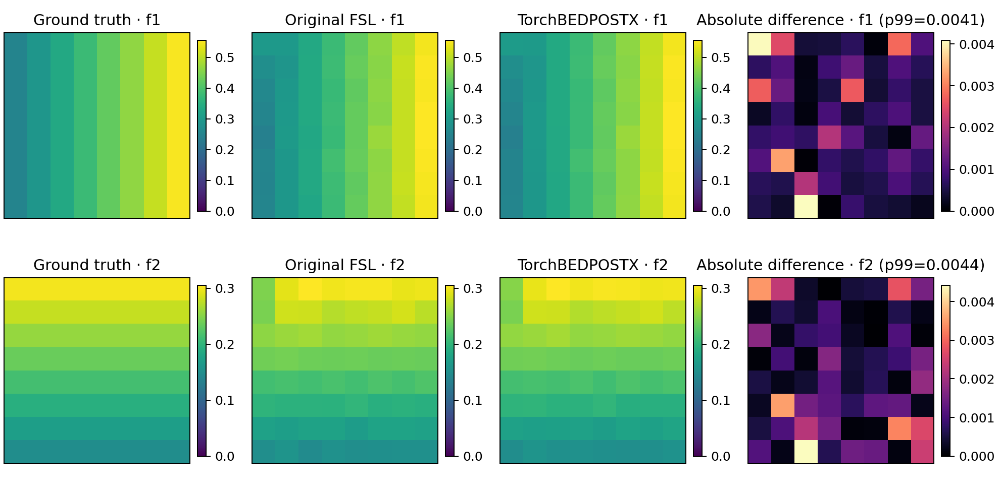

# TorchBEDPOSTX

`TorchBEDPOSTX` samples voxelwise orientations and fractions for up to three crossing fibres from diffusion MRI. It implements the ball-and-stick signal model with Gaussian residuals, a sparse prior on subsidiary fibre fractions, and Metropolis sampling. The default `model=2` uses a Gamma distribution of diffusivities for multi-shell data. The code runs in float32 on CPU or CUDA; CUDA matmul uses TF32 where supported. It does not require an installed FSL runtime.

## Input and Python use

Provide one subject directory with `data.nii.gz` (4D diffusion signal), `nodif_brain_mask.nii.gz` (3D diffusion-space mask with matching affine), `bvals`, and `bvecs`. `bvecs` may be 3 × N or N × 3; the package normalizes nonzero vectors. The diffusion signal should already have undergone the desired motion, eddy-current, and susceptibility corrections, with matching rotated `bvecs`.

```python
from fnit.bedpostx import TorchBEDPOSTX

result = TorchBEDPOSTX(device="cuda:0")('/absolute/path/to/subject')
print(result.output_dir, result.nvoxels, result.nsamples)
```

The default output is `/absolute/path/to/subject.bedpostX`; pass `output_dir=` to change it. Existing nonempty output directories require `overwrite=True` (or CLI `--overwrite`). Default parameters mirror the FSL `bedpostx` wrapper: 3 fibres, model 2, 1000 burn-in iterations, 1250 subsequent iterations, and one saved draw every 25 iterations (50 draws per voxel). The class also accepts `nfibres`, `model` (1 or 2), `burnin`, `njumps`, `sample_every`, `ard_weight`, `chunk_size`, `seed`, and `threads`. For example, `TorchBEDPOSTX(device="cpu", threads=8, nfibres=2)`.

## Command line

```bash
fnit bedpostx --subject-dir /absolute/path/to/subject --device cuda:0
# The standalone `fnit-bedpostx` command accepts the same options.
```

Use `--output-dir` to choose another destination. `--nfibres`, `--model`, `--burnin`, `--njumps`, `--sample-every`, `--ard-weight`, `--chunk-size`, `--seed`, and `--threads` correspond to the Python options.

## Output and interpretation

`merged_th<i>samples.nii.gz`, `merged_ph<i>samples.nii.gz`, and `merged_f<i>samples.nii.gz` are 4D MCMC draws for fibre *i*. Fibres are sorted by posterior mean fraction at each voxel. `mean_f<i>samples.nii.gz`, `dyads<i>.nii.gz`, mean diffusivity/baseline images, and `nodif_brain_mask.nii.gz` support quality checks. The orientation sample and mask filenames match the files read by FSL `probtrackx2`. `run.json` records the parameters, voxel count, draw count, and wall time for reproducible comparisons.

This is an independent implementation of the published model and algorithm, not a copy of FSL's `xfibres` C++. Its tensor initialization, random number generator, floating-point order, and resulting proposal histories differ from FSL. Thus posterior volumes are not expected to be byte-identical. Compare posterior fraction maps, orientation axes with sign-invariant angular error, and downstream streamline density and connectivity to an original FSL run at matching settings. Do not infer anatomical connectivity probability directly from raw streamline counts; seed voxel count and number of samples affect them.

## Matched FSL benchmark

The [current public report](../../validation/bedpostx/report.public.json) records the exact metrics, runtimes, source hashes, and diagnostic controls. On gpucw1, both implementations processed the same 14 masked voxels from a 7 × 13 × 7 × 105 UK Biobank DWI crop with model 2, three fibres, ARD weight 1, 1000 burn-in jumps, 1250 sampling jumps, one saved draw every 25 jumps, and seed 8665904. Original FSL 6.0.7.22 used CPU `xfibres --cnonlinear`; the current TorchBEDPOSTX code used CPU with one thread or one H100 GPU in float32/TF32. Only aggregate values are public; DWI and subject maps remain on the research server.

| Output, current GPU versus FSL CPU | MAE | Pearson *r* | Interpretation |
| --- | ---: | ---: | --- |
| Mean first-fibre fraction | 0.01088 | 0.99918 | Median sign-invariant principal-axis difference 0.66° |
| Mean second-fibre fraction | 0.01282 | 0.52640 | FSL ROI mean 0.02361; no jointly supported axis |
| Mean third-fibre fraction | 0.004538 | 0.58033 | FSL ROI mean 0.005968; no jointly supported axis |
| Mean diffusivity | 0.0001170 mm²/s | 0.96080 | |
| Mean diffusivity standard deviation | 0.0002166 mm²/s | 0.52974 | Short-chain estimate is unstable |

No second- or third-fibre voxel reached mean fraction ≥ 0.1 in both runs, so their orientation errors and map correlations have limited meaning. The current one-thread CPU run had first-fibre fraction MAE 0.01393, *r* = 0.99767, and median axis difference 0.53°. Its mean-diffusivity MAE was 0.0001187 mm²/s; its diffusivity-standard-deviation MAE was 0.0002387 mm²/s.

| Same-host wall time for 14 voxels | Seconds |
| --- | ---: |
| Original FSL CPU | 10.99 |
| Current Torch CPU, one thread | 22.54 |
| Current Torch H100 GPU 1 | 39.91 |

The timing includes process startup and file I/O and does not predict whole-brain throughput. FSL `xfibres` returned status 255 after writing valid 50-draw volumes for all 14 voxels; the Torch runs returned status 0. As an interoperability check on the **current GPU output**, original FSL `probtrackx2` loaded three fibres with 50 draws per voxel and completed 20/20 requested streamlines. Its 7 × 13 × 7 density image summed to 57 and `waytotal` was 20; its log ended with `finished` despite status 255.

## Chain stability and weak fibres

The same ROI was rerun with FSL tensor initialization (`--nospat`) and with longer chains. The extended runs used 5000 burn-in and 5000 sampling jumps, saving every 100th jump; all runs therefore retained 50 draws per voxel. These controls use the **current** Torch code.

| Run | Initialization | Burn-in / jumps | Mean f2 | Mean f3 | Mean `d_std` (mm²/s) |
| --- | --- | ---: | ---: | ---: | ---: |
| FSL CPU, standard | nonlinear | 1000 / 1250 | 0.02361 | 0.005968 | 0.0002243 |
| FSL CPU, tensor control | tensor | 1000 / 1250 | 0.01902 | 0.000199 | 0.0002782 |
| FSL CPU, extended | nonlinear | 5000 / 5000 | 0.01586 | 0.001475 | 1.01×10⁻⁸ |
| Torch CPU, standard | tensor | 1000 / 1250 | 0.02049 | 0.004256 | 0.0001446 |
| Torch H100, standard | tensor | 1000 / 1250 | 0.02303 | 0.002811 | 8.18×10⁻⁶ |
| Torch CPU, extended | tensor | 5000 / 5000 | 0.01305 | 0.001572 | 3.54×10⁻¹⁰ |

[FSL's model-2 source](../../src/fnit/_vendor_fsl/sources/fdt-2604.0/fibre.h) adds `log(d_std)` and, for subsidiary fibres under ARD, `log(f)` to the energy. These terms drive values toward zero; without a positive lower bound, the corresponding continuous density is non-integrable there. FSL's own `d_std` ROI mean fell by more than four orders of magnitude with the longer chain, while its tensor-versus-nonlinear short runs differed by MAE 0.000198 mm²/s. The current Torch long run differed from FSL's long run by `d_std` MAE 1.05×10⁻⁸ mm²/s and mean-f2 MAE 0.00400. Correlations among near-zero `d_std` values are not informative. Interpret the standard run as a finite-chain FSL-compatible estimate, with stronger evidence for the first-fibre fraction and axis in this ROI.

## Shareable synthetic example

The [generator](synthetic_example.py) creates an 8 × 8 × 1 multi-shell DWI with two known crossing-fibre fraction maps and no human imaging data. Run original FSL and the current Torch code with the settings above and `--nf=2`, then render the [current comparison image](synthetic_example.png):

```bash
python docs/bedpostx/synthetic_example.py /tmp/bedpostx-synthetic
export FSLOUTPUTTYPE=NIFTI_GZ
xfibres --data=/tmp/bedpostx-synthetic/subject/data.nii.gz \
  --mask=/tmp/bedpostx-synthetic/subject/nodif_brain_mask.nii.gz \
  --bvals=/tmp/bedpostx-synthetic/subject/bvals \
  --bvecs=/tmp/bedpostx-synthetic/subject/bvecs \
  --nf=2 --model=2 --fudge=1 --bi=1000 --nj=1250 --se=25 \
  --cnonlinear --seed=8665904 --forcedir \
  --logdir=/tmp/bedpostx-synthetic/fsl_cpu
fnit bedpostx --subject-dir /tmp/bedpostx-synthetic/subject \
  --output-dir /tmp/bedpostx-synthetic/fnit_gpu --device cuda:0 --nfibres 2
python docs/bedpostx/synthetic_example.py /tmp/bedpostx-synthetic --plot
```



| Synthetic run, 64 voxels | Wall time | f1 MAE to truth | f2 MAE to truth | f1 / f2 MAE to FSL |
| --- | ---: | ---: | ---: | ---: |
| Original FSL CPU | 28.55 s | 0.004145 | 0.004321 | Reference |
| Current Torch CPU, one thread | 21.62 s | 0.004377 | 0.004400 | 0.000902 / 0.001218 |
| Current Torch H100 GPU 1 | 30.81 s | 0.004268 | 0.004290 | 0.000955 / 0.001042 |

The current GPU-to-FSL fraction-map correlations were 0.99991 (f1) and 0.99951 (f2). Its `d_std` MAE to FSL was 0.0001087 mm²/s. Each absolute-difference panel uses its own color bar capped at its 99th percentile, shown in the panel title. These data were generated from the fitted signal model, so this figure does not establish accuracy on real anatomy.

## References

- [FSL BEDPOSTX documentation](https://fsl.fmrib.ox.ac.uk/fsl/docs/diffusion/bedpostx.html)
- [Behrens et al., NeuroImage 2007](https://users.fmrib.ox.ac.uk/~behrens/behrens_xfibres.pdf)
- [Jbabdi et al., Magnetic Resonance in Medicine 2012](https://pubmed.ncbi.nlm.nih.gov/22334356/)
- [FSL software license](https://fsl.fmrib.ox.ac.uk/fsl/docs/license.html)
