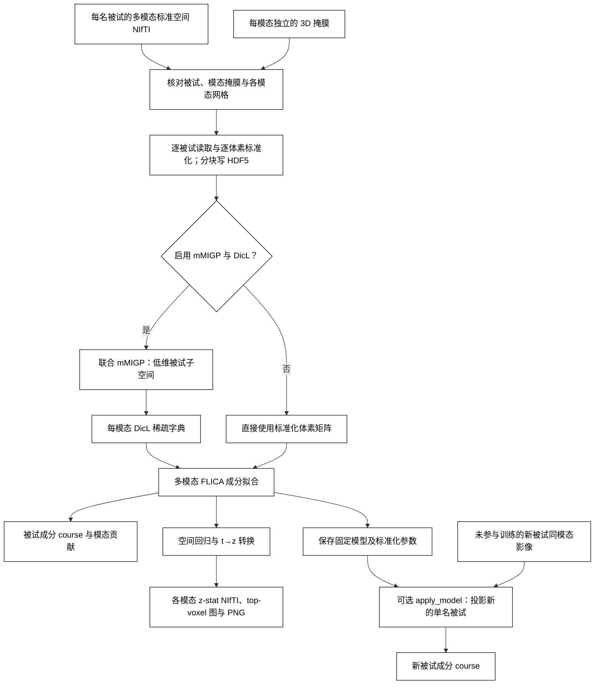

# BigFLICA：多模态标准空间成分

`run_bigflica` 读取“每名被试一个目录”的 3D NIfTI。每个模态指定相对于被试目录的影像路径和自己的 3D 掩膜。输出被试成分 course、每模态每成分的原网格 z-stat NIfTI、绝对 z 值最高的若干体素的阈值图与 PNG，以及可投影新被试的固定模型。模态间可有不同网格；同一模态的影像必须与其掩膜形状和仿射一致。输入必须已经在所需标准空间；函数不做配准。

**当前验收状态：**30,000名真实被试的VBM/FA/MD完整掩膜CPU/GPU试验已结束，C20有效秩分别为17/13，均未通过；未生成最终C20成分脑图或新被试模型。mMIGP的CPU/GPU相对差为 `6.07e-6`，DicL字典匹配后的差异为16%–30%，GPU的VBM重建几乎为零。运行至失败分别耗时153.04/112.55分钟，DicL和FLICA的GPU耗时均高于CPU；共享GPU及不同精度下的这些时间不能称为等价全流程加速。[完整报告、复现脚本与剩余工作](../../validation/bigflica/README.md#30000-人独立-cpugpu-对比当前结论)。

默认 `use_mmigp_dicl=True`：逐体素跨被试标准化 → 联合 mMIGP → 每模态 Lasso-LARS 字典学习 → FLICA。CUDA 路径用 PyTorch 执行协方差、特征分解、稀疏编码、字典更新、FLICA、空间回归和 t→z 转换；nibabel/HDF5 负责 CPU 文件读写和分块传输。为复现原 FLICA 的自由度拟合，GPU 特征分解后每模态将少量特征值送给 SciPy 做一次标量优化；这一步属于 CPU 计算。`use_mmigp_dicl=False` 时，标准化后直接把体素送入 FLICA，不建立 mMIGP 或 DicL 模型。此模式保留体素信息，但每轮须读取全部模态矩阵，适合较小训练集；大样本建议开启预处理。`device="cpu"` 保留原 notebook 的 sklearn DicL 对照路径。

**FLICA 数学修复：**自由能求和、分布公式、辅助函数精度、更新次数和历史记录已修复。67 项回归测试通过，包括直接体素 `o/R` 参数传递与输出检查；真实 30,000 人同字典同初始化控制的 CPU/GPU 拟合矩阵相对差不超过 `1.02e-13`，修正后的 1000 项自由能全部有限且逐轮上升。该控制仍只有 17 个有效成分；严格 MATLAB 初始化在字典输入上未改善 C20。[修复与验证记录](../../validation/bigflica/flica_math_fixes_20261001.md)。

**原始体素控制：**固定 1000 人、完整 VBM/FA/MD 掩膜，MATLAB 整体 RMS 预处理和 SVD 初始化；GPU 执行 1000 次更新仍保留 20 个有效成分。CPU/GPU 同初态 100 次参数相对差最大 `1.65e-10`，60 张 z-stat 图与独立 NumPy/SciPy 对照最大差 `1.91e-6`。1000 次 GPU 拟合观测耗时 87.69 秒，来自私密显存缓存运行器，不能当作公开流式 API 或默认预处理的端到端耗时；收敛及压缩模型仍须单独验收。[原始体素完整记录](../../validation/bigflica/raw_flica_real1000_20261001.md)。

**随后接入压缩：**同一 1000 人的 mMIGP 原投影及归一化投影分别保留1/19个成分；同投影 CPU/GPU DicL 后均为7，未通过 C20。同一投影的三模态 DicL 观测耗时 CPU193.85秒、GPU92.37秒，但小字典 FLICA 的 GPU 仍慢于 CPU。补充控制中，仅固定原始 DD 恢复到20，但FA/MD拟合仍弱；仅改共享噪声为16。未更换默认参数。压缩改变 DD 与噪声坐标，不能按原体素的成功结果宣称压缩模型等价。[逐段对照和原因分析](../../validation/bigflica/compression_after_raw_real1000_20261001.md)。

CUDA 压缩路径先逐被试读取，把 float32 标准化矩阵作为 HDF5 分块存盘；后续阶段不在内存中装入完整的“被试 × 体素”模态矩阵。默认 `max_gpu_gb=19`，按 20 GiB 显存目标预留空间。float32 协方差本身需 `N × N × 4` 字节，计算还要为临时数组留空间；超过配置预算时报错。磁盘需求不受内存预算限制，例如 37,182 人 × 100 万掩膜体素的 float32 标准化缓存约 138.5 GiB/**每模态**。大于 2,048 人时，mMIGP 根据目标秩和显存预算选择完整 GPU 特征分解或随机子空间；随机路径与直接体素 FLICA 的自由度近似仍需单独核验，不能当作逐点一致。

## 流程策略



## GPU DicL 求解

CUDA DicL 用批量 ADMM 识别稀疏系数的非零位置，再求解活动集方程，并检查系数符号、最优性条件和矩阵枢轴。每20步用 CUDA Graph 重放，减少 Python 调度；前四个批次、未归一化的初始化字典、检查失败或达到计算限额时，从当前小批次重新运行 LARS。LARS 回退仍用活动集逆矩阵增量更新，并保留原 LU 求解器处理失效逆矩阵。重复原子的非唯一解会回退，避免仅用目标值或最优性条件误接受不同的稀疏表示。字典原子全部有效时，按原顺序重放更新图；重采样时保留已有随机数顺序。批次默认32，alpha默认1，初始化、随机种子、字典更新和 sklearn 停止规则保留。

DicL内部仍沿用float64，mMIGP投影为float32；均值/方差分块汇总和兼容随机数生成仍在CPU执行。矩阵、稀疏求解和字典更新在GPU完成，只使用项目已有PyTorch依赖，未安装或调用SPORCO。ADMM方程参考 [SPORCO BPDN](https://sporco.readthedocs.io/en/latest/modules/sporco.admm.bpdn.html)；完整阶段实测见[验证记录](../../validation/bigflica/README.md#当前实现所需的补充证据)。

GPU字典缓存版本改为 `rsvd3bpdn`；旧版字典不会自动复用，mMIGP缓存可继续复用。原有CLI和Python参数无需修改。此优化没有消除独立CPU/GPU全链输入差异经非凸字典学习放大的问题，也没有解决20个有效成分的验收。

## 安装与输入

在仓库根目录运行 `conda env create -f environment.yml`，再运行 `conda activate fnit`。环境包含 PyTorch、nibabel、h5py、scikit-learn、SciPy、matplotlib；运行时不调用 FSL、FreeSurfer、SPM、MRtrix3 或 AFNI。

```text
ukb_multimodal_new/
  SUBJECT_A/
    VBM_2mm.nii.gz
    dti_FA_2mm_mmorf.nii.gz
    dti_MD_2mm_mmorf.nii.gz
    zstat1s.nii.gz
  SUBJECT_B/
    ...
```

此目录中的任务图为 `zstat1s.nii.gz`，不是 tstat。`modalities.json` 的四个掩膜均由使用者准备；路径须为绝对路径：

```json
{
  "modalities": {
    "vbm": {"image": "VBM_2mm.nii.gz", "mask": "/absolute/masks/vbm.nii.gz"},
    "fa": {"image": "dti_FA_2mm_mmorf.nii.gz", "mask": "/absolute/masks/fa.nii.gz"},
    "md": {"image": "dti_MD_2mm_mmorf.nii.gz", "mask": "/absolute/masks/md.nii.gz"},
    "zstat1": {"image": "zstat1s.nii.gz", "mask": "/absolute/masks/zstat1.nii.gz"}
  }
}
```

CUDA 压缩模式和新被试投影。以下 `C=3/R=10/D=40` 参数来自 [18 名真实被试的小掩膜核验](../../validation/bigflica/README.md)；示例 `subjects.txt` 应列出该规模的训练被试。更换被试或掩膜后须检查 `flica_reconstruction.json`，重新选择能保留所需成分的维度。

```bash
# subjects.txt 每行一个训练被试目录名；本示例使用 18 名训练被试。
fnit-bigflica fit \
  --subjects-root /absolute/path/ukb_multimodal_new \
  --config /absolute/path/modalities.json \
  --subjects-file /absolute/path/subjects.txt \
  --output-dir /absolute/path/bigflica_output \
  --n-components 3 --migp-dim 10 --dicl-dim 40 \
  --dicl-max-iter 20 --dicl-batch-size 32 \
  --dicl-sparse-iterations 120 --flica-max-iter 100 \
  --top-voxels 300 --random-state 0 \
  --device cuda:0 --max-gpu-gb 19 --feature-block 2048

# 使用训练时冻结的均值、标准差和空间载荷，不重新拟合。
fnit-bigflica apply \
  --model-dir /absolute/path/bigflica_output/components_3 \
  --subject-dir /absolute/path/ukb_multimodal_new/NEW_SUBJECT \
  --output-file /absolute/path/new_subject_course.tsv \
  --ridge 1e-6 --device cuda:0 --feature-block 32768
```

直接体素模式省略 mMIGP/DicL 维度，另设输出目录以保留两套模型。支持标量 `o` 和逐被试 `R` 噪声精度，输出前执行与压缩流程相同的有效秩和模态重建检查。以下展示调用形式；默认预处理仍是逐体素标准化，默认初始化仍沿用原 BigFLICA。上述 MATLAB 整体 RMS/SVD 控制未替换这两个默认设置，也不替代此调用的 C20 验收：

```bash
fnit-bigflica fit \
  --subjects-root /absolute/path/ukb_multimodal_new \
  --config /absolute/path/modalities.json \
  --subjects-file /absolute/path/subjects.txt \
  --output-dir /absolute/path/bigflica_raw_output \
  --n-components 3 --no-mmigp-dicl \
  --flica-max-iter 1000 --device cuda:0 --max-gpu-gb 19
```

Python API 的变量名与文件用途对应：

```python
from pathlib import Path
from fnit.bigflica import apply_model, run_bigflica

subjects_root = Path("/absolute/path/ukb_multimodal_new")
mask_root = Path("/absolute/masks")  # 四个事先准备好的标准空间掩膜
modalities = {
    "vbm": {"image": "VBM_2mm.nii.gz", "mask": str(mask_root / "vbm.nii.gz")},
    "fa": {"image": "dti_FA_2mm_mmorf.nii.gz", "mask": str(mask_root / "fa.nii.gz")},
    "md": {"image": "dti_MD_2mm_mmorf.nii.gz", "mask": str(mask_root / "md.nii.gz")},
    "zstat1": {"image": "zstat1s.nii.gz", "mask": str(mask_root / "zstat1.nii.gz")},
}
training_subject_ids = [
    subject_id.strip()
    for subject_id in Path("/absolute/path/subjects.txt").read_text().splitlines()
    if subject_id.strip()
]  # 与掩膜网格一致、模态齐全的训练被试；顺序会写入模型
model_dir = run_bigflica(
    subjects_root=subjects_root,
    modalities=modalities,
    output_dir=Path("/absolute/path/bigflica_output"),
    n_components=3,
    migp_dim=10,
    dicl_dim=40,
    subjects=training_subject_ids,
    use_mmigp_dicl=True,  # 改为 False 时省略 migp_dim、dicl_dim
    device="cuda:0",
    max_gpu_gb=19,
    feature_block=2048,
    dicl_batch_size=32,
    dicl_sparse_iterations=120,
    dicl_max_iter=20,
    flica_max_iter=100,
    top_voxels=300,
    random_state=0,
)
new_subject_dir = subjects_root / "NEW_SUBJECT"  # 不得在训练列表中
new_subject_course = apply_model(
    model_dir, new_subject_dir, ridge=1e-6, device="cuda:0", feature_block=32768
)
```

只用结构模态时，应另设输出目录以免复用四模态模型。以下 `18` 人、三个小核验掩膜、`C=3/R=10/D=40` 示例用于说明 API 与 CLI；完整掩膜的性能和精度测试已扩展到30,000人。此前2,050人公开调用的C3输出已核对，C20/R100/D200在两个样本规模均未通过有效秩验收，见[三模态基准](../../validation/bigflica/README.md)。

```python
structural_modalities = {name: modalities[name] for name in ("vbm", "fa", "md")}
structural_model_dir = run_bigflica(
    subjects_root=subjects_root,
    modalities=structural_modalities,
    output_dir=Path("/absolute/path/bigflica_structural_output"),  # 与四模态输出分开
    n_components=3,
    migp_dim=10,
    dicl_dim=40,
    subjects=training_subject_ids,  # 此核验设置使用 18 名真实被试
    device="cuda:0",
    max_gpu_gb=19,
    dicl_max_iter=20,
    flica_max_iter=100,
    flica_lambda_dims="R",  # 每个 mMIGP 维度单独估计噪声精度
    top_voxels=100,
    random_state=0,
)
```

## 输出与参数

```text
bigflica_output/
  normalized_f32/vbm.h5, fa.h5, ...   # CUDA 压缩模式：[被试, 掩膜体素]；均值/标准差为 float64
  mmigp_10/U.npy                      # [被试, mMIGP 维度]
  mmigp_10/vbm_projected.h5, ...      # [掩膜体素, mMIGP 维度]
  mmigp_10/eigen_diagnostics.json     # 阶段耗时、收敛次数、整体/逐特征对残差
  dicl_10_40_20_0_32_120_rsvd3bpdn_cuda/ # 每模态 dictionary.npy 与 manifest.json
  components_3/
    model.json                         # 参数、被试顺序、输入签名、阶段耗时
    flica_reconstruction.json          # 重建比、有效秩、H 奇异值比例及成分范数；失败时也保留
    subj_course.npy, subj_course.tsv  # [被试, 成分]；TSV 首列 subject
    modality_contribution.npy         # [模态, 成分]
    vbm_zstat.npy, fa_zstat.npy, ...   # [掩膜体素, 成分]
    vbm_loadings.npy, ...             # 新被试的固定空间载荷
    vbm_mask.nii.gz, vbm_mean.npy, vbm_std.npy, ...
    maps/vbm/component-001_zstat.nii.gz
    maps/vbm/component-001_top-300.nii.gz
    maps/vbm/component-001_top-300.png
```

直接体素模式只有 `normalized/` 和 `components_*/`，不生成 mMIGP/DicL 目录。CPU 压缩模式使用 `normalized/` float64 缓存；被试数不超过 2,048 时保留 SciPy 精确 mMIGP，超过 2,048 时逐被试写入 HDF5、分块计算协方差和投影。大样本随机子空间最多迭代 120 次，float64 的整体及每对特征残差须低于 `1e-8`；float32 须低于 `1e-6` 且至少迭代 90 次。失败时不写成功缓存清单。CPU DicL 用 sklearn `.fit`，每次只读取一个压缩后的 `P × migp_dim` 模态；单模态投影超过 4 GiB 时会报错。原始 `N × P` 模态始终保存在 HDF5。CPU 大样本 mMIGP 缓存版本为 `cpu-stream-v2-adaptive-float64`；GPU 随机子空间为 `cuda-stream-v6-adaptive-float32`，高目标秩完整特征分解为 `cuda-stream-v7-highrank-exact-float32`，旧版本缓存不会复用。

压缩及直接体素模式的 `flica_reconstruction.json` 记录各模态与整体重建范数比、H 的奇异值相对最大奇异值的比例、逐成分范数、有效秩及请求成分数。有效秩以奇异值比例大于 `1e-6` 的个数定义。若出现非有限值、有效秩不足，或某模态重建范数比低于 `1e-6`，会保留诊断并停止输出该模型。该检查不替代收敛、逐模态残差、脑图及留出被试验收。逐被试噪声模式的输出目录为 `components_C_lambda_R/`，标量模式仍为 `components_C/`；已有模型的输入签名或模态不一致时会拒绝覆盖，应使用新输出目录。缓存以被试顺序、影像和掩膜的路径/大小/修改时间及阶段参数核验；若原地改写文件却保留这些属性，须删除相应缓存后重跑。

| 参数 | 含义 |
|---|---|
| `subjects_root` / `--subjects-root` | 每名被试一个目录的父路径。 |
| `modalities` / `--config` | 有序模态映射；各项为相对影像路径 `image` 和绝对掩膜路径 `mask`。 |
| `output_dir` / `--output-dir` | 模型、成分图和可复用 HDF5 缓存目录。 |
| `subjects` / `--subjects-file` | 训练被试目录名及顺序；省略时自动搜索。 |
| `n_components` / `--n-components` | 成分数；压缩模式须小于 `dicl_dim` 和 `migp_dim - 1`，直接模式须小于被试数减一。 |
| `use_mmigp_dicl` / `--no-mmigp-dicl` | 默认开启两阶段压缩；CLI 标志将其关闭并直接拟合体素。 |
| `migp_dim` / `--migp-dim` | 压缩模式的联合 mMIGP 维度，不得超过被试数；直接模式可省略。 |
| `dicl_dim` / `--dicl-dim` | 压缩模式每模态的字典原子数；直接模式可省略。 |
| `dicl_max_iter` / `--dicl-max-iter` | DicL 最大 epoch 数，默认 1000；沿用 sklearn 提前停止规则。 |
| `dicl_batch_size` / `--dicl-batch-size` | GPU LARS 每批体素数，默认 32，与指定 notebook 一致。改动后结果可能变化。 |
| `dicl_sparse_iterations` / `--dicl-sparse-iterations` | GPU LARS 每个体素最多路径事件数，默认 120；到限未收敛时报错。 |
| `flica_max_iter` / `--flica-max-iter` | FLICA 变分更新次数，默认 1000，必须为正整数。CPU/GPU 均执行指定次数；旧版多更新一次的问题已修复。 |
| `flica_lambda_dims` / `--flica-lambda-dims` | 噪声精度维度：默认 `o` 为每模态一个值，与指定 notebook 一致。`R` 在直接体素模式中为每模态、每个原始被试一个值，在压缩模式中为每模态、每个 mMIGP 坐标一个值。更改此项会改变模型，须分别验收成分稳定性和重建。 |
| `top_voxels` / `--top-voxels` | 各成分按绝对 z 值保留最高的体素数，默认 1000。 |
| `random_state` / `--random-state` | DicL 随机种子，默认 0。 |
| `device` / `--device` | `auto` 优先 CUDA；可显式指定 `cuda:0` 或 `cpu`。直接体素模式要求 CUDA。 |
| `max_gpu_gb` / `--max-gpu-gb` | mMIGP/直接 FLICA 的显存预算，默认 19 GiB；被试数超过 2,048 的 CPU mMIGP 将同一数值用作协方差的内存预算。 |
| `feature_block` / `--feature-block` | 逐批处理的体素列数，拟合默认 2048，投影默认 32768。 |
| `model_dir` / `--model-dir` | 已拟合的 `components_*` 目录。 |
| `subject_dir` / `--subject-dir` | 不在训练列表的新被试目录；各影像须与冻结掩膜同网格。 |
| `ridge` / `--ridge` | 新被试多模态岭回归的非负正则化系数，默认 `1e-6`。 |
| `output_file` / `--output-file` | 新被试 course TSV；Python 中可省略，此时只返回数组。 |

原软件接受已展开的 NumPy `N × P` 矩阵。相应调用是：

```python
from BigFLICA.BigFLICA_cpu import BigFLICA

BigFLICA(
    data_loc=["/absolute/path/vbm.npy", "/absolute/path/fa.npy", "/absolute/path/md.npy", "/absolute/path/zstat1.npy"],
    nlat=20,
    output_dir="/absolute/path/original_output",
    migp_dim=1000,
    dicl_dim=500,
    ncore=4,
)
```

[上游 `BigFLICA_cpu.py`](https://github.com/weikanggong/BigFLICA/blob/master/BigFLICA_cpu.py) 用 SPAMS 字典学习；本功能的压缩模式对照用户 notebook 的 sklearn DicL 变体。原 `sKPCR_regression` 实际计算 t 值却命名为 Z；FNIT 按相同回归和自由度将双侧 t 转为带符号正态 z。mMIGP 特征向量本身有任意正负号；CUDA 实现固定最大绝对载荷为正以便复现，但它不保证与 SciPy 参考的符号一致。字典学习是非凸问题，符号改变会改变固定种子下的拟合轨迹，因此比较压缩模式时必须记录并处理这一差异。`apply_model` 是 FNIT 新增的冻结载荷投影，不等同于原 FLICA 对新被试重新推断后验。

原软件数值核对、当前求解器的同投影控制、缓存输出与留出投影检查，见[必要对照证据](../../validation/bigflica/README.md#当前实现所需的补充证据)。这些小样本及C3检查用于定位和接口核验；30,000人C20结论、阶段时间与剩余工作以本文开头和最新报告为准。

参考：Gong W, Beckmann CF, Smith SM. [Phenotype Discovery from Population Brain Imaging](https://www.sciencedirect.com/science/article/pii/S1361841521000967). *Medical Image Analysis*, 2021；[BigFLICA 原仓库](https://github.com/weikanggong/BigFLICA)。
