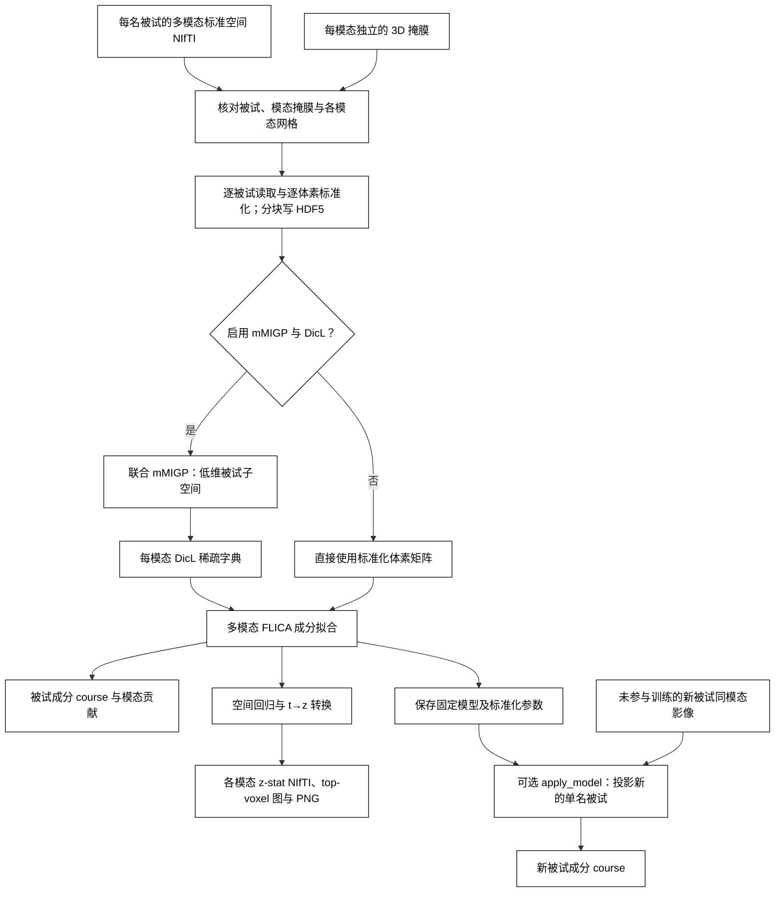

# BigFLICA：多模态标准空间成分

`run_bigflica` 读取“每名被试一个目录”的 3D NIfTI。每个模态指定相对于被试目录的影像路径和自己的 3D 掩膜。输出被试成分 course、每模态每成分的原网格 z-stat NIfTI、绝对 z 值最高的若干体素的阈值图与 PNG，以及可投影新被试的固定模型。模态间可有不同网格；同一模态的影像必须与其掩膜形状和仿射一致。输入必须已经在所需标准空间；函数不做配准。

默认 `use_mmigp_dicl=True`：逐体素跨被试标准化 → 联合 mMIGP → 每模态 Lasso-LARS 字典学习 → FLICA。CUDA 路径用 PyTorch 执行协方差、特征分解、稀疏编码、字典更新、FLICA、空间回归和 t→z 转换；nibabel/HDF5 负责 CPU 文件读写和分块传输。`use_mmigp_dicl=False` 时，标准化后直接把体素送入 FLICA，不建立 mMIGP 或 DicL 模型。此模式保留体素信息，但每轮须读取全部模态矩阵，适合较小训练集；大样本建议开启预处理。`device="cpu"` 保留原 notebook 的 sklearn DicL 对照路径。

CUDA 路径先逐被试读取，把标准化矩阵作为 HDF5 分块存盘；后续任何阶段都不在内存中装入完整的“被试 × 体素”模态矩阵。默认 `max_gpu_gb=28`，给 32 GB 显存留余量。协方差仍需 `N × N × 8` 字节；当维度或配置超过预算时会报错。磁盘需求不受 32 GB 内存限制，例如 37,182 人 × 100 万掩膜体素的 float64 标准化缓存约 277 GiB/**每模态**。请预留相应的磁盘空间。大于 2,048 人时 mMIGP 使用 GPU 随机子空间特征分解；直接体素 FLICA 的自由度改为 1，因此这两个大样本近似需要另行核验，不能当作逐点一致。

## 流程策略



## 安装与输入

在仓库根目录运行 `conda env create -f environment.yml`，再运行 `conda activate fnit`。环境包含 PyTorch、nibabel、h5py、scikit-learn、SciPy、matplotlib；运行时不调用 FSL、FreeSurfer、SPM、MRtrix3 或 AFNI。

```text
ukb_multimodal_new/
  SUBJECT_A/
    VBM_2mm.nii.gz
    dti_FA_2mm_mmorf.nii.gz
    dti_MD_2mm_mmorf.nii.gz
    zstat1s.nii.gz
  SUBJECT_B/
    ...
```

此目录中的任务图为 `zstat1s.nii.gz`，不是 tstat。`modalities.json` 的四个掩膜均由使用者准备；路径须为绝对路径：

```json
{
  "modalities": {
    "vbm": {"image": "VBM_2mm.nii.gz", "mask": "/absolute/masks/vbm.nii.gz"},
    "fa": {"image": "dti_FA_2mm_mmorf.nii.gz", "mask": "/absolute/masks/fa.nii.gz"},
    "md": {"image": "dti_MD_2mm_mmorf.nii.gz", "mask": "/absolute/masks/md.nii.gz"},
    "zstat1": {"image": "zstat1s.nii.gz", "mask": "/absolute/masks/zstat1.nii.gz"}
  }
}
```

CUDA 压缩模式和新被试投影：

```bash
# subjects.txt 每行一个训练被试目录名；省略后自动选择模态齐全的目录。
fnit-bigflica fit \
  --subjects-root /absolute/path/ukb_multimodal_new \
  --config /absolute/path/modalities.json \
  --subjects-file /absolute/path/subjects.txt \
  --output-dir /absolute/path/bigflica_output \
  --n-components 20 --migp-dim 100 --dicl-dim 50 \
  --dicl-max-iter 1000 --dicl-batch-size 32 \
  --dicl-sparse-iterations 120 --flica-max-iter 1000 \
  --top-voxels 1000 --random-state 0 \
  --device cuda:0 --max-gpu-gb 28 --feature-block 2048

# 使用训练时冻结的均值、标准差和空间载荷，不重新拟合。
fnit-bigflica apply \
  --model-dir /absolute/path/bigflica_output/components_20 \
  --subject-dir /absolute/path/ukb_multimodal_new/NEW_SUBJECT \
  --output-file /absolute/path/new_subject_course.tsv \
  --ridge 1e-6 --device cuda:0 --feature-block 32768
```

直接体素模式省略 mMIGP/DicL 维度，另设输出目录以保留两套模型：

```bash
fnit-bigflica fit \
  --subjects-root /absolute/path/ukb_multimodal_new \
  --config /absolute/path/modalities.json \
  --subjects-file /absolute/path/subjects.txt \
  --output-dir /absolute/path/bigflica_raw_output \
  --n-components 20 --no-mmigp-dicl \
  --flica-max-iter 1000 --device cuda:0 --max-gpu-gb 28
```

Python API 的变量名与文件用途对应：

```python
from pathlib import Path
from fnit.bigflica import apply_model, run_bigflica

subjects_root = Path("/absolute/path/ukb_multimodal_new")
mask_root = Path("/absolute/masks")  # 四个事先准备好的标准空间掩膜
modalities = {
    "vbm": {"image": "VBM_2mm.nii.gz", "mask": str(mask_root / "vbm.nii.gz")},
    "fa": {"image": "dti_FA_2mm_mmorf.nii.gz", "mask": str(mask_root / "fa.nii.gz")},
    "md": {"image": "dti_MD_2mm_mmorf.nii.gz", "mask": str(mask_root / "md.nii.gz")},
    "zstat1": {"image": "zstat1s.nii.gz", "mask": str(mask_root / "zstat1.nii.gz")},
}
training_subject_ids = [
    subject_id.strip()
    for subject_id in Path("/absolute/path/subjects.txt").read_text().splitlines()
    if subject_id.strip()
]  # 与掩膜网格一致、模态齐全的训练被试；顺序会写入模型
model_dir = run_bigflica(
    subjects_root=subjects_root,
    modalities=modalities,
    output_dir=Path("/absolute/path/bigflica_output"),
    n_components=20,
    migp_dim=100,
    dicl_dim=50,
    subjects=training_subject_ids,
    use_mmigp_dicl=True,  # 改为 False 时省略 migp_dim、dicl_dim
    device="cuda:0",
    max_gpu_gb=28,
    feature_block=2048,
    dicl_batch_size=32,
    dicl_sparse_iterations=120,
    dicl_max_iter=1000,
    flica_max_iter=1000,
    top_voxels=1000,
    random_state=0,
)
new_subject_dir = subjects_root / "NEW_SUBJECT"  # 不得在训练列表中
new_subject_course = apply_model(
    model_dir, new_subject_dir, ridge=1e-6, device="cuda:0", feature_block=32768
)
```

## 输出与参数

```text
bigflica_output/
  normalized/vbm.h5, fa.h5, ...       # 标准化的 [被试, 掩膜体素] 与均值/标准差
  mmigp_100/U.npy                     # [被试, mMIGP 维度]
  mmigp_100/vbm_projected.h5, ...     # [掩膜体素, mMIGP 维度]
  mmigp_100/eigen_diagnostics.json    # 子空间迭代次数和特征对残差
  dicl_100_50_1000_0_32_120_cuda/     # 每模态 dictionary.npy 与 manifest.json
  components_20/
    model.json                         # 参数、被试顺序、输入签名、阶段耗时
    subj_course.npy, subj_course.tsv  # [被试, 成分]；TSV 首列 subject
    modality_contribution.npy         # [模态, 成分]
    vbm_zstat.npy, fa_zstat.npy, ...   # [掩膜体素, 成分]
    vbm_loadings.npy, ...             # 新被试的固定空间载荷
    vbm_mask.nii.gz, vbm_mean.npy, vbm_std.npy, ...
    maps/vbm/component-001_zstat.nii.gz
    maps/vbm/component-001_top-1000.nii.gz
    maps/vbm/component-001_top-1000.png
```

直接体素模式只有 `normalized/` 和 `components_*/`，不生成 mMIGP/DicL 目录。缓存以被试顺序、影像和掩膜的路径/大小/修改时间及阶段参数核验；若原地改写文件却保留这些属性，须删除相应缓存后重跑。

| 参数 | 含义 |
|---|---|
| `subjects_root` / `--subjects-root` | 每名被试一个目录的父路径。 |
| `modalities` / `--config` | 有序模态映射；各项为相对影像路径 `image` 和绝对掩膜路径 `mask`。 |
| `output_dir` / `--output-dir` | 模型、成分图和可复用 HDF5 缓存目录。 |
| `subjects` / `--subjects-file` | 训练被试目录名及顺序；省略时自动搜索。 |
| `n_components` / `--n-components` | 成分数；压缩模式须小于 `dicl_dim` 和 `migp_dim - 1`，直接模式须小于被试数减一。 |
| `use_mmigp_dicl` / `--no-mmigp-dicl` | 默认开启两阶段压缩；CLI 标志将其关闭并直接拟合体素。 |
| `migp_dim` / `--migp-dim` | 压缩模式的联合 mMIGP 维度，不得超过被试数；直接模式可省略。 |
| `dicl_dim` / `--dicl-dim` | 压缩模式每模态的字典原子数；直接模式可省略。 |
| `dicl_max_iter` / `--dicl-max-iter` | DicL 最大 epoch 数，默认 1000；沿用 sklearn 提前停止规则。 |
| `dicl_batch_size` / `--dicl-batch-size` | GPU LARS 每批体素数，默认 32，与指定 notebook 一致。改动后结果可能变化。 |
| `dicl_sparse_iterations` / `--dicl-sparse-iterations` | GPU LARS 每个体素最多路径事件数，默认 120；到限未收敛时报错。 |
| `flica_max_iter` / `--flica-max-iter` | FLICA 变分更新上限，默认 1000；与原实现一样实际更新 `max_iter + 1` 次。 |
| `top_voxels` / `--top-voxels` | 各成分按绝对 z 值保留最高的体素数，默认 1000。 |
| `random_state` / `--random-state` | DicL 随机种子，默认 0。 |
| `device` / `--device` | `auto` 优先 CUDA；可显式指定 `cuda:0` 或 `cpu`。直接体素模式要求 CUDA。 |
| `max_gpu_gb` / `--max-gpu-gb` | mMIGP/直接 FLICA 协方差的显存预算，默认 28 GiB。 |
| `feature_block` / `--feature-block` | 逐批处理的体素列数，拟合默认 2048，投影默认 32768。 |
| `model_dir` / `--model-dir` | 已拟合的 `components_*` 目录。 |
| `subject_dir` / `--subject-dir` | 不在训练列表的新被试目录；各影像须与冻结掩膜同网格。 |
| `ridge` / `--ridge` | 新被试多模态岭回归的非负正则化系数，默认 `1e-6`。 |
| `output_file` / `--output-file` | 新被试 course TSV；Python 中可省略，此时只返回数组。 |

原软件接受已展开的 NumPy `N × P` 矩阵。相应调用是：

```python
from BigFLICA.BigFLICA_cpu import BigFLICA

BigFLICA(
    data_loc=["/absolute/path/vbm.npy", "/absolute/path/fa.npy", "/absolute/path/md.npy"],
    nlat=20,
    output_dir="/absolute/path/original_output",
    migp_dim=100,
    dicl_dim=50,
    ncore=4,
)
```

[上游 `BigFLICA_cpu.py`](https://github.com/weikanggong/BigFLICA/blob/master/BigFLICA_cpu.py) 用 SPAMS 字典学习；本功能的压缩模式对照用户 notebook 的 sklearn DicL 变体。原 `sKPCR_regression` 实际计算 t 值却命名为 Z；FNIT 按相同回归和自由度将双侧 t 转为带符号正态 z。mMIGP 特征向量本身有任意正负号；CUDA 实现固定最大绝对载荷为正以便复现，但它不保证与 SciPy 参考的符号一致。字典学习是非凸问题，符号改变会改变固定种子下的拟合轨迹，因此比较压缩模式时必须记录并处理这一差异。`apply_model` 是 FNIT 新增的冻结载荷投影，不等同于原 FLICA 对新被试重新推断后验。

真实 UKB 输入、逐阶段耗时、精度和验证边界见 [验证报告](../../validation/bigflica/README.md)。参考：Gong W, Beckmann CF, Smith SM. [Phenotype Discovery from Population Brain Imaging](https://www.sciencedirect.com/science/article/pii/S1361841521000967). *Medical Image Analysis*, 2021；[BigFLICA 原仓库](https://github.com/weikanggong/BigFLICA)。
