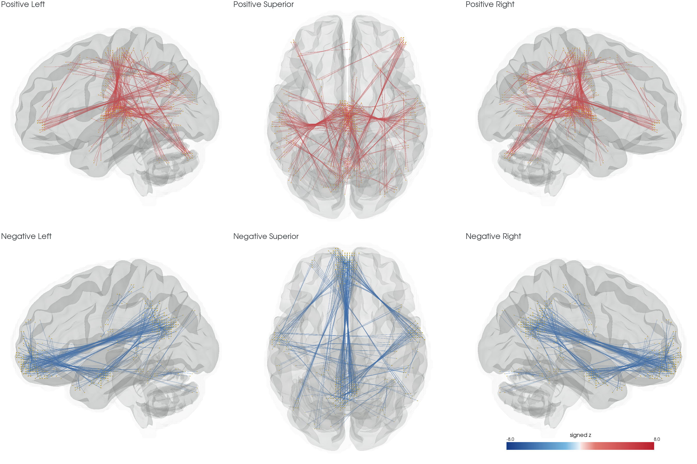

# BWAS：全脑体素连接的群体关联

| 项目 | 内容 |
|---|---|
| 输入 | MNI152NLin6Asym2mm clean BOLD、分析mask和participants.tsv |
| 输出 | 越阈值连接/簇表及显著簇连接数MA图 |
| 对应原软件 | 原BWAS六维随机场连接簇推断 |
| Python / CLI | run_bwas、plot_bwas_connectivity / fnit-bwas |
| CPU / GPU | CPU/CUDA单卡；FP32并明确关闭TF32 |

## 1. 功能简介

`run_bwas` 将多被试的体素对时间相关作Fisher变换，对每条连接拟合用户目标、协变量和截距模型，再按连接两端的空间邻接聚簇，用原BWAS六维高斯随机场公式估计簇水平FWER p值。输出统计连接表、簇表和参与显著簇连接数的MA图。

计算用PyTorch，CPU的nibabel/NumPy/SciPy负责准备和统计，Numba做精确聚类，依赖已纳入主页Conda环境。运行时不调用原BWAS或FSL。此模块为已验证FP32例外，明确 `TF32=False`，不使用FP16/BF16；全部体素、连接和被试均参与，没有低秩近似。


## 2. Python 调用

```python
from fnit.bwas import run_bwas

association_result = run_bwas(
    bids_root="/data/derivatives/clean",  # 完成预处理的BIDS Derivatives
    participants_tsv="/data/participants.tsv",  # ID与用户数值目标/协变量
    mask_file="/data/masks/analysis_mask.nii.gz",  # 同网格2mm分析mask
    output_root="/data/derivatives/fnit-bwas",  # 新的结果根目录
    phenotype="trait_01",  # 用户CSV/TSV自己的目标列名
    covariates=("covariate_01", "covariate_02"),  # 用户数值协变量列
    cdt=5.0,  # 双侧\|z\|连接定义阈值
    device="cuda:0",  # 单张GPU；可选cpu
)
significant_cluster_table = association_result.clusters  # 簇表路径
association_map = association_result.ma_map  # 3D MA图路径
```

### 输入数据格式

```text
derivatives/clean/
├── dataset_description.json
├── sub-001/func/*_space-MNI152NLin6Asym_res-2_desc-clean_bold.nii.gz
└── sub-002/func/*_space-MNI152NLin6Asym_res-2_desc-clean_bold.nii.gz
participants.tsv
analysis_mask.nii.gz
```

- 每个participant_id恰好对应一份4D `[X,Y,Z,T]` BOLD；不同被试T可不同，须有限并已经完成分析所需清理。
- 全部BOLD与3D非零mask具有同shape、affine、orientation和2mm体素，位于MNI152NLin6Asym；入口不负责配准或重采样。
- TSV含 `participant_id` 和指定目标/协变量数值列，字符串ID与BIDS目录名精确对应，行顺序决定回归行顺序。
- 目标可二值或连续；模型自动加截距且必须满秩。分类协变量如site先作数值哑变量并省略一个参考类别。
- BOLD沿用输入强度，经每体素时间标准化；连接Fisher值与群体z无量纲。FWHM参数单位是体素，不是mm。
- 群体输入、ID/目标表和连接输出仅放用户授权私有存储。示例trait_01和covariate_01是通用格式名。

**`run_bwas` 参数**

| 参数 | 必需 | 类型 | 默认值 | 含义 |
|---|---|---|---|---|
| `bids_root` | 是 | `str / Path` | `—` | 含 dataset_description.json 的 BIDS 输入根目录。 |
| `participants_tsv` | 是 | `str / Path` | `—` | participant_id、数值目标和协变量TSV；行顺序决定回归顺序。 |
| `mask_file` | 是 | `str / Path` | `—` | 与全部BOLD同网格的MNI152NLin6Asym 2mm分析掩膜。 |
| `output_root` | 是 | `str / Path` | `—` | 不存在或为空的输出BIDS Derivatives根。 |
| `phenotype` | 是 | `str` | `—` | 检验的用户自有数值目标列名，模型第一列。 |
| `covariates` | 否 | `tuple[str, ...]` | `('age', 'sex')` | 数值协变量列名元组；自动增加截距；CLI默认空列表。 |
| `cdt` | 否 | `float` | `5.0` | 双侧\|z\|阈值，默认5；正式全脑协议不低于5。 |
| `block_size` | 否 | `int / None` | `None` | 体素tile宽；None时CUDA实测调优、CPU使用128。 |
| `subject_block_size` | 否 | `int / None` | `None` | 每批传输/相关的被试数；None时CUDA调优、CPU使用16；GPU GLM另固定16。 |
| `num_workers` | 否 | `int` | `1` | BOLD读取和标准化并行worker数；增大会增加主机内存。 |
| `device` | 否 | `str` | `'cuda:0'` | PyTorch设备，默认cuda:0；可显式指定cpu。 |
| `fwhm` | 否 | `float / None` | `None` | 空间平滑度，单位体素；None自动估计并至少取2。 |
| `validate_direct_ols` | 否 | `bool` | `False` | 逐连接核对直接OLS，额外内存约8×N×block_size²字节。 |
| `cache_root` | 否 | `str / Path / None` | `None` | 临时缓存目录，None用output_root；结束自动清理。 |
| `column_tiles` | 否 | `int / None` | `None` | 共享row的column tile数，1或2；None在CUDA上调优。 |
| `gpu_row_cache` | 否 | `bool / None` | `None` | 是否将全部被试的当前row常驻GPU；None按吞吐/显存选择。 |

**`plot_bwas_connectivity` 参数**

| 参数 | 必需 | 类型 | 默认值 | 含义 |
|---|---|---|---|---|
| `bwas_output_root` | 是 | `str / Path` | `—` | 已有BWAS结果根；须唯一找到同一组统计文件。 |
| `gray_matter_mask_file` | 是 | `str / Path` | `—` | 与结果MA图同网格的灰质分析掩膜。 |
| `output_png` | 是 | `str / Path` | `—` | 用户指定PNG目标路径。 |
| `top_k` | 否 | `int` | `500` | 单边显示模式中选择的强连接数量。 |
| `cluster_p_max` | 否 | `float` | `0.05` | 显示连接簇的最大FWER p值，默认0.05。 |
| `cluster_id` | 否 | `int / None` | `None` | 仅显示该连接簇；None显示符合条件的所有簇。 |
| `min_abs_z` | 否 | `float / None` | `None` | 显示边的额外\|z\|阈值；None不加。 |
| `bundle_strength` | 否 | `float / None` | `None` | 显示曲线的集束强度；None用对应模式默认值。 |
| `all_clusters` | 否 | `bool` | `False` | 显示全部显著簇，每簇抽取实际体素对。 |
| `voxel_edge_budget` | 否 | `int` | `600` | 全部显著簇模式的总显示线数预算，默认600。 |
| `brain_mask_file` | 否 | `str / Path / None` | `None` | 同网格全脑二值掩膜，用于外轮廓和端点覆盖。 |
| `brain_surface_file` | 否 | `str / Path / None` | `None` | 同MNI毫米空间的外置BrainNet Viewer .nv脑表面。 |
| `cerebellum_surface_file` | 否 | `str / Path / None` | `None` | 同空间外置小脑参考表面。 |
| `surface_opacity` | 否 | `float / None` | `None` | 显示表面不透明度；None使用模式默认值。 |
| `colorbar_max_abs_z` | 否 | `float / None` | `None` | 色条绝对z上限；None自动。 |
| `show_colorbar` | 否 | `bool` | `True` | 是否绘制z色条。 |
| `view` | 否 | `str` | `'montage'` | montage、six、signed_six或单视角superior/inferior/left/right/anterior/posterior/oblique。 |

### 输出

```text
derivatives/fnit-bwas/
├── dataset_description.json
└── group/func/
    ├── *_desc-BWASedges_relmat.tsv.gz
    ├── *_desc-BWASclusters_stat.tsv
    ├── *_desc-BWASMA_statmap.nii.gz
    └── *_desc-BWASMA_statmap.json
```

| 输出/返回字段 | 含义与格式 |
|---|---|
| edges | 每行一条\|z\|>CDT的无序体素对；两端i/j/k体素坐标、带符号群体z与1起始cluster。 |
| clusters | 每簇边数、p_fwer、p_uncorrected、max_z及两端体素数；通常筛p_fwer<0.05。 |
| ma_map | `[X,Y,Z]` float32，同mask affine/orientation/MNI空间；值为参与显著簇的边数。 |
| metadata | 设计列、ID、阈值、平滑度、设备/分块、精度、时间/显存；含私有标识。 |
| BWASResult | 文件Path以及subjects、voxels、suprathreshold_edges计数。 |

z描述控制协变量后的群体目标效应，不是某个人的Fisher连接；MA不是逐体素z或解剖纤维数量。无显著簇时表仍保留、MA全零。连接表包含未达到簇显著性的越CDT边。

可选绘图读取这些统计文件，输出PNG。曲线连接真实MNI毫米坐标端点，显示集束不移动端点，不代表解剖纤维束。全脑mask应与分析mask同网格；外置表面需同MNI毫米空间并覆盖端点。

```python
from fnit.bwas import plot_bwas_connectivity

connectivity_figure = plot_bwas_connectivity(
    bwas_output_root="/data/derivatives/fnit-bwas",  # 已完成统计目录
    gray_matter_mask_file="/data/masks/analysis_mask.nii.gz",  # 同网格分析mask
    output_png="/data/results/bwas_connections.png",  # PNG保存路径
    all_clusters=True,  # 覆盖全部显著连接簇
    voxel_edge_budget=600,  # 图上显示线预算，抽取真实体素对
    brain_mask_file="/data/masks/whole_brain_mask.nii.gz",  # 同网格外轮廓
)
```

准备CPU和H2D/计算可重叠，JSON阶段时钟不能相加成总时间。GPU allocator上限17,000,000,000字节，CUDA上下文不计其中；大显式块仍可能OOM。GPU GLM按原顺序每16人归约，传输batch可不同。

## 3. 命令行调用

```bash
fnit-bwas --bids-root /data/derivatives/clean --participants /data/participants.tsv    --mask /data/masks/analysis_mask.nii.gz --output-root /data/derivatives/fnit-bwas    --phenotype trait_01 --covariate covariate_01 --covariate covariate_02    --cdt 5 --device cuda:0
```

| CLI | Python | 含义 |
|---|---|---|
| --bids-root / --participants / --mask / --output-root | bids_root / participants_tsv / mask_file / output_root | 必需输入与输出 |
| --phenotype / 重复--covariate | phenotype / covariates | 目标列及数值协变量 |
| --cdt / --fwhm | cdt / fwhm | 统计阈值与体素单位平滑度 |
| --block-size / --subject-block-size / --column-tiles | 同名下划线参数 | tile及传输配置，省略时GPU自动调优 |
| --gpu-row-cache / --no-gpu-row-cache | gpu_row_cache=True/False | row常驻，省略自动 |
| --num-workers / --cache-root / --device | 同名下划线参数 | 准备线程、临时盘和设备 |
| --validate-direct-ols | validate_direct_ols=True | 额外直接OLS检查 |

Python covariates默认`('age','sex')`，CLI省略--covariate时为空元组；二者不同，用户需按实际设计显式传入。绘图没有独立CLI，用Python函数。统计缓存目录需容纳逐人和packed两种布局，结束会清理临时文件。

## 4. 原软件调用

原BWAS在独立环境中按影像文件排序读取target/cov NumPy数组，应先按同顺序导出同一个设计：

```bash
python BWAS_main.py -toolbox_dir /data/reference/BWAS    -image_dir /data/reference/ordered_bold -output_dir /data/reference/output    -mask_file /data/masks/analysis_mask.nii.gz    -target_file /data/reference/target.npy -cov_file /data/reference/covariates.npy    -CDT 5 -memory_limits 16 -ncore 8
```

| FNIT | 原BWAS |
|---|---|
| BIDS+participant_id TSV | image_dir排序+相同行顺序.npy |
| phenotype / covariates | target_file / cov_file |
| cdt / mask_file | CDT / mask_file |
| CPU/GPU分块与缓存策略 | 原memory_limits/ncore，非一对一参数 |

FNIT沿用原版以n-p计算t，再以n-p-1转换z的约定；不是一般统一残差自由度写法。原18邻域端点组合、排除角点、六维随机场公式均保留。BrainNet Viewer仅为参考显示方式，生产绘图用PyVista/VTK，不调用MATLAB。

## 5. 最新精度和运行时间

最新完整单GPU实测见[固定配置报告](../../validation/bwas/single_gpu/full-row-v4.json)和[驱动显存](../../validation/bwas/single_gpu/full-row-driver-memory.json)，绑定optimized_core_sha256，开发提交 `76eb9506`。ABIDE公开真实1748人、112,215体素、6,296,047,005无序体素对；使用已标准化packed缓存，不能记成含原始BIDS读取的端到端。本轮未按140c3739重跑。

| 完整连接/GLM/聚类/输出 | 固定4096/16双列row缓存 | 自动入口 |
|---|---:|---:|
| 墙钟 | 2452.32 s | 2607.34 s |
| allocated/reserved | 15.11/15.12 GB | 16.96/16.99 GB |
| 驱动侧峰值 | 17.09 GB | 18.94 GB |

共享H100、普通FP32、TF32关闭；NumPy1.26.4、SciPy1.17.1、Torch2.5.1/CUDA11.8。线程设置按原报告，未提供原软件全对全匹配时间。首次packed缓存另约835.65 s和165.45 GB磁盘，BIDS读取/标准化尚未计入表中。

分步骤：cache/read762.15 s，H2D48.16 s，correlation1136.42 s，Fisher/GLM778.56 s，threshold11.38 s，clustering14.80 s；其中传输与计算重叠，不相加。固定优化对旧FNIT的CDT边/簇分区/p值/MA均一致，z MAE4.39e-9、最大3.99e-6。

原BWASCPU配对覆盖32人512体素全对全和1748人两seed→全灰质；后者z MAE3.34e-6、最大3.78e-5，CDT3/5判定无分歧。原软件全部62.96亿连接未测；有完整匿名结果但无原软件同全脑逐值等价或受控加速结论。



图从真实显著簇抽取体素对，以模板空间轮廓作参考；曲线仅用于连接显示，不是解剖纤维束。图不含个体ID或用户目标名称。当前没有全脑reference/FNIT/difference脑图成套配对。

## 6. 最近版本和 benchmark

| 日期 | commit/version | 变化 | benchmark |
|---|---|---|---|
| 2026-10-01 | 76eb9506 | packed缓存、row复用、流式GLM与Numba聚类 | 完整1748人FP32回归与单GPU显存 |
| 2026-09-30 | 版本见匿名报告 | ABIDE全灰质全对全及seed原版对照 | 6.296e9连接；原软件仅seed配对 |
| 2026-09-28 | 版本见abide32_summary.json | 32人功能及原版数值检查 | 512体素/CDT3，不能代正式全脑 |

更早的debug、profiling和长表保留在[旧README归档](../../validation/bwas/readme_archive_20261005.md)。归档已修复相对链接；旧科学报告与原始产物不修改。

<a id="流程策略"></a>
<a id="输入与输出"></a>
<a id="python-调用"></a>
<a id="单-gpu-数据流与-profiling"></a>
<a id="绘制灰质体素连接"></a>
<a id="abide-真实数据-benchmark"></a>
<a id="当前推荐的单-gpu-策略"></a>
<a id="瓶颈与数值保护"></a>
<a id="复核完整结果"></a>
<a id="来源"></a>

## 7. 参考文献、原软件和资源

- Gong等，2018，[Statistical testing and power analysis for brain-wide association study](https://doi.org/10.1016/j.media.2018.03.014)，Medical Image Analysis47:15–30。
- 原仓库：[BWAS](https://github.com/weikanggong/BWAS)，`BWAS_cpu.py/BWAS_main.py`文件头Apache2.0；其背景影像未随源码许可，不分发。
- 官方数据：[ABIDE](https://fcon_1000.projects.nitrc.org/indi/abide/)，只引用公开队列通用标量，不附个体表型表。
- FNIT：[core.py](../../src/fnit/bwas/core.py)、[visualize.py](../../src/fnit/bwas/visualize.py)。

### 外部资源

| 资源 | 用途 | 官方来源 | 大小 | SHA-256 | 是否允许 FNIT 再分发 |
|---|---|---|---|---|---|
| 用户同网格全脑/分析mask | 统计范围与图外轮廓 | 用户已获许可来源 | 因文件而异 | 运行前由用户记录 | 不替用户数据授权 |
| FSL MNI mask（可选） | 绘图轮廓 | [FSL data_standard](https://git.fmrib.ox.ac.uk/fsl/data_standard) | 本页未核单文件 | 本页未核单文件 | 不随该功能分发 |
| BrainNet .nv网格（可选） | 解剖参考显示 | [BrainNet Viewer](https://github.com/mingruixia/BrainNet-Viewer/tree/master/Data/SurfTemplate) | 本页未核单文件 | 本页未核单文件 | 未明确单资产许可，仅从原站 |

PyVista/VTK在主页环境内；无界面绘图需可用EGL/OSMesa/OpenGL。外置资源不能仅以源码开源就认定可再分发，未明确许可时保留上游下载。
