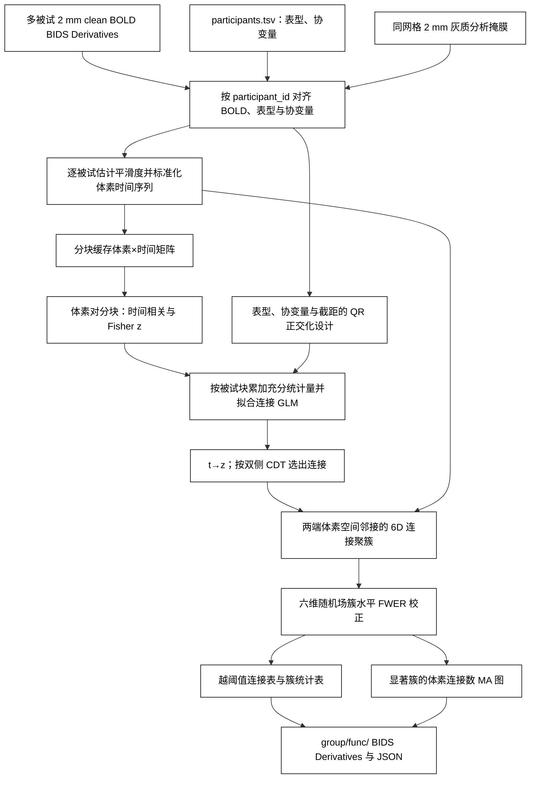
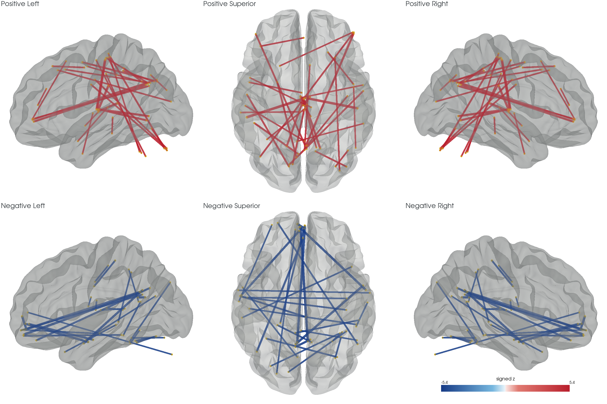

# BWAS：全脑体素连接的群体关联

[返回主页](../../README.md) · [验证代码](../../validation/bwas/benchmark_abide.py)

`run_bwas` 接收已经完成预处理、位于 MNI152NLin6Asym 2 mm 空间的多被试 BOLD。它逐人计算体素对的时间相关并作 Fisher z 变换，再对每条连接拟合“表型 + 协变量 + 截距”的线性模型。高于连接定义阈值（CDT）的连接按两端体素的空间邻接关系聚簇，使用原版 BWAS 的六维高斯随机场公式计算簇水平 FWER p 值。运行时只使用 PyTorch、NumPy、SciPy 和 Nibabel；不调用原版 BWAS 或 FSL。

## 流程策略



## 输入与输出

输入目录是 BIDS Derivatives；每个 `participant_id` 必须恰好对应一份 `sub-*/[ses-*]/func/*_space-MNI152NLin6Asym_res-2_desc-clean_bold.nii.gz`。所有 BOLD 与 3D 分析掩膜必须有相同的 shape、affine 和 2 mm 体素。`participants.tsv` 的 `participant_id` 与 BIDS 目录名精确匹配，不依赖文件排序；表型和协变量必须是数值列，设计矩阵需满秩。不同被试的时间帧数可以不同。若有多个 site，把 site 编码为哑变量并省略一个参考 site。

```text
derivatives/fnit-volume/
├── dataset_description.json
├── sub-001/func/sub-001_task-rest_space-MNI152NLin6Asym_res-2_desc-clean_bold.nii.gz
└── sub-002/func/sub-002_task-rest_space-MNI152NLin6Asym_res-2_desc-clean_bold.nii.gz

participants.tsv: participant_id  case  age  sex  site_01  site_02  ...
graymatter_mask.nii.gz: 与 BOLD 同网格的 2 mm 灰质二值掩膜
```

`output_root` 使用 BIDS Derivatives 的数据集说明与 `group/func/` 布局；BWAS 组水平文件名是本工具的自定义扩展。以 `task-rest` 为例：

```text
derivatives/fnit-bwas/
├── dataset_description.json
└── group/func/
    ├── task-rest_space-MNI152NLin6Asym_res-2_desc-BWASedges_relmat.tsv.gz
    ├── task-rest_space-MNI152NLin6Asym_res-2_desc-BWASclusters_stat.tsv
    ├── task-rest_space-MNI152NLin6Asym_res-2_desc-BWASMA_statmap.nii.gz
    └── task-rest_space-MNI152NLin6Asym_res-2_desc-BWASMA_statmap.json
```

| 文件 / 返回值 | 内容与解读 |
|---|---|
| `result.edges`：`BWASedges_relmat.tsv.gz` | 每行一条 `|z| > CDT` 的无序体素对。`voxel1_i/j/k`、`voxel2_i/j/k` 是 NIfTI 体素坐标，可用掩膜 affine 换算成 MNI 毫米坐标；`cluster` 是从 1 开始的连接簇编号。`z` 是控制协变量后的**群体表型效应统计量**，不是某个人的功能连接 Fisher z。若 `case=1` 表示病例，正 z 表示病例的连接 Fisher z 较高，负 z 表示对照较高。此表包含所有越过 CDT 的边，包括未达到簇水平显著性的边。 |
| `result.clusters`：`BWASclusters_stat.tsv` | 每簇一行。`edges` 为簇内边数，`p_fwer` 为六维随机场校正后的簇水平 p 值，`p_uncorrected` 为未校正 p 值；`max_z` 是簇内带符号 z 的最大值，`region1_voxels`、`region2_voxels` 描述两端体素。通常以 `p_fwer < 0.05` 筛选显著簇。 |
| `result.ma_map`：`BWASMA_statmap.nii.gz` | 与输入掩膜同网格的 float32 3D NIfTI。每个体素值是其参与 `p_fwer < 0.05` 连接簇的边数，供定位和绘图；它不是逐体素 z 图，也不是体素×体素矩阵。若没有显著簇，全图为零。 |
| `result.metadata`：`BWASMA_statmap.json` | 记录被试 ID、设计列、阈值、FWHM、设备、分块、精度、耗时与显存峰值；包含被试标识，分享时应先核查。 |
| `dataset_description.json` | 记录生成软件和 BIDS Derivatives 基本信息。 |
| `plot_bwas_connectivity` 返回的 PNG（可选） | 多视角脑表面连接示意图。默认显示筛选后的少量体素对；`all_clusters=True` 则汇总并显示每个显著连接簇。PNG 是可视化，不是逐边统计数据或解剖纤维束。 |

`BWASResult` 另返回 `subjects`、`voxels` 和 `suprathreshold_edges` 三个计数。没有显著簇时，越阈值连接表和簇表仍保留，MA 图为零。

## Python 调用

```python
import csv
from pathlib import Path
from fnit import run_bwas

bids_root = Path("/data/derivatives/fnit-volume")  # 输入：含各被试 2 mm clean BOLD 的 BIDS Derivatives 根目录
participants_tsv = Path("/data/participants.tsv")  # 输入：participant_id、case、age、sex 与 site 哑变量
graymatter_mask = Path("/data/MNI152_2mm_graymatter_mask.nii.gz")  # 输入：与 BOLD 同网格的二值灰质掩膜
output_root = Path("/data/derivatives/fnit-bwas")  # 输出：不存在或为空的 BIDS Derivatives 目录

with participants_tsv.open(newline="") as stream:
    site_columns = tuple(name for name in csv.DictReader(stream, delimiter="\t").fieldnames
                         if name.startswith("site_"))  # 数值哑变量；已省略一个参考 site

result = run_bwas(
    bids_root=bids_root,
    participants_tsv=participants_tsv,
    mask_file=graymatter_mask,
    output_root=output_root,
    phenotype="case",  # 表型列；0/1 病例对照或连续数值
    covariates=("age", "sex", *site_columns),  # 数值协变量列，自动加截距
    cdt=5.0,  # 双侧 |z| 连接定义阈值；原版建议正式分析不低于 5
    block_size=5120,  # 每维体素分块宽度；此示例已在 H100 上验证
    subject_block_size=16,  # 每次送入 GPU 的被试数，限制显存
    num_workers=8,  # 并发读取、平滑度估计与时间序列标准化的被试数；占用更多主机内存
    cache_root=Path("/data/local-scratch"),  # 可选：本地临时盘；需容纳全部被试的标准化 BOLD
    device="cuda:0",  # PyTorch 设备；无 CUDA 时可用 "cpu"
    fwhm=None,  # 默认从所有输入 BOLD 估计平均空间平滑度；已知时可填体素单位的正数
    validate_direct_ols=False,  # 研究验证时可逐连接比较直接回归；会增加主机内存与耗时
)
print(result.edges, result.clusters, result.ma_map)
```

| 参数 | 含义 |
|---|---|
| `bids_root` | 输入 BIDS Derivatives 根目录，含 `dataset_description.json`。 |
| `participants_tsv` | 按 `participant_id` 列关联影像的 TSV；行顺序决定回归行顺序。 |
| `mask_file` | 2 mm MNI 分析掩膜，只检验非零体素间连接。 |
| `output_root` | 新建结果目录；不覆盖已有文件。 |
| `phenotype` | 欲检验的单个数值列名；系数对应模型第一列。 |
| `covariates` | 数值协变量列名元组；函数自动追加截距。多类别 site 需先转换为哑变量。 |
| `cdt` | 对双侧 z 值取绝对值的连接阈值，默认 `5.0`；原版建议正式全脑分析不低于 `5`。 |
| `block_size` | 每个体素轴的块宽，默认 `128` 仅适合小掩膜验证；全脑需显式设置较大块宽，示例 `5120` 适用于已验证的 H100 配置，其他 GPU 按可用显存调整。 |
| `subject_block_size` | 每个 GPU 批次的被试数，默认 `16`。 |
| `num_workers` | 读取、平滑度估计和标准化 BOLD 的并发 worker 数，默认 `1`；增大可缩短准备时间，但会增加主机内存和磁盘负载。 |
| `cache_root` | 可选临时缓存目录，默认使用 `output_root`；本地高速盘可加快反复读取体素块，需有约 `4 × 总帧数 × 掩膜体素数` 字节可用空间，运行结束自动清理。 |
| `device` | 默认 `cuda:0`。 |
| `fwhm` | 三轴共用的空间平滑度，单位为体素；默认从所有 BOLD 估计并至少取 `2`。 |
| `validate_direct_ols` | 默认关闭。开启后，对每个无序体素对比较被试分块与一次性直接回归的 z 值，并记录平均/最大误差及 CDT 判定分歧；额外主机内存上限约为 `8 × 被试数 × block_size²` 字节。 |

体素块和被试块共同限制显存。每块仅存当前被试组的 Fisher 连接和回归充分统计量 `QᵀY`、`YᵀY`；其中 `Q` 来自对表型和协变量的 QR 正交化，避免站点哑变量造成的病态矩阵逆。标准化时间序列按“体素×时间”连续存放在临时缓存目录，运行结束自动清理。连接和群体回归均用普通 float32；本功能关闭 TF32，BOLD 缓存与 MA NIfTI 也为 float32，不使用 float16。CUDA 输入批次使用页锁定内存传输。
超过 512 人时，Linux 版本会把当前进程的文件描述符软上限提高到 `被试数+128`；若系统硬上限仍不足，会在计算前报错并说明所需数量。

单站点的命令行调用：

```bash
fnit-bwas --bids-root /data/derivatives/fnit-volume \
  --participants /data/participants.tsv \
  --mask /data/MNI152_2mm_graymatter_mask.nii.gz \
  --output-root /data/derivatives/fnit-bwas \
  --phenotype case --covariate age --covariate sex \
  --cdt 5 --block-size 5120 --subject-block-size 16 --num-workers 8 \
  --cache-root /data/local-scratch --device cuda:0
```

多站点时为每个额外 site 列重复一次 `--covariate site_XX`。原版对应调用为：

```bash
python BWAS_main.py -toolbox_dir /path/to/BWAS \
  -image_dir /path/to/ordered_2mm_bold -output_dir /path/to/reference_output \
  -mask_file /path/to/graymatter_mask.nii.gz \
  -target_file /path/to/case.npy -cov_file /path/to/age_sex_site_dummies.npy \
  -CDT 5 -memory_limits 16 -ncore 8
```

原版按影像文件名排序读取 `target`/`covariates` 行；使用它作对照时必须先按相同排序生成 `.npy`。FNIT 的 TSV 通过 `participant_id` 显式关联。为了复现原版统计输出，FNIT 同样先以 `n-p` 估计 t 值，再以原版代码中的 `n-p-1` 自由度转成 z 值；这是与通常单一残差自由度写法不同的原版数值约定。

## 绘制灰质体素连接

`plot_bwas_connectivity` 读取 `run_bwas` 的连接表、簇表和 MA 图。`all_clusters=True` 时，它扫描**全部显著簇内连接**，按簇和 z 符号各汇总一条代表管线：两端取该组连接端点的平均 MNI 坐标，颜色取平均 z，粗细随边数的对数增加。同一簇若含正负两类边会分成两条线。这样每个显著簇都出现在图中，不受 `top_k` 限制。黄色点是汇总端点；管线仅表示**群体 FC 统计连接**，不代表解剖纤维或每条边的轨迹。默认模式仍可按 `top_k` 画单条连接，`bundle_strength` 仅弯曲该模式的显示线，不改变端点或统计结果。

脑轮廓优先读取用户提供的 [BrainNet Viewer ICBM152 `.nv` 表面](https://github.com/mingruixia/BrainNet-Viewer/tree/master/Data/SurfTemplate)。所用 2019 版 `BrainMesh_ICBM152.nv` 有 81,924 个顶点、163,840 个三角面；若不提供，函数仍从 2 mm 灰质掩膜提取较粗的表面。模板不随 FNIT 分发；可从 BrainNet Viewer 原站获取，或从已有 `BrainNetViewer_20191031.zip` 提取 `Data/SurfTemplate/BrainMesh_ICBM152.nv`。该 ZIP 内网格为 5,659,708 字节，SHA-256 `471e43f955a1cb9f0350aaca2822f02fc74e393718d1e385fddaf0e578ffe572`；目前原站网格为 5,413,890 字节，SHA-256 `fdbc3770838952193b0bcdabe38ce092afe718607b4edd9dfccab98a6647d4a9`，两版顶点与面逐项相同。Python 代码独立读取 `.nv`，运行时不调用 MATLAB、BrainNet Viewer 或 BrainGL。正 z 为红色，负 z 为蓝色，采用 [FSLeyes 的红蓝配色名称](https://github.com/pauldmccarthy/fsleyes/blob/main/fsleyes/assets/colourmaps/order.txt)所对应的视觉约定；未复制原色表。

主页的 `environment.yml` 已包含 PyVista/VTK；单独安装可用 `pip install '.[bwas-visualization]'`。绘图无需 CUDA 计算，但 VTK 需要 OpenGL；无界面服务器可使用 EGL 或 OSMesa。

原 BrainNet Viewer 的对应 MATLAB 调用是 `BrainNet_MapCfg('BrainMesh_ICBM152.nv','nodes.node','edges.edge','Cfg.mat')`，需先生成节点和邻接矩阵文件。FNIT 的 Python 函数直接读取 BWAS 输出 TSV，不调用该程序。

```python
from pathlib import Path
from fnit.bwas import plot_bwas_connectivity

bwas_output_root = Path("/data/derivatives/fnit-bwas")  # 已完成的 run_bwas 输出根目录
gray_matter_mask_file = Path("/data/MNI152_2mm_graymatter_mask.nii.gz")  # 与统计结果同网格的输入灰质掩膜
brain_surface_file = Path("/data/BrainNetViewer/Data/SurfTemplate/BrainMesh_ICBM152.nv")  # 从 BrainNet Viewer 原站取得的 MNI 表面网格
output_png = (bwas_output_root / "group" / "figures" /
              "task-rest_space-MNI152NLin6Asym_desc-BWASallClusters_figure.png")  # 新图像路径

figure_path = plot_bwas_connectivity(
    bwas_output_root=bwas_output_root,  # 自动寻找该目录中唯一一组 BWAS 结果文件
    gray_matter_mask_file=gray_matter_mask_file,  # 2 mm 体素坐标参考；须与 MA 图同网格
    output_png=output_png,  # 写出 PNG；已存在时不覆盖
    cluster_p_max=0.05,  # 只显示簇水平 FWER p < 0.05 的连接
    all_clusters=True,  # 扫描所有显著连接，按簇及正负 z 汇总；不按 top_k 截断
    brain_surface_file=brain_surface_file,  # 可选：清晰脑沟轮廓；不提供则使用灰质掩膜表面
    view="signed_six",  # 一张六联图：上排正 z、下排负 z；每排左/俯/右视
)
print(figure_path)
```

| 绘图参数 | 含义 |
|---|---|
| `bwas_output_root` | 已完成的单组 BWAS 输出根目录。 |
| `gray_matter_mask_file` | 与 MA 图相同 shape、affine 的 2 mm 灰质掩膜，提供体素坐标。 |
| `output_png` | 新 PNG 文件路径，已存在时不覆盖。 |
| `cluster_p_max` | 簇水平 FWER p 的严格上限，取 `(0, 1]`，默认 `0.05`。 |
| `all_clusters` | 默认 `False`；开启后每个显著簇按正负 z 汇总为代表管线，忽略 `top_k`。 |
| `brain_surface_file` | 可选 BrainNet Viewer `.nv` 网格；默认从输入灰质掩膜提取外轮廓。 |
| `view` | `montage` 四联图；`six` 为六个独立方向；`signed_six` 为正负分行、每行左/俯/右视，仅与 `all_clusters=True` 联用；也可取 `left`、`right`、`superior`、`inferior`、`anterior`、`posterior`、`oblique` 单视角。 |
| `top_k` | 默认 `500`，单边模式最多显示的 `|z|` 最高边数；全簇模式不使用。 |
| `cluster_id` | 单边模式可指定一个已显著的正整数簇编号；默认 `None`。不能与 `all_clusters=True` 合用。 |
| `min_abs_z` | 单边模式可附加非负的 `|z|` 下限；默认 `None`。不能与全簇模式合用。 |
| `bundle_strength` | 单边模式的视觉弯曲程度，取 `[0, 1]`，默认 `0`；不改变端点。不能与全簇模式合用。 |

下图来自 ABIDE I+II 的 1748 人全脑结果。`p_fwer < 0.05` 的 **60 个显著 FC 簇**共含 **1,154,192 条连接**，全部汇总到同一张六联图：32 条正 z 管线、28 条负 z 管线。红色表示病例组连接 Fisher z 较高的正统计量，蓝色表示较低的负统计量。图中没有个体影像、逐边矩阵或被试标识。



[同一批显著簇的六个独立视角：左、俯、右、后、仰、前](figures/abide_all_clusters_brainnet_six.png)。在 gpucw1 的 PyVista 0.49.0、VTK 9.7.1 和 NVIDIA H100 EGL 环境下，两张 2700×1800 图依次耗时 `11.00 s`、`11.58 s`，均包含读取压缩连接表、汇总和写出 PNG。共享 GPU 负载会影响计时；本机缺少可用的软件 OpenGL 渲染库，尚无同机 CPU/GPU 加速比。

## ABIDE 真实数据 benchmark

32 人检查使用 ABIDE II 同一站点的真实预处理 BOLD（16 病例、16 对照），插值到 2 mm 后取 512 个灰质体素；`CDT=3` 只用于核对越阈值边与聚簇。全脑实验使用 ABIDE I+II 的 1778 份预处理 BOLD 与官方表型表。以本地 FSL 2 mm 灰质概率图 `>0.5` 定义初始 128,190 体素掩膜；该模板不随 FNIT 分发。预先固定每人至少 120,000 个有效灰质体素的质量标准后，保留 1748 人（792 病例、956 对照）和共同的 112,215 个灰质体素。模型包含年龄、性别、35 个站点哑变量和截距，正式连接阈值为 `CDT=5`。[BIDS 准备](../../validation/bwas/prepare_abide.py)、[全量运行](../../validation/bwas/run_abide_full.py)与[原版对照](../../validation/bwas/benchmark_full_seed.py)脚本提供复核步骤。

| float32 精度检查 | 对照范围 | z 值 MAE / 最大差 | 阈值与簇 |
|---|---:|---:|---|
| [FNIT 对原版，32 人](../../validation/bwas/abide32_summary.json) | 130,816 条无序体素对 | `3.70×10⁻⁶` / `7.75×10⁻⁵` | CDT 3 判定分歧 0；双方均有 777 条边、40 个同大小连接簇。 |
| [FNIT 对原版，1748 人](../../validation/bwas/abide_full_seed_fp32_summary.json) | 两枚 seed→全灰质，共 224,428 条 | `3.34×10⁻⁶` / `3.78×10⁻⁵` | CDT 3：双方均 1850 条边、分歧 0；CDT 5：双方均 0 条边。 |
| [16 人分块对一次性回归](../../validation/bwas/abide_full_seed_direct_fp32_summary.json) | 同上，共 224,428 条 | `5.64×10⁻⁷` / `2.43×10⁻⁵` | CDT 3/5 判定分歧均为 0。 |

| 速度与资源 | 原版 CPU | FNIT | 计时范围 |
|---|---:|---:|---|
| 32 人、512 体素 | `1.05 s` | `1.79 s` | 原版仅核心计算；FNIT 一次 `run_bwas` 含 BIDS 读写、平滑度、聚类和输出。 |
| 1748 人、两枚 seed→全灰质 | 核心 `354.12 s`；另有缓存布局转换 `320.13 s` | GPU 核心 `302.35 s` | 从预先准备的缓存计算相关、回归和 z 值；共享服务器上的一次观测。 |
| 1748 人、112,215 体素全对全 | 未运行原版全对全对照 | `3828.74 s`；CUDA 峰值已分配 `11.66 GB` | `run_bwas` 含连接、回归、聚类、结果写出；不含 BIDS 读取及缓存准备。 |

全对全 FNIT 运行计算了 `6,296,047,005` 条无序体素对，得到 `1,235,519` 条越过 CDT 5 的连接、`5,133` 个连接簇；MA 图有 `31,359` 个非零体素。见[全量汇总](../../validation/bwas/abide_full_summary.json)和[输出文件验收](../../validation/bwas/abide_full_artifact_check.json)。原版 CPU 逐值比较覆盖两枚 seed 到全灰质，未覆盖全部 62.96 亿条连接；上述耗时的计时范围不同，不应直接计算端到端加速比。实验不上传个体影像、表型行或连接矩阵。

## 来源

- [原版 weikanggong/BWAS](https://github.com/weikanggong/BWAS) 的 [BWAS_cpu.py](https://github.com/weikanggong/BWAS/blob/master/BWAS_cpu.py) 与 [BWAS_main.py](https://github.com/weikanggong/BWAS/blob/master/BWAS_main.py)（Python 源文件头标注 Apache 2.0；参考源码 SHA-256 `1b78a98efb04ae5c1b764b101ec434ed8c8277f815481ae0ca940ebd910323c2`）。原版背景影像 `braingl_bg.nii.gz` 没有随这项源码授权，不纳入 FNIT。
- Gong W, et al. [Statistical testing and power analysis for brain-wide association study](https://doi.org/10.1016/j.media.2018.03.014). *Medical Image Analysis* 47 (2018): 15–30.
- [BrainGL 源码](https://github.com/rschurade/braingl)与 [Connexel visualization 论文](https://doi.org/10.3389/fnins.2014.00015)：用于区分统计簇与显示线集束；FNIT 未纳入其运行时或逐行移植集束算法。
- [BrainNet Viewer 官方源码与 ICBM152 表面](https://github.com/mingruixia/BrainNet-Viewer)、[Xia 等的工具论文](https://doi.org/10.1371/journal.pone.0068910)：提供外置网格格式与多视角展示参考；FNIT 未复制其 MATLAB 绘图代码，也不分发网格。
- [PyVista](https://docs.pyvista.org/) 和 [VTK](https://vtk.org/) 官方文档：灰质等值面、多视角离屏渲染与三维连线。
- [ABIDE II 表型变量释义](https://fcon_1000.projects.nitrc.org/indi/abide/ABIDEII_Data_Legend.pdf)。
- [ABIDE I 官方表型表](https://s3.amazonaws.com/fcp-indi/data/Projects/ABIDE_Initiative/Phenotypic_V1_0b_preprocessed1.csv)和[ABIDE II 官方表型表](https://fcon_1000.projects.nitrc.org/indi/abide2/release/phenotypic_data/ABIDEII_Composite_Phenotypic.csv)。
