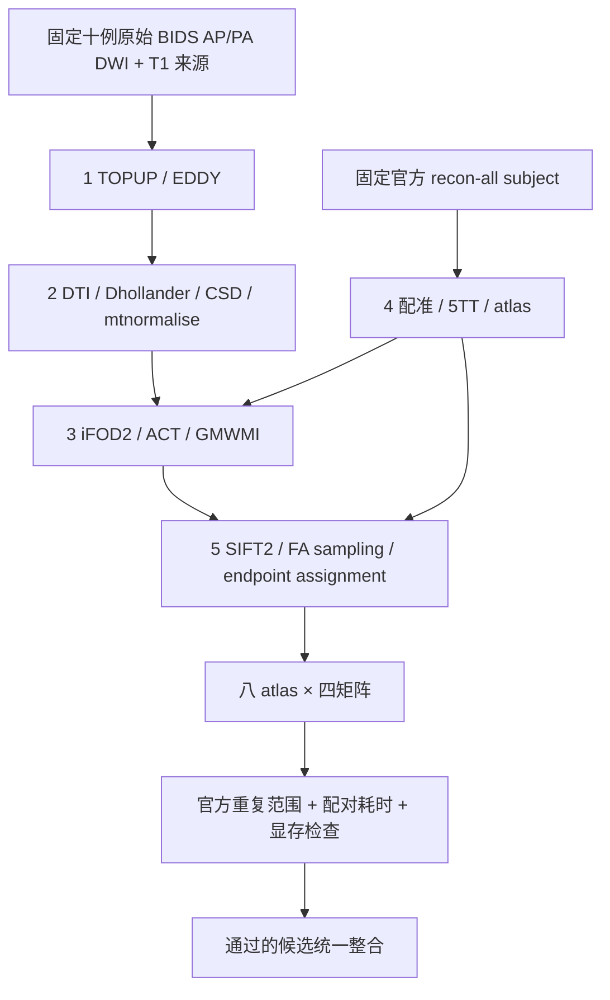

# UKBConnectome_pipeline 精度优化：2026-10-03

## 1. 功能与本轮目标

本轮从已发布的 `7af34e6d072e843fb2558c931bb2781f1d4b0be9` 开始，优化原始 BIDS DWI、已有官方 FreeSurfer subject 到 structural connectome 的精度。复用前一轮新下载的 ds001226 十例原始 AP/PA/T1（CON01、CON03–CON11，CC0）；FreeSurfer 科学输入保持固定，原始 MRI 和旧产物不改写。

每例仍为 100,000 次尝试播种、八套 atlas、四种矩阵。精度以同输入官方组件及独立 raw 链的官方五次重复范围验收；耗时以相同硬件、参数和计时范围的配对基线验收。不能增加播种数、优化迭代或追踪样本数换取精度，不能改变 SC 的统计定义。

五个子任务使用独立分支、代码范围和输出目录。受当前代理并发上限限制，三个子任务同时执行，其余两个排队；共享 GPU 的实际计算使用同一把锁串行运行。

## 2. Python 调用、输入与输出

产品调用沿用[主流程说明](README.md#2-python-调用输入与输出)，本轮尚未完成的候选不改变公开默认入口。阶段验证先固定实际 DWI、梯度、掩膜、FreeSurfer 分割、FOD、5TT 或 TCK，分别核对官方结果。

每个子任务记录输入、源码、权重或模板及参考二进制的 SHA-256。输出包括真实精度报告、配对计时、allocated/reserved/进程树显存、候选是否采用，以及保留的失败项。整链 wall 评测在计时结束后保存同次返回的归一化 FOD、FA、5TT、GMWMI、变换与轨迹；atlas 已由 CLI 保存。response、归一化过程中间张量在独立组件诊断中记录，不冒充 wall 调用产物；导出时间与产品耗时分开。

## 3. 命令行与参数

生产调用保持 `fnit UKBConnectome_pipeline`，参数解释及完整 BIDS 示例见[主流程 CLI](README.md#3-命令行调用)。本轮仍设置 `PYTORCH_CUDA_ALLOC_CONF=expandable_segments:True`，关闭 `compile_arc`，保持既有 TF32 与已验证的局部 FP32/FP64 策略，不使用 FP16/BF16。

不同候选在独立新目录执行；完整实际命令随报告保存，不覆盖旧完成或失败记录。尚未执行的命令不记作实测。

## 4. 对应官方步骤

| 子任务 | FNIT 修改范围 | 同输入官方参考 |
|---|---|---|
| 1 原始 DWI 校正 | BIDS、TOPUP、EDDY | FSL `topup`、`eddy`，分别锁定实际参数及 CPU/GPU 版本 |
| 2 DWI 建模 | DTI、响应、CSD、归一化 | MRtrix `dwi2tensor`、`tensor2metric`、`dwi2response`、`dwi2fod`、`mtnormalise` |
| 3 追踪 | iFOD2、ACT、GMWMI | MRtrix `tckgen`，包括对应版本的播种、圆弧概率与终止状态 |
| 4 解剖与 atlas | 5TT、配准、表面/体积标签映射 | `5ttgen`、`5tt2gmwmi`、FSL `flirt`、官方 SynthMorph 与原 atlas 脚本 |
| 5 轨迹后处理 | SIFT2、标量采样、端点赋值和聚合 | `tcksift2`、`tcksample -precise`、`tck2connectome` |

原程序只用于独立 benchmark；产品继续使用 FNIT 实现，官方 `recon-all` 保留用户许可的前置例外。参考源码需匹配实际二进制的完整版本和 SHA，不以安装目录名或其陈旧 Git HEAD 代替版本绑定。

## 5. 已发布基线、验收与当前状态

本轮候选尚未完成，下面仅列前一轮实际基线，不作为新候选结果。

| 项目 | 已发布基线 |
|---|---|
| raw-DWI CLI 中位数 | 候选版 643.623 秒；共享 GPU 负载和运行顺序影响已记录 |
| count Pearson 中位数 | FNIT 对官方 0.898292；官方自身重复 0.906871 |
| count 支持 Dice 中位数 | FNIT 对官方 0.610492；官方自身重复 0.612376 |
| 官方重复范围通过数 | 每版 1391/2400，57.96%；十例整体均 failed |
| 原优化前后一致性 | 320 张矩阵数值及解析后标量 bits 一致 |

验收保持原规则：误差不高于同病例、同模板官方十对比较的最大值；相似度不低于其最小值。总体中位数不能替代逐例、逐模板判断。长度和 FA 的归一化 MAE只比较双方共有连接，其他连接的支持差异另外报告。

每项修改先通过真实同输入组件对照，再进行相同参数的基线/候选配对计时。保留实际提升精度且没有测得耗时退化的修改；三种显存均须低于 20,000,000,000 字节。共享负载不平衡时继续测量或明确未证明速度保持，不以旧 643.623 秒与另一负载下的新时间直接计算收益。完整 raw 链最终使用同一批十例与固定官方结果重新评估。

[原十例结果与脑图](actual_cohort_comparison.md) · [原独立 raw 链指标及失败明细](FINAL_RAW_MATRIX_RESULTS.md)

## 6. 本轮记录

- 2026-10-03：冻结 `7af34e6d` 基线，建立五个独立子任务和整合分支，核对 gpucw1/nodecw10 认证、真实输入和现有 GPU 负载。
- 活跃轨迹校准实验：真实 CON03 100k 的路径、端点、长度与接受种子逐位一致；本次 tracking wall 为 762.751→773.253 秒，未展示速度收益。最终候选恢复原校准循环，只保留独立 oracle 支持的 ACT chord 精度修正；实验原报告及其实际源码 SHA 保留不改。
- 组件精度报告已陆续完成；整链结论待实际新运行完成后填写。

## 7. 原实现与参考文献

- [UKB-connectomics](https://github.com/sina-mansour/UKB-connectomics)
- [MRtrix3 源码](https://github.com/MRtrix3/mrtrix3)
- [FSL EDDY](https://fsl.fmrib.ox.ac.uk/fsl/docs/diffusion/eddy/index.html)
- [FSL TOPUP](https://fsl.fmrib.ox.ac.uk/fsl/docs/diffusion/topup/index.html)
- [FreeSurfer recon-all](https://surfer.nmr.mgh.harvard.edu/fswiki/recon-all)

Tournier JD et al. MRtrix3. *NeuroImage* 202, 116137 (2019)。Smith RE et al. SIFT2. *NeuroImage* 119, 338–351 (2015)。Andersson JLR, Sotiropoulos SN. An integrated approach to correction for off-resonance effects and subject movement in diffusion MR imaging. *NeuroImage* 125, 1063–1078 (2016)。
