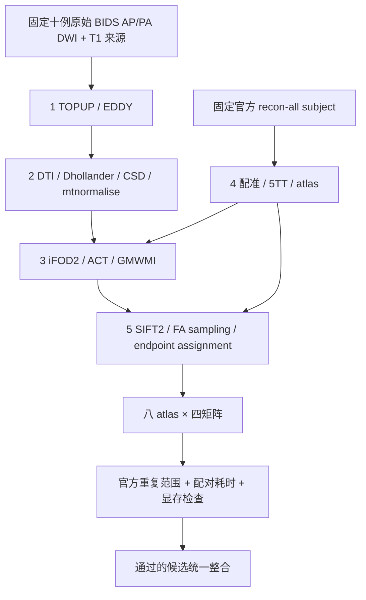
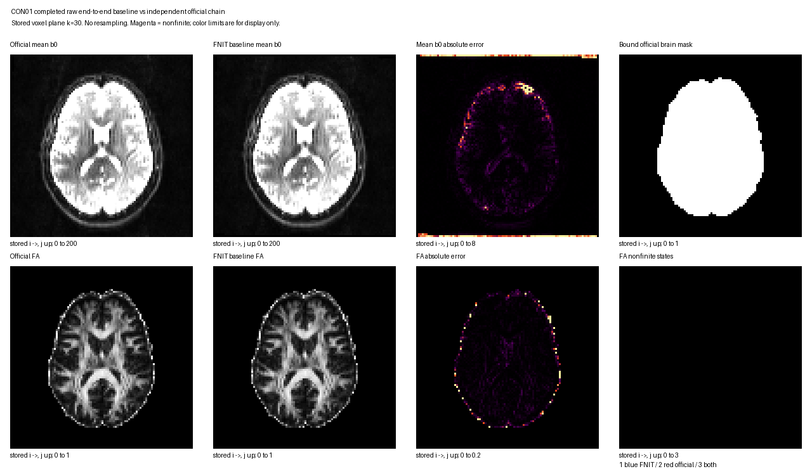
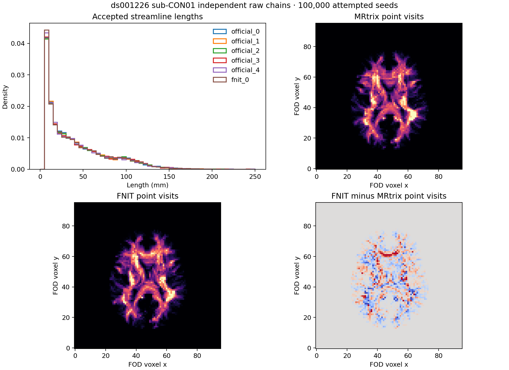

# UKBConnectome_pipeline 精度优化：2026-10-03

## 1. 功能与本轮目标

本轮从已发布的 `7af34e6d072e843fb2558c931bb2781f1d4b0be9` 开始，优化原始 BIDS DWI、已有官方 FreeSurfer subject 到 structural connectome 的精度。复用前一轮新下载的 ds001226 十例原始 AP/PA/T1（CON01、CON03–CON11，CC0）；FreeSurfer 科学输入保持固定，原始 MRI 和旧产物不改写。

每例仍为 100,000 次尝试播种、八套 atlas、四种矩阵。精度以同输入官方组件及独立 raw 链的官方五次重复范围验收；耗时以相同硬件、参数和计时范围的配对基线验收。不能增加播种数、优化迭代或追踪样本数换取精度，不能改变 SC 的统计定义。

五个子任务使用独立分支、代码范围和输出目录。受当前代理并发上限限制，三个子任务同时执行，其余两个排队；共享 GPU 的实际计算使用同一把锁串行运行。

本轮五项组件验收已完成，正式科学候选固定为 `1fe86ab8347b29d9c47be8109627736576222912` 的代码内容。后续说明和反证提交不改变该科学源码；整链执行结果另列。

| 子任务 | 核对结果 | 正式处理 |
|---|---|---|
| 1 TOPUP / EDDY | 固定参数渲染误差减小，但完整 CON03 EDDY RMSE 从 0.909807 增至 1.065940 / 1.315159 | 两种候选均拒绝，保留原生产实现与反证 |
| 2 梯度 / 张量 / 归一化 | 同 FNIT 校正 DWI：CON03 FA 最大误差 0.046249→0；CON10 0.921169→5.36×10⁻⁶ | 修正 Double 梯度解释、FSL affine 极分解及 C++ 四分位索引舍入 |
| 3 iFOD2 / ACT | 324 个真实 SGM 圆弧，最小 FOD 顶点与官方规则不同由 20→0 | 保留内部弦方向修正；撤回没有速度收益的 active-only 校准 |
| 4 5TT / GMWMI / atlas | 两例真实完整 5TT、GMWMI，以及固定同一自然刚体变换的标签重采样原版已逐值一致 | 保留成熟实现，半体素 header 试验不进入生产；本表不代表 TorchFLIRT 求解器已与 FSL 一致 |
| 5 SIFT2 / 采样 / 汇总 | CON03 五次固定官方 TCK × 八 atlas count 全部一致；Double 权重候选多数浮点矩阵误差增大 | 保留成熟实现与 Float32 mapped-track 消费语义 |

逐项输入、参数、原命令、精度、计时、脑图和失败原因见 [task 1](../../validation/connectome/accuracy_20261003/task_01/README.md)、[task 2](../../validation/connectome/accuracy_20261003/task_02/README.md)、[task 3](../../validation/connectome/accuracy_20261003/task_03/README.md)、[task 4](../../validation/connectome/accuracy_20261003/task_04/README.md)、[task 5](../../validation/connectome/accuracy_20261003/task_05/README.md)。归一化四分位修正没有改变四例真实 CSD 输出；不将它列为本轮实测图像收益。官方自估计 DWI 的病态负信号张量尾部仍有残余误差，完整记录保留在 task 2。

## 2. Python 调用、输入与输出

产品调用沿用[主流程说明](README.md#2-python-调用输入与输出)，公开类名和 CLI 入口不变。阶段验证先固定实际 DWI、梯度、掩膜、FreeSurfer 分割、FOD、5TT 或 TCK，分别核对官方结果。

每个子任务记录输入、源码、权重或模板及参考二进制的 SHA-256。输出包括真实精度报告、配对计时、allocated/reserved/进程树显存、候选是否采用，以及保留的失败项。整链 wall 评测在计时结束后保存同次返回的归一化 FOD、FA、5TT、GMWMI、变换与轨迹；atlas 已由 CLI 保存。response、归一化过程中间张量在独立组件诊断中记录，不冒充 wall 调用产物；导出时间与产品耗时分开。

整链基线与候选读取同一份已完成的官方 FreeSurfer subject；独立官方参考链读取前一轮另一份官方重建。两份文件的整体 SHA 不全相同；已有绑定正确的十例 130 项科学结构检查确认图像数组、affine、表面坐标/面及注释一致。本轮再次核对来源报告，CON01/03 的 brain 和六份表面数组另做 CPU 回读。此处不宣称两边 FreeSurfer 文件字节相同，也不把重建时间计入本次 raw-DWI CLI。

## 3. 命令行与参数

生产调用保持 `fnit UKBConnectome_pipeline`，参数解释及完整 BIDS 示例见[主流程 CLI](README.md#3-命令行调用)。本轮仍设置 `PYTORCH_CUDA_ALLOC_CONF=expandable_segments:True`，关闭 `compile_arc`，保持既有 TF32 与已验证的局部 FP32/FP64 策略，不使用 FP16/BF16。

不同候选在独立新目录执行；完整实际命令随报告保存，不覆盖旧完成或失败记录。尚未执行的命令不记作实测。

本轮同时修正既有 BIDS 完成判定的问题：相同包版本、输入路径和参数会复用旧矩阵，无法识别数值实现已经更新。`run_state.json` 的参数指纹现包含 `CONNECTOME_NUMERICAL_REVISION="accuracy-20261003-v1"`；旧记录不再判定完成，使用当前实现完成后仍可正常跳过。重算可选择新输出目录；原目录需显式 `--overwrite`，此参数也会重算 TOPUP/EDDY。只重算 connectome 时，可把已有校正 DWI 与旋转 bvec 通过 `--corrected-dwi`、`--rotated-bvecs` 提供给新输出目录。TOPUP/EDDY 的数值实现和阶段缓存规则保持原有版本。该修正已包含在正式科学源码及 CPU/CUDA 回归中。

## 4. 对应官方步骤

| 子任务 | FNIT 修改范围 | 同输入官方参考 |
|---|---|---|
| 1 原始 DWI 校正 | BIDS、TOPUP、EDDY | FSL `topup`、`eddy`，分别锁定实际参数及 CPU/GPU 版本 |
| 2 DWI 建模 | DTI、响应、CSD、归一化 | MRtrix `dwi2tensor`、`tensor2metric`、`dwi2response`、`dwi2fod`、`mtnormalise` |
| 3 追踪 | iFOD2、ACT、GMWMI | MRtrix `tckgen`，包括对应版本的播种、圆弧概率与终止状态 |
| 4 解剖与 atlas | 5TT、配准、表面/体积标签映射 | `5ttgen`、`5tt2gmwmi`、FSL `flirt`、官方 SynthMorph 与原 atlas 脚本 |
| 5 轨迹后处理 | SIFT2、标量采样、端点赋值和聚合 | `tcksift2`、`tcksample -precise`、`tck2connectome` |

原程序只用于独立 benchmark；产品继续使用 FNIT 实现，官方 `recon-all` 保留用户许可的前置例外。参考源码需匹配实际二进制的完整版本和 SHA，不以安装目录名或其陈旧 Git HEAD 代替版本绑定。

## 5. 已发布基线、验收与当前状态

本轮组件已完成，十例新整链正在执行，尚无完整 cohort 验收。CON01/03 的本轮基线、候选和 CPU 比较已完成；下面分别列本轮实测与前轮记录。

### 本轮 CON01：基线与候选配对已完成

该基线来自本轮实际原始 DWI 运行，源码为 `7af34e6d`，读取固定已完成官方 FS；完整 CLI 耗时 **2200.811 s**，不含本轮重建或计时后的结果导出。当前共享负载与前轮不同，下面的时间不能与前轮 643.623 s 直接计算加速比。

| 本轮真实基线范围 | 结果 |
|---|---|
| 三种显存实测峰值 | allocated 14.681595 GB；reserved 17.607688 GB；进程树采样 19.795018 GB；全部 `<20e9`，采样无失败 |
| 完整校正 DWI，102 帧 / 56,401,920 值 | 全部有限；全空间 RMSE 1.567377，相对 RMSE 3.94838%，Pearson 0.999087 |
| 校正 DWI，官方 brain mask / 11,753,052 值 | RMSE 1.067469，相对 RMSE 1.28319%，Pearson 0.999869 |
| 全部 102 组梯度 | bval 逐值相等；bvec 最大分量差 0.004052603，最大夹角 0.314094°；零向量和 `b<50` 支持差异均为 0 |
| 全空间 FA 非有限状态 | FNIT 36 NaN、官方 37 NaN；状态不一致 3；全值主指标为 `null` |
| 官方 brain mask 内 FA 非有限状态 | FNIT 35 NaN、官方 37 NaN；状态不一致 2；全值主指标为 `null` |
| FA 有限对诊断 | 全空间 552,922 对，RMSE 0.030725 / 最大误差 1.224744；官方 mask 115,189 对，RMSE 0.054492 / 最大误差 1.224696；该诊断与全值指标分列 |

来源为[实际完整报告](../../validation/connectome/accuracy_20261003/root/baseline_CON01_components_v2.json)，SHA `1fa40b59e1e7e4db893a62737e388b1873cc4058cfaffe705dc1fb29ce6b335b`；CPU 比较进程 20.345 s，1319 个文件前后 SHA 核验。这是双方各自校正 DWI/梯度/mask 的 raw 链比较，固定同一 DWI 的张量算子结果另见 task 2。FOD 与八 atlas 原网格相同但尚未数值评估；5TT 原网格不同，本比较器没有插值它。

图只展示原网格 `k=30`，完整 volume 与全部帧统计以上表及原报告为准。

候选 raw-DWI CLI 为 **2072.133 s**，该单次配对比基线少 **5.84686%**。候选 allocated 为 14.681651 GB，reserved 和进程树采样峰值分别为 17.607688 / 19.795018 GB；观测值均低于预算。共享 GPU 下的 CON03 反向顺序配对及两例耗时汇总另列。

候选 DWI、bvec、bval、mask 的文件 SHA 与本轮基线分别相同。FA 的 NaN 位置和状态差异不变，全值主指标仍为 `null`；有限对诊断 RMSE 全空间 0.03072482769→0.03072373794、官方 mask 0.05449217160→0.05448937207，mask 内最大误差 1.22469568 不变。完整原报告及候选脑图见[同次原始链比较](../../validation/connectome/accuracy_20261003/root/RAW_COMPONENT_COMPARATOR.md#5-最新精度耗时和真实脑图)。固定输入 DTI 的较大改进与此处 raw 链的小幅改进分别记录。

CON01 本轮基线与候选的八 atlas 矩阵分别为 **180/240→187/240** 项判定通过，保存轨迹分布分别为 **4/25→13/25** 项通过。分母是前述官方五次重复范围的比较判定；两版的两类整体验收状态均为 `failed`。同病例的全部官方成对指标与阈值，以及端点直方图的边界，已核对相同。

| CON01 判定字段 | 本轮基线通过数 | 本轮候选通过数 |
|---|---:|---:|
| Count 相对 L1，/40 | 30 | 25 |
| SIFT2 FBC 相对 L1，/40 | 36 | 29 |
| Count 支持 Dice，/40 | 24 | 33 |
| Count Pearson，/40 | 31 | 30 |
| 共有连接长度归一化 MAE，/40 | 35 | 38 |
| 共有连接 FA 归一化 MAE，/40 | 24 | 32 |

不同字段的变化分别保留：本例总通过数增加，同时 count/FBC 的 L1 与 Pearson 通过数减少。来源为[本轮实际基线、候选和阈值身份比较](../../validation/connectome/accuracy_20261003/root_baseline_matrix_analysis_v1/README.md#5-最新真实结果耗时与图)。此处评价独立随机轨迹的整体分布，固定 TCK 的后处理组件结果另列。

逐 atlas 的六项判定、全部失败值与阈值见[同次矩阵/轨迹原报告](../../validation/connectome/accuracy_20261003/cpu_matrix_deployment_v2/README.md#5-最新实测部署完成与科学判定)。CON01 接受率和长度 KS 对五个官方 seed 均通过；端点直方图通过 2/5、原网格保存点分布 1/5、四体素块分布 0/5。该空间分布比较与官方 `tckmap` 定义不同，不能作为官方 TDI 精度结论。

### 本轮 CON03：两臂已完成

CON03 候选实际 raw-DWI CLI 为 **2043.839 s**，接受 **11,582** 条轨迹；矩阵 **190/240** 项通过，轨迹分布 **3/25** 项通过，两类整体状态均为 `failed`。allocated 为 14.679791 GB，reserved 为 17.607688 GB，进程树采样峰值为 19.795018 GB，采样未报错。实际报告见 [CPU v3](../../validation/connectome/accuracy_20261003/cpu_matrix_deployment_v3/README.md)；源码与比较门槛保持冻结版本。

CON03 两臂的校正 DWI、bval、bvec 和 mask 文件 SHA 分别相同。全 102 帧 DWI 为有限值；官方 brain mask 内 RMSE 为 **0.871451**，Pearson 为 **0.999942**。bval 逐值相等，bvec 最大分量差 **0.003680290**、最大夹角 **0.240438°**。FA 全空间及官方 brain mask 内均为 FNIT 1 NaN、官方 6 NaN，非有限状态差异 5；两臂非有限位置逐体素相同，全部值主指标均为 `null`。官方 mask 内 98,695 个有限对的诊断 RMSE 为 **0.04771492864→0.04771664570**，增加 **1.71706×10⁻⁶**；全空间 552,954 对为 **0.02556712321→0.02556764795**，增加 **5.24740×10⁻⁷**。两种范围的最大误差均保持 **1.224619985**。完整[原配对报告、来源收据和真实脑图](../../validation/connectome/accuracy_20261003/root/RAW_COMPONENT_COMPARATOR.md#5-最新精度耗时和真实脑图) 保留该小幅退步。这些是独立原始链比较，不能替代固定 DWI 的张量组件验证。

本轮实际基线 raw-DWI CLI 为 **2033.586 s**，保留 **11,606** 条轨迹；矩阵为 **199/240**、轨迹分布为 **5/25** 项通过。相对本轮基线，候选六字段通过数变化分别为：Count L1 +2、FBC L1 +2、Dice −1、Pearson −4、Length MAE −3、FA MAE −5。接受比例、长度 KS、端点分布均未全部进入官方范围。两臂全部官方成对值、门槛、端点 bins 与公共网格已核对相同；[真实配对报告和脑图](../../validation/connectome/accuracy_20261003/root_baseline_matrix_analysis_v1/README.md#本轮-con03-baseline-与-candidate) 保留所有退步项。

| 同阶段实际配对 | 基线 CLI 秒 | 候选 CLI 秒 | 时间变化 |
|---|---:|---:|---:|
| CON01，基线→候选 | 2200.811 | 2072.133 | −5.847% |
| CON03，候选→基线 | 2033.586 | 2043.839 | +0.504% |
| 两例合计 | 4234.398 | 4115.972 | −2.797% |

四次实际调用的三类显存观测均低于 20e9 字节。共享负载下，两例合计减少 118.426 秒，CON03 单例增加 10.253 秒；该配对观察未证明受控环境中的严格速度保持。两例矩阵判定合计 **379/480→377/480**，轨迹分布 **9/50→16/50**；组件算法精度改进与随机整链判定分别记录。其余八例没有本轮新基线，不补造十例配对时间。

### 前轮已发布基线

| 项目 | 已发布基线 |
|---|---|
| raw-DWI CLI 中位数 | 候选版 643.623 秒；共享 GPU 负载和运行顺序影响已记录 |
| count Pearson 中位数 | FNIT 对官方 0.898292；官方自身重复 0.906871 |
| count 支持 Dice 中位数 | FNIT 对官方 0.610492；官方自身重复 0.612376 |
| 官方重复范围通过数 | 每版 1391/2400，57.96%；十例整体均 failed |
| 原优化前后一致性 | 320 张矩阵数值及解析后标量 bits 一致 |

验收保持原规则：误差不高于同病例、同模板官方十对比较的最大值；相似度不低于其最小值。总体中位数不能替代逐例、逐模板判断。长度和 FA 的归一化 MAE只比较双方共有连接，其他连接的支持差异另外报告。

矩阵通过率的分母为逐项比较判定：每例八 atlas × 六项准则 × 候选对五个官方 seed，合计 240 项；十例合计 2400 项。另报告接受比例、长度 KS、保存点访问分布和端点分布的 250 项轨迹判定。保存点访问分布的定义沿用既有报告，没有将它改称官方 `tckmap` TDI。固定输入组件精度、独立 raw 链精度与候选自身重复性分别记录；本轮每例一个 FNIT seed，因此自身重复性尚无本轮实测。

每项修改先通过真实同输入组件对照，再进行相同参数的基线/候选配对计时。保留实际提升精度且没有测得耗时退化的修改；三种显存均须低于 20,000,000,000 字节。共享负载不平衡时继续测量或明确未证明速度保持，不以旧 643.623 秒与另一负载下的新时间直接计算收益。完整 raw 链最终使用同一批十例与固定官方结果重新评估。

[原十例结果与脑图](actual_cohort_comparison.md) · [原独立 raw 链指标及失败明细](FINAL_RAW_MATRIX_RESULTS.md)

## 6. 本轮记录

- 2026-10-03：冻结 `7af34e6d` 基线，建立五个独立子任务和整合分支，核对 gpucw1/nodecw10 认证、真实输入和现有 GPU 负载。
- 活跃轨迹校准实验：真实 CON03 100k 的路径、端点、长度与接受种子逐位一致；本次 tracking wall 为 762.751→773.253 秒，未展示速度收益。最终候选恢复原校准循环，只保留独立 oracle 支持的 ACT chord 精度修正；实验原报告及其实际源码 SHA 保留不改。
- 正式科学源码冻结后，CPU 回归 752 passed、63 skipped；CUDA 回归 717 passed、7 skipped，两次均有 362 项子测试通过。CPU 范围为 connectome、EDDY、TOPUP，CUDA 范围为 connectome。额外 CPU 比较器 17 项通过；这些协议测试不代替真实 MRI 比较。[源码与测试来源核验](../../validation/connectome/accuracy_20261003/final_source_acceptance_v1/README.md) 记录原日志、现存测试目录与冻结版本的字节一致性；测试当时未保存源码前后清单，正式 raw 调用的清单另行逐次核对。
- 测试部署曾缺少仓库内下载脚本和 Tian S1 asset，导致 collection / fixture 失败；补齐实际测试资源后通过。两次失败的原日志保留，科学源码未改变，失败状态没有改写为成功。
- CPU 报告部署先补齐已有绘图环境，随后修复可选基线计时的状态判定：候选完成而同病例基线刚启动时，仅将配对耗时记为 `not_assessed`，待真正完成后执行原严格检查。38 项相关 CPU 回归通过；CON01/03 原矩阵、轨迹报告和 PNG 的 SHA 不变。当前使用 [v3 控制器](../../validation/connectome/accuracy_20261003/cpu_matrix_deployment_v3/README.md)，v1/v2 的部署失败记录完整保留。
- 正式计划共十二次 raw-DWI 运行：CON01 基线→候选、CON03 候选→基线，其余八例候选；使用同一套官方 FreeSurfer 输入、100k seeds、seed 0 与 EDDY GP seed 12345。完整矩阵和轨迹由同次返回对象在计时结束后导出。
- 整链结论待实际新运行和 CPU 比较完成后填写。

## 7. 原实现与参考文献

- [UKB-connectomics](https://github.com/sina-mansour/UKB-connectomics)
- [MRtrix3 源码](https://github.com/MRtrix3/mrtrix3)
- [FSL EDDY](https://fsl.fmrib.ox.ac.uk/fsl/docs/diffusion/eddy/index.html)
- [FSL TOPUP](https://fsl.fmrib.ox.ac.uk/fsl/docs/diffusion/topup/index.html)
- [FreeSurfer recon-all](https://surfer.nmr.mgh.harvard.edu/fswiki/recon-all)

Tournier JD et al. MRtrix3. *NeuroImage* 202, 116137 (2019)。Smith RE et al. SIFT2. *NeuroImage* 119, 338–351 (2015)。Andersson JLR, Sotiropoulos SN. An integrated approach to correction for off-resonance effects and subject movement in diffusion MR imaging. *NeuroImage* 125, 1063–1078 (2016)。
