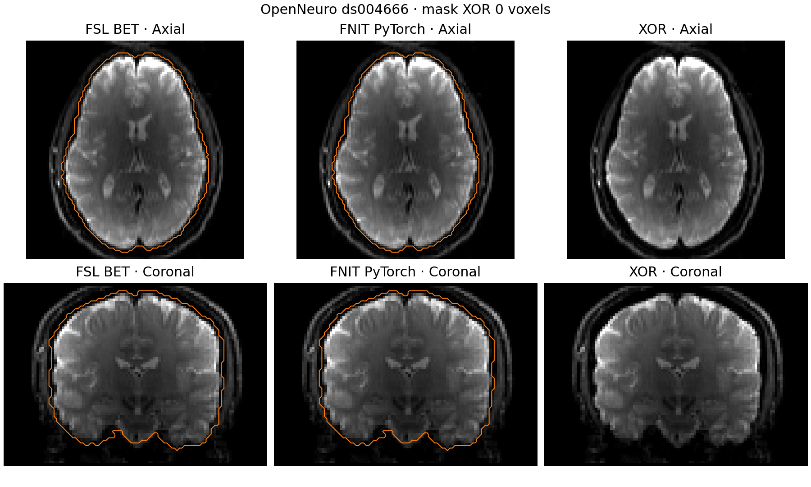

# mean b0 与 BET 脑掩膜

原 UKB 流程从已校正的 DWI 提取 b0、计算平均图，再执行 `bet -m -R -f 0.2 -g -0.05`。本页的三个函数实现这段计算。输入 DWI 已完成运动和畸变校正；T1 分割、配准和纤维追踪在后续阶段进行。FNIT 运行时只使用 nibabel 与 PyTorch，FSL 和 MRtrix3 仅用于独立生成对照结果。

## 输入与返回值

| 函数 | 输入参数 | 返回值 |
|---|---|---|
| `mean_bzero` | `dwi`：浮点 DWI 张量 `[X,Y,Z,N]`；`bvalues`：对应每卷的 b 值 `[N]`，单位 s/mm²；`bzero_threshold`：筛选上限，默认 50，使用严格小于 | 同设备 float32 平均 b0 张量 `[X,Y,Z]`。输入图先按 float32 解释，所选帧以 float64 归约，再转回 float32。 |
| `mrtrix_roundtrip_voxel_size` | `voxel_size`：输入 DWI NIfTI 三轴 header zoom `(x,y,z)`，单位 mm | 三元组 `(x,y,z)`，模拟 MRtrix MIF `vox:` 六位有效数字写入和 NIfTI float32 保存后的体素尺寸。它不改动图像数据或 affine。若直接读取已有 mean b0 NIfTI，应使用该图自己的 zoom。 |
| `bet_mask` | `mean_b0`：LAS（FSL radiological）体素顺序的三维浮点平均 b0；`voxel_size`：对应三轴尺寸，单位 mm；`fractional_threshold`：BET `-f`，默认 0.2；`vertical_gradient`：BET `-g`，默认 −0.05；`robust_center`：是否执行 BET `-R` 反复估计脑中心，默认 `True` | 与平均 b0 同网格、同设备的 `torch.bool [X,Y,Z]` 二值掩膜。函数不写 NIfTI，也不直接返回已乘掩膜的脑图。 |

`bet_mask` 使用 BET2 的五级二十面体（2,562 点、5,120 面）、1000 步表面演化、三角面采样和六邻接填充。`robust_center=True` 逐次更新强度加权中心，遵循 `bet -R` 的停止规则。CUDA 默认允许 TF32；图像用 float32，网格运算用 float64，没有半精度。输入梯度数与 DWI 帧数不一致、没有 b0 帧，或 BET 参数超出有效范围时会抛出 `ValueError`。

## 调用示例

```python
import nibabel as nib
import numpy as np
import torch
from fnit.connectome.bet import bet_mask, mean_bzero, mrtrix_roundtrip_voxel_size

image = nib.load("corrected_dwi.nii.gz")  # 输入：已校正、LAS 顺序的 4D DWI NIfTI
bvalues_np = np.loadtxt("dwi.bval")        # 输入：与 DWI 第四轴逐卷对应的 b 值
compute_device = torch.device("cuda:0")    # 计算设备；可改为 torch.device("cpu")
dwi_tensor = torch.as_tensor(
    np.asarray(image.dataobj, dtype=np.float32),  # nibabel 读取强度和 NIfTI scaling
    device=compute_device,                       # DWI 放入所选 CPU 或 CUDA 设备
)
bvalues_tensor = torch.as_tensor(bvalues_np, device=compute_device)

mean_b0 = mean_bzero(
    dwi=dwi_tensor,                # 输入：[X,Y,Z,N] 校正 DWI，浮点张量
    bvalues=bvalues_tensor,        # 输入：[N]，单位 s/mm²
    bzero_threshold=50.0,         # 输入：选取 b<50 的帧
)                                  # 输出：同设备 float32 [X,Y,Z] 平均 b0
bet_zooms = mrtrix_roundtrip_voxel_size(
    voxel_size=image.header.get_zooms()[:3],  # 输入：原 DWI 的三轴 NIfTI zoom，单位 mm
)                                              # 输出：MRtrix 往返后的三轴 zoom
brain_mask = bet_mask(
    mean_b0=mean_b0,              # 输入：LAS 顺序的三维平均 b0
    voxel_size=bet_zooms,         # 输入：与平均 b0 对应的三轴体素尺寸，单位 mm
    fractional_threshold=0.2,     # 输入：BET -f 的脑表面强度阈值
    vertical_gradient=-0.05,      # 输入：BET -g 的上下方向阈值梯度
    robust_center=True,           # 输入：启用 BET -R 的中心迭代
)                                  # 输出：同设备 bool [X,Y,Z] 脑掩膜
brain_b0 = mean_b0 * brain_mask    # 可供后续 b0→T1 配准的去脑强度图
```

上述函数只返回张量或体素尺寸。以 nibabel 写出 NIfTI 时，需按输出图的体素尺寸保存 header/affine；数组数值一致不代表 NIfTI 头信息逐位相同。

## 原软件命令

下面是独立对照的原软件调用；`rotated.bvec`、`dwi.bval` 与 `corrected_dwi.nii.gz` 属于同一次校正后的 DWI。`dwi.mif` 只是 MRtrix 中间图。运行 FNIT 函数不需要这些软件。

```bash
mrconvert corrected_dwi.nii.gz dwi.mif \
  -fslgrad rotated.bvec dwi.bval -datatype float32 -strides 0,0,0,1

dwiextract dwi.mif -bzero - | mrmath - mean -axis 3 mean_b0.mif
mrconvert mean_b0.mif mean_b0.nii.gz
bet mean_b0.nii.gz mean_b0_brain.nii.gz -m -R -f 0.2 -g -0.05
```

`mean_bzero` 对应第二行提取与平均；`mrtrix_roundtrip_voxel_size` 对应 MIF 写入后第三行的 zoom；`bet_mask` 对应最后一行产生的 `mean_b0_brain_mask.nii.gz`。`robust_center=False` 对应单次 `bet2 mean_b0.nii.gz brain.nii.gz -m -f 0.2 -g -0.05`。

## 同输入真实数据对照

公开输入为 OpenNeuro ds004666 的同一例校正 AP-DWI，形状 `104×104×72×105`，其中 `b<50` 有 5 帧；[校正输入来源与参数](../../validation/connectome/ds004666/corrected_input_provenance.public.json)单独记录。参考使用 MRtrix3 `eeab681d`、FSL 6.0.7.4；FNIT 在同一浮点 DWI 上运行。另有一例匹配 UKB 的真实校正 DWI 按同一命令复测，隐私数据只留在授权服务器。

| 数据与设备 | mean b0 对 MRtrix 最大误差 / 精确体素 | BET 掩膜对 FSL XOR / Dice | FNIT mean 核心 | FNIT BET 核心 | FNIT 峰值已分配显存 |
|---|---:|---:|---:|---:|---:|
| ds004666，CPU | 0 / 778,752 | 0 / 1.000000 | 0.030 s | 3.800 s | — |
| ds004666，H100 | 0 / 778,752 | 0 / 1.000000 | 0.076 s | 7.769 s | 0.354 GiB |
| 匹配 UKB，CPU | 0 / 778,752 | 0 / 1.000000 | 0.030 s | 3.722 s | — |
| 匹配 UKB，H100 | 0 / 778,752 | 0 / 1.000000 | 0.154 s | 7.172 s | 0.354 GiB |

同机公开样本原版 `dwiextract | mrmath mean` 用时 0.65 s、最大驻留内存 341,956 KiB；FSL `bet -R` 用时 9.46 s、最大驻留内存 36,296 KiB。匹配 UKB 的两项原版用时分别为 1.44 s、6.25 s。原版时间包含读取与写出中间图；FNIT 核心时间从 DWI 已载入张量之后计至 CUDA 同步，时间边界不同。公开样本 FNIT CPU/GPU 全进程墙钟分别为 5.834/11.916 s，包含 NIfTI 读取、计算和参考比较。以上均为共享节点的一次实测；H100 上 BET 的逐步网格计算在这次运行中慢于 CPU，不据此声称 GPU 加速。

脑图展示公开样本的轴位与冠状位。橙色线为脑掩膜边界，右列为逐体素 XOR；两套边界完全重合。



完整公开数值在[机器可读报告](../../validation/connectome/ds004666/bet_meanb0.public.json)。复跑比较使用[4D 输入脚本](../../tools/benchmark_connectome_meanb0_bet.py)及[脑图脚本](../../tools/plot_connectome_bet.py)：

```bash
python tools/benchmark_connectome_meanb0_bet.py \
  --dwi corrected_dwi.nii.gz \
  --bvals dwi.bval \
  --reference-mean-b0 mean_b0.nii.gz \
  --reference-mask mean_b0_brain_mask.nii.gz \
  --output-json bet_report.json \
  --output-mask fnit_brain_mask.nii.gz \
  --device cuda:0
```

`--dwi` 和 `--bvals` 是同一 4D 校正数据及逐卷 b 值；`--reference-mean-b0`、`--reference-mask` 是独立 MRtrix/FSL 输出；`--output-json` 保存数值、时间和显存，`--output-mask` 可选，保存供脑图比较的二值 NIfTI；`--device` 指定 CPU 或 CUDA。源码依据 FSL bet2 `2111.9`、meshclass `2111.0`、avwutils `2209.8`、newimage `2203.11` 与 MRtrix3 `eeab681d`；许可证与完整来源见[第三方声明](../../THIRD_PARTY_NOTICES.md)。
