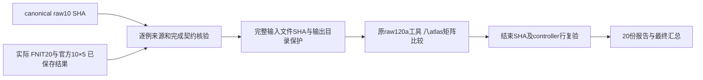
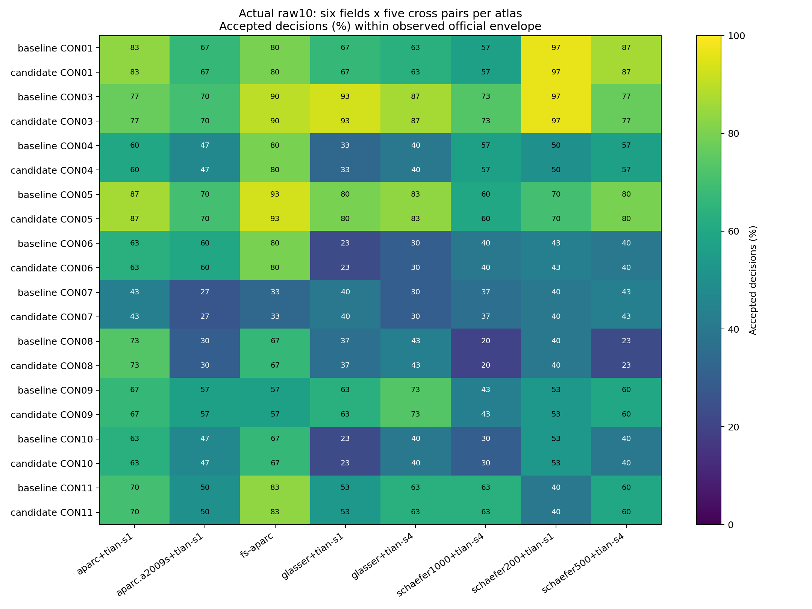

# 十例真实原始数据的最终矩阵比较

## 1. 功能、范围与结果

本工具读取已完成的 FNIT baseline/candidate 各十例结果，与同一原始病例的独立官方五次结果比较。每组包含八套 atlas、四种矩阵和六个指标。官方五次两两产生十个参考差异，单次 FNIT 与官方产生五个跨软件差异；每组共 240 个判定，20 组共 4800 个。数据为 ds001226 的 CON01、CON03–CON11，许可 CC0。

**20组实际比较均已完成，9099个本次不可变输入文件通过结束SHA复验；2782/4800个判定被接受（57.96%）。baseline和candidate各1391/2400，所有20组整体envelope均为failed。本次没有证明与原软件全链等价。**



## 2. Python 调用、输入与输出

运行环境沿用项目 Conda 环境。本工具只读元数据、CSV 和已保存报告，使用 NumPy 做矩阵统计，不运行神经影像处理。FNIT 生产结果保留原 PyTorch/TF32、FP64 SIFT2 和实际参数。

```python
from pathlib import Path
from tools.reference.benchmark_connectome_final_raw_envelope import main

# 使用交付配置的完整路径与SHA；fresh_output_directory必须尚不存在。
configuration_path = Path("/实际/final_raw_matrix_tools_v7/configuration.json")
configuration_sha256 = "9598a0014fca9b35b64b718d030eec64392116273f2e769cff81081e6e338175"
fresh_output_directory = Path("/独立输出目录/新的比较")
main(["--config", str(configuration_path),
      "--config-sha256", configuration_sha256,
      "--output-root", str(fresh_output_directory)])
```

输入配置逐项包括：`raw_manifest` 的 canonical 十例路径与 SHA；`mixed_configuration` 的已冻结实际 FNIT 来源配置；`v3_subset_receipt` 的六条完成资格与失败病例记录；`official_view` 的合法逐例来源 symlink view；`official_origin_binding` 与 `official_mapper` 的实际完整路径和 SHA；`raw_tool` 的原比较工具路径；`source_fingerprints` 的两臂科学源码指纹；`source_files` 的 runtime 文件身份；`selected_protected_roots` 的实际替代 run 目录；`historical_observation_JSONs` 的七份已冻结旧比较记录及明确历史角色。原混合配置中的当前 typed 契约和旧失败证据都保留。

每份 `envelope.json` 包含原始输入来源、官方与 FNIT seed、逐 atlas 节点语义、每对指标、官方 envelope、跨软件 accepted 布尔值、原始矩阵/node/atlas SHA。`actual_inputs.json` 保存实际选中 chain 和完整资格证据；`execution.json` 保存该份只读统计时间及接受计数。`observation_000000.json` 保存完整 map/来源审计；`immutable_input_snapshot.json` 保存本次输入文件 SHA；`final_report.json` 仅在全部20份完成并通过结束复验后生成，另保存官方 controller 前后 SHA、完成行恒等及交接病例未派发检查。`matrix_field_summary.csv` 为960行：20组×8atlas×6指标。

## 3. 命令行、参数与实际执行

```bash
CUDA_VISIBLE_DEVICES= PYTHONDONTWRITEBYTECODE=1 OMP_NUM_THREADS=1 OPENBLAS_NUM_THREADS=1 \
  /cwStorage/home/gongwk/anaconda3/bin/python3.11 \
  /实际/final_raw_matrix_tools_v7/benchmark_connectome_final_raw_envelope.py \
  --config /实际/final_raw_matrix_tools_v7/configuration.json \
  --config-sha256 9598a0014fca9b35b64b718d030eec64392116273f2e769cff81081e6e338175 \
  --output-root /独立输出目录/尚不存在的目录
```

`--config` 指向不可变配置；`--config-sha256` 验证其完整字节；`--output-root` 必须为绝对、新建且与输入/producer/runtime 双向无包含关系的目录。可选 `--check-only` 仅核验，`--watch` 等待已配置的实际来源，`--poll-seconds` 范围1–60，`--timeout-hours` 大于0且不超过168。本次来源已完成，未使用等待模式。实际完整 argv、主机、PID/start_ticks、源码与配置 SHA 见证据包 launch JSON。

## 4. 原软件调用及来源

官方结果来自真实原始 DWI 与 fresh FreeSurfer anatomy 的独立 CPU 流程，固定100000次 seed attempt，MRTRIX_RNG_SEED=0..4、tracking_threads=0、downstream_threads=8。每例 planned/executed 恰198条命令且全部returncode=0。原始完整命令见各例 `reference_manifest.json` 的 `commands/completed_commands`，其中明确记录 `tckgen`、`tcksift2`、FA/length 采样及八 atlas `tck2connectome` 的所有参数，不用缩写命令替代真实执行记录。

逐例 mapper 复用旧九例真实 producer；CON11 来自新的仅CON11 launch。完成 view 的 symlink 是来源路由，指向原始实际目录，不复制或冒充新 producer。map SHA 为 `a12765a9dd1257ec1ba6281c61ebdebd6f654c12f173dfc597c025527d1446aa`。每例独立核验372个 consumed/saved 文件，包含原始数据、DWI/anatomy 契约、FS、reader、TCK、scalar、矩阵和节点文件。

## 5. 精度、运行时间与可视化

指标为 count 相对L1、SIFT2 FBC相对L1、count支持Dice、count Pearson、公共边mean length归一化MAE、公共边mean FA归一化MAE。沿用原有限样本单侧规则：误差不超过官方十对的最大值；相似度不低于官方十对的最小值。更优于官方范围的值可接受。有限五次观察不称置信区间。节点索引/原标签/半球/名称必须一致；独立两链 atlas 内容可不同，每链自身重复仍须相同。

| 病例 | baseline接受/240 | candidate接受/240 | 两臂整体结果 |
|---|---:|---:|---|
| CON01 | 180 | 180 | failed |
| CON03 | 199 | 199 | failed |
| CON04 | 127 | 127 | failed |
| CON05 | 187 | 187 | failed |
| CON06 | 114 | 114 | failed |
| CON07 | 88 | 88 | failed |
| CON08 | 100 | 100 | failed |
| CON09 | 142 | 142 | failed |
| CON10 | 109 | 109 | failed |
| CON11 | 145 | 145 | failed |

| 指标 | 接受/800 | 未接受/800 |
|---|---:|---:|
| count_relative_l1 | 334 | 466 |
| sift2_fbc_relative_l1 | 440 | 360 |
| count_support_dice | 574 | 226 |
| count_pearson | 326 | 474 |
| mean_length_common_normalized_mae | 658 | 142 |
| mean_fa_common_normalized_mae | 450 | 350 |


各组读取、原矩阵统计及报告写出耗时合计 93.991秒，单组3.837–17.896秒。该数值不包含最初资格核验及最后完整文件SHA复验。

下面同时保留实际生产计时，FNIT raw-DWI CLI 与官方五次 tracking/downstream 范围不同，不计算二者加速比。原driver的端到端区间含历史失败、修复和排队；逐步骤记录以保存的stage-QC/官方198条命令计时为准。缺失的FNIT步骤计时不以总时间拆分或推算。完整worker、driver、queue和stage记录见timing_summary.csv。

| 病例 | baseline raw-DWI CLI秒 | candidate raw-DWI CLI秒 | 官方五次tracking/downstream秒 |
|---|---:|---:|---:|
| CON01 | 641.205 | 1972.731 | 427.833 |
| CON03 | 632.674 | 886.139 | 406.840 |
| CON04 | 1865.674 | 651.696 | 400.369 |
| CON05 | 714.866 | 590.165 | 444.362 |
| CON06 | 939.928 | 643.461 | 441.676 |
| CON07 | 975.425 | 643.785 | 441.178 |
| CON08 | 1074.915 | 615.960 | 416.060 |
| CON09 | 808.578 | 650.405 | 419.802 |
| CON10 | 688.258 | 584.227 | 417.947 |
| CON11 | 670.678 | 631.756 | 491.855 |


这里只读统计耗时，与 MRI pipeline 端到端耗时分开。FNIT 本次每臂每例只有一个 seed，因此 FNIT self=not_assessed；正式 CLI 未保存可用于本范围的 TCK/FOD，population=not_assessed。固定输入五次FNIT/五次官方的既有 self 结果属于另一范围，保留原报告，不并入本表。



颜色显示每atlas的30个判定接受比例，不表示统计显著性或解剖准确率。既有真实CON03/CON01脑图见原SIFT2两例说明；其固定TCK组件范围与本次全链矩阵比较分别保留。

## 6. 更新记录、真实故障与保留证据

旧v1的两个具体缺口：未充分保护实际raw/replacement/official producer目录；统计后未检查完整科学源与required输出。旧冻结源码、复现、PID52792精确停止及post-stop记录保留。v2提交bc9f2f81补充初始/ready双向目录保护、20条touched记录和完整结束SHA。

真实交接后的v2–v6全部在矩阵统计前被拒绝，source/config/log/failure原样保留：v2暴露成熟v9 `load_bindings` 中inner identity覆盖map identity，本wrapper独立读取并前后复验原map，root另修复成熟子函数；v3暴露旧groupB状态轮询变化，改为原mapper式完成行/工作量/重复派发检查，并记录前后SHA；v4暴露源码打包清单的相对许可证路径被误解释为本次运行输入，源码清单自身字节仍完整SHA绑定；v5定位旧`root_actual_cohort_comparison_v2/sub-CON01.connectome.json`中的历史driver观察SHA，七份历史报告显式列入配置，保留其完整字节而不当成本次typed输入；v6的目录保护拒绝项目内输出，v7使用项目外独立输出目录，保护不放宽。

最终wrapper SHA `9be317df1bc38fdaf993ccb16b29e52f902c681ecbf80a3d85c08521ef4ee235`；原raw120a比较源码未改。九项stdlib元数据回归通过；真实20资格、实际统计和结束SHA由本次产物证明。未重跑MRI/GPU，未改科学算法、参数、迭代、随机流、精度或判定阈值。早期七份raw结果、六例恢复receipt与失败candidate08继续保留。

## 7. 参考文献、实现与交付清单

原实现：[MRtrix3 v3.0.3](https://github.com/MRtrix3/mrtrix3/tree/3.0.3)。框架参考：Tournier等，NeuroImage 202, 116137 (2019)，[论文](https://doi.org/10.1016/j.neuroimage.2019.116137)。SIFT2参考：Smith等，NeuroImage 119 (2015)，[论文](https://doi.org/10.1016/j.neuroimage.2015.06.092)。命令及方法引用另见[官方参考文献](https://userdocs.mrtrix.org/en/latest/reference/references.html)。具体程序路径、二进制SHA、版本和原helper来源以每例实际manifest为准。

完整证据包保留20份报告、全960行指标、输入SHA、十例官方manifest、实际mapper/配置、最终及历史冻结wrapper、launch/log/failure。证据包只包含本任务报告和元数据工具；不新增发布权重/模板、原软件代码或许可证文件。现有数据/源码许可记录原样保存。

[完整证据包](../../validation/connectome/tenraw_20261002/task_04_final_raw_matrix_results_v7/evidence.tar.gz)，10779490字节，SHA256 `e8fde04c1f1fb5bbf23147e21ad5320cf6a6a161b344052a5a0f351d14ed99f3`。本地已复验全部122个归档文件的大小及SHA，逐份报告SHA与final_report一致，960行指标计数重新汇总为2782/4800。

[2018个未接受判定](../../validation/connectome/tenraw_20261002/task_04_final_raw_matrix_results_v7/failed_decisions.csv) · [逐指标明细](../../validation/connectome/tenraw_20261002/task_04_final_raw_matrix_results_v7/matrix_field_summary.csv) · [实际计时](../../validation/connectome/tenraw_20261002/task_04_final_raw_matrix_results_v7/timing_summary.csv) · [最终报告](../../validation/connectome/tenraw_20261002/task_04_final_raw_matrix_results_v7/final_report.json) · [归档文件索引](../../validation/connectome/tenraw_20261002/task_04_final_raw_matrix_results_v7/evidence_index.json)
