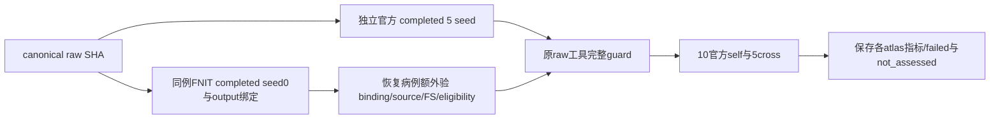
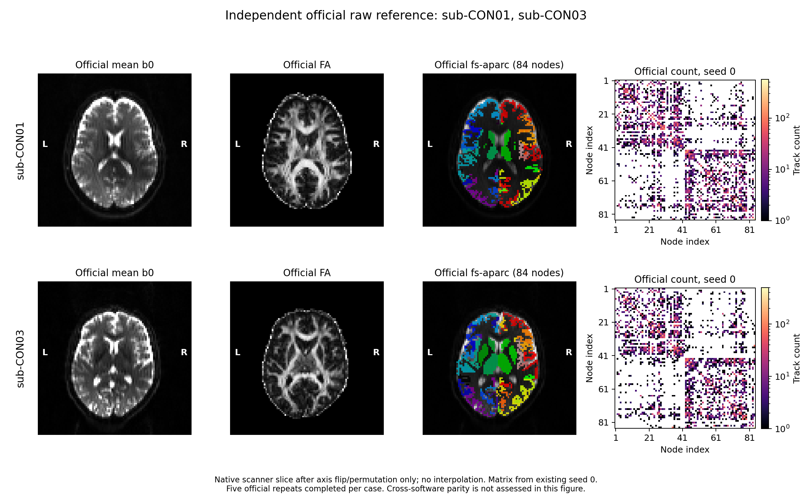

# 独立 raw 全链矩阵：当前已齐病例的早期只读验收

## 1. 功能与当前结论

`tools/benchmark_connectome_raw_cohort_envelope.py` 对同一份原始 BIDS 病例比较官方独立链五个 seed 与 FNIT 实际 seed 0 的四种最终矩阵。本文保存 Task4 提交 `6a518324` 的七份早期报告，以及接入时的来源复核；本次接入只读已有产物。

**范围：原始数据相同，上游 DWI、解剖、FOD、FA 和 atlas 由各软件独立计算。**这与固定 FOD/atlas 的五对五实验是两个范围。总控最新十例进展见[全队列说明](actual_cohort_comparison.md)。

当前七份合法报告全部 `matrix_envelope_status=failed`。每条FNIT链仅一个seed，所有FNIT self字段均为 `not_assessed`。人口分布也为 `not_assessed`，正式CLI没有保留TCK/FOD，不能补造人口分布。[只读汇总](../../validation/connectome/tenraw_20261002/task_04_raw_matrix_early_v1/summary.json)记录当前覆盖；不表示十例正式完成或匹配官方。



## 2. Python调用、输入输出与身份

```python
from pathlib import Path
from tools.benchmark_connectome_raw_cohort_envelope import compare

# 以下路径均指服务器既有实际产物；baseline/candidate必须分开调用。
remote_root = Path('/cwStorage/home/gongwk/Notebook_code/fnit_connectome_tenraw_20261002')
case_id = 'sub-CON01'
fnit_case_root = remote_root / 'formal_baseline_common_v3_raw_rerun_v1' / 'baseline' / case_id
raw_report = compare(
    official_root=remote_root / 'task_04/official_raw10_cpu_view_v3' / case_id,
    fnit_dirs=[fnit_case_root / 'connectome'],  # 已保存的八atlas四类CSV与nodes/atlas
    fnit_reports=[fnit_case_root / 'gpu_report.json'],  # 实际completed output ledger
    manifest_path=remote_root / 'formal_baseline_raw_v2/input_manifest.json',
    manifest_sha256='cc33e925a9e07362103b51f7bb70363a380d89b11a19545837676ba9a4ffae70',
    case_id=case_id,
    fnit_seeds=[0],  # 必须与真实CLI一致，不冒充五份FNIT重复
)
```

`official_root`包含真实reference_manifest及seed-0…4；`fnit_dirs`是既有矩阵根目录；`fnit_reports`逐一绑定实际完成报告；`manifest_path/manifest_sha256`锁定canonical原始文件；`case_id`唯一选择同例；`fnit_seeds`核对实际CLI标签。count、FBC、加权长度、加权preciseFA均为各atlas的K×K，K及行语义由该例nodes.tsv决定。输出保留完整pair、finite边界、矩阵/atlas/node/原始文件与报告SHA、单侧判定；self无pair不评估。

七份报告覆盖 CON01/03 的正式两臂、CON04 candidate、CON05 两臂。实际官方视图为 `task_04/official_raw10_cpu_view_v3`；这四例官方 manifest 都绑定 seed 0–4 和真实完成合同。接入时对原 envelope、execution、四例官方 manifest、raw 输入与恢复来源共 **96 个实际文件**重新读 SHA，全部匹配。见[服务器只读复核](../../validation/connectome/tenraw_20261002/task_04_raw_matrix_early_v1/curation_actual_remote_read_v1.json)。

七份原 JSON 用 gzip 无损保存；[来源索引](../../validation/connectome/tenraw_20261002/task_04_raw_matrix_early_v1/evidence_index.json)的 `entries` 保存原 83 项的文件名、压缩前后 SHA 和大小。`publication=adopted` 标记采用的 25 个原文件，另直接以源提交绑定原 `summary.json`，共 26 个；其余仅保留来源元数据，原字节仍在服务器和原交付提交中；没有重复发布大探查、GPU 报告、raw manifest 或完整官方 manifest。读取报告时用 `json.loads(gzip.decompress(Path(report_gzip_path).read_bytes()))`；`summary.json` 中的 `.json` 是原服务器逻辑名，对应本地 `.json.gz`。

## 3. 命令行、原工具与完整guard

实际 argv 和只读 wall time 保存在各 `execution.json`，原源码 SHA 见 `actual/config.json`。七次 envelope 的 returncode 均为 0；科学 gate 的 failed 由指标超过官方重复范围产生。原来三份工具快照与仓库现有源码逐字节相同，直接使用现有工具，不再复制。

```bash
# 以下为服务器 CON01 baseline 的已有产物；新输出文件请放到自己的空目录。
remote_root="/cwStorage/home/gongwk/Notebook_code/fnit_connectome_tenraw_20261002"
case_id="sub-CON01"
official_case_directory="$remote_root/task_04/official_raw10_cpu_view_v3/$case_id"
fnit_case_directory="$remote_root/formal_baseline_common_v3_raw_rerun_v1/baseline/$case_id"
canonical_raw_manifest="$remote_root/formal_baseline_raw_v2/input_manifest.json"
canonical_raw_manifest_sha256="cc33e925a9e07362103b51f7bb70363a380d89b11a19545837676ba9a4ffae70"
new_envelope_json="/your/new-output/CON01_baseline_envelope.json"
# 空 CUDA 可见设备，只读已有矩阵；不执行科学模块。
CUDA_VISIBLE_DEVICES= OMP_NUM_THREADS=1 OPENBLAS_NUM_THREADS=1 python \
  tools/benchmark_connectome_raw_cohort_envelope.py \
  --official-root "$official_case_directory" \
  --fnit "$fnit_case_directory/connectome" \
  --fnit-gpu-reports "$fnit_case_directory/gpu_report.json" \
  --raw-manifest "$canonical_raw_manifest" \
  --raw-manifest-sha256 "$canonical_raw_manifest_sha256" \
  --case-id "$case_id" --fnit-seeds 0 --output "$new_envelope_json"
```

`--output`指定新的报告文件；本轮harness为每次运行新建目录，拒绝覆盖。guard核对canonical原文件当前SHA、官方rawprep报告与所有原命令完成合同、独立raw scope、FNIT输入前后SHA、seed尝试数/CLI seed、atlas集合、矩阵有限性、每臂atlas身份、跨臂完整nodes语义，以及矩阵/nodes/atlas与completed GPU输出ledger的实际绑定。独立链之间atlas体素允许不同，不放宽每条链自身输入身份。统计仍只取严格上三角，对角线单独报；长度/FA只用共同非零count边。

## 4. 原软件实际参考与范围

本统计工具没有对应的独立 MRtrix 命令；它读取既有官方链的最终 CSV。官方 raw 参考先执行 TOPUP/EDDY、DWI 建模，再用本轮 fresh 官方 recon-all 结果构造 FreeSurfer-only 5TT/atlas，最后执行五个独立 seed 的 iFOD2/ACT、SIFT2 和矩阵构造。对应命令及其实际参数见[独立官方解剖与 atlas 说明](raw_official_anatomy_reference.md)，全部原 argv、program/source SHA、日志和计时保存在实际 `reference_manifest.json` 及其上游报告中。

| 阶段 | 官方步骤 / 本页消费内容 |
| --- | --- |
| 原始 DWI | TOPUP、EDDY 后的官方自产校正 DWI 与旋转梯度 |
| FOD 与 FA | `dwi2response dhollander`、`dwi2fod msmt_csd`、`mtnormalise`；官方 tensor/FA |
| 解剖与 atlas | `recon-all`、`5ttgen freesurfer`、`5tt2gmwmi`、官方 FS/Workbench/原 UKB atlas 脚本；Tian 使用官方 SynthMorph |
| 追踪与权重 | `tckgen -algorithm iFOD2`，ACT/GMWMI、`tcksift2` |
| 四矩阵 | `tck2connectome` 的 count/FBC/加权长度/加权 FA，消费实际同例 nodes 顺序 |

此参考为 `fnit-native`（无 FIRST，Tian 使用 SynthMorph），并非原 UKB FIRST/FNIRT 路线的严格对照。raw 工具要求实际全部 completed 命令 returncode=0 且计划与执行参数一致；接入复核只重读原字节哈希，未重跑官方命令。完整官方 manifest 不重复入库，其原 SHA 保存在每份 envelope 与来源索引中。

原定义不变：误差≤10个官方自身pair的最大观测误差，相似性≥最小观测相似性。比官方self更好的数值接受；finite缺失不能当零或pass。有限五次范围不是置信区间。该raw scope包含独立上游算法差异，不能用先前固定FOD/5×5结果替代。

## 5. 实际结果、失败位置与耗时

| Case | FNIT链 | 通过项 | cross整体 | FNIT self | 只读envelope秒 |
|---|---|---:|---|---|---:|
| sub-CON01 | baseline | 180/240 | failed | not_assessed | 4.9625 |
| sub-CON03 | baseline | 199/240 | failed | not_assessed | 4.4988 |
| sub-CON01 | candidate | 180/240 | failed | not_assessed | 4.4396 |
| sub-CON03 | candidate | 199/240 | failed | not_assessed | 4.4366 |
| sub-CON04 | candidate | 127/240 | failed | not_assessed | 4.5012 |
| sub-CON05 | candidate | 187/240 | failed | not_assessed | 4.4405 |
| sub-CON05 | baseline | 187/240 | failed | not_assessed | 4.7974 |

每份240项=8atlas×6字段×5cross；每atlas分母30。这些相关判定不是受试者通过率。

| Atlas | CON01 baseline | CON03 baseline | CON01 candidate | CON03 candidate | CON04 candidate | CON05 candidate | CON05 baseline |
|---|---:|---:|---:|---:|---:|---:|---:|
| aparc+tian-s1 | 25/30 | 23/30 | 25/30 | 23/30 | 18/30 | 26/30 | 26/30 |
| aparc.a2009s+tian-s1 | 20/30 | 21/30 | 20/30 | 21/30 | 14/30 | 21/30 | 21/30 |
| fs-aparc | 24/30 | 27/30 | 24/30 | 27/30 | 24/30 | 28/30 | 28/30 |
| glasser+tian-s1 | 20/30 | 28/30 | 20/30 | 28/30 | 10/30 | 24/30 | 24/30 |
| glasser+tian-s4 | 19/30 | 26/30 | 19/30 | 26/30 | 12/30 | 25/30 | 25/30 |
| schaefer1000+tian-s4 | 17/30 | 22/30 | 17/30 | 22/30 | 17/30 | 18/30 | 18/30 |
| schaefer200+tian-s1 | 29/30 | 29/30 | 29/30 | 29/30 | 15/30 | 21/30 | 21/30 |
| schaefer500+tian-s4 | 26/30 | 23/30 | 26/30 | 23/30 | 17/30 | 24/30 | 24/30 |

CON01两臂六字段通过数依次为count L1 30/40、FBC L1 36/40、count支持Dice 24/40、count Pearson31/40、长度nMAE35/40、FA nMAE24/40。CON03两臂分别33/40、36/40、32/40、20/40、38/40、40/40。两臂通过数相同不意味着所有矩阵逐bit相同，不能从本表推断优化收益。其余恢复病例的完整字段、每个官方pair和cross失败数见压缩原JSON及summary。

上述时间只包含原实际只读 SHA/guard/矩阵统计，不是 raw pipeline 速度。原 GPU/CLI timing、allocated/reserved/process-tree 与采样资格保留在原服务器 gpu_report/wall/eligibility 中，具体路径/SHA 由 execution 绑定；本页未拼接成连续冷调用时间。

2026-10-03 接入复核：gpucw1 的 96 个原文件读哈希 0.3980 秒；本地纯 stdlib 从保存的 pair 指标独立重放 **1680 项 gate**，逐项 threshold/decision/count 完全一致，合计 1259 项通过而七份报告整体均失败。headcw 空 CUDA 可见设备的 CPU 测试 **13 passed in 1.24 s**（完整 pytest 调用 1.6882 秒）。这些是身份和统计合同验证，不是影像算法速度或精度 benchmark。详见[接入复核](../../validation/connectome/tenraw_20261002/task_04_raw_matrix_early_v1/curation_actual_review_v1.json)及[CPU 实测测试](../../validation/connectome/tenraw_20261002/task_04_raw_matrix_early_v1/curation_actual_CPU_contract_tests_v1.json)。



图复用此前真实官方 raw 参考的 CON01/03 结果，仅展示输入解剖、atlas 和参考矩阵；不是新的 FNIT cross 脑图，也不表示矩阵验收通过。

## 6. 恢复来源核验与本轮错误记录

恢复candidate04/05与baseline05/11复用了原恢复producer的`load_helpers/origin/anatomy/eligible/verify_resources`只读核验函数，并核对selection及producer SHA、原terminal driver/config、原失败或未派发报告、source前后身份、raw来源、允许的配置差异、资源ledger、原runtime模块字节、fresh输出目录、实际CLI输出SHA和同轮FS。

candidate04/05的初次复验与原工具均通过。初次harness在同一Python进程切换到baseline时缓存了candidate helper，原`load_helpers`以`imported helper differs from declared original helper`正确拒绝；v1失败目录完整保留。修复只涉及只读harness：baseline05/11分别在独立进程运行，原helper/source/数学/输入guard均未改。两例恢复资格复验通过；baseline05得到187/240的 failed 报告。baseline11 的保存 execution 记录的是 **2026-10-03 00:18 UTC 当次探查**等待同例官方 manifest，不生成 envelope；这条历史 receipt 保持原样，不代表总控当前 CON11 状态。新增 CPU fixture 重现了旧缓存拒绝，以及全新 baseline 进程通过、修改声明 helper 字节仍被拒绝；没有改原 loader。

这些是早期病例的只读资格评估；本页不冻结总控最终 logical10 来源。最终来源由总控完整实际报告绑定。原 v1 cache guard 失败目录、四个 execution/log 文件完整保留，不覆盖成功参考或旧失败证据。

## 7. 最近版本、证据、参考与剩余工作

- 2026-10-03，Task4 `6a518324`：CON01/03 正式两臂及 CON04/05 恢复共七份原始矩阵对照，cross 全部 failed；保留实际 cache guard 错误与 CON11 当时 waiting receipt。
- 同日，总控精简接入：原 83 项索引来源及原汇总全部核验，采用 26 个必要原文件；省去重复大探查/GPU 报告/raw manifest/工具快照。增加 96 个实际文件 SHA 复核、1680 项保存 gate 重放与 13 项 CPU 合同测试，科学定义与生产代码没有变化。

[来源索引](../../validation/connectome/tenraw_20261002/task_04_raw_matrix_early_v1/evidence_index.json)、[原七份统计](../../validation/connectome/tenraw_20261002/task_04_raw_matrix_early_v1/summary.json)和[精简接入合同](../../validation/connectome/tenraw_20261002/task_04_raw_matrix_early_v1/CURATION.json)分别提供原字节身份、科学结论和本次采用范围。gzip 解压后逐字节等于原报告，不舍入指标。原实际 run/recovery 源码作为 evidence 保留，其顶层是原已执行 harness，**不要对保存目录再次运行它们**。正常调用使用仓库现有[raw 对照工具](../../tools/benchmark_connectome_raw_cohort_envelope.py)，工具字节 SHA 与原快照完全相同。

剩余工作：绑定总控最终十例实际来源后补齐所有同例 raw 对照；定位目前跨软件上游和矩阵偏差；若要评价 FNIT 自身重复性，须真正独立执行多个 FNIT seed。未保存的 tractogram/FOD 不能补写 population 指标。固定输入追踪实验的重复性结果继续单列，不替代本页原始全链验收。

原实现：[UKB-connectomics](https://github.com/sina-mansour/UKB-connectomics)、[MRtrix3](https://github.com/MRtrix3/mrtrix3)、[FreeSurfer](https://github.com/freesurfer/freesurfer)。步骤定义：[iFOD2/ACT tckgen](https://mrtrix.readthedocs.io/en/latest/reference/commands/tckgen.html)、[SIFT2](https://mrtrix.readthedocs.io/en/latest/reference/commands/tcksift2.html)、[tck2connectome](https://mrtrix.readthedocs.io/en/latest/reference/commands/tck2connectome.html)。参考文献：[ACT](https://doi.org/10.1016/j.neuroimage.2012.06.005)、[SIFT2](https://doi.org/10.1016/j.neuroimage.2015.06.092)、[MRtrix3](https://doi.org/10.1016/j.neuroimage.2019.116137)、[Tian atlas](https://doi.org/10.1038/s41593-020-00711-6)。
