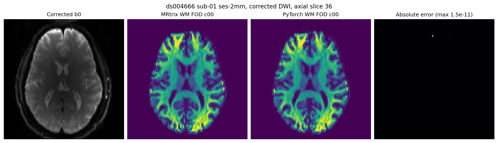
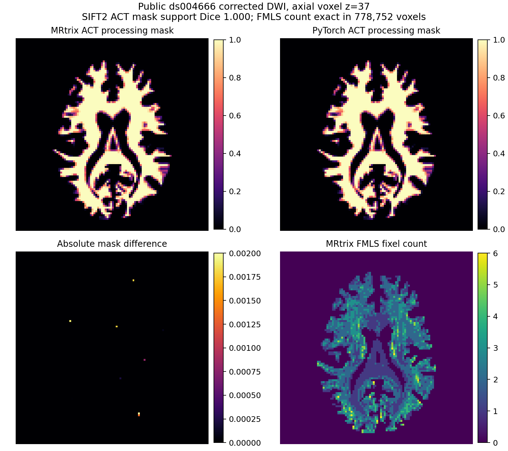
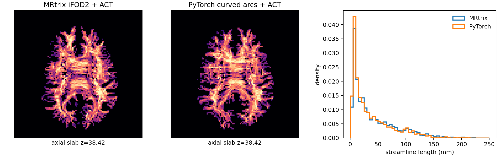
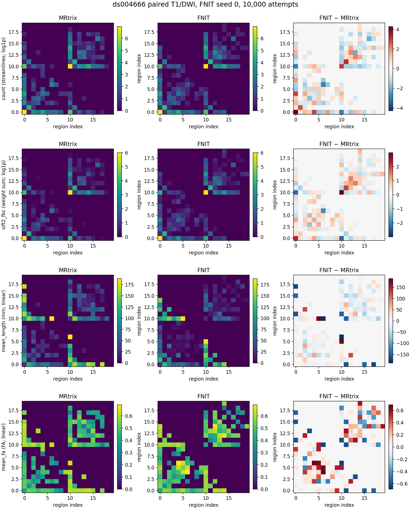

# 单被试 dMRI region × region connectome

[返回首页](../../README.md) · [源码](../../src/fnit/connectome/) · [ds004666 验证](../../validation/connectome/ds004666/README.md)

`UKBConnectome` 从**已完成畸变、运动和涡流校正**的 DWI、配套 bval 和 eddy 旋转后的 bvec 起步，结合配对 T1 的**官方 FreeSurfer recon-all** 分割、DWI 脑掩膜与固定脑区 atlas，返回 count、SIFT2 FBC、加权 mean length 和加权 mean FA 四张矩阵。响应、FOD、强度归一化、5TT/GMWMI、追踪、SIFT2、FA 采样与矩阵赋值由 PyTorch 在指定 CPU/CUDA 设备执行。CUDA 默认允许 TF32；图像主要为 float32，条件数敏感的求解和几何步骤使用 float64，不自动转为 float16/bfloat16。

**当前状态：** [阶段性成果与剩余工作](../../validation/connectome/STAGE_RELEASE_20260928.md)已归档。公开 ds004666 已完成多项固定输入阶段对照，并取得 10,000 次播种、显式固定脑掩膜与配准矩阵的整链 seed 0 四矩阵、时间、显存及输入哈希。自动 BET 默认分支单独验收；该旧整链报告不含它。独立追踪的连接支持和 FA 仍有差异；官方及 PyTorch 各三次固定种子的波动基线已核验，共同边 FA 仍有系统差异，因此尚不声明最终矩阵一致。

## 输入准备与安装

原 [UKB-connectomics 追踪脚本](https://github.com/sina-mansour/UKB-connectomics/blob/main/scripts/bash/probabilistic_tractography_native_space.sh) 读取 UKB 已校正的 `data_ud.nii.gz`、`bvecs` 和 `bvals`；它不从原始 BIDS DWI 执行 TOPUP/eddy。本接口也不在单次 connectome 调用内执行 TOPUP、eddy、去噪或 Gibbs 校正；LAS 网格 DWI 的 mean b0 可在调用内用 PyTorch BET 去脑。公开 ds004666 的校正输入由 AP/PA b0 运行 FSL TOPUP，再用 `eddy_cuda10.2` 生成校正 DWI 与旋转后的 bvec；元数据缺少实测总读出时间，实验两步均使用**假定 0.05 s**。[预处理命令、QC 与哈希](../../validation/connectome/ds004666/corrected_input_provenance.public.json)和[校正参考命令](../../validation/connectome/ds004666/corrected_mrtrix_commands.public.txt)保留完整条件。原始 DWI 不满足本接口的输入约定。

T1 解剖输入须先在包外运行**官方 FreeSurfer recon-all**，提供同次 T1 的 skull-stripped brain 图与 `aparc+aseg.mgz`。包内近似 Python recon-all 不参与当前 connectome 验证，也不在本接口自动执行。还需提供非负整数 atlas。DWI 为 LAS 体素顺序时，省略 `brain_mask` 会依照原 UKB 的 `bet mean_b0 -m -R -f 0.2 -g -0.05` 在 PyTorch 中生成脑掩膜；其他方向的 DWI 须提供同网格二值 `brain_mask`。默认不会自动运行 SynthSeg，也不会自动构造或下载 atlas；比较 MRtrix 时应固定同一脑掩膜、atlas、梯度、配准变换和参考响应掩膜。FreeSurfer、FSL 与 MRtrix 是**输入准备和软件对照工具**，不是 PyTorch 核心调用的内部可执行程序。

从仓库根目录安装 GPU 验证环境：

```bash
conda env create -f environment.yml
conda activate fnit
python -c "import torch, fnit; print(torch.__version__, torch.cuda.is_available())"
fnit connectome --help
```

CPU 小规模检查可使用 `--device cpu`。官方 FreeSurfer 的运行与许可由使用者在包外管理；本仓库不提供 recon-all 可执行程序、`license.txt`、UKB 原始受控数据或大体积 T1/DWI。

## Python API

```python
from fnit import UKBConnectome

result = UKBConnectome(device="cuda:0")(
    dwi="derivatives/dwi/sub-01_desc-preproc_dwi.nii.gz",  # 输入：校正后的 4D DWI
    bvals="derivatives/dwi/sub-01_desc-preproc_dwi.bval",  # 输入：每卷 b 值
    bvecs="derivatives/dwi/sub-01_desc-eddyRotated_dwi.bvec",  # 输入：旋转后的方向
    t1_brain="freesurfer/sub-01/mri/brain.mgz",  # 输入：同次 T1 去脑图
    t1_segmentation="freesurfer/sub-01/mri/aparc+aseg.mgz",  # 输入：官方分割
    atlas_dwi="derivatives/atlas/sub-01_space-dwi_atlas.nii.gz",  # 输入：整数分区
    brain_mask=None,        # 输入：None 时从 LAS DWI mean b0 运行包内 BET
    n_seeds=10_000,         # 输入：尝试的流线种子数
    shell_bvals=None,       # 输入：None 时从 b 值聚类 shell
    response_mask=None,     # 输入：None 时使用 DWI 默认响应掩膜
    fod_mask=None,          # 输入：None 时对 BET 掩膜膨胀两次
    normalise_mask=None,    # 输入：None 时对 BET 掩膜侵蚀两次
    fa_map=None,            # 输入：None 时从 DWI 拟合 FA
    dwi_to_t1_world=None,   # 输入：None 时运行 TorchFLIRT 6DOF/normmi
    seed=0,                # 输入：PyTorch 随机种子
)
count = result.matrices["count"]  # 输出：以 region_labels 为行列的 K×K 计数矩阵
```

| 参数 | 输入约定 |
|---|---|
| `dwi`、`bvals`、`bvecs`、`t1_brain` | 已校正 float32 DWI NIfTI `[X,Y,Z,N]`；逐 volume 对应的 bval、eddy-rotated FSL bvec；同次 skull-stripped T1 brain 图 |
| `t1_segmentation`、`atlas_dwi` | **必选**；官方 FreeSurfer `aparc+aseg.mgz` 和 DWI RAS 世界空间的整数 atlas。atlas 可有独立体素网格及 affine，正标签从 1 起 |
| `brain_mask` | 可选 DWI 网格二值 BET 掩膜；LAS DWI 省略时，用双精度累加 mean b0、MRtrix 写头体素尺寸规则及 PyTorch BET 自动生成；非 LAS DWI 须提供掩膜 |
| `n_seeds`、`seed` | 播种尝试数必选；PyTorch 随机数序列与 MRtrix 不同。原脚本 10,000,000 次尝试的耗时和内存未在此验证 |
| `shell_bvals` | 可选；固定 MRtrix response 文件中的 shell 标签。省略时从 bval 聚类 |
| `response_mask`、`fod_mask`、`normalise_mask` | 可选；固定参考阶段掩膜；默认响应掩膜由 DWI 的 `dwi2mask_legacy` 计算；FOD/归一化仍分别使用 `brain_mask` 的六邻域两轮膨胀/侵蚀 |
| `fa_map` | 可选；同网格已计算 FA（如 UKB `dti_FA`）；省略时从 DWI 拟合 MRtrix 风格 tensor FA |
| `dwi_to_t1_world` | 可选 `4×4` DWI RAS-mm → T1 RAS-mm 矩阵；省略时运行包内 6-DOF/normmi TorchFLIRT。FSL scaled-mm `.mat` 不能直接传入 |

`ConnectomeResult.matrices` 的四张对称 `K×K` 矩阵以 `region_labels` 映射行列；未分配流线不计入，自连接保留：


| 键 | 结构与单位 |
|---|---|
| `count` | int64，双端被分配的流线条数 |
| `sift2_fbc` | float32，逐流线 SIFT2 权重之和 |
| `mean_length` | float32，SIFT2 加权的边均值，mm |
| `mean_fa` | float32，SIFT2 加权的边均值，无量纲 |

自动 DWI→T1 配准已使用 NiBabel 读取 T1 与仓库内存 `Volume`，不导入 Surfa。既有[真实 b0/T1 隔离验证](../../validation/connectome_registration_no_surfa_20260928/README.md)显示迁移前后的世界矩阵逐元素一致；完整 connectome 未因这次迁移重新运行。

其余结果字段包括 `atlas`/`atlas_affine`、`five_tissue`/`five_tissue_affine`、`gmwmi`、`wm_sh`、`fa`、`brain_mask`、`tractogram`、`sift2_weights`、`dwi_affine` 与 `dwi_to_t1_world`。归一化 WM FOD 为 float32 `[X,Y,Z,45]`；5TT 是 cGM/sGM/WM/CSF/path 顺序的 float32 `[A,B,C,5]`，GMWMI 为同一 T1 网格 `[A,B,C]`，其 affine 映射到 DWI RAS 世界毫米。`tractogram.paths` 按流线顺序保存各 `[Pi,3]` 世界毫米坐标，`endpoints` 为 `[T,2,3]`，`lengths_mm` 和精确采样 `mean_fa` 为 `[T]`；`sift2_weights` 是同序 float64 `[T]`。

## 命令行与输出

```bash
# --dwi：已校正的四维 DWI；--bvals：逐体积 b 值。
# --bvecs：eddy 旋转后的梯度方向；--t1：同一被试 T1w。
# --atlas-dwi：DWI 世界坐标中的标签图；--t1-segmentation：既有 T1 标签。
# --output-dir：结果目录。
# --device：PyTorch 设备；--n-seeds：播种次数；--seed：随机种子。
fnit connectome \
  --dwi derivatives/dwi/sub-01_desc-preproc_dwi.nii.gz \
  --bvals derivatives/dwi/sub-01_desc-preproc_dwi.bval \
  --bvecs derivatives/dwi/sub-01_desc-eddyRotated_dwi.bvec \
  --t1 freesurfer/sub-01/mri/brain.mgz \
  --t1-segmentation freesurfer/sub-01/mri/aparc+aseg.mgz \
  --atlas-dwi derivatives/atlas/sub-01_space-dwi_atlas.nii.gz \
  --output-dir derivatives/fnit_connectome/sub-01 \
  --device cuda:0 --n-seeds 10000 --seed 0
```

输出是 `connectome_count.csv`、`connectome_sift2_fbc.csv`、`connectome_mean_length.csv`、`connectome_mean_fa.csv`，以及 `atlas_dwi.nii.gz`、`five_tissue_dwi_world.nii.gz`、`gmwmi_dwi_world.nii.gz`、`fa_dwi.nii.gz`、`brain_mask_dwi.nii.gz`、`region_labels.csv`、`dwi_to_t1_world.csv`。CSV 无表头；第 i 行对应 `region_labels.csv` 的第 i 项。5TT/GMWMI NIfTI 保留 T1 分割网格，affine 表示已映射到 DWI 世界坐标；文件名中的 `dwi_world` 不表示重采样到了 DWI 体素网格。默认拒绝覆盖现有输出，`--overwrite` 可重跑但始终拒绝覆盖输入文件。`--brain-mask`、`--shell-bvals`、`--response-mask`、`--fod-mask`、`--normalise-mask`、`--fa-map` 和 `--dwi-to-t1-world` 可固定对应的参考条件。

## 阶段函数的张量约定

所有影像张量使用所选 CPU/CUDA 设备；FOD 和 FA 与 DWI 同网格，5TT/GMWMI 可保留独立 T1 网格。仿射表示 voxel center → RAS 世界毫米，梯度方向遵循 MRtrix 导出的梯度坐标约定。

| 函数 | 主要输入 → 输出 |
|---|---|
| `mean_bzero` / `mrtrix_roundtrip_voxel_size` / `bet_mask` | 4D DWI 与 b 值 → float32 mean b0；原始体素尺寸 → MRtrix 往返尺寸；mean b0 与尺寸 → bool 脑掩膜。参数、输出与原版命令见 [BET 专页](BET_B0_OPERATORS.md) |
| `dwi2mask_legacy` | float32 DWI `[X,Y,Z,N]`、对应 b 值 `[N]`、shell 均值 `[S]` → 同设备 bool `[X,Y,Z]`；原版默认响应掩膜，详见[实测报告](../../validation/connectome/default_dwi_mask_stage_20260927.md) |
| `estimate_mrtrix_dhollander` | 原始幅值 float32 DWI `[X,Y,Z,N]`、MRtrix 梯度 `[N,4]`、shell `[S]`、bool 掩膜 `[X,Y,Z]` → shell 标签、float64 WM `[S,6]`、GM/CSF `[S,1]` 响应及组织掩膜/FA 诊断 |
| `fit_mrtrix_msmt_csd` | 同一 DWI/梯度/响应与 bool FOD 掩膜 → float32 WM SH `[X,Y,Z,45]`、GM/CSF `[X,Y,Z]`；默认 WM lmax=8 |
| `normalise_mrtrix_three_tissue` | 三组织原始 FOD、bool 掩膜、DWI affine → `MTNormaliseResult`：归一化三组织、bias field、接受掩膜及组织平衡系数 |
| `freesurfer_five_tissue` / `gmwmi_from_five_tissue` | 官方 FreeSurfer 整数标签 `[A,B,C]` → float32 5TT `[A,B,C,5]` → GMWMI `[A,B,C]` |
| `probabilistic_tractography` | 归一化 WM SH/affine、5TT/affine、GMWMI、播种次数 → `Tractogram` 的世界毫米流线、端点、长度和已接受种子 |
| `estimate_sift2_weights` | 同序流线、WM SH/affine、5TT/affine、`step_size_mm` → float64 逐流线权重 `[T]` |
| `sample_streamline_mean_precise` | 同序流线、float32 FA `[X,Y,Z]`、DWI affine → float32 沿轨迹均值 `[T]` |
| `build_connectomes` | 端点 `[T,2,3]`、整数 atlas/affine、逐轨权重/长度/FA → 四张对称 `[K,K]` 矩阵 |

## 原 UKB 脚本、ds004666 适配参考与当前实现

| 阶段 | 原 UKB 脚本 | 公开 ds004666 固定输入 MRtrix 参考 | 当前 PyTorch |
|---|---|---|---|
| 输入/掩膜 | UKB `data_ud` + 旋转梯度；BET b0 掩膜；Dhollander 不传 `-mask` 时由 DWI 自建掩膜 | FSL TOPUP/EDDY 校正 AP-DWI；已有阶段对照使用固定 SynthSeg 脑掩膜 | 调用方提供校正 DWI、旋转梯度；LAS DWI 默认运行 PyTorch BET，也可固定外部 BET 掩膜；默认响应掩膜从 DWI 计算，FOD/归一化使用 BET 掩膜的六邻域两轮膨胀/侵蚀 |
| 响应与 FOD | `dwi2response dhollander` → `dwi2fod msmt_csd` → `mtnormalise` | 同序；默认 WM `lmax=8`；固定参考掩膜 | `estimate_mrtrix_dhollander`、`fit_mrtrix_msmt_csd`、`normalise_mrtrix_three_tissue`；响应/FOD 的 float64 约束求解输出 float32 SH |
| T1/5TT/配准 | FreeSurfer 7.1 + FIRST；`5ttgen freesurfer -first -nocrop -sgm_amyg_hipp`、`5tt2gmwmi`；6-DOF/normmi FLIRT | 官方 FreeSurfer 8.2 `recon-all` 外置；安装的 MRtrix 3.0.3 无 `-first`，用 `5ttgen freesurfer -nocrop -sgm_amyg_hipp`；校正 b0 重新 FLIRT | 读取官方 `aparc+aseg.mgz` 构建 5TT/GMWMI；可固定变换或运行 TorchFLIRT 6-DOF/normmi；不重做 recon-all/FIRST |
| 流线/SIFT2 | `tckgen -seed_gmwmi -act -seeds N -select 0 -maxlength 250 -cutoff 0.1 -samples 3 -power 0.5`；`tcksift2 -act` | 同参数，10,000 次播种；固定 FOD/5TT/同 atlas 的阶段验证 | PyTorch GMWMI/双向 iFOD2 风格采样与 ACT 组织终止；MRtrix FMLS/处理掩膜/精确体素映射和 SIFT2 优化实现，随机方向接受律仍有差异 |
| atlas/矩阵 | 皮层 parcellation + Tian 亚皮层图；`tck2connectome -symmetric -assignment_radial_search 4`；原脚本另采样 MD、MO、S0、NODDI 等 | 固定相同 20 区 SynthSeg 示例 atlas；只比较四张矩阵 | 必选同一 atlas；四张矩阵，长度与精确沿程 FA；不提供原脚本所有扩展指标 |

[原追踪脚本](https://github.com/sina-mansour/UKB-connectomics/blob/main/scripts/bash/probabilistic_tractography_native_space.sh)、[原矩阵脚本](https://github.com/sina-mansour/UKB-connectomics/blob/main/scripts/bash/map_structural_connectivity.sh)、[校正参考命令](../../validation/connectome/ds004666/corrected_mrtrix_commands.public.txt)和[FreeSurfer 适配命令](../../validation/connectome/ds004666/corrected_mrtrix_fs5tt_act_adapted/commands.public.txt)给出实际调用。原 UKB 的 FIRST、Tian 分区及 1,000 万次播种都没有在公开样本上逐项复跑。

以下是对应阶段的参考命令骨架；实际 ds004666 参数、线程数、路径和校正条件以[校正参考命令清单](../../validation/connectome/ds004666/corrected_mrtrix_commands.public.txt)与[FreeSurfer 适配清单](../../validation/connectome/ds004666/corrected_mrtrix_fs5tt_act_adapted/commands.public.txt)为准：

```bash
mrconvert corrected_dwi.nii.gz corrected.mif -fslgrad eddy_rotated.bvec dwi.bval
dwi2response dhollander corrected.mif wm.txt gm.txt csf.txt
maskfilter brain_mask.mif dilate fod_mask.mif -npass 2
dwi2fod msmt_csd corrected.mif wm.txt wm_fod.mif gm.txt gm.mif csf.txt csf.mif -mask fod_mask.mif
maskfilter brain_mask.mif erode norm_mask.mif -npass 2
mtnormalise wm_fod.mif wm_norm.mif gm.mif gm_norm.mif csf.mif csf_norm.mif -mask norm_mask.mif
5ttgen freesurfer aparc+aseg.mgz 5tt_t1.mif -nocrop -sgm_amyg_hipp
5tt2gmwmi 5tt_t1.mif gmwmi_t1.mif
flirt -in b0_brain.nii.gz -ref t1_brain.nii.gz -cost normmi -dof 6 -omat diff2struct_fsl.txt
tckgen -algorithm iFOD2 -seed_gmwmi gmwmi_dwi.mif -act 5tt_dwi.mif -seeds 10000 -select 0 -maxlength 250 -cutoff 0.1 -samples 3 -power 0.5 wm_norm.mif tracks.tck
tcksift2 tracks.tck wm_norm.mif weights.txt -act 5tt_dwi.mif
tcksample -precise -stat_tck mean tracks.tck fa.mif mean_fa.txt
tck2connectome -symmetric -assignment_radial_search 4 tracks.tck atlas_dwi.nii.gz count.csv
```

最后三张矩阵分别在 `tck2connectome` 中增加 `-tck_weights_in weights.txt`；mean length/FA 还分别用 `-scale_file lengths.txt` 或 `-scale_file mean_fa.txt` 及 `-stat_edge mean`。`lengths.txt` 来自 `tckstats -dump`。固定真实流线的精确赋值报告检查了这些规则。

## 固定输入阶段证据

各行使用同一 ds004666 图像或同一官方中间输出，但**不是同一次端到端运行**。PyTorch 已载入张量的核心时间与 MRtrix/FSL 独立进程墙钟（含启动和 I/O）边界不同；不能把行间时间相加为整链加速比。

| 固定输入阶段 | 当前配对数值结果 | 时间与报告 |
|---|---|---|
| mean b0 与 `bet -R` | 公开 ds004666 及匹配 UKB 各 778,752 个 mean b0 值逐值一致，两个最终掩膜均 XOR 0；CPU/GPU 均核验 | 公开原版 MRtrix/FSL 0.65/9.46 s；FNIT H100 mean/BET 0.076/7.769 s、峰值 0.354 GiB；[参数、同输入报告与脑图](BET_B0_OPERATORS.md) |
| 默认响应掩膜 `dwi2mask legacy` | 相同真实 UKB DWI 掩膜 XOR 0 / 778,752；公开 ds004666 另测 XOR 0 / 778,752 | 原版 13.45 / 17.50 s，FNIT CPU 完整进程 4.73 / 5.33 s；[同输入报告与脑图](../../validation/connectome/default_dwi_mask_stage_20260927.md) |
| 原 UKB 默认 Dhollander 响应 | 11 个选择掩膜 XOR 0；WM/GM/CSF 响应系数最大误差 6.28e−11 / 2.55e−10 / 8.73e−11 | 原版完整命令 27.04 s；当前版 FNIT CPU 8 线程核心 3.197 s；[同输入报告](../../validation/connectome/original_ukb_dhollander_stage_20260927.md) |
| 原 UKB 全脑 MSMT-CSD | 212,831 个掩膜体素；WM 9,577,395 个系数最大误差 2.98e−8，GM/CSF 最大误差 2.84e−14 / 9.31e−10；全部小于 1e−7 | H100 求解 269.457 s、峰值已分配 1.354 GiB；MRtrix CPU 完整命令 107.04 s；[同输入报告](../../validation/connectome/original_ukb_fod_stage_20260927.md) |
| 原 UKB 掩膜形态学与 mtnormalise | 官方 BET 掩膜两次膨胀／侵蚀 XOR 均 0；WM/GM/CSF 归一化全图最大误差 1.19e−7 / 5.96e−8 / 2.98e−8 | H100 核心 0.650 s、0.461 GiB；MRtrix CPU 完整命令 2.11 s；[同输入报告](../../validation/connectome/original_ukb_mtnormalise_stage_20260927.md) |
| 六邻域掩膜、官方 FreeSurfer 5TT/GMWMI | 两轮膨胀/侵蚀各 XOR 0；256³×5 5TT 和 GMWMI 逐值 0 不一致 | [maskfilter](../../validation/connectome/ds004666/maskfilter_real.public.json)、[解剖/配准](../../validation/connectome/ds004666/ANATOMY_STAGE_20260927.md)；FreeSurfer recon-all 在包外耗时 1.645 h |
| Dhollander 响应（公开 ds004666） | 11/11 选择掩膜 XOR 0；WM/GM/CSF 最大误差 3.89e−9 / 9.06e−10 / 1.24e−10 | 当前版 CPU 核心 3.748 s；MRtrix 命令 17.01 s；[报告](../../validation/connectome/ds004666/response_fod_stage_20260927.md) |
| 全脑原始 MSMT-CSD（公开 ds004666） | 208,522 体素、9,383,490 个 WM SH 值，MAE 1.98e−12，最大 1.21e−6；尚未 mtnormalise | 当前版 H100 核心 267.419 s、batch_size=4096、峰值 1.253 GiB；MRtrix CPU 命令 185.51 s；[报告](../../validation/connectome/ds004666/response_fod_full.public.json) |
| 三组织 mtnormalise | 固定官方原始 FOD，WM SH 7,967,115 元素 MAE 4.79e−10、最大 5.96e−8 | H100 核心 0.568 s；MRtrix 命令 2.41 s；[报告与图](../../validation/connectome/ds004666/mtnormalise_stage_20260927.md) |
| GMWMI 播种与 iFOD2/ACT 风格追踪 | 种子 8 mm 空间分箱 r=0.4660，官方独立重复 r=0.4664；10,000 次播种，MRtrix/PyTorch 分别接受 2,767/2,950 条，长度 KS=0.0577 | PyTorch 58.45 s，MRtrix 2.96 s；[报告与图](../../validation/connectome/ds004666/tracking_act_stage.md)。随机轨迹不能逐条比对 |
| SIFT2 固定 FOD/5TT/官方 TCK | 处理掩膜 285/778,752 体素不同，非零支持 Dice=1；fixel 总数两臂均 243,822；全 fixel TDI r=0.9999999371；固定 2,758 条轨迹最终权重 r=0.999999903、MAE 3.44e−5 | [FMLS/处理掩膜图](../../validation/connectome/ds004666/sift2_fmls_stage_20260927.md)、[轨迹映射图](../../validation/connectome/ds004666/sift2_mapping_stage.md)、[优化器报告](../../validation/connectome/ds004666/sift2_optimizer_fmls_exact.public.json) |
| 固定 2,758 条轨迹精确 FA 均值 | 原 MIF 几何逐轨 r=0.9999999949、MAE 5.58e−7，最大 0.0005499 | CPU 首轮 0.124 s、后续中位 0.102 s；MRtrix 命令 0.03 s；[报告与图](../../validation/connectome/ds004666/tcksample_precise_stage.md) |
| 固定真实轨迹的四矩阵赋值 | 2,915 条双端分配一致；count 400/400 元素完全一致，FBC/长度/FA 最大误差 8.99e−6 / 5.63e−6 mm / 2.96e−8 | [赋值报告](../../validation/connectome/ds004666_fsl_act_real_tracks_assignment_report.json) |









**当前整链 seed 0：** 10,000 次播种接受 2,827 条流线，H100 调用 266.83 s、峰值 Torch 分配 2.720 GiB。相同校正 DWI、官方 T1 分割、atlas、掩膜及变换下，count/FBC 上三角 Pearson r=0.98864/0.98527，支持 Dice=0.73585；mean length/FA 全边 r=0.57720/0.62107。完整指标、CSV 和差异诊断见[当前验证](../../validation/connectome/ds004666/README.md)。三次官方与三次 FNIT 的固定随机种子比较已完成：count/FBC 误差与官方波动部分重叠，但共同边的 FA 跨软件 9/9 对均超出官方重复的 3/3 最大误差。

## 复跑阶段与整链比较

[公开 ds004666 清单](../../validation/connectome/ds004666/download_manifest.tsv)记录 OpenNeuro T1、AP/PA DWI 地址、大小和 SHA-256。完整中间数据体积较大，NIfTI、TCK、官方 FreeSurfer 输出及原始 SIFT2 调试文件留在验证机器；Git 保留脚本、矩阵 CSV、报告和图像。按各阶段报告准备配对图像后运行对应脚本的 `--help`：

| 阶段 | 脚本入口 |
|---|---|
| 响应、FOD、掩膜 | [`benchmark_connectome_response_fod_dhollander.py`](../../tools/benchmark_connectome_response_fod_dhollander.py)、[`benchmark_connectome_response_fod.py`](../../tools/benchmark_connectome_response_fod.py)、[`benchmark_connectome_maskfilter.py`](../../tools/benchmark_connectome_maskfilter.py) |
| mtnormalise、解剖、追踪 | [`benchmark_connectome_mtnormalise.py`](../../tools/benchmark_connectome_mtnormalise.py)、[`benchmark_connectome_anatomy.py`](../../tools/benchmark_connectome_anatomy.py)、[`benchmark_connectome_tracking_act.py`](../../tools/benchmark_connectome_tracking_act.py) |
| SIFT2、FA、矩阵 | [`benchmark_sift2_processing_mask.py`](../../tools/benchmark_sift2_processing_mask.py)、[`benchmark_sift2_fixels.py`](../../tools/benchmark_sift2_fixels.py)、[`benchmark_connectome_sift2_mapping.py`](../../tools/benchmark_connectome_sift2_mapping.py)、[`benchmark_connectome_sift2_optimizer.py`](../../tools/benchmark_connectome_sift2_optimizer.py)、[`benchmark_connectome_tcksample_precise.py`](../../tools/benchmark_connectome_tcksample_precise.py)、[`compare_connectome_matrices.py`](../../tools/compare_connectome_matrices.py) |

当前整链脚本 [`benchmark_connectome_end_to_end.py`](../../tools/benchmark_connectome_end_to_end.py)要求固定同一校正 DWI、旋转梯度、官方 aparc+aseg、T1 brain、atlas、脑掩膜、DWI→T1 RAS-mm 变换与参考矩阵目录；可再传响应/FOD/归一化掩膜、FA 和 shell 标签。参考目录接受原始 MRtrix 的 `count.csv` 等文件名，也接受公开归档的 `connectome_count.csv` 等文件名。脚本写出 `candidate_*.csv`、轨迹 TCK、逐轨权重/长度/FA 和带输入 SHA-256、边指标、时间、Torch 峰值显存的 `report.json`。三个 FNIT 种子和三个官方固定 RNG 种子的四矩阵、输入哈希与官方自身随机波动已核验；见[3×3 同口径报告](../../validation/connectome/ds004666/official_mrtrix_rng_variability/official_fnit_3x3.public.json)。

```bash
python tools/benchmark_connectome_end_to_end.py --help
python tools/benchmark_connectome_end_to_end.py \
  --dwi corrected_dwi.nii.gz --bvals corrected_dwi.bval \
  --bvecs eddy_rotated.bvec --t1-brain t1_brain.nii.gz \
  --aparc-aseg aparc+aseg.mgz --atlas-dwi atlas_20_dwi.nii.gz \
  --brain-mask brain_mask_dwi.nii.gz --transform dwi_to_t1_world.txt \
  --reference-dir reference_matrices --output-dir candidate_seed0 \
  --n-seeds 10000 --seed 0 --device cuda:0
```

四张矩阵的比较固定脑区顺序，按严格上三角同时报告全边与共同非零边指标；长度/FA 的共同边指标用于区分数值偏差与连接支持差异。固定真实轨迹的赋值一致性不能代替独立追踪后的矩阵一致性。
