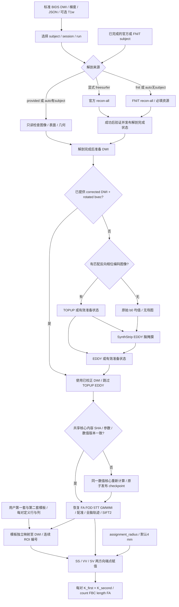

# UKBConnectome_pipeline：BIDS DWI/T1 与用户模板的结构连接

[返回首页](../../README.md) · [recon 三种来源](recon_backends.md) · [模板输入与配对](template_pairs.md) · [阶段 checkpoint](checkpoints.md) · [本轮评测范围](../../validation/connectome/paired_pipeline_20261003/README.md)

当前接口接受原始 BIDS DWI/T1w，或已有校正 DWI 与旋转梯度；解剖可以来自用户已完成的 subject、显式选择的官方 FreeSurfer，或 FNIT recon-all。一次全脑 ACT 追踪与 SIFT2 可服务一对或多对用户模板，输出 surface–surface（SS）、volume–volume（VV）、surface–volume（SV）的四种连接矩阵。

默认 `recon_backend="auto"`：有 `freesurfer_subject_dir` 时读取该目录，没有时选择 FNIT。FNIT 重建必须给出权重与结构像资源；缺失时明确报错。官方重建须显式选择 `freesurfer`。当前接口、组件测试、历史科学对照和本轮整链评测分别记录；第 5 节保留历史版本的精度结论，模板和缓存接入不表示已匹配原 UKB 全链。

## 1. 功能和流程

先完成或验证解剖重建，再进入 DWI GPU 阶段，避免父进程的 EDDY allocator 与 FNIT 重建子进程同时驻留。DWI 准备根据已有校正输入、反向相位编码数据和阶段状态选择路径。共享核心的内容 checkpoint 独立于模板；换模板不重新播种，换半径只使相应矩阵失效。



这里的共享核心是一个完整阶段，从 mean b0/mask/tensor FA 到 response、MSMT-CSD、mtnormalise、5TT/GMWMI、DWI→T1、iFOD2/ACT、SIFT2 和 precise FA sampling。它暂不逐子算子恢复。用户模板准备与矩阵分别缓存；兼容的命名 atlas 接口仍可用，旧 `atlas_results` 在调用中构建。

播种、传播、ACT 约束与尝试次数由全脑共享核心确定。两套模板配对在追踪完成后筛选已接受流线的端点，不触发 ROI 播种、waypoint 约束或重新追踪。端点分别在两张模板内做默认 4 mm 严格径向搜索，按 `(A(p0),B(p1))` 与 `(A(p1),B(p0))` 汇总，同一单元只计一次。跨模板矩阵是 `K_first×K_second`，不强制对称或清零对角；交换两张模板得到转置。相同 `TemplateSpec` 使用原 square builder，保持已有的对称矩阵和 self-connections。

## 2. Python 调用、输入与输出

```python
from fnit.connectome import UKBConnectome_pipeline
from fnit.connectome.template_inputs import TemplatePair, TemplateSpec

surface_a = TemplateSpec(
    name="cortex_A", kind="surface", space="native",
    left_path="templates/lh.A.annot",       # 同一个 subject 左半球注释
    right_path="templates/rh.A.annot",      # 同一个 subject 右半球注释
    nodes_tsv="templates/A_nodes.tsv",      # 跨被试固定行节点定义
)
volume_b = TemplateSpec(
    name="subcortex_B", kind="volume", space="t1",
    volume_path="templates/B_t1.nii.gz",    # subject brain 的 scanner RAS
    nodes_tsv="templates/B_nodes.tsv",      # 跨被试固定列顺序与缺失节点
)
pairs = [TemplatePair(name="cortex_to_subcortex", first=surface_a, second=volume_b)]

pipeline = UKBConnectome_pipeline(device="cuda:0")
result = pipeline.run_bids(
    bids_root="/data/study_bids",            # 原始 BIDS DWI / bval / bvec / JSON
    output_dir="/data/derivatives/sc/sub-01", # 该被试的准备输出和 checkpoint
    subject="01",                           # 有多个 session/run 时明确选择
    freesurfer_subject_dir="/data/subjects/sub-01",
    recon_backend="provided",               # 读取已完成官方或 FNIT subject
    template_pairs=pairs,                    # 一对或多对，共用全脑流线集
    n_seeds=100000, seed=0,                  # 尝试播种数和追踪种子
    eddy_gp_seed=12345,                      # 独立的 EDDY GP 选点种子
    assignment_radius=4.0,                   # mm，不影响共享核心 checkpoint
)
pair_result = result.pair_results["cortex_to_subcortex"]
print(pair_result.matrices["count"].shape)    # K_first × K_second
print(result.preparation_stages, result.cache_status)
```

执行新重建时不传 `freesurfer_subject_dir`。原生注释必须对应实际生成 subject 的顶点顺序；来自另一份重建的 native 文件应先映射到新网格。下面使用 fsaverage 表面模板和 MNI volume 模板，供新 FNIT 或官方重建消费：

```python
standard_surface = TemplateSpec(
    name="cortex_A", kind="surface", space="fsaverage",
    left_path="/data/templates/lh.A.annot",  # 与下方 fsaverage 顶点对应
    right_path="/data/templates/rh.A.annot",
    fsaverage_dir="/data/subjects/fsaverage",
    nodes_tsv="/data/templates/A_nodes.tsv",
)
standard_volume = TemplateSpec(
    name="volume_B", kind="volume", space="mni",
    volume_path="/data/templates/B_mni.nii.gz",  # 与 MNI reference 同一 RAS 空间
    nodes_tsv="/data/templates/B_nodes.tsv",
)
generated_pairs = [TemplatePair("cortex_to_subcortex", standard_surface, standard_volume)]

# FNIT：auto 在没有 subject 时也解析成此 backend；资源仍须显式提供。
fnit_recon = dict(recon_backend="fnit", recon_options={
    "weights_dir": "/data/fnit-weights",     # 已校验的模型权重
    "assets_dir": "/data/fnit-recon-assets", # 固定结构像图谱和资产
    "native_bin_dir": "/opt/conda/envs/fnit/bin", # FNIT 独立构建程序，可省略
    "threads": 4, "hemisphere_workers": 1,
})
# 官方：用户已安装并许可；FS_LICENSE 从环境继承。
official_recon = dict(recon_backend="freesurfer", recon_options={
    "executable": "/opt/freesurfer/bin/recon-all",
    "freesurfer_home": "/opt/freesurfer", "threads": 4,
})
fnit_result = pipeline.run_bids(
    bids_root="/data/study_bids", output_dir="/data/sc/sub-01-fnit",
    subject="01", n_seeds=100000, seed=0, eddy_gp_seed=12345,
    template_pairs=generated_pairs, mni_template="/data/templates/MNI_T1w.nii.gz",
    **fnit_recon,
)
official_result = pipeline.run_bids(
    bids_root="/data/study_bids", output_dir="/data/sc/sub-01-official",
    subject="01", n_seeds=100000, seed=0, eddy_gp_seed=12345,
    template_pairs=generated_pairs, mni_template="/data/templates/MNI_T1w.nii.gz",
    **official_recon,
)
```

已有校正输入时，在 BIDS 调用中同时传 `corrected_dwi` 与 `rotated_bvecs`；原始所选 BIDS bval 定义每帧 b 值。直接接口 `pipeline(dwi=..., bvals=..., bvecs=..., freesurfer_subject_dir=..., template_pairs=pairs, n_seeds=...)` 消费已校正输入。直接调用默认不启用 checkpoint；需要时显式传 `checkpoint_dir`。

| 输入 / 参数 | 格式、默认值和空间 |
|---|---|
| BIDS DWI / bval / bvec / JSON | DWI `[X,Y,Z,N]`；bval 为 N 值，bvec 为 3×N 或 N×3。侧车定义 PE 方向和读出时间；支持 BIDS 继承和反向图像关联。 |
| `subject` / `session` / `run` / `acquisition` / `direction` | subject 必填，其他用于候选不唯一时选片。 |
| `t1` 或 `freesurfer_subject_dir` | 可用 BIDS T1w 或显式 T1；与已完成 subject 互斥。subject 读取 brain/aparc+aseg/ribbon/双侧 white/pial；表面模板另检查所需注释和球面。 |
| `recon_backend` / `recon_options` | 默认 auto；provided 不接受执行资源选项。FNIT 必填 weights_dir/assets_dir；官方需显式选 freesurfer。未知键、资源缺失或输出检查失败时报错。 |
| `template_pairs` | 非空一对或多对，名字不同；每对 first 定义行、second 定义列。 |
| surface 模板 | 双半球 `.annot` 或 `.label.gii`；native 顶点须匹配本 subject，fsaverage 须给 fsaverage_dir。 |
| volume 模板 | 3D 整数 NIfTI/MGH/MGZ；明确 `space=dwi/t1/mni`。不能由文件名猜空间或混用 surface RAS、voxel 坐标。 |
| `nodes_tsv` | 单人可省略；跨被试为每套模板提供固定 index/original_label/hemisphere/name。声明但未出现的节点保留；未声明的非背景 ID 报错。 |
| `mni_template` / `mni_to_t1_transform` | MNI volume 模板提供 MNI T1 reference，或已有 SynthMorph MNI→T1 warp；标签可与配准用 MNI intensity 不同体素网格，但必须在同一 MNI/RAS 坐标空间。目标须匹配 T1。 |
| `n_seeds` / `seed` | n_seeds 必填；seed 默认0。PyTorch 与 MRtrix 相同数值 seed 不生成相同流线。 |
| `eddy_gp_seed` | 默认 None，EDDY 原有时间种子；可选 1..2³²−1，固定 GP 体素选点，与追踪种子独立。 |
| `assignment_radius` | 默认4.0 mm，有限且正；边界用严格小于。改变只使对应矩阵失效。 |
| `checkpoint_dir` | run_bids 和配对 CLI 默认 OUTPUT_DIR/checkpoints；直接 Python 默认 None。 |
| `device` / `compile_arc` | 默认 cuda:0 / False；默认 TF32，不自动用半精度。可选编译核的历史差异见第5节。 |
| 可选 mask / FA / shell / DWI→T1 transform | 固定同输入诊断参数沿用；改变属于核心依赖，会重新计算共享核心。 |
| `overwrite` | 默认 False；True 强制计算新 generation/解剖 attempt，不用它请求模板缓存复用。 |

跨被试比较时，两轴各使用相同模板版本的固定节点表，并核对 `rows.tsv`、`columns.tsv` 的 ROI 含义和顺序。没有 `nodes_tsv` 的 volume 按源标签图实际存在的 ID 建轴：一人只有 `10,30`，另一人有 `10,20,30`，会得到不同轴。共同表声明全部三节点后，缺失 ROI 保留零行/列。Surface 原始 ID 按 `(hemisphere, original_label)` 区分；相同矩阵形状不足以证明节点相同。具体格式见[固定节点表](template_pairs.md#跨被试比较的固定节点表)。

每个 `pair_results[name]` 返回四矩阵和两轴节点表。count 为 Int64，FBC/mean length/mean FA 为 Float32；FBC 是 Σw，均值按 SIFT2 权重计算，长度单位 mm，空单元为零。Float64 SIFT2 权重保留原接口；FA 中原有非有限值不填零、不删除。模板重叠时，一条流线可能进入两个不同单元，矩阵 count 总和不必等于流线条数。

MNI 标签改变网格时，DenseWarp 的位移 field 保持原 T1 目标网格和 RAS-mm 数据不变，只将 source metadata 绑定到标签图网格。标签用 `apply_transform(method="nearest", dtype="int32")` 一次采样到 T1，再用既有 T1→DWI 整数最近邻映射；不先把标签插值到配准 intensity 网格。不同 MNI 坐标空间仍须用户提供正确变换，不能只改 metadata。

兼容的 `atlas="fs-aparc"` 等命名 atlas 仍返回 `atlas_results`，首张同时对应 `result.matrices`。用户配对结果在 `pair_results`；CLI 配对模式不与非默认 `--atlas` 混用。共享 `wm_sh` 为 DWI 网格 `[X,Y,Z,45]`，FA/mask 位于 DWI 网格；5TT/GMWMI 保留 T1 网格、affine 映到 DWI RAS mm。完整轨迹、长度、每轨迹 FA、接受种子、配准与权重均可从 checkpoint 恢复。

### 输出结构

以下为配对 CLI 保存的文件。Python `run_bids()` 返回内存中的 `result.pair_results`，并写入准备阶段与 checkpoint；它不自动写出这些矩阵 CSV、节点 TSV、标签图和 `pairs_run_state.json`。

```text
OUTPUT_DIR/
  preproc/raw/                       # 所选 AP / 可选 PA
  preproc/topup/                     # 有匹配反向 PE 时
  preproc/eddy/data.nii.gz
  preproc/eddy/data.eddy_rotated_bvecs
  anatomy/<fnit|freesurfer>/<subject>-<identity>[-attempt-N]/
  anatomy/state/                     # 成功后发布的重建完成记录
  checkpoints/shared/core/<key>/     # 数值数组与原子完成 marker
  checkpoints/pairs/                 # MNI warp / 模板 / 配对矩阵
  pairs/<pair-name>/
    rows.tsv                        # 第一套模板的行节点
    columns.tsv                     # 第二套模板的列节点
    first_atlas_dwi.nii.gz
    second_atlas_dwi.nii.gz
    connectome_count.csv
    connectome_sift2_fbc.csv
    connectome_mean_length.csv
    connectome_mean_fa.csv
    pair.json
  pairs_run_state.json               # 本次输出 SHA、准备与缓存状态
```

用户 provided subject 保持只读，不复制到 anatomy。未选的旧 pair 输出可能保留，本次列表以 `pairs_run_state.json.outputs` 为准。命名 atlas 的 CLI 输出仍位于 `atlases/<name>/`；旧显式单 atlas 保留平铺格式。

## 3. CLI、JSON 和复用

`--template-pairs` 接受 JSON 文件：非空数组，或只含 `pairs` 键的对象。下面是一对 SV 模板；从配置目录解析其相对路径。

```json
{
  "pairs": [
    {
      "name": "cortex_to_subcortex",
      "first": {"name": "cortex_A", "kind": "surface", "space": "native",
                "left_path": "lh.A.annot", "right_path": "rh.A.annot", "nodes_tsv": "A_nodes.tsv"},
      "second": {"name": "volume_B", "kind": "volume", "space": "t1",
                 "volume_path": "B_t1.nii.gz", "nodes_tsv": "B_nodes.tsv"}
    }
  ]
}
```

同一数组可选多对。以下同时输出 SS、VV、SV，所有配对复用同一批全脑流线：

```json
{
  "pairs": [
    {"name": "SS", "first": {"name": "A", "kind": "surface", "space": "native", "left_path": "lh.A.annot", "right_path": "rh.A.annot", "nodes_tsv": "A_nodes.tsv"},
     "second": {"name": "B", "kind": "surface", "space": "native", "left_path": "lh.B.annot", "right_path": "rh.B.annot", "nodes_tsv": "B_nodes.tsv"}},
    {"name": "VV", "first": {"name": "C", "kind": "volume", "space": "t1", "volume_path": "C_t1.nii.gz", "nodes_tsv": "C_nodes.tsv"},
     "second": {"name": "D", "kind": "volume", "space": "t1", "volume_path": "D_t1.nii.gz", "nodes_tsv": "D_nodes.tsv"}},
    {"name": "SV", "first": {"name": "A", "kind": "surface", "space": "native", "left_path": "lh.A.annot", "right_path": "rh.A.annot", "nodes_tsv": "A_nodes.tsv"},
     "second": {"name": "D", "kind": "volume", "space": "t1", "volume_path": "D_t1.nii.gz", "nodes_tsv": "D_nodes.tsv"}}
  ]
}
```

```bash
# 1. 已完成 subject：auto 也会选 provided。
fnit UKBConnectome_pipeline \
  --bids-root /data/bids --subject 01 \
  --freesurfer-subject-dir /data/subjects/sub-01 --recon-backend provided \
  --template-pairs /data/templates/pairs.json \
  --n-seeds 100000 --seed 0 --eddy-gp-seed 12345 \
  --device cuda:0 --output-dir /data/sc/sub-01

# 2. FNIT 自动重建：无 subject 时默认 auto 选 FNIT，仍需资源。
fnit UKBConnectome_pipeline \
  --bids-root /data/bids --subject 01 --recon-backend fnit \
  --recon-options '{"weights_dir":"/data/fnit-weights","assets_dir":"/data/fnit-recon-assets","threads":4}' \
  --template-pairs /data/templates/pairs_standard.json \
  --mni-template /data/templates/MNI_T1w.nii.gz \
  --n-seeds 100000 --seed 0 --eddy-gp-seed 12345 \
  --device cuda:0 --output-dir /data/sc/sub-01-fnit

# 3. 显式选择官方：用户安装并许可 FreeSurfer。
fnit UKBConnectome_pipeline \
  --bids-root /data/bids --subject 01 --recon-backend freesurfer \
  --recon-options '{"executable":"/opt/freesurfer/bin/recon-all","freesurfer_home":"/opt/freesurfer","threads":4}' \
  --template-pairs /data/templates/pairs_standard.json \
  --mni-template /data/templates/MNI_T1w.nii.gz \
  --n-seeds 100000 --seed 0 --eddy-gp-seed 12345 \
  --device cuda:0 --output-dir /data/sc/sub-01-official
```

`--recon-options` 支持内联 JSON 或 JSON 文件。文件中的资源路径相对该文件目录；内联 JSON 的资源路径相对当前工作目录。Python mapping 的路径也相对调用工作目录。FNIT 的 native_bin_dir 未给出时沿既有安装入口定位；权重、结构像资产、原生构建程序仍按 [recon 安装说明](../recon_all/CONDA_CPP_BUILD.md)准备。官方分支继承许可证环境，未显式选择时不会因 FNIT 资源缺失自动切换到官方。

`pairs_standard.json` 将上述 `standard_surface`/`standard_volume` 按相同字段写为一对 JSON：surface 为 `space="fsaverage"` 并给 `fsaverage_dir`，volume 为 `space="mni"`，两端提供固定节点表。它们由管线映射到新生成的 subject；provided 例子的 `pairs.json` 使用与既有 subject 对应的 native 模板。

BIDS 中已有校正结果可加 `--corrected-dwi corrected.nii.gz --rotated-bvecs eddy_rotated.bvec`。完全显式的配对入口必须同时给 `--dwi/--bvals/--bvecs/--freesurfer-subject-dir`；它不执行 recon，也不接受 raw 选片选项。MNI 模板需 `--mni-template` 或 `--mni-to-t1-transform`。用户配对不使用 `--download-atlases`；内置命名 atlas 的 Tian/Schaefer 下载、Glasser 兼容限制见 [资源说明](atlas-assets.md)。

### 跳过与重新计算

| 阶段 | 实际判定与失效边界 |
|---|---|
| BIDS 选片与 staging | 原输入内容 SHA、路径与侧车元数据一致；schema 2 完成记录逐文件校验全部 staged 产物的 SHA 和大小。 |
| TOPUP / EDDY | 输入与选项一致，全部必要输出 SHA 和大小一致；EDDY 同时绑定 TOPUP 的系数、运动参数、corrected b0 pair 与 acquisition parameters。外部校正结果标 supplied，无反向 PE 标 no_reverse_pe。 |
| recon | provided 检查实际图像和表面；自产需输入/源码/资源/程序一致及完成后内容/几何检查。不完整尝试不落成功缓存，新尝试用空目录并保留旧记录。 |
| 共享核心 | 实际校正 DWI/梯度、解剖、mask/FA/变换的 SHA、数值 revision/源码、参数和实际设备精度策略一致；完整 NPY payload/marker/结构校验。 |
| 用户模板 | 对应文件、空间与 DWI/T1/MNI 映射依赖一致。改其中一套只使相关模板及配对矩阵失效。 |
| 配对矩阵 | 端点、权重、长度、FA、两模板 key 和 radius 一致。改 radius 不重算模板或共享核心。 |
| 配对 CLI 输出 | 原已管理输出 SHA 一致时可在同目录更新；未知或被外部改动的输出报错。 |

同一输出目录换 `--template-pairs` 或 `--assignment-radius`，不加 `--overwrite` 即可依赖复用。`--overwrite` 请求强制计算，可能同时重做准备、recon 和核心；core 旧 generation 与旧解剖 attempt 保留。核心损坏或半写 checkpoint 不会复用；NaN/Inf 原值保留。原始准备的旧 marker 未保存输出哈希，首次会重新建立一次完成记录；显式提供校正 DWI 的分支保持 supplied。准备、核心、模板和矩阵的各自失效范围见 [checkpoint 说明](checkpoints.md)。

## 4. 原软件调用

### FNIT 步骤与官方步骤

| 阶段 | FNIT 实际调用 | 官方对应与输入/输出 |
|---|---|---|
| AP/PA 组织与选 b0 | BIDS 配对、选片、`prepare_ukb_topup` | `fslroi`/`fslmerge -t`；保留第一幅 AP 网格与两幅选定 b0，生成 `acqparams.txt` |
| 畸变校正 | `TorchTOPUP` | `topup --imain --datain`；场系数、运动参数、校正 b0 |
| EDDY 脑掩膜 | b0 均值与 PyTorch `SynthStrip`，保留 AP 网格 | `mri_synthstrip -i b0_mean.nii.gz -m nodif_brain_mask.nii.gz`；原网格二值掩膜 |
| 涡流/运动校正 | `TorchEDDY`，固定评测的 `eddy_gp_seed` | `eddy`/`eddy_cuda`；校正完整 DWI、旋转 bvec、运动与异常切片记录 |
| T1 重建 | provided / FNIT `run_recon_all_python_batch` / 显式官方 `recon-all` | `recon-all -i T1w -all`；分割、脑图、双半球表面和注释 |
| b0、掩膜、FA | `mean_bzero`、BET、`dwi2mask_legacy`、张量 IWLS | `dwiextract -bzero`/`mrmath mean`、`bet`、`dwi2mask`、`dwi2tensor`/`tensor2metric -fa` |
| 5TT/GMWMI | `freesurfer_five_tissue`、`gmwmi_from_five_tissue` | `5ttgen freesurfer`/`5tt2gmwmi`；五组织通道和灰白质界面 |
| DWI→T1 | `TorchFLIRT(dof=6, cost="normmi")` | `flirt -dof 6 -cost normmi`；DWI→T1 RAS-mm 矩阵 |
| 响应、FOD、归一化 | Dhollander、MSMT-CSD、mtnormalise | `dwi2response dhollander`、`dwi2fod msmt_csd`、`mtnormalise`；三组织响应及归一化 WM FOD |
| 追踪 | `probabilistic_tractography`，iFOD2 + ACT + GMWMI | `tckgen -algorithm iFOD2 -act -seed_gmwmi`；按尝试数播种、接受数量由数据决定 |
| 权重、长度、FA | `estimate_sift2_weights`、精确分段积分 | `tcksift2`、`tckstats -dump`、`tcksample -precise -stat_tck mean` |
| 原生/表面 atlas | 连续节点 LUT、球面注释映射、ribbon 体积化 | `labelconvert`、`mri_surf2surf`/原 UKB 表面到体积脚本；每套 `nodes.tsv` 和标签体积 |
| Tian→T1 | SynthMorph joint + `apply_transform` 最近邻；可读既有 FNIRT coefficient | 默认对应 SynthMorph；兼容分支对应 `invwarp`/`applywarp --interp=nn` |
| atlas→DWI | `resample_labels_nearest`，保留整数标签 | `mrtransform -linear ... -template ... -interp nearest` |
| 矩阵 | `build_connectomes`，严格 4 mm 径向赋值 | `tck2connectome -symmetric -assignment_radial_search 4`；count、Σw、加权长度与 FA |
| 两套用户模板 | `build_pair_connectomes`，两方向端点分配及同单元去重 | 相同模板复用原 square 参考；任意两张重叠模板没有单个同定义 MRtrix 命令，用同 TCK 逐轨迹端点 oracle 验证 |

解剖来源按 provided/FNIT/显式官方三路选择，默认从完成的 aparc+aseg 构建不含 FIRST 的 5TT，Tian 默认采用 SynthMorph；原 UKB 脚本另外使用 FIRST 与 FNIRT。两条解剖路径不同，固定输入组件 oracle 复用同一实际 5TT/变换/atlas；历史独立 raw 官方链自行生成这些产物，其精度轮复用已核验的完成结果。两类验证分开报告，默认路径不能称为原 UKB 全链逐值复现。Glasser 命名 atlas 仍有 Workbench 依赖；官方 FSL/MRtrix 命令仅在独立 benchmark 中执行。

以下命令用于独立 MRtrix 对照，输入须与 FNIT 使用同一 FOD、5TT、GMWMI、FA 与 atlas；完整前处理和七模板命令在[逐阶段验证](../../validation/connectome/ds004666/README.md)中。

```bash
MRTRIX_RNG_SEED=0 tckgen wm_fod_norm.mif tracks.tck \
  -algorithm iFOD2 -act five_tissue.mif -seed_gmwmi gmwmi.mif \
  -seeds 100000 -select 0 -maxlength 250 -cutoff 0.1 -samples 3 -power 0.5
tcksift2 tracks.tck wm_fod_norm.mif weights.txt -act five_tissue.mif
tcksample tracks.tck fa.mif mean_fa.txt -precise -stat_tck mean
tck2connectome tracks.tck atlas.mif count.csv -symmetric -assignment_radial_search 4
tck2connectome tracks.tck atlas.mif fbc.csv -symmetric -assignment_radial_search 4 \
  -tck_weights_in weights.txt
```

`mean_length` 和 `mean_fa` 的完整官方命令及固定 TCK 数值比较见[SIFT2/FA/矩阵验证](../../validation/connectome/ds004666/README.md#与官方流程逐项对照)。

## 5. 精度、运行时间与脑图

当前模板配对与三路 recon 接入的评测范围见[本轮 paired pipeline 记录](../../validation/connectome/paired_pipeline_20261003/README.md)。本节以下为已完成的历史版本数值结果，保留其原输入、版本、失败项与计时范围；不能改标为本次接入的端到端结果。新接口的组件证据分别见 [recon 来源](recon_backends.md)、[用户模板](template_pairs.md)、[checkpoint](checkpoints.md)。

十例真实四阶段全部完成，共40次正常CLI调用、400个统计数组核对；首次 1111.52 s、同模板复用 18.83 s、换模板 13.21 s、改半径 19.28 s（逐例范围见报告）。30次核心恢复逐值一致、十例同模板对旧square builder一致；本进程采样峰值5.2995 GB，PyTorch allocated/reserved峰值2.9191/3.3848 GB。每例使用supplied corrected DWI、rotated bvec和provided官方subject；本轮未重做TOPUP/EDDY。官方来源另完成一例新T1重建与缓存/同源数值验证。完整分步表、真实脑图与范围见[新十例报告](../../validation/connectome/paired_pipeline_20261003/README.md)。最终整合代码完整CPU门槛为**890 passed、29 skipped、362 subtests passed、1 warning，61.26 s**；[公开测试收据](../../validation/connectome/paired_pipeline_20261003/final_cpu_validation.public.json)和[冻结数值源码核对](../../validation/connectome/paired_pipeline_20261003/source_equivalence.public.json)绑定各自源版本。

### 前一轮精度优化：2026-10-03，历史 raw 比较已完成

该历史精度轮从已发布基线 `7af34e6d` 开始，复用更早一轮 ds001226 十例原始 BIDS 及已完成的官方 FreeSurfer subject。正式科学候选为 `1fe86ab8` 的代码内容，保留梯度/张量解释、四分位索引及 ACT 的 SGM 弦方向修正；其余未取得联合收益的候选撤回。每例仍为 100,000 次尝试播种、八套 atlas、四类矩阵，默认 TF32、`compile_arc=False`，原始 MRI 与旧结果保持原样。

该轮完整 raw 共 12 次 CLI：十例正式候选，加 CON01/03 的两次基线配对；实际运行与 CPU 比较均已完成。**矩阵 1388/2400、轨迹分布 85/250 项通过，十例整体均 failed；更早一轮同十例矩阵为 1391/2400，该精度轮未显示总体 SC 改善。**相同阶段两组配对合计耗时 −2.80%（CON03 单例 +0.50%），属于共享负载观察。原 CON09/10 显存监测缺口与独立补测另列；完整原值、门槛和失败明细见[最终证据](../../validation/connectome/accuracy_20261003/final_cohort_summary_v1/README.md)。分项组件结果如下；汇总由[精度总说明](ACCURACY_OPTIMIZATION_20261003.md)维护。

| 子任务 | 该历史精度轮的组件核对与处理 | 输入、参数、官方对照、耗时和脑图 |
|---|---|---|
| 1 TOPUP / EDDY | 固定参数渲染改善，完整 CON03 EDDY 图像却退化；两种候选均拒绝，保持原生产实现 | [task 1 验证](../../validation/connectome/accuracy_20261003/task_01/README.md) |
| 2 梯度 / DTI / CSD / 归一化 | 同正式 FNIT 校正 DWI 的 FA 差异减少；Double 梯度解释、affine 极分解及四分位索引修正进入正式候选 | [task 2 验证](../../validation/connectome/accuracy_20261003/task_02/README.md) |
| 3 iFOD2 / ACT | 真实 CON03 解剖位置的 SGM 局部弧诊断：最小点选择差异 20/324→0/324；保留弦方向修正，撤回无速度收益的 active-only 校准 | [task 3 验证](../../validation/connectome/accuracy_20261003/task_03/README.md) |
| 4 5TT / GMWMI / atlas | 两例真实完整组织图和自然刚体标签重采样已逐值一致，保持成熟实现 | [task 4 验证](../../validation/connectome/accuracy_20261003/task_04/README.md) |
| 5 SIFT2 / FA 采样 / 矩阵 | 同官方 TCK 的八套 atlas count 一致，Double 权重候选使多数浮点矩阵误差增加，保持成熟实现 | [task 5 验证](../../validation/connectome/accuracy_20261003/task_05/README.md) |


该图及其完整体素指标属于同输入张量组件，来源和色标见 task 2。前轮的 643.623 s 与 57.96% 保留在下节对应版本的实际记录中。

### 前轮数据流加速：2026-10-02 轮实际结果

前轮重新下载 ds001226 的十例原始配对数据：CON01、CON03、CON04–CON11，快照 `fb4d0fda44f2ab7a732fb4ab6cd62add09dc1cd7`，许可 CC0。逐文件来源、大小和 SHA 见[原始数据来源与预处理](../../validation/connectome/tenraw_20261002/task_01/README.md)。解剖从这些新下载 T1 独立执行官方 `recon-all`；DWI 从原始 AP/PA 开始校正。正式十例使用每例 100,000 次尝试播种、八套 atlas、32 张矩阵。原始 DWI 运行、官方重建、分步骤诊断和 GPU 排队时间分别记录，协议见[十例正式评测](raw_cohort_benchmark.md)。

十例两版本完整运行与比较已完成：320 张矩阵逐值及解析后标量 bits 一致，130 项独立官方解剖数据一致；所有合格运行的三类实测显存峰值均低于 20 GB。组件配对实验与十例共享 GPU 整链观测分列如下。

| 前轮真实输入 | 已完成的比较 | 证据 |
|---|---|---|
| CON01/CON03，同输入 CSD | 12 组实际中间张量、30 项数组比较逐位一致；观测耗时分别下降约 6.92%/3.45%，CON03 第二轮负载不稳定 | [建模优化与时间边界](../../validation/connectome/tenraw_20261002/task_02/README.md) |
| CON03，同输入的官方建模组件 | WM response 最大差 1.29734e-7；处理 mask 内 WM CSD/归一化 WM 最大差 3.89723e-8/5.96046e-8，偏置场全网格最大差 2.44141e-4。另一次 CPU DTI 诊断的 FA 最大差 0.0462486，196 体素误差超过 1e-5；该诊断不作为十例 GPU 整链指标 | [同输入精度、原命令和脑图](../../validation/connectome/tenraw_20261002/task_02/README.md#5-本轮精度耗时与脑图) |
| CON01/CON03，同输入 100k tracking | 全部轨迹点、offsets、端点、长度和接受种子逐位一致；CON03 ABBA 197.785→160.700 s，观测下降 18.75%。CON01 最后一轮基线受到共享负载影响，不能用其均值差宣称稳定提速 | [追踪调用、完整参数与脑图](TRACKING_OPERATORS.md) |
| CON03，双方各五种子，固定相同 FOD/5TT/atlas | 25 个跨软件组合中，矩阵 1091/1200 项、轨迹群体 72/125 项通过；FNIT 自身重复分别为 412/480、47/50。整体未匹配官方重复范围 | [完整五种子结果、失败项与真实脑图](../../validation/connectome/tenraw_20261002/task_04_repeat_fivefnit_reference/README.md) |
| 十例，原始 AP/PA 整例两版本 | 完整校正 DWI、梯度、变换、标签和 320 矩阵严格一致；raw-DWI CLI 中位数 761.722→643.623 s。共享 GPU 的执行顺序和负载不平衡，此描述性差异不作为稳定加速倍数。20 次合格运行的峰值 allocated/reserved/process-tree 分别为 14.6821/17.6287/19.8160 GB | [真实输出比较与时间范围](actual_cohort_comparison.md) |
| 十例，独立官方 raw 预处理与建模 | 自产 TOPUP→SynthStrip→CPU8 EDDY、响应、CSD、归一化及 FA 全部完成。CON11 fresh CPU EDDY 3498.833 s；前九例的恢复和原阶段计时分列。独立链已有图像/梯度差异，同输入 DTI 诊断仍存在离群值，尚未判等价 | [完整原始链输入、参数、脑图和时间](../../validation/connectome/tenraw_20261002/task_01/official_rawprep_v1/README.md) |
| CON01/CON03，固定 TCK 的 SIFT2 候选 | 两例严格逐值门槛均未通过，未采用优化器缓存。保留全部配对、原软件耗时及逐值误差 | [SIFT2/精确 FA 组件说明](SIFT2_SAMEINPUT_OPTIMIZATION.md) |
| CON01/CON03，同输入 100 万播种的追踪组件 | 分别接受 144,343/116,285 条流线，五类数组 SHA 全相同；耗时 CON01 2073.123→1901.716 s、CON03 2250.341→5220.029 s，未宣称稳定提速。三种观测显存峰值均低于 5.027 GB；CON03 候选最大采样间隔 8.709 s，组件观测不替代正式整链显存验收 | [完整参数、耗时及容量记录](TRACKING_OPERATORS.md) |
| 十例，独立官方解剖与 connectome | 官方 SynthMorph、FreeSurfer/MRtrix 与原 UKB atlas 脚本完成结构准备、DWI 配准、五种子追踪及八 atlas 矩阵；各例实际 producer 与恢复来源分别核验。独立 raw 链的矩阵验收另列，完成不等于科学匹配 | [结构像实际报告与脑图](raw_official_anatomy_reference.md) |
| 十例，两版各一个 FNIT seed 对官方五种子 raw 链 | 20 组 × 240 = 4800 项判定，通过 2782（57.96%）；两版各 1391/2400，20 组整体均未进入官方重复范围。前轮 FNIT 自身重复与群体分布未评估 | [最终结果与 2018 项失败明细](FINAL_RAW_MATRIX_RESULTS.md) |

前轮报告记录的验证缺口：正式十例 CLI 未保存响应、FOD 和归一化中间产物，当时没有这些阶段的十例同输入官方比较；已保存的 CON03 组件结果不能替代它们。同输入 CPU DTI 诊断还保留 CON07 方向最大差 41.632306°、CON10 FA 最大差 0.245623，当时原因尚未完全定位，见[十例建模诊断](../../validation/connectome/tenraw_20261002/task_02/README_official_chain.md#5-实际精度耗时与脑图)。该历史精度轮对应组件更新见上表；完整 raw 链精度与两例配对时间已完成，见[该轮最终结果](ACCURACY_OPTIMIZATION_20261003.md#5-已发布基线验收与当前状态)。其保存的 FOD 网格检查不等于十例同输入数值验证。

下表是既有 ds004666/UKB 结果，保留对应版本与输入范围。

| 真实输入对照 | 已观察结果 | 证据 |
|---|---|---|
| 既有无损组件优化，真实 ds004666 | 2,000 次播种两版路径及相关量逐值相同；轨迹整理 313.93→4.69 ms。三 atlas 构建/矩阵阶段 10.07→5.63 s；固定真实 TCK 七套四矩阵全部逐值相同 | [范围、profile、时间和显存](../../validation/connectome/ds004666/lossless_20261002/README.md) |
| 原始 UKB AP/PA BIDS 全链 | 100 次播种的流程检查成功；84 节点四矩阵完整，3,570 s、PyTorch 峰值 4.542 GiB；同输入重跑 4.06 s 且矩阵哈希不变 | [私有输入的公开汇总](../../validation/connectome/ukb_bids_e2e_20260930.md) |
| 校正 UKB DWI + 两套原生 FreeSurfer atlas | 一次运行得到 84/164 节点各四矩阵，6,159 s、PyTorch 峰值 2.687 GiB；续跑 3 s 且八矩阵哈希不变。独立重算的配准变换和首次运行不同，矩阵未逐值一致 | [同一受试者的公开汇总](../../validation/connectome/ukb_bids_e2e_20260930.md) |
| AP/PA TOPUP | UKB 一例校正 4D r=0.9944；未逐体素等价 | [TOPUP 报告](../../validation/topup/report.public.json) |
| EDDY | UKB 一例对 FSL GPU 的脑内 4D r=0.999738，FNIT 10:38.75、参考 10:21.19；计时边界不同 | [EDDY 报告](../../validation/eddy/README.md) |
| 固定同一 100k TCK/权重/atlas | 七套 count 逐元素相同；FBC 最大绝对误差 ≤5.07e-5 | [七 atlas 矩阵和脑图](../../validation/connectome/ds004666/seven_atlas_100k_20260929.md) |
| 独立 100k 追踪 | 部分 count/support 落入 MRtrix 自身三次重复范围；长度、8 mm 端点和 TDI 未全面进入 | [三次对照和脑图](../../validation/connectome/ds004666/tracking_100k_three_seed_20260929.md) |

最终随机追踪验收采用**MRtrix 自身重复范围**：双方固定同一输入，各运行多个种子，比较接受率、长度分布、端点、TDI 及每套 atlas 的四张矩阵；误差不高于官方重复最大值、相似度不低于官方重复最小值即通过，优于该范围也通过。未定义的相关性保留为空值。固定轨迹矩阵精度已高，独立追踪仍有指标未达成；BIDS 编排的加入不等于原 UKB 全链数值一致。现有五种子结论与实际失败项见[重复性结论](REPEATABILITY_CONCLUSIONS.md)。两例 100 万播种 A/B 已完成逐位核对；前轮正式十例的数据流加速比较已全部完成；独立 raw 官方链通过 2782/4800 项指标、20 组整体失败；它与固定 FOD 的追踪验收分别记录，仍不能宣称全流程匹配。1,000 万播种尚无实测。

历史 ds004666 组件优化保持原数值与 RNG 操作；其 Torch 已分配/预留峰值 2.544/2.938 GB 仅对应固定已有配准的组件范围，不能作为新的原始 BIDS 整链峰值。完整精确 FA 只从 109.81 降至 106.82 ms，收益很小；追踪的 SH、组织采样与圆弧概率仍是后续主要优化对象。

十例最终[逐例数据表和独立审计](../../validation/connectome/tenraw_20261002/task_05/final_actual_chain/README.md)同时提供真实 FA/atlas 和四类矩阵图。


前轮新下载 CON03 的五次追踪平均分布如下。这里显示保存点的访问次数与差异，不等同于 MRtrix `tckmap`；完整来源、分箱和矩阵脑图见五种子报告。


既有 ds004666 的[配对 T1、校正前后 b0 与 atlas 示例](figures/ds004666_t1_raw_vs_topup_eddy_atlas.png)仅对应原报告的输入和版本。

### BEDPOSTX + ProbtrackX2 能否作为完整对照？

**可以作为同一输入的 FSL-FDT 独立流程，不能代替原 UKB-connectomics 的 MRtrix 数值基准。**独立流程可共用同一份校正 DWI、旋转梯度、脑掩膜、DWI 空间的 atlas ROI 及 `nodes.tsv` 顺序：`BEDPOSTX` 估计逐体素纤维方向后验，`ProbtrackX2 --network` 从每个 ROI 播种并输出 `fdt_network_matrix`。官方定义中，第 *i* 行第 *j* 列是从 ROI *i* 发出的样本到达 ROI *j* 的计数，因此通常是有向矩阵；[BEDPOSTX](https://fsl.fmrib.ox.ac.uk/fsl/docs/diffusion/bedpostx.html)和[ProbtrackX](https://fsl.fmrib.ox.ac.uk/fsl/docs/diffusion/probtrackx.html)文档给出输入与矩阵语义。

独立 FSL benchmark 的命令形式如下。先将同一张 `atlas_dwi.nii.gz` 按 `nodes.tsv` 顺序拆成各节点的二值 NIfTI，并逐行写入 `roi_list.txt`；`BEDPOSTX_INPUT` 目录放校正后的 `data.nii.gz`、`bvals`、旋转后的 `bvecs` 和 `nodif_brain_mask.nii.gz`。这条全脑串联目前是**待验证的对照设计**，不是 `UKBConnectome_pipeline` 已运行的分支。

```bash
BEDPOSTX_INPUT=/data/fsl_reference/sub-01             # 同一校正 DWI、梯度和脑掩膜
ROI_LIST=/data/fsl_reference/sub-01/roi_list.txt       # 每行一个 DWI 空间二值 ROI，顺序同 nodes.tsv
FSL_NETWORK_DIR=/data/fsl_reference/sub-01/network     # 官方网络矩阵输出目录

bedpostx "$BEDPOSTX_INPUT" -n 3 -model 2 -w 1 -b 1000 -j 1250 -s 25
probtrackx2 -s "${BEDPOSTX_INPUT}.bedpostX/merged" \
  -m "${BEDPOSTX_INPUT}.bedpostX/nodif_brain_mask.nii.gz" \
  -x "$ROI_LIST" --network --dir="$FSL_NETWORK_DIR" --forcedir \
  -P 5000 -S 2000 --steplength=0.5
```

| 比较对象 | 原 UKB / 本流程 | FSL-FDT 独立流程 | 可比性 |
|---|---|---|---|
| 局部方向模型 | Dhollander 响应、MSMT-CSD、归一化 WM FOD | BEDPOSTX 纤维方向后验 | 同 DWI 可分别验证模型输出；参数不是同一个量。 |
| 播种与追踪 | GMWMI 播种，iFOD2 + 5TT/ACT，生成一次全脑流线集 | 各 ROI 体素播种，从后验抽方向并传播 | 比较空间覆盖、长度和重复性；播种分布与解剖约束不同。 |
| 边权 | 端点配对的流线条数与 SIFT2 权重和 | 种子 ROI 到目标 ROI 的样本命中数 | 矩阵可按相同节点对齐后比较支持和秩；原始值、方向性和单位不同。 |
| 其他矩阵 | SIFT2 加权 mean length、mean FA | 可另算路径长度；默认 `--network` 不产生这两张同定义矩阵 | 不能把 FSL 原始 network 矩阵当成四张 UKB 矩阵的逐值参考。 |

因此，若“完全对照”指**从同一 BIDS 输入独立得到 ROI×ROI 结果**，FSL 路线可行；若指**复现原 [UKB 追踪脚本](https://github.com/sina-mansour/UKB-connectomics/blob/main/scripts/bash/probabilistic_tractography_native_space.sh)的四种边权和端点定义**，答案是否定的。给 FSL 计数做归一化或对称化后，可以研究跨方法的一致性，但不会变成 [MRtrix `tcksift2`](https://mrtrix.readthedocs.io/en/latest/reference/commands/tcksift2.html) 加 [`tck2connectome`](https://mrtrix.readthedocs.io/en/latest/reference/commands/tck2connectome.html) 的结果。FSL `matrix1/2/3` 也各有种子或目标体素定义，不应改名充当原 UKB 的端点矩阵。

FNIT 已有独立的 [TorchBEDPOSTX](../bedpostx/README.md) 和 [TorchProbtrackX](../probtrackx/README.md)；后者支持 DWI 网格体积 ROI 的 `regions` 网络模式。现有真实 DWI 证据只覆盖 BEDPOSTX 的小范围体素检查，以及**固定 FSL BEDPOSTX 后验**时 ProbtrackX 的五区网络：计数模式的网络密度图 r 为 0.9290（CPU）/0.9436（GPU），非零支持 Dice 为 0.5516/0.5303，原始 ROI 矩阵 MAE 为 0.60/0.76；见[现有 FSL 比较与图](../probtrackx/README.md#与-fsl-的真实-dwi-benchmark)。这没有验证 TorchBEDPOSTX→TorchProbtrackX 的独立全脑串联，更不能证明它与 MRtrix 流程相同。当前 TorchProbtrackX 也未覆盖官方表面播种等全部模式。

若增加这条**独立验证分支**，应依次固定校正 DWI/梯度/掩膜、分辨率和 ROI 顺序；先比较同输入 BEDPOSTX 后验，再固定同一份后验比较 ProbtrackX2 的 `fdt_network_matrix`，最后比较两套独立串联流程。每阶段都记录真实数据墙钟、显存、ROI 矩阵误差及重复运行的支持范围。FSL 原程序只在独立 benchmark 环境运行，不接入 `UKBConnectome_pipeline` 的 FNIT 运行时。

## 6. 最近更新与 benchmark

| 日期 | 更新与证据 |
|---|---|
| 2026-10-03：模板配对与 checkpoint 接入 | 三路 recon、先完成解剖再进入 DWI、SS/VV/SV 一或多对用户模板、共享核心/模板/矩阵分层复用；评测范围见[本轮记录](../../validation/connectome/paired_pipeline_20261003/README.md)。实际端到端数字由该版本报告记录，不复用下列历史值。 |
| 2026-10-03：前一轮精度优化 | 从 `7af34e6d` 核对五项组件，正式候选保留梯度/张量和 SGM 修正；12 次完整 raw CLI 与十例比较已完成，矩阵 1388/2400、轨迹分布 85/250、整体未匹配；原监测缺口和独立补测另列，见[精度总说明](ACCURACY_OPTIMIZATION_20261003.md) |
| 2026-10-03：前轮结果汇总 | 前轮下载十例原始 AP/PA/T1，完成 20 次独立 recon-all 与 20 次 raw-DWI 两版运行；320 矩阵/130 解剖数据严格一致，保留所有官方重复范围失败项，见[前轮十例结果](actual_cohort_comparison.md) |
| 2026-10-02 | 批量整理轨迹、原点打包、多 atlas 复用；真实逐值一致性和计时见[无损优化报告](../../validation/connectome/ds004666/lossless_20261002/README.md) |
| 2026-09-30 | 原始 BIDS、TOPUP/EDDY 自动跳过、单/多 atlas；[真实 UKB 流程与续跑](../../validation/connectome/ukb_bids_e2e_20260930.md) |
| 2026-09-29 | iFOD2/ACT、可选编译核、100k 三种子和七模板对照；[验证索引](../../validation/connectome/ds004666/README.md) |

## 7. 参考文献与原实现

参考步骤对应 [`topup`](https://fsl.fmrib.ox.ac.uk/fsl/docs/diffusion/topup/)、[`eddy_cuda`](https://fsl.fmrib.ox.ac.uk/fsl/docs/diffusion/eddy/)、[`recon-all -i T1w -s SUBJECT -all`](https://surfer.nmr.mgh.harvard.edu/fswiki/recon-all)、[`dwi2response`/`dwi2fod`/`mtnormalise`](https://mrtrix.readthedocs.io/en/latest/dwi_preprocessing/response_function_estimation.html)、[`tckgen -algorithm iFOD2 -act -seed_gmwmi`](https://mrtrix.readthedocs.io/en/latest/reference/commands/tckgen.html)、[`tcksift2`](https://mrtrix.readthedocs.io/en/latest/reference/commands/tcksift2.html)、[`tck2connectome`](https://mrtrix.readthedocs.io/en/latest/reference/commands/tck2connectome.html)。原版脚本见 [UKB-connectomics](https://github.com/sina-mansour/UKB-connectomics)。参考文献：[ACT](https://doi.org/10.1016/j.neuroimage.2012.06.005)、[SIFT2](https://doi.org/10.1016/j.neuroimage.2015.06.092)、[MRtrix3](https://doi.org/10.1016/j.neuroimage.2019.116137)、[Tian atlas](https://doi.org/10.1038/s41593-020-00711-6)。
