# 单被试 PyTorch dMRI region × region connectome

[返回首页](../../README.md) · [源码](../../src/fnit/connectome/) ·
[验证报告](../../validation/connectome/ds004666/README.md)

此功能从**已完成畸变、运动和涡流校正的 DWI**、匹配的 b-values、已按 eddy
旋转的 b-vectors，以及配对 T1w 开始。它在 PyTorch 中估计 FA、三组织响应
与 FOD、生成双向概率纤维、计算 SIFT2 风格的纤维权重，再把端点映射到脑区，
生成四张对称矩阵。输入可以按 BIDS 命名，但原始 BIDS DWI 不能直接代替
已校正 DWI。原 [`UKB-connectomics` 追踪脚本](https://github.com/sina-mansour/UKB-connectomics/blob/main/scripts/bash/probabilistic_tractography_native_space.sh)
从 UKB 已校正的 `data_ud.nii.gz` 和旋转后梯度起步；本接口不执行 TOPUP、eddy、
去噪、Gibbs 校正或原流程的其他前处理。

## Python 调用

```python
from fnit import UKBConnectome

model = UKBConnectome(device="cuda:0", synthseg_weights=None)
result = model(
    "derivatives/dwi/sub-01_desc-preproc_dwi.nii.gz",
    "derivatives/dwi/sub-01_desc-preproc_dwi.bval",
    "derivatives/dwi/sub-01_desc-eddyRotated_dwi.bvec",
    "sub-01/anat/sub-01_T1w.nii.gz",
    atlas_dwi="derivatives/atlas/sub-01_space-dwi_atlas.nii.gz",
    n_seeds=10_000,
    seed=0,
)
count = result.matrices["count"]
```

| 参数 | 约定 |
|---|---|
| `dwi` | 4D NIfTI，空间轴为 `[X,Y,Z]`，末轴为方向/体积；需已校正 |
| `bvals`, `bvecs` | 与 DWI 体积逐一对应；FSL `3×N` 或 `N×3` bvec；非 b0 梯度要有效且已旋转 |
| `t1` | 同一被试的 T1w NIfTI |
| `atlas_dwi` | 可选，已对齐到 DWI RAS 世界坐标的 3D 非负整数标签图；可保留原 atlas 网格和 affine，标签 1 对应矩阵第一行 |
| `t1_segmentation` | 可选，T1 空间 SynthSeg 标签图或官方 FreeSurfer `aparc+aseg.mgz`；后者须设 `segmentation_source="freesurfer"` |
| `segmentation_source` | `synthseg`（默认）或 `freesurfer`；官方模式读取既有 `recon-all` 输出 |
| `dwi_to_t1_world` | 可选，DWI RAS 世界坐标到 T1 RAS 世界坐标的 `4×4` 齐次矩阵；省略时运行包内 TorchFLIRT |
| `n_seeds`, `seed` | 显式指定播种尝试次数；`seed` 默认 0，固定种子用于重复采样 |

不提供 `atlas_dwi` 时，从 SynthSeg 解剖标签建立紧凑脑区图，并按标签升序
重编号。它不是原仓库的皮层加 Tian 亚皮层分区；要比较相同 parcellation 的矩阵，
必须显式传入同一 DWI 网格 atlas。`region_labels` 给出矩阵行列对应的原标签。
T1 标签通过所给或估计的 RAS-mm 变换以最近邻采样到 DWI 网格。原脚本用
6-DOF、normmi 的 FSL FLIRT；当前自动变换使用本包的同配置 TorchFLIRT。
若要固定配准条件，请提供显式 `dwi_to_t1_world`。FSL scaled-mm `.mat` 不能
直接传给这个参数。

`UKBConnectome(...)` 返回 `ConnectomeResult`。`matrices` 包含下表四个键，
所有矩阵为 `K×K`、对称，未分配的纤维不计入；自连接保留。

| 键 | 含义 |
|---|---|
| `count` | 脑区之间被分配的纤维条数，整数 |
| `sift2_fbc` | 近似 SIFT2 权重之和 |
| `mean_length` | 纤维长度的权重均值，mm |
| `mean_fa` | 每条纤维沿程 FA 的权重均值，无量纲 |

其余字段为 `region_labels`、DWI 网格上的 `atlas`、`tissues`、`fa`、`wm_sh`，
`tractogram`、`sift2_weights`、`dwi_affine`、`atlas_affine` 与 `dwi_to_t1_world`。
`tractogram.endpoints` 为 RAS 世界坐标，单位 mm；`tissues` 中 0 为背景、
1 为 GM、2 为 WM、3 为 CSF。DWI 和中间张量为 float32；NVIDIA CUDA 路径
允许 TF32，不自动使用 float16 或 bfloat16。构造器保存设备和权重位置，
每次调用处理一个被试；当前 SynthSeg 由每次调用创建。

## 命令行

```bash
fnit connectome \
  --dwi derivatives/dwi/sub-01_desc-preproc_dwi.nii.gz \
  --bvals derivatives/dwi/sub-01_desc-preproc_dwi.bval \
  --bvecs derivatives/dwi/sub-01_desc-eddyRotated_dwi.bvec \
  --t1 sub-01/anat/sub-01_T1w.nii.gz \
  --atlas-dwi derivatives/atlas/sub-01_space-dwi_atlas.nii.gz \
  --t1-segmentation derivatives/freesurfer/sub-01/mri/aparc+aseg.mgz \
  --segmentation-source freesurfer \
  --output-dir derivatives/fnit_connectome/sub-01 \
  --device cuda:0 --n-seeds 10000 --seed 0
```

已有 SynthSeg 标签可用 `--t1-segmentation` 传入；官方 FreeSurfer `aparc+aseg.mgz` 同时设置 `--segmentation-source freesurfer`。这两种情况均不加载 SynthSeg 权重；
也可用 `--synthseg-weights` 指定本地官方 SynthSeg 2.0 权重。权重不随包发布，
下载和校验见[权重说明](../WEIGHTS.md)。`--dwi-to-t1-world` 接收 4×4 的
CSV 或空白分隔文本。`--device cpu` 可用于小规模功能检查；完整追踪建议 CUDA。

输出目录包含 `connectome_count.csv`、`connectome_sift2_fbc.csv`、
`connectome_mean_length.csv`、`connectome_mean_fa.csv`，以及
`atlas_dwi.nii.gz`（保留 atlas affine）、`tissues_dwi.nii.gz`、`fa_dwi.nii.gz`、
`region_labels.csv`、`dwi_to_t1_world.csv`。CSV 不含表头，矩阵第 `i` 行
对应 `region_labels.csv` 第 `i` 个标签。默认拒绝覆盖任何已有输出；
`--overwrite` 允许重跑，但始终拒绝覆盖输入文件。单个输出先写临时文件再
替换，运行中断可能留下之前已写出的部分结果。

[解剖算子逐函数输入与调用](ANATOMY_OPERATORS.md)及[官方 FreeSurfer、5TT/GMWMI、配准与 atlas 阶段同输入验证](../../validation/connectome/ds004666/ANATOMY_STAGE_20260927.md)给出原软件命令、逐值/容差、计时和示例图。5TT/GMWMI 工具函数位于 `fnit.connectome`；当前概率追踪仍使用三类离散组织图，未把 MRtrix ACT 算法完整移植。

## 与原流程的对应及边界

原脚本使用 MRtrix 的 `dwi2response dhollander`、`dwi2fod msmt_csd`、
`mtnormalise`、`tckgen` 的 iFOD2/ACT、`tcksift2`，以及
[`tck2connectome -symmetric -assignment_radial_search 4`](https://github.com/sina-mansour/UKB-connectomics/blob/main/scripts/bash/map_structural_connectivity.sh)。
本包的响应/FOD 估计、GM/WM 边界采样、方向采样与停止规则、SIFT2 风格权重
是独立的 PyTorch 近似；没有 MRtrix 的 `mtnormalise`、FreeSurfer 5TT/ACT
等价实现。也没有重建原仓库提供的整套皮层与 Tian atlas。它目前支持原脚本
四种权重方式：count、SIFT2 FBC、mean length 和 mean FA，不覆盖原仓库
其他扩展指标。固定输入和随机种子不能消除不同追踪算法导致的纤维差异。

| 验证范围 | 相同输入的数值结果 | 运行时间 |
|---|---|---|
| 固定 120,000 条合成端点、相同权重/长度/FA 的矩阵赋值 | MRtrix3 3.0.5 与本包：count/FBC 的 3×3 全元素一致；mean length 最大绝对误差 `1.2715657e-6` mm；mean FA 最大绝对误差 `4.9670538e-9` | RTX 3060，MRtrix 四条命令合计 `1.463 s`（启动及 I/O）；本包已驻留 GPU 张量计算 `0.858 s` |
| 固定 ds004666 的 MRtrix ACT 真实 `tracks_10000.tck`、同一 atlas/权重/长度/FA，仅重复矩阵赋值 | 3,021 条轨迹、2,915 条双端分配，两臂 count 的 400/400 元素完全一致；FBC、mean length、mean FA 最大绝对误差分别 `8.99e-6`、`5.63e-6 mm`、`2.96e-8` | H100，10 次中位：MRtrix 四个子进程合计 `0.172 s`（启动与 I/O），本包已驻留 GPU 赋值 `0.0746 s`；边界不同，见[真实轨迹赋值报告](../../validation/connectome/ds004666_fsl_act_real_tracks_assignment_report.json) |
| 公开 ds004666 的 TOPUP/EDDY 校正 AP-DWI、旋转后 bvec、配对 T1、同一 20 区 atlas；MRtrix FSL-5TT ACT 与本包各 10,000 次播种 | PyTorch 种子 0：count Pearson 0.662、支持 Dice 0.693、归一化 MAE 0.627；SIFT2 FBC Pearson 0.729、归一化 MAE 2.154。三种子、四矩阵、文件哈希与图见[校正数据报告](../../validation/connectome/ds004666/corrected_report.public.json)。**完整流程未达到一致。** | H100：本包三种子 28.12/27.50/29.58 s，复用已有 T1 分割；MRtrix 响应 17.01 s、MSMT-CSD 185.51 s、追踪 12.87 s、SIFT2 21.49 s，另复用 FSL 5TT。TOPUP/EDDY 294.64/681.93 s；计时边界与负载不同 |
| 同一校正 DWI、旋转梯度和 atlas；FreeSurfer 8.2 5TT/GMWMI 适配参考，针对校正 b0 重新做 FLIRT | PyTorch 种子 0：count Pearson 0.904、支持 Dice 0.643、归一化 MAE 0.411；SIFT2 FBC Pearson 0.922、归一化 MAE 1.599。四矩阵、三种子及源文件哈希见[适配参考报告](../../validation/connectome/ds004666/fs5tt_adapted_report.public.json)。**仍未达到完整流程一致。** | FreeSurfer recon-all 1.645 h；复用其 5TT 及校正 DWI 的 CSD 后，重新 FLIRT 24.59 s、追踪 16.90 s、SIFT2 24.64 s；计时范围不同 |
| 公开 ds004666 的原始 AP-DWI、配对 T1、相同 20 区 atlas；MRtrix FSL-5TT ACT 与本包各 10,000 次种子尝试 | PyTorch 种子 0：count Pearson `0.689`、支持 Dice `0.549`、归一化 MAE `0.595`；SIFT2 FBC Pearson `0.739`、归一化 MAE `2.035`。三种子、四张矩阵及误差见[真实数据报告](../../validation/connectome/ds004666/README.md)。**完整流程未达到一致。** | H100：本包种子 0/1/2 为 `25.41/25.24/27.38 s`，复用已有 T1 分割和单位变换；MRtrix Dhollander `22.88 s`、MSMT-CSD `182.98 s`、mtnormalise `3.25 s`、FSL 5TT `859.56 s`、追踪 `13.55 s`、SIFT2 `20.75 s`，计时边界不同 |

[合成矩阵赋值报告](../../validation/connectome/assignment_report.public.json)保留版本、
固定端点、命令和误差。以下图为合成赋值阶段；完整流程的真实矩阵比较图与
原始 CSV、哈希、计时在[ds004666 报告](../../validation/connectome/ds004666/README.md)。

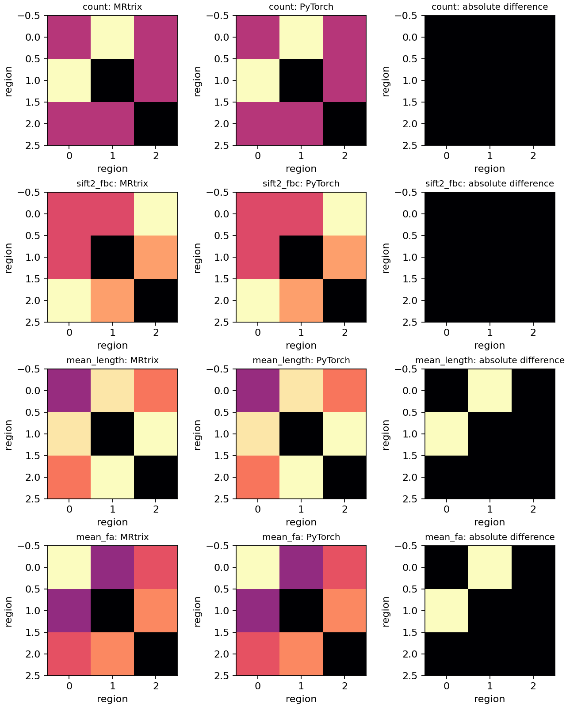

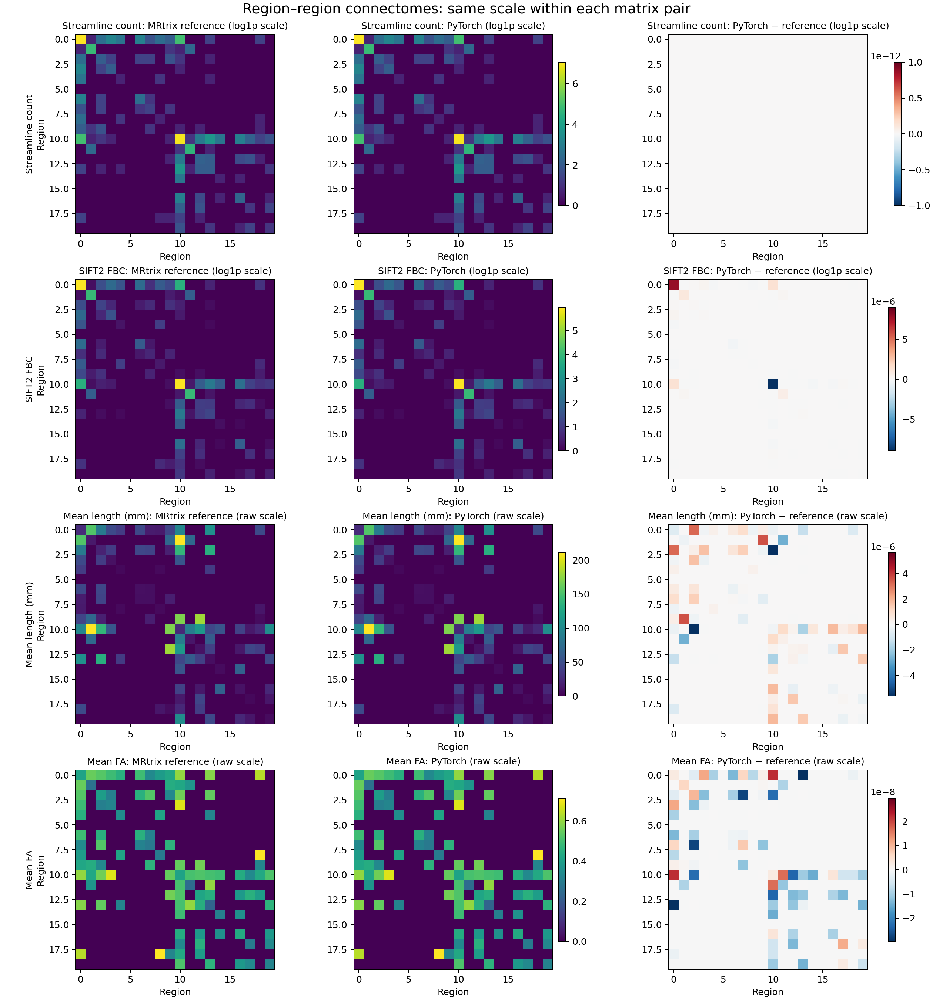

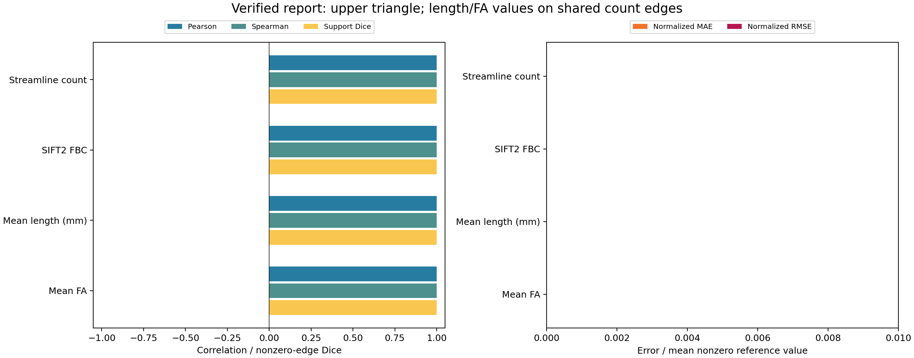

表中原始 AP-DWI 一行是先前的算法诊断：公开的处理后 DWI 未配套
eddy-rotated bvec，因而该行不能外推到已校正输入。校正 DWI 一行由
TOPUP/EDDY 生成匹配的 DWI 与旋转后梯度。MRtrix 参考臂的 FSL 5TT 暂代原脚本的 FreeSurfer+FIRST 5TT，
本包使用已有 SynthSeg 分割和单位变换；两者不是原流程严格等价复现。
原 UKB 脚本的 `10,000,000` 次种子尚未实测可行性、耗时或显存；本接口要求显式设置 `n_seeds`。不同计时边界也不允许
从这张表计算完整流程加速倍数。

校正输入的 FSL TOPUP/EDDY 使用同一份公开 AP/PA DWI；由于元数据缺少实际总读出时间，采用假定 0.05 秒，并在[校正输入记录](../../validation/connectome/ds004666/corrected_input_provenance.public.json)中保留命令、SHA-256 和 QC。MRtrix 导出与本包读取的 100 个非 b0 方向有符号点积最小 0.999999975。以下是校正输入的定量图与示例影像。

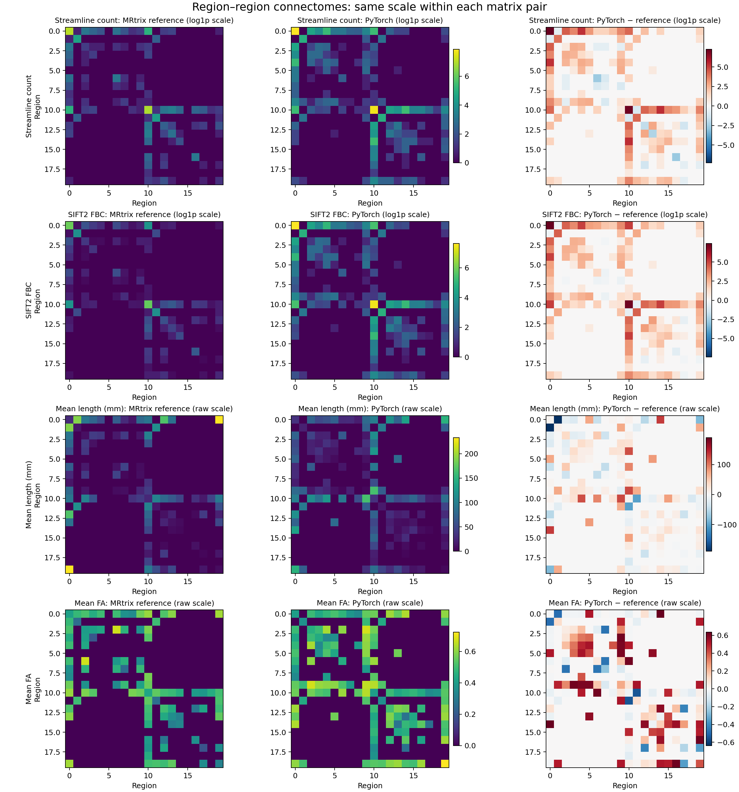

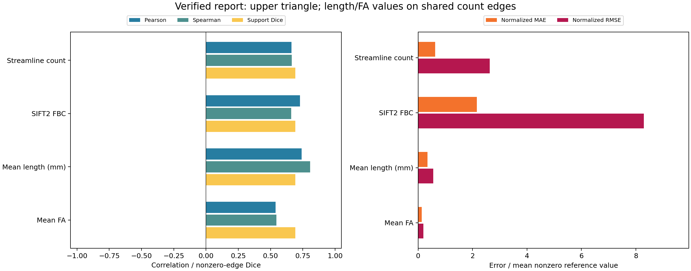

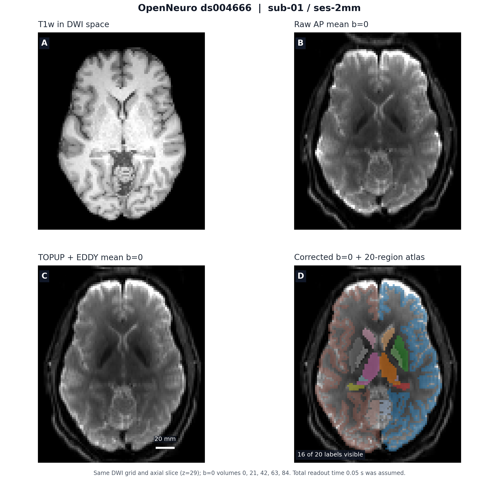

相同校正 DWI 上的 FreeSurfer 5TT 适配参考重新将 T1 对准校正 b0。安装的 MRtrix 缺少原脚本 5ttgen 的 -first 选项，故仍有方法差异；其完整数字和命令见[适配参考报告](../../validation/connectome/ds004666/fs5tt_adapted_report.public.json)。

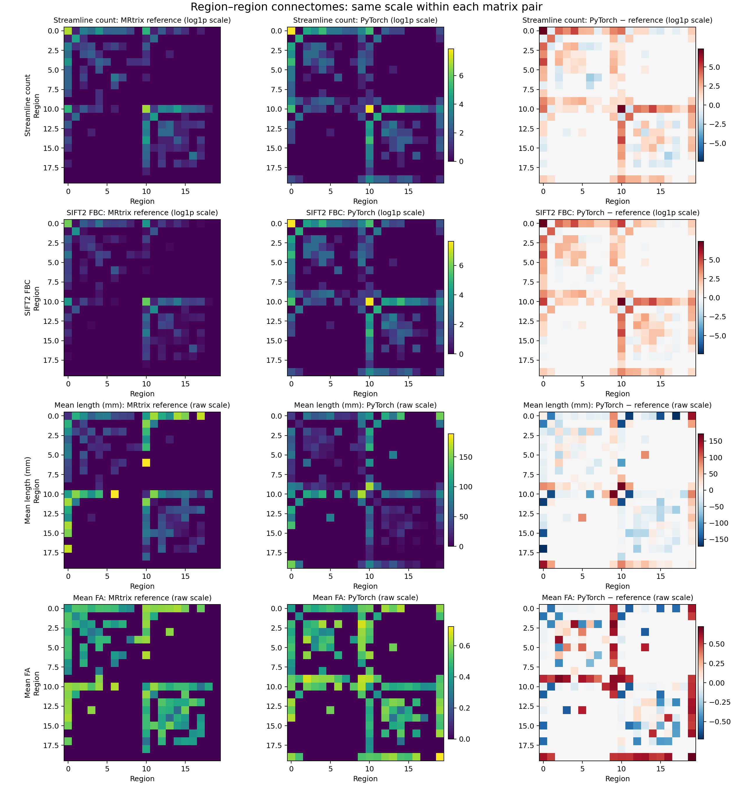

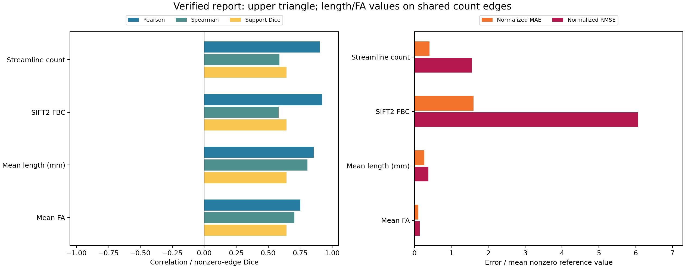

下两图保留原始 AP-DWI 算法诊断；原始数据不满足本接口的已校正 DWI 输入约定。

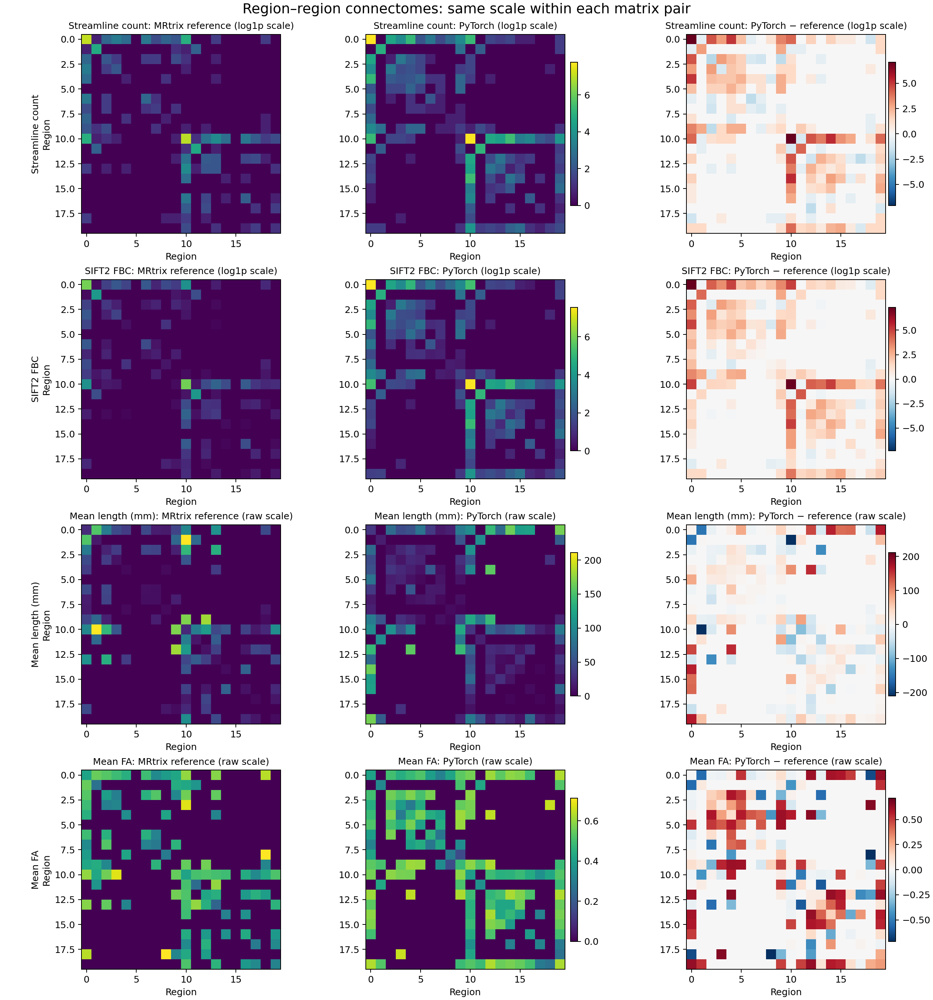

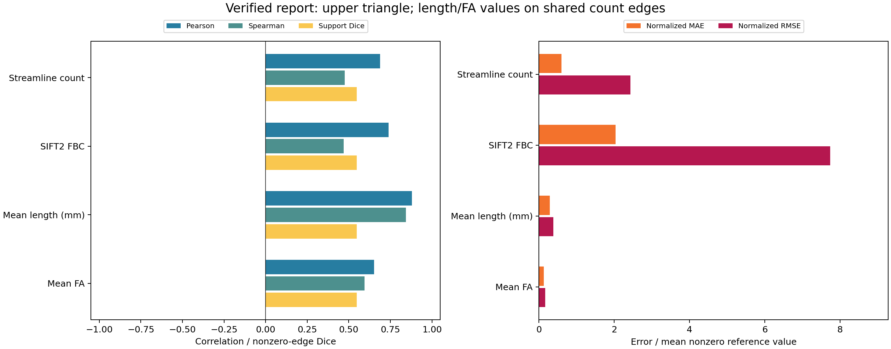

## 公开 BIDS 示例影像

[OpenNeuro ds004666](https://github.com/OpenNeuroDatasets/ds004666) 的
`sub-01/ses-2mm` 同时提供 T1w、AP/PA DWI 和公开的处理后 DWI。
下图在同一个 DWI 网格上展示 T1w、处理后 b0 均值，以及脑掩膜和本例的
20 区 SynthSeg GM atlas。这张旧图只用于检查几何与分区覆盖，源图来自公开处理后 DWI；
校正输入的示例影像和定量图见上文。图像来源文件的 SHA-256 和切面参数见
[示例图记录](../../validation/connectome/ds004666_example_image.json)。

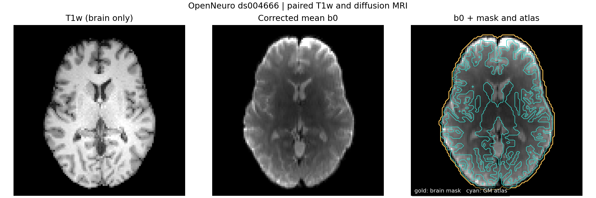

默认自动 SynthSeg+TorchFLIRT 的 100 次种子接口检查及其分割几何指标见[公开记录](../../validation/connectome/ds004666/auto_interface_smoke.public.json)。它不参与正式同 atlas 的 MRtrix 数值对照。
