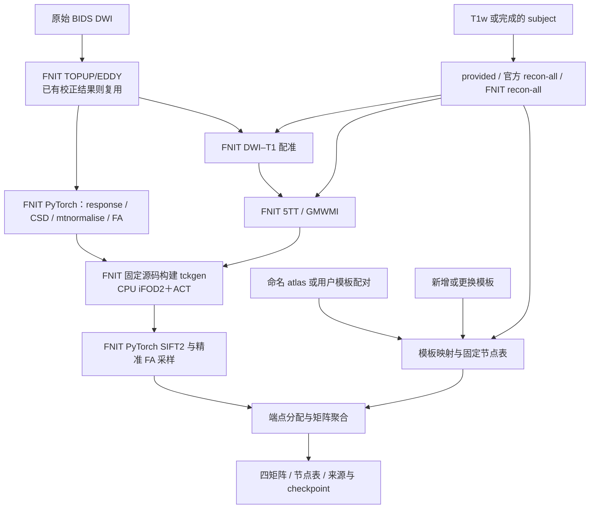

# UKBConnectome_pipeline

| 摘要 | 内容 |
|---|---|
| 输入 | 原始BIDS DWI/T1w，或已校正DWI和同源解剖；一套或两套ROI模板。 |
| 输出 | 流线、共享模型checkpoint、四类连接矩阵与节点/来源记录。 |
| 对应原软件 | UKB-connectomics流程及MRtrix3 ACT、SIFT2、connectome。 |
| Python / CLI | `fnit.UKBConnectome_pipeline` / `fnit UKBConnectome_pipeline`；CLI 兼容别名为 `fnit connectome`。 |
| CPU / GPU | iFOD2/ACT 使用 FNIT 独立构建的 CPU tckgen；其余 PyTorch 核心支持 CUDA，默认 TF32。 |

[原生追踪组件与安装](TRACKING_OPERATORS.md) · [最新版端到端实测](../../validation/connectome/native_tracking_20261009/README.md) · [模板配对](template_pairs.md) · [三种重建来源](recon_backends.md)

## 1. 功能简介

`UKBConnectome_pipeline` 从DWI及同被试T1w构建结构连接组。
它先完成或复用DWI与解剖准备，估计响应函数/FOD，进行全脑iFOD2＋ACT追踪和SIFT2加权，
再按ROI模板生成流线数、纤维权重、平均长度与平均FA四矩阵。
响应、FOD、解剖、SIFT2、精准 FA 与矩阵阶段复用 FNIT 成熟 PyTorch 实现。
iFOD2/ACT 已改为 FNIT 从固定 MRtrix 源码独立构建的 CPU `tckgen`；不需要安装 MRtrix，也不搜索 `PATH` 中的 MRtrix 命令。

可以使用命名atlas，也可以提供surface–surface、volume–volume或surface–volume模板对。
第一套模板定义行，第二套定义列；更换模板复用内容核验通过的模型与轨迹checkpoint。
重建默认auto：已有subject用provided，否则FNIT；也可显式选择官方 FreeSurfer，沿用用户授权的结构像例外。
FNIT重建的native节点和部分atlas的Workbench需求见各模块，不将此整链称为全部GPU。



DWI准备见 [dMRI](../dmri_pipeline/README.md)、[TOPUP](../topup/README.md)、[EDDY](../eddy/README.md)；
解剖见 [recon-all](../recon_all/README.md)，两模板定义见 [template_pairs](template_pairs.md)。

最新更新（2026-10-09）：移除 PyTorch iFOD2/ACT，使用固定源码、SHA 校验和配置隔离的原生追踪。
`tracking_threads=8` 控制 CPU 追踪；CUDA 参数继续控制 FNIT 的 PyTorch 阶段。
最新版真实连续链、官方对照、缓存核验与脑图以[本版报告](../../validation/connectome/native_tracking_20261009/README.md)为准；旧 SH 优化和旧十例精度报告在第 6 节保留原版本。

## 2. Python 调用

以下例子读取已有同源subject，原始DWI由入口准备：

```python
from fnit import UKBConnectome_pipeline

bids_directory = "/data/bids"                          # 配对DWI与T1w的原始BIDS
subject_directory = "/data/subjects/sub-01"           # 同源已有重建，保持只读
output_directory = "/data/connectome/sub-01"          # 准备结果及checkpoint目录
connectome_pipeline = UKBConnectome_pipeline(          # 指定 FNIT PyTorch 阶段的设备
    device="cuda:0",                                 # 原生追踪仍使用 CPU
)
connectome_result = connectome_pipeline.run_bids(      # 返回内存矩阵与轨迹结果
    bids_root=bids_directory,
    output_dir=output_directory,
    subject="01",                                    # 选择sub-01
    freesurfer_subject_dir=subject_directory,
    recon_backend="provided",                         # 读取已有subject
    n_seeds=100000,                                   # 播种尝试预算
    seed=0,                                          # 设置官方 MRTRIX_RNG_SEED
    tracking_threads=8,                               # 原生 iFOD2/ACT CPU 线程数
)
print(connectome_result.matrices["count"].shape)       # 首个命名atlas连接矩阵尺寸
```

Python `run_bids()` 保存预处理及checkpoint，返回内存中的矩阵；
最终CSV/节点表/标签图由CLI保存，不把Python调用描述成自动输出所有CLI文件。

两套用户模板示例：

```python
from fnit.connectome.template_inputs import TemplatePair, TemplateSpec

first_template = TemplateSpec(                        # 行模板：原生皮层注释
    name="cortex",                                    # 唯一名称
    kind="surface",                                  # 双半球surface模板
    space="native",                                  # 本subject原生顶点顺序
    left_path="/data/templates/lh.custom.annot",        # 左侧注释
    right_path="/data/templates/rh.custom.annot",       # 右侧注释
    nodes_tsv="/data/templates/cortex_nodes.tsv",       # 跨被试固定节点表
)
second_template = TemplateSpec(                       # 列模板：T1空间整数ROI
    name="subcortex",                                 # 模板名称
    kind="volume",                                   # 三维标签图
    space="t1",                                      # subject的T1 scanner-RAS
    volume_path="/data/templates/subcortex.nii.gz",     # 标签文件
    nodes_tsv="/data/templates/subcortex_nodes.tsv",    # 固定列节点表
)
template_pair = TemplatePair(                         # 第一模板为行、第二为列
    name="cortex_to_subcortex",
    first=first_template,
    second=second_template,
)
# 在上面的run_bids调用中添加 template_pairs=[template_pair]。
# 四矩阵位于 connectome_result.pair_results["cortex_to_subcortex"].matrices。
```

### 输入数据格式

- 原始DWI：NIfTI四维 `[X,Y,Z,N]`，原始整数或浮点强度，
  配对bval为N个数、单位s/mm²，bvec为3×N或N×3无量纲方向。
- BIDS sidecar：相位编码方向和有效总读出时间，单位秒；
  匹配反向PE时运行TOPUP。具体DWI准备输入规则见 [dMRI手册](../dmri_pipeline/README.md)。
- 已校正模式：`corrected_dwi` 四维float32影像，必须提供同次EDDY旋转bvec。
  不可用原始bvec配已经运动校正的DWI。
- T1w：同被试三维影像；provided subject提供brain、分割、ribbon及所需表面注释。
  几何与标签属于该subject，不通过文件名推测来源一致。
- 直接 `pipeline(...)`：输入已经校正的DWI；
  提供subject或完整 `t1_brain`、`t1_segmentation`、`atlas_dwi` 三项。
- affine：有效、可逆的RAS-mm世界坐标，不强制数组存储方向相同。
  DWI、T1、MNI之间由实际变换连接。
- mask：可选三维0/1图，固定参照mask须与对应DWI网格一致。
- volume模板：三维NIfTI/MGH/MGZ整数标签，明确 `dwi/t1/mni` 空间。
  label0通常是背景；两端atlas可有不同体素网格，但物理空间必须正确。
- surface模板：左右 `.annot` 或单LABEL数组的 `.label.gii`，
  原生或明确fsaverage空间，顶点顺序与相应球面/white/pial相符。
- nodes.tsv：跨被试建议固定 `index/original_label/hemisphere/name`，
  保留未出现的声明节点，不能只根据矩阵形状判断节点相同。
- transformation：`dwi_to_t1_world`为正向DWI RAS→T1 RAS毫米变换；
  MNI→T1 DenseWarp的field位于目标T1网格，记录源/目标身份，不直接传FSL矩阵。

### 输入参数

实例构造只有 `device="cuda:0"`。
`run_bids()` 的全部公开参数：

| 参数 | 必需 | 类型 | 默认值 | 含义 |
|---|---|---|---|---|
| `bids_root` | 是 | 路径 | — | 标准BIDS原始DWI/T1w根目录。 |
| `output_dir` | 是 | 路径 | — | 预处理、解剖、checkpoint输出目录。 |
| `subject` | 是 | str | — | 被试标签。 |
| `n_seeds` | 是 | int | — | 播种尝试数，不是最终接受流线数。 |
| `atlas` | 否 | str/序列 | `'fs-aparc'` | 命名atlas；可同时生成多套命名atlas。 |
| `session` | 否 | str/None | `None` | ses筛选。 |
| `run` | 否 | str/None | `None` | DWI run筛选。 |
| `acquisition` | 否 | str/None | `None` | acq筛选。 |
| `direction` | 否 | str/None | `None` | dir筛选。 |
| `t1` | 否 | 路径/None | `None` | 同被试原始T1w；provided subject时不得指定另一T1来源。 |
| `freesurfer_subject_dir` | 否 | 路径/None | `None` | 只读已有FreeSurfer格式subject，可由FNIT生成。 |
| `corrected_dwi` | 否 | 路径/None | `None` | 已校正DWI，须同时给rotated_bvecs。 |
| `rotated_bvecs` | 否 | 路径/None | `None` | 同一次校正的旋转bvec。 |
| `eddy_gp_seed` | 否 | int/None | `None` | EDDY GP体素采样种子，与追踪seed独立；None沿用时间种子。 |
| `recon_backend` | 否 | str | `'auto'` | auto有subject用provided，否则fnit；也可显式freesurfer。 |
| `recon_options` | 否 | Mapping/None | `None` | FNIT重建weights_dir/assets_dir/native程序与线程等。 |
| `checkpoint_dir` | 否 | 路径/None | `None` | run_bids默认输出下checkpoints；直接调用None关闭core缓存。 |
| `overwrite` | 否 | bool | `False` | 强制新generation重算，不用于请求模板复用。 |
| `connectome_options` | 否 | 关键字参数 | 无 | 下方__call__中的可选科学参数。 |

直接调用 `pipeline(...)` 的公开参数；这些可选项也可传入 `run_bids()`：

| 参数 | 必需 | 类型 | 默认值 | 含义 |
|---|---|---|---|---|
| `dwi` | 是 | 路径 | — | 已校正4D DWI，float32。 |
| `bvals` | 是 | 路径 | — | N个s/mm² b值。 |
| `bvecs` | 是 | 路径 | — | N×3或3×N旋转方向，无量纲。 |
| `t1_brain` | 否 | 路径/None | `None` | 直接输入时的去颅骨T1w。 |
| `t1_segmentation` | 否 | 路径/None | `None` | T1空间组织/脑区标签。 |
| `atlas_dwi` | 否 | 路径/None | `None` | DWI物理空间的三维非负整数ROI标签。 |
| `freesurfer_subject_dir` | 否 | 路径/None | `None` | 只读已有FreeSurfer格式subject，可由FNIT生成。 |
| `atlas` | 否 | str/序列 | `'fs-aparc'` | 命名atlas；可同时生成多套命名atlas。 |
| `atlas_templates_dir` | 否 | 路径/None | `None` | 用户按许可取得的标准atlas目录。 |
| `fsaverage_dir` | 否 | 路径/None | `None` | 与surface注释匹配的fsaverage几何。 |
| `mni_template` | 否 | 路径/None | `None` | MNI强度模板，用于atlas→T1配准。 |
| `synthmorph_weights` | 否 | 路径/None | `None` | SynthMorph joint权重目录。 |
| `tian_fnirt_coeff` | 否 | 路径/None | `None` | 固定参照T1→MNI FNIRT系数；由FNIT反场与采样，不执行FSL。 |
| `brain_mask` | 否 | 路径/None | `None` | 三维DWI脑mask；None由FNIT BET生成。 |
| `n_seeds` | 是 | int | — | 播种尝试数，不是最终接受流线数。 |
| `shell_bvals` | 否 | 序列/None | `None` | 固定响应函数shell标签；默认从b值聚类。 |
| `response_mask` | 否 | 路径/None | `None` | 固定响应估计mask；默认原dwi2mask legacy规则。 |
| `fod_mask` | 否 | 路径/None | `None` | 固定CSD mask；默认对脑mask两次扩张。 |
| `normalise_mask` | 否 | 路径/None | `None` | 固定mtnormalise mask；默认对脑mask两次腐蚀。 |
| `fa_map` | 否 | 路径/None | `None` | 同DWI网格预先计算的FA；None由本包拟合。 |
| `dwi_to_t1_world` | 否 | 4×4数组/None | `None` | 正向DWI RAS→T1 RAS毫米仿射；None由TorchFLIRT估计。 |
| `seed` | 否 | int | `0` | 设置固定 tckgen 的 `MRTRIX_RNG_SEED`；多线程保留官方调度随机性。 |
| `tracking_threads` | 否 | int | `8` | 原生 iFOD2/ACT CPU 线程数；正整数，逐轨迹确定性对照用1。 |
| `compile_arc` | 已弃用 | bool | `False` | 仅兼容旧默认调用；True明确报错，原 CUDA 追踪核已移除。 |
| `template_pairs` | 否 | 序列/None | `None` | 一对或多对TemplatePair；第一模板为行、第二为列。 |
| `assignment_radius` | 否 | float | `4.0` | 端点径向搜索半径mm，严格小于边界。 |
| `mni_to_t1_transform` | 否 | 变换/路径/None | `None` | 已有MNI→T1 SynthMorph变换，避免重新估计。 |
| `checkpoint_dir` | 否 | 路径/None | `None` | run_bids默认输出下checkpoints；直接调用None关闭core缓存。 |
| `overwrite` | 否 | bool | `False` | 强制新generation重算，不用于请求模板复用。 |

`recon_options` 的FNIT资源要求与完整公开选项见 [重建backend说明](recon_backends.md)。
`TemplateSpec` 包含name/kind/space、volume_path、left_path/right_path、fsaverage_dir、
nodes_tsv与background_labels；默认可选路径None，背景标签 `(0,-1)`。
`TemplatePair` 必需name/first/second；完整格式与JSON见 [模板手册](template_pairs.md)。

### 输出

下面是正常配对CLI的输出，Python模式只保存准备与checkpoint：

```text
OUTPUT_DIR/
  preproc/raw/
  preproc/topup/
  preproc/eddy/data.nii.gz
  preproc/eddy/data.eddy_rotated_bvecs
  anatomy/fnit/<subject>-<identity>/
  anatomy/state/
  checkpoints/shared/core/<key>/
  checkpoints/pairs/
  pairs/<pair-name>/
    rows.tsv
    columns.tsv
    first_atlas_dwi.nii.gz
    second_atlas_dwi.nii.gz
    connectome_count.csv
    connectome_sift2_fbc.csv
    connectome_mean_length.csv
    connectome_mean_fa.csv
    pair.json
  pairs_run_state.json
```

| 文件/返回结果 | shape、dtype、单位与含义 |
|---|---|
| `connectome_count.csv` | `[K_first,K_second]`，整数流线计数；Python为Int64。 |
| `connectome_sift2_fbc.csv` | 同shape，SIFT2权重和；Python为Float32，权重本体保留Float64。 |
| `connectome_mean_length.csv` | 同shape，SIFT2加权长度均值，mm。 |
| `connectome_mean_fa.csv` | 同shape，SIFT2加权FA均值，无量纲；合法NaN不填成0。 |
| rows.tsv / columns.tsv | 第一/第二模板完整节点定义与顺序，包含没有体素的声明节点。 |
| first/second_atlas_dwi.nii.gz | DWI-grid三维整数ROI，affine为DWI scanner-RAS；0背景，其余对应节点表。 |
| pair.json / pairs_run_state.json | 参数、来源、输出SHA、准备与缓存状态。 |
| `wm_sh` / FA / mask | FOD `[X,Y,Z,45]`；FA/mask在DWI网格，FA无量纲、mask0/1。 |
| 5TT / GMWMI | T1网格组织概率/界面；affine映至DWI RAS毫米空间。 |
| checkpoint | 完整轨迹点/offset、FOD、FA、权重、affine及来源SHA，不作为MRtrix TCK的直接替代格式。 |
| `tractogram.paths` / `endpoints` | RAS-mm float32；每条 `[Pi,3]`，端点 `[T,2,3]`，按原生 TCK 记录顺序。 |
| `tractogram.lengths_mm` / `mean_fa` | float32 `[T]`，保存折线长度与精准长度加权 FA；FA 不是粗粒度点采样。 |
| `tractogram.accepted_seeds` | `None`；TCK 不保存原播种点，不能以端点或中点伪造。 |
| `tractogram.native_provenance` | 固定源码、程序/库/部署补丁和输入 SHA、实际参数、TCK header、组件计时。 |

命名atlas的CLI输出位于 `atlases/<name>/`，旧显式单atlas为平铺输出。
未选的旧pair可能保留，本次真正输出清单以 `pairs_run_state.json.outputs` 为准。
输入subject保持只读；`run_bids`默认在输出目录建立内容验证checkpoint。
改变模板或半径复用共享核心，改变数值输入/参数/源码则重新计算相应核心。
核心与 CLI 输出身份同时绑定原生运行时，旧 PyTorch 追踪 checkpoint 不作为新后端结果复用。
Python 中的 `seeds_attempted` 保留旧字段名，值为请求播种预算；TCK `total_count` 是生成候选数，两者含义不同。完整字段与 header 见[追踪手册](TRACKING_OPERATORS.md#输出-tractogram)。

矩形连接有两个端点方向；落到同一单元只计一次，落到不同单元分别计入。
因此模板重叠时count总和可能超过流线条数；同模板复用既有square规则。
矩阵没有affine，行/列空间由各自节点表与atlas声明。
跨模板不能套用原软件单atlas对称矩阵解释。

## 3. 命令行调用

```bash
fnit UKBConnectome_pipeline --bids-root /data/bids --subject 01 \
  --freesurfer-subject-dir /data/subjects/sub-01 --recon-backend provided \
  --n-seeds 100000 --seed 0 --tracking-threads 8 \
  --output-dir /data/connectome/sub-01 --device cuda:0
```

首次可提前构建原生追踪程序，避免把编译时间混入科学 benchmark：

```bash
export FNIT_NATIVE_CACHE=/data/cache/fnit-env-01/connectome-native
python -m fnit.connectome.native_runtime --jobs 8
```

缓存目录、离线构建和每个安装参数见[追踪组件手册](TRACKING_OPERATORS.md#3-命令行调用)。
每个 Conda 环境使用独立缓存；不要跨环境 prefix 移动或共享已编译程序。

两模板模式添加 `--template-pairs /data/template_pairs.json`；
JSON和节点表实际格式见 [模板说明](template_pairs.md)。

| CLI 参数 | Python 参数 | 含义 |
|---|---|---|
| `--bids-root` | `bids_root` | 标准BIDS原始DWI/T1w根目录。 |
| `--output-dir` | `output_dir` | 预处理、解剖、checkpoint输出目录。 |
| `--subject` | `subject` | 被试标签。 |
| `--n-seeds` | `n_seeds` | 播种尝试数，不是最终接受流线数。 |
| `--atlas` | `atlas` | 命名atlas；可同时生成多套命名atlas。 |
| `--session` | `session` | ses筛选。 |
| `--run` | `run` | DWI run筛选。 |
| `--acquisition` | `acquisition` | acq筛选。 |
| `--direction` | `direction` | dir筛选。 |
| `--t1` | `t1` | 同被试原始T1w；provided subject时不得指定另一T1来源。 |
| `--freesurfer-subject-dir` | `freesurfer_subject_dir` | 只读已有FreeSurfer格式subject，可由FNIT生成。 |
| `--corrected-dwi` | `corrected_dwi` | 已校正DWI，须同时给rotated_bvecs。 |
| `--rotated-bvecs` | `rotated_bvecs` | 同一次校正的旋转bvec。 |
| `--eddy-gp-seed` | `eddy_gp_seed` | EDDY GP体素采样种子，与追踪seed独立；None沿用时间种子。 |
| `--recon-backend` | `recon_backend` | auto有subject用provided，否则fnit；也可显式freesurfer。 |
| `--recon-options` | `recon_options` | FNIT重建weights_dir/assets_dir/native程序与线程等。 |
| `--checkpoint-dir` | `checkpoint_dir` | run_bids默认输出下checkpoints；直接调用None关闭core缓存。 |
| `--overwrite` | `overwrite` | 强制新generation重算，不用于请求模板复用。 |
| `--dwi` | `dwi` | 已校正4D DWI，float32。 |
| `--bvals` | `bvals` | N个s/mm² b值。 |
| `--bvecs` | `bvecs` | N×3或3×N旋转方向，无量纲。 |
| `--t1` | `t1_brain` | 直接输入时的去颅骨T1w。 |
| `--t1-segmentation` | `t1_segmentation` | T1空间组织/脑区标签。 |
| `--atlas-dwi` | `atlas_dwi` | DWI物理空间的三维非负整数ROI标签。 |
| `--atlas-templates-dir` | `atlas_templates_dir` | 用户按许可取得的标准atlas目录。 |
| `--fsaverage-dir` | `fsaverage_dir` | 与surface注释匹配的fsaverage几何。 |
| `--mni-template` | `mni_template` | MNI强度模板，用于atlas→T1配准。 |
| `--synthmorph-weights` | `synthmorph_weights` | SynthMorph joint权重目录。 |
| `--tian-fnirt-coeff` | `tian_fnirt_coeff` | 固定参照T1→MNI FNIRT系数；由FNIT反场与采样，不执行FSL。 |
| `--brain-mask` | `brain_mask` | 三维DWI脑mask；None由FNIT BET生成。 |
| `--shell-bvals` | `shell_bvals` | 固定响应函数shell标签；默认从b值聚类。 |
| `--response-mask` | `response_mask` | 固定响应估计mask；默认原dwi2mask legacy规则。 |
| `--fod-mask` | `fod_mask` | 固定CSD mask；默认对脑mask两次扩张。 |
| `--normalise-mask` | `normalise_mask` | 固定mtnormalise mask；默认对脑mask两次腐蚀。 |
| `--fa-map` | `fa_map` | 同DWI网格预先计算的FA；None由本包拟合。 |
| `--dwi-to-t1-world` | `dwi_to_t1_world` | 正向DWI RAS→T1 RAS毫米仿射；None由TorchFLIRT估计。 |
| `--seed` | `seed` | 设置固定 tckgen 的 `MRTRIX_RNG_SEED`。 |
| `--tracking-threads` | `tracking_threads` | 原生 iFOD2/ACT 的 CPU 线程数，默认8。 |
| `--template-pairs` | `template_pairs` | 一对或多对TemplatePair；第一模板为行、第二为列。 |
| `--assignment-radius` | `assignment_radius` | 端点径向搜索半径mm，严格小于边界。 |
| `--mni-to-t1-transform` | `mni_to_t1_transform` | 已有MNI→T1 SynthMorph变换，避免重新估计。 |
| `--device` | `device` | 实例计算设备，默认cuda:0。 |

`--download-atlases`仅为CLI资源准备，不是Python `run_bids`参数。
CLI配对模式不与非默认命名 `--atlas` 混用。
CLI直接读取 `--dwi-to-t1-world` 文本矩阵，Python接收数组；
`--recon-options`可为内联JSON对象或JSON文件路径，Python为Mapping。
全部真实选项见 `fnit UKBConnectome_pipeline --help`。
`--compile-arc` 已删除；组件旧 `batch_size` / `arc_proposals` 参数同样不再使用，显式传入报错。

## 4. 原软件调用

以下在独立MRtrix环境中处理已校正DWI和同源解剖，
相应TOPUP/EDDY与原始T1重建命令见各模块参考节：

```bash
dwi2response dhollander corrected_dwi.nii.gz wm.txt gm.txt csf.txt -fslgrad rotated.bvec bvals
dwi2fod msmt_csd corrected_dwi.nii.gz wm.txt wm_fod.mif gm.txt gm.mif csf.txt csf.mif -fslgrad rotated.bvec bvals
mtnormalise wm_fod.mif wm_norm.mif gm.mif gm_norm.mif csf.mif csf_norm.mif -mask brain_mask.nii.gz
tckgen wm_norm.mif tracks.tck -algorithm iFOD2 -act 5tt.mif -seed_gmwmi gmwmi.mif -seeds 100000 -select 0 -maxlength 250 -angle 45 -cutoff 0.1 -samples 3 -power 0.5 -nthreads 8
tcksift2 tracks.tck wm_norm.mif weights.txt -act 5tt.mif
tcksample tracks.tck fa.nii.gz mean_fa.txt -precise -stat_tck mean
tck2connectome tracks.tck atlas_dwi.nii.gz connectome.csv -assignment_radial_search 4 -tck_weights_in weights.txt -symmetric
```

| FNIT 参数/阶段 | 原软件参数/阶段 |
|---|---|
| bvals/bvecs | `-fslgrad`。 |
| response/FOD/normalise masks | 对应响应/CSD/mtnormalise mask。 |
| `n_seeds` | `tckgen -seeds`尝试预算；不是 `-select`接受数。 |
| 5TT/GMWMI | `-act`、`-seed_gmwmi`。 |
| `seed` / `tracking_threads` | `MRTRIX_RNG_SEED` / `-nthreads`。 |
| assignment_radius | `-assignment_radial_search`。 |
| FBC/length/FA | SIFT2加权connectome及相应轨迹标量。 |

FNIT 生产追踪执行固定官方 iFOD2/ACT；其余上述命令用于独立参考。
原生输入几何、配置隔离和精确等价调用见[追踪手册](TRACKING_OPERATORS.md#4-原软件等价调用)。
响应、CSD、归一化、SIFT2 和矩阵仍需按各阶段的真实比较判断一致性，不能因追踪后端相同就宣布整链等价。
跨模板矩形双向计数没有等同本定义的单条 `tck2connectome` 命令，
两模板用独立逐轨迹 oracle 核对，不能改称一条 MRtrix 命令的直接等价。

## 5. 最新精度和运行时间

本版原生追踪的真实连续链、分步骤计时、固定 TCK 下游官方比较、运行时隔离与缓存核验统一记录在[2026-10-09 原生端到端报告](../../validation/connectome/native_tracking_20261009/README.md)。
最新测试从已校正 DWI 与已有 recon-all subject 开始，输出两个 atlas；TOPUP、EDDY 与重建不计入该范围。是否通过官方与缓存验收，以报告中实际完成的项目为准。
追踪的组件接口和性能解释见[追踪手册](TRACKING_OPERATORS.md)与[性能页](TRACKING_PERFORMANCE_OPTIMIZATION.md)。

公开 ds004666 真实病例，单张 A100、CPU 8 线程的本版结果如下；完整分步骤表、来源 SHA 和显存监测范围见上面的原始报告。

| 验证范围 | FNIT | 独立官方参考 |
|---|---|---|
| 同输入 10k seeds、1 线程 | 3173 条、134261 个点 | points/offsets 逐字节一致。 |
| 同输入 100k seeds、8 线程，三次中位数 | 14.35 s 追踪组件完整调用，其中 13.24 s 原生命令 | 13.60 s 原生命令；计时边界分别保留。 |
| corrected DWI＋已有 recon-all → 84/164 节点两套 SC，10k seeds | 274.17 s；追踪组件完整调用 5.32 s，内部适配器 5.10 s、命令 1.62 s | 本轮未重跑官方完整链。 |
| 选择已有 atlas、复用共享核心 | 3.05 s，轨迹/权重逐字节不变 | — |
| 固定同一 TCK，两 atlas 的 count/support | count 逐值一致，support Dice=1 | 直接官方参考。 |
| 固定同一 TCK，SIFT2 FBC | r=0.999993/0.999992，relative L1=0.2178%/0.2494% | 加权结果仍有小量数值差异。 |

mean length/mean FA 的相关性均高于 0.9999998，两 atlas 的误差和逐轨迹指标见原报告。该结果没有重测 TOPUP/EDDY、响应/CSD 或解剖的完整官方等价，也未以三次多线程样本宣告整套 SC 随机重复范围验收。allocated/reserved 峰值为 7.69/8.77 GB，完整进程 GPU 显存监测未可靠取得，不据此宣告严格小于 20 GB。


### 历史两模板十例：2026-10-03～04

以下[十例四阶段报告](../../validation/connectome/paired_pipeline_20261003/README.md)使用当时 PyTorch 追踪，不验证本版原生追踪。
GPU数值源码冻结 `8bc337c4`；整合源 `7ba73de2` 的数值等同性范围由源码SHA收据说明。
该文档轮的核对基线为 `140c3739`，原记录未重新执行原始DWI/T1整链benchmark。

| 条件 | 历史轮记录 |
|---|---|
| 数据 / n | 公开CC0 ds001226 v5.0.1十例；DWI96×96×60×102，100k seed attempts/例。 |
| 输入范围 | 已校正DWI、旋转bvec、provided官方subject；该历史轮未重新跑TOPUP/EDDY/recon。 |
| 参考 | 独立CPU逐轨迹聚合oracle、旧square builder；不是新的MRtrix raw参考。 |
| CPU / GPU / 线程 | CPU具体型号未保存；共享H100 PCIe，8线程。 |
| precision / 显存 | float32＋默认TF32；自有进程采样峰值5.2995 GB。 |
| timing | 正常CLI检查到文件输出；排除GPU队列、预检及计时后oracle/SHA。 |

#### 历史端到端 benchmark

| 指标，十例平均 | FNIT | 原软件 | 差异 |
|---|---:|---:|---|
| 首次数值核心＋三模板对CLI | 1111.52 s | 该历史轮未测 | 不计算原软件速度比。 |
| 同模板复用CLI | 18.83 s | 该历史轮未测 | FNIT缓存范围。 |
| 换模板CLI | 13.21 s | 该历史轮未测 | 复用共享核心。 |
| 改端点半径CLI | 19.28 s | 该历史轮未测 | 重算相应矩阵。 |
| 400统计数组有限值最大绝对误差 | 0 | CPU oracle为参照 | NaN位置也一致。 |

#### 历史分步骤 benchmark

| 阶段，cold host duration中位数 | FNIT | 原软件 |
|---|---:|---|
| DWI/T1配准 | 3.7574 s | 该历史轮未测。 |
| CSD | 502.0151 s | 该历史轮未测。 |
| ACT追踪 | 634.4364 s | 该历史轮未测。 |
| SIFT2 | 13.1799 s | 该历史轮未测。 |
| 模板准备 / 矩阵聚合 | 5.5499 / 0.6826 s | CPU oracle仅验值，未报告同范围计时。 |

host时钟存在异步与嵌套，不求和替代总墙钟。
30次核心恢复内容一致；该历史轮聚合验证不代替独立原软件轨迹分布与完整raw一致性。
历史原软件比较按原版本保留在 [精度记录](ACCURACY_OPTIMIZATION_20261003.md)。

历史 PyTorch SH/5TT 优化、同机官方参考及未采用候选保留在[旧版报告](../../validation/connectome/tracking_cfff_20261009/README.md)，不能当成本版耗时。


## 6. 最近版本和 benchmark

<!-- 旧文档链接兼容锚点；原始记录在本页第6节的历史链接中。 -->
<a id="2-python-调用输入与输出"></a>
<a id="7-参考文献与原实现"></a>
<a id="前轮数据流加速2026-10-02-轮实际结果"></a>

| 日期 | commit/version | 变化 | benchmark |
|---|---|---|---|
| 2026-10-09 | 原生追踪 | 固定 MRtrix 源码独立构建、配置隔离；CPU iFOD2/ACT，其余 PyTorch 阶段保留；checkpoint 绑定程序/库/补丁。 | [274.17 s 两 atlas 整链、100k 追踪、官方与缓存核验](../../validation/connectome/native_tracking_20261009/README.md)。 |
| 2026-10-09 | 历史 `6ae32945`，SH 源码 `76a6b293` | 旧 PyTorch eager 合并 SH 列；编译与梯度保留原运算。 | [原 A100 两模式 100k、119 项回归及官方参考](../../validation/connectome/tracking_cfff_20261009/README.md)。 |
| 2026-10-03～04 | `8bc337c4`冻结 / `7ba73de2`整合 | 两模板、checkpoint与输入保护。 | [10例40CLI及源码收据](../../validation/connectome/paired_pipeline_20261003/README.md)。 |
| 2026-10-03 | accuracy_20261003 | 梯度、FA与ACT方向修正。 | [历史原软件比较](ACCURACY_OPTIMIZATION_20261003.md)。 |
| 2026-10-02 | tenraw_20261002 | 数据流与矩阵构建优化。 | [历史完整矩阵判定](FINAL_RAW_MATRIX_RESULTS.md)。 |
| 2026-10-09 | 历史 `d4327049` | 旧 PyTorch 5TT 有序八角点取值与权重复用。 | [原 H100 同输入完整记录](../../validation/connectome/tracking_exact_20261009/README.md)。 |

早期版本、逐被试长表和候选profiling见 [迁移前技术记录](../../validation/connectome/readme_archive_20261005.md)。
源码入口 [pipeline.py](../../src/fnit/connectome/pipeline.py)，CLI [cli.py](../../src/fnit/cli.py)。

## 7. 参考文献、原软件和资源

- [UKB-connectomics原流程](https://github.com/sina-mansour/UKB-connectomics)。
- [MRtrix3源码](https://github.com/MRtrix3/mrtrix3)、[tckgen](https://mrtrix.readthedocs.io/en/latest/reference/commands/tckgen.html)、[tck2connectome](https://mrtrix.readthedocs.io/en/latest/reference/commands/tck2connectome.html)。
- [ACT论文](https://doi.org/10.1016/j.neuroimage.2012.06.005)、[SIFT2论文](https://doi.org/10.1016/j.neuroimage.2015.06.092)、[MRtrix3论文](https://doi.org/10.1016/j.neuroimage.2019.116137)。
- [FreeSurfer官方重建说明](https://surfer.nmr.mgh.harvard.edu/fswiki/recon-all)，用于显式选择的官方重建来源。

| 资源 | 用途 | 官方来源 | 大小 | SHA-256 | 是否允许 FNIT 再分发 |
|---|---|---|---|---|---|
| FNIT重建权重/图谱 | 自动解剖 | [FreeSurfer](https://surfer.nmr.mgh.harvard.edu/) | 模型11文件/默认核心图谱98项（全部111项） | [recon-all手册](../recon_all/README.md) | 获许可已发布项优先Release；VPNL和个人许可证例外见统一安装说明。 |
| 固定 MRtrix / Eigen / zlib 源码 | 独立原生追踪 | 官方固定源码地址见[构建器](../../src/fnit/connectome/native_runtime.py) | 逐归档固定字节数 | 构建器固定 SHA＋实际运行 manifest | 保留上游许可；官方下载到外置缓存，不在仓库发布源码或系统二进制。 |
| SynthMorph joint（可选） | MNI atlas到T1 | [官网](https://synthmorph.io/) | 依组合 | [文件清单](../RESOURCE_MANIFEST.md) | 固定Release的相应许可。 |
| 用户ROI模板 | 连接矩阵轴 | 用户提供；各atlas官方来源见[资源说明](atlas-assets.md) | 按实际文件 | 由模板checkpoint保存 | 未明确授权的不新增镜像。 |
| Tian S1/S4和Schaefer 200/500/1000标准文件 | 自动配置标准连接矩阵轴 | [Tian](https://github.com/yetianmed/subcortex)、[CBIG Schaefer](https://github.com/ThomasYeoLab/CBIG/tree/35b5664bec8822e2f77da5e090e96f91d0095be6/stable_projects/brain_parcellation/Schaefer2018_LocalGlobal) | 10文件逐项见[atlas清单](../../src/fnit/connectome/atlas_manifest.json) | [发布目录](../../src/fnit/_release_asset_catalog.json) | 按清单原许可；已发布项优先Release，保留固定来源回退。 |

准备已有subject和用户native模板不需要下载标准atlas。
外部atlas/template的版本、许可和空间必须分别核对，不由流程名称推断其再分发权。
标准atlas的安装命令、离线准备和下载例外见[统一安装说明](../ASSETS.md)。
