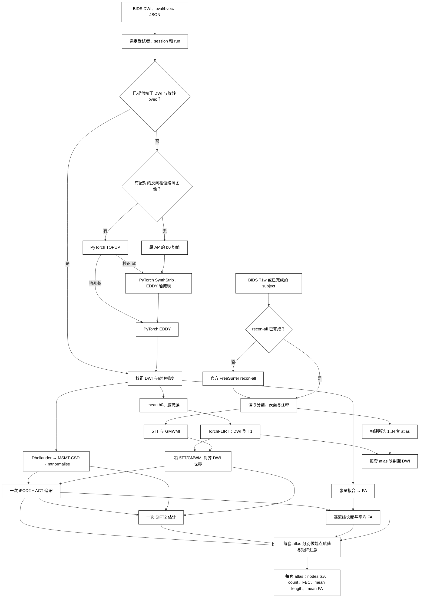
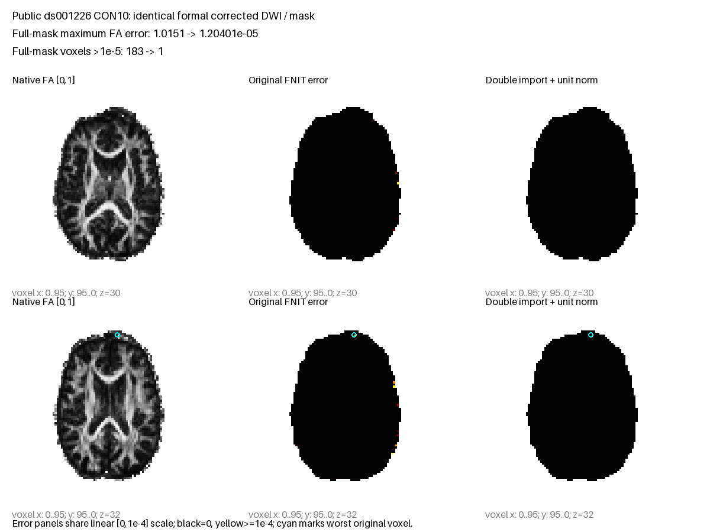
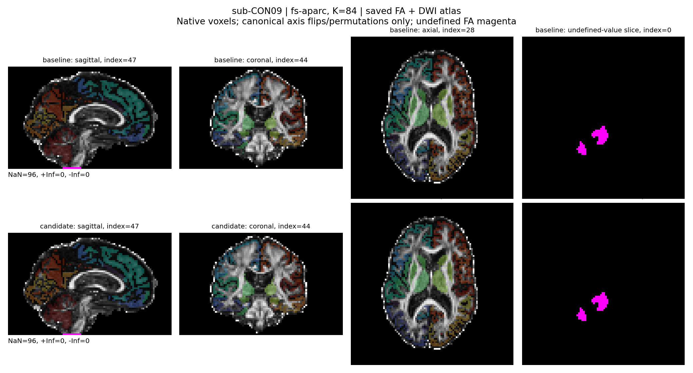

# UKBConnectome_pipeline：从 BIDS DWI/T1 到结构连接矩阵

[返回首页](../../README.md) · [源码](../../src/fnit/connectome/) · [本轮精度优化与验收状态](ACCURACY_OPTIMIZATION_20261003.md) · [既有逐阶段验证](../../validation/connectome/ds004666/README.md)

输入原始 BIDS DWI、可选反向相位编码图像和配对 T1w，流程依次运行 PyTorch TOPUP、SynthStrip 脑掩膜、PyTorch EDDY、官方 FreeSurfer `recon-all`、响应估计、MSMT-CSD、ACT/iFOD2 追踪、SIFT2 和 atlas 端点赋值。已有完整 FreeSurfer subject 或已校正 DWI 时跳过相应阶段。多个 atlas 共用一次追踪和 SIFT2，各输出 count、SIFT2 FBC、mean length、mean FA 四张矩阵。

验证记录分为前轮数据流加速和本轮精度优化。前轮十例结果已完成，raw-DWI CLI 中位数 643.623 s、官方重复范围通过率 57.96% 均对应前轮实际版本。本轮从 `7af34e6d` 开始，十二次 raw 调用与十例比较已完成：矩阵 1388/2400、轨迹分布 85/250，十例整体仍未匹配；原 CON09/10 监测缺口独立补测另列，见第 5 节及[精度总说明](ACCURACY_OPTIMIZATION_20261003.md)。

## 1. 功能和流程

以同一次扫描的 BIDS 元数据确定 DWI、梯度和可选反向相位编码图像；已提供校正 DWI 与旋转 bvec 时直接使用。T1w 的结构重建采用已完成的官方 `recon-all` subject，缺失时才运行官方命令。FNIT 从这些输入计算 DWI 模型、5TT/GMWMI、配准和追踪；先完成**一次全脑追踪与 SIFT2**，再让所选的一套或多套 atlas 分别给同一批流线端点赋值。atlas 的节点编号以各自的 `nodes.tsv` 为准。



Tian 路径还需将 MNI 模板标签映射到个体 T1：默认使用 FNIT SynthMorph，提供 `--tian-fnirt-coeff` 时使用已有变形系数；这一分支只影响相应 atlas 的构建。图中官方 `recon-all` 是用户已许可的结构像前置程序，其他计算由 FNIT 完成；Glasser 模板目前另有下文说明的 Workbench 依赖。

## 2. Python 调用、输入与输出

```python
from pathlib import Path
from fnit.connectome import UKBConnectome_pipeline

bids_root = Path("/data/study_bids")                  # 标准 BIDS DWI、梯度和 JSON
output_directory = Path("/data/derivatives/fnit_sc")  # 可恢复的预处理文件
freesurfer_subject = Path("/data/freesurfer/sub-01")  # 已完成的 recon-all subject

pipeline = UKBConnectome_pipeline(device="cuda:0")
result = pipeline.run_bids(
    bids_root=bids_root,
    output_dir=output_directory,
    subject="01",
    freesurfer_subject_dir=freesurfer_subject,
    atlas=("fs-aparc", "fs-aparc-a2009s"),            # 两套 atlas 共用一次追踪
    n_seeds=10000,                                    # 播种尝试数
    seed=0,
    eddy_gp_seed=12345,                              # 固定 EDDY GP 选点；与追踪 seed 独立
)
aparc_result = result.atlas_results["fs-aparc"]
count_matrix = aparc_result.matrices["count"]         # K×K int64
nodes = aparc_result.nodes                            # 行列与 nodes.tsv 对应
```

Python 返回内存中的 `ConnectomeResult`，`run_bids` 保存可恢复的预处理图像；CLI 另将矩阵和节点表写盘。已校正 DWI 可同时传入 `corrected_dwi` 和 `rotated_bvecs`；显式影像接口为 `pipeline(dwi=..., bvals=..., bvecs=..., freesurfer_subject_dir=..., atlas=..., n_seeds=...)`。

- **DWI**：4D NIfTI `[X,Y,Z,N]`；bval 为 N 值，bvec 为 `3×N` 或 `N×3`，校正入口须用 EDDY 旋转后的梯度。原始 BIDS 侧车需定义相位编码方向和读出时间。
- **结构输入**：配对 T1w 或完整 FreeSurfer subject。核心解剖链读取 `mri/brain.mgz`、`mri/aparc+aseg.mgz`；表面 atlas 另读取 ribbon、white/pial、sphere.reg 和相应 annot。所有输入须来自同一受试者。
- **模板**：按所选 atlas 提供 Tian/Schaefer 模板、fsaverage 与 MNI T1。逐文件许可与 SHA-256 见[资源说明](atlas-assets.md)。
- **矩阵**：每个 `atlas_results[name].matrices` 含 `count`、`sift2_fbc`、`mean_length`、`mean_fa`；后三项为 float32。矩阵对称，长度单位 mm，mean length/FA 按 SIFT2 权重求均值，零连接边为零。
- **节点**：`nodes`、`region_labels` 固定矩阵行列顺序，缺失节点保留零行列。首个 atlas 同时对应 `result.matrices`、`result.atlas`。
- **共享结果**：`wm_sh` 为 `[X,Y,Z,45]` FOD；`fa`、`brain_mask` 位于 DWI 网格；`five_tissue`、`gmwmi` 保留 T1 网格，其 affine 映射到 DWI 世界空间。`tractogram` 含路径、端点和长度；`sift2_weights` 是按流线顺序的 float64 向量。

### 输出目录

```text
OUTPUT_DIR/
  dataset_description.json       # BIDS derivative 数据集说明
  run_state.json                 # 完整运行的输入与参数记录
  preproc/raw/                  # BIDS 选片的 AP/PA 入口
  preproc/topup/                # 有反向图像时出现
  preproc/eddy/data.nii.gz      # 校正 DWI
  preproc/eddy/data.eddy_rotated_bvecs
  freesurfer/sub-01/            # 自动运行 recon-all 时出现
  five_tissue_dwi_world.nii.gz  # cGM/sGM/WM/CSF/path，T1 网格
  gmwmi_dwi_world.nii.gz
  fa_dwi.nii.gz
  brain_mask_dwi.nii.gz
  dwi_to_t1_world.csv           # 4×4 DWI RAS mm → T1 RAS mm
  atlases/fs-aparc/
    atlas_dwi.nii.gz            # 0 背景、1..K 连续节点
    nodes.tsv                   # index/original_label/hemisphere/name
    region_labels.csv
    connectome_count.csv        # K×K int64，流线条数
    connectome_sift2_fbc.csv    # K×K，SIFT2 权重和
    connectome_mean_length.csv  # K×K，SIFT2 加权平均长度，mm
    connectome_mean_fa.csv      # K×K，SIFT2 加权平均 FA
  atlases/<other-atlas>/...      # 每个 atlas 各一套
```

旧显式 `--dwi/--bvals/--bvecs` 单 atlas 入口保留平铺输出；BIDS 或多 atlas 入口按 `atlases/<name>/` 分开。矩阵行列以同目录的 `nodes.tsv` 为准。零连接边的均值为零。

BIDS 的完成记录同时绑定连接组数值实现修订号。更换已采用的梯度解释或追踪实现时，旧矩阵需重新计算；使用新的输出目录，或显式 `--overwrite` 重算。`--overwrite` 沿用原有强制重算规则，原始 MRI 不改写。

### 参数

| 参数 | 输入和默认值 |
|---|---|
| `--bids-root`、`--subject` | 原始 BIDS 根目录与受试者编号；BIDS 入口必选，不能与显式 DWI 三件套混用。 |
| `--session`、`--run`、`--acquisition`、`--direction` | 可选 BIDS 实体，候选不唯一时用于精确选片。 |
| `--t1`、`--freesurfer-subject-dir` | 可选 T1w 路径和已完成 recon-all subject；无 subject 时使用 BIDS T1w 启动官方重建。 |
| `--corrected-dwi`、`--rotated-bvecs` | BIDS 模式下已有校正 4D 图像及逐卷旋转梯度，必须成对给出。 |
| `--dwi`、`--bvals`、`--bvecs` | 旧显式入口：已校正 4D NIfTI、每卷 b 值、eddy 旋转后的 3×N/N×3 FSL 梯度，须同时提供。 |
| `--atlas` | 一个或多个上述名称；默认 `fs-aparc`，顺序决定 Python 返回结果的主 atlas。 |
| `--atlas-templates-dir`、`--fsaverage-dir` | Tian/Schaefer/Glasser 模板目录；Schaefer、Glasser 另需 fsaverage subject。 |
| `--download-atlases` | 可选；只下载所选 Tian/Schaefer 文件，按固定清单校验大小和 SHA-256；Glasser 暂不支持镜像下载。 |
| `--mni-template`、`--synthmorph-weights`、`--tian-fnirt-coeff` | Tian 同网格 MNI T1；可选 SynthMorph 权重目录；已有 FNIRT 前向 coefficient 可替代 SynthMorph。 |
| `--brain-mask`、`--response-mask`、`--fod-mask`、`--normalise-mask`、`--fa-map` | 可选同 DWI 网格掩膜/FA；省略时 FNIT 计算。BET 内部临时转 LAS 后将掩膜映回原网格。 |
| `--shell-bvals`、`--dwi-to-t1-world` | 可选 shell 中心序列和 4×4 DWI→T1 RAS-mm 矩阵；省略则估计 shell 并运行 TorchFLIRT。 |
| `--n-seeds`、`--seed` | 播种尝试数必选；随机种子默认 0。PyTorch 与 MRtrix 相同数值 seed 不生成同一流线。 |
| `--eddy-gp-seed` | 可选整数 1..2³²−1；固定 EDDY GP 体素选点，与追踪 `--seed` 独立。默认省略，沿用 EDDY 原有的时间种子。改变此参数会重新计算自动管理的 EDDY 输出。 |
| `--device`、`--compile-arc` | 设备默认 `cuda:0`；CUDA 默认 TF32，不自动用半精度。编译圆弧核为可选项；前轮同输入比较发现编译输出存在逐值差异，本轮精度验收继续关闭该选项。 |
| `--output-dir`、`--overwrite` | 结果目录必选；后者强制重算和覆盖。 |

## 3. 命令行调用

```bash
conda env create -f environment.yml
conda activate fnit

# 前轮十例评测和本轮精度验收均使用此 allocator 配置。
# 在启动 Python 进程前设置；两个比较版本使用相同配置。
export PYTORCH_CUDA_ALLOC_CONF=expandable_segments:True

BIDS_ROOT=/data/study_bids                   # 原始 BIDS 根目录，含 dataset_description.json
OUTPUT_DIR=/data/derivatives/fnit_connectome # 本次结果与可恢复的预处理目录
FREESURFER_SUBJECT=/data/freesurfer/sub-01   # 已完成的官方 recon-all subject；可省略

fnit UKBConnectome_pipeline \
  --bids-root "$BIDS_ROOT" --subject 01 \
  --freesurfer-subject-dir "$FREESURFER_SUBJECT" \
  --atlas fs-aparc --n-seeds 10000 --seed 0 \
  --eddy-gp-seed 12345 \
  --device cuda:0 --output-dir "$OUTPUT_DIR"
```

省略 `--freesurfer-subject-dir` 时，命令读取 BIDS `anat/*_T1w.nii[.gz]` 并调用用户安装的官方 `recon-all -sd OUTPUT_DIR/freesurfer -s sub-01 -i T1w -all`。自动管理的 subject 记录原始 T1 SHA-256；仅同输入的部分失败可用不带 `-i` 的 `-all` 续跑。输入改变或既有 subject 没有对应记录时，使用新输出目录，或显式提供已完成的 `freesurfer_subject_dir`。用户需自行安装并许可 FreeSurfer。FNIT 后续计算仅读取其图像和表面。

对照评测同时固定 `seed` 和 `eddy_gp_seed`。若只固定追踪种子，EDDY 选点仍可能改变校正 DWI，后续模型和流线也会随之改变。

显存记录区分 PyTorch 已分配、预留与整个 GPU 父子进程占用，采用十进制 20 GB 门槛。采样完整且三个峰值都低于门槛的运行才纳入合格汇总。前轮参数见[十例评测协议](raw_cohort_benchmark.md)，本轮验收见[精度总说明](ACCURACY_OPTIMIZATION_20261003.md)；追踪组件和完整原始 DWI 流程的峰值分别报告。

多个 DWI run/session 时用 `--session`、`--run`、`--acquisition`、`--direction` 明确选片。DWI 需要 `.bval`、`.bvec`、JSON 中的 `PhaseEncodingDirection` 以及 `TotalReadoutTime` 或 `EffectiveEchoSpacing`。有反向相位编码 EPI/DWI 时通过 `B0FieldSource`/`B0FieldIdentifier` 或 `IntendedFor` 配对；没有反向图像时跳过 TOPUP，EDDY 无场图运行。侧车支持 BIDS 继承规则，约定依据 [BIDS MRI 规范](https://bids-specification.readthedocs.io/en/stable/modality-specific-files/magnetic-resonance-imaging-data.html)。

### 多 atlas 示例

只用已完成的 FreeSurfer subject 时，可直接选择两套原生全脑 atlas；`fs-aparc-a2009s` 另外读取 `mri/aparc.a2009s+aseg.mgz` 与双半球 `label/*.aparc.a2009s.annot`，不需要 MNI 模板或配准权重：

```bash
BIDS_ROOT=/data/study_bids                         # 原始 BIDS 根目录
OUTPUT_DIR=/data/derivatives/fnit_connectome       # 输出和续跑目录
FREESURFER_SUBJECT=/data/freesurfer/sub-01          # 含两个 aparc 分割的 recon-all subject
fnit UKBConnectome_pipeline \
  --bids-root "$BIDS_ROOT" --subject 01 \
  --freesurfer-subject-dir "$FREESURFER_SUBJECT" \
  --atlas fs-aparc fs-aparc-a2009s \
  --n-seeds 10000 --device cuda:0 --output-dir "$OUTPUT_DIR"
```

该体积由官方 [`mri_aparc2aseg --s SUBJECT --annot aparc.a2009s --o aparc.a2009s+aseg.mgz`](https://surfer.nmr.mgh.harvard.edu/fswiki/mri_aparc2aseg) 产生；FNIT 根据受试者注释名称和 [FreeSurferColorLUT 的 11100/12100 系列原始编号](https://github.com/freesurfer/freesurfer/blob/dev/distribution/FreeSurferColorLUT.txt)转成 `1..K`，再使用与 `fs-aparc` 相同的 16 个皮层下/小脑节点。参考文献：[Destrieux 等，*NeuroImage* 2010](https://doi.org/10.1016/j.neuroimage.2010.06.010)。

使用 Tian/Schaefer 模板的多 atlas 示例：

```bash
BIDS_ROOT=/data/study_bids                         # 同一组 DWI 与 T1w
OUTPUT_DIR=/data/derivatives/fnit_connectome       # 结果目录
FREESURFER_SUBJECT=/data/freesurfer/sub-01          # 官方 recon-all 结果
ATLAS_TEMPLATES=/data/atlas/ukb                     # Tian S1/S4 和 Schaefer 注释
FSAVERAGE_SUBJECT=/opt/freesurfer/subjects/fsaverage # fsaverage sphere.reg
MNI_TEMPLATE=/data/templates/MNI152_T1_2mm_brain.nii.gz # Tian 同网格 MNI T1

fnit UKBConnectome_pipeline \
  --bids-root "$BIDS_ROOT" --subject 01 \
  --freesurfer-subject-dir "$FREESURFER_SUBJECT" \
  --atlas fs-aparc schaefer200+tian-s1 schaefer500+tian-s4 \
  --atlas-templates-dir "$ATLAS_TEMPLATES" \
  --fsaverage-dir "$FSAVERAGE_SUBJECT" --mni-template "$MNI_TEMPLATE" \
  --n-seeds 10000 --seed 0 --device cuda:0 \
  --output-dir "$OUTPUT_DIR"
```

可选名称：`fs-aparc`、`fs-aparc-a2009s`、`aparc+tian-s1`、`aparc.a2009s+tian-s1`、`glasser+tian-s1`、`glasser+tian-s4`、`schaefer200+tian-s1`、`schaefer500+tian-s4`、`schaefer1000+tian-s4`。前两套从个体 FreeSurfer 分割直接生成；`fs-aparc-a2009s` 由本人的 `.annot` 定义名称，按左皮层、右皮层、16 个皮层下与小脑节点连续编号，行列以 `nodes.tsv` 为准。Tian 默认用 FNIT PyTorch SynthMorph；已有原 UKB 的 T1→MNI FNIRT coefficient 时可以 `--tian-fnirt-coeff` 替换。Glasser 的 32k→164k 标签重采样目前仍依赖 Connectome Workbench `wb_command`，故该 atlas 还不满足仅官方 recon-all 为外部运行时程序的约束。

资源许可、模板结构与按需下载见[atlas 资源说明](atlas-assets.md)。固定 FNIT Release `assets-v1` 暂无这组 atlas；有明确许可的 Tian/Schaefer 文件已镜像于仓库，命令可加 `--download-atlases` 自动获取并校验。fsaverage 和 MNI T1 仍由用户提供。

### 跳过与续跑

| 阶段 | 判定 | 主要输出 |
|---|---|---|
| BIDS 选片 | 输入路径、大小、修改时间和元数据与记录相同 | `preproc/raw/AP.*`、可选 `PA.*`、`bids_selection.json` |
| TOPUP | 状态记录匹配且场系数、校正 b0、采集参数完整；无反向图像时不运行 | `preproc/topup/fieldmap_out_*` |
| EDDY | 状态记录匹配且校正 DWI、旋转 bvec 完整 | `preproc/eddy/data.nii.gz`、`data.eddy_rotated_bvecs` |
| recon-all | 显式提供完整 subject，或 `recon-all.done`、脑图、分割及双半球表面存在 | `freesurfer/sub-01/` |
| connectome | BIDS 模式下运行记录匹配且所有矩阵完整 | `atlases/<name>/` 和共用图像 |

状态记录用文件大小、mtime 和参数核对 FNIT 自己产生的中间结果，不是内容哈希。外部替换了文件但保留原大小/mtime 时加 `--overwrite`。在其他软件中已完成 TOPUP/EDDY 时，同时给 `--corrected-dwi` 和 `--rotated-bvecs`；原始 BIDS bval 仍定义每卷 b 值。`--overwrite` 强制重算并覆盖同名结果。

connectome 完成记录还包含数值实现版本。本轮梯度及 ACT 精度修正使用 `accuracy-20261003-v1`，因此旧版矩阵不再判定完成；当前版本同输入、同参数且产物完整时继续跳过。重算请使用新输出目录，或在原目录显式 `--overwrite`；后者也重算 TOPUP/EDDY。只重算连接组时，可通过 `--corrected-dwi`、`--rotated-bvecs` 将已有校正输入提供给新输出目录。普通同版本调用的 TOPUP/EDDY 仍依据各自阶段记录复用。

## 4. 原软件调用

### FNIT 步骤与官方步骤

| 阶段 | FNIT 实际调用 | 官方对应与输入/输出 |
|---|---|---|
| AP/PA 组织与选 b0 | BIDS 配对、选片、`prepare_ukb_topup_pair` | `fslroi`/`fslmerge -t`；保留第一幅 AP 网格与两幅选定 b0，生成 `acqparams.txt` |
| 畸变校正 | `TorchTOPUP` | `topup --imain --datain`；场系数、运动参数、校正 b0 |
| EDDY 脑掩膜 | b0 均值与 PyTorch `SynthStrip`，保留 AP 网格 | `mri_synthstrip -i b0_mean.nii.gz -m nodif_brain_mask.nii.gz`；原网格二值掩膜 |
| 涡流/运动校正 | `TorchEDDY`，固定评测的 `eddy_gp_seed` | `eddy`/`eddy_cuda`；校正完整 DWI、旋转 bvec、运动与异常切片记录 |
| T1 重建 | 官方 `recon-all`；已有完整 subject 则读取 | `recon-all -i T1w -all`；分割、脑图、双半球表面和注释 |
| b0、掩膜、FA | `mean_bzero`、BET、`dwi2mask_legacy`、张量 IWLS | `dwiextract -bzero`/`mrmath mean`、`bet`、`dwi2mask`、`dwi2tensor`/`tensor2metric -fa` |
| 5TT/GMWMI | `freesurfer_five_tissue`、`gmwmi_from_five_tissue` | `5ttgen freesurfer`/`5tt2gmwmi`；五组织通道和灰白质界面 |
| DWI→T1 | `TorchFLIRT(dof=6, cost="normmi")` | `flirt -dof 6 -cost normmi`；DWI→T1 RAS-mm 矩阵 |
| 响应、FOD、归一化 | Dhollander、MSMT-CSD、mtnormalise | `dwi2response dhollander`、`dwi2fod msmt_csd`、`mtnormalise`；三组织响应及归一化 WM FOD |
| 追踪 | `probabilistic_tractography`，iFOD2 + ACT + GMWMI | `tckgen -algorithm iFOD2 -act -seed_gmwmi`；按尝试数播种、接受数量由数据决定 |
| 权重、长度、FA | `estimate_sift2_weights`、精确分段积分 | `tcksift2`、`tckstats -dump`、`tcksample -precise -stat_tck mean` |
| 原生/表面 atlas | 连续节点 LUT、球面注释映射、ribbon 体积化 | `labelconvert`、`mri_surf2surf`/原 UKB 表面到体积脚本；每套 `nodes.tsv` 和标签体积 |
| Tian→T1 | SynthMorph joint + `apply_transform` 最近邻；可读既有 FNIRT coefficient | 默认对应 SynthMorph；兼容分支对应 `invwarp`/`applywarp --interp=nn` |
| atlas→DWI | `resample_labels_nearest`，保留整数标签 | `mrtransform -linear ... -template ... -interp nearest` |
| 矩阵 | `build_connectomes`，严格 4 mm 径向赋值 | `tck2connectome -symmetric -assignment_radial_search 4`；count、Σw、加权长度与 FA |

默认解剖由 FreeSurfer 单独构建 5TT，Tian 默认采用 SynthMorph；原 UKB 脚本另外使用 FIRST 与 FNIRT。两条解剖路径不同，固定输入组件 oracle 复用同一实际 5TT/变换/atlas；前轮独立 raw 官方链自行生成这些产物，本轮复用已核验的完成结果。两类验证分开报告，默认路径不能称为原 UKB 全链逐值复现。Glasser 的 Workbench 依赖见上文；官方 FSL/MRtrix 命令仅在独立 benchmark 中执行。

以下命令用于独立 MRtrix 对照，输入须与 FNIT 使用同一 FOD、5TT、GMWMI、FA 与 atlas；完整前处理和七模板命令在[逐阶段验证](../../validation/connectome/ds004666/README.md)中。

```bash
MRTRIX_RNG_SEED=0 tckgen wm_fod_norm.mif tracks.tck \
  -algorithm iFOD2 -act five_tissue.mif -seed_gmwmi gmwmi.mif \
  -seeds 100000 -select 0 -maxlength 250 -cutoff 0.1 -samples 3 -power 0.5
tcksift2 tracks.tck wm_fod_norm.mif weights.txt -act five_tissue.mif
tcksample tracks.tck fa.mif mean_fa.txt -precise -stat_tck mean
tck2connectome tracks.tck atlas.mif count.csv -symmetric -assignment_radial_search 4
tck2connectome tracks.tck atlas.mif fbc.csv -symmetric -assignment_radial_search 4 \
  -tck_weights_in weights.txt
```

`mean_length` 和 `mean_fa` 的完整官方命令及固定 TCK 数值比较见[SIFT2/FA/矩阵验证](../../validation/connectome/ds004666/README.md#与官方流程逐项对照)。

## 5. 精度、运行时间与脑图

### 本轮精度优化：2026-10-03，完整 raw 比较已完成

本轮从已发布基线 `7af34e6d` 开始，复用前轮 ds001226 十例原始 BIDS 及已完成的官方 FreeSurfer subject。正式科学候选为 `1fe86ab8` 的代码内容，保留梯度/张量解释、四分位索引及 ACT 的 SGM 弦方向修正；其余未取得联合收益的候选撤回。每例仍为 100,000 次尝试播种、八套 atlas、四类矩阵，默认 TF32、`compile_arc=False`，原始 MRI 与旧结果保持原样。

完整 raw 共 12 次 CLI：十例正式候选，加 CON01/03 的两次基线配对；实际运行与 CPU 比较均已完成。**矩阵 1388/2400、轨迹分布 85/250 项通过，十例整体均 failed；前轮同十例矩阵为 1391/2400，本轮未显示总体 SC 改善。**相同阶段两组配对合计耗时 −2.80%（CON03 单例 +0.50%），属于共享负载观察。原 CON09/10 显存监测缺口与独立补测另列；完整原值、门槛和失败明细见[最终证据](../../validation/connectome/accuracy_20261003/final_cohort_summary_v1/README.md)。分项组件结果如下；汇总由[精度总说明](ACCURACY_OPTIMIZATION_20261003.md)维护。

| 子任务 | 本轮组件核对与处理 | 输入、参数、官方对照、耗时和脑图 |
|---|---|---|
| 1 TOPUP / EDDY | 固定参数渲染改善，完整 CON03 EDDY 图像却退化；两种候选均拒绝，保持原生产实现 | [task 1 验证](../../validation/connectome/accuracy_20261003/task_01/README.md) |
| 2 梯度 / DTI / CSD / 归一化 | 同正式 FNIT 校正 DWI 的 FA 差异减少；Double 梯度解释、affine 极分解及四分位索引修正进入正式候选 | [task 2 验证](../../validation/connectome/accuracy_20261003/task_02/README.md) |
| 3 iFOD2 / ACT | 真实 CON03 解剖位置的 SGM 局部弧诊断：最小点选择差异 20/324→0/324；保留弦方向修正，撤回无速度收益的 active-only 校准 | [task 3 验证](../../validation/connectome/accuracy_20261003/task_03/README.md) |
| 4 5TT / GMWMI / atlas | 两例真实完整组织图和自然刚体标签重采样已逐值一致，保持成熟实现 | [task 4 验证](../../validation/connectome/accuracy_20261003/task_04/README.md) |
| 5 SIFT2 / FA 采样 / 矩阵 | 同官方 TCK 的八套 atlas count 一致，Double 权重候选使多数浮点矩阵误差增加，保持成熟实现 | [task 5 验证](../../validation/connectome/accuracy_20261003/task_05/README.md) |



该图及其完整体素指标属于同输入张量组件，来源和色标见 task 2。前轮的 643.623 s 与 57.96% 保留在下节对应版本的实际记录中。

### 前轮数据流加速：2026-10-02 轮实际结果

前轮重新下载 ds001226 的十例原始配对数据：CON01、CON03、CON04–CON11，快照 `fb4d0fda44f2ab7a732fb4ab6cd62add09dc1cd7`，许可 CC0。逐文件来源、大小和 SHA 见[原始数据来源与预处理](../../validation/connectome/tenraw_20261002/task_01/README.md)。解剖从这些新下载 T1 独立执行官方 `recon-all`；DWI 从原始 AP/PA 开始校正。正式十例使用每例 100,000 次尝试播种、八套 atlas、32 张矩阵。原始 DWI 运行、官方重建、分步骤诊断和 GPU 排队时间分别记录，协议见[十例正式评测](raw_cohort_benchmark.md)。

十例两版本完整运行与比较已完成：320 张矩阵逐值及解析后标量 bits 一致，130 项独立官方解剖数据一致；所有合格运行的三类实测显存峰值均低于 20 GB。组件配对实验与十例共享 GPU 整链观测分列如下。

| 前轮真实输入 | 已完成的比较 | 证据 |
|---|---|---|
| CON01/CON03，同输入 CSD | 12 组实际中间张量、30 项数组比较逐位一致；观测耗时分别下降约 6.92%/3.45%，CON03 第二轮负载不稳定 | [建模优化与时间边界](../../validation/connectome/tenraw_20261002/task_02/README.md) |
| CON03，同输入的官方建模组件 | WM response 最大差 1.29734e-7；处理 mask 内 WM CSD/归一化 WM 最大差 3.89723e-8/5.96046e-8，偏置场全网格最大差 2.44141e-4。另一次 CPU DTI 诊断的 FA 最大差 0.0462486，196 体素误差超过 1e-5；该诊断不作为十例 GPU 整链指标 | [同输入精度、原命令和脑图](../../validation/connectome/tenraw_20261002/task_02/README.md#5-本轮精度耗时与脑图) |
| CON01/CON03，同输入 100k tracking | 全部轨迹点、offsets、端点、长度和接受种子逐位一致；CON03 ABBA 197.785→160.700 s，观测下降 18.75%。CON01 最后一轮基线受到共享负载影响，不能用其均值差宣称稳定提速 | [追踪调用、完整参数与脑图](TRACKING_OPERATORS.md) |
| CON03，双方各五种子，固定相同 FOD/5TT/atlas | 25 个跨软件组合中，矩阵 1091/1200 项、轨迹群体 72/125 项通过；FNIT 自身重复分别为 412/480、47/50。整体未匹配官方重复范围 | [完整五种子结果、失败项与真实脑图](../../validation/connectome/tenraw_20261002/task_04_repeat_fivefnit_reference/README.md) |
| 十例，原始 AP/PA 整例两版本 | 完整校正 DWI、梯度、变换、标签和 320 矩阵严格一致；raw-DWI CLI 中位数 761.722→643.623 s。共享 GPU 的执行顺序和负载不平衡，此描述性差异不作为稳定加速倍数。20 次合格运行的峰值 allocated/reserved/process-tree 分别为 14.6821/17.6287/19.8160 GB | [真实输出比较与时间范围](actual_cohort_comparison.md) |
| 十例，独立官方 raw 预处理与建模 | 自产 TOPUP→SynthStrip→CPU8 EDDY、响应、CSD、归一化及 FA 全部完成。CON11 fresh CPU EDDY 3498.833 s；前九例的恢复和原阶段计时分列。独立链已有图像/梯度差异，同输入 DTI 诊断仍存在离群值，尚未判等价 | [完整原始链输入、参数、脑图和时间](../../validation/connectome/tenraw_20261002/task_01/official_rawprep_v1/README.md) |
| CON01/CON03，固定 TCK 的 SIFT2 候选 | 两例严格逐值门槛均未通过，未采用优化器缓存。保留全部配对、原软件耗时及逐值误差 | [SIFT2/精确 FA 组件说明](SIFT2_SAMEINPUT_OPTIMIZATION.md) |
| CON01/CON03，同输入 100 万播种的追踪组件 | 分别接受 144,343/116,285 条流线，五类数组 SHA 全相同；耗时 CON01 2073.123→1901.716 s、CON03 2250.341→5220.029 s，未宣称稳定提速。三种观测显存峰值均低于 5.027 GB；CON03 候选最大采样间隔 8.709 s，组件观测不替代正式整链显存验收 | [完整参数、耗时及容量记录](TRACKING_OPERATORS.md) |
| 十例，独立官方解剖与 connectome | 官方 SynthMorph、FreeSurfer/MRtrix 与原 UKB atlas 脚本完成结构准备、DWI 配准、五种子追踪及八 atlas 矩阵；各例实际 producer 与恢复来源分别核验。独立 raw 链的矩阵验收另列，完成不等于科学匹配 | [结构像实际报告与脑图](raw_official_anatomy_reference.md) |
| 十例，两版各一个 FNIT seed 对官方五种子 raw 链 | 20 组 × 240 = 4800 项判定，通过 2782（57.96%）；两版各 1391/2400，20 组整体均未进入官方重复范围。前轮 FNIT 自身重复与群体分布未评估 | [最终结果与 2018 项失败明细](FINAL_RAW_MATRIX_RESULTS.md) |

前轮报告记录的验证缺口：正式十例 CLI 未保存响应、FOD 和归一化中间产物，当时没有这些阶段的十例同输入官方比较；已保存的 CON03 组件结果不能替代它们。同输入 CPU DTI 诊断还保留 CON07 方向最大差 41.632306°、CON10 FA 最大差 0.245623，当时原因尚未完全定位，见[十例建模诊断](../../validation/connectome/tenraw_20261002/task_02/README_official_chain.md#5-实际精度耗时与脑图)。本轮对应组件更新见上表；完整 raw 链精度与配对时间随新运行继续核对。

下表是既有 ds004666/UKB 结果，保留对应版本与输入范围。

| 真实输入对照 | 已观察结果 | 证据 |
|---|---|---|
| 既有无损组件优化，真实 ds004666 | 2,000 次播种两版路径及相关量逐值相同；轨迹整理 313.93→4.69 ms。三 atlas 构建/矩阵阶段 10.07→5.63 s；固定真实 TCK 七套四矩阵全部逐值相同 | [范围、profile、时间和显存](../../validation/connectome/ds004666/lossless_20261002/README.md) |
| 原始 UKB AP/PA BIDS 全链 | 100 次播种的流程检查成功；84 节点四矩阵完整，3,570 s、PyTorch 峰值 4.542 GiB；同输入重跑 4.06 s 且矩阵哈希不变 | [私有输入的公开汇总](../../validation/connectome/ukb_bids_e2e_20260930.md) |
| 校正 UKB DWI + 两套原生 FreeSurfer atlas | 一次运行得到 84/164 节点各四矩阵，6,159 s、PyTorch 峰值 2.687 GiB；续跑 3 s 且八矩阵哈希不变。独立重算的配准变换和首次运行不同，矩阵未逐值一致 | [同一受试者的公开汇总](../../validation/connectome/ukb_bids_e2e_20260930.md) |
| AP/PA TOPUP | UKB 一例校正 4D r=0.9944；未逐体素等价 | [TOPUP 报告](../../validation/topup/report.public.json) |
| EDDY | UKB 一例对 FSL GPU 的脑内 4D r=0.999738，FNIT 10:38.75、参考 10:21.19；计时边界不同 | [EDDY 报告](../../validation/eddy/README.md) |
| 固定同一 100k TCK/权重/atlas | 七套 count 逐元素相同；FBC 最大绝对误差 ≤5.07e-5 | [七 atlas 矩阵和脑图](../../validation/connectome/ds004666/seven_atlas_100k_20260929.md) |
| 独立 100k 追踪 | 部分 count/support 落入 MRtrix 自身三次重复范围；长度、8 mm 端点和 TDI 未全面进入 | [三次对照和脑图](../../validation/connectome/ds004666/tracking_100k_three_seed_20260929.md) |

最终随机追踪验收采用**MRtrix 自身重复范围**：双方固定同一输入，各运行多个种子，比较接受率、长度分布、端点、TDI 及每套 atlas 的四张矩阵；误差不高于官方重复最大值、相似度不低于官方重复最小值即通过，优于该范围也通过。未定义的相关性保留为空值。固定轨迹矩阵精度已高，独立追踪仍有指标未达成；BIDS 编排的加入不等于原 UKB 全链数值一致。现有五种子结论与实际失败项见[重复性结论](REPEATABILITY_CONCLUSIONS.md)。两例 100 万播种 A/B 已完成逐位核对；前轮正式十例的数据流加速比较已全部完成；独立 raw 官方链通过 2782/4800 项指标、20 组整体失败；它与固定 FOD 的追踪验收分别记录，仍不能宣称全流程匹配。1,000 万播种尚无实测。

历史 ds004666 组件优化保持原数值与 RNG 操作；其 Torch 已分配/预留峰值 2.544/2.938 GB 仅对应固定已有配准的组件范围，不能作为新的原始 BIDS 整链峰值。完整精确 FA 只从 109.81 降至 106.82 ms，收益很小；追踪的 SH、组织采样与圆弧概率仍是后续主要优化对象。

十例最终[逐例数据表和独立审计](../../validation/connectome/tenraw_20261002/task_05/final_actual_chain/README.md)同时提供真实 FA/atlas 和四类矩阵图。



前轮新下载 CON03 的五次追踪平均分布如下。这里显示保存点的访问次数与差异，不等同于 MRtrix `tckmap`；完整来源、分箱和矩阵脑图见五种子报告。


既有 ds004666 的[配对 T1、校正前后 b0 与 atlas 示例](figures/ds004666_t1_raw_vs_topup_eddy_atlas.png)仅对应原报告的输入和版本。

### BEDPOSTX + ProbtrackX2 能否作为完整对照？

**可以作为同一输入的 FSL-FDT 独立流程，不能代替原 UKB-connectomics 的 MRtrix 数值基准。**独立流程可共用同一份校正 DWI、旋转梯度、脑掩膜、DWI 空间的 atlas ROI 及 `nodes.tsv` 顺序：`BEDPOSTX` 估计逐体素纤维方向后验，`ProbtrackX2 --network` 从每个 ROI 播种并输出 `fdt_network_matrix`。官方定义中，第 *i* 行第 *j* 列是从 ROI *i* 发出的样本到达 ROI *j* 的计数，因此通常是有向矩阵；[BEDPOSTX](https://fsl.fmrib.ox.ac.uk/fsl/docs/diffusion/bedpostx.html)和[ProbtrackX](https://fsl.fmrib.ox.ac.uk/fsl/docs/diffusion/probtrackx.html)文档给出输入与矩阵语义。

独立 FSL benchmark 的命令形式如下。先将同一张 `atlas_dwi.nii.gz` 按 `nodes.tsv` 顺序拆成各节点的二值 NIfTI，并逐行写入 `roi_list.txt`；`BEDPOSTX_INPUT` 目录放校正后的 `data.nii.gz`、`bvals`、旋转后的 `bvecs` 和 `nodif_brain_mask.nii.gz`。这条全脑串联目前是**待验证的对照设计**，不是 `UKBConnectome_pipeline` 已运行的分支。

```bash
BEDPOSTX_INPUT=/data/fsl_reference/sub-01             # 同一校正 DWI、梯度和脑掩膜
ROI_LIST=/data/fsl_reference/sub-01/roi_list.txt       # 每行一个 DWI 空间二值 ROI，顺序同 nodes.tsv
FSL_NETWORK_DIR=/data/fsl_reference/sub-01/network     # 官方网络矩阵输出目录

bedpostx "$BEDPOSTX_INPUT" -n 3 -model 2 -w 1 -b 1000 -j 1250 -s 25
probtrackx2 -s "${BEDPOSTX_INPUT}.bedpostX/merged" \
  -m "${BEDPOSTX_INPUT}.bedpostX/nodif_brain_mask.nii.gz" \
  -x "$ROI_LIST" --network --dir="$FSL_NETWORK_DIR" --forcedir \
  -P 5000 -S 2000 --steplength=0.5
```

| 比较对象 | 原 UKB / 本流程 | FSL-FDT 独立流程 | 可比性 |
|---|---|---|---|
| 局部方向模型 | Dhollander 响应、MSMT-CSD、归一化 WM FOD | BEDPOSTX 纤维方向后验 | 同 DWI 可分别验证模型输出；参数不是同一个量。 |
| 播种与追踪 | GMWMI 播种，iFOD2 + 5TT/ACT，生成一次全脑流线集 | 各 ROI 体素播种，从后验抽方向并传播 | 比较空间覆盖、长度和重复性；播种分布与解剖约束不同。 |
| 边权 | 端点配对的流线条数与 SIFT2 权重和 | 种子 ROI 到目标 ROI 的样本命中数 | 矩阵可按相同节点对齐后比较支持和秩；原始值、方向性和单位不同。 |
| 其他矩阵 | SIFT2 加权 mean length、mean FA | 可另算路径长度；默认 `--network` 不产生这两张同定义矩阵 | 不能把 FSL 原始 network 矩阵当成四张 UKB 矩阵的逐值参考。 |

因此，若“完全对照”指**从同一 BIDS 输入独立得到 ROI×ROI 结果**，FSL 路线可行；若指**复现原 [UKB 追踪脚本](https://github.com/sina-mansour/UKB-connectomics/blob/main/scripts/bash/probabilistic_tractography_native_space.sh)的四种边权和端点定义**，答案是否定的。给 FSL 计数做归一化或对称化后，可以研究跨方法的一致性，但不会变成 [MRtrix `tcksift2`](https://mrtrix.readthedocs.io/en/latest/reference/commands/tcksift2.html) 加 [`tck2connectome`](https://mrtrix.readthedocs.io/en/latest/reference/commands/tck2connectome.html) 的结果。FSL `matrix1/2/3` 也各有种子或目标体素定义，不应改名充当原 UKB 的端点矩阵。

FNIT 已有独立的 [TorchBEDPOSTX](../bedpostx/README.md) 和 [TorchProbtrackX](../probtrackx/README.md)；后者支持 DWI 网格体积 ROI 的 `regions` 网络模式。现有真实 DWI 证据只覆盖 BEDPOSTX 的小范围体素检查，以及**固定 FSL BEDPOSTX 后验**时 ProbtrackX 的五区网络：计数模式的网络密度图 r 为 0.9290（CPU）/0.9436（GPU），非零支持 Dice 为 0.5516/0.5303，原始 ROI 矩阵 MAE 为 0.60/0.76；见[现有 FSL 比较与图](../probtrackx/README.md#与-fsl-的真实-dwi-benchmark)。这没有验证 TorchBEDPOSTX→TorchProbtrackX 的独立全脑串联，更不能证明它与 MRtrix 流程相同。当前 TorchProbtrackX 也未覆盖官方表面播种等全部模式。

若增加这条**独立验证分支**，应依次固定校正 DWI/梯度/掩膜、分辨率和 ROI 顺序；先比较同输入 BEDPOSTX 后验，再固定同一份后验比较 ProbtrackX2 的 `fdt_network_matrix`，最后比较两套独立串联流程。每阶段都记录真实数据墙钟、显存、ROI 矩阵误差及重复运行的支持范围。FSL 原程序只在独立 benchmark 环境运行，不接入 `UKBConnectome_pipeline` 的 FNIT 运行时。

## 6. 最近更新与 benchmark

| 日期 | 更新与证据 |
|---|---|
| 2026-10-03：本轮精度优化 | 从 `7af34e6d` 核对五项组件，正式候选保留梯度/张量和 SGM 修正；12 次完整 raw CLI 与十例比较已完成，矩阵 1388/2400、轨迹分布 85/250、整体未匹配；原监测缺口和独立补测另列，见[精度总说明](ACCURACY_OPTIMIZATION_20261003.md) |
| 2026-10-03：前轮结果汇总 | 前轮下载十例原始 AP/PA/T1，完成 20 次独立 recon-all 与 20 次 raw-DWI 两版运行；320 矩阵/130 解剖数据严格一致，保留所有官方重复范围失败项，见[前轮十例结果](actual_cohort_comparison.md) |
| 2026-10-02 | 批量整理轨迹、原点打包、多 atlas 复用；真实逐值一致性和计时见[无损优化报告](../../validation/connectome/ds004666/lossless_20261002/README.md) |
| 2026-09-30 | 原始 BIDS、TOPUP/EDDY 自动跳过、单/多 atlas；[真实 UKB 流程与续跑](../../validation/connectome/ukb_bids_e2e_20260930.md) |
| 2026-09-29 | iFOD2/ACT、可选编译核、100k 三种子和七模板对照；[验证索引](../../validation/connectome/ds004666/README.md) |

## 7. 参考文献与原实现

参考步骤对应 [`topup`](https://fsl.fmrib.ox.ac.uk/fsl/docs/diffusion/topup/)、[`eddy_cuda`](https://fsl.fmrib.ox.ac.uk/fsl/docs/diffusion/eddy/)、[`recon-all -i T1w -s SUBJECT -all`](https://surfer.nmr.mgh.harvard.edu/fswiki/recon-all)、[`dwi2response`/`dwi2fod`/`mtnormalise`](https://mrtrix.readthedocs.io/en/latest/dwi_preprocessing/response_function_estimation.html)、[`tckgen -algorithm iFOD2 -act -seed_gmwmi`](https://mrtrix.readthedocs.io/en/latest/reference/commands/tckgen.html)、[`tcksift2`](https://mrtrix.readthedocs.io/en/latest/reference/commands/tcksift2.html)、[`tck2connectome`](https://mrtrix.readthedocs.io/en/latest/reference/commands/tck2connectome.html)。原版脚本见 [UKB-connectomics](https://github.com/sina-mansour/UKB-connectomics)。参考文献：[ACT](https://doi.org/10.1016/j.neuroimage.2012.06.005)、[SIFT2](https://doi.org/10.1016/j.neuroimage.2015.06.092)、[MRtrix3](https://doi.org/10.1016/j.neuroimage.2019.116137)、[Tian atlas](https://doi.org/10.1038/s41593-020-00711-6)。
