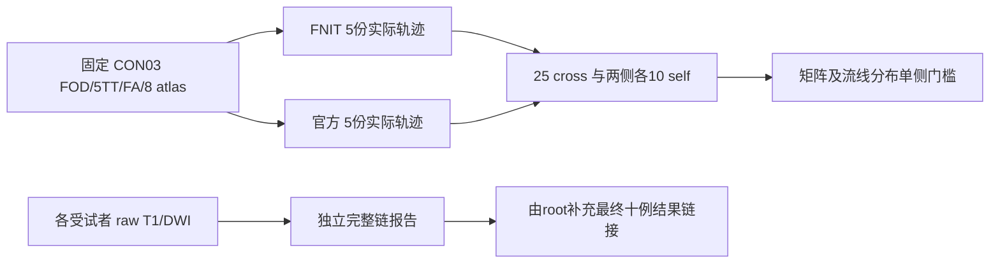

# 固定输入连接组重复性的实际结论

## 1. 结论与适用范围

CON03 的五份 FNIT 与五份官方固定输入结果已完成。矩阵跨软件 **1091/1200** 项通过，FNIT 自身 **412/480** 项通过；流线分布分别 **72/125** 与 **47/50**。四项整体状态均为 `failed`，不能写成 FNIT 与官方科学等价或重复性验收完成。分母是指标×轨迹组合×atlas 的判定数量，不是独立受试者数，也不是正确连接的比例。

本审查只读取实际 JSON、源码和 SHA，不运行追踪、SIFT2、FA、矩阵构造或原软件。root integration 快照为 `e305bb75a59c5973f4b5dd80229e2c782ef42c50`，五次结果来自 `bec6307d1925666f24a5f60629b8ab8157c04242`；原 TCK 诊断来自已整合的 `0fa4b1de` / `e6d7bf2f`。全部16项 artifact 清单的大小与 SHA 已核对，每个 pair 的原指标、finite 状态、官方边界、判定和总数另经只读复算，见 [独立审查记录](../../validation/connectome/tenraw_20261002/task_04_repeatability_review/audit.json)。

## 2. 固定输入与独立 raw 链的界限

本结果固定同一 CON03 FOD、5TT、FA、网格与八 atlas；每侧种子 0–4、每轮100,000次尝试。五份既有 FNIT packed tracks 经 TCK float32 坐标和顺序逐 bit 读回核验，随后使用冻结 baseline SIFT2、precise FA 和矩阵函数后处理。各软件自身有10个无序组合，跨软件有25个组合。相同整数 seed 不表示相同 RNG 或逐轨迹对应。

这组证据定位固定输入追踪分布和后处理差异，不覆盖 raw T1/DWI 到最终矩阵的十例独立链。[已提交官方两例解剖/DWI/atlas快照](../../validation/connectome/raw10_official_anatomy_DWI_20261003/two_case_completion.public.json)仅证明 CON01、CON03 的指定输出完成，明确记录 `full_ten_raw_connectome_completed=false`、`tractography_completed=false`、`connectome_completed=false`。它不是两例官方全 connectome 完成证明。root 的 GPU raw配对及后续 CPU官方链进度、十例最终精度和耗时，应由最终实际逐例报告补充链接；本页不提前给出十例结果。

## 3. 官方自身 finite 单侧 envelope 的定义

`tools/connectome_repeat_common.py:envelope` 使用10个官方自身比较的有限观测边界：误差指标 **≤ official max**；相似性指标 **≥ official min**。边界等号算通过；任何官方值缺失或非有限时，该字段不能建立完整门槛；cross/self 缺失或非有限时判 `not_assessed`，不能填零或计通过。全部组合通过才是字段 `passed`；任一字段失败则整体 `failed`。

**比官方自身更好可以接受**：误差低于官方观测最小值，或相似性高于官方观测最大值，不应被拒绝。`inside_count` 仅统计落在双侧显示区间的数量，验收应读 `accepted_count` 与 `comparison_accepted`。例如 schaefer500+tian-s4 的 FNIT自身 count Pearson 是10/10通过，但 `inside_count=8`；长度 nMAE是10/10通过，但 `inside_count=3`，其更小误差仍符合门槛。这里没有新增容差或改 gate。

有限五次重复范围是描述性观测，不是总体置信区间。pair共享同一运行、不同字段共享同一矩阵，判定并非独立样本。矩阵指标只用严格上三角；对角线另报。count/FBC用全部非对角边；长度/FA只用两矩阵 count 都非零的共同边。相对误差以第一矩阵归一化，cross第一矩阵为官方，self按保存顺序。node语义以各例nodes.tsv核对，不能把本例节点数用于其他病例。

## 4. 完整5×5矩阵的具体失败点

[完整矩阵数据](../../validation/connectome/tenraw_20261002/task_04_repeat_fivefnit_reference/matrix_envelope.json)保存每个pair、atlas/input身份、范围及对角线；以下每指标单元格为“cross通过/25；FNIT self通过/10”，以 `cross/self` 简写。

| Atlas | count L1 | FBC L1 | count Dice | count Pearson | 长度 nMAE | FA nMAE | cross合计 | self合计 |
|---|---:|---:|---:|---:|---:|---:|---:|---:|
| aparc+tian-s1 | 22/8 | 24/9 | 22/10 | 23/10 | 23/10 | 18/6 | 132/150 | 53/60 |
| aparc.a2009s+tian-s1 | 22/9 | 25/10 | 21/6 | 20/10 | 25/10 | 22/9 | 135/150 | 54/60 |
| fs-aparc | 19/7 | 22/6 | 23/10 | 23/9 | 22/8 | 20/8 | 129/150 | 48/60 |
| glasser+tian-s1 | 24/9 | 23/8 | 22/8 | 24/9 | 25/10 | 24/10 | 142/150 | 54/60 |
| glasser+tian-s4 | 23/8 | 23/7 | 20/7 | 22/7 | 25/10 | 22/10 | 135/150 | 49/60 |
| schaefer1000+tian-s4 | 18/5 | 23/5 | 25/10 | 23/10 | 25/10 | 25/10 | 139/150 | 50/60 |
| schaefer200+tian-s1 | 23/8 | 24/9 | 25/10 | 21/10 | 25/10 | 25/10 | 143/150 | 57/60 |
| schaefer500+tian-s4 | 22/5 | 24/5 | 17/7 | 24/10 | 25/10 | 24/10 | 136/150 | 47/60 |

| 指标 | cross通过 | FNIT self通过 |
|---|---:|---:|
| count L1 | 173/200（失败 27） | 59/80（失败 21） |
| SIFT2 FBC L1 | 188/200（失败 12） | 59/80（失败 21） |
| count Dice | 175/200（失败 25） | 68/80（失败 12） |
| count Pearson | 180/200（失败 20） | 75/80（失败 5） |
| 长度 nMAE | 195/200（失败 5） | 78/80（失败 2） |
| FA nMAE | 180/200（失败 20） | 73/80（失败 7） |

八套atlas都存在失败字段。最集中的cross失败来自 count L1（27项）、count支持Dice（25项），但六类指标均有失败；self count L1和FBC L1各失败21项。具体实例：aparc+tian-s1的官方seed2与FNITseed4，count L1为0.3777003484，高于官方最大0.3669572437；FBC L1为0.4251066334，高于0.4197180150。aparc+tian-s1的官方seed0与FNITseed1，FA nMAE为0.06733513373，高于0.06605646096。这些是实际越界，不以高总体Pearson或通过比例替代全字段验收。

## 5. 流线分布与五份FNIT自身重复

[完整流线分布数据](../../validation/connectome/tenraw_20261002/task_04_repeat_fivefnit_reference/population_envelope.json)给出全部25 cross、10 FNIT self和10官方self。

| 指标 | 官方self范围 | cross范围 | cross通过 | FNIT self通过 |
|---|---:|---:|---:|---:|
| 接受率绝对差 | 0.00023–0.00368 | 0.00011–0.00289 | 25/25 | 10/10 |
| 长度 KS | 0.006082612849–0.01443866059 | 0.006607740142–0.01710024795 | 21/25 | 10/10 |
| 端点 8 mm Pearson | 0.8967445506–0.9063503154 | 0.8850141837–0.8997530934 | 3/25 | 8/10 |
| 原生 point-visit Pearson | 0.834225143–0.8438138325 | 0.8261151765–0.8431256523 | 16/25 | 9/10 |
| 4 voxel 块 point-visit Pearson | 0.9861640384–0.9886122327 | 0.9824157169–0.9877472106 | 7/25 | 10/10 |

53项cross失败中，端点8 mm Pearson占22项、4 voxel块point-visit Pearson占18项、原生point-visit占9项、长度KS占4项；接受率全部通过。FNIT自身3项失败为端点Pearson两项、原生point-visit一项。两侧接受条数分别为FNIT 11606/11613/11747/11710/11764、官方11843/11775/11689/11475/11820。

point-visit是TCK保存点按冻结world-to-voxel变换和 `np.rint` 计数，不等同于官方tckmap；4 voxel轴块在本2.5 mm网格上为10 mm。端点8 mm bins按所有10份轨迹共同范围构造；新增四份FNIT使bin origin改变，公式未变。[新旧edges记录](../../validation/connectome/tenraw_20261002/task_04_repeat_fivefnit_reference/endpoint_bin_provenance.json)与 [来源记录](../../validation/connectome/tenraw_20261002/task_04_repeat_fivefnit_reference/analysis_provenance.json)保留该变化和原五份官方TCK/网格身份。不用旧single-FNIT的较高通过数替代本次完整5FNIT结论，也不跨分箱直接解释端点相关性的数值变化。

## 6. 科学差异与本轮bitwise优化分别判定

固定输入cross/self envelope评估随机追踪与矩阵的实际分布差异；原TCK SIFT2/FA诊断固定同一批轨迹，评估算子输出；optimizer ABBA比较冻结基线与缓存候选的严格bitwise行为。三者不能互相代替。

原TCK官方权重：CON03 Pearson 0.9997302020、最大差0.4947942481、RMSE0.009947777538；CON01 Pearson0.9997501496、最大差0.4195431652、RMSE0.008966424308。precise FA分别Pearson0.9999999943/0.9999999925，最大差0.0005315840/0.0007345676。官方小数原样解析，不通过舍入改结果。原图像体素和affine前三行精确一致；原5TT的非规范第四行不能完整编码在NIfTI三行sform内，两例均未证明官方完整4×4 affine bit身份，转换矩阵和mrinfo metadata保留在各例supplement内。高相关性不证明逐值等价，也不能据此指认差异的单一来源。

CON03与CON01的optimizer固定mapping ABBA严格门槛均失败。基线自身重复已有约10⁻¹⁵权重尾差；重复索引的浮点CUDA index_add_涉及atomic累加，但未逐操作隔离原因，不能把所有candidate交叉尾差都归于旧atomic。CON03候选optimizer平均节省0.01961458秒；CON01观察到负收益且有共享GPU负载。本轮候选不进入production，不改变精度、reduce顺序或迭代数达标。这不等于已解释或修复上述科学cross失败。

## 7. 证据身份、复核与后续结果链接

本页实际来源均为root integration已提交文件，复制到task_04时逐字节与该HEAD blob核对。上游artifact清单16项全部通过size/SHA核验；审查记录列出每个文件绝对来源路径、完整SHA和每个指标重核结果。下表为本页引用的完整身份，SHA使用原始文件字节。

| 仓库相对路径 | SHA-256 |
|---|---|
| `validation/connectome/tenraw_20261002/task_04_repeat_fivefnit_reference/matrix_envelope.json` | `d0e4fb5a115b03e9272695855ae2fde8046f5e484bbeb8fe77aa99d102602536` |
| `validation/connectome/tenraw_20261002/task_04_repeat_fivefnit_reference/matrix_envelope_compact.json` | `90fae710461a2fe567d05d71d33a71ca94dfce40d96f0ad702d94f5ef34decbb` |
| `validation/connectome/tenraw_20261002/task_04_repeat_fivefnit_reference/population_envelope.json` | `014245efd7bb7c20420c31dfcd53c54f85078141d2a07444188afb512e5093dd` |
| `validation/connectome/tenraw_20261002/task_04_repeat_fivefnit_reference/artifact_sha256.json` | `4545ac329e9f357e822d71183f5cc15c3cd2c7b1f1bb6da1e55e7231b03440dc` |
| `validation/connectome/tenraw_20261002/task_04_repeat_fivefnit_reference/analysis_provenance.json` | `5633245b9b72f912e19400bd5c13ec2a9857410e403855ec3b679b6a7d422c97` |
| `validation/connectome/tenraw_20261002/task_04_repeat_fivefnit_reference/endpoint_bin_provenance.json` | `ed4cf61a4c603e57eb68ca2feec5a68dcf7d0f11760f0549454a004a68fc8967` |
| `validation/connectome/tenraw_20261002/task_04_repeat_fivefnit_reference/post_controller.json` | `c7ea7fac8dd2130e40a45061770189c5ef1e52889945012e22bc6689afa91bf4` |
| `tools/connectome_repeat_common.py` | `9581300f2db3e96aca6914493e8f6dab7b2bff9efdbfd15ada47d744bac9802c` |
| `tools/benchmark_connectome_tracking_population.py` | `6654bb2ca9963c15bb9811d6e6143bb341c037aaf4b1414519a05a73a7ad3c3a` |
| `tools/benchmark_connectome_seven_atlas_envelope.py` | `67770d6d763a08e8e5e46e6a024371fce18204b102343dd40e483606be1f9f63` |
| `validation/connectome/raw10_official_anatomy_DWI_20261003/two_case_completion.public.json` | `d50f284453961731a8949a84ee684a42a3ac82020526010306e2da6dcfbbfce9` |
| `validation/connectome/tenraw_20261002/task_04/CON03_all_pairs_official_supplement.json` | `863552b3f325abe5e5e7d701c6a12441161a9f714b3c46004f227330b4577cd2` |
| `validation/connectome/tenraw_20261002/task_04/CON03_sameinput.json` | `256a74791b781bb4be58025e990e2a6fa40eede53a824557bb7c46c3482459d4` |
| `validation/connectome/tenraw_20261002/task_04/CON03_official_comparison.json` | `13856ab26dd35151986b512c054045d731b3f4c60d463e5630dd05527cc0386a` |
| `validation/connectome/tenraw_20261002/task_04/CON01_all_pairs_official_supplement.json` | `437c7a27b92242c1c6693505db9c22e4d51aca83b82f22c4956725a30bbe5904` |
| `validation/connectome/tenraw_20261002/task_04/CON01_sameinput.json` | `1db8ab09923ec260b626df40d079b63da58e01449a623171215de17c26c8c528` |
| `validation/connectome/tenraw_20261002/task_04/CON01_official_comparison.json` | `720db4dd07feba8c382552be5f940c1cdffc822b74836ad5c9177649ad27f739` |

可复核路径根：`/tmp/fnit-connectome-tenraw-20261002/integration`；真实服务器路径与输入/矩阵SHA见原 `artifact_sha256.json`、matrix JSON及post配置。只读复核时，对每组pair从保存的 `metrics` 重取10个官方值，建立min/max单侧边界，再对25 cross与10 self逐项比较；不能只相加README摘要，也不能用inside_count。审查JSON已验证原pair值、边界、判定数组和合计全部一致。

版本记录：2026-10-03，本页首次独立核对完整5×5数据；保留旧single-FNIT和两例原TCK诊断的独立证据命名空间，无科学重算、无算法或gate变更。最终raw10逐例报告与耗时链接由root在实际完成后补入。原软件版本、真实CLI、资源来源及文献沿用冻结参考manifest和原报告，本审查不新增外部资源。
