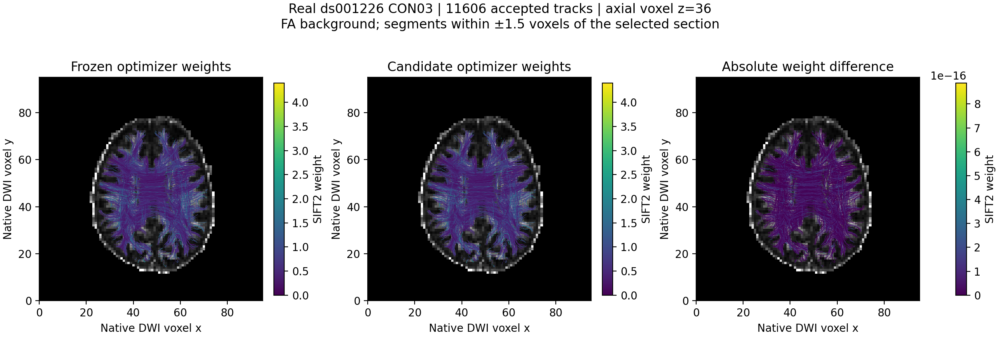

# SIFT2 与沿流线 FA 精确采样

候选验收状态：CON03 与 CON01 既定真实验证均已完成，两例严格逐值门槛均失败，optimizer 缓存不采用。本文件保留实际评估与成熟功能的调用说明；生产优化器保持原实现。

## 1. 功能简介

SIFT2 根据归一化白质 FOD 与固定流线估计每条流线的非负权重。依次计算 ACT processing mask、1281 方向 FMLS fixel、精确 voxel passage 与 8-bit 长度记录，最后进行 Newton 优化。FA 精确采样按每次体素穿越的长度求均值。

本轮评估过的候选缓存 Newton 内不变的索引取值和原式计算，并复用 gradient/hessian 缓冲；该候选未采用。保留 FP64、稀疏记录顺序、100 次内迭代上限、0.001 停止阈值与 clamp。mapping 的全轨迹 `interval_length.cumsum` 仍跨轨迹连续，不能通过分块重新置零改变抵消尾差。FMLS 排名、积分、FA 采样没有改动。没有新增运行时依赖。

## 2. Python 调用、输入和输出

```python
import torch
from fnit.connectome import estimate_sift2_weights, sample_streamline_mean_precise

streamline_weights = estimate_sift2_weights(
    paths=streamline_paths,              # float32 [Pi,3] 列表，TCK 顺序，世界 RAS mm
    wm_sh=normalized_white_matter_fod,   # float32 [X,Y,Z,45]，MRtrix 实 SH 顺序
    fod_affine=diffusion_affine,         # [4,4]，FOD 体素中心到世界 mm
    five_tissue=five_tissue_fractions,   # float32 [A,B,C,5]，cGM/sGM/WM/CSF/pathology
    five_tissue_affine=anatomy_affine,   # [4,4]，5TT 体素中心到世界 mm
    step_size_mm=tracking_step_size_mm,  # 正数；使用生成 TCK 时的真实步长
    processing_mask=None,               # 默认从 5TT 计算；可给同 FOD 网格 float32 mask
)
streamline_mean_fa = sample_streamline_mean_precise(
    streamlines=streamline_paths,       # 原始路径，不进行 Hermite 上采样
    scalar_image=fa_image,              # float32 [X,Y,Z]，无量纲
    affine=fa_affine,                   # [4,4]，FA 体素中心到世界 mm
)
```

所有 tensor 必须在同一设备；路径至少两个点。权重为 float64 `[T]`，FA 为 float32 `[T]`，均保持 TCK 顺序且留在输入设备。FA 没有有效影像访问时返回 NaN。SIFT2 无有效 fixel 或贡献时明确报错；空路径列表返回空权重。

底层 `optimize_sift2_fixels` 接收对齐的 `track_index`、`fixel_index`、`length_mm` 一维数组 `[K]`；长度必须是原 mapping 的正有限量化毫米长度。同轨迹/fixel 可因 byte overflow 有多个记录。`target` 是 float64-compatible `[F]` FMLS 积分，`processing_mask` 是 `[F]` 的 0–1 权重，`n_tracks` 包含未贡献轨迹。索引为整数，各 tensor 同设备。参数：`min_td_fraction=0.1` 排除低密度 fixel；`tv_lambda=0.1` 正则强度；`min_iterations=10` 最少外迭代；`max_iterations=1000` 最多外迭代；`min_cost_decrease=2.5e-5` 为初始 cost 比例停止阈值。返回 `SIFT2Optimization`：`weights[T]`、标量 `mu`、`fixel_density[F]` 毫米密度、`excluded_fixels[F]` 布尔掩码、实际外迭代次数 `iterations`。

## 3. 命令行调用

SIFT2 与精确 FA 采样由完整 pipeline 调用，组件没有单独的生产 CLI：

```bash
fnit UKBConnectome_pipeline \
  --bids-root "$RAW_BIDS_DIRECTORY" \
  --subject "$SUBJECT_ID" \
  --freesurfer-subject-dir "$FREESURFER_SUBJECT_DIRECTORY" \
  --atlas fs-aparc \
  --n-seeds 100000 \
  --seed 0 \
  --eddy-gp-seed 12345 \
  --device cuda:0 \
  --output-dir "$CONNECTOME_OUTPUT_DIRECTORY"
```

这些变量分别为原始 BIDS 根目录、不带 `sub-` 的受试者编号、已完成的官方 recon-all subject 目录和输出目录。输入已有校正 DWI 时可用主说明中的跳过参数。固定 TCK 的隔离官方参考命令见下一节。

本轮历史候选的实际 JSON、全部配对结果和脑图保存在 `validation/connectome/tenraw_20261002/task_04/`。缓存候选未通过严格门槛，其实现未合入生产代码。报告的 read、H2D、FMLS、mapping、optimizer、FA 是分步测量；嵌套诊断不能相加当作端到端时间。ABBA 四臂保持同一 sparse map、TF32、FP64 优化器和停止条件，比较两次同版本与全部交叉配对。

显存报告包含固定 TCK 路径、FOD、5TT、FA、FMLS 和 sparse map；不包含生产 tracking 的 padded backing。NVML 每个 MiB 读数向上多记一个 MiB，保存失败采样数及最大采样间隔；采样最大值不能证明连续时间上界。正式原始 pipeline 的墙钟和显存由独立整链运行测量。

## 4. 原软件调用

```bash
tcksift2 "$PILOT_FNIT_TRACKS" "$PILOT_FNIT_FOD" "$OFFICIAL_WEIGHTS" \
  -act "$PILOT_FNIT_FIVE_TISSUE" -nthreads 8
tcksample "$PILOT_FNIT_TRACKS" "$PILOT_FNIT_FA" "$OFFICIAL_FA" \
  -precise -stat_tck mean -nthreads 8
```

真实检查点通过 `prepare_sift2_official_inputs.py --checkpoint-dir ... --output-dir ...` 转为 NIfTI-2 float32 体素与 float64 sform，逐 bit 验证体素及可保存的前三行。NIfTI sform 不保存第四行；实际 CON03 的原 5TT 组合 affine 第四行含约 1e-18 非零项及 1 与约 1e-16 的差值，转换报告完整记录原/参考矩阵、末行 bit 差异和最大差值。组件仍使用原始完整 4×4 矩阵，不能声称官方参考全矩阵逐 bit 相同；随后在 nodecw10 用 `run_sift2_official_reference.py --mrtrix-bin ... --tracks ... --input-dir ... --output-dir ...` 执行 8 线程参考。结果由 `compare_sift2_official_outputs.py` 按同一 TCK 顺序比较官方原始文本、组件 NPZ 和 root 的 `track_metrics.npz`，记录 neq/max/P99/RMSE，不转换精度或事后放宽门槛。root 生产权重与重载 TCK 的 A1 基线权重独立比较；同一 sparse map 的 A1/B1 优化差异另列，不能混称优化引入误差。重载 TCK 不保留原生产 padded backing，记录重载逻辑/唯一 storage bytes 和端点 bit 差异；端点一致不代表已经逐点证明所有原轨迹一致，也不把运行差异直接归因于文件格式。队列同时要求全部完整导出、root 最终 diagnostic 报告的 `status=completed` 和 `exit_code=0`，避免读取正在写入的 TCK。若报告为 `failed`，明确终止组件任务并保留失败状态，不将失败输出作为 benchmark 输入。每个文件另保存 `mrinfo -config RealignTransform false -json_all`，记录官方读取的 spacing/transform；规范见 [MRtrix 几何说明](https://mrtrix.readthedocs.io/en/latest/getting_started/image_data.html)。上述原命令的 FOD/5TT/FA 路径应指向这三个 NIfTI-2 文件，TCK 保持 root 原文件。原软件只用于隔离参考，不进入生产。参考与候选必须读取相同 TCK，并记录程序 SHA、版本及输入 SHA。

## 5. 最新精度、耗时与脑图

冻结基线为 `f436de588647a0de80735e4a98d53df5d88e502d`。CPU/CUDA 严格冻结源码回归及既有组件测试共 29 项已通过；这属于单元回归，不是 benchmark。新下载 ds001226 CON03 v2 完整核心已成功，100,000 seeds 实际导出 11,606 条 accepted tracks。固定 TCK 的 nodecw10 8 线程官方参考已完成：SIFT2 9.391426 s、precise mean FA 0.035317 s，均 exit0，程序及输入 SHA 见 `CON03_official_reference.json`。这些是官方组件 wall，不是原始 pipeline 端到端时间。参考转换的体素和 sform 前三行均逐 bit 相同；5TT 第四行不能以 NIfTI 保存，4 个字段 bit 不同、最大绝对差 5.551115e-16，见 `CON03_reference_geometry_conversion.json`。真实 GPU0 同输入 ABBA 与官方逐值对照均已完成，完整记录见 `CON03_sameinput.json`、`CON03_official_comparison.json`。

| 实际项目 | 结果 |
|---|---:|
| seeds / accepted tracks / sparse records | 100,000 / 11,606 / 283,935 |
| optimizer A1 / B1 / B2 / A2 wall (s) | 0.101230 / 0.083075 / 0.079578 / 0.100653 |
| 基线 / 候选平均 wall (s) | 0.100941 / 0.081327 |
| optimizer 局部节省 / 降幅 | 0.019615 s / 19.43% |
| FMLS / mapping / precise FA wall (s) | 11.718512 / 0.115619 / 0.124531 |
| A1/B1 权重 neq / max / P99 / RMSE | 4,268 / 8.881784e-16 / 2.220446e-16 / 7.463263e-17 |
| A1/A2 基线重复权重 neq / max / P99 / RMSE | 4,394 / 1.332268e-15 / 2.220446e-16 / 7.919240e-17 |
| A1/B1 density neq / max / P99 / RMSE | 17,534 / 1.421085e-14 / 3.552714e-15 / 7.502826e-16 |
| 排除 mask / 停止迭代 / μ | 四组逐值相同 |
| 官方与重载基线权重 max / P99 / RMSE | 0.494794 / 0.026945 / 0.009948 |
| 官方 precise FA max / P99 / RMSE | 0.000531584 / 0.000023830 / 0.000012991 |
| root FA 与重载 precise FA | 11,606 项逐值相同 |
| root endpoints 与 TCK 重载 | 全部 bit 相同；不据此证明轨迹所有点相同 |
| NVML 向上取整观测最大值 / allocated / reserved | 4.447011 / 2.165231 / 2.545943 GB |
| NVML 失败 / 最大采样间隔 | 0 / 1.172330 s |
| 新 gather 常驻增量 / 全部 record 缓存 | 11,357,400 / 27,257,760 bytes |

四臂原始权重全部配对见 `CON03_all_pairs_official_supplement.json`，11,606 项均有限；以下没有精度转换或容差处理。

| 配对 | 权重 neq | max | RMSE |
|---|---:|---:|---:|
| A1/A2 | 4,394 | 1.332268e-15 | 7.919240e-17 |
| B1/B2 | 4,216 | 8.881784e-16 | 7.359281e-17 |
| A1/B1 | 4,268 | 8.881784e-16 | 7.463263e-17 |
| A1/B2 | 4,336 | 8.881784e-16 | 7.611082e-17 |
| A2/B1 | 4,326 | 8.881784e-16 | 7.483514e-17 |
| A2/B2 | 4,262 | 8.881784e-16 | 7.606197e-17 |

上述各配对 P99 均为 2.220446e-16、Pearson corr 在当前浮点统计中均为 1.0，但 neq 非零。官方 SIFT2 对 A1/A2/B1/B2 的全 11,606 条 Pearson corr 均为 0.9997302020498378，官方 FA corr 为 0.9999999943461039。corr 不能替代逐值门槛。CON03 旧 NPZ 没有保存各臂 density，仅有原 JSON 的 A1/B1、A2/B2、A1/A2、B1/B2 density；缺失的两组交叉 density 不做重建。后续 CON01 工具会保存各臂实际 density。

原 optimizer 在 `original_density`、`effective_length`、每轮 `density/mean_coefficient`、Newton `gradient/hessian` 处，用重复 fixel/track 索引执行 FP64 `index_add_`，冻结源码中已存在。PyTorch 2.5.1 的 [CUDA Indexing.cu](https://github.com/pytorch/pytorch/blob/v2.5.1/aten/src/ATen/native/cuda/Indexing.cu) 默认 index-add 路径使用 `ReduceAdd` 的 `fastAtomicAdd`；重复索引浮点累加具并发顺序影响。整数 `track_count` 的 index_add 不属于这里的 FP64 舍入问题。候选缓存与缓冲复用也改变了数据流及存储生命周期，可能影响调度；本次未逐操作隔离，因此不把全部 A/B 差异归因于既有 atomic，不将 `.sum()` 泛称为已经定位的不确定性来源，也不启用不同的 deterministic 归约来达到门槛。

基线自身重复计算也出现 FP64 差异，候选与基线的权重差异未超过这一次基线重复的最大差值，但这不能证明候选不引入新误差。原严格逐值门槛未通过，`eligible_same_map_candidate=false`，没有事后修改容差。官方权重差异在基线和候选中均存在，不能归因于此次 optimizer 缓存；原 affine 第四行的格式差异也不能据此认定是误差原因。所有比较均保留原始 decimal 参考，不做精度转换修正。

硬件为物理 GPU0 `GPU-26e41f63-1a65-6b3e-5370-fa9a2934ca8e`，基线和候选均采用 `expandable_segments:True`、TF32 和同一 map。起止 GPU 利用率快照为 3% / 36%，另有 804 MiB 与 698 MiB 常驻进程；快照不能证明期间完全无外部活动。20 GB 判断覆盖此固定 TCK 组件的观测/allocator 峰值，原 tracking padded buffer 未复现，不能称为完整链路上界。1M seeds 和完整候选生产 wall/显存未测。



脑图用所有实际 accepted tracks 在 z=36 的 ±1.5 voxel 薄层显示，背景为本次 FA；基线/候选共用权重色标，绝对差异色标为 1e-16。仅用于空间显示，不改变任何基准输入。复现命令：

```bash
python tools/connectome/plot_sift2_real_brain.py \
  --checkpoint-dir /path/to/root_diagnostic_CON03_v2/checkpoints \
  --component-report /path/to/CON03_sameinput.json \
  --output /path/to/CON03_sift2_brain.png
```

`--checkpoint-dir` 提供实际 TCK、geometry.npz 与 FA；`--component-report` 提供实测 JSON 与同名 NPZ 权重；`--output` 输出 PNG 和记录输入 SHA/显示薄层的同名 JSON。绘图使用项目已有 Conda matplotlib/numpy/nibabel，在 CPU 运行。

历史 ds004666 结果不能替代本轮新数据。

验收报告须列出 neq、max、P99、RMSE、NaN 模式、排除 mask、mu 和停止迭代；候选相对基线不允许新增差异。官方相关性高不等于逐值相同。完整原始 pipeline 的计时与验收由协调根任务汇总。

### CON01 第二 pilot（既定验证已完成）

同一原始 PT/TCK，100,000 seeds、14,300 accepted tracks、347,010 sparse records；GPU0 UUID 与 CON03 相同，`expandable_segments:True`、TF32，实际 FP64 step 为 1.2499999851889865 mm。`deterministic_algorithms_enabled=false`，未切换原 CUDA 归约。全部原始报告见 `CON01_sameinput.json`、`CON01_official_comparison.json`、`CON01_all_pairs_official_supplement.json`。

| 每臂 wall (s) | A1 | B1 | B2 | A2 |
|---|---:|---:|---:|---:|
| CON03 | 0.101230 | 0.083075 | 0.079578 | 0.100653 |
| CON01 | 0.240395 | 0.300092 | 0.351432 | 0.244486 |

CON01 基线平均 0.242441 s、候选平均 0.325762 s，观测节省 -0.083321 s（-34.37%）。这次受共享 GPU 活动污染：起止利用率 64% / 51%，存在另一个 35,210 MiB 进程，故不据此声称候选算法固有变慢。CON03 仅一组短时局部收益也不支持稳健提速或端到端收益。两例严格门槛均失败，本轮不采用 optimizer 缓存。

| CON01 配对 | 权重 neq | max | P99 | RMSE |
|---|---:|---:|---:|---:|
| A1/A2 | 5,359 | 1.776357e-15 | 2.220446e-16 | 7.832119e-17 |
| B1/B2 | 5,181 | 8.881784e-16 | 2.220446e-16 | 7.410656e-17 |
| A1/B1 | 5,215 | 1.776357e-15 | 2.220446e-16 | 7.631733e-17 |
| A1/B2 | 5,168 | 1.776357e-15 | 2.220446e-16 | 7.639530e-17 |
| A2/B1 | 5,168 | 8.881784e-16 | 2.220446e-16 | 7.379075e-17 |
| A2/B2 | 5,302 | 8.881784e-16 | 2.220446e-16 | 7.569680e-17 |

全部六组排除 mask、μ、迭代数相同，非有限模式无新增差异，但权重和 density 均非逐值相同。六组 density neq/max/P99/RMSE/corr 均在补充报告，实际每臂 density 已保存，未重建或改变计算。既有原子归约与候选数据流的区分同上，没有逐操作因果隔离。

| 第二例实际指标 | 结果 |
|---|---:|
| FMLS / mapping / precise FA wall (s) | 15.489598 / 0.308097 / 0.055977 |
| 官方 SIFT2 / precise FA CPU wall (s) | 10.612509 / 0.041610 |
| 官方 SIFT2 对 A1 corr / max / P99 / RMSE | 0.9997501496235569 / 0.419543 / 0.029617 / 0.008966 |
| 官方 precise FA corr / max / P99 / RMSE | 0.9999999925032749 / 0.000734568 / 0.000023247 / 0.000014519 |
| NVML 向上取整观测最大值 / allocated / reserved (GB) | 4.423942 / 2.170676 / 2.527068 |
| NVML 失败 / 最大采样间隔 | 0 / 0.561708 s |

官方与 A1/A2/B1/B2 的完整 corr/neq/max/P99/RMSE 按臂保存，不能以 corr 高称逐值等价。原体素及前三行 sform 仍逐 bit 相同；CON01 5TT 第四行 4 个字段无法以 NIfTI 保存，最大差 1.776357e-15。补充报告含原始4×4矩阵、参考矩阵、PT/geometry来源SHA及实际 mrinfo header；`RealignTransform false` 仅用于 metadata introspection，程序执行参数以 reference_report 内原始命令为准。无官方误差因果归因。

固定 TCK 组件两例均满足观测/allocator 20 GB 条件，均不包含原 tracking padded backing，也不是连续时间 NVML 或全链显存上界。1M/完整候选 raw wall 未测；按 root 的本轮范围决定，严格失败候选不再扩展此项验证。

## 6. 版本与 benchmark 记录

- 冻结版本 `f436de5`：本轮唯一源码对照；历史验证仍绑定原报告版本。
- 2026-10-03 CON03：真实完整核心及同 TCK 官方参考完成；NIfTI 第四行几何限制单独记录；GPU0 ABBA、官方逐值对照及脑图完成；严格逐值门槛失败，1M/完整候选链路仍未测。
- 2026-10-02 候选：Newton 固定 gather/表达式缓存与缓冲复用；测试及真实运行证据放在 `validation/connectome/tenraw_20261002/task_04/`，未执行项明确 pending。

## 7. 参考与原代码

原实现采用 MRtrix3 `026e850d`：[SIFT 源码](https://github.com/MRtrix3/mrtrix3/tree/026e850d/src/dwi/tractography/SIFT)、[precise mapping](https://github.com/MRtrix3/mrtrix3/blob/026e850d/src/dwi/tractography/mapping/mapper.h)、[tcksample](https://github.com/MRtrix3/mrtrix3/blob/026e850d/cmd/tcksample.cpp)。相关代码遵循 MPL-2.0，见项目 THIRD_PARTY_NOTICES。方向表是项目已有资源，本轮未添加外置模型或模板。

Smith et al., SIFT2, NeuroImage 2015：[DOI](https://doi.org/10.1016/j.neuroimage.2015.06.092)。Smith et al., ACT, NeuroImage 2012：[DOI](https://doi.org/10.1016/j.neuroimage.2012.06.005)。Tournier et al., MRtrix3, NeuroImage 2019：[DOI](https://doi.org/10.1016/j.neuroimage.2019.116137)。
