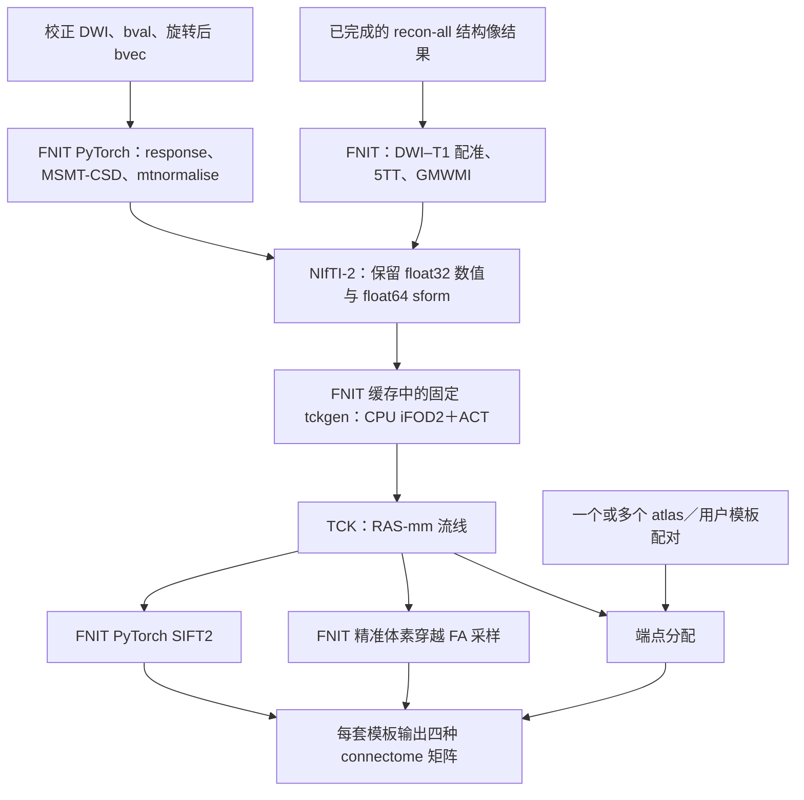

# 原生 MRtrix iFOD2/ACT 追踪

[完整 pipeline](README.md) · [最新版端到端验证](../../validation/connectome/native_tracking_20261009/README.md) · [历史 PyTorch 追踪结果](../../validation/connectome/tracking_cfff_20261009/README.md)

## 1. 功能与流程

`probabilistic_tractography()` 从归一化 WM FOD、5TT 和 GMWMI 生成流线。追踪使用 FNIT 从固定 MRtrix 源码独立构建的 `tckgen`，在 CPU 上运行；不需要安装 MRtrix，也不搜索 `PATH` 中的 MRtrix 命令。原 PyTorch iFOD2/ACT 实现已移除。

`UKBConnectome_pipeline` 的 DWI 建模、解剖处理、SIFT2、精准 FA 采样与矩阵构建继续使用 FNIT 成熟实现。使用 CUDA 时，这些阶段仍在 GPU 上计算。此次更换追踪后端，没有改变其余阶段的统计定义或精度策略。



原始 BIDS 输入的 TOPUP、EDDY 与 recon-all 选择机制见[完整 pipeline](README.md)。本页说明从 FOD 到流线的组件接口及其在 pipeline 中的衔接。

### 固定源码与部署

- MRtrix 源码固定为 [`026e850d171ec2a12f09865d31b8332d23d7ecf6`](https://github.com/MRtrix3/mrtrix3/tree/026e850d171ec2a12f09865d31b8332d23d7ecf6)。首次调用下载并核对固定源码、Eigen 和 zlib 的大小与 SHA-256，然后构建 `bin/tckgen` 及必要库。
- 构建工具来自项目的 Conda 环境。当前支持 Linux/WSL。源码、编译日志与程序保存在外置缓存，不复制到 FNIT 仓库，也不复制系统预装的 MRtrix 二进制。
- 每次使用都校验固定源码身份、构建器、部署补丁、可执行程序和配套库。缓存损坏时明确报错，不改用其他程序。
- 外置 `core/file/config.cpp` 的小补丁只在 `FNIT_MRTRIX_ISOLATED_CONFIG=1` 时跳过系统和用户配置文件的自动读取。官方默认值与命令行 `-config` 保留；iFOD2、ACT 和数值算法源码未修改。补丁前后 SHA-256 进入构建清单。
- 子进程动态库路径依次采用 FNIT 缓存、当前 Conda、原环境；不修改父进程环境或 `HOME`。固定使用 sform、关闭几何重排和 JSON 自动加载，并关闭 `TckgenEarlyExit`。
- MRtrix 采用 [MPL-2.0](https://github.com/MRtrix3/mrtrix3/blob/026e850d171ec2a12f09865d31b8332d23d7ecf6/LICENCE.txt)。外置源码保留原许可证，运行缓存另存 `MRtrix-LICENCE.txt`。源码下载、校验和构建信息记录在 `manifest.json` 中。

## 2. Python 调用、输入与输出

### 张量输入

以下三个影像已经处于同一 DWI RAS 世界坐标空间；5TT/GMWMI 可保留原 T1 体素网格。完整 pipeline 会计算其 DWI 世界空间仿射，组件调用者需提供正确仿射。

```python
import nibabel as nib
import numpy as np
import torch
from fnit.connectome.tracking import probabilistic_tractography

tracking_device = torch.device("cuda:0")  # 输出流线供后续 GPU SIFT2/矩阵使用
wm_fod_image = nib.load("wm_fod_normalized.nii.gz")
five_tissue_image = nib.load("five_tissue_dwi_world.nii.gz")
gmwmi_image = nib.load("gmwmi_dwi_world.nii.gz")

wm_fod_tensor = torch.from_numpy(
    np.asarray(wm_fod_image.dataobj, dtype=np.float32)
).to(tracking_device)  # float32 [Xf,Yf,Zf,45]
five_tissue_tensor = torch.from_numpy(
    np.asarray(five_tissue_image.dataobj, dtype=np.float32)
).to(tracking_device)  # float32 [Xa,Ya,Za,5]
gmwmi_tensor = torch.from_numpy(
    np.asarray(gmwmi_image.dataobj, dtype=np.float32)
).to(tracking_device)  # float32 [Xa,Ya,Za]
fod_affine_tensor = torch.as_tensor(
    wm_fod_image.affine, dtype=torch.float64, device=tracking_device
)  # FOD 体素中心到 DWI RAS-mm
five_tissue_affine_tensor = torch.as_tensor(
    five_tissue_image.affine, dtype=torch.float64, device=tracking_device
)  # 解剖体素中心到同一 DWI RAS-mm

tracking_result = probabilistic_tractography(
    wm_sh=wm_fod_tensor,
    fod_affine=fod_affine_tensor,
    five_tissue=five_tissue_tensor,
    five_tissue_affine=five_tissue_affine_tensor,
    gmwmi=gmwmi_tensor,
    five_tissue_spacing_mm=five_tissue_image.header.get_zooms()[:3],
    n_seeds=100000,        # 播种预算，不是要求接受 100000 条流线
    seed=0,               # 设置官方 MRTRIX_RNG_SEED
    tracking_threads=8,   # CPU 追踪线程数；不决定 GPU 并行度
    lmax=8,               # 8 阶偶数球谐，共 45 个系数
    max_length_mm=250.0,
    min_length_mm=None,   # 固定官方 ACT 默认：2 倍 FOD 几何平均体素尺寸
    step_mm=None,         # 固定官方默认：FOD 几何平均体素尺寸的一半
    max_angle_degrees=45.0,
    cutoff=0.1,
    power=0.5,
    fa=None,              # 不在本组件调用中计算 FA；pipeline 后续精准采样
    output_tck="tracks_native.tck",  # 必须是尚不存在的 .tck 文件
)
```

张量暂存为未压缩 NIfTI-2，保留 float32 体素值和 float64 sform 前三行，不重采样影像。5TT header 的三轴间距单独保存。输入仿射底行应为 `[0,0,0,1]`，允许 1e-12 内的数值尾差；NIfTI sform 不保存底行尾差。读回的全部流线点先组成一个连续缓冲区，再一次传到目标设备，各条 `paths` 引用其中对应区间。

### 文件输入

文件输入直接使用原 NIfTI 文件和 header，不重新写入影像。也可传 nibabel image；此时按上面的 NIfTI-2 规则暂存。

```python
from fnit.connectome.tracking import probabilistic_tractography

tracking_result = probabilistic_tractography(
    wm_sh="wm_fod_normalized.nii.gz",     # 归一化 WM FOD [Xf,Yf,Zf,45]
    five_tissue="five_tissue_dwi_world.nii.gz",  # 五组织概率 [Xa,Ya,Za,5]
    gmwmi="gmwmi_dwi_world.nii.gz",       # 同一解剖网格上的播种权重
    n_seeds=100000,
    seed=0,
    tracking_threads=8,
    device="cuda:0",                     # 指定返回张量设备；追踪本身仍在 CPU
    output_tck="tracks_from_files.tck",
)
```

文件 header 已提供仿射与间距，因此无需另传 `fod_affine` 或 `five_tissue_affine`。若同时提供显式仿射/间距，其值必须与文件一致，函数不会隐式覆盖文件几何。

### 全部组件参数

| 参数 | 默认值、格式与含义 |
| --- | --- |
| `wm_sh` | 必需；张量/NumPy 数组、nibabel image 或 NIfTI 路径，形状 `[Xf,Yf,Zf,C]`。归一化 WM 实球谐系数，顺序与 MRtrix 一致；`C=(lmax+1)*(lmax+2)//2`。 |
| `fod_affine` | `None`；FOD 体素中心到 RAS-mm 的 `[4,4]` 仿射。张量/数组输入必需，文件/image 默认读取自身几何。 |
| `five_tissue` | 必需；`[Xa,Ya,Za,5]`，通道依次为皮层 GM、皮层下 GM、WM、CSF、病理组织。支持与 FOD 相同的三种输入形式。 |
| `five_tissue_affine` | `None`；5TT 体素中心到同一 RAS-mm 的 `[4,4]` 仿射。FOD 与 5TT 允许不同体素网格。 |
| `gmwmi` | 必需；`[Xa,Ya,Za]` GM-WM 界面播种权重。须与 5TT 共享体素中心；张量使用 5TT 仿射和 header 间距。 |
| `n_seeds` | 必需的正整数；对应 `-seeds N -select 0` 的请求播种预算。 |
| `lmax` | `8`；非负偶数，必须与 FOD 最后一维的系数数目一致。 |
| `five_tissue_spacing_mm` | `None`；可选三个正、有限的毫米间距。张量默认由仿射列范数获得；文件/image 默认读取原 header。 |
| `fa` | `None`；可选 float32 FA 张量 `[Xf,Yf,Zf]`，与 FOD 网格一致，并位于输出设备。采用精准体素穿越的长度加权平均；没有粗粒度点采样分支。 |
| `seed` | `0`；非负整数，设置 `MRTRIX_RNG_SEED`。 |
| `tracking_threads` | `8`；正整数，传给官方 `-nthreads`。需要逐轨迹确定性对照时用 `1`；多线程输出保持官方调度和随机性。 |
| `max_length_mm` | `250.0`；正、有限的最大流线长度，毫米，映射至 `-maxlength`。 |
| `min_length_mm` | `None`；省略时由固定官方程序计算 ACT 默认。显式值须有限、非负且不大于最大长度，映射至 `-minlength`。 |
| `step_mm` | `None`；省略时由固定官方程序计算 iFOD2 默认。显式值须正、有限且小于最大长度，映射至 `-step`。 |
| `max_angle_degrees` | `45.0`；当前组件接受 `(0,90]` 度，映射至 `-angle`。 |
| `cutoff` | `0.1`；正、有限的 FOD 幅值阈值，映射至 `-cutoff`。 |
| `power` | `0.5`；正、有限的路径概率幂指数，映射至 `-power`。弧采样数固定为 `-samples 3`。 |
| `output_tck` | `None`；可选新建 `.tck` 路径，保留原生输出；省略时加载后删除临时 TCK。不覆盖已有文件。 |
| `device` | `None`；张量输入默认返回 FOD 张量设备，文件/image 默认返回 CPU。可显式指定 `cpu` 或 `cuda:0` 等。 |
| `batch_size` | 已弃用；默认 `None`，传任何值均报错。 |
| `arc_proposals` | 已弃用；默认 `None`，传任何值均报错。 |
| `compile_arc` | 已弃用；为兼容旧默认调用保留 `False`，传 `True` 报错。CLI 已删除该选项。 |

### 输出 `Tractogram`

设接受的流线数为 `T`，第 `i` 条有 `Pi` 个存储点。

| 字段 | 结构与含义 |
| --- | --- |
| `paths` | 长度 `T` 的 tuple，每条 float32 `[Pi,3]`，按 TCK 记录顺序保存 RAS-mm 坐标。共享连续底层缓冲区。 |
| `endpoints` | float32 `[T,2,3]`，分别为每条路径首尾点，RAS-mm。 |
| `lengths_mm` | float32 `[T]`，存储折线路径长度；按 MRtrix 的 float32 逐段累加定义计算。 |
| `mean_fa` | 传入 `fa` 时为 float32 `[T]` 的精准长度加权 FA；否则为 `None`。路径未穿过 FA 网格时可为 NaN。 |
| `seeds_attempted` | Python int，保留旧接口名称，但值表示请求的 `n_seeds` 预算。它不是从 TCK 恢复的实际尝试次数。 |
| `accepted_seeds` | **`None`**。TCK 未保存原播种点，不能从路径首尾或中点推造种子坐标。 |
| `native_provenance` | 字典，包含固定源码、程序/库/补丁 SHA、输入影像 SHA/shape/affine/间距、追踪参数、TCK SHA、header 和计时。 |

`native_provenance["tck_header"]` 保留实际存在的 `count`、`total_count`、`step_size`、`min_dist`、`max_dist`、`max_angle`、`samples_per_step`、`fod_power`、`threshold`、`init_threshold` 和 `output_step_size`。nibabel 读取的附加字段常为字符串，需要使用时显式转换。

`count` 是写出的接受流线数，`total_count` 是官方记录的生成候选数；它不包含所有无法初始化的播种尝试，因此不能代替请求预算。Pipeline 从真实 TCK header 读取 `step_size` 传给 SIFT2，不重新推算另一个步长。

全部流线被拒绝时，组件返回空 `paths` 及对应空张量；完整 pipeline 会报出没有接受流线。结构/参数/几何错误抛出 `ValueError`，源码构建或原生执行失败明确报错。原生执行失败后不启动替代追踪后端。

### 影像导出与运行时接口

`write_tracking_image(value, affine, output_path, voxel_spacing_mm=None)` 可供固定输入参考对照复用：`value` 是张量/数组或 nibabel image，`affine` 是上述 RAS-mm 几何，`output_path` 必须是未压缩 `.nii` 路径，可选 spacing 保留独立 header 间距。返回写出的 `Path`，不重采样影像。

`ensure_tckgen(cache_dir=None, jobs=None, allow_download=True)` 返回已校验的 FNIT `bin/tckgen` 绝对路径。`cache_dir` 是外置缓存根目录；`jobs` 是构建并发数，默认最多 8；`allow_download=False` 禁止下载缺少的源码归档。它不改变追踪线程数，也不将传入的缓存目录设置为后续 pipeline 的默认缓存。

`native_runtime_manifest(binary)` 对该 FNIT 缓存程序及配套库重新校验，返回构建清单。没有任意二进制覆盖接口。

## 3. 命令行调用

### 一次性构建与离线复用

先按[项目首页](../../README.md)创建并激活 Conda 环境，然后执行：

```bash
export FNIT_NATIVE_CACHE=/data/cache/fnit-env-01/connectome-native

# jobs 只影响首次编译；与追踪的 tracking-threads 分开。
python -m fnit.connectome.native_runtime \
  --cache-dir "$FNIT_NATIVE_CACHE" \
  --jobs 8

# 已完成构建时，此命令只校验并返回现有程序，完全不下载。
python -m fnit.connectome.native_runtime \
  --cache-dir "$FNIT_NATIVE_CACHE" \
  --offline
```

| 安装参数 | 含义 |
| --- | --- |
| `--cache-dir` | 外置缓存目录；默认先读 `FNIT_NATIVE_CACHE`，否则用 `$XDG_CACHE_HOME/fnit/connectome-native`，未设置 XDG 时用用户 `.cache`。 |
| `--jobs` | 正整数，默认 `min(8, CPU 数量)`；仅控制构建并发。 |
| `--offline` | 禁止下载。若尚未构建，需已具备校验通过的三个固定源码归档；已构建时复用并校验缓存。 |

构建按缓存身份加锁。源代码、CPU 指令集或构建器变化使用不同缓存身份；不会覆盖正在使用的冻结程序。损坏缓存报错，构建失败日志保留在外置缓存。为 pipeline 指定非默认缓存时，用同一 `FNIT_NATIVE_CACHE` 环境变量。
每个 Conda 环境应设置独立的 `FNIT_NATIVE_CACHE`，不要跨环境 prefix 移动或共享旧缓存；不同环境的 C++ 运行库可能不兼容。更换环境后在新缓存目录构建程序。

### 完整 connectome 命令

```bash
# corrected_dwi 已完成 TOPUP/EDDY；bvec 必须是 EDDY 旋转后的方向。
# 两套 atlas 共用同一次 FOD、原生追踪和 SIFT2。
fnit UKBConnectome_pipeline \
  --dwi /data/subject/dwi/corrected_dwi.nii.gz \
  --bvals /data/subject/dwi/dwi.bval \
  --bvecs /data/subject/dwi/eddy_rotated.bvec \
  --freesurfer-subject-dir /data/subjects/sub-01 \
  --atlas fs-aparc fs-aparc-a2009s \
  --n-seeds 100000 \
  --seed 0 \
  --tracking-threads 8 \
  --device cuda:0 \
  --checkpoint-dir /data/results/sub-01/checkpoints \
  --output-dir /data/results/sub-01
```

`--tracking-threads` 只控制 CPU iFOD2/ACT；`--device` 控制 FNIT 的 PyTorch 阶段。其余 BIDS、重建选择、模板配对和输出参数见[完整参数说明](README.md)。改变 atlas 或模板配对复用共享追踪结果；改变追踪参数、固定程序/补丁/源码或数值实现会使相应核心与矩阵 checkpoint 失效。新 schema 用 `unknown` 表示不存在的种子坐标，不恢复旧 PyTorch 追踪结果充当原生结果。

## 4. 原软件等价调用

对 FNIT 实际输入影像，以下命令具有相同科学参数。`REFERENCE_TCKGEN` 应是独立固定版本参考程序；FNIT 生产使用自己的校验缓存程序。

```bash
REFERENCE_TCKGEN=/data/reference/bin/tckgen
REFERENCE_FOD=/data/reference_inputs/wm_fod.nii
REFERENCE_FIVE_TISSUE=/data/reference_inputs/five_tissue.nii
REFERENCE_GMWMI=/data/reference_inputs/gmwmi.nii
REFERENCE_TRACKS=/data/reference_outputs/tracks.tck

MRTRIX_RNG_SEED=0 MRTRIX_CONFIGFILE=/dev/null \
  "$REFERENCE_TCKGEN" "$REFERENCE_FOD" "$REFERENCE_TRACKS" \
  -algorithm iFOD2 \
  -seed_gmwmi "$REFERENCE_GMWMI" \
  -act "$REFERENCE_FIVE_TISSUE" \
  -seeds 100000 -select 0 \
  -maxlength 250 -angle 45 -cutoff 0.1 -samples 3 -power 0.5 \
  -nthreads 8 \
  -config RealignTransform false \
  -config NIfTIUseSform true \
  -config NIfTIAutoLoadJSON false \
  -config TckgenEarlyExit false
```

没有显式给出 `-step`/`-minlength` 时，固定官方实现从 FOD header 的三轴间距几何平均计算默认值。显式 Python 参数对应添加相同的官方选项。逐轨迹确定性对照固定种子并把两边线程数设为 `1`；常规 8 线程测试评估官方随机重复范围，不能要求每次多线程运行逐条相同。

参考输入应使用组件实际写出的 NIfTI-2，并核对输入 SHA、几何、数据类型与参数。官方未应用 FNIT 配置隔离补丁时仍可能读取用户 `.mrtrix.conf`；独立验证需记录并控制该配置。配置隔离补丁不用于改变官方算法。

FNIT 下游的对应命令为 `tcksift2`、`tcksample -precise -stat_tck mean` 和 `tck2connectome`；其精准采样与矩阵设置见[完整 pipeline](README.md)和[矩阵组件源码](../../src/fnit/connectome/assignment.py)。这些官方命令用于独立参考验证，不进入 FNIT 下游生产计算。

## 5. 最新精度、耗时与脑图

最新版真实输入、逐阶段计时、输出比较与脑图集中记录在[原生追踪端到端验证](../../validation/connectome/native_tracking_20261009/README.md)，并绑定实际代码、输入、程序和部署补丁 SHA。手册不把旧 PyTorch 耗时改标为本版结果。

| 验收范围 | 对照内容 | 最新记录 |
| --- | --- | --- |
| 固定 FOD/5TT/GMWMI、单线程 | 原生 FNIT 与独立固定官方程序的播种参数、路径点、端点、长度与 TCK header | [组件验证](../../validation/connectome/native_tracking_20261009/README.md) |
| 真实 DWI＋recon-all 的连续链 | 实际自产 FOD/5TT、原生追踪、PyTorch SIFT2/精准 FA、多个 atlas 与最终矩阵；总墙钟和分步骤耗时分别列出 | [端到端验证](../../validation/connectome/native_tracking_20261009/README.md) |
| 固定同一 TCK 的下游 | FNIT 与官方 SIFT2 权重、精准 FA 与四种 connectome 矩阵；不把追踪随机性混入固定路径比较 | [下游验证](../../validation/connectome/native_tracking_20261009/README.md) |
| 模板/缓存 | 更换 atlas 后实际复用共享核心，旧追踪和错误缓存不会被误用 | [缓存验证](../../validation/connectome/native_tracking_20261009/README.md) |
| 真实脑图与资源 | 实际 TCK 投影、矩阵、CPU/GPU 计时边界、显存监测覆盖与未完成项目 | [图像和资源记录](../../validation/connectome/native_tracking_20261009/README.md) |

单元测试使用小输入控制接口、几何、配置隔离、失败行为和 checkpoint 合同，不能替代上表的真实 benchmark。原生追踪本身不申请 CUDA 内存；完整 pipeline 的显存仍取决于父进程的影像、SIFT2 和矩阵阶段，需要独立监测。

本版公开 ds004666 同输入实测：单线程 10k seeds 的 3173 条轨迹、134261 个点及 offsets 逐字节一致；8 线程 100k 三次中位数为 FNIT 适配器 14.35 s（原生命令 13.24 s）、独立官方命令 13.60 s。已校正 DWI＋已有 recon-all→两 atlas 整链 274.17 s，复用核心 3.05 s。两 atlas 同 TCK count 逐值一致，SIFT2 FBC 的 relative L1 为 0.2178%/0.2494%；参数、计时范围和剩余差异见[实际结果](../../validation/connectome/native_tracking_20261009/README.md#5-当前实测精度耗时和脑图)。


## 6. 最近更新与历史记录

| 版本/日期 | 变化与证据 |
| --- | --- |
| 原生追踪 / 2026-10-09 | 用 FNIT 独立源码构建的固定 `tckgen` 替换 PyTorch iFOD2/ACT；增加 `tracking_threads`，保留双精度几何、精准 FA 和未知种子语义；缓存绑定 native 程序、库与补丁。[本版报告](../../validation/connectome/native_tracking_20261009/README.md)。 |
| [`6ae32945`](https://github.com/weikanggong1/Fudan-Neuroimaging-toolkit/commit/6ae3294513be8cd9d9df8b92846f3235913c1955) / 2026-10-09，历史 PyTorch | eager SH 数据流优化；此前 A100 的 [10k](../../validation/connectome/tracking_cfff_20261009/sh_preserved_10k.public.json)、[100k eager](../../validation/connectome/tracking_cfff_20261009/sh_preserved_default_100k.public.json)、[100k compiled](../../validation/connectome/tracking_cfff_20261009/sh_preserved_compiled_100k.public.json) 与[独立 MRtrix](../../validation/connectome/tracking_cfff_20261009/mrtrix_100k.public.json)均保留原源码和计时边界。它们不验证本版。 |
| 2026-10-03，历史精度轮 | SGM 截断的局部精度修正与十例完整结果，见[精度汇总](ACCURACY_OPTIMIZATION_20261003.md)及[原始结果](../../validation/connectome/accuracy_20261003/final_cohort_summary_v1/README.md)。旧 PyTorch 全流程的未匹配项保留，不归入本版验收。 |

历史真实脑图仅作为前版记录：


图的真实输入、流线 SHA 与显示范围见[历史 QC JSON](../../validation/connectome/tracking_cfff_20261009/real100k_qc.public.json)。最新版图与验收结果见第 5 节。

## 7. 原实现与参考文献

- [固定版本 `tckgen.cpp`](https://github.com/MRtrix3/mrtrix3/blob/026e850d171ec2a12f09865d31b8332d23d7ecf6/cmd/tckgen.cpp)、[`iFOD2.h`](https://github.com/MRtrix3/mrtrix3/blob/026e850d171ec2a12f09865d31b8332d23d7ecf6/src/dwi/tractography/algorithms/iFOD2.h)、[ACT 追踪执行逻辑](https://github.com/MRtrix3/mrtrix3/blob/026e850d171ec2a12f09865d31b8332d23d7ecf6/src/dwi/tractography/tracking/exec.h)、[官方 `tckgen` 参数](https://mrtrix.readthedocs.io/en/latest/reference/commands/tckgen.html)。文档可能随官网版本更新；生产源码始终使用上面的固定提交。
- [UKB-connectomics 原流程](https://github.com/sina-mansour/UKB-connectomics)。
- Smith RE et al. Anatomically-constrained tractography: improved diffusion MRI streamlines tractography through effective use of anatomical information. *NeuroImage* 62 (2012), 1924–1938. [DOI](https://doi.org/10.1016/j.neuroimage.2012.06.005)。
- Smith RE et al. SIFT2: Enabling dense quantitative assessment of brain white matter connectivity using streamlines tractography. *NeuroImage* 119 (2015), 338–351. [DOI](https://doi.org/10.1016/j.neuroimage.2015.06.092)。
- Tournier JD et al. MRtrix3: A fast, flexible and open software framework for medical image processing and visualisation. *NeuroImage* 202 (2019), 116137. [DOI](https://doi.org/10.1016/j.neuroimage.2019.116137)。
