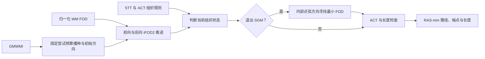
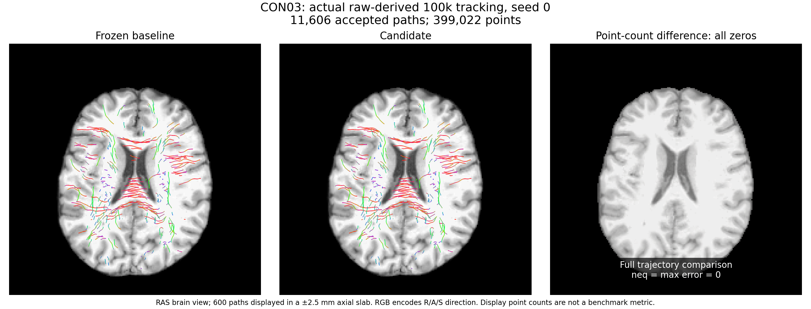

# ACT/iFOD2 追踪与 SH、体积采样

[流程入口](README.md) · [本轮精度优化总说明](ACCURACY_OPTIMIZATION_20261003.md) · [本轮追踪组件验证](../../validation/connectome/accuracy_20261003/task_03/README.md)

## 1. 功能简介

`probabilistic_tractography` 从归一化 WM FOD 和 5TT/GMWMI 生成 RAS 毫米坐标的流线。一次生成全部种子，再按固定批量初始化方向、前向追踪、后向追踪，最后保留符合 ACT 和长度规则的路径。生产采用 FNIT PyTorch，实现不启动 MRtrix。

前轮（2026-10-02）数据流加速复用 SH 系数索引、FOD 布局及坐标尺度，以及 5TT 各轴的角点索引和权重。SH 仍按原阶数递推；FOD 系数逐元素相乘后沿系数轴求和。5TT 按 `dz → dy → dx` 的八角点顺序做 FP32 加和，保留 `weight < 1e-6`、最近体素非零判断和图像边界规则。路径仍为 tuple；单向路径引用 forward 缓冲区。前轮同输入逐值比较和耗时记录见第 5 节。

本轮（2026-10-03）精度候选修正 SGM 退出截断：在降采样之前，按相邻内部顶点的弦方向评价 FOD，再选择 SGM 段内的最小点。此前使用圆弧切线，可能选到不同截断点。圆弧概率仍使用切线，RNG 和校准循环保留原规则。active-only 校准实验没有速度收益，已撤回；本轮十二次完整 raw 与十例比较已完成，矩阵 1388/2400、轨迹分布 85/250，整体未匹配；两组配对耗时观测合计 −2.80%（CON03 +0.50%），原显存监测缺口与独立补测另列。



## 2. Python 调用、输入与输出

```python
import torch
from fnit.connectome.tracking import probabilistic_tractography

checkpoint = torch.load("pilot_tracking_input.pt", map_location="cpu", weights_only=True)
tracking_device = torch.device("cuda:0")
tracks = probabilistic_tractography(
    wm_sh=checkpoint["wm_sh"].to(tracking_device),              # 归一化 WM SH，float32 [XF,YF,ZF,C]
    fod_affine=checkpoint["fod_affine"].to(tracking_device),    # FOD 体素中心到 RAS-mm 的 [4,4] 仿射
    five_tissue=checkpoint["five_tissue"].to(tracking_device),  # float32 [XA,YA,ZA,5]
    five_tissue_affine=checkpoint["five_tissue_affine"].to(tracking_device), # 5TT 到同一 RAS-mm 空间
    gmwmi=checkpoint["gmwmi"].to(tracking_device),              # float32 [XA,YA,ZA] GM-WM 界面权重
    n_seeds=100000,                 # 尝试的种子数；不是要求接受的流线数
    lmax=8,                         # 偶数 SH 最高阶；C=(lmax+1)*(lmax+2)//2，8 阶为45
    five_tissue_spacing_mm=checkpoint["five_tissue_spacing_mm"], # 原 5TT header 的三轴毫米间距
    fa=None,                        # 可选 FOD 网格 float32 FA；None 不计算逐路径平均FA
    seed=0,                         # 全流程单个 PyTorch Generator 的固定种子
    batch_size=8192,                # 种子批量；改变它会改变随机数消费顺序
    arc_proposals=16,               # 每块方向候选数；每条弧最多尝试1000次
    max_length_mm=250.0,            # 总路径长度上限，毫米
    min_length_mm=None,             # None 使用2倍 FOD 几何平均体素尺寸
    step_mm=None,                   # None 使用 FOD 几何平均体素尺寸的一半
    max_angle_degrees=45.0,         # 相邻弧方向最大夹角，度
    cutoff=0.1,                    # FOD 幅值阈值；初始方向必须严格高于阈值
    power=0.5,                     # 弧概率的幂指数
    compile_arc=False,             # 本轮保持未编译路径；已知编译可能改变实际轨迹
)
```

所有输入张量位于同一个 CPU/CUDA 设备；函数将仿射转为 float64，FOD/5TT/GMWMI 转为 float32。FOD 与 5TT 可以有不同网格，但世界坐标必须对应。5TT 五通道依次为皮层灰质、皮层下灰质、白质、CSF、病理组织。GMWMI 与 5TT 的体素网格匹配。`five_tissue_spacing_mm=None` 使用仿射列范数；给定三轴间距时按 header 间距修正 ACT 仿射。播种使用原 5TT 仿射。

`Tractogram` 输出各字段如下。

| 字段 | 结构与单位 |
| --- | --- |
| `paths` | 长度 N 的 tuple；每条 float32 `[Pi,3]`，RAS 毫米坐标。单向流线是 forward 缓冲区视图。 |
| `endpoints` | float32 `[N,2,3]`；路径起点与终点，RAS毫米。 |
| `lengths_mm` | float32 `[N]`；每条接受路径的毫米长度。 |
| `mean_fa` | 给定 FA 时为 `[N]`；否则为 None。该接口的点采样平均与 pipeline 后续精确长度加权 FA 是两个步骤。 |
| `seeds_attempted` | Python int；等于请求的 `n_seeds`。 |
| `accepted_seeds` | float32 `[N,3]`；与输出路径顺序对应的种子，RAS毫米。 |

拒绝全部路径时返回空 tuple 和相应零长度张量；pipeline 会进一步报错。输入结构、SH宽度、种子/批量/候选数、长度和间距不合法时抛出 ValueError。GMWMI 权重为空或负值报错；投影20轮仍无法获得要求种子数时报 RuntimeError。

`tracking_sh_precomputed(directions, lmax=8)` 只计算追踪 SH：输入 float32 `[...,3]`，输出同设备 float32 `[...,C]`，系数顺序为偶数 `l` 后按 `m=-l…l` 排列。512层 Legendre 表和正/负/零阶系数索引按设备与最高阶缓存；缓存各最多8组。方向归一化及方位递推不变。

`_VolumeSampler(volume, inverse_affine)` 是内部调用上下文，准备 `[X,Y,Z,C]` 到 `grid_sample` 的布局视图、float64 RAS到体素仿射切片和归一化尺度。它返回 `[N,C]` 样本，不复制完整体积；上下文只在一次 tracking 内使用。`_sample` 的独立接口保持原实现。`_five_tissue_mrtrix` 输入 5TT、RAS点和其 float64 逆仿射，输出 `[N,5]`；最近体素全零或位置出图像时返回零。

## 3. 命令行调用

SH 和内部采样上下文没有独立生产 CLI。原始 BIDS 入口见 [pipeline 文档](README.md#3-命令行调用)，本轮 SGM 诊断与参数见[本轮 task 3](../../validation/connectome/accuracy_20261003/task_03/README.md#3-命令行调用与复现)。以下脚本重放前轮数据流加速的同输入检查点，源码与逐值门槛对应前轮版本：

```bash
# 按实际冻结基线导出 fod.py 和 tracking.py；source目录内只需这两个文件。
# manifest是前轮10例下载数据的许可、配对、SHA记录，checkpoint保留全部输入张量和header间距。
flock /tmp/fnit-connectome-tenraw-gongwk.gpu0.lock \
  env CUDA_VISIBLE_DEVICES=GPU-26e41f63-1a65-6b3e-5370-fa9a2934ca8e \
  python validation/connectome/tenraw_20261002/task_03/run_tracking_checkpoint.py run \
  --source /data/task_03/baseline \
  --source-commit f436de588647a0de80735e4a98d53df5d88e502d \
  --checkpoint /data/newpilot/tracking_input.pt \
  --manifest /data/task_01/manifest.json \
  --output /data/task_03/ABBA/A1 --n-seeds 100000 --seed 0 --batch-size 8192

# candidate使用相同输入、种子、批量和设备，source-commit填实际提交。
python validation/connectome/tenraw_20261002/task_03/run_tracking_checkpoint.py compare \
  --baseline /data/task_03/ABBA/A1 --candidate /data/task_03/ABBA/B1 \
  --output /data/task_03/ABBA/strict_A1_B1.json
```

`run` 参数：`source` 是两份模块的目录；`source-commit` 为实际版本；`checkpoint`、`manifest` 分别为检查点和前轮原始数据清单；`output` 是独立输出目录；`n-seeds`、`seed`、`batch-size` 未给出时完整复用真实检查点。给出 `seed`/`batch-size` 必须与快照相同；只允许明确的1000000规模检查覆盖原 seed数量。`profile` 可选，开启额外 CPU dispatch 诊断；`cuda-profile` 可选，导出CUDA trace和独立kernel/copy-memset事件时长。正式耗时关闭两项诊断。`compare` 需要 baseline、candidate 输出目录和报告文件名。

随机重复另用 `run_tracking_seed_repeat.py`，它只在明确给出 `--seed-repeat --seed 0..4` 时覆盖随机种子，保持原 PT 张量、种子数量、batch及所有追踪参数。该工具独立于冻结的 ABBA worker。示例：

```bash
flock /tmp/fnit-connectome-tenraw-gongwk.gpu0.lock \
  env CUDA_VISIBLE_DEVICES=GPU-26e41f63-1a65-6b3e-5370-fa9a2934ca8e \
  python validation/connectome/tenraw_20261002/task_03/run_tracking_seed_repeat.py run \
  --source /data/task_03/candidate \
  --source-commit c4811b4b192014cd59e1031385e359cd992ef9e5 \
  --checkpoint /data/newpilot/tracking_input.pt \
  --manifest /data/task_01/manifest.json \
  --output /data/task_03/repeats/seed1 --seed-repeat --seed 1
```

不同随机种子的输出用于后续 SIFT2/矩阵波动分析，不用逐位相同作为判定标准。`check_actual_seed_repeats.py --directory /data/task_03/repeats --output /data/task_03/repeats/audit.json` 在全部五次实际运行完成后检查源码和输入 SHA、参数、数组结构、有限值、路径端点及显存预算；它不代替原软件矩阵对照。

检查点由root诊断钩子直接从真实调用导出 `tracking_inputs.pt`，包含 `wm_sh`、`fod_affine`、`five_tissue`、`five_tissue_affine`、`gmwmi`、`five_tissue_spacing_mm`、`fa`、完整 `tracking_kwargs` 和 `explicit_arguments`。所有张量保存为 CPU；两份仿射保留 float64，spacing保留原header的float tuple。工具复用这些参数，不经NIfTI重写几何。

输出目录必须全新/为空，失败证据保留。每个 worker 输出 `points.npy`、`offsets.npy`、`endpoints.npy`、`lengths_mm.npy`、`accepted_seeds.npy` 和 `report.json`；快照含FA时另输出 `mean_fa.npy`。`points` 仅在结果转 CPU 后拼装用于验收，生产 `paths` 合同不变。`offsets` 为 int64 `[N+1]`，第 i 条路径取 `points[offsets[i]:offsets[i+1]]`。CPU原始读取、H2D、tracking同步墙钟、D2H和写出分开。`total_worker_seconds` 从脚本完成依赖导入后开始，包含模块加载与输入SHA校验；完整子进程启动耗时由外层整例/调度器记录。锁等待不计入 tracking。

显存报告包含 allocated/reserved、当前 tracking 进程的 NVML采样峰值、GPU UUID、采样失败和最大间隔。此 worker 不生成GPU子进程；端到端 pipeline 的父子进程合计由外层监测。未采到该进程 NVML 记录时保留 None；不得按零占用验收。三个峰值均须小于20,000,000,000字节。1000000 seeds需另跑完整worker，不据此推断10M容量。

## 4. 原软件调用

以下 MRtrix 命令仅作独立 reference，不进入 FNIT 生产。

```bash
tckgen wm_fod.mif reference_tracks.tck \
  -algorithm iFOD2 -act five_tissue.mif -seed_gmwmi gmwmi.mif \
  -seeds 100000 -select 0 -step 1.0 -angle 45 -cutoff 0.1 \
  -power 0.5 -samples 3 -maxlength 250 -minlength 4
```

这里 step=1mm、minlength=4mm对应2mm等方 FOD 网格；其他网格按 FNIT 同规则填写。`-seeds` 是播种预算，`-select 0` 不因接受数提前结束。FNIT 使用单个 PyTorch Generator，MRtrix 的随机数序列不同；官方比较采用预先确定的重复性范围。SH查表及5TT内插属于 `tckgen` 内部步骤，没有单独官方命令。[命令参数原文](https://mrtrix.readthedocs.io/en/latest/reference/commands/tckgen.html)。

本轮 SGM 修正对应实际 MRtrix3 `3.0.3-103-g026e850d` 的 `Exec::truncate_exit_sgm` 与 `iFOD2::get_metric`；它们也是 `tckgen` 内部步骤。精确源码提交、oracle 输入与原命令参数见[本轮验证](../../validation/connectome/accuracy_20261003/task_03/README.md#4-原软件调用)。

## 5. 最新精度、耗时与脑图

### 本轮精度优化：2026-10-03

本轮正式候选保留 SGM 弦方向截断修正；SH 布局、组织采样及既有数据流加速继续复用前轮实现。公开参数、尝试播种预算、圆弧概率、默认 TF32 和 `compile_arc=False` 均保留。

| 核对范围 | 实际结果 | 处理 |
|---|---|---|
| 真实 CON03 解剖位置上的 324 个 SGM 局部弧诊断 | 最小 FOD 顶点与官方弦定义不一致数 20→0 | 保留 SGM 精度修正 |
| active-only 校准的 CON03 同输入 100k 性能实验 | 五个公开数组逐值一致；tracking wall 762.751→773.253 s，共享 GPU 负载持续较高 | 无速度收益，恢复原校准循环 |
| 十例正式候选 + CON01/03 两次基线 CLI | 12 次实际运行、十例 CPU 比较已完成 | 矩阵 1388/2400、流线分布 85/250，整体未匹配；配对 wall 和原监测缺口见[最终原报告](../../validation/connectome/accuracy_20261003/final_cohort_summary_v1/README.md) |

第一行使用真实解剖、FOD 与路径位置的局部诊断，完整案例生成方式和数值见[本轮 task 3](../../validation/connectome/accuracy_20261003/task_03/README.md#5-最新精度运行时间与脑图)。聚焦 CPU 回归为 19 passed / 16 CUDA skipped。组件诊断、被撤回性能实验和完整 raw 验收分别记录。


图为固定案例 65：橙叉是原切线最小点，红圈是官方与候选弦方向最小点。输入、采样位置和图像说明随 task 3 保存。完整连接组当前状态见[精度总说明](ACCURACY_OPTIMIZATION_20261003.md)。其余分项证据：[TOPUP/EDDY](../../validation/connectome/accuracy_20261003/task_01/README.md)、[梯度/建模](../../validation/connectome/accuracy_20261003/task_02/README.md)、[解剖/atlas](../../validation/connectome/accuracy_20261003/task_04/README.md)、[固定轨迹矩阵](../../validation/connectome/accuracy_20261003/task_05/README.md)。

### 前轮数据流加速：2026-10-02 轮实际记录

2026-10-02：冻结基线 `f436de588647a0de80735e4a98d53df5d88e502d`，候选已完成新下载 CON03 的真实100k同输入ABBA；CON01完整ABBA也逐位通过；两例 1M、五 seed 及整例结果保留于各自完成报告。CPU的tracking/ACT/collection/SH/采样回归16项通过；GPU同组测试全部31项通过；同输入100k/1M结果见前轮 [task03 证据目录](../../validation/connectome/tenraw_20261002/task_03/)。

完整生成解剖合同回归（100 seeds、75条接受路径、2573个点）与冻结基线在所有points、endpoints、lengths、mean_fa、accepted seeds逐值一致；这是单元/合同回归，不作真实benchmark。见 [合同JSON](../../validation/connectome/tenraw_20261002/task_03/tracking_contract.json)。

SH算子诊断覆盖CPU/CUDA、lmax=0,2,4,6,8,10,12、随机方向、极轴和旧真实方向样本，与冻结基线逐值一致。这是算子回归；重复旧fixture的吞吐测量不能替代前轮新下载受试者benchmark。GPU 1（UUID `GPU-e25cac06-0ce8-a833-abf9-09ab18c9c9ba`）共享锁内AB/BA算子计时如下，单位为每次同步调用的毫秒；只描述CPU dispatch与CUDA执行合计，不拆成kernel比例。

| 方向数 | 基线 | 候选 | 耗时下降 |
| --- | ---: | ---: | ---: |
| 128 | 1.530 | 0.990 | 35.3% |
| 8192 | 1.562 | 1.002 | 35.8% |
| 131072 | 1.589 | 1.003 | 36.9% |

原始AB/BA、源码/fixture SHA和Torch版本见 [算子JSON](../../validation/connectome/tenraw_20261002/task_03/sh_operator_diagnostic.json)。前轮真实 CON03 tracking 数据如下；当轮官方多 seed 矩阵、两例 1M 与十例 raw 整链结果分别保留于对应报告，整链汇总见[pipeline 前轮结果](README.md#前轮数据流加速2026-10-02-轮实际结果)。旧脑图保留原输入与版本标签。

CON03：前轮新下载 ds001226，CC0，snapshot `fb4d0fda44f2ab7a732fb4ab6cd62add09dc1cd7`。直接复用 root 实际调用原子导出的PT，SHA-256 `35fc586482c2366ae4cbf0b4360356fbc0e255e221b8def92d9555960275f07b`，不从NIfTI重建仿射。FOD `[96,96,60,45]`、5TT `[256,256,256,5]`、仿射float64；seed=0，100000次播种，batch=8192，lmax=8，arc_proposals=16，max_length_mm=250，cutoff=0.1，power=0.5，compile_arc=False，其余参数完整见报告。GPU0 UUID `GPU-26e41f63-1a65-6b3e-5370-fa9a2934ca8e`，Torch2.5.1，TF32，8 CPU threads，allocator `expandable_segments:True`。

| 顺序 | 版本 | tracking同步wall/秒 | 接受轨迹 | 轨迹点 |
| --- | --- | ---: | ---: | ---: |
| A1 | 冻结基线 | 202.501 | 11606 | 399022 |
| B1 | c4811b4候选 | 165.209 | 11606 | 399022 |
| B2 | c4811b4候选 | 156.191 | 11606 | 399022 |
| A2 | 冻结基线 | 193.068 | 11606 | 399022 |

基线均值197.785秒，候选160.700秒，观测耗时减少18.75%。这是含CPU dispatch与GPU执行的同步tracking wall，不含输入读写、锁等待或整例前处理。GPU0采样同时发现其他CUDA进程，四轮最多3–5个计算进程，因此数值表示前轮共享负载下的观测，不能当作独占卡kernel提速。四组A1/B1、A2/B2、A1/A2、B1/B2的points、offsets、endpoints、lengths_mm、accepted_seeds全部shape/dtype/value一致，neq/max/P99/RMSE=0。两个pilot的A1回放还与root实际导出的TCK、端点、长度逐位一致，确认直接PT输入的坐标链。

CON03 100k路径逻辑点数据4,788,264 bytes，去重后的底层storage实际保留241,904,580 bytes，约50.5倍。它包含单向accepted路径引用的整个padded forward batch，不能用TCK/CSR字节代替生产显存。首对A1/B1 allocated峰值分别891,219,968/891,229,184 bytes，reserved均903,872,512 bytes，进程NVML峰值均2,801,795,072 bytes；完整四轮及分步骤读/H2D/tracking/D2H/write、采样间隔和budget判定见 [真实ABBA JSON](../../validation/connectome/tenraw_20261002/task_03/actual_tracking_100k_CON03.json)。这些是输入驻留的tracking子功能峰值，整例峰值仍由总控独立测量。

CON01同样复用实际调用的原始PT，四轮接受14300条、486355点，四组严格比较全部为零误差。tracking wall分别A1=191.737、B1=159.040、B2=174.704、A2=648.205秒。首对观测减少17.05%；同一基线A2耗时为A1的3.38倍，采样最多6个计算进程，不能把算术均值产生的60.27%当作稳定实现提速。[CON01完整JSON](../../validation/connectome/tenraw_20261002/task_03/actual_tracking_100k_CON01.json)保留全部原值、源代码/输入/数组SHA及共享负载摘要。

CON03 候选实现的实际随机重复均采用100000个seeds、原PT、batch8192及上述参数，只改变seed。seed0复用已严格核对的实际B1；seed1–4由独立重复工具运行。五次实际输出如下：

| seed | 接受轨迹 | 轨迹点 | tracking同步wall/秒 |
| --- | ---: | ---: | ---: |
| 0 | 11606 | 399022 | 165.209 |
| 1 | 11613 | 400900 | 520.133 |
| 2 | 11747 | 404673 | 522.297 |
| 3 | 11710 | 403573 | 561.484 |
| 4 | 11764 | 410401 | 614.131 |

五次源码和PT/manifest SHA一致；除seed外追踪参数相同，TF32开启、compile_arc=False。数组shape/dtype、有限值、offsets和路径首尾端点一致性审计全部通过。allocated峰值889,601,536–891,229,184 bytes，reserved均903,872,512 bytes，进程采样NVML峰值均2,801,795,072 bytes，均符合20,000,000,000 bytes预算。共享负载下耗时变化较大，表中数值是随机重复运行记录，不用于推导加速比。此处仅确认真实跟踪输出可供后续SIFT2/矩阵分析，前轮原软件 5×5 矩阵精度评估见[pipeline 的前轮结果](README.md#前轮数据流加速2026-10-02-轮实际结果)。[完整五次报告、数组哈希与审计](../../validation/connectome/tenraw_20261002/task_03/actual_tracking_five_seed_audit.json)及[producer控制器](../../validation/connectome/tenraw_20261002/task_03/actual_tracking_five_seed_controller.json)。

两例实际1M A/B已完成。CON03两轮均接受116285条、4021637点，CON01两轮均接受144343条、4936207点；五类数组的shape、dtype、全部值逐位一致，neq/max/P99/RMSE=0。原PT、seed0、batch8192、全部追踪参数及TF32保持相同，compile_arc=False。原始A1直接复用，未重跑。

| 1M轮次 | tracking同步wall/秒 | allocated峰值/bytes | reserved峰值/bytes | 进程采样NVML峰值/bytes |
| --- | ---: | ---: | ---: | ---: |
| CON03 A1基线 | 2250.341 | 3091213312 | 3120562176 | 5018484736 |
| CON03 B1候选 | 5220.029 | 3091222528 | 3122659328 | 5020581888 |
| CON01 A1基线 | 2073.123 | 3110962176 | 3128950784 | 5026873344 |
| CON01 B1候选 | 1901.716 | 3110971392 | 3128950784 | 5026873344 |

CON03两轮路径逻辑数据均48,259,644 bytes，实际去重storage均2,419,304,628 bytes；95615条路径引用比自身更大的storage。CON01两轮逻辑数据均59,234,484 bytes，实际去重storage均2,434,681,212 bytes；117593条路径引用比自身更大的storage。四轮三种观测显存峰值均低于20,000,000,000 bytes；原组件worker的`budget_pass=True`只检查这三项峰值条件。NVML最大采样间隔CON03 A1/B1为4.246/8.709秒、CON01 A1/B1为4.200/4.890秒，四轮NVML失败采样数均为0。CON03 B1最大间隔8.709秒超过正式rawcase的≤5秒要求；组件检查不覆盖完整rawcase流程，也不构成全程连续低于20GB的证明。表中NVML数值是观测采样峰值。A/B在不同共享负载时段执行，保留全部耗时，未推导稳定1M加速结论。前轮1M用于容量与逐位输出检查，只执行A/B，旧B2/A2计划保留为未执行。两例全部五类二进制数组SHA也相同，输入、源码、参数、设备核对通过，三种观测峰值条件满足；这是输入驻留的tracking组件容量记录。正式rawcase完整显存gate另要求监测error=0、最大间隔≤5秒并覆盖整例，由总控独立验收。[两例实际1M A/B完整报告、控制器与数组SHA](../../validation/connectome/tenraw_20261002/task_03/actual_tracking_1M_AB_two_pilot.json)。



脑图使用前轮官方recon-all生成的brain.mgz及实际DWI→T1变换。展示600条确定性选出的路径在±2.5mm轴位slab内的投影；右侧是显示用点计数差，不替代全399022点的严格核对。输入SHA与绘图版本见同名JSON；复现脚本为 `render_real_tracking_abba.py`。绘图仅依赖可由Conda安装的Matplotlib、nibabel、NumPy，未新增FNIT计算时依赖。

可选编译兼容性：Torch 2.5.1 CUDA Inductor 的 fullgraph/dynamic 两组形状与公共 `compile_arc=True` 调用均执行成功，报告见 `compile_cuda_public_compatibility.json`。一组概率输出3个值与eager有差异，最大2.384185791015625e-7；这项检查仅确认API兼容性，前轮无损验收保持 `compile_arc=False`。

新pilot严格门槛：points、offsets、accepted counts、endpoints、lengths和accepted seeds形状、dtype与值均完全相同；neq=0，max/P99/RMSE=0。正式耗时使用相同设备和参数AB/BA；CPU dispatch累计时间不当作CUDA kernel百分比。

## 6. 最近更新与 benchmark 记录

| 版本/日期 | 更新与证据 |
| --- | --- |
| 本轮精度组件/2026-10-03 | SGM 退出截断改用降采样前内部点弦方向；局部选择差异 20/324→0/324。active-only 性能候选撤回，完整 raw 12 次 CLI 验收进行中，见[精度总说明](ACCURACY_OPTIMIZATION_20261003.md)。 |
| 前轮随机重复证据汇总/2026-10-03 | CON03实际seed0–4完成，输入、源码、参数与输出结构审计通过，三类显存峰值均符合预算。只增加独立重复/审计工具与报告，当时生产算法为c4811b4；两例1M A/B的五类二进制数组SHA相同，三种观测峰值均<20GB；CON03 B1采样最大间隔8.709秒，组件结果不作为正式rawcase完整显存gate通过证据；原软件矩阵和整例验收由总控完成。 |
| 前轮数据流候选/2026-10-02 | SH同阶分组写回；FOD调用内上下文；5TT轴索引/权重复用。只减少重复准备，保留求和、ACT、RNG和路径视图。两例真实100k同PT ABBA逐位一致，CON03共享负载下观测耗时下降18.75%；五seed跟踪和两例1M A/B容量检查已完成，整例由总控验收。 |
| f436de5/2026-10-02 | 前轮冻结基线；既有路径收集合同由`test_tracking_collection.py`保护。 |
| 2026-09-29 | [旧100k三种子官方对照](../../validation/connectome/ds004666/tracking_100k_three_seed_20260929.md)，绑定原报告版本。 |
| 2026-09-29 | [旧SH单弧官方对照](../../validation/connectome/ds004666/ifod2_single_arc_20260929.md)；对应真实回归fixture保留。 |

两轮均没有新增运行依赖，PyTorch 和 NumPy由项目主页 Conda 环境安装，pipeline 公共参数保持兼容。前轮数据流优化减少重复准备；本轮 SGM 精度修正改变截断点选择，完整追踪和矩阵表现随本轮实际验收更新。

## 7. 参考文献和原软件代码库

- [MRtrix3 iFOD2 原实现](https://github.com/MRtrix3/mrtrix3/blob/master/src/dwi/tractography/algorithms/iFOD2.h)。
- [MRtrix3 SH 原实现](https://github.com/MRtrix3/mrtrix3/blob/master/core/math/SH.h)。
- Smith RE et al. Anatomically-constrained tractography: improved diffusion MRI streamlines tractography through effective use of anatomical information. NeuroImage 62 (2012), 1924–1938. [DOI](https://doi.org/10.1016/j.neuroimage.2012.06.005)。
- Tournier JD et al. MRtrix3: A fast, flexible and open software framework for medical image processing and visualisation. NeuroImage 202 (2019), 116137. [DOI](https://doi.org/10.1016/j.neuroimage.2019.116137)。
