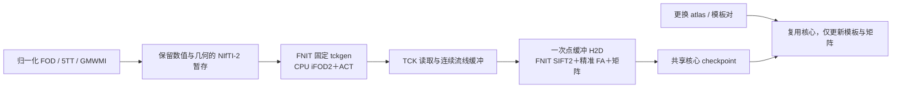

# Connectome 追踪性能：原生后端与历史结果

[完整 pipeline](README.md) · [追踪组件、全部参数与安装](TRACKING_OPERATORS.md) · [最新版端到端实测](../../validation/connectome/native_tracking_20261009/README.md)

## 1. 功能与策略

本版将 PyTorch iFOD2/ACT 替换为 FNIT 从固定 MRtrix 源码独立构建的 `tckgen`。追踪在 CPU 上运行，其余响应、FOD、解剖、SIFT2、精准 FA 和连接矩阵阶段沿用 FNIT 实现。程序来自已核验的 FNIT 外置缓存，不依赖系统 MRtrix 安装，不通过 `PATH` 查找 MRtrix。

过去的 GPU 实现花费大量时间调度逐步采样、拒绝循环和 ACT 状态检查。本版直接执行固定官方 iFOD2/ACT 算法，避免继续用 PyTorch 逐步重实现这部分。完整性能需要计算影像暂存、CPU 追踪、TCK 读取与流线传回 GPU 的共同耗时，不能只计原生程序内部推进。



科学参数保持 `-algorithm iFOD2 -seed_gmwmi -act -seeds N -select 0 -maxlength 250 -angle 45 -cutoff 0.1 -samples 3 -power 0.5`。省略步长和最短长度时，固定官方实现按 FOD header 间距计算默认值；SIFT2 使用实际 TCK header 的步长。没有降低影像精度、减少体素或减少播种预算。

原生 TCK 不保存播种坐标，因此 `accepted_seeds=None`；请求预算、生成候选数和接受数分别记录。FA 一直通过成熟精准体素穿越函数计算。存储点连续打包后只进行一次 GPU 传输，各条路径引用对应区间，不保留旧追踪的整批 padded propagation 缓冲。

## 2. Python 输入、输出与参数

```python
from fnit.connectome.tracking import probabilistic_tractography

tracking_result = probabilistic_tractography(
    wm_sh="wm_fod_normalized.nii.gz",       # float32 [Xf,Yf,Zf,45]
    five_tissue="five_tissue_dwi_world.nii.gz",  # float32 [Xa,Ya,Za,5]
    gmwmi="gmwmi_dwi_world.nii.gz",         # 同一解剖网格 [Xa,Ya,Za]
    n_seeds=100000,                        # 播种预算；不是目标接受数
    seed=0,                               # 官方 MRTRIX_RNG_SEED
    tracking_threads=8,                    # CPU 追踪线程数
    device="cuda:0",                       # 返回张量供后续 GPU 计算
    output_tck="tracks_native.tck",        # 保留原生结果，新文件路径
)
```

| 输入/输出 | 格式与含义 |
| --- | --- |
| `wm_sh` | 归一化 WM 实球谐系数 `[Xf,Yf,Zf,C]`；默认 `lmax=8`、45 列。 |
| `five_tissue` / `gmwmi` | 五组织概率和播种权重，保留解剖网格；两张影像须共享体素中心。 |
| 两份 affine | Tensor/数组输入时提供 `[4,4]` 体素到 DWI RAS-mm 变换；文件输入读取自己的 header。 |
| `paths` / `endpoints` | float32 RAS-mm，逐条 `[Pi,3]` 与 `[T,2,3]`，保持 TCK 记录顺序。 |
| `lengths_mm` / `mean_fa` | float32 `[T]`，保存折线长度与可选精准长度加权 FA。 |
| `accepted_seeds` | `None`，没有从路径推造种子坐标。 |
| `native_provenance` | 输入/源程序/部署补丁 SHA、实际参数、header、原生命令与适配器计时。 |

Tensor/nibabel image/文件三种输入、全部 22 个追踪参数、NIfTI-2 几何规则及错误行为见[组件手册第 2 节](TRACKING_OPERATORS.md#2-python-调用输入与输出)。

执行配置由 `tracking_threads` 和输出/设备选项控制：`tracking_threads` 默认 8，需要确定性逐轨迹对照时用 1。科学参数单独保持固定后比较速度。原 PyTorch `batch_size`、`arc_proposals` 显式传入报错，`compile_arc=True` 同样报错；`compile_arc=False` 只兼容旧 Python 默认调用。没有 CUDA 追踪编译分支。

## 3. 安装、CLI 与计时范围

先在项目 Conda 环境中独立构建。构建 `jobs` 与追踪线程数分开：

```bash
export FNIT_NATIVE_CACHE=/data/cache/fnit-env-01/connectome-native
python -m fnit.connectome.native_runtime --jobs 8

fnit UKBConnectome_pipeline \
  --dwi /data/subject/corrected_dwi.nii.gz \
  --bvals /data/subject/dwi.bval \
  --bvecs /data/subject/eddy_rotated.bvec \
  --freesurfer-subject-dir /data/subjects/sub-01 \
  --atlas fs-aparc fs-aparc-a2009s \
  --n-seeds 100000 --seed 0 --tracking-threads 8 \
  --device cuda:0 \
  --checkpoint-dir /data/results/sub-01/checkpoints \
  --output-dir /data/results/sub-01
```

每个 Conda 环境设置独立缓存，不跨 prefix 移动或共享旧程序。已构建的缓存可离线校验使用；源码、构建器、程序/库和配置隔离补丁均绑定 SHA。自动配置读取由 FNIT 部署补丁隔离，官方算法默认值及显式 `-config` 保持。

| 时间/资源 | 统计范围 |
| --- | --- |
| 首次源码构建 | 下载、校验、编译和程序安装；独立记录，不当作一次常规追踪时间。 |
| 原生命令 `command_seconds` | 已暂存影像后的子进程执行，包含原生加载影像、追踪与写 TCK。 |
| 内部适配器 `native_provenance.adapter_seconds` | 影像暂存、原生命令、TCK 读取、路径打包/传输、输入与输出 SHA；开始点在运行时校验之后，不含可选 FA 后采样。端到端公开报告对应 `native_adapter_seconds`。 |
| 追踪组件完整调用 | 整链报告中 `probabilistic_tractography` 的阶段秒数、100k 组件报告中 `rows[*].adapter_seconds`；包含该调用自身的运行时校验，CUDA 计时按目标设备同步。100k 文件输入模式保留原文件，不写暂存影像。 |
| 连续链总墙钟 | 已校正 DWI/解剖读取至模型、追踪、SIFT2、FA、atlas 与矩阵；嵌套阶段不重复相加。 |
| raw BIDS 总墙钟 | 只有实际重新运行 TOPUP、EDDY 和 recon-all 时才计入这些阶段；已有校正 DWI/subject 的测试不能称为新原始输入整链。 |
| 显存 | 原生追踪不申请 CUDA；完整 pipeline 监测父进程 GPU 峰值和覆盖情况，不能以 native 的零 CUDA 申请代替整个 pipeline 的显存验收。 |

## 4. 官方对照

官方参考使用独立固定版本程序，读取与本版实际相同的序列化影像：

```bash
REFERENCE_TCKGEN=/data/reference/bin/tckgen
MRTRIX_RNG_SEED=0 MRTRIX_CONFIGFILE=/dev/null \
  "$REFERENCE_TCKGEN" wm_fod.nii reference_tracks.tck \
  -algorithm iFOD2 -seed_gmwmi gmwmi.nii -act five_tissue.nii \
  -seeds 100000 -select 0 -maxlength 250 -angle 45 \
  -cutoff 0.1 -samples 3 -power 0.5 -nthreads 8 \
  -config RealignTransform false -config NIfTIUseSform true \
  -config NIfTIAutoLoadJSON false -config TckgenEarlyExit false
```

逐轨迹核对使用同输入、同种子、单线程；常规多线程跟踪按官方随机重复范围评价。固定同一 TCK 后，再用独立 `tcksift2`、`tcksample -precise -stat_tck mean`、`tck2connectome` 核对 FNIT 下游。原生算法相同不自动证明响应、FOD、配准和最终 SC 完全等价。

未打 FNIT 配置隔离补丁的官方参考仍会读取用户 `.mrtrix.conf`；参考环境应控制并记录该文件，详见[官方配置与序列化规则](TRACKING_OPERATORS.md#4-原软件等价调用)。

## 5. 最新真实 benchmark 与脑图

本版已校正 DWI＋已有 recon-all→两个 atlas 的连续链、固定输入追踪、同 TCK 下游与缓存核验由同一[原生追踪评测报告](../../validation/connectome/native_tracking_20261009/README.md)汇总。该页保存完整耗时、源与输入 SHA、官方参数、矩阵误差、执行范围和未完成项目；这里摘录关键结果。

关键计时来自公开 ds004666 真实输入，单张 A100、CPU 8 线程：

| 范围 | FNIT / s | 独立官方 / s |
|---|---:|---:|
| 固定文件输入 100k seeds，8 线程，三次中位数 | 14.35 组件完整调用；13.24 原生命令 | 13.60 原生命令 |
| 本次整链的 10k seeds 追踪 | 5.32 组件完整调用；5.10 内部适配器；1.62 原生命令 | 1.67–1.68 原生命令 |
| corrected DWI＋已有 recon-all → 两 atlas SC | 274.17 | 本轮未重跑官方整链 |
| 复用共享核心 | 3.05 | — |

单线程 10k 的 3173 条轨迹、134261 个点和 offsets 逐字节一致；同 TCK 的两 atlas count 逐值一致。SIFT2 加权 FBC relative L1 为 0.2178%/0.2494%，保留真实数值差异。100k 文件输入与整链内张量序列化的输入准备不同，计时边界不能混合计算速度倍数。

本次 allocated/reserved 峰值 7.69/8.77 GB；完整进程 GPU 占用未可靠测得，不能据此宣布严格小于 20 GB。完整分步骤数值、重复样本和图像以原报告为准。


历史 GPU SH 优化的图与时间在第 6 节保留版本标签，不作为本版速度或精度结果。

## 6. 最近版本与历史记录

| 版本 | 范围与证据 |
| --- | --- |
| 原生后端 / 2026-10-09 | 固定官方源码独立构建、配置隔离、CPU iFOD2/ACT、连续点缓冲、实际 TCK header 与 runtime checkpoint 身份。[最新版报告](../../validation/connectome/native_tracking_20261009/README.md)。 |
| 历史 [`6ae32945`](https://github.com/weikanggong1/Fudan-Neuroimaging-toolkit/commit/6ae3294513be8cd9d9df8b92846f3235913c1955) | 旧 PyTorch SH eager 数据流优化，两种旧模式分别验证 byte exact。[原 A100 完整报告](../../validation/connectome/tracking_cfff_20261009/README.md)。 |
| 历史 `d4327049` | 旧 PyTorch 5TT 有序八角点取值与权重合并。[原 H100 完整报告](../../validation/connectome/tracking_exact_20261009/README.md)。 |
| 历史精度轮 / 2026-10-03 | SGM 退出截断、旧十例 raw→SC 判断。[原精度记录](ACCURACY_OPTIMIZATION_20261003.md)。 |

### 6ae32945 的 A100 历史计时

下表仅重述当时实际热样本中位数；旧 GPU tracking 排除外部影像加载和最终 TCK 写盘，不能与新适配器时间直接相除。

| 旧 PyTorch 同模式对照 | 旧基线 → 6ae / s | 原始数据 |
| --- | --- | --- |
| 10k eager | 25.207 → 22.136 | [原 JSON](../../validation/connectome/tracking_cfff_20261009/sh_preserved_10k.public.json) |
| 100k eager | 299.628 → 178.184，共享负载波动明显 | [原 JSON](../../validation/connectome/tracking_cfff_20261009/sh_preserved_default_100k.public.json) |
| 100k compiled | 112.591 → 112.919，无明确收益 | [原 JSON](../../validation/connectome/tracking_cfff_20261009/sh_preserved_compiled_100k.public.json) |
| 同机独立官方 100k | 16.319 / 14.193 / 13.888，包含原生 I/O | [原 JSON](../../validation/connectome/tracking_cfff_20261009/mrtrix_100k.public.json) |

当时新旧同模式 100k 路径字节一致、119 项 GPU 回归通过；该容器的进程 NVML 映射缺失，完整进程 <20 GB gate 未通过。所有慢样本、未采用实验及显存边界仍在原报告中。


历史 SH 压缩列、成功行索引与未保护编译候选的原结果见[原候选记录](../../validation/connectome/tracking_cfff_20261009/README.md#3-候选取舍)。不再保留这些候选的当前生产调用说明。

## 7. 原实现与参考文献

- [固定 MRtrix 源码](https://github.com/MRtrix3/mrtrix3/tree/026e850d171ec2a12f09865d31b8332d23d7ecf6)、[`tckgen.cpp`](https://github.com/MRtrix3/mrtrix3/blob/026e850d171ec2a12f09865d31b8332d23d7ecf6/cmd/tckgen.cpp)、[MPL-2.0](https://github.com/MRtrix3/mrtrix3/blob/026e850d171ec2a12f09865d31b8332d23d7ecf6/LICENCE.txt)。许可与构建器细节见[组件手册](TRACKING_OPERATORS.md)。
- [官方 `tckgen` 参数](https://mrtrix.readthedocs.io/en/3.0.3/reference/commands/tckgen.html)。
- Tournier, Calamante & Connelly. Improved probabilistic streamlines tractography by 2nd order integration over fibre orientation distributions. ISMRM 2010, 1670。
- Smith RE et al. Anatomically-constrained tractography. *NeuroImage* 62 (2012), 1924–1938. [DOI](https://doi.org/10.1016/j.neuroimage.2012.06.005)。
- Tournier JD et al. MRtrix3: A fast, flexible and open software framework for medical image processing and visualisation. *NeuroImage* 202 (2019), 116137. [DOI](https://doi.org/10.1016/j.neuroimage.2019.116137)。
