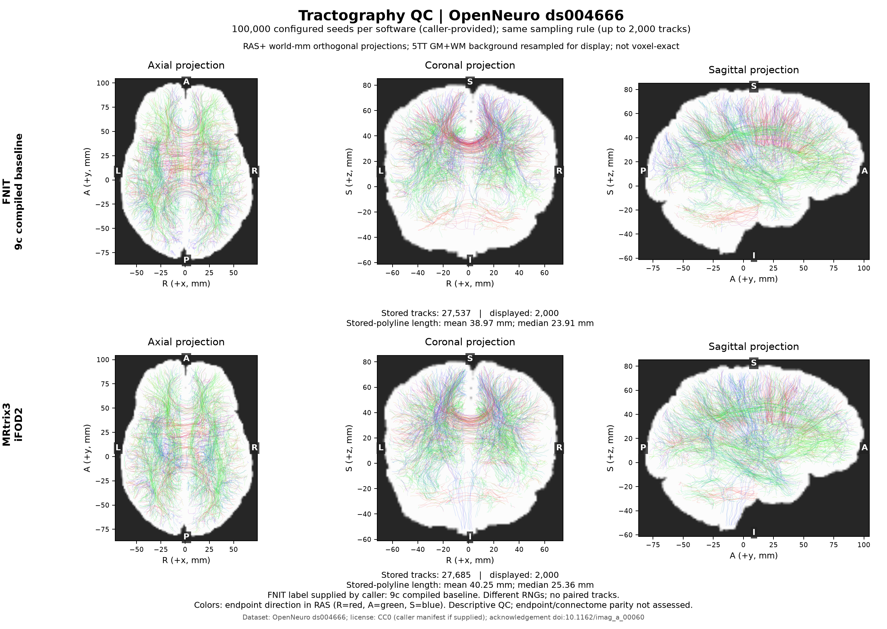

# Connectome 追踪：无损优化与同机实测

[完整 pipeline](README.md) · [追踪输入、全部参数和输出](TRACKING_OPERATORS.md) · [本轮结果](../../validation/connectome/tracking_exact_20261009/README.md)

## 1. 功能与策略

本轮优化从真实、已经归一化的 WM FOD 和 5TT/GMWMI 开始，到完整流线输出结束。保持原 iFOD2/ACT、随机数顺序、浮点精度、截断规则和输出结构。SIFT2、FA 采样及矩阵构造继续使用既有实现。

本轮正式实现将 5TT 八角点取值合并为一次 gather，并批量计算权重，保留原乘法分组和八次有序累加。拒绝采样继续使用已有的有序活动索引复用；ACT 保持原 eager 状态判断。ACT 状态编译作为独立实验记录，未加入默认实现。

~~~mermaid
flowchart LR
    INPUT[固定真实 FOD / 5TT / GMWMI] --> SEED[原播种与随机数序列]
    SEED --> ARC[原 iFOD2 圆弧与拒绝采样]
    ARC --> SAMPLE[合并八角点取值 原权重与有序累加]
    SAMPLE --> ACT[原 ACT 状态判断]
    ACT --> GROW[前向与反向推进 原截断与降采样]
    GROW --> OUT[完整路径、端点、长度与接受种子]
    OUT --> CHECK[新旧版逐字节核对 交错重复计时]
~~~

CPU/CUDA 的 ACT 均保留原表达式。compile_arc 仍只控制原有圆弧编译，默认 False；本轮比较分别在相同模式内进行。原有两种模式的输出本来就可能不同，本轮没有更改这个选项或把两种模式视为逐位等价。

## 2. Python 输入与输出

完整调用及每个参数见 [追踪算子页第 2 节](TRACKING_OPERATORS.md#2-python-调用输入与输出)。从已经保存的真实调用检查点重放：

~~~python
import torch
from fnit.connectome.tracking import probabilistic_tractography

tracking_device = torch.device("cuda:0")
tracking_inputs = torch.load(
    "tracking_inputs.pt", map_location="cpu", weights_only=True
)
tracking_options = dict(tracking_inputs["tracking_kwargs"])  # 包括原 five_tissue_spacing_mm
tractogram = probabilistic_tractography(
    wm_sh=tracking_inputs["wm_sh"].to(tracking_device),
    fod_affine=tracking_inputs["fod_affine"].to(tracking_device),
    five_tissue=tracking_inputs["five_tissue"].to(tracking_device),
    five_tissue_affine=tracking_inputs["five_tissue_affine"].to(tracking_device),
    gmwmi=tracking_inputs["gmwmi"].to(tracking_device),
    fa=None if tracking_inputs["fa"] is None else tracking_inputs["fa"].to(tracking_device),
    **tracking_options,
)
~~~

检查点保留原调用的张量、affine、header 间距和参数；不要通过 NIfTI 重写改变几何。也可以按算子页直接传入张量。

| 输入 | 格式与含义 |
| --- | --- |
| wm_sh | float32 [XF,YF,ZF,CSH]，归一化白质球谐 FOD；本例 lmax=8，CSH=45。 |
| fod_affine | float64 [4,4]，FOD 体素中心到 RAS 毫米坐标。 |
| five_tissue | float32 [XA,YA,ZA,5]；皮层灰质、皮层下灰质、白质、CSF、病理组织。 |
| five_tissue_affine | float64 [4,4]，5TT 到同一世界坐标。 |
| gmwmi | float32 [XA,YA,ZA]，与 5TT 网格一致的界面播种权重。 |
| five_tissue_spacing_mm | 5TT 原 header 三轴毫米间距。 |
| fa | 可选 float32 FOD 网格 FA；None 不计算接口的逐路径点采样均值。 |
| tracking_kwargs | 原种子数、seed、batch_size、arc_proposals、长度、步长、角度、cutoff、power、compile_arc 等参数。 |

输出 Tractogram 保留原结构：paths 为 N 条 [Pi,3] RAS 毫米路径的 tuple；endpoints 为 [N,2,3]；lengths_mm 为 [N]；accepted_seeds 为 [N,3]；mean_fa 为 [N] 或 None；seeds_attempted 为尝试数。后续算法无需改变。

## 3. 命令行与计时

pipeline 的标准 BIDS 命令见 [完整入口](README.md#3-命令行调用)。下列工具独立比较两份冻结 tracking 源码，使用 nibabel 读真实影像：

~~~bash
BASELINE_TRACKING=/data/frozen/tracking.py         # 已核对的旧版源码
CANDIDATE_TRACKING=/data/candidate/tracking.py     # 待验证源码
FOD_MODULE=/data/frozen/fod.py                    # 两版共用的 FOD / SH 实现
REAL_FOD=/data/inputs/fod_reference.nii.gz        # [X,Y,Z,45]
REAL_FIVE_TISSUE=/data/inputs/five_reference.nii.gz # [A,B,C,5]
REAL_GMWMI=/data/inputs/gmwmi_reference.nii.gz     # [A,B,C]
BENCHMARK_JSON=/data/results/tracking_exact.json
TRACK_OUTPUT_DIR=/data/results/tracks

python tools/benchmark_connectome_tracking_exact.py \
  --baseline-tracking "$BASELINE_TRACKING" \
  --candidate-tracking "$CANDIDATE_TRACKING" --fod-module "$FOD_MODULE" \
  --fod "$REAL_FOD" --five-tissue "$REAL_FIVE_TISSUE" --gmwmi "$REAL_GMWMI" \
  --n-seeds 100000 --batch-size 8192 --seed 0 --device cuda:0 \
  --warmup 1 --warmup-seeds 100000 --repeats 2 --memory-budget-gb 20 \
  --save-tck "$TRACK_OUTPUT_DIR" --output "$BENCHMARK_JSON"
~~~

| 参数 | 意义 |
| --- | --- |
| baseline-tracking / candidate-tracking / fod-module | 冻结的 Python 源码；SHA-256 实际绑定版本。 |
| fod / five-tissue / gmwmi | 上表真实 NIfTI；GMWMI 与 5TT 必须同 shape、同 affine。 |
| n-seeds / seed / batch-size | 尝试数、两版固定 RNG seed 和相同批量；本例 100000 / 0 / 8192。 |
| device | 单个 CPU/CUDA 设备；两版在同一张 GPU 交错运行。 |
| warmup / warmup-seeds | 每版预热次数及规模；本例完整 100k 预热。 |
| repeats | 配对轮数；2 为 AB、BA，完整预热后每版两个热样本。默认 3 为 AB、BA、AB。 |
| memory-budget-gb | 十进制 GB；Torch allocator 限为预算的 90%，本例 18 GB。 |
| save-tck / output | 可选逐次实际 TCK 输出目录及必需 JSON 报告。 |
| compile-arc | 同时启用两版原有圆弧编译；未给出时两版均关闭。 |
| cold | 额外单列首次完整调用；同进程共享 CUDA/FOD/编译缓存，不代表隔离的冷启动比较。 |
| profile / profile-seeds / profile-dir | 正式计时后单独采集候选 profiler、其播种数及 trace 目录；默认 128 seeds。 |
| baseline-commit / candidate-commit | 调用者已核对的版本标签；不替代源码 SHA 校验。 |

每次从同一 seed 重新执行完整追踪。tracking 时间包含函数内的路径整理与 metadata 同步；外部读盘、H2D、路径打包、最终 D2H、严格比较和 TCK 写盘分别计时。首次完整执行单列；小规模预热不能证明完整编译已结束。

工具检查 dtype、shape、torch.equal 与原始字节，包括所有路径、接受种子、端点、长度及提供时的 mean_fa；SHA 仅作为额外可追溯记录。allocated/reserved 是 Torch 峰值，不含 CUDA 上下文；报告另记录实际 GPU 状态，缺失监测保留缺失值。冻结工具的 GPU 快照列名 total_memory_mib 实际来自 memory.used 查询；本次公开汇总及现工具已纠正为 memory_used_mib。这只是记录字段错误，未影响追踪或 Torch 峰值；冻结 v5 SHA 对应 a1f41246 提交。

## 4. 对应官方命令

官方软件仅用于独立 benchmark；FNIT 计算路径不调用它。

~~~bash
MRTRIX_RNG_SEED=0 tckgen "$REAL_FOD" reference_seed0.tck \
  -algorithm iFOD2 -seed_gmwmi "$REAL_GMWMI" -act "$REAL_FIVE_TISSUE" \
  -seeds 100000 -select 0 -maxlength 250 -cutoff 0.1 \
  -samples 3 -power 0.5 -nthreads 8
~~~

[MRtrix tckgen 3.0.3 文档](https://mrtrix.readthedocs.io/en/3.0.3/reference/commands/tckgen.html)定义这些参数。select=0 按尝试数结束；不能把 100k seeds 解释成 100k 保留流线。

## 5. 真实输入结果与脑图

固定 OpenNeuro ds004666 输入，FOD [104,104,72,45]、5TT/GMWMI [256,256,256]。三份输入 SHA 见本轮 JSON；数据源的 [dataset description](https://raw.githubusercontent.com/OpenNeuroDatasets/ds004666/master/dataset_description.json)声明 CC0。参考为 MRtrix3 3.0.3-103-g026e850d、Xeon Gold 6430、8 线程；每个 FNIT 测试进程使用同机单张 H100、8 个 CPU 线程及 FP32/TF32。

MRtrix RNG seed 0/1/2 的完整 tckgen 墙钟为 16.188 / 16.032 / 16.286 秒，包含输入与 TCK 输出 I/O；分别保留 27685 / 27673 / 27693 条流线。统计从成功输出的 TCK 读取。[官方完整汇总](../../validation/connectome/tracking_exact_20261009/mrtrix_same_host.public.json)

完整 100k 预热后，每种模式在同一张 GPU 按 AB、BA 顺序测量；A 为 `9c118b7`，B 为本轮正式实现 `d4327049`。

| 100k seeds 模式 | 旧版两个热样本 / s | 新版两个热样本 / s | 热中位数：旧 → 新 / s | 观测耗时减少 |
| --- | --- | --- | --- | --- |
| 默认 `compile_arc=False` | 222.929 / 254.371 | 178.422 / 176.643 | 238.650 → 177.532 | 25.61% |
| 原有 `compile_arc=True` | 125.195 / 107.494 | 108.288 / 106.400 | 116.345 → 107.344 | 7.74% |

默认模式第一次完整调用为 223.474 → 207.125 秒；编译模式为 151.125 → 175.853 秒。它们单列为完整预热，包含当时的初始化/编译成本，同进程共享缓存，不作为隔离冷启动比较。默认组与编译组用了不同的单张 H100，只在各组内部比较。

两组各六次完整调用的输出 SHA 与 TCK SHA 均一致；四次可评估比较全部通过 dtype、shape、数值和原始字节检查。默认组保留 27411 条流线，编译组为 27537 条；两种模式之间没有逐位一致的承诺。FA 输入为 None，本轮未重新验证 FA 采样或 SC 矩阵。

默认组 Torch allocated/reserved 最大为 1.048/1.202 GB，编译组为 1.076/1.216 GB；这些数值不含 CUDA 上下文。GPU 回归 74 项全通过，CPU 回归 41 项通过、33 项因无 CUDA 跳过。全部样本、源码 SHA、输入 SHA、内存口径和未采用实验见[验证页](../../validation/connectome/tracking_exact_20261009/README.md)。

另一次完整默认模式 100k 显存审计包含初始化、H2D、完整追踪和 snapshot D2H：本进程采样峰值 3.127 GB，Torch allocated/reserved 1.048/1.227 GB，关键阶段采样无缺失/错误、最大间隔 0.503 秒，输出 SHA 相同。达到声明的采样 <20 GB gate，不证明采样间隔内的连续上界；该调用不加入速度表。[审计与复现](../../validation/connectome/tracking_exact_20261009/MEMORY_REPRODUCE.md)

共享节点上默认基线前后增加约 14%，编译基线下降约 14%；每版只有两个热样本，因此以上是本轮观测，不能承诺稳定的加速倍率。同机 MRtrix 完整命令约 16.17 秒，FNIT 已有编译模式追踪约 107.34 秒，仍有明显差距；两者 I/O 计时边界不同。本轮没有把历史 782–807 秒与当前值相除作为优化倍率，也没有更新原始 DWI 全流程精度结论。

### 瓶颈诊断

未采用的活动行校准候选在 128 个真实 GMWMI seed 上的独立 profiler 记录 440926 个实际 CUDA kernel，去重 kernel 时间合计 0.9047 秒，含 profiler 开销的完整追踪墙钟为 8.4598 秒。大量逐元素判断、索引、采样及主机调度仍是优化方向。未累计 CPU operator 的 inclusive device time，也未把注释 span 计作 kernel；这个诊断不能外推正常 100k 吞吐。[诊断记录](../../validation/connectome/tracking_exact_20261009/profile_eager_128.public.json)

### 输出示例

图取实际 FNIT 9c 编译基线与 MRtrix seed 0 TCK，各确定性抽样最多 2000 条。本轮新实现的编译组 TCK 与图中 FNIT 输入 SHA 相同，因此可复用该图，仍保留原生产者标签。5TT 重采样只用于离线显示。保存折线平均长度为 38.967 / 40.248 mm，中位数为 23.915 / 25.363 mm，KS 距离 0.019626；长度采用保存点间的距离之和，与内部积分长度分开。图、统计及[绘图复现](../../validation/connectome/tracking_exact_20261009/QC_REPRODUCE.md)不证明端点、SC 矩阵或原始 DWI 全流程已匹配。

## 6. 更新与未采用实验

| 版本 / 日期 | 记录 |
| --- | --- |
| d4327049 / 2026-10-09 | 合并 5TT 角点取值与权重；两种模式分别完成 100k 严格比较；74 项 GPU 回归通过。真实同机 MRtrix 三 seed、全量计时和 profiler 见本轮验证页。 |
| 9c118b7 | 拒绝采样保留有序 pending 索引；原随机数和 proposal 顺序不变。旧合成检查只作为回归。 |
| 2026-10-03 | SGM 退出截断按内部点弦方向评价 FOD；完整原始数据结果见[精度记录](ACCURACY_OPTIMIZATION_20261003.md)。 |
| 2026-10-02 | SH、采样布局和原 5TT 轴索引复用，见[前轮记录](TRACKING_OPERATORS.md#6-最近更新与-benchmark-记录)。 |

只校准活动行在真实 100k 热调用中 113.556 → 116.156 秒，虽输出一致但没有收益，未采用。只合并八角点 gather、仍逐角计算权重的候选，也没有稳定整体收益。共享 GPU 时段的慢样本和首次 CUDA 分配失败保留在实验记录，不从统计中删除。扩大 proposal 块、跳过反向传播或改变精度会改变输出，本轮没有采用。

依赖沿用主页 Conda 环境的 PyTorch、Triton、编译器、nibabel 和 NumPy；离线脑图使用既有 Matplotlib，未新增计算依赖。

## 7. 参考与原实现

- [MRtrix3 源码](https://github.com/MRtrix3/mrtrix3)、[tckgen 3.0.3](https://mrtrix.readthedocs.io/en/3.0.3/reference/commands/tckgen.html)。
- Tournier, Calamante & Connelly. Improved probabilistic streamlines tractography by 2nd order integration over fibre orientation distributions. ISMRM 2010, 1670.
- Smith et al. Anatomically-constrained tractography: improved diffusion MRI streamlines tractography through effective use of anatomical information. NeuroImage 62, 1924–1938 (2012). DOI: 10.1016/j.neuroimage.2012.06.005.
- Manzano-Patron et al. EDDEN 数据说明与引用：[Imaging Neuroscience 2024](https://doi.org/10.1162/imag_a_00060)。
