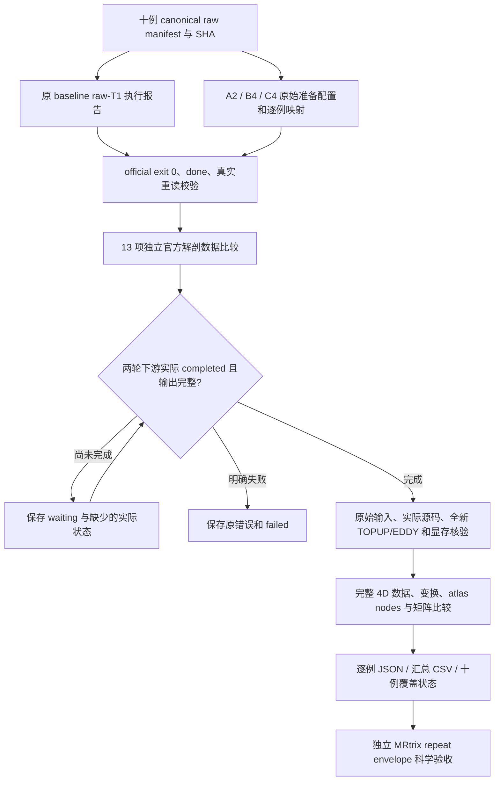

# 十例真实 raw connectome 的只读比较

## 1. 功能

`tools/reference/benchmark_connectome_cohort_compare.py` 比较两轮**实际完成**的输出。它只用 CPU 和 nibabel/NumPy 读文件，不导入 FNIT 或 torch，不启动 GPU、重建或预处理，不修改原源码、FreeSurfer 目录及原报告。

比较覆盖三层：

1. 原始输入与执行身份：十个不同受试者、每个原始文件的 SHA、冻结源码、实际 CLI、参数、完整执行状态与显存记录。
2. 独立官方 recon-all：每例 13 项指定体积、表面和 annotation。
3. 新 raw-DWI 下游：TOPUP、EDDY 输出、配准与标签、节点定义、四类矩阵、QC 和实际保存的计时。



`completed_actual_ten_case_comparison` 仅表示十例实际结果已被完整比较。矩阵是否落在 MRtrix 自身重复范围内，由独立 repeat-envelope 评测决定；本工具不要求 FNIT 比 MRtrix 更稳定，也不把比较完成等同于科学匹配。

## 2. Python 调用与输入、输出

### 单例独立官方解剖

```python
import json
from pathlib import Path
from tools.reference.compare_freesurfer_recon_outputs import compare_fresh_case

benchmark_root = Path("/shared/fnit-benchmark")
manifest = json.loads((benchmark_root / "formal_baseline_raw_v2/input_manifest.json").read_text())
selected_case = next(case for case in manifest["cases"] if case["case_id"] == "sub-CON01")

# baseline 原重建 official exit 0；单独的真实重读校验保留原失败报告。
result = compare_fresh_case(
    selected_case,
    baseline_root=benchmark_root / "formal_baseline_raw_v2",
    candidate_root=benchmark_root / "formal_candidate_raw_anatomy_prep_v1",
    baseline_validation_path=(benchmark_root / "formal_baseline_raw_v2/baseline/sub-CON01/recon_report.revalidated.json"),
)
print(result["all_requested_scientific_data_equal"])
```

`compare_fresh_case()` 的参数：

| 参数 | 输入含义 |
|---|---|
| `case` | 原 canonical manifest 的完整 case，含 `case_id`、`subject`、`t1w` 和 `input_files` 的实际路径、种类、SHA。 |
| `baseline_root` | 原 baseline raw-T1 namespace；其 `baseline/CASE/recon_report.json` 和独立 FreeSurfer 目录均必须实际存在。 |
| `candidate_root` | 本例所属的独立 candidate 官方准备 namespace；其 `candidate/CASE/anatomy_prep_report.json` 必须实际 completed。 |
| `baseline_validation_path` | 可选。原报告发生已知 int32 JSON 校验错误时，提供实际 completed 的独立 `recon_report.revalidated.json` 或共同基线的 `anatomy_origin.json`。不改原失败报告，不重跑 recon-all。 |

返回 `files` 中的 13 项实际结果，以及原始 T1 SHA、官方命令/版本/8 线程、报告 SHA 和原始计时。若读取失败、来源错误或原文件改变，直接失败。

### 十例控制器的输入

- `manifest`：固定十例不同 subjects；`dataset`、`snapshot`、`license`、`cases` 必须齐全。每例的 `input_files` 含绝对路径、`kind` 和 SHA-256。
- `prep-bindings`：明确的 `case → 原 prep_config/原 driver` 映射。A2 为 CON01/03，B4 为 CON04–07，C4 为 CON08–11。B 的四例 SSH 失败仍保留，不被改写成 C 的成功。
- `baseline-anatomy-root`：实际从 raw T1 完成官方重建的原 namespace。
- `baseline-root`、`candidate-root`：两轮独立 raw-DWI 下游 namespace。candidate 尚未开始时可以不存在；状态为 waiting。
- 两个 `driver status.json`：必须与各例不可变的 `gpu_report.json` 完全一致。global prep 因未派发或其他 case 失败，不抹掉真实 completed case。

### 输出结构

```text
root_actual_cohort_comparison_v2/
  status.json                              # 等待、失败、覆盖例数、实际来源 SHA
  cases.csv                                # 原子更新的逐例状态
  original_config_snapshot.*.bytes.json     # 原配置/映射/manifest 的原字节
  original_baseline_anatomy_config.bytes.json
  candidate_staged_config.original_bytes.json  # 仅实际文件出现后保存
  sub-CON01.official_anatomy.json           # 原报告、13 项解剖、数据与文件 SHA
  sub-CON01.connectome.json                # 实际下游比较；未完成时不生成
  ...
```

目录必须是新的，且与源码、输入、原输出及原 driver 目录没有包含关系。已有比较目录不能被重启覆盖；查询原 `status.json` 即可。配置/映射 SHA 改变、原来源伪装、缺输出、错受试者及原文件在比较期间变化均失败。

## 3. 命令行

```bash
benchmark_root=/shared/fnit-benchmark
benchmark_python=/shared/fnit-conda/bin/python
benchmark_helper="$benchmark_root/formal_actual_comparison_helper_v5/tools/reference"

# 从已完成 FS 及下游报告逐例读取；candidate 未启动时持续保存 waiting。
"$benchmark_python" "$benchmark_helper/benchmark_connectome_cohort_compare.py" \
  --manifest "$benchmark_root/formal_baseline_raw_v2/input_manifest.json" \
  --prep-bindings "$benchmark_root/formal_harness_staged_gpu_v2/candidate_prep_bindings.json" \
  --baseline-anatomy-root "$benchmark_root/formal_baseline_raw_v2" \
  --baseline-root "$benchmark_root/formal_baseline_common_v3_raw_rerun_v1" \
  --candidate-root "$benchmark_root/formal_candidate_raw_staged_v1" \
  --baseline-driver "$benchmark_root/formal_baseline_common_v3_raw_rerun_v1_driver/status.json" \
  --candidate-driver "$benchmark_root/formal_candidate_raw_staged_v1_driver/status.json" \
  --report-dir "$benchmark_root/root_actual_cohort_comparison_v2" \
  --prior-comparison-dir "$benchmark_root/root_actual_cohort_comparison_v1" \
  --poll-seconds 60 --timeout-hours 72
```

| 参数 | 说明 |
|---|---|
| 上述路径参数 | 均必需，均为明确的绝对路径；其数据含义见上一节。 |
| `--poll-seconds` | 默认 60，允许 1–60；实际状态观察间隔。 |
| `--timeout-hours` | 默认 72，允许 `(0,168]`；超时保存 `timed_out_waiting_actual_outputs`，不宣称完成。 |
| `--prior-comparison-dir` | 可选。仅在新的比较目录中显式绑定已结束的原 v1 `nonfinite scientific array` 读取失败及已完成解剖报告。重新核对原配置/输入和报告 SHA、真实科学数据；不改原失败，不复用任何 raw-DWI 预处理。正常首次比较省略。 |
| `--once` | 只做一次真实观察。退出码 0 可表示这次观察成功且状态仍 waiting；必须读取 `status.json`，不能据退出码称十例完成。 |

在比较目录创建 `STOP_OBSERVATION` 仅结束自己的只读观察；不停止任何原计算。没有 SSH、密码、license 内容或外部程序执行参数。

单例 FS CLI 使用 `compare_freesurfer_recon_outputs.py`，参数为 `--manifest`、`--case-id`、`--baseline-root`、`--candidate-prep-root`、可选 `--baseline-validation-report` 及新 `--report` 路径。

### 3.1 十例汇总表

`tools/reference/summarize_connectome_actual_cohort.py` 将**实际 completed 的只读比较报告**和当前实际输出 SHA 编成表格。它逐个验证科学报告、GPU/wall 完成状态、冻结源码和输出字节；不重新运行 pipeline，不查询或占用 GPU。新成对结果验证一次；十例都完成时，再重新核对所有输出字节。原始配置、A2/B4/C4 官方准备目录、源码和原报告目录均不能作为汇总输出目录。

```python
from pathlib import Path
from tools.reference.summarize_connectome_actual_cohort import build_summary, write_tables

comparison_directory = Path("/shared/fnit-benchmark/root_actual_cohort_comparison_v2")
summary_directory = Path("/shared/fnit-benchmark/my_new_summary")
summary_directory.mkdir(exist_ok=False)  # 每次建立新的只读汇总目录
summary = build_summary(comparison_directory, candidate_source_label="641f16b2")
write_tables(summary_directory, summary)
print(summary["completed_pairs"])  # 未完成的病例没有填入模拟结果
```

```bash
summary_helper="$benchmark_root/formal_actual_summary_helper_v4/tools/reference"
"$benchmark_python" "$summary_helper/summarize_connectome_actual_cohort.py" \
  --comparison-root "$benchmark_root/root_actual_cohort_comparison_v2" \
  --report-dir "$benchmark_root/root_actual_cohort_summary_v2" \
  --candidate-source-label 641f16b2 \
  --watch --poll-seconds 60 --timeout-hours 72
```

| 参数 | 含义 |
|---|---|
| `--comparison-root` | 必需，实际比较器的绝对目录；其 `status.json`、原 manifest、报告 SHA 与冻结 reader 必须匹配。 |
| `--report-dir` | 必需，新的绝对输出目录；已存在时拒绝，不覆盖历史汇总。 |
| `--candidate-source-label` | 可选，人工声明的冻结版本标签。标签不能替代真实 source fingerprint，不推测 archive 中不存在的 Git 元数据。 |
| `--watch` | 可选，持续等待实际成对结果；默认只观察一次。它不查询 live worker，`gpu_queued` 可能包含已运行的 worker。 |
| `--poll-seconds` | 默认 60，范围 1–60；观察间隔。 |
| `--timeout-hours` | 默认 72，范围 `(0,168]`；到期停止观察，仍未完成的结果保留 partial。 |

输出为原子更新的 `summary.json` 与 `cases.csv`、`matrices.csv`、`anatomy.csv`、`sources.csv`：

- `cases.csv` 固定 10 行：解剖/成对状态、count 严格相等性、真实官方重建与 raw-DWI CLI/worker/queue 时间。已经实际完成的单 arm 时间可先记录，矩阵结论仍待两 arm 的真实科学比较。
- `matrices.csv` 固定 320 行，即 10 例 × 8 atlas × 4 矩阵；未完成的 K、误差、相关、SHA 和结论为 null/空单元格，绝不写成 0。K 从每例 `nodes.tsv` 来，同病例两 arm 严格同序；不同病例 164/166 等不裁剪、不补齐。
- `anatomy.csv` 固定 130 行，即 10 例 × 13 项；整文件字节是否相同与科学数据是否相同分别记录。
- `sources.csv` 固定 20 行：实际核验的冻结文件 fingerprint 与声明版本标签分别列出。病例尚未完成时，实际 GPU/wall 证据为 null，不把已冻结的计划源码当作执行完成。
- `summary.json` 保留真实 4D/NaN/ULP 指标和完整 head/staged/queue/gap 时间 scope；不按文件 mtime 推断执行 UTC，也不把阶段时间相加冒充整链 wall。

`ready_for_ten_case_render` 只在 10 例真正比较完整后为 true，用于后续十例图表生成；它不是 MRtrix 科学验收。其余状态为 `partial_actual_comparison_tables` 或明确 failed。CSV 为固定表格结构，JSON 为原指标与时间的完整结构。该工具不执行官方程序，原软件数据和命令见下一节。

### 3.2 十例齐备后的真实脑图与最终导出

`tools/reference/export_connectome_actual_cohort.py` 等待上面的实际 summary，然后重新核对十例完整科学报告、源码与输出 SHA。只有 **10 对下游、10 例独立 FS、130 项解剖、320 个矩阵、20 份实际执行源码记录** 都齐全，才导出最终表和图。覆盖完整与逐值相等是分别记录的结果；工具也不会自行作 MRtrix repeat-envelope 验收。

```python
from pathlib import Path
from tools.reference.export_connectome_actual_cohort import export

comparison_directory = Path("/shared/fnit-benchmark/root_actual_cohort_comparison_v2")
final_directory = Path("/shared/fnit-benchmark/my_new_final_export")
final_directory.mkdir(exist_ok=False)  # Python 调用也要使用新目录
result = export(
    comparison_directory,
    final_directory,
    representatives=["sub-CON01", "sub-CON09"],
    atlas="fs-aparc",
    candidate_source_label="641f16b2",
)
print(result["completed_pairs"])  # 只有实际十例齐全时返回 10
```

```bash
plot_python=/shared/cpu-plot-python/bin/python
export_helper="$benchmark_root/formal_actual_comparison_helper_v8/tools/reference"
"$plot_python" "$export_helper/export_connectome_actual_cohort.py" \
  --comparison-root "$benchmark_root/root_actual_cohort_comparison_v2" \
  --summary-root "$benchmark_root/root_actual_cohort_summary_v2" \
  --report-dir "$benchmark_root/root_actual_cohort_final_export_v1" \
  --representative-cases sub-CON01 sub-CON09 \
  --figure-atlas fs-aparc \
  --candidate-source-label 641f16b2 \
  --watch --poll-seconds 60 --timeout-hours 72
```

| 参数 | 含义 |
|---|---|
| `--comparison-root` | 必需，实际十例科学比较目录。最终导出重新验证全部输出字节，不能用旧 partial 结论填齐。 |
| `--summary-root` | 必需，实际 summary 控制器目录；完整 summary 必须绑定同一个当前比较状态 SHA。 |
| `--report-dir` | 必需，全新绝对目录；拒绝与原数据、结果、源码、原 driver、summary 或比较目录重叠。 |
| `--representative-cases` | 默认 `sub-CON01 sub-CON09`，选择本轮真实病例作为脑图和矩阵示例；不能选择未完成病例或旧数据。 |
| `--figure-atlas` | 默认 `fs-aparc`；从本轮实际八套 atlas 选择一种展示，矩阵与节点保持该病例自己的 K。最终表仍覆盖全部八套。 |
| `--candidate-source-label` | 可选的人工版本标签，不替代实际 source fingerprint。 |
| `--watch` | 等待实际完整结果；未齐时只写 waiting，绝不先画十例最终图。 |
| `--poll-seconds` / `--timeout-hours` | 默认 60 / 72，分别允许 1–60 / `(0,168]`；停止观察不会停止任何原计算。 |

输出包括原四张最终 CSV、完整 `summary.json`、`actual_execution_order.csv`、`final_report.json`、每个代表病例的真实 FA/atlas 脑图与四类完整矩阵图，以及实际执行顺序/CLI 时间/队列等待/显存图。`status.json` 未齐为 `waiting_actual_ten_case_outputs`，成功为 `completed_actual_ten_case_export`；失败历史不覆盖。

脑图只对保存的 DWI grid 做方向轴置换/翻转，不插值、不重新配准，也不减少输入体素。FA NaN/Inf 保留并用洋红色标示；元数据记录其数量、实际空间和来源 SHA。原 FA、atlas、矩阵和输出文件保持原样。矩阵图使用同一病例、同一 atlas 的完整有序节点，逐矩阵共用颜色范围；绝对差值图只用于展示，数值结论来自完整比较表。

实际顺序由同一个 GPU host 上保存的 CLI start UTC 排序，保留真实先后；不把规划的 AB 顺序写成跑过。原 FS 命令、raw-DWI CLI、GPU command、worker、head/staged wall、等待和 gap 均单列。显存再次直接读取每份原 GPU 报告的 allocated、reserved、process-tree 峰值，并记录 NVML 计划采样间隔、实际最大间隔和样本数；图中的采样峰值不是连续上界。绘图为 CPU 文件读取，另计 export 时间；不计入 MRI pipeline 时间。

### 3.3 显式绑定独立的新 GPU 运行

`--gpu-origin-bindings` 只用于新的只读比较 namespace。它逐例声明实际输出来源，保留原状态和报告；不修改旧目录，不恢复旧预处理，也不降低显存门槛。绑定工具为 `tools/reference/connectome_actual_gpu_origins.py`。

```json
{
  "schema_version": 1,
  "scope": "explicit_actual_GPU_monitor_recovery",
  "bindings": [
    {
      "arm": "candidate",
      "case_id": "sub-CON04",
      "reason": "monitor_incomplete",
      "original": {
        "GPU_report": {"path": "/shared/old-run/candidate/sub-CON04/gpu_report.json", "sha256": "ACTUAL_SHA256"},
        "wall_report": {"path": "/shared/old-run/candidate/sub-CON04/raw_bids_wall.json", "sha256": "ACTUAL_SHA256"},
        "driver_snapshot": {"path": "/shared/preserved/old-driver.original-bytes.json", "sha256": "ACTUAL_SHA256"},
        "configuration": {"path": "/shared/old-run/staged_gpu_config.json", "sha256": "ACTUAL_SHA256"}
      },
      "replacement": {
        "root": "/shared/new-raw-run",
        "driver_status": "/shared/new-driver/status.json",
        "configuration": {"path": "/shared/new-raw-run/ACTUAL_CONFIG.json", "sha256": "ACTUAL_SHA256"},
        "runtime_preflight": {"path": "/shared/nvml-runtime/runtime_preflight.json", "sha256": "ACTUAL_SHA256"}
      }
    }
  ]
}
```

上例是路径/结构示例；所有 SHA 必须来自实际不可变文件，不能使用示例字符串运行。`arm` 为 `baseline` 或 `candidate`；每个 `(arm,case_id)` 只能出现一次。`original` 四项绑定原报告、原 driver 的完整原字节快照和原配置。`replacement` 明确新输出目录、新 driver、冻结新配置与真实 CPU 环境预检。新 GPU/CLI 报告必须实际 completed、输出完整，才能形成科学比较。

三类 `reason` 明确分开：

- `monitor_incomplete`：原实际计算 exit 0，但 `nvidia-smi` 的已知 3 秒 timeout 使监测不完整。原观察三峰值均须低于 20 GB，不能把已观测超限包装成监测修复。原科学输出及时间保留为独立历史；新 raw-DWI 重新完整执行 TOPUP、EDDY、tracking 和八套矩阵。
- `original_not_dispatched`：原 driver 已实际结束并暂停派发，该病例仍为未派发状态，原 GPU/wall 报告和 connectome 输出确实不存在。原 `GPU_report`、`wall_report` 为 null；不虚构旧计算、旧时间或失败。原 fresh recon-all 结果可作为同轮结构输入，新 raw-DWI 完整执行。
- `original_queue_stopped_before_compute`：原 worker 已真实等待 GPU lock，但在开始 raw-DWI 计算前被调度器的 `STOP_DISPATCH` 拦下。必须保留原实际 failed GPU 报告、原 worker/queue 时间；精确已知 stop 错误、未启动 CLI、无 wall/connectome 输出均需核对。原 `wall_report` 为 null，不能把原 failed GPU 报告删除或改成“不存在”。

新运行必须使用同一冻结 FNIT source、原输入 SHA、同轮真实 FS、atlas、seed、科学 CLI、线程、allocator 和共享 lock。允许明确的独立监控 venv；其原/新 Python 实际二进制、torch 与 NumPy C 扩展、nibabel 的文件路径/版本/SHA 必须一致，预检不初始化 CUDA。新的实际监测必须为直接 `pynvml`、无监测错误且 allocated/reserved/process-tree 三项均 `<20e9`。原 wall helper bytes 保持相同。新环境和等待间隔另列；不会用新的监测计时宣称与旧监测环境存在稳定整链加速。

原 baseline 未派发 GPU 的病例，从显式新 baseline 目录读取实际生成的 `recovery_binding.json`。其 `same_round_anatomy` 必须绑定原 raw-T1 `recon_report.json` 的路径和 SHA、真实重读的解剖 geometry、同一 fresh FS 目录，以及原配置和 terminal driver 的原字节 SHA。仍核对完整输入 SHA、官方 exit 0 并实际读取比较 13 项解剖；不会搜索未声明的其他目录，也不会自行生成校验报告。

选例恢复 worker 的实际 `recovery_origins.json` 还保留 `science_worker`、`recovery_worker` 和 `resources_manifest` 三个路径/SHA；`replacement.root` 是病例 job 目录，`driver_status` 是原字节路径/SHA。读取端核对实际配置中的 `run_root/arm/case_id` 后解析到该病例，保留原声明。只有 selected controller 真正结束且全部声明对应成功 worker，才冻结这份映射。`response.new_config/gpu_result/binding/eligibility` 分别与实际配置、GPU 报告、恢复证明、资格文件一致；新配置仅允许改 namespace、监控解释器、停止派发路径及资源清单，非监控资源记录不变。选例 driver 的 `full_ten_complete=False` 保留；十例完成由本只读比较器独立核验。

恢复计时只记录真实 `recovery_head_wall_seconds`、GPU worker/command/queue 和 CLI 时间。head 的单次 monotonic 时间包含 SSH 和恢复校验，独立于原官方 FS 时间；不跨节点相减，不合成连续 cold pipeline 总时间。GPU 节点内核对 CLI≤command≤worker、queue≤worker，原 failed worker/queue 记录仍单列。

```bash
recovery_helper="$benchmark_root/formal_actual_comparison_helper_v8/tools/reference"
# 以下为新运行实际就绪后的调用示例；当前尚未据此启动新比较。
"$benchmark_python" "$recovery_helper/benchmark_connectome_cohort_compare.py" \
  --manifest "$benchmark_root/formal_baseline_raw_v2/input_manifest.json" \
  --prep-bindings "$benchmark_root/formal_harness_staged_gpu_v2/candidate_prep_bindings.json" \
  --baseline-anatomy-root "$benchmark_root/formal_baseline_raw_v2" \
  --baseline-root "$benchmark_root/formal_baseline_common_v3_raw_rerun_v1" \
  --candidate-root "$benchmark_root/formal_candidate_raw_staged_v1" \
  --baseline-driver "$benchmark_root/formal_baseline_common_v3_raw_rerun_v1_driver/status.json" \
  --candidate-driver "$benchmark_root/formal_candidate_raw_staged_v1_driver/status.json" \
  --gpu-origin-bindings "$benchmark_root/recovery/actual_GPU_origin_bindings.json" \
  --prior-comparison-dir "$benchmark_root/root_actual_cohort_comparison_v2" \
  --report-dir "$benchmark_root/root_actual_cohort_comparison_v3" \
  --poll-seconds 60 --timeout-hours 72
```

`--prior-comparison-dir` 在该模式只绑定原已完成且重新核对的独立 FS 科学报告。只有原 v1 未定义值读取失败，或本次显式绑定病例的原显存资格失败，才允许继续独立观察；原失败、helper SHA 和旧输出仍保留。下游科学比较重新从显式的新实际路径读取，不把旧失败输出充作新合格结果。summary、final export 和图像均沿相同显式病例映射读取。

## 4. 比较内容与对应官方数据

原报告中的官方重建命令为：

```bash
recon-all -sd NEW_SUBJECTS_DIR -s SUBJECT_ID -i RAW_T1W.nii.gz -all -openmp 8
```

本比较器不执行此命令。

| 输出 | 精确比较 |
|---|---|
| `brain.mgz`、`aparc+aseg.mgz`、`ribbon.mgz` | dtype、shape、所有实际体素、浮点/整数原始二进制位、scanner RAS affine、surface RAS `vox2ras_tkr`、voxel size 和方向。 |
| `lh/rh.white`、`pial`、`sphere.reg` | 全部坐标与三角面、原始存储 payload、volume geometry。官方 `pial → pial.T1` 内部链接允许，跨 subject 链接或共享 inode 拒绝。 |
| `lh/rh.aparc.annot`、`aparc.a2009s.annot` | vertex-index labels、原始 annotation IDs、颜色表、名称原字节与顺序。 |
| `preproc/eddy/data.nii.gz` | 完整 4D 图像逐 frame 顺序读取，所有 voxel 都参与；不缩小空间或时间维。dtype、affine、qform/sform、units、scaling 同时记录。影像中的未定义值保留：NaN 位置/payload、正负 Inf 位置/符号逐 bit 核对；新增、丢失或 payload 变化明确失败。finite 交集数量、误差另列；矩阵 finite 门槛不变。 |
| rotated bvec、TOPUP fieldcoef/iout、acqparams | 实际数值与空间几何；GP seed 必须是两轮声明的真实种子。 |
| DWI→T1 world matrix、5TT、GMWMI、FA、mask、各 atlas label volume | 原数据与空间信息；T1→MNI transform 当前 CLI 没有独立保存时明确写 `not_serialized_by_current_CLI`。 |
| `nodes.tsv`、`region_labels.csv` | 行列节点语义、名称、原 label、半球、连续 index 和顺序完全一致；不按文件最大 label 猜节点。 |
| count matrix | 非负整数、finite、symmetric、node shape 及逐值严格一致性；保留有效 self-connections，不要求零对角线。 |
| SIFT2 FBC、mean length、mean FA | 所有值的严格 neq、RMSE、max error、relative L2、support 差异和相关性。 |

矩阵为文本 CSV，工具用 `numpy.loadtxt` 解析 float64；原 GPU tensor dtype 没有保存在 CSV 中时不作猜测。额外报告 float64 与明确重解析 float32 的 ULP 距离，用于区别末位差与较大统计差；ULP 小不能证明差异来自 atomic reduction，也不能单独代替 repeat-envelope 验收。所有主要误差计算仍针对原 CSV 数值。

JSON 记录实际 QC 和参数的逐项差异。wall 模式没有诊断 stage hooks，`stages={}` 时没有逐阶段 kernel 时间；只报告 EDDY 等实际持久化 QC 计时。原官方命令、worker、head queue、GPU lock、staged gap 和完整观察时间分别保留，不能把各阶段中位数相加冒充整例端到端 wall。

显存资格同时核对实际 process-tree、CUDA allocated、reserved 三个有限非负峰值，均须 `<20e9`；缺测量或监测错误不会被判定为通过。它记录现有采样测量资格，不声称连续数学上界。

## 5. 真实数据结果

截至 2026-10-02 19:28:45 UTC，ds001226 的 CON01、03、04、05、06、07、08 共 7 例已完成两轮独立 official FreeSurfer 8.2.0 / 8 线程的实际比较。每例原始 T1 SHA 相同，13 项指定科学输出全部严格一致；体素、坐标、三角面、annotation 和空间几何的 neq、RMSE、max error 为 0。

| 受试者 | 原 baseline `recon_command_seconds` | 独立 candidate 官方准备 |
|---|---:|---:|
| CON01 | 4797.502609 s | 4868.840658 s |
| CON03 | 4241.246759 s | 4334.311537 s |
| CON04 | 4030.821622 s | 3866.316537 s |
| CON05 | 4447.556511 s | 4402.242959 s |
| CON06 | 4418.653581 s | 4267.792084 s |
| CON07 | 4598.124663 s | 4596.250761 s |
| CON08 | 4025.258425 s | 3946.825329 s |

这些是原官方 CPU worker 的真实 monotonic 命令计时，包含完整官方重建；不包含后续 raw-DWI，不是 FNIT 优化加速。原 baseline 的 int32 JSON 校验失败和后续实际 completed revalidation 均保留。原两例私有 v2 CPU 读取比较共 8.866942 s；正式参考工具独立重读 CON01/03 分别为 4.557705 / 3.826523 s，其外围命令实际 wall 为 5.728657 / 4.503896 s。这些是文件比较时间，不能替代 MRI pipeline 时间。

原实际报告 SHA：`99a787c5abfb4c0151a90ebfe290a698af828fb0302a31b29474ed5c9b90642f`。额外字节布局审计 SHA：`212edeab415bce77d7dba8ccbf2f4a3ca2ca9b3533e6f13f031921863ec6bc0d`。`brain.mgz` 的头和 voxel payload 相同、尾部 metadata 不同；surface 的存储 float32 坐标/int32 faces 相同，creation comment 和尾部 metadata 不同。整文件 SHA 不作为科学相等条件。

首例两轮下游已于 2026-10-02 20:42:27 UTC 真正成对比较完成：CON01 8 套 atlas / 32 个 count、SIFT2 FBC、mean length、mean FA 矩阵全部逐值及 CSV 解析后的标量 bits 一致。所有误差和 ULP 为 0，节点语义与 atlas labels 一致；本例 K 依次为 84、84、164、376、414、216、554、1054。其它病例按自己的 `nodes.tsv` 定义 K，例如 166 不会被裁剪或补齐到 164。

完整 corrected DWI 的 56,401,920 个值、rotated bvec、DWI→T1 变换、TOPUP coef/iout/acqparams、5TT/GMWMI/mask 严格一致。FA 的 552,960 个值中，两轮各有同样的 36 个 NaN，位置和 payload bits 一致；其余 552,924 个有限值误差为 0，没有替换或删除体素。原比较 v1 在 finite 检查退出，原失败、helper SHA 和报告均保留；新 v2 只读比较显式绑定原 7 例真实解剖证据，重新比较首对下游。

| CON01 实际时间 | baseline | frozen candidate |
|---|---:|---:|
| raw-DWI CLI 完整导入/预处理/下游/写盘 | 641.204583 s | 1972.730601 s |
| 包围 Python 命令的 GPU-host wall | 648.433833 s | 1980.371871 s |
| 共享 GPU lock 等待 | 1055.699635 s | 2736.433029 s |

本例候选更慢，不能据组件优化称整链加速。原官方重建、head 修复/冻结等待间隔、GPU worker 和 lock queue 的真实计时分别保留，均不相加冒充连续冷启动 pipeline。

实际首对报告 SHA：`8d048aaaca76bf886dcb491979809f36f7382c926c30b9443b021d2875f94e6c`。执行源码 fingerprint：baseline `deefeb6908c3c14a9aa7b4cf154c8df941a56abffd4a4e893045a1c4d1ddfd4a`；candidate `9fd44cbc49c9cdfc16c9a8cff2971fec3239b450dce41222e6ef059861eb0dc7`。候选标签 `641f16b2` 不替代实际文件清单与模块 SHA 证据。

新控制器实际运行在 headcw `fnit-connectome-actual-comparison-v2`，新 namespace `root_actual_cohort_comparison_v2`。此时 7 例独立 FS 比较严格相同、1/10 成对下游完成、0 错误，余 9 例仍 waiting。`gpu_queued` 是调度器状态，可能包含已在计算的 worker；不能据它声称尚未启动。运行阶段以实际进程和保存报告为证，文件 mtime 不作为执行 UTC。

最新匿名化来源、数据/ULP、NaN 模式、真实计时和原失败绑定见 [`actual_cohort_comparison_v2_protocol.json`](../../validation/connectome/tenraw_20261002/actual_cohort_comparison_v2_protocol.json)。此前 7/10 FS、0/10 下游的时点快照 [`actual_cohort_comparison_protocol.json`](../../validation/connectome/tenraw_20261002/actual_cohort_comparison_protocol.json) 保留为历史记录。十例全完成前不扩展成十例匹配或整链加速结论。

后续真实汇总已读到第二例 CON03：其 32 个矩阵、nodes/atlas labels、完整影像/变换/bvec 同样严格一致，实际 raw-DWI CLI 为 baseline 632.673662 s、candidate 886.138825 s。两例共 64 个矩阵严格一致；独立官方解剖当前为 8/10 例严格一致，完整下游为 2/10，余 8 例 pending，仍无整链加速结论。

该时点 CPU 汇总观察器运行于 headcw `fnit-connectome-actual-summary-v2`，生成 10/320/130/20 行四张表；`ready_for_ten_case_render=false`。原 summary v1 的报告身份字段读取失败已保留，新 v2 只修正 path/SHA 与额外科学状态字段的验证，未修改任何原科学报告。该时点实际表格、两例科学指标/源码/时间和原失败 SHA 见 [`actual_cohort_summary_v2_protocol.json`](../../validation/connectome/tenraw_20261002/actual_cohort_summary_v2_protocol.json)。这不是最终十例 summary；未完成行不预填。

截至 2026-10-02 21:42:04 UTC，独立 FS 已真实比较 9/10 例，成对合格下游仍为 2/10。CON04 candidate 虽实际计算 exit 0、CLI 686.247340 s，但原监测 8 次 `nvidia-smi` timeout、最大实际间隔 13.793267 s；baseline CON05 原 CLI 1614.082525 s、2 次 timeout、最大间隔 4.527028 s。两份原 GPU 报告均为 `not_fully_measured`，不算满足显存资格。原 comparison v2 和 summary v2 已明确保存失败，最终脑图未生成。原失败/部分观察的公开快照见 [`actual_gpu_monitor_failure_protocol.json`](../../validation/connectome/tenraw_20261002/actual_gpu_monitor_failure_protocol.json)。

新的隔离 NVML 环境真实预检已核对 Python/科学模块的路径、版本及字节完全相同，原 wall helper SHA `a34f8ee9…` 不变。12 次预检采样、无错误、最大实际间隔 0.626365 s；该 CPU 预检不是 GPU science run，也不能作为 pipeline 显存通过证明。新实际运行须在独立目录完整执行并通过上述正常门槛，才纳入十例最终比较。

CON04 原预算不合格的实际科学输出另做完整 CPU 读取：32 矩阵、全部共享影像（包括完整 4D corrected DWI）和变换/bvec 数值仍严格一致，独立读取 wall 46.863494 s；该结果不替代原显存失败，也不计为合格第三对。科学读取报告 SHA `6b985abe820912d6590f2c629708260c06d5c56ad3d02c8ecec82da47642a127`，原 CLI 686.247340 s 与原监测失败均保留。

## 6. 更新与验证记录

- 私有 FS 比较 v1：过严地拒绝官方 subject 内 `pial` 链接，保存 failed，未修改原数据。
- 私有 v2：增加内部链接、原文件不变及实际 payload 审计；两例 26 项真实读取完成且科学输出严格相同。
- 本参考工具 v4：保留上述证据，增加十例 A2/B4/C4 原状态绑定、完整输出/来源守卫、4D 顺序全数据比较、矩阵/QC/计时报告及源码/driver/原输出目录隔离。headcw 原 FNIT conda 环境 45 项 CPU 测试全部通过，实际耗时 0.618 s、无跳过。tiny fixtures 仅验证程序守卫与读取逻辑，不作为 MRI benchmark。
- 十例只读观察 v1：7 例解剖实际比较完成；首对下游在 FA 的原 36 个 NaN 处因过严 finite 检查退出，保留原失败。
- 本参考工具 v5 / 只读观察 v2：影像允许精确相同的未定义模式和 payload；新增/丢失/不同 payload 失败，矩阵仍必须 finite。60 项 headcw CPU 测试全部通过，0.592 s；新 namespace 显式绑定原 7 例解剖报告，首例 32 个矩阵真实严格一致。
- 汇总观察 v1 / helper v3：首次真实读取因 FS identity 的额外科学状态字段使过严字典比较退出，原失败保存；科学比较 v2 的首对结果未改变。
- 汇总工具 / helper v4：身份核验按原 path+SHA，另核对实际科学状态字段。比较/汇总共 75 项 headcw CPU 测试全部通过，0.549 s；包含 missing→null、错误报告拒绝、164/166 病例维度、源码标签与 fingerprint 区分等守卫。测试 fixture 不是 MRI benchmark。
- 只读 helper v7：增加明确的三类原 GPU 来源、新监控环境字节守卫、最终十例完成/终止状态守卫、实际执行顺序/显存表和 CPU 真图输入读取。116 项 headcw CPU 测试全部通过，3.069 s、无跳过；实际 NVML preflight 与 CON01/03 两 arm 的保存 FA/atlas/矩阵读取通过，36/1 个 NaN 保留。原两个失败观察器、源码和输出均未修改；没有启动新比较或最终渲染。来源与测试快照见 [`actual_cohort_reader_v7_protocol.json`](../../validation/connectome/tenraw_20261002/actual_cohort_reader_v7_protocol.json)。
- 只读 helper v8：适配实际选例恢复 worker 的 job/config/driver/resource 绑定和 nested response，明确原 driver 与其原字节副本可有不同路径；CON11 只从声明的新 `recovery_binding.json` 核对原 FS 和真实重读证明。138 项 headcw CPU 测试全部通过，5.479 s、无跳过；两例真实图像输入再次读取通过，未生成最终图。原 terminal driver 和 CON05 queued STOP 的真实 failed 报告均保留，新选例运行及十例完整比较仍待实际完成。来源见 [`actual_cohort_reader_v8_protocol.json`](../../validation/connectome/tenraw_20261002/actual_cohort_reader_v8_protocol.json)。

## 7. 原实现与参考

- [FreeSurfer recon-all](https://surfer.nmr.mgh.harvard.edu/fswiki/recon-all)
- [FreeSurfer 源码](https://github.com/freesurfer/freesurfer)
- [nibabel FreeSurfer I/O](https://nipy.org/nibabel/reference/nibabel.freesurfer.html)
- [MRtrix3 structural connectome](https://mrtrix.readthedocs.io/en/latest/quantitative_structural_connectivity/structural_connectome.html)
- [原 UKB-connectomics](https://github.com/sina-mansour/UKB-connectomics)

Fischl B. FreeSurfer. *NeuroImage* 62, 774–781 (2012)。Tournier JD et al. MRtrix3: A fast, flexible and open software framework for medical image processing and visualisation. *NeuroImage* 202, 116137 (2019)。
