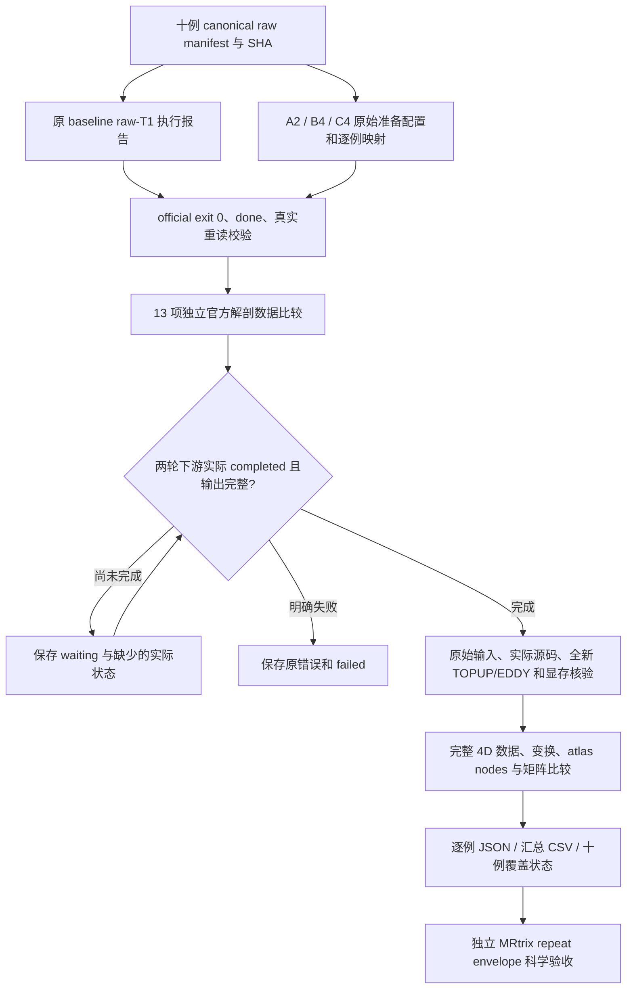

# 十例真实 raw connectome 的只读比较

## 1. 功能

`tools/reference/benchmark_connectome_cohort_compare.py` 比较两轮**实际完成**的输出。它只用 CPU 和 nibabel/NumPy 读文件，不导入 FNIT 或 torch，不启动 GPU、重建或预处理，不修改原源码、FreeSurfer 目录及原报告。

比较覆盖三层：

1. 原始输入与执行身份：十个不同受试者、每个原始文件的 SHA、冻结源码、实际 CLI、参数、完整执行状态与显存记录。
2. 独立官方 recon-all：每例 13 项指定体积、表面和 annotation。
3. 新 raw-DWI 下游：TOPUP、EDDY 输出、配准与标签、节点定义、四类矩阵、QC 和实际保存的计时。



`completed_actual_ten_case_comparison` 仅表示十例实际结果已被完整比较。矩阵是否落在 MRtrix 自身重复范围内，由独立 repeat-envelope 评测决定；本工具不要求 FNIT 比 MRtrix 更稳定，也不把比较完成等同于科学匹配。

## 2. Python 调用与输入、输出

### 单例独立官方解剖

```python
import json
from pathlib import Path
from tools.reference.compare_freesurfer_recon_outputs import compare_fresh_case

benchmark_root = Path("/shared/fnit-benchmark")
manifest = json.loads((benchmark_root / "formal_baseline_raw_v2/input_manifest.json").read_text())
selected_case = next(case for case in manifest["cases"] if case["case_id"] == "sub-CON01")

# baseline 原重建 official exit 0；单独的真实重读校验保留原失败报告。
result = compare_fresh_case(
    selected_case,
    baseline_root=benchmark_root / "formal_baseline_raw_v2",
    candidate_root=benchmark_root / "formal_candidate_raw_anatomy_prep_v1",
    baseline_validation_path=(benchmark_root / "formal_baseline_raw_v2/baseline/sub-CON01/recon_report.revalidated.json"),
)
print(result["all_requested_scientific_data_equal"])
```

`compare_fresh_case()` 的参数：

| 参数 | 输入含义 |
|---|---|
| `case` | 原 canonical manifest 的完整 case，含 `case_id`、`subject`、`t1w` 和 `input_files` 的实际路径、种类、SHA。 |
| `baseline_root` | 原 baseline raw-T1 namespace；其 `baseline/CASE/recon_report.json` 和独立 FreeSurfer 目录均必须实际存在。 |
| `candidate_root` | 本例所属的独立 candidate 官方准备 namespace；其 `candidate/CASE/anatomy_prep_report.json` 必须实际 completed。 |
| `baseline_validation_path` | 可选。原报告发生已知 int32 JSON 校验错误时，提供实际 completed 的独立 `recon_report.revalidated.json` 或共同基线的 `anatomy_origin.json`。不改原失败报告，不重跑 recon-all。 |

返回 `files` 中的 13 项实际结果，以及原始 T1 SHA、官方命令/版本/8 线程、报告 SHA 和原始计时。若读取失败、来源错误或原文件改变，直接失败。

### 十例控制器的输入

- `manifest`：固定十例不同 subjects；`dataset`、`snapshot`、`license`、`cases` 必须齐全。每例的 `input_files` 含绝对路径、`kind` 和 SHA-256。
- `prep-bindings`：明确的 `case → 原 prep_config/原 driver` 映射。A2 为 CON01/03，B4 为 CON04–07，C4 为 CON08–11。B 的四例 SSH 失败仍保留，不被改写成 C 的成功。
- `baseline-anatomy-root`：实际从 raw T1 完成官方重建的原 namespace。
- `baseline-root`、`candidate-root`：两轮独立 raw-DWI 下游 namespace。candidate 尚未开始时可以不存在；状态为 waiting。
- 两个 `driver status.json`：必须与各例不可变的 `gpu_report.json` 完全一致。global prep 因未派发或其他 case 失败，不抹掉真实 completed case。

### 输出结构

```text
root_actual_cohort_comparison_v1/
  status.json                              # 等待、失败、覆盖例数、实际来源 SHA
  cases.csv                                # 原子更新的逐例状态
  original_config_snapshot.*.bytes.json     # 原配置/映射/manifest 的原字节
  original_baseline_anatomy_config.bytes.json
  candidate_staged_config.original_bytes.json  # 仅实际文件出现后保存
  sub-CON01.official_anatomy.json           # 原报告、13 项解剖、数据与文件 SHA
  sub-CON01.connectome.json                # 实际下游比较；未完成时不生成
  ...
```

目录必须是新的，且与源码、输入、原输出及原 driver 目录没有包含关系。已有比较目录不能被重启覆盖；查询原 `status.json` 即可。配置/映射 SHA 改变、原来源伪装、缺输出、错受试者及原文件在比较期间变化均失败。

## 3. 命令行

```bash
benchmark_root=/shared/fnit-benchmark
benchmark_python=/shared/fnit-conda/bin/python
benchmark_helper="$benchmark_root/formal_actual_comparison_helper_v4/tools/reference"

# 从已完成 FS 及下游报告逐例读取；candidate 未启动时持续保存 waiting。
"$benchmark_python" "$benchmark_helper/benchmark_connectome_cohort_compare.py" \
  --manifest "$benchmark_root/formal_baseline_raw_v2/input_manifest.json" \
  --prep-bindings "$benchmark_root/formal_harness_staged_gpu_v2/candidate_prep_bindings.json" \
  --baseline-anatomy-root "$benchmark_root/formal_baseline_raw_v2" \
  --baseline-root "$benchmark_root/formal_baseline_common_v3_raw_rerun_v1" \
  --candidate-root "$benchmark_root/formal_candidate_raw_staged_v1" \
  --baseline-driver "$benchmark_root/formal_baseline_common_v3_raw_rerun_v1_driver/status.json" \
  --candidate-driver "$benchmark_root/formal_candidate_raw_staged_v1_driver/status.json" \
  --report-dir "$benchmark_root/root_actual_cohort_comparison_v1" \
  --poll-seconds 60 --timeout-hours 72
```

| 参数 | 说明 |
|---|---|
| 上述路径参数 | 均必需，均为明确的绝对路径；其数据含义见上一节。 |
| `--poll-seconds` | 默认 60，允许 1–60；实际状态观察间隔。 |
| `--timeout-hours` | 默认 72，允许 `(0,168]`；超时保存 `timed_out_waiting_actual_outputs`，不宣称完成。 |
| `--once` | 只做一次真实观察。退出码 0 可表示这次观察成功且状态仍 waiting；必须读取 `status.json`，不能据退出码称十例完成。 |

在比较目录创建 `STOP_OBSERVATION` 仅结束自己的只读观察；不停止任何原计算。没有 SSH、密码、license 内容或外部程序执行参数。

单例 FS CLI 使用 `compare_freesurfer_recon_outputs.py`，参数为 `--manifest`、`--case-id`、`--baseline-root`、`--candidate-prep-root`、可选 `--baseline-validation-report` 及新 `--report` 路径。

## 4. 比较内容与对应官方数据

原报告中的官方重建命令为：

```bash
recon-all -sd NEW_SUBJECTS_DIR -s SUBJECT_ID -i RAW_T1W.nii.gz -all -openmp 8
```

本比较器不执行此命令。

| 输出 | 精确比较 |
|---|---|
| `brain.mgz`、`aparc+aseg.mgz`、`ribbon.mgz` | dtype、shape、所有实际体素、浮点/整数原始二进制位、scanner RAS affine、surface RAS `vox2ras_tkr`、voxel size 和方向。 |
| `lh/rh.white`、`pial`、`sphere.reg` | 全部坐标与三角面、原始存储 payload、volume geometry。官方 `pial → pial.T1` 内部链接允许，跨 subject 链接或共享 inode 拒绝。 |
| `lh/rh.aparc.annot`、`aparc.a2009s.annot` | vertex-index labels、原始 annotation IDs、颜色表、名称原字节与顺序。 |
| `preproc/eddy/data.nii.gz` | 完整 4D 图像逐 frame 顺序读取，所有 voxel 都参与；不缩小空间或时间维。dtype、affine、qform/sform、units、scaling 同时记录。 |
| rotated bvec、TOPUP fieldcoef/iout、acqparams | 实际数值与空间几何；GP seed 必须是两轮声明的真实种子。 |
| DWI→T1 world matrix、5TT、GMWMI、FA、mask、各 atlas label volume | 原数据与空间信息；T1→MNI transform 当前 CLI 没有独立保存时明确写 `not_serialized_by_current_CLI`。 |
| `nodes.tsv`、`region_labels.csv` | 行列节点语义、名称、原 label、半球、连续 index 和顺序完全一致；不按文件最大 label 猜节点。 |
| count matrix | 非负整数、finite、symmetric、node shape 及逐值严格一致性；保留有效 self-connections，不要求零对角线。 |
| SIFT2 FBC、mean length、mean FA | 所有值的严格 neq、RMSE、max error、relative L2、support 差异和相关性。 |

矩阵为文本 CSV，工具用 `numpy.loadtxt` 解析 float64；原 GPU tensor dtype 没有保存在 CSV 中时不作猜测。额外报告 float64 与明确重解析 float32 的 ULP 距离，用于区别末位差与较大统计差；ULP 小不能证明差异来自 atomic reduction，也不能单独代替 repeat-envelope 验收。所有主要误差计算仍针对原 CSV 数值。

JSON 记录实际 QC 和参数的逐项差异。wall 模式没有诊断 stage hooks，`stages={}` 时没有逐阶段 kernel 时间；只报告 EDDY 等实际持久化 QC 计时。原官方命令、worker、head queue、GPU lock、staged gap 和完整观察时间分别保留，不能把各阶段中位数相加冒充整例端到端 wall。

显存资格同时核对实际 process-tree、CUDA allocated、reserved 三个有限非负峰值，均须 `<20e9`；缺测量或监测错误不会被判定为通过。它记录现有采样测量资格，不声称连续数学上界。

## 5. 真实数据结果

截至 2026-10-02 19:28:45 UTC，ds001226 的 CON01、03、04、05、06、07、08 共 7 例已完成两轮独立 official FreeSurfer 8.2.0 / 8 线程的实际比较。每例原始 T1 SHA 相同，13 项指定科学输出全部严格一致；体素、坐标、三角面、annotation 和空间几何的 neq、RMSE、max error 为 0。

| 受试者 | 原 baseline `recon_command_seconds` | 独立 candidate 官方准备 |
|---|---:|---:|
| CON01 | 4797.502609 s | 4868.840658 s |
| CON03 | 4241.246759 s | 4334.311537 s |
| CON04 | 4030.821622 s | 3866.316537 s |
| CON05 | 4447.556511 s | 4402.242959 s |
| CON06 | 4418.653581 s | 4267.792084 s |
| CON07 | 4598.124663 s | 4596.250761 s |
| CON08 | 4025.258425 s | 3946.825329 s |

这些是原官方 CPU worker 的真实 monotonic 命令计时，包含完整官方重建；不包含后续 raw-DWI，不是 FNIT 优化加速。原 baseline 的 int32 JSON 校验失败和后续实际 completed revalidation 均保留。原两例私有 v2 CPU 读取比较共 8.866942 s；正式参考工具独立重读 CON01/03 分别为 4.557705 / 3.826523 s，其外围命令实际 wall 为 5.728657 / 4.503896 s。这些是文件比较时间，不能替代 MRI pipeline 时间。

原实际报告 SHA：`99a787c5abfb4c0151a90ebfe290a698af828fb0302a31b29474ed5c9b90642f`。额外字节布局审计 SHA：`212edeab415bce77d7dba8ccbf2f4a3ca2ca9b3533e6f13f031921863ec6bc0d`。`brain.mgz` 的头和 voxel payload 相同、尾部 metadata 不同；surface 的存储 float32 坐标/int32 faces 相同，creation comment 和尾部 metadata 不同。整文件 SHA 不作为科学相等条件。

新只读控制器已在 headcw 的 `fnit-connectome-actual-comparison-v1` tmux 中实际运行。上述时刻为 7 例解剖比较完成、0 例下游成对比较完成、0 个比较错误，状态 `waiting_actual_outputs`：候选首例等待共享 GPU 锁，部分官方重建或下游输出仍未完成。冻结候选文件清单已实际重算，source fingerprint 为 `9fd44cbc49c9cdfc16c9a8cff2971fec3239b450dce41222e6ef059861eb0dc7`；这验证源码身份，不替代候选实际输出验收。

这仅支持 7 例所比较的解剖输入严格相等。十例 downstream 比较未完成时，状态保留 waiting；不能扩展成十例匹配或端到端加速结论。最新可发布的来源、真实报告 SHA 与状态快照见 [`actual_cohort_comparison_protocol.json`](../../validation/connectome/tenraw_20261002/actual_cohort_comparison_protocol.json)。原私有 v1 失败和 v2 真实报告均保留。

## 6. 更新与验证记录

- 私有 FS 比较 v1：过严地拒绝官方 subject 内 `pial` 链接，保存 failed，未修改原数据。
- 私有 v2：增加内部链接、原文件不变及实际 payload 审计；两例 26 项真实读取完成且科学输出严格相同。
- 本参考工具 v4：保留上述证据，增加十例 A2/B4/C4 原状态绑定、完整输出/来源守卫、4D 顺序全数据比较、矩阵/QC/计时报告及源码/driver/原输出目录隔离。headcw 原 FNIT conda 环境 45 项 CPU 测试全部通过，实际耗时 0.618 s、无跳过。tiny fixtures 仅验证程序守卫与读取逻辑，不作为 MRI benchmark。
- 十例只读观察 v1：新命名空间已启动，7 例独立官方解剖实际比较完成。完整下游仍等待真实结果；工具不会补造缺失矩阵、阶段时间或验收结论。

## 7. 原实现与参考

- [FreeSurfer recon-all](https://surfer.nmr.mgh.harvard.edu/fswiki/recon-all)
- [FreeSurfer 源码](https://github.com/freesurfer/freesurfer)
- [nibabel FreeSurfer I/O](https://nipy.org/nibabel/reference/nibabel.freesurfer.html)
- [MRtrix3 structural connectome](https://mrtrix.readthedocs.io/en/latest/quantitative_structural_connectivity/structural_connectome.html)
- [原 UKB-connectomics](https://github.com/sina-mansour/UKB-connectomics)

Fischl B. FreeSurfer. *NeuroImage* 62, 774–781 (2012)。Tournier JD et al. MRtrix3: A fast, flexible and open software framework for medical image processing and visualisation. *NeuroImage* 202, 116137 (2019)。
