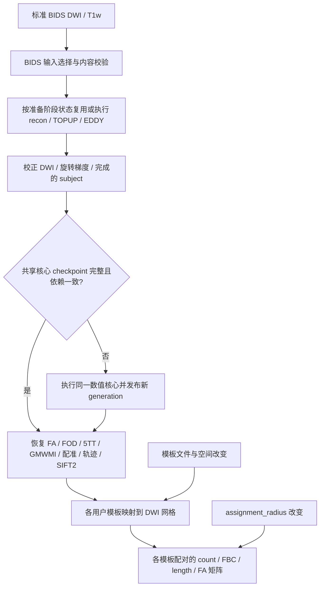

# Connectome 的阶段 checkpoint

## 1. 功能与策略

`UKBConnectome_pipeline` 将校正后 DWI 的共享重建结果保存到有内容校验的 checkpoint。更换用户模板时可以复用已完成的重建、追踪和 SIFT2。调整端点径向搜索半径时只影响矩阵；默认仍为 **4 mm**。统计定义、TF32 策略和张量 dtype 保持原实现。



目前共享核心是**一个完整阶段**：从 mean b0、mask 和 tensor FA 到 response、MSMT-CSD、mtnormalise、5TT/GMWMI、DWI→T1、ACT、SIFT2、precise FA sampling。某个核心输入变了，会重算整个核心。它不是每个子算子各自断点恢复。BIDS 准备阶段由其自己的状态管理；新用户模板映射和配对矩阵由 `paired_pipeline.py` 分别缓存。兼容的旧 `atlas_results` 仍在每次调用中构建，不冒充已跳过。

模板配对读取已经接受的全脑轨迹，再分配端点；模板文件不改变追踪预算、播种或 ACT 路径。跨被试比较时，每套模板提供固定 `nodes_tsv`，声明但未出现的节点保留零行/列。没有节点表的 volume 按实际非背景 ID 建轴，被试间缺失某个 ID 会改变矩阵尺寸或节点顺序；缓存复用不负责自动对齐这些轴。

## 2. Python、输入和输出

```python
from fnit.connectome import UKBConnectome_pipeline

pipeline = UKBConnectome_pipeline(device="cuda:0")
result = pipeline(
    dwi="corrected_dwi.nii.gz",             # 校正后 [X,Y,Z,N] DWI
    bvals="dwi.bval",                      # 每帧 b 值，s/mm²
    bvecs="eddy_rotated.bvec",              # FSL 3×N 或 N×3 旋转后梯度
    freesurfer_subject_dir="subjects/sub-01", # 完成的 recon-all 格式目录
    n_seeds=100000,                          # 全脑追踪尝试数
    seed=0,                                 # PyTorch 追踪随机种子
    checkpoint_dir="out/checkpoints",       # 直接调用明确启用；默认 None
    assignment_radius=4.0,                   # RAS mm；不属于共享核心依赖
    overwrite=False,                        # 验证成功时复用；True 发布新一代
)
print(result.cache_status)

# 原始 BIDS 入口默认使用 output_dir/checkpoints。
raw_result = pipeline.run_bids(
    bids_root="bids", output_dir="out/sub-01", subject="01", n_seeds=100000,
    freesurfer_subject_dir="subjects/sub-01", recon_backend="provided",
    seed=0,                                 # 追踪种子
    eddy_gp_seed=12345,                      # 独立的 EDDY GP 抽样种子
)
print(raw_result.preparation_stages)
```

`checkpoint_dir` 是专用缓存目录；未标记的非空旧目录会报错。`overwrite=True` 跳过复用，不删除旧 generation。直接调用默认 `None`，不读写 checkpoint；`run_bids` 默认 `output_dir/checkpoints`，可显式选择另一个目录。`recon_backend/recon_options` 原样传给 BIDS 准备器。

核心 key 包含：DWI、bval/bvec、T1 brain/aparc+aseg、所有显式 mask 和 FA 文件的路径/大小/**内容 SHA-256**，`n_seeds`、`seed`、`compile_arc`、`shell_bvals`、提供的 DWI→T1 变换、数值 revision、实际核心源码和数值资源、设备/软件版本/TF32/autocast/确定性/线程策略。mtime 不进入 key；同大小、同 mtime 改动仍会失效。模板、模板配对、MNI 模板变换和 `assignment_radius` 不进入核心 key。

模板映射 key 另包含自身标签/注释和 `nodes_tsv` 内容、空间、目标 DWI 网格与 DWI→T1 变换。MNI 分支另绑定实际 T1 reference 内容/网格和 warp，命中后也核对 target；自动 SynthMorph warp 的 key 绑定 MNI/T1 intensity 与权重。配对矩阵 key 依赖两张已映射模板和端点/长度/FA/权重及半径。保持文件内容和数值策略一致的 A→B→A 模板更换可重新命中 A 的已保存 generation。

恢复的 `ConnectomeResult` 保留全部旧字段，并增加：

| 字段 | 含义 |
|---|---|
| `cache_status.core` | 实际执行为 `completed`，实际恢复为 `skipped` |
| `cache_status.core_key` | 共享核心内容 key；禁用时为 `None` |
| `cache_status.events` | hit/miss/published 与损坏原因 |
| `cache_status.atlas` | 兼容旧 atlas 的实际构建状态 |
| `preparation_stages` | `run_bids` 返回的准备阶段状态；直接调用为 `None` |
| `pair_results` | 用户模板配对结果；未请求时为 `None` |

原始准备写入前会检查用户模板、T1、BIDS 原始文件和重建权重/资产/安装资源与本次写入目录的冲突。Python 与 CLI 均执行该检查；显式提供的校正 DWI 可从已完成的 preprocessing 目录只读复用。

### 原始 DWI 准备的完成 marker

`preproc/raw/state.json`、`preproc/topup/state.json` 和 `preproc/eddy/state.json` 使用独立的 schema 2 完成 marker。每个 marker 保存实际输入内容与选项、`status="completed"`，以及各必要产物的绝对路径、大小与 SHA-256。复用时重新验证全部必要产物；同大小、同 mtime 的内容改动也不会跳过。

| 准备阶段 | 必要产物 |
|---|---|
| staging | AP 图像/bval/bvec/JSON、BIDS 选择记录；有反向采集时还包括 PA 图像/bval/JSON |
| TOPUP | field coefficients、movement parameters、corrected b0 pair、acquisition parameters |
| EDDY | corrected DWI 与 rotated bvec |

EDDY 输入身份覆盖以上四种 TOPUP 必要产物：系数与运动参数供 EDDY 使用，corrected b0 pair 供脑 mask 准备，acquisition parameters 定义 PE/读出时间。不会仅因 coefficient 文件没变而漏掉其他输入的变化。

开始重做前，将旧完成 marker 保留为 `state.prior-<随机ID>.json`，移出可复用名称；失败不会发布新的成功 marker。求解成功后，重新检查输入身份、读齐产物并通过两次内容哈希和 stat 核对读取期间没有变化，最后通过唯一临时文件原子发布完成 marker。未完成、空产物、缺失、损坏或已编辑产物会重做该阶段；旧版没有输出哈希的 **raw/TOPUP/EDDY** marker 明确判为 miss，需要重新建立一次完成记录。由用户显式提供 `corrected_dwi` 与 `rotated_bvecs` 的分支仍为 supplied，不执行这三个准备阶段。

这是完成判断修复；TOPUP/EDDY 的参数、算法、dtype 和数值求解没有改变。旧命名 atlas CLI 的通用 fingerprint-only 完成合同保留，不能把新 raw stage 的产物完整性门解释为该旧矩阵缓存的额外保证。变更只更新当前代码，既有冻结 benchmark 源码及其 marker 不会改写。

FA/FOD/5TT/GMWMI、完整 affine、transform、mask、Double SIFT2 weights 都按原 dtype 保存。轨迹用 Float32 `points[P,3]` 与 Int64 `offsets[T+1]` 存储，恢复为原来的 `tuple[Tensor[Pi,3], ...]`，保留端点、长度、每轨迹 FA 和接受种子顺序。坐标仍为 DWI RAS mm。原来的 square 矩阵 count Int64，其余三种 Float32；默认对角线处理不变。

## 3. CLI

checkpoint 没有独立 CLI。主 pipeline 的入口仍是：

```bash
fnit UKBConnectome_pipeline \
  --bids-root bids --subject 01 \
  --freesurfer-subject-dir subjects/sub-01 --recon-backend provided \
  --n-seeds 100000 --seed 0 --device cuda:0 \
  --checkpoint-dir out/sub-01/checkpoints --output-dir out/sub-01
```

用户模板配对通过 `--template-pairs` 提供 JSON，详见 [模板输入与配对说明](template_pairs.md)。输出覆盖策略仍由主 CLI 管理。不要使用 `--overwrite` 来请求复用：这个参数明确要求重新计算。修改模板可直接用 Python API 复用共享 checkpoint，或由配对 CLI 的输出管理处理新矩阵。

## 4. 对应原软件阶段与安全机制

原软件对应 mean b0/BET、`dwi2mask legacy`、`dwi2tensor`/`tensor2metric`、`dwi2response dhollander`、`dwi2fod msmt_csd`、`mtnormalise`、`5ttgen freesurfer`、`5tt2gmwmi`、FLIRT、`tckgen`、`tcksift2` 和 `tcksample -precise`。checkpoint 是这些已完成数值结果的存储策略，没有官方对应的独立计算命令；它不会改写任何统计步骤或调用官方软件计算。

缓存只读取 JSON 和 `allow_pickle=False` 数值 NPY。每份 payload 验证文件大小、内容 SHA、shape、dtype；核心恢复进一步验证所有必要字段、轨迹 offset 和各体积网格形状。用户数据不通过 `torch.load` 或 pickle 执行。NaN/Inf 原值保留，FA 非有限诊断不会被填零或删除。

目录结构如下：

```text
checkpoints/
  shared/namespace.json
  shared/core/<key>/
    generation-<uuid>/
      *.npy
      manifest.json
    complete.json
  pairs/                       # 模板 / MNI→T1 / 配对矩阵的独立缓存
```

每次计算写独立 generation，所有文件完成并 fsync 后，最后原子发布 `complete.json`。发布前再核对原输入、源码和精度策略；加载前后也核对。缺文件、checksum/结构不符、没有完成 marker、半写或者写入失败的 generation 不会恢复。读取或写入 IO 失败、内存不足或输入在处理期间改变时会明确失败；不会静默换 dtype、删体素或回退算法。已经独立完成并发布的核心可在后续模板阶段失败后复用。

## 5. 本轮验证、耗时与脑图范围

gpucw1 的现有 Conda 环境，CUDA 隐藏、CPU 4 线程；[原始 CPU 回归报告](../../validation/connectome/paired_20261003/task_03/cpu_gate_v3.json) 与 [日志](../../validation/connectome/paired_20261003/task_03/focused_cpu_v3.log) 绑定实际源码 SHA，前后相同，CUDA 初始化前后均 `False`。

| 检查 | 实际结果 |
|---|---|
| 最终专用与兼容 CPU 回归 | 32 passed；pytest 内部 6.03 s，`pytest.main` 调用墙钟 6.232 s |
| 原共享数值核心的 AST 对照 | 与 `231dfaa1` 相同，仅 `self.device` 改为显式 `device` 后外移 scope |
| 完整 result / paths / dtype / NaN 恢复 | 逐值通过 |
| 修改模板文件 / 配对 / radius | 共享核心只执行一次，后续为 `skipped` |
| 同大小、同 mtime 编辑输入 / seed / transform / shell / revision / policy 改变 | 核心失效并重新执行 |
| 缺失、损坏、截断、半写、写入失败 | 拒绝复用，旧成功 generation 保留 |
| 独立只读代码审查 | 未报告本范围内可确认 bug；没有运行 GPU 或官方计算 |

该计时不包含 Python 导入、源码哈希读取和报告写入。这些是**模拟核心的缓存与编排测试**，真实 atlas 重采样和矩阵构建在 CPU 执行；不能解释为真实影像精度、端到端加速或 <20 GB 显存验收。该缓存子任务没有新增 GPU 测量、真实受试者或脑图。本轮真实配对 SC **10/10已完成**；冷/复用时间、模板输出脑图与完整性由[统一评测](../../validation/connectome/paired_pipeline_20261003/README.md)记录。该轮提供已有校正 DWI 和官方 anatomy，未重做 raw 前处理与 recon。

最新整合源码 `7ba73de2` 的整个 `tests/connectome` CPU 门槛为 **890 passed、29 skipped、362 subtests passed、1 warning，61.26 s**，CPU 4 线程、affinity4–7、CUDA 隐藏。464 个源码文件清单与服务器实测一致，[公开收据](../../validation/connectome/paired_pipeline_20261003/final_cpu_validation.public.json)绑定实际版本。冻结 GPU 评测仍用 `8bc337c4`；[科学调用/源码核对](../../validation/connectome/paired_pipeline_20261003/source_equivalence.public.json)将未改变的数值工作函数与新输入、完整性及缓存守卫分开，不把 CPU 门槛当作 GPU benchmark。

十例真实四阶段全部完成，共40次正常CLI调用、400个统计数组核对；首次 1111.52 s、同模板复用 18.83 s、换模板 13.21 s、改半径 19.28 s（逐例范围见报告）。30次核心恢复逐值一致、十例同模板对旧square builder一致；本进程采样峰值5.2995 GB，PyTorch allocated/reserved峰值2.9191/3.3848 GB。实际输出脑图、分步时间及源码绑定见[十例配对评测](../../validation/connectome/paired_pipeline_20261003/README.md)。该结果验证模板矩阵与缓存数值一致；独立MRtrix原始DWI→SC对照属于主说明中的历史精度轮。

## 6. 版本、部署与复现

实现提交：`0b12fa381de44ba66a5c10bb4214c6bec422f6d7`，起点 `231dfaa16f479c8f076a8ce38d4bfe690768217b`。最终 CPU 样本位于服务器统一入口 `FNIT/workspaces/connectome_paired_20261003_v1/task_03/cpu_source_v3`，报告在 `FNIT/runs/connectome_paired_20261003_v1/task_03`；原 Conda prefix 和旧科学冻结产物保持实际来源。

```bash
# 在任务 source 根目录执行；report.json 必须尚不存在。
CUDA_VISIBLE_DEVICES= OMP_NUM_THREADS=4 MKL_NUM_THREADS=4 \
OPENBLAS_NUM_THREADS=4 NUMEXPR_NUM_THREADS=4 PYTHONPATH=src \
python validation/connectome/paired_20261003/task_03/cpu_gate.py report.json
```

初次传输发现已登记的 task_03 实体尚未创建，scp/mkdir 失败；之后只在该新任务目录创建并部署，未修改旧路径或冻结源码。初版 30 passed（6.85 s），最终结构/发布守卫版 32 passed（9.35 s）；最终同源码带完整元数据再次核验为上表结果。原记录保留，不择优当作性能 benchmark。

原始准备缓存修复 `ac0e7d9d` / `22df4013` 另在已登记 task_03 的独立 `raw_stage_cache_cpu_v1/v2` 中做 CPU 回归。最终 **52 passed in 5.55 s**：新完整性测试20条、旧 BIDS/数值 revision/配对 CLI 测试32条；`pytest.main` 5.796755 s，完整驱动含导入与源码核对9.019503 s。线程4、affinity4–7、CUDA 隐藏且初始化前后 False，1215 个源码文件的聚合 SHA 前后相同。原 [v2 报告](../../validation/connectome/paired_20261003/task_03/raw_stage_cache/v2/focused_cpu_report.json)与[日志](../../validation/connectome/paired_20261003/task_03/raw_stage_cache/v2/focused_cpu.log)包含实际版本。

首轮 **50 passed / 2 failed** 的[v1 报告](../../validation/connectome/paired_20261003/task_03/raw_stage_cache/v1/focused_cpu_report.json)和[日志](../../validation/connectome/paired_20261003/task_03/raw_stage_cache/v1/focused_cpu.log)保留：共享文件系统的粗时间戳未检出读期间同大小修改，因此 v2 增加第二次内容哈希确认；另一个测试直接写入 staged symlink，连带编辑了原始模拟输入，v2 改为原子替换 staged 文件并检查原输入保持不变。没有放宽完整性门槛。TOPUP/EDDY/recon/staging 数值生产调用对 `72f1802f` 的[AST 核对](../../validation/connectome/paired_20261003/task_03/raw_stage_cache/producer_call_ast_review.json)全部相同；这是静态调用核对，不替代 MRI 精度验证。

本组测试使用模拟 MRI 与 stub 数值生产器，验证完成/复用/失败顺序和产物身份，不运行 TOPUP/EDDY/recon 求解，也不构成 GPU 或原软件 benchmark。两次产物哈希增加 CPU I/O，旧 raw marker 需要重建一次；真实冷/暖墙钟以绑定版本的 pipeline 评测为准。已有冻结十例源与产物未修改。

缓存会增加内容校验、磁盘容量和读取搬运开销；完整轨迹保存可能较大。当前实现没有自动清理旧 generation，也没有将核心拆成每个子函数恢复。性能结论需要真实流程计时。

## 7. 原代码与参考

- FNIT 实现：[pipeline.py](../../src/fnit/connectome/pipeline.py)、[checkpoints.py](../../src/fnit/connectome/checkpoints.py)。
- MRtrix 参考采用项目已绑定的 `3.0.3-103-g026e850d` 数值链；checkpoint 不改变该版本对照的验收范围。
- [UKB-connectomics 原工作流](https://github.com/sina-mansour/UKB-connectomics)。原软件命令和重复性结论见 [现有 connectome 说明](README.md)；缓存正确性与科学等效分开报告。
