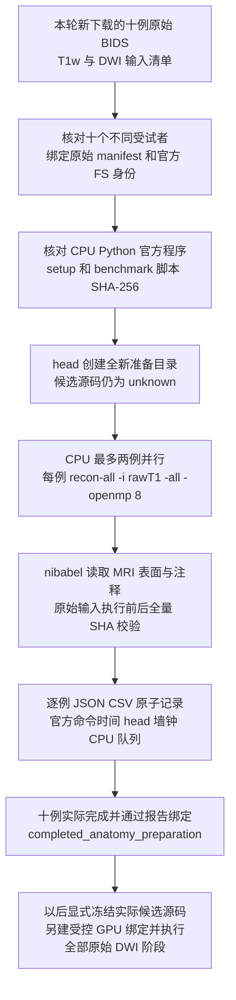

# 十例原始 T1 的独立官方解剖准备

## 1. 功能与流程

`tools/benchmark_connectome_anatomy_prep.py` 为本轮新下载的十例公开 BIDS 数据，分别从原始 T1w 完整执行官方 FreeSurfer `recon-all`。它复用现有 cohort 的官方重建命令、环境与 nibabel 产物检查。默认 CPU 同时运行两例，每例八线程。

这一步允许候选 FNIT 计算代码仍在开发。准备配置中没有 `sources`、`frozen_sources` 或候选源码路径；`candidate_source=unknown`。GPU 参数和 atlas 资源路径只保留为未来声明，不启动 DWI、GPU 任务或 GPU 锁。十例完成后的状态为 `completed_anatomy_preparation`，范围为 `staged_anatomy_preparation_only`，不是完整 connectome 的端到端结果。



每例都使用新的 `candidate/<case_id>/freesurfer/<subject_id>`。工具不复用或复制 baseline 的 FreeSurfer 结果，不支持中断恢复。既有目录即使为空也拒绝重用；失败文件保留用于追溯。`STOP_DISPATCH` 只停止新 CPU 派发，已启动的重建继续返回真实结果；线程池中最多有 `cpu_jobs` 个任务。

## 2. 输入、输出与 Python 调用

输入是原 formal driver 的 `status.json` 和其 `config.run_root/input_manifest.json`。manifest 必须声明本轮新下载，包含恰好十个不同受试者的原始 T1w/DWI、梯度、JSON 和数据集说明文件的路径与 SHA-256，格式与[整例 cohort 清单](raw_cohort_benchmark.md)相同。原 driver 必须记录成功创建新命名空间，原 CPU 配置为八线程。

官方安装的 executable、setup 和版本绑定到本轮已有的、退出码为零的官方原始 T1 重建报告。只读取这些身份记录，不使用该报告的分割或表面作为候选输入。原始 manifest、该身份报告、Python executable 和两个 benchmark 脚本的字节在准备期间持续校验。FreeSurfer license 只继承其已有路径，不写许可证内容或哈希。

```python
from pathlib import Path
from tools.benchmark_connectome_anatomy_prep import main

# 原 driver 和新目录均位于 head、CPU 主机可读取的共享存储。
original_driver_directory = Path("/shared/tenraw/original_driver")
fresh_anatomy_directory = Path("/shared/tenraw/candidate_anatomy_001")
fresh_preparation_report_directory = Path("/shared/tenraw/candidate_anatomy_driver_001")
# 本脚本与最新版 cohort 脚本应上传在同一共享目录。
shared_cohort_worker_script = Path("/shared/harness/benchmark_connectome_raw_cohort.py")

exit_code = main([
    "--origin-driver-report-dir", str(original_driver_directory),
    "--run-root", str(fresh_anatomy_directory),
    "--report-dir", str(fresh_preparation_report_directory),
    "--worker-script", str(shared_cohort_worker_script),
    "--cpu-jobs", "2", "--cpu-threads", "8",
])
```

| 参数 | 定义 |
| --- | --- |
| `--origin-driver-report-dir` | 原 formal driver 目录，含 `status.json`；仅从中派生原始输入、官方 CPU 安装和未来参数 |
| `--run-root` | 不存在的新共享目录；存放十例新官方重建、准备配置和原始 manifest 副本 |
| `--report-dir` | 不存在的新 driver 目录，不能与新 run 或旧 reconstruction 目录相互嵌套 |
| `--worker-script` | 新版共享 cohort 脚本的绝对路径；字节须与本准备脚本实际导入的 cohort 实现一致 |
| `--cpu-jobs` | 同时进行的官方重建数量，1 或 2，默认 2 |
| `--cpu-threads` | 每例线程数，固定 8 |
| `--poll-seconds` | head 检查完成任务与停止标记的间隔，1–60 秒，默认 5 秒 |

输出结构如下。`subject_id` 沿用 cohort 的 BIDS subject/session 组合。

```text
fresh_anatomy_directory/
  input_manifest.json                 原始输入清单副本
  anatomy_prep_config.json             仅官方准备配置与冻结文件身份
  candidate/<case_id>/
    freesurfer/<subject_id>/           新执行 recon-all 的完整原生结果
    recon-all.log                     本例真实官方命令日志
    recon_report.json                 cohort 官方 worker 原始结果
    anatomy_prep_report.json           本例准备结果及全部输入前后哈希

fresh_preparation_report_directory/
  status.json                         整体状态和逐例结果
  cases.csv                           逐例状态、墙钟和队列时间
  preflight.stderr.log                官方 CPU 版本预检的 SSH stderr
  candidate-<case_id>-recon.stderr.log 本例远程准备的 SSH stderr
```

`recon_command_seconds` 是 CPU 主机上实际官方命令的 monotonic 时间。`head_case_wall_seconds` 从 head 调用 CPU SSH 前开始，到返回并核对真实报告、全部输入和解剖文件后结束。`cpu_driver_queue_seconds` 单列准备队列等待。`head_preparation_wall_seconds` 是整个准备工具实际墙钟，包含配置、版本预检、两例并行、SSH、读写和校验；不能把它写成完整 DWI pipeline 时间。不同主机的 UTC 只保留各自原始记录，不相减代替 monotonic 计时。

每例 head 的 `start_utc` 在 CPU SSH 开始前原子写入 driver，运行中即可查看。计时错误保存在独立 `timing_error`，不覆盖已返回的真实准备结果或官方异常；十例实际成功但计时不完整时为 `completed_anatomy_preparation_with_timing_errors`，退出码为 1，不能视为计时验收完成。

## 3. 命令行调用

在已经登录 CPU 主机、具有长期 SSH ControlMaster 连接的 head 上运行：

```bash
python /shared/harness/benchmark_connectome_anatomy_prep.py \
  --origin-driver-report-dir /shared/tenraw/original_driver \
  --run-root /shared/tenraw/candidate_anatomy_001 \
  --report-dir /shared/tenraw/candidate_anatomy_driver_001 \
  --worker-script /shared/harness/benchmark_connectome_raw_cohort.py \
  --cpu-jobs 2 --cpu-threads 8
```

head 与 CPU worker 要使用 Python 3.10 或更新版本；实际 MRI 读取使用原配置指定、安装了 nibabel 的 Python。准备脚本不导入 FNIT 或创建 Conda 环境。停止后续派发可在报告目录创建 `STOP_DISPATCH`；中断后的再次运行应换全新目录。

## 4. 对应官方调用

工具设置原安装的 `FREESURFER_HOME`，source 官方 `SetUpFreeSurfer.sh`，在新 subject 目录执行：

```bash
recon-all \
  -i /shared/raw-bids/sub-01/anat/sub-01_T1w.nii.gz \
  -sd /shared/tenraw/candidate_anatomy_001/candidate/sub-01/freesurfer \
  -s sub-01 -all -openmp 8
```

命令数组保留原始路径为独立参数；路径中的空格、引号或 shell 字符不会拼入 shell 程序正文。`-i` 导入原始 T1、`-all` 运行完整官方重建，详见[FreeSurfer recon-all 手册](https://surfer.nmr.mgh.harvard.edu/fswiki/recon-all)。

## 5. 验证与当前结果

新增协议测试检查配置不含候选源码、十例清单、线程预算、原始/新目录隔离、命令参数、完整输入前后 SHA、真实产物报告绑定、停止派发和 monotonic 计时。测试的字节 fixture 不是 MRI，官方程序执行被 mock；这些测试不提供重建精度、真实运行时间或脑图结论。

真实十例重建结果由部署运行后的 `status.json`、各例官方报告和实际 MGZ/表面产物确定。只有十例新官方命令均成功、真实 nibabel 数据读取通过、输入和输出字节绑定完整，才标记准备完成。候选 GPU pipeline 以后还需显式冻结实际源码并重新执行全部原始 DWI 阶段；本工具不建立该后续绑定。

2026-10-03：相关 stdlib 协议测试 147 项通过，本工具含 23 项。新十例官方准备已在 nodecw10 开始，CON01、CON03 各使用全新目录和原始 T1w 执行 `recon-all -i ... -all -openmp 8`；实际官方版本为 `freesurfer-linux-centos7_x86_64-8.2.0-20260314-d932c45`。启动核查为两例运行、八例排队，候选 source 未知、GPU 未启动。该记录不是重建完成或完整 pipeline 精度/耗时结果，见[匿名化启动记录](../../validation/connectome/tenraw_20261002/anatomy_prep_protocol.json)。

## 6. 更新记录

- 2026-10-03：新增独立官方解剖准备；候选源码未知时可先运行十例新 recon-all。使用最多两个活动 Future，保留已启动任务，禁止复用既有结果。
- 协议测试和真实 benchmark 分开记录；部署后的真实墙钟、产物验证与脑图应引用本轮实际文件，不能以本工具的测试用时替代。

## 7. 原实现与参考

- [FNIT cohort 官方 reconstruction worker](../../tools/benchmark_connectome_raw_cohort.py)。
- [FreeSurfer recon-all 官方手册](https://surfer.nmr.mgh.harvard.edu/fswiki/recon-all)与[原软件代码库](https://github.com/freesurfer/freesurfer)。
- Dale AM, Fischl B, Sereno MI. Cortical surface-based analysis. I. Segmentation and surface reconstruction. *NeuroImage* 9, 179–194 (1999).
- Fischl B. FreeSurfer. *NeuroImage* 62, 774–781 (2012).
