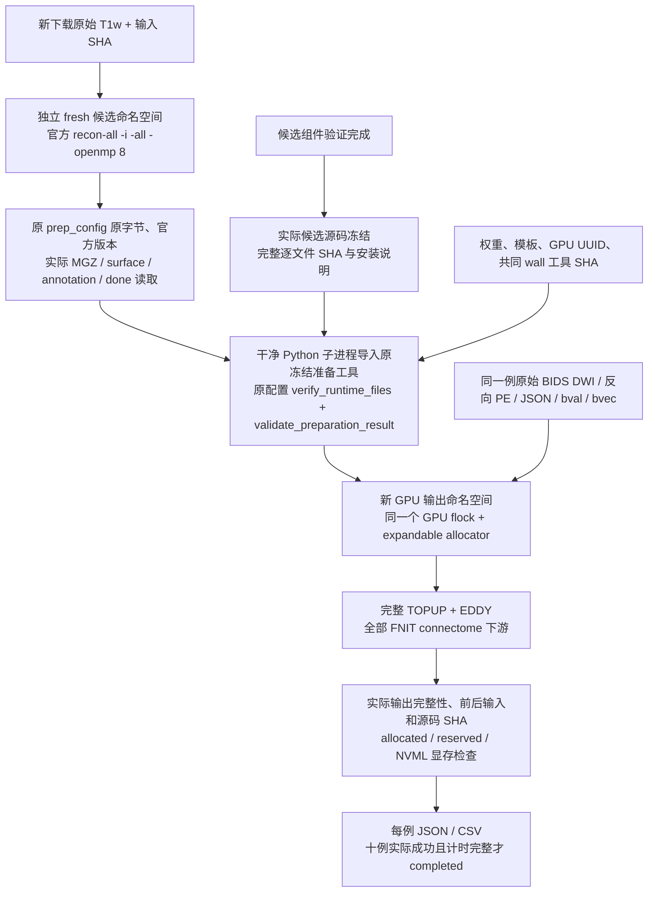

# 本轮原始 T1 解剖准备与候选 GPU 版本绑定

## 1. 功能和流程

`tools/benchmark_connectome_staged_gpu.py` 是正式十例评测的私有编排工具。先前已经在新的候选命名空间从原始 T1w 完整执行官方 `recon-all`；候选 FNIT 代码完成组件验证并实际冻结后，本工具把这批解剖结果与候选代码绑定。每例原始 DWI 都在新的输出目录完整执行 TOPUP、EDDY、配准、组织/FOD 建模、追踪、SIFT2 和各 atlas 的矩阵计算。

这属于**分阶段端到端评测**。官方解剖准备时的 `candidate_source="unknown"` 保持原样；后续记录真实候选源码身份。raw-BIDS CLI 的解剖状态为 `supplied`，因为官方 FreeSurfer 阶段由独立准备工具执行。二者的实际运行和等待间隔分别计时。



## 2. Python 调用和输入结构

```python
from tools.benchmark_connectome_staged_gpu import main

# 这些路径位于 headcw、nodecw10 和 gpucw1 共同可读的存储。
# candidate_gpu_config.json 必须由真实冻结的候选代码生成。
return_code = main([
    "--prep-config", "/shared/prepared/anatomy_prep_config.json",
    "--prep-driver-report-dir", "/shared/prepared_driver",
    "--gpu-config", "/shared/candidate_gpu_config.json",
    "--run-root", "/shared/new_candidate_raw_dwi",
    "--report-dir", "/shared/new_candidate_raw_dwi_driver",
])
```

### 必需输入

| 输入 | 含义和检查 |
|---|---|
| `prep-config` | 原准备输出目录中的 `anatomy_prep_config.json`。在新 driver 目录原字节保存，核对 SHA；不增加源码字段、不改原文件。 |
| `prep-driver-report-dir` | 原准备控制器的 `status.json`。只读；每例必须实际 `completed`、无 validation/timing error，并有真实准备结果和 head 起止计时。 |
| `prep-bindings` | 多批准备时替代前两个参数的 JSON；显式将每个 case 分配给一个原 config/driver，恰好覆盖完整十例。各批 canonical manifest 原字节 SHA、官方身份和未来参数相同。 |
| 准备目录中的 `input_manifest.json` | 正式十个不同 subjects；原始 T1/DWI 等输入路径、下载来源、许可与 SHA。原工具复核全部实际输入字节。 |
| 每例 `anatomy_prep_report.json` / `recon_report.json` | 必须来自本轮新的候选官方解剖目录，官方版本、命令、线程数和输入相同；所有解剖文件重新读取和核对。仅存在 `recon-all.done` 不能通过。 |
| `gpu-config` | JSON：候选实际源码路径及完整冻结清单、共同评测参数、GPU 和资源配置。配置文件自身 SHA 也冻结。见下表。 |
| `run-root` / `report-dir` | 两个分别不存在的新绝对目录；不允许包含、覆盖或复用原准备、原 driver、源码目录。重新启动必须选新的命名空间。 |

### `gpu-config` 字段

| 字段 | 要求 |
|---|---|
| `sources` | 只能为 `{"candidate": "/actual/frozen/candidate"}`；不借用 baseline 标签。 |
| `frozen_sources` | `{"candidate": source_manifest(实际候选目录)}`；路径、Git 元信息、全部 `source_sha256` 与 fingerprint 均核对。源码须包含 `environment.yml`、`pyproject.toml` 和实际核心文件。 |
| `candidate_ready` | 必须显式为 `true`；由总控制器在真实组件验收后声明，工具不会把待实现源码自动标为 ready。 |
| `atlases` | 与原准备 `atlases` 相同；每个名字产生自己的 count/FBC/length/FA 矩阵。 |
| `atlas_options` | 与原准备 `future_gpu_parameters` 相同的参数列表；模板、MNI、FSaverage、SynthMorph 路径不能偷偷替换。 |
| `n_seeds`、`seed`、`eddy_gp_seed` | 与原声明相同；本轮为 100000 attempted seeds、追踪 seed 0、EDDY GP seed 12345。GP seed 由共同 wall 工具注入。 |
| `gpu_host`、`gpu_port`、`gpu_control_path`、`gpu_python` | SSH 目标、可选端口/ControlMaster 路径、已有 Python 环境。使用参数列表和 `shlex.join`，不记录凭据。 |
| `device`、`cuda_visible_devices`、`gpu_uuid`、`gpu_cpu_threads`、`gpu_path_prefix` | 与原声明相同的设备、UUID、线程和 Workbench PATH。 |
| `gpu_lock` | `/tmp/fnit-recon-five-20261002-gongwk.gpu.lock`；与其他本轮 GPU 工作共用。只在 GPU 阶段拿锁。 |
| `cuda_alloc_conf` | `expandable_segments:True`，与共同基线相同。 |
| `fnit_weights` | 已验证权重目录；SynthStrip、SynthMorph 等实际文件大小/SHA 必须符合项目清单。 |
| `wall_script`、`wall_script_sha256` | 与共同基线相同的正式 wall 评测器及其真实 SHA；不得指向未经审核的新计时实现。 |
| `candidate_cli_arguments` | 可选，默认空列表。只允许 `--compile-arc` 或 `--tracking-batch-size 正整数`；后者还必须实际存在于候选 CLI。任何输入、精度、跳过预处理、覆盖输出参数都被拒绝。 |

创建候选 GPU 配置时，可复制原准备的 `future_gpu_parameters` 并补上原 `atlases`、真实源码冻结清单及上述必需字段。原准备配置仍保存原字节，不能将这份配置写回其中。

### 输出

- 新 `run-root/staged_gpu_config.json`、`input_manifest.json`：本轮绑定和新 raw-DWI namespace。
- 每例 `candidate/CASE/staged_anatomy_binding.json`：原准备配置、报告、实际文件与候选身份的绑定；没有复制旧 connectome 或预处理结果。
- 同目录 `gpu_report.json`、`raw_bids_wall.json`、日志、`staged_eligibility.json`：保留实际 GPU 退出状态、输出检查和显存资格。失败后不覆盖。
- `connectome/`：现有 pipeline 的实际完整输出，各 atlas 的四个矩阵及节点/label 信息等。
- 新 driver 目录 `status.json`、`cases.csv`、`resources.json`、原配置字节快照和日志：原子更新。未知、未完成、失败明确保留。

## 3. 命令行

在 headcw 的已认证连接中运行；下面的候选配置必须已经由总控制器真实冻结。工具实现交付时尚未启动此命令。

```bash
benchmark_root=/cwStorage/home/gongwk/Notebook_code/fnit_connectome_tenraw_20261002
benchmark_python=/cwStorage/home/gongwk/Notebook_code/fnit_conda_env_956b1a9/bin/python
benchmark_harness="$benchmark_root/formal_harness_staged_gpu_v1"

"$benchmark_python" "$benchmark_harness/benchmark_connectome_staged_gpu.py" \
  --prep-config "$benchmark_root/formal_candidate_raw_anatomy_prep_v1/anatomy_prep_config.json" \
  --prep-driver-report-dir "$benchmark_root/formal_candidate_raw_anatomy_prep_v1_driver" \
  --gpu-config "$benchmark_root/candidate_gpu_config.json" \
  --run-root "$benchmark_root/formal_candidate_raw_staged_v1" \
  --report-dir "$benchmark_root/formal_candidate_raw_staged_v1_driver"
```

| 其他参数 | 默认和作用 |
|---|---|
| `--preflight-only` | 实际检查源码、原准备工具、资源；生成新的 driver 报告，不启动 GPU 科学计算、不创建 raw-DWI 输出目录。正式运行另用新 driver 名称。 |
| `--poll-seconds` | 默认 30，范围 1–60；轮询尚在运行的官方准备报告。 |
| `--timeout-hours` | 默认 72，最多 168；超时停止新增 GPU 派发，正在执行的计算自然结束。 |

在新 driver 目录创建 `STOP_DISPATCH` 可停止下一例的 GPU 派发。它不修改原准备控制器、不终止当前科学计算。

### 两批独立准备的逐例来源

例如首两例由 v1 准备，余八例由 v2 准备：

```json
{
  "bindings": [
    {"prep_config": "/shared/candidate_anatomy_v1/anatomy_prep_config.json",
     "prep_driver_report_dir": "/shared/candidate_anatomy_v1_driver",
     "case_ids": ["sub-CON01", "sub-CON03"]},
    {"prep_config": "/shared/candidate_anatomy_v2/anatomy_prep_config.json",
     "prep_driver_report_dir": "/shared/candidate_anatomy_v2_driver",
     "case_ids": ["sub-CON04", "sub-CON05", "sub-CON06", "sub-CON07", "sub-CON08", "sub-CON09", "sub-CON10", "sub-CON11"]}
  ]
}
```

命令只需把单来源的 `--prep-config` 和 `--prep-driver-report-dir` 替换为 `--prep-bindings /shared/candidate_prep_bindings.json`。每份原配置逐字节保存，原 helper 分别导入，CLI 实际使用各 case 自己来源中的 FreeSurfer 目录。重复/缺例、不同原始输入、伪装官方身份、超出原明确准备子集和映射文件变更全部拒绝。GPU 输出依旧使用一个全新的 namespace。

各例的准备计时来自各自原 head 控制器，等待间隔保留原始 UTC 观察值；两批准备不被伪装成一次连续冷十例评测。

## 4. 官方步骤与实际调用

独立准备工具从原始 T1 执行本轮官方命令，原报告记录真实 executable、version、环境和每个路径：

```bash
recon-all -i raw_T1w.nii.gz -s subject_session -sd fresh_subjects_directory -all -openmp 8
```

GPU 阶段复用共同 wall runner：

```bash
python benchmark_connectome_raw_bids.py --mode wall --eddy-gp-seed 12345 \
  --gpu-uuid VERIFIED_UUID --report fresh/raw_bids_wall.json -- \
  UKBConnectome_pipeline --bids-root original_bids_root --subject SUBJECT \
  --freesurfer-subject-dir this_round_prepared_subject --output-dir fresh/connectome \
  --device cuda:0 --n-seeds 100000 --seed 0 --atlas ATLAS_NAMES
```

`topup` 和 `eddy` 必须实际 `completed`；解剖 `supplied`，且 CLI 选择的 subject、原始 DWI、元数据和解剖目录全部核对。GPU 下游使用 FNIT 现有实现；本工具不改变科学计算定义。

## 5. 计时、显存与比较范围

JSON/CSV 分别保存官方 `recon_command_seconds`、原准备 worker/head 的 monotonic wall、CPU 排队、raw-DWI CLI/head wall 和共享 GPU 锁排队。`staged_observed_utc_elapsed_seconds` 直接观察原 head 准备起点到本轮 head GPU/report 终点，包含代码冻结和排队等待；`prep_to_gpu_observed_utc_gap_seconds` 单列准备结束到 GPU 派发的间隔。UTC 观察值不被冒充为跨进程、跨主机连续 monotonic 计时，也不使用各阶段中位数相加合成整链耗时。

候选资格要求 GPU 真实 `completed`、实际输出完整、原始 DWI 全部重算，以及 allocated/reserved/NVML 测量都可用且严格小于 20,000,000,000 bytes。NVML 是采样峰值，完整字段和采样异常保留；缺测不会当作通过。实际成功执行结果先保存，资格或计时错误另列。

工具完成和科学精度通过是独立事项：`scientific_parity`、`speedup` 初始均为 `not_assessed`。十例输出与共同基线及官方重复性 envelope 的比较由总控制器完成。

本工具没有 MRI 性能实测结果或脑图；协议测试只验证配置、身份、目录与计时。实际十例精度/耗时及脑图应由后续真实运行报告补入主 pipeline 文档，不以协议夹具替代。

## 6. 更新记录与来源

- 2026-10-03：新增候选解剖准备与真实冻结源码绑定；原准备配置/工具字节不变；复用现有 cohort GPU worker、资源检查和 wall 评测器。默认普通 fresh cohort 路径保持原样。
- 同日：支持显式十例 case 到多个原准备来源映射；保留各配置原字节与独立计时，用于首两例和余八例的安全并行 CPU 调度。
- 准备阶段：[raw_anatomy_prep.md](raw_anatomy_prep.md)。共同基线受控重跑：[raw_cohort_controlled_rerun.md](raw_cohort_controlled_rerun.md)。
- 官方 FreeSurfer：[recon-all 文档](https://surfer.nmr.mgh.harvard.edu/fswiki/recon-all)、[官方代码库](https://github.com/freesurfer/freesurfer)。生产 pipeline 与各算法参考文献见项目 connectome 主说明，本工具只负责评测编排。
