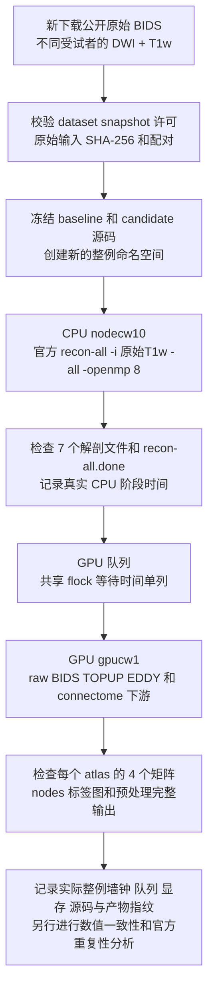

# 原始公开 DWI/T1w 十例整例评测编排

正常版本使用下面的 fresh cohort。针对本轮已记录的工具验证或资源配置失败，独立的[受控重新执行工具](raw_cohort_controlled_rerun.md)绑定本轮官方解剖结果、重新执行所有原始 DWI 阶段并完整保留旧失败；该计时不能当成连续 cold benchmark。

## 1. 功能和流程

`tools/benchmark_connectome_raw_cohort.py` 从**本轮新下载的公开原始 BIDS 数据**启动评测。在 CPU 主机运行官方 FreeSurfer `recon-all`，随后在 GPU 主机运行真实 `UKBConnectome_pipeline` 原始 DWI 入口。两台主机需能读取同一共享存储目录。驱动和 CPU/GPU worker 均使用 Python 3.10 或更新版本；系统 Python 3.6 不能运行本工具。此工具只编排执行、核对产物和记录计时，不实现 MRI 数值计算。

正式比较的 baseline、candidate 各使用独立空目录；每例、每版本都从原始 T1w 重新运行官方 recon-all，从原始 DWI 重新运行 TOPUP/EDDY 和完整下游。DWI CLI 接收到的 `--freesurfer-subject-dir` 是**该例该版本本轮刚生成的结果**，因此 DWI 子阶段显示 `recon_all=supplied`；整例编排仍包含真实官方 reconstruction。不能把 CLI 自身的计时写成包含外部 CPU reconstruction。



默认 CPU 同时运行 2 例，每例 8 线程；明确指定时可设为最多 4 例。GPU 子阶段串行并使用共同锁。等待 GPU 时不占用 CPU reconstruction 线程；GPU 锁不覆盖 recon-all。正式执行按受试者交替排入 baseline、candidate，减少版本顺序对比较的影响。

## 2. Python 调用、输入和输出

### 输入清单

manifest 是 UTF-8 JSON，包含以下字段。文件路径是 CPU/GPU 主机共享存储上的绝对路径，不能填写仅在驱动机器存在的路径。

| 字段 | 定义 |
| --- | --- |
| `dataset` | 公开数据集名称或 ID |
| `snapshot` | 本轮下载的固定数据版本 |
| `license` | 核对过的数据使用许可；不能放 FreeSurfer 许可证内容 |
| `source_url` | 数据集原作者或官方发布页 |
| `download_completed_utc` | 本轮新下载完成的 UTC 时间 |
| `downloaded_new` | 必须为布尔值 `true`；本字段是声明，原始 URL、下载日志和实际文件哈希仍需保留 |
| `cases` | 每个不同受试者一项；正式运行至少 10 项 |
| `cases[].case_id` | 本轮稳定的例号，如 `C01`；不能重复 |
| `cases[].subject` | 原始 BIDS subject 标签，可含 `sub-` 前缀；不能重复受试者充数 |
| `cases[].session/acquisition/direction/run` | 实际 DWI 选择条件；没有对应实体时省略或为 `null` |
| `cases[].bids_root` | 原始 BIDS 根目录 |
| `cases[].t1w` | 与 DWI 配对的原始 `*_T1w.nii[.gz]`；不能是 brain.mgz、T1brain 或既有分割 |
| `cases[].input_files` | 全部实际输入的 `path`、`sha256`、`kind`；SHA-256 是真实文件的 64 位十六进制值 |

每例必须声明 `raw_t1w`、`raw_dwi`、`bval`、`bvec`、`dwi_json`、`dataset_description`。有反向 PE 时还声明 `reverse_pe`（也接受 `reverse_dwi`）、`reverse_json`；原始反向 bval/bvec 存在时也纳入清单。继承的 JSON 应逐个列入。所有输入必须位于该原始 BIDS 根目录，不能来自 `derivatives`。工具在运行前校验实际字节；GPU 结束后再次校验，避免输入在执行期间改变。raw CLI 实际选择的 DWI、梯度和 JSON 必须与 manifest 的路径和哈希相符。

模板参数通过另一个 JSON 文件传入，例如：

```json
[
  "--atlas-templates-dir", "/shared/fnit-assets/atlases",
  "--fsaverage-dir", "/shared/freesurfer/subjects/fsaverage",
  "--mni-template", "/shared/fnit-assets/MNI152_T1_2mm.nii.gz",
  "--synthmorph-weights", "/shared/fnit-assets/synthmorph"
]
```

这些是路径格式示例，运行时填写已经核对许可和 SHA-256 的真实资产。Workbench 路径用 `--gpu-path-prefix /shared/workbench/bin` 传给编排工具，不作为 FNIT CLI atlas 资源选项。`--tian-fnirt-coeff` 与 `--mni-template` 二选一。配置只接受上述资源选项，不能插入 corrected DWI、既有 FA、`--overwrite` 或其他绕过计算的参数。

### Python 示例

```python
from pathlib import Path
from tools.benchmark_connectome_raw_cohort import main

# manifest 由下载和配对审核步骤生成；每个输入已记录实际 SHA-256。
cohort_manifest_path = Path("/shared/ten-new-raw/manifest.canonical.json")
# 两个源码目录在启动前冻结，之后不再修改其中计算代码。
baseline_source_directory = Path("/shared/fnit-sources/baseline")
candidate_source_directory = Path("/shared/fnit-sources/candidate")
# 每次正式重跑必须使用全新的 namespace 和 driver report 目录。
fresh_run_directory = Path("/shared/ten-new-raw/formal-run-001")
driver_report_directory = Path("/shared/ten-new-raw/driver-reports-001")
# CPU 可使用 3.10 或更新的系统 Python；GPU 必须使用已安装 FNIT 依赖的 Conda Python。
cpu_python_executable = "/shared/fnit-conda/bin/python"
gpu_python_executable = "/shared/fnit-conda/bin/python"
# 两个 benchmark 脚本上传到 CPU/GPU 都能读取的共享位置。
cohort_worker_script = "/shared/fnit-harness/benchmark_connectome_raw_cohort.py"
raw_bids_wall_script = "/shared/fnit-harness/benchmark_connectome_raw_bids.py"
# 只传许可证路径，脚本不读取或发布许可证正文及其哈希。
official_freesurfer_directory = "/shared/official-freesurfer"
official_license_path = "/shared/private/freesurfer-license.txt"

exit_code = main([
    "run", "--manifest", str(cohort_manifest_path),
    "--run-root", str(fresh_run_directory),
    "--report-dir", str(driver_report_directory),
    "--baseline-source", str(baseline_source_directory),
    "--candidate-source", str(candidate_source_directory),
    "--candidate-ready",  # 总控制在候选完成和审查后显式放开正式运行。
    "--cpu-host", "nodecw10", "--gpu-host", "gpucw1",
    "--cpu-python", cpu_python_executable, "--gpu-python", gpu_python_executable,
    "--worker-script", cohort_worker_script, "--wall-script", raw_bids_wall_script,
    "--freesurfer-home", official_freesurfer_directory,
    "--recon-all", official_freesurfer_directory + "/bin/recon-all",
    "--fs-license", official_license_path,
    "--atlas", "fs-aparc",  # 完整七模板比较时列出七个实际 atlas 并给资源配置。
    "--n-seeds", "100000", "--seed", "0", "--eddy-gp-seed", "12345",
])
raise SystemExit(exit_code)
```

示例路径需替换为实际部署路径；例号和 atlas 配置必须与本轮审核清单一致。只使用 `fs-aparc` 的结果不能写成“UKB 七组合均完成”。

### 输出结构

```text
fresh_run_directory/
  cohort_config.json
  input_manifest.json
  baseline/C01/
    freesurfer/sub-.../                 # 本轮官方 recon-all 实际生成
    recon-all.log
    recon_report.json
    raw_bids_wall.log
    raw_bids_wall.json                  # raw DWI CLI 实际计时和采样报告
    gpu_report.json
    connectome/
      preproc/raw/                      # 本轮实际选择和准备的原始输入
      preproc/topup/                    # 有反向 PE 时本轮实际求解
      preproc/eddy/                     # 本轮实际校正 DWI 和 rotated bvecs
      atlases/<atlas>/
        connectome_count.csv
        connectome_sift2_fbc.csv
        connectome_mean_length.csv
        connectome_mean_fa.csv
        atlas_dwi.nii.gz
        region_labels.csv
        nodes.tsv
      five_tissue_dwi_world.nii.gz
      gmwmi_dwi_world.nii.gz
      fa_dwi.nii.gz
      brain_mask_dwi.nii.gz
      dwi_to_t1_world.csv
      dataset_description.json
      run_state.json
  candidate/C01/                        # 完全独立的同输入新运行
  ...
driver_report_directory/
  status.json                           # 原子更新；整例状态、真实 timing、报告内容
  cases.csv                             # 原子更新；每例每版本计时摘要
  *-recon.stderr.log / *-gpu.stderr.log  # SSH/worker stderr，不含 MRI 数值替代
```

CPU 的 Conda 子进程通过 nibabel 真正读取 MGZ 全数组、surface 几何和所选 annotation，记录 scanner RAS affine、surface RAS 对应的 vox2ras_tkr、尺寸、标签和顶点/面数；核对 white/pial 有序 face 和顶点对应。另检查 anatomy 七文件和 `recon-all.done` 可读、每个 atlas 的矩阵/node 维度、有限值、对称性以及非负整数 count。FNIT 与本评测的官方命令都保留自连接，因此允许非零对角线。文件齐全和矩阵结构正确不等于科学结果通过。报告保留 `scientific_parity=not_assessed`，精度比较由独立验证步骤完成。

## 3. 命令行和全部参数

```bash
# 在持久 tmux 中启动；对应 SSH ControlMaster 已由用户完成认证。
python tools/benchmark_connectome_raw_cohort.py run \
  --manifest /shared/ten-new-raw/manifest.canonical.json \
  --run-root /shared/ten-new-raw/formal-run-001 \
  --report-dir /shared/ten-new-raw/driver-reports-001 \
  --baseline-source /shared/fnit-sources/baseline \
  --candidate-source /shared/fnit-sources/candidate --candidate-ready \
  --cpu-host nodecw10 --gpu-host gpucw1 \
  --cpu-control-path /tmp/authorized-nodecw10.sock \
  --gpu-control-path /tmp/authorized-gpucw1.sock \
  --cpu-python /usr/bin/python3 --gpu-python /shared/fnit-conda/bin/python \
  --worker-script /shared/fnit-harness/benchmark_connectome_raw_cohort.py \
  --wall-script /shared/fnit-harness/benchmark_connectome_raw_bids.py \
  --freesurfer-home /shared/official-freesurfer \
  --recon-all /shared/official-freesurfer/bin/recon-all \
  --fs-license /shared/private/freesurfer-license.txt \
  --cpu-jobs 2 --cpu-threads 8 --gpu-cpu-threads 8 \
  --n-seeds 100000 --seed 0 --eddy-gp-seed 12345 \
  --atlas fs-aparc aparc+tian-s1 aparc.a2009s+tian-s1 \
    glasser+tian-s1 glasser+tian-s4 schaefer200+tian-s1 \
    schaefer500+tian-s4 schaefer1000+tian-s4 \
  --atlas-config /shared/ten-new-raw/atlas-options.json

# 只读取保存的状态，不重启、重跑或恢复计算。
python tools/benchmark_connectome_raw_cohort.py status \
  --report-dir /shared/ten-new-raw/driver-reports-001
```

| 参数 | 默认值和含义 |
| --- | --- |
| `run / status` | 启动新评测 / 查询保存状态；查询不访问或刷新远端进程 |
| `--manifest` | `run` 必填；本轮公开原始数据 canonical manifest |
| `--run-root` | 必填；CPU/GPU 共享的新绝对输出目录；已有空目录也拒绝 |
| `--report-dir` | 必填；新驱动报告目录；`status` 则读取已有目录 |
| `--baseline-source / --candidate-source` | 远端实际源码目录；每个版本绑定 Git commit、dirty 状态和内容 SHA-256 |
| `--versions` | 默认 `baseline candidate`；可显式只运行一个版本，不表示已经完成比较 |
| `--candidate-ready` | 默认关闭；启动 candidate 的总控制门禁，候选实现期间不能误跑正式候选 |
| `--cases` | 可选正式子集，仍需至少 10 个不同受试者 |
| `--pilot` | 可选诊断例号，与 `--cases` 互斥；即使执行成功也标为 `diagnostic_subset` |
| `--cpu-host / --gpu-host` | 默认 `nodecw10 / gpucw1`；可写 `user@host` |
| `--cpu-control-path / --gpu-control-path` | 可选持久 SSH socket；不硬编码凭据或另建交互密码流程 |
| `--cpu-port / --gpu-port` | 可选各主机 SSH 端口；未给则使用 SSH 配置默认值 |
| `--cpu-python / --gpu-python` | 必填远端绝对 Python 路径；GPU Python 须含已核对的 FNIT Conda 依赖 |
| `--anatomy-validation-python` | 可选 CPU 主机上含 nibabel/numpy 的 Python；默认复用共享存储的 `--gpu-python`，仅做真实解剖读取和完整性校验 |
| `--worker-script / --wall-script` | 必填共享脚本绝对路径；源码哈希绑定启动版本，脚本执行期间变化则失败 |
| `--freesurfer-home / --recon-all` | 必填官方安装目录和目录内官方 executable；先核对版本并加载其 `SetUpFreeSurfer.sh` |
| `--fs-license` | 可选许可证绝对路径；不提供则读取已有 `FS_LICENSE` 或官方默认位置；只记录可读性 |
| `--cpu-jobs` | 默认 2，允许 1–4；CPU 同时运行的整例 recon 数 |
| `--cpu-threads` | 默认 8；recon-all `-openmp` 和相关 CPU 线程环境 |
| `--gpu-cpu-threads` | 默认 8；GPU 阶段的 CPU/BLAS 线程环境 |
| `--gpu-lock` | 默认 `/tmp/fnit-recon-five-20261002-gongwk.gpu.lock`；与已有评测共享远端 GPU 锁 |
| `--gpu-uuid` | 可选实际物理 GPU UUID；建议填写本轮核对值，供进程树显存监测 |
| `--cuda-visible-devices` | 可选 GPU 可见设备映射；记录实际传入值 |
| `--gpu-path-prefix` | 可重复指定绝对目录，在 GPU worker 的 PATH 前加入；Glasser 所需 `wb_command` 目录须明确传入。记录实际 PATH 和 executable SHA-256 |
| `--fnit-weights` | 可选本地 checkpoint 目录，显式写入 GPU worker `FNIT_WEIGHTS`；完整 raw DWI 使用 SynthStrip，必须确认其权重能实际解析 |
| `--cuda-alloc-conf` | 可选 `expandable_segments:True`，显式写入 GPU 环境并记录；baseline 和 candidate 保持相同配置 |
| `--device` | 默认 `cuda:0`；本工具正式评测只接受 CUDA |
| `--n-seeds` | 默认 100000；正式运行不少于该数，较小计数只允许 `--pilot`；不减少体素或连接计算 |
| `--seed` | 默认 0；tracking seed |
| `--eddy-gp-seed` | 默认 12345，范围 1–2³²−1；独立于 tracking seed；传给 wall runner，使旧 baseline API 也可使用相同明确种子 |
| `--atlas` | 默认 `fs-aparc`；一个或多个不同 atlas，实际矩阵按名称输出 |
| `--atlas-config` | 可选模板资源 option/value JSON；仅允许 atlas 资产路径，不允许预处理 bypass 或覆盖开关 |

可先用 `--versions baseline` 启动十例 baseline，此时不需要 `--candidate-ready` 或候选目录；候选完成后在另一个新 namespace 使用 `--versions candidate --candidate-ready`。两批结果由总控制按相同输入哈希和参数聚合，单批报告自身不会宣称两版本比较已齐全。

驱动进程意外退出后，不用原 namespace 重跑，不把旧产物自动接续为 fresh benchmark。查询报告会明确显示保存状态可能滞后；需要重新计时则创建新 namespace。受试者内部状态可能是 `cpu_queued`、`recon_running`、`gpu_queued`、`gpu_running_or_remote_lock_queue`、`completed`、`failed`。

本轮已定位的 MGZ 维度 `numpy.int32` JSON 序列化故障有独立的[工具验证修复流程](raw_cohort_recovery.md)：仅在官方 recon-all 已真实退出 0、原始输入和本轮产物哈希不变时重新读取 anatomy，保留原失败，随后完整运行尚未开始的 raw DWI。修复结果单列中断和恢复计时，不改变普通 cohort 的 fresh 规则，也不称无中断 cold benchmark。

## 4. 官方命令和计时边界

CPU reconstruction 实际执行：

```bash
recon-all -sd FRESH_CASE_DIRECTORY/freesurfer \
  -s sub-SUBJECT_ses-SESSION -i RAW_T1W_NIFTI \
  -all -openmp 8
```

GPU 下游实际执行：

```bash
python benchmark_connectome_raw_bids.py \
  --mode wall --eddy-gp-seed 12345 --report raw_bids_wall.json -- \
  UKBConnectome_pipeline --bids-root RAW_BIDS_ROOT --subject SUBJECT \
  --session SESSION --freesurfer-subject-dir THIS_RUN_NEW_OFFICIAL_FS_SUBJECT \
  --output-dir FRESH_CASE_DIRECTORY/connectome --device cuda:0 \
  --n-seeds 100000 --seed 0 --atlas fs-aparc
```

其余原软件数值对照由隔离 reference runner 执行，不能把 FSL/MRtrix 的结果作为 FNIT 生产中间输入。原始 UKB-connectomics 脚本从已校正 DWI 开始，因此它不提供上述 BIDS 原始前处理和两节点编排命令。各科学步骤的原命令见[connectome 主说明](README.md)。

| 字段 | 实际测量范围 |
| --- | --- |
| `recon_command_seconds` | 官方环境加载和官方 recon-all 命令的实际墙钟 |
| `raw_dwi_cli_total_runtime_seconds` | raw wall runner 的 FNIT/Torch 导入、DWI 前处理、下游和正常 CLI 写盘；不含外部 recon-all、GPU 等待和事后报告哈希 |
| `gpu_lock_queue_seconds` | GPU 主机等待共享 `flock` 的实际时间 |
| `gpu_driver_queue_seconds` | CPU 结果返回后，GPU 工作进入远端启动前的驱动排队 |
| `parent_full_wall_seconds` | 同一驱动进程从该例官方 recon-all SSH 启动前，到真实 GPU 下游完成、输出检查、报告传回；含导入、读写、输入/源码校验及 GPU 队列 |
| `parent_full_wall_excluding_gpu_queue_seconds` | 上述实际 parent timer 减去两项已测 GPU 队列；不是阶段中位数相加 |
| `cpu_driver_queue_seconds` | 该例开始执行前等待 CPU 调度的时间，单独列出，尚未进入 parent 整例计时 |
| `cohort_makespan_seconds` | 整个 cohort 的实测历时，包括各例 CPU/GPU 排队、校验和写报告 |

不能将各阶段均值/中位数相加冒充实际整例墙钟，也不能把 `completed_execution` 写成精度通过。至少 10 个不同受试者在**两个版本**都完整完成，`comparison_ready` 才为 `true`；该字段只表示可以开始分析这些实测结果。

## 5. 精度、运行时间和脑图

本轮新下载 ds001226 的十例原始 AP/PA/T1 已完成两版真实运行、比较和导出。320 张矩阵与 130 项独立 FreeSurfer 科学数据严格一致；最终逐例耗时、三类显存、原始数据来源及脑图见[十例实际结果](actual_cohort_comparison.md)。该一致性针对 FNIT 优化前后，不等同于与官方全链匹配。

显存门槛是严格 `<20,000,000,000` 字节，分别记录 PyTorch allocated/reserved 和目标 GPU 上父子进程同时占用的采样峰值。缺失或失败采样标为 `not_fully_measured`，不能当作 0；任一已测峰值达到或超过 20 GB 则失败。采样最大值不是数学意义上的连续显存上界。队列、共享负载和采样范围需保留在最终报告。

优化与 baseline 的精度比较和脑图已按实际十例导出；MRtrix 自身重复范围由独立 raw 链与固定输入重复评测分别报告。本工具没有做数值近似、减少体素、精度转换或替换科学计算。

## 6. 更新与测试记录

2026-10-02：新增两节点 fresh raw cohort runner；固定原始输入内容、冻结 runtime 源码、独立运行官方 recon-all 和 FNIT raw DWI 链；明确整例与队列计时，拒绝已有结果复用。candidate 正式执行有显式总控制门禁。

```bash
python3 -m unittest discover -s tests/connectome \
  -p test_raw_cohort_benchmark_tool.py -v
```

25 项 stdlib 测试通过，覆盖 manifest、不同受试者计数、新下载声明、原始文件哈希、命令 quote 与大 payload stdin、fresh namespace、已有报告保护、矩阵结构和真实解剖子进程成功门槛、GPU 显存 GB 边界、队列计时和逐例及时状态。测试 fixture 只验证编排协议与 IO，不是模拟 MRI benchmark。

## 7. 参考和原实现

- [FreeSurfer recon-all 官方说明](https://surfer.nmr.mgh.harvard.edu/fswiki/recon-all)
- [FreeSurfer 官方代码库](https://github.com/freesurfer/freesurfer)
- [UKB-connectomics 原始主流程](https://github.com/sina-mansour/UKB-connectomics/blob/main/scripts/bash/UKB_connectivity_mapping_pipeline.sh)
- [UKB-connectomics tracking](https://github.com/sina-mansour/UKB-connectomics/blob/main/scripts/bash/probabilistic_tractography_native_space.sh)
- [UKB-connectomics connectome 矩阵](https://github.com/sina-mansour/UKB-connectomics/blob/main/scripts/bash/map_structural_connectivity.sh)
- Dale AM, Fischl B, Sereno MI. Cortical surface-based analysis. I. Segmentation and surface reconstruction. *NeuroImage* 1999;9:179–194.
- Tournier JD et al. MRtrix3: A fast, flexible and open software framework for medical image processing and visualisation. *NeuroImage* 2019;202:116137.

### 2026-10-02 运行环境核对

CPU worker 在加载官方 `SetUpFreeSurfer.sh` 前显式设置 `FREESURFER_HOME`，覆盖 SSH 可能继承的其他安装。冻结源码指纹包含包内 `.tsv`、`.npz` 等科学资源；归档部署无 Git 信息时保留 `git_commit=null`，另外提供本地导出 commit 与共同兼容补丁摘要。显存采样查询失败、设备未解析或采样间隙超过 5 秒或 4 倍采样间隔（取较大值）时，报告为 `not_fully_measured`，不会据此宣称显存通过。
