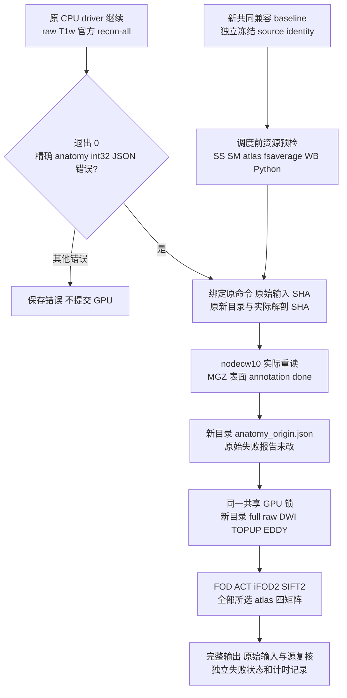

# 同轮官方解剖结果与完整原始 DWI 重新执行

## 1. 功能、范围与流程

`tools/benchmark_connectome_raw_rerun.py` 是本轮公开原始数据 benchmark 的独立编排工具。原始 T1w 已在新目录完成官方 `recon-all -i ... -all`；其后 anatomy JSON 验证失败。初次 GPU 尝试还缺少 `FNIT_WEIGHTS`，在 TOPUP/EDDY 前退出。所有原失败报告、旧冻结 source、旧 worker 和输出保持原样。

工具在新的 GPU 输出目录重新执行完整原始 DWI 下游。官方解剖输入仅能来自原 driver 的同轮重建；不得换成已有其他受试者或旧轮重建。新 baseline 包含共同的 MGH 图像头兼容修复；候选优化版本也必须包含这个共同修复。修复解决 `MGHImage` 没有 NIfTI `get_qform()` 接口的问题，保留 scanner affine，NIfTI 输入原来的数值和头规则不变。

这一执行包含真实原始 T1w 重建和完整原始 DWI 下游，报告标为**同轮受控重新执行**。原 reconstruction 没有再跑一次；原始失败、工具修复和等待间隔全部保留。正常候选版本使用普通 fresh cohort 工具和独立新 reconstruction 目录。



## 2. Python 调用、输入与输出

```python
from pathlib import Path
from tools.benchmark_connectome_raw_rerun import main

# 这些目录在 headcw、CPU 节点和 GPU 节点共同可读。
original_driver_report_directory = Path("/shared/tenraw/original_driver")
controlled_report_directory = Path("/shared/tenraw/controlled_driver_v2")
fresh_gpu_output_directory = Path("/shared/tenraw/controlled_outputs_v2")
common_baseline_source_directory = Path("/shared/tenraw/baseline_common_v2")
common_source_identity_file = Path("/shared/tenraw/controlled_harness_v2/common_identity.json")
local_weight_directory = Path("/shared/fnit-assets/weights")
new_cohort_worker_file = Path("/shared/tenraw/controlled_harness_v2/benchmark_connectome_raw_cohort.py")

exit_code = main([
    "--original-driver-report-dir", str(original_driver_report_directory),
    "--report-dir", str(controlled_report_directory),
    "--run-root", str(fresh_gpu_output_directory),
    "--source-dir", str(common_baseline_source_directory),
    "--common-identity", str(common_source_identity_file),
    "--fnit-weights", str(local_weight_directory),
    "--worker-script", str(new_cohort_worker_file),
])
```

输入为原 driver `status.json`、原 raw manifest、原官方 reconstruction 报告和产物。manifest 必须仍描述新下载的 raw BIDS 影像、配对 T1w、bval/bvec、JSON 和相反 PE 文件及 SHA-256；正式运行至少十名不同受试者。原报告的错误必须是已知 anatomy 子进程 `int32` JSON 错误，同时官方命令退出 0、版本可核验、命令为本轮完整 raw `-i -all -openmp`。

新 source 与原冻结 baseline 仅允许 `src/fnit/flirt/core.py` 不同，文件 SHA 必须等于共同修复 identity 的 `core_sha256`。`performance_optimization` 必须为 false；工具保存两版本完整 source fingerprint 和文件哈希。缺少原 `environment.yml` 也拒绝，因此使用保留完整安装描述的新冻结 source。raw wall runner 默认保持原字节；显式共同评测器更新须由 identity 声明新 SHA，保存旧/新工具哈希与实际变更范围，并用于 baseline/candidate 两版。种子、attempted seeds、atlas、注册资源、线程、GPU UUID、设备映射和共享锁保持原配置。

| 输出 | 内容 |
| --- | --- |
| 新 driver `origin_driver_snapshot.json` | 原 driver 状态的不可变字节快照；原 driver 仍继续调度 CPU |
| 新 driver `resources.json` | 资源路径、角色、文件大小和 SHA-256；不保存 license 内容 |
| 新 driver `status.json / cases.csv` | 原始错误、实际 anatomy 重读结果、新 GPU 成功或失败、独立计时错误 |
| 新 case `anatomy_origin.json` | 原报告哈希、同轮官方 FS 路径、原错误、实际 MGZ/表面/annotation 读取和前后输入哈希 |
| 新 case `gpu_report.json / raw_bids_wall.json / raw_bids_wall.log` | 新 source 和命令、真实 TOPUP/EDDY、GPU 结果、输出检查、显存记录 |
| 新 case `connectome/` | 新计算的预处理、共享 FA/5TT/GMWMI/变换，以及每个 atlas 的 count/FBC/length/FA 矩阵和节点表 |

已有新 report 目录、新 run 目录、任何新 case 目录或 GPU 输出都拒绝；中断后不能将此目录假装成 fresh 运行。原 case 的失败或部分 DWI 输出可存在，工具不会读取它们来准备新 DWI 输入。实际 raw wall 报告必须显示 EDDY completed、有反向 PE 时 TOPUP completed，而不是 reused/supplied。

## 3. 命令行与参数

```bash
python benchmark_connectome_raw_rerun.py \
  --original-driver-report-dir /shared/tenraw/original_driver \
  --report-dir /shared/tenraw/controlled_driver_v2 \
  --run-root /shared/tenraw/controlled_outputs_v2 \
  --source-dir /shared/tenraw/baseline_common_v2 \
  --common-identity /shared/tenraw/controlled_harness_v2/common_identity.json \
  --fnit-weights /shared/fnit-assets/weights \
  --worker-script /shared/tenraw/controlled_harness_v2/benchmark_connectome_raw_cohort.py
```

| 参数 | 定义 |
| --- | --- |
| `--original-driver-report-dir` | 必填，原始正式 CPU driver 的报告目录 |
| `--report-dir` | 必填，新的共享 driver 报告目录 |
| `--run-root` | 必填，新的完整 raw DWI 输出目录；与原目录不得相同或包含彼此 |
| `--source-dir` | 必填，独立冻结的共同兼容 baseline source |
| `--common-identity` | 必填，共同修复版本身份 JSON，含 core SHA 和 `performance_optimization=false` |
| `--fnit-weights` | 必填，含 `synthstrip.1.pt` 的本地目录；显式传入 GPU 子进程 `FNIT_WEIGHTS` |
| `--worker-script` | 必填，新 harness 中与本工具导入实现一致的 cohort worker |
| `--wall-script` | 可选，独立冻结的新共同评测器；SHA 同时写在 common identity。原工具保持不变，新评测器用于两版 |
| `--pilot` | 可选，只执行列出的 case ID；明确标记诊断子集，不能当成十例结果 |
| `--preflight-only` | 可选，只做真实资源预检并保存报告；不创建 GPU run root、不派发计算。正式运行需另用新的 report 目录 |
| `--cuda-alloc-conf` | 默认且仅允许 `expandable_segments:True`，显式写入 GPU 环境 `PYTORCH_CUDA_ALLOC_CONF`；以后 candidate 必须保持相同配置 |
| `--poll-seconds` | 默认 30，范围 1–60 秒 |
| `--timeout-hours` | 默认 36，最大 168；超时停止后续派发，已经提交的计算等到实际终态 |

暂停后续派发：在新的 report 目录创建 `STOP_DISPATCH` 文件。controller 在每次派发和 anatomy 重读后检查它，已提交 GPU 任务继续到真实终态；原 CPU driver 不受影响。停止后不自动恢复本目录。

预检逐个读取并 hash 实际选用的 SynthStrip/SynthMorph checkpoint、Tian/Schaefer atlas、Glasser dlabel 与球面、fsaverage 注册球面、Workbench 和 Python 可执行文件。权重与已有项目官方 checkpoint 清单一致；项目 atlas 与 `atlas_manifest.json` 一致。其他本地文件保存本轮实际字节身份。这里不会下载或重新发布资源。

## 4. 原软件调用与真实计时

原报告必须证明在本轮运行过：

```bash
recon-all -sd ORIGINAL_NEW_CASE/freesurfer -s SUBJECT_NAME \
  -i ORIGINAL_RAW_T1W -all -openmp 8
```

新 GPU 命令使用 `UKBConnectome_pipeline --bids-root RAW_BIDS --freesurfer-subject-dir ORIGINAL_NEW_CASE/freesurfer/SUBJECT_NAME --output-dir NEW_CASE/connectome ...`。raw CLI 接收 supplied anatomy，外层本轮确实从 raw T1w 生成官方结果；CLI 自身没有重新执行 reconstruction。其余算法仍调用 FNIT PyTorch 实现。

| 字段 | 含义 |
| --- | --- |
| `original_recon_command_seconds` | 原 CPU 节点官方命令的 monotonic 耗时，保留原值 |
| `original_recon_same_node_elapsed_utc_seconds` | 同一 CPU worker 原 start/end UTC 差，包含设置和验证 |
| `original_recon_worker_monotonic_seconds` | 原 CPU worker 的完整 monotonic 区间 |
| `head_driver_full_elapsed_utc_seconds` | 原 head driver 的该例 start UTC 到新 GPU SSH 返回后 head UTC；包含既有失败、修复和等待 |
| `driver_start_minus_recon_worker_start_utc_seconds` | 原 head start 与 CPU worker start 的观测差；包含 SSH 发起及主机时钟差，不能解释成精确钟差 |
| `revalidation_same_node_elapsed_utc_seconds / revalidation_monotonic_seconds` | 新 anatomy 重读在 CPU 节点的两个实际区间 |
| `revalidation_head_elapsed_utc_seconds` | 同一 head 上围绕远端 anatomy 重读的时间差 |
| `prior_failure_to_revalidation_head_gap_utc_seconds` | 若原 driver 保存 head 终态 UTC，报告同一 head 上原失败到本次重读的间隔 |
| `gpu_driver_queue_seconds / gpu_lock_queue_seconds` | 新 head 线程队列和 GPU 共享锁的各自 monotonic 等待 |
| `head_driver_full_elapsed_utc_excluding_gpu_queue_seconds` | head 完整经过区间减去两项实测 GPU 队列，保留所有失败和修复间隔 |

各主机的原始 UTC 不平移。不用 head start 与 CPU end 比较 CPU command timer；两主机时钟可能不同。GPU 执行状态先保存，计时校验随后单独写 `timing_error`，不会掩盖真实 FileNotFoundError 或注册错误。阶段耗时之和和阶段中位数都不当成整例 wall。

已经冻结运行的 v3 controller 使用首次 CSV 列名；完整的 host-scoped 时间在 `status.json` 中保留。当前工具为这些新时间提供专属 CSV 列名。可从保存的 JSON 导出一个新文件，不改旧 CSV、不重启任务：

```bash
python benchmark_connectome_raw_rerun.py export-csv \
  --status-json /shared/tenraw/controlled_driver_v3/status.json \
  --output /shared/tenraw/controlled_driver_v3/cases_timing_verified.csv
```

## 5. 验证与当前结论

协议测试仅验证哈希、原始来源绑定、新目录门槛、资源覆盖、计时与错误分离；小字节 fixture 不作为影像精度或速度证据。真实资源预检和同轮 anatomy 重读记录由本轮 driver 生成。十例全部实际成功且输出、内存记录和正式时间可核验之后，才可汇总执行结果；精度仍需官方重复 envelope 对照。

2026-10-02 已核对初次 CON01/CON03 wall 报告：均在 TOPUP/EDDY 前因 `synthstrip.1.pt` 未解析而退出，`preprocessing=[]`。旧 recovery controller 已暂停后续派发。另发现跨主机起点比较让计时错误覆盖了真实 GPU 失败；本版本改用同节点验证，并独立保留执行和计时状态。这些是已定位的编排问题，不是完成的十例 benchmark。

2026-10-03：完整共同基线 v3 的 source/resource 预检通过，共核对 26 个文件及 Workbench 2.0.0 实际 `-version`。CON03 在 nodecw10 重读 14 个官方解剖文件并前后核对 11 个 raw 输入，耗时 2.570 秒，原失败报告与解剖哈希保持不变。新十例 raw DWI controller 已启动并等待共享 GPU 锁；尚无完整十例或速度/精度结论。旧控制器的最终状态另存快照后终止，仅撤回其经独立核实仍阻塞在 `flock`、无子进程的旧 worker，原始 CPU 和实际 GPU 计算均继续。

共同评测器的本轮更新包括独立 mode 的诊断原子导出、reserved 显存门槛和 allocator 环境记录。正式 wall mode 不安装诊断 hooks；新工具整体 SHA 固定并写入每例报告，不将此更新描述成纯文本修改。

## 6. 更新记录和参考

- 2026-10-02：新增独立共同兼容 source、新 raw DWI namespace、同轮官方解剖来源绑定和全部资源预检；增加安全停止后续派发机制。
- [正常十例 fresh cohort 与计时](raw_cohort_benchmark.md)
- [首次 anatomy JSON 工具修复与原始证据](raw_cohort_recovery.md)
- [FreeSurfer recon-all 命令](https://surfer.nmr.mgh.harvard.edu/fswiki/recon-all)
- [nibabel FreeSurfer IO](https://nipy.org/nibabel/reference/nibabel.freesurfer.html)
- [FNIT 源码仓库](https://github.com/weikanggong1/Fudan-Neuroimaging-toolkit)
