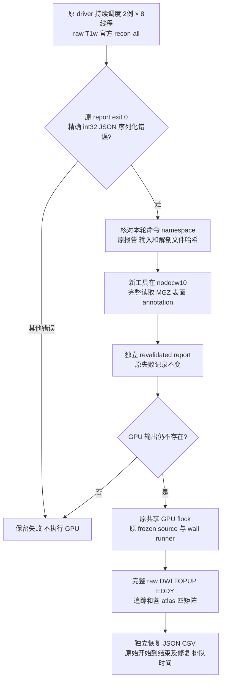

# 已完成官方 reconstruction 的同轮验证修复

## 1. 功能与适用范围

`tools/benchmark_connectome_raw_recovery.py` 是独立 benchmark 工具，只处理一个已定位的问题：官方 `recon-all` 已从本轮原始 T1w 完成并退出 0，随后 anatomy 验证子进程把 MGZ 的 `numpy.int32` 图像维度写入 JSON 时失败。修复将维度转换为 Python `int`，不会改变影像、坐标、分割或表面。

工具保留原始失败报告、冻结的旧 worker、原始 CPU 调度器和全部 reconstruction 产物。它重新读取真实 MGZ、表面和 annotation，核对原始输入及解剖文件 SHA-256，然后写独立的 `recon_report.revalidated.json`。通过验证后，从仍为空的 GPU 输出目录完整执行原始 DWI 的 TOPUP、EDDY、建模、追踪、SIFT2 和全部选择的 atlas 矩阵。既有 reconstruction 属于同一轮原始输入计算；DWI 阶段没有断点恢复或已有预处理输入。

恢复后的整例标为 **同轮工具验证修复后的执行**。它包含实际 reconstruction 和完整原始 DWI 下游，但不是无中断的 pristine/cold 计时。普通 cohort 及 candidate 仍要求新 namespace，本工具不是通用 resume 接口。



## 2. Python 接口、输入与输出

```python
from pathlib import Path
from tools.benchmark_connectome_raw_recovery import main

# 在能读取共享存储、能跳转 CPU/GPU 节点的 head 主机运行。
# 新 worker 与 recovery tool 放入独立目录；旧冻结工具和 source 保持不变。
original_driver_report_directory = Path("/shared/formal_baseline_raw_v2_driver")
recovery_driver_report_directory = Path("/shared/formal_baseline_raw_v2_recovery_driver_v1")
new_cohort_worker_path = Path("/shared/formal_harness_recovery_v1/benchmark_connectome_raw_cohort.py")

exit_code = main([
    "--original-driver-report-dir", str(original_driver_report_directory),
    "--report-dir", str(recovery_driver_report_directory),
    "--worker-script", str(new_cohort_worker_path),
    "--poll-seconds", "30",
    "--timeout-hours", "36",
])
```

输入为原 driver 的 `status.json` 和同轮 `input_manifest.json`。恢复工具读取原始 config，保持 source、wall runner、输入、线程、GPU 映射、共享锁、种子、atlas 和资源参数一致，只更换验证与 GPU 编排 worker。原报告必须同时包含退出 0、明确官方版本、本轮完整 `-i RAW_T1w -all -openmp THREADS` 命令、实际输入验证、解剖文件和 `recon-all.done` 的哈希，以及已定位的 anatomy-child `int32` JSON 错误。

| 输出 | 内容 |
| --- | --- |
| 新 driver `origin_driver_snapshot.json` | 原 driver 状态的原始字节快照和内容哈希；原文件持续由旧 CPU driver 管理 |
| 新 driver `status.json / cases.csv` | 原始开始时间、原始失败、重读验证、GPU 执行状态、独立计时和结果 |
| 原 case `recovery_claim.json` | 独占的一次修复声明；工具中断后不自动重复消费 |
| 原 case `recon_report.revalidated.json` | 原失败报告路径和 SHA-256、未改动的 reconstruction 时间、实际解剖数组/几何读取结果及前后哈希 |
| 原 case `gpu_report.json / raw_bids_wall.json` | 新启动的完整 raw DWI 阶段报告；保留它使用的原失败和独立修复报告哈希 |
| 原 case `connectome/` | 新生成的预处理、共享影像和每个 atlas 的四矩阵、节点表、atlas 图像 |

已有 `connectome`、GPU report、wall report 或 wall log 都拒绝恢复。解剖、raw T1w、任一 raw 输入、冻结 source 或 wall runner 变化也拒绝。修复报告已有或独占 claim 已存在时不自动重跑；总控制检查真实状态后决定新的诊断动作。

## 3. 命令行参数

```bash
python benchmark_connectome_raw_recovery.py \
  --original-driver-report-dir /shared/formal_baseline_raw_v2_driver \
  --report-dir /shared/formal_baseline_raw_v2_recovery_driver_v1 \
  --worker-script /shared/formal_harness_recovery_v1/benchmark_connectome_raw_cohort.py \
  --poll-seconds 30 --timeout-hours 36
```

| 参数 | 含义 |
| --- | --- |
| `--original-driver-report-dir` | 必填，仍保存本轮真实 CPU 调度和失败记录的 driver 目录 |
| `--report-dir` | 必填，新的共享报告目录；已有目录拒绝 |
| `--worker-script` | 必填，新独立工具目录内的 cohort worker；其哈希必须与 recovery tool 导入的实现一致 |
| `--poll-seconds` | 默认 30，范围 1–60；等待旧 CPU worker 的终态报告 |
| `--timeout-hours` | 默认 36，最大 168；超时后尚未开始的例保持 incomplete，已经提交的 GPU 计算等到真实结束 |

这些参数只选择工具与报告，不允许更换原始输入、预处理结果、统计定义、种子或生产源码。正常 `benchmark_connectome_raw_cohort.py run` 没有接受 failed reconstruction 的恢复开关。

## 4. 官方命令与计时

本工具不重新运行 `recon-all`。报告证明该例先前在同一轮执行了：

```bash
recon-all -sd THIS_ROUND_CASE/freesurfer -s SUBJECT_NAME \
  -i THIS_ROUND_RAW_T1W -all -openmp 8
```

随后 GPU 命令与原 frozen cohort 的 raw BIDS 命令一致。`recon_all=supplied` 指 CLI 接收到本轮自产的官方结果，不能解释成整个 cohort 没有执行 reconstruction。原始 DWI 的 TOPUP/EDDY 必须在 wall 报告中实际 completed，输出必须完整，显存门槛和原始输入前后哈希仍按正常 cohort 检查。

| 时间字段 | 定义 |
| --- | --- |
| `original_recon_command_seconds` | 原报告真实官方命令计时；保留原数值 |
| `recovered_full_elapsed_utc_seconds` | 原 driver 例开始 UTC 到恢复后 GPU 完成的实际区间；包含工具失败、修复间隔、读写和队列 |
| `original_failure_to_revalidation_gap_utc_seconds` | 原失败终态到开始重读验证的间隔 |
| `revalidation_elapsed_utc_seconds` | 重读验证的 UTC 区间；repair report 另含实际 monotonic `revalidation_wall_seconds` |
| `post_revalidation_through_gpu_completion_utc_seconds` | 验证完成到 GPU 命令、输出验证和 SSH 返回完成 |
| `gpu_driver_queue_seconds / gpu_lock_queue_seconds` | 新 driver 排队和原共享锁的实际计时 |
| `recovered_full_elapsed_utc_excluding_gpu_queue_seconds` | 上述完整 UTC 区间仅减去两项实测 GPU 队列；修复间隔仍保留 |

跨进程恢复无法延续旧 driver 的 monotonic timer，因此不把恢复区间命名为 pristine `parent_full_wall_seconds`，也不通过阶段中位数相加生成整例用时。精度和提速结论由总控制结合实际重复性、baseline/candidate 结果与不同计时范围另行分析。

## 5. 测试、真实读取和更新记录

协议测试覆盖精确错误门槛、命令与 namespace、原始字节哈希、已有下游拒绝、报告不可覆盖、普通 cohort 默认拒绝 failed、修复绑定与时间计算。小文件 fixture 只验证协议和 IO，不作为 MRI benchmark。

本次 29 项原 cohort 测试和 36 项恢复测试均通过。ds001226 CON03 在 nodecw10 完整重读 3 个 `256×256×256` MGZ、6 个表面、4 个 annotation 和 done，共 14 个文件；实际读取和 JSON 校验耗时 2.272 秒，原报告与解剖文件 SHA-256 全部保持一致。这是验证工具修复的真实读取证据，不是 pipeline 耗时或精度对照；记录见[实际检查 JSON](../../validation/connectome/tenraw_20261002/cohort_recovery_protocol.json)。

```bash
python3 -m unittest discover -s tests/connectome -p 'test_raw_cohort*tool.py' -v
```

2026-10-02：新增此受控工具修复；MGZ `image.shape` 中的 NumPy 整数在 JSON 边界转换为 Python 整数。新增工具保留原失败证据，重新读取并校验真实解剖结果，再执行完整 raw DWI 下游。实际十例完成数量、精度、显存和用时由本轮报告提供，本页不预填尚未完成的结论。

## 6. 参考

- [正常 raw cohort 工具与计时范围](raw_cohort_benchmark.md)
- [FreeSurfer recon-all 原命令](https://surfer.nmr.mgh.harvard.edu/fswiki/recon-all)
- [nibabel FreeSurfer IO](https://nipy.org/nibabel/reference/nibabel.freesurfer.html)
