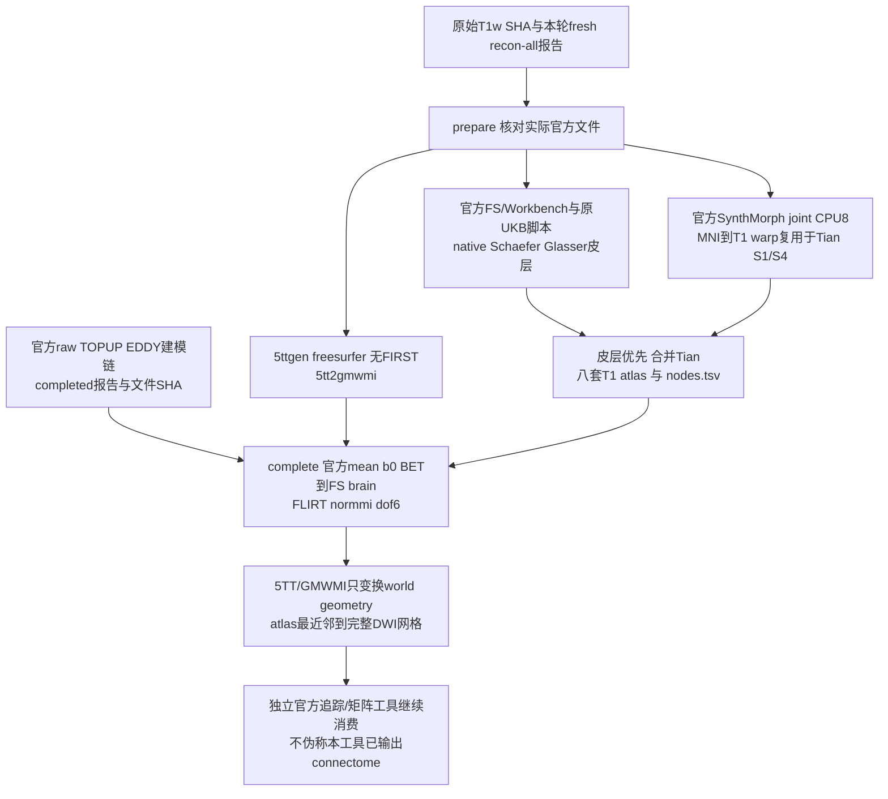

# 新原始数据的独立官方解剖与 atlas 参照

## 1. 功能与流程

`tools/reference/benchmark_connectome_anatomy_official.py` 是独立 benchmark 工具，不进入 FNIT 生产运行时。它使用**本轮从原始 T1w 新跑的官方 recon-all**，构造 FreeSurfer-only 5TT/GMWMI 和八套 atlas；随后消费官方自产 corrected DWI、mean b0/BET，运行官方 FLIRT 并生成 DWI 空间 atlas。工具不导入 FNIT、不产生虚假的 FNIT tracking PT、不再次运行 recon-all。



默认参照为 `fnit-native`：无 FIRST，Tian 使用 SynthMorph。原 UKB 的 FIRST/FNIRT 路线须另报 compatibility 结果。两个模式各使用新目录；`prepare` 的 CPU 工作可与尚未完成的官方 DWI 链并行，`complete` 只复用已完成且哈希不变的准备结果。两阶段及等待分别计时，不称 uninterrupted cold chain。

## 2. Python、输入格式和输出

```python
from tools.reference.benchmark_connectome_anatomy_official import main

# JSON绑定真实输入、资源许可、官方安装目录和本工具实际冻结提交。
official_reference_config = "/shared/raw10/reference_CON03.json"
# 目录必须不存在，失败输出会保留，不能覆盖旧报告。
fresh_structural_output = "/shared/raw10/official_anatomy_CON03_v1"
main(["prepare", "--config", official_reference_config,
      "--output", fresh_structural_output])

# 上游是独立官方链的自产DWI、mean b0、BET结果，不能用FNIT代替。
official_dwi_contract = "/shared/raw10/official_modeling_CON03/contract.json"
fresh_dwi_atlas_output = "/shared/raw10/official_atlas_CON03_v1"
main(["complete", "--config", official_reference_config,
      "--prepared-report", fresh_structural_output + "/reference_anatomy.json",
      "--official-dwi-contract", official_dwi_contract,
      "--output", fresh_dwi_atlas_output])
```

配置是 UTF-8 JSON，所有文件均为实际绝对路径；不把示例路径当成存在的文件。

| 配置字段 | 输入定义 |
| --- | --- |
| `schema_version`、`profile`、`case_id` | 固定1、`fnit-native`，本轮稳定例号，例如`sub-CON03`。 |
| `tool_commit`、`threads` | 本工具实际冻结Git提交；固定8个CPU线程。不支持GPU开关。 |
| `subject_dir` | 本轮fresh官方subject目录；需brain、aparc+aseg、ribbon、white/pial/sphere.reg、aparc/a2009s annot和recon-all.done。 |
| `anatomy_report` | `{path,sha256,size_bytes}`。完成报告或已完成的独立revalidation；后者必须绑定原报告SHA。校验官方exit0、实际`-i/-sd/-s`、raw T1 SHA和每个anatomy文件SHA；旧失败报告不改写。 |
| `raw_t1w` | 原始T1w `{path,sha256,size_bytes}`，对应原recon命令。 |
| `freesurfer_home`、`fs_license` | 官方FS8.2安装目录、已有许可证路径。只检查许可证路径存在，不读取或记录其正文/哈希。 |
| `mrtrix_bin`、`fsl_bin`、`workbench_command` | 官方MRtrix/FSL目录及Workbench可执行文件；只用于隔离参照。 |
| `python` | 运行原UKB Python脚本的既有Conda Python；项目已有nibabel/numpy/scipy/pandas依赖，无新增安装。 |
| `upstream_root` | 已核对的原UKB脚本和`data/templates`资源目录；不写入此目录。 |
| `upstream_scripts` | 四个原Python脚本名对应的 `{path,sha256,size_bytes}`：convert_native_annot、convert_schaefer_annot、convert_labels_gii_to_annot、map_surface_label_to_volume。固定实际源码字节，不发布复制的原软件源码。 |
| `fsaverage_dir` | 与FNIT本轮相同的fsaverage目录；绑定双半球sphere.reg身份。 |
| `mni_template` | 与Tian整数标签同网格的MNI T1；MNI为moving，本人FS brain为fixed。 |
| `canonical_nodes84` | FNIT既有静态84节点TSV，仅用于固定矩阵行列语义；工具逐行核对官方FreeSurferColorLUT和MRtrix fs_default对应关系，实际体积由官方labelconvert产生。 |
| `assets` | 每个必需权重、模板、surface、nodes文件的 `{path,size_bytes,sha256,license,license_url,source}`。必须完整覆盖实际消费文件；核对大小/SHA和许可来源。只读既有资源，不下载/再发布资产。 |

官方两份SynthMorph原始h5必须与FNIT固定资源身份一致：affine2为51,455,312字节、SHA `1ac5304b683036e5177f5b4ad38fa09fcbbe7883e742d6fa5bdaedd0e619ced6`；deform3为3,508,630,424字节、SHA `95b367cd30788cc647e4704b650642fc1d70d7e419c20c04f1ba1b2902bc6536`。

`complete` 消费以下上游JSON：`schema_version=1`、`case_id`相同、`scope="official_self_produced_raw_dwi_chain"`、`state="completed"`、`upstream_report={path,sha256,size_bytes}`；`files` 含 `corrected_dwi`、`mean_b0`、`mean_b0_brain`、`brain_mask` 四个文件记录。上游报告必须完成且有真实官方命令；每个文件必须SHA一致，后三者为与4D DWI同空间的3D影像。该契约不将同输入隔离算子对照升级成独立原始链；上游真实命令/自产来源须由上游工具及审核证据支持。

输出结构：

```text
prepare_output/
  reference_anatomy.json       # 模式、状态、完整契约、SHA、命令、时间、几何
  logs/                       # 每条argv的日志、wall/RSS
  five_tissue_t1.nii.gz        # [X,Y,Z,5]，cGM/sGM/WM/CSF/pathology
  gmwmi_t1.nii.gz              # [X,Y,Z] native T1网格
  synthmorph/                 # 一个MNI→T1 warp和Tian S1/S4
  original_wrapper/           # 本例private temporary；脚本和模板只读链接
  atlases/<name>/atlas_t1.nii.gz
  atlases/<name>/nodes.tsv     # index original_label hemisphere name
complete_output/
  reference_anatomy.json
  dwi_to_t1_fsl.txt            # FSL格式
  dwi_to_t1_mrtrix.txt         # 官方transformconvert的MRtrix格式
  five_tissue_dwi_world.nii.gz # 保留native sampling grid，仅变换world affine
  gmwmi_dwi_world.nii.gz
  atlases/<name>/atlas_dwi.nii.gz # 完整DWI网格，整数NN标签
  atlases/<name>/nodes.tsv
```

八套名称固定：`fs-aparc`、`aparc+tian-s1`、`aparc.a2009s+tian-s1`、`glasser+tian-s1`、`glasser+tian-s4`、`schaefer200+tian-s1`、`schaefer500+tian-s4`、`schaefer1000+tian-s4`。缺少节点在体积中允许缺席，节点表仍定义矩阵维度。

## 3. 命令行

```bash
python tools/reference/benchmark_connectome_anatomy_official.py prepare \
  --config /shared/raw10/reference_CON03.json \
  --output /shared/raw10/official_anatomy_CON03_v1

python tools/reference/benchmark_connectome_anatomy_official.py complete \
  --config /shared/raw10/reference_CON03.json \
  --prepared-report /shared/raw10/official_anatomy_CON03_v1/reference_anatomy.json \
  --official-dwi-contract /shared/raw10/official_modeling_CON03/contract.json \
  --output /shared/raw10/official_atlas_CON03_v1
```

`--dry-run` 验证真实输入/资源身份并列出SynthMorph argv，**不生成MRI结果**。`--config/--output`必填；`complete`另要求两个输入报告。已有输出目录直接拒绝；失败日志/产物保留。CPU报告中的GPU allocated/reserved为null，不是0。

## 4. 官方命令及实际CLI

```bash
# 原始官方TensorFlow joint：未传-g，因此CPU；保留extent256、steps7默认。
mri_synthmorph register -m joint -j 8 \
  -w /official/fs/models/synthmorph.affine.2.h5 \
  -w /official/fs/models/synthmorph.deform.3.h5 \
  -t /new/reference/mni_to_t1.mgz MNI_T1.nii.gz FRESH_FS/mri/brain.mgz
# apply的-t是输出dtype，TRANS是位置参数。现有wrapper也已正确采用此接口。
mri_synthmorph apply -m nearest -t int16 TRANS.mgz TIAN.nii.gz TIAN_T1.nii.gz
5ttgen freesurfer FRESH_FS/mri/aparc+aseg.mgz FIVE.nii.gz -nocrop -sgm_amyg_hipp -nthreads 8
5tt2gmwmi FIVE.nii.gz GMWMI.nii.gz -nthreads 8
flirt -in OFFICIAL_B0_BRAIN.nii.gz -ref FS_BRAIN.nii.gz -cost normmi -dof 6 -omat DWI_T1_FSL.txt
transformconvert DWI_T1_FSL.txt OFFICIAL_B0_BRAIN.nii.gz FS_BRAIN.nii.gz flirt_import DWI_T1_MRTRIX.txt
mrtransform ATLAS_T1.nii.gz ATLAS_DWI.nii.gz -linear DWI_T1_MRTRIX.txt -inverse \
  -template OFFICIAL_MEAN_B0.nii.gz -interp nearest -datatype uint32 -nthreads 8
```

FS `mri_surf2surf`、Workbench `-label-resample BARYCENTRIC` 和原UKB投影脚本按每个例的私有工作目录执行。原UKB转换脚本的颜色表随机生成；保留实际annot哈希，不能声称随机颜色字节逐值一致，体积节点语义另核对。

## 5. 真实数据精度与运行时间

2026-10-03：已实际核对FS8.2 `register/apply --help`及两h5完整大小/SHA；CPU仅用8线程，GPU未使用。focused contract/argv/节点优先级回归10项通过。这些检查**不是十例端到端benchmark**。

本轮CON03 prepare实际CPU试跑及complete结果将以新报告补充。没有完成报告时，5TT、配准、8atlas精度/时间、脑图均记待评估；不填入旧ds004666结果。现有CON03 fixed-FNIT-input官方追踪参照仍属于另外的验证层级。

## 6. 更新记录

- 2026-10-03：新增prepare/complete独立官方解剖参照和可审核契约；禁止覆盖原输出，锁定fresh T1/FS，逐例隔离public_0路径，保留官方world-geometry变换与NN atlas定义。
- 2026-10-03：真实CON03预检发现官方`lh.pial`为标准`lh.pial.T1`链接；统一比较resolve路径并仍校验目标字节SHA，保留原预检失败，无MRI重算。
- 2026-10-03：核对SynthMorph真正CLI；现有shell wrapper命令原本正确，仅补说明与回归，未修改生产重采样。

## 7. 原实现与参考

- [UKB-connectomics原脚本](https://github.com/sina-mansour/UKB-connectomics)，运行时进一步绑定所消费脚本实际SHA。
- [MRtrix 5ttgen](https://mrtrix.readthedocs.io/en/latest/reference/commands/5ttgen.html)、[5tt2gmwmi](https://mrtrix.readthedocs.io/en/latest/reference/commands/5tt2gmwmi.html)。
- [FreeSurfer SynthMorph](https://surfer.nmr.mgh.harvard.edu/fswiki/SynthMorph)，[joint SynthMorph方法](https://doi.org/10.1162/imag_a_00197)。
- [Schaefer atlas](https://doi.org/10.1093/cercor/bhx179)、[Glasser atlas](https://doi.org/10.1038/nature18933)、[Tian atlas](https://doi.org/10.1038/s41593-020-00711-6)。
