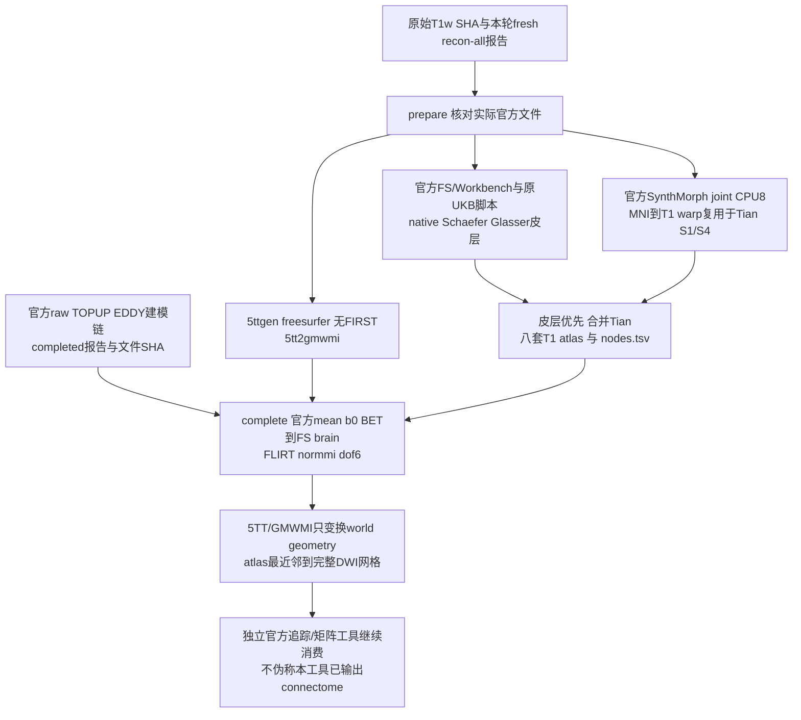

# 新原始数据的独立官方解剖与 atlas 参照

## 1. 功能与流程

`tools/reference/benchmark_connectome_anatomy_official.py` 是独立 benchmark 工具，不进入 FNIT 生产运行时。它使用**本轮从原始 T1w 新跑的官方 recon-all**，构造 FreeSurfer-only 5TT/GMWMI 和八套 atlas；随后消费官方自产 corrected DWI、mean b0/BET，运行官方 FLIRT 并生成 DWI 空间 atlas。工具不导入 FNIT、不产生虚假的 FNIT tracking PT、不再次运行 recon-all。



默认参照为 `fnit-native`：无 FIRST，Tian 使用 SynthMorph。原 UKB 的 FIRST/FNIRT 路线须另报 compatibility 结果。两个模式各使用新目录；`prepare` 的 CPU 工作可与尚未完成的官方 DWI 链并行，`complete` 只复用已完成且哈希不变的准备结果。两阶段及等待分别计时，不称 uninterrupted cold chain。

`recover-prepare` 只用于已经保留的特定读回失败：旧 `prepare` 的官方 register、Tian S1 apply、Tian S4 apply 均真实 exit0，随后普通影像读回器拒绝官方 warp 专用 MGZ。它先校验同例、同输入/资源/源码身份、三条真实 argv 与程序 SHA、原 Tian 输出 SHA，复制到新目录并用官方 Surfa 读回 warp，然后继续此前未执行的5TT与atlas步骤。旧失败报告不改写；复用命令耗时与新续跑耗时分别报告，不能称重新执行或连续冷调用。

原 UKB `convert_native_annot.py` 只为 `-1` 建立背景映射，而官方 FreeSurfer annotation 还可能以索引 `0` 表示名称为 `unknown` 的背景。2026-10-03 实际 CON08/09 左 aparc 分别有 1/2 个这样的顶点，原脚本真实报 `KeyError: 0`。新版隔离参照为该输入生成私有 annotation 副本，仅将经名称核验的 `unknown=0` 改为既定背景 `-1`；读回逐值验证正 ROI 索引、完整颜色表、名称和背景顶点集合不变，前后校验原文件 SHA。没有 `0` 的输入直接使用原字节；`0` 不是 `unknown` 时拒绝适配。原 UKB 脚本、fresh FS 目录、表面坐标和生产 FNIT 均不修改。因此含适配的结果称为**原脚本背景兼容参照**，不称原脚本未经适配的原始流程。

`recover-atlas` 只接受这一已记录的特定失败：同源 `prepare` 的九条官方前缀命令真实 exit0，随后 aparc converter 失败日志明确含 `KeyError: 0`。核对输入、argv、程序及既有输出 SHA后，在新目录复用 SynthMorph、5TT、GMWMI 和 fs-aparc 的结果，再生成背景兼容输入并续其余 atlas。原成功命令、原失败命令和新续跑/适配读写分别计时；首次观测的原失败日志及 nodes SHA也明确标注，不倒填旧报告。

`recover-complete`针对另一种已保留的隔离参照失败：官方brain转换、FLIRT、transformconvert、5TT/GMWMI world变换及首fs-aparc NN均exit0，但MRtrix沿用T1的数据strides，使输出文件轴顺序与DWI模板不同。先证明两者只差signed整数轴置换/翻转及整数offset，并逐体素验证官方`mrconvert -strides OFFICIAL_MEAN_B0`的排序输出和逆排序全部bits一致；实际shape、affine仍须满足原DWI网格检查。恢复入口核对六条原argv、程序/source/report/影像SHA和同例官方DWI合同，复用这些成功结果，在新目录续剩余七套atlas。原MRtrix布局文件、单独格式化命令、首次观测的transform SHA和各段时间保留；不改NN数值、配准或目标网格检查。

## 2. Python、输入格式和输出

```python
from tools.reference.benchmark_connectome_anatomy_official import main

# JSON绑定真实输入、资源许可、官方安装目录和本工具实际冻结提交。
official_reference_config = "/shared/raw10/reference_CON03.json"
# 目录必须不存在，失败输出会保留，不能覆盖旧报告。
fresh_structural_output = "/shared/raw10/official_anatomy_CON03_v1"
main(["prepare", "--config", official_reference_config,
      "--output", fresh_structural_output])

# 上游是独立官方链的自产DWI、mean b0、BET结果，不能用FNIT代替。
official_dwi_contract = "/shared/raw10/official_modeling_CON03/contract.json"
fresh_dwi_atlas_output = "/shared/raw10/official_atlas_CON03_v1"
main(["complete", "--config", official_reference_config,
      "--prepared-report", fresh_structural_output + "/reference_anatomy.json",
      "--official-dwi-contract", official_dwi_contract,
      "--output", fresh_dwi_atlas_output])
```

配置是 UTF-8 JSON，所有文件均为实际绝对路径；不把示例路径当成存在的文件。

| 配置字段 | 输入定义 |
| --- | --- |
| `schema_version`、`profile`、`case_id` | 固定1、`fnit-native`，本轮稳定例号，例如`sub-CON03`。 |
| `tool_commit`、`threads` | 本工具实际冻结Git提交；固定8个CPU线程。不支持GPU开关。 |
| `subject_dir` | 本轮fresh官方subject目录；需brain、aparc+aseg、ribbon、white/pial/sphere.reg、aparc/a2009s annot和recon-all.done。 |
| `anatomy_report` | `{path,sha256,size_bytes}`。完成报告或已完成的独立revalidation；后者必须绑定原报告SHA。校验官方exit0、实际`-i/-sd/-s`、raw T1 SHA和每个anatomy文件SHA；旧失败报告不改写。 |
| `raw_t1w` | 原始T1w `{path,sha256,size_bytes}`，对应原recon命令。 |
| `freesurfer_home`、`fs_license` | 官方FS8.2安装目录、已有许可证路径。只检查许可证路径存在，不读取或记录其正文/哈希。 |
| `mrtrix_bin`、`fsl_bin`、`workbench_command` | 官方MRtrix/FSL目录及Workbench可执行文件；只用于隔离参照。 |
| `runtime_library_dirs`、`runtime_libraries` | 隔离参照的已有Conda运行时目录及其`libstdc++.so.6`文件记录，绑定大小/SHA后加入LD_LIBRARY_PATH；先实际`mrconvert -version`，避免系统旧GLIBCXX使官方二进制无法启动。无需安装新软件。 |
| `python` | 运行本工具与原UKB Python脚本的既有Python环境，需nibabel/numpy/scipy/pandas（项目Conda环境已声明）；prepare先实际import并记录版本，无新增安装。 |
| `upstream_root` | 已核对的原UKB脚本和`data/templates`资源目录；不写入此目录。 |
| `upstream_scripts` | 四个原Python脚本名对应的 `{path,sha256,size_bytes}`：convert_native_annot、convert_schaefer_annot、convert_labels_gii_to_annot、map_surface_label_to_volume。固定实际源码字节，不发布复制的原软件源码。 |
| `fsaverage_dir` | 与FNIT本轮相同的fsaverage目录；绑定双半球sphere.reg身份。 |
| `mni_template` | 与Tian整数标签同网格的MNI T1；MNI为moving，本人FS brain为fixed。 |
| `canonical_nodes84` | FNIT既有静态84节点TSV，仅用于固定矩阵行列语义；工具逐行核对官方FreeSurferColorLUT和MRtrix fs_default对应关系，实际体积由官方labelconvert产生。 |
| `assets` | 每个必需权重、模板、surface、nodes文件的 `{path,size_bytes,sha256,license,license_url,source}`。必须完整覆盖实际消费文件；核对大小/SHA和许可来源。只读既有资源，不下载/再发布资产。 |

官方两份SynthMorph原始h5必须与FNIT固定资源身份一致：affine2为51,455,312字节、SHA `1ac5304b683036e5177f5b4ad38fa09fcbbe7883e742d6fa5bdaedd0e619ced6`；deform3为3,508,630,424字节、SHA `95b367cd30788cc647e4704b650642fc1d70d7e419c20c04f1ba1b2902bc6536`。

额外固定实际官方命令消费的fsaverage双半球`orig`、FreeSurfer/MRtrix LUT及`libmrtrix.so`，保存于preflight的`official_auxiliary_files`，前后校验字节身份。原v2成功SynthMorph命令不使用这些后续表面/LUT资源，恢复入口将续跑资源的首次观测单独记录。

`complete` 消费以下上游JSON：`schema_version=1`、`case_id`相同、`scope="official_self_produced_raw_dwi_chain"`、`state="completed"`、`upstream_report={path,sha256,size_bytes}`；`files` 含 `corrected_dwi`、`mean_b0`、`mean_b0_brain`、`brain_mask` 四个文件记录。上游报告必须完成且有真实官方命令；每个文件必须SHA一致，后三者为与4D DWI同空间的3D影像。该契约不将同输入隔离算子对照升级成独立原始链；上游真实命令/自产来源须由上游工具及审核证据支持。

解剖报告的`official_dwi_origin`保存完整上游合同的原路径、大小和SHA，以及实际消费的四个文件身份和已验证的官方执行状态/命令数。上游未消费的其他影像metadata不复制进该报告；原合同仍完整保留，不能修改其非空间向量轴间距或MRI数值。这一记录方式也避免MRtrix向量影像第四轴`spacing=NaN`使严格JSON报告写出失败。缺失必需文件、错误SHA、未完成状态和错误网格仍按原检查拒绝。

输出结构：

```text
prepare_output/
  reference_anatomy.json       # 模式、状态、完整契约、SHA、命令、时间、几何
  logs/                       # 每条argv的日志、wall/RSS
  five_tissue_t1.nii.gz        # [X,Y,Z,5]，cGM/sGM/WM/CSF/pathology
  gmwmi_t1.nii.gz              # [X,Y,Z] native T1网格
  synthmorph/                 # 一个MNI→T1 warp和Tian S1/S4
  original_wrapper/           # 本例private temporary；脚本和模板只读链接
  annotation_background_inputs/ # 仅需要 unknown=0 适配时创建私有副本
  atlases/<name>/atlas_t1.nii.gz
  atlases/<name>/nodes.tsv     # index original_label hemisphere name
complete_output/
  reference_anatomy.json
  dwi_to_t1_fsl.txt            # FSL格式
  dwi_to_t1_mrtrix.txt         # 官方transformconvert的MRtrix格式
  five_tissue_dwi_world.nii.gz # 保留native sampling grid，仅变换world affine
  gmwmi_dwi_world.nii.gz
  atlases/<name>/atlas_dwi.nii.gz # 完整DWI网格，整数NN标签
  atlases/<name>/nodes.tsv
```

`synthmorph/warp_metadata.json` 是官方Surfa读回的warp格式、source/target shape与affine、有限性及官方Python/packages版本。官方SynthMorph warp MGZ使用`0x301`意图头，并非普通MGH影像；工具不修改header或调用FNIT转换它。

八套名称固定：`fs-aparc`、`aparc+tian-s1`、`aparc.a2009s+tian-s1`、`glasser+tian-s1`、`glasser+tian-s4`、`schaefer200+tian-s1`、`schaefer500+tian-s4`、`schaefer1000+tian-s4`。缺少节点在体积中允许缺席，节点表仍定义矩阵维度。

## 3. 命令行

```bash
python tools/reference/benchmark_connectome_anatomy_official.py prepare \
  --config /shared/raw10/reference_CON03.json \
  --output /shared/raw10/official_anatomy_CON03_v1

python tools/reference/benchmark_connectome_anatomy_official.py complete \
  --config /shared/raw10/reference_CON03.json \
  --prepared-report /shared/raw10/official_anatomy_CON03_v1/reference_anatomy.json \
  --official-dwi-contract /shared/raw10/official_modeling_CON03/contract.json \
  --output /shared/raw10/official_atlas_CON03_v1
```

`--dry-run` 验证真实输入/资源身份并列出SynthMorph argv，**不生成MRI结果**。`--config/--output`必填；`complete`另要求两个输入报告。已有输出目录直接拒绝；失败日志/产物保留。CPU报告中的GPU allocated/reserved为null，不是0。

特定失败恢复使用 `recover-prepare --successful-synthmorph-report /preserved/failed/reference_anatomy.json`，同时给出`--config`与不存在的`--output`。仅接受同源报告中已成功的三条官方命令；恢复时首次记录warp SHA，明确不会倒填到原失败报告。

原脚本背景失败恢复：

```bash
python tools/reference/benchmark_connectome_anatomy_official.py recover-atlas \
  --config /verified/raw10/sub-CON08/config.json \
  --failed-atlas-report /preserved/raw10/sub-CON08/prepare/reference_anatomy.json \
  --output /new/raw10/sub-CON08/prepare_background_compatible
```

此模式不复用任何失败 atlas 输出；完整报告保留 `reused_official_prefix_origin` 与 `annotation_background_compatibility`，其中有原输入和适配输出SHA、受影响顶点数、实际读回核验以及适配wall时间。

官方轴顺序失败的明确恢复：

```bash
python tools/reference/benchmark_connectome_anatomy_official.py recover-complete \
  --config /verified/raw10/sub-CON01/config.json \
  --prepared-report /verified/structure/sub-CON01/reference_anatomy.json \
  --official-dwi-contract /verified/official_modeling/sub-CON01/consumer_contract.json \
  --complete-prefix-proof /verified/official_integer_lattice/layout_proof.json \
  --output /new/raw10/sub-CON01/complete
```

`--complete-prefix-proof`只在`recover-complete`使用；合同未完成、输入不同、原六命令非成功、原文件SHA改变、实际lattice/voxel值不一致均拒绝恢复。普通`complete`直接在官方NN命令中使用实际mean b0为`-strides`模板。

十例调度使用独立工具，最多两例、每例CPU8，不占GPU：

```bash
python tools/reference/benchmark_connectome_official_anatomy_cohort.py \
  --config-template /shared/raw10/reference_CON03.json \
  --baseline-root /shared/raw10/formal_baseline_raw_v2/baseline \
  --raw-root /shared/raw10/raw \
  --official-dwi-root /shared/raw10/current_verified_official_modeling \
  --validation-script /frozen/tools/benchmark_connectome_raw_cohort.py \
  --tool-commit ACTUAL_FROZEN_REFERENCE_COMMIT \
  --prepared-case-report sub-CON03=/verified/pilot/reference_anatomy.json \
  --workers 2 --poll-seconds 30 --wait-timeout-seconds 21600 \
  --output /shared/raw10/official_anatomy_raw10_v1
```

默认十例CON01、CON03、CON04–CON11；`--case-ids`可显式选例。`--prepared-case-report CASE=REPORT`可重复，用于已经完成且SHA不变的同例官方结构准备，原报告与时间独立保留，不重算；没有完成report时不能使用此参数。`--validation-script`绑定项目现有实际MGZ/surface/annotation读回工具，只有baseline本轮recon exit0且特定int32报告序列化失败时，才在新目录生成只读revalidation sidecar，保留原failed报告。其他失败不升级为成功，不使用candidate FS。

示例中的`current_verified_official_modeling`须替换为实际当前上游输出根路径，不能指向已经失败或退役的DWI链。切换producer时在新cohort目录显式绑定各例完成的prepare报告，保留旧namespace；只更换输入来源，不重算已验证的结构准备。

若同例另有已验证的complete前缀，在cohort入口显式增加`--recover-complete-case-proof sub-CON01=/verified/layout_proof.json`（可重复）。它只允许用于同时显式绑定完成prepare的例；原DWI合同实际到达后再执行恢复，不能预先发布consumer。

调度在新输出目录写`cohort_reference.json`及`sub-CONxx/{config.json,prepare/,complete/,consumer_contract.json}`。FS仍运行时等待，官方DWI合同未完成时等待，准备与完成各占一个CPU槽，等待不阻塞其余例的prepare。`consumer_contract`的scope为`official_self_produced_fresh_fs_anatomy_and_raw_dwi_atlases`，含真实T1/FS、prepare/complete/DWI上游报告SHA、5TT/GMWMI world影像、4×4变换、八套atlas影像及nodes/K；明确`tractography_completed=false`、`connectome_completed=false`。后续追踪只能消费该合同和官方建模合同。整个driver wall包含等待，不能替代各例实际官方命令耗时。

## 4. 官方命令及实际CLI

```bash
# 原始官方TensorFlow joint：未传-g，因此CPU；保留extent256、steps7默认。
mri_synthmorph register -m joint -j 8 \
  -w /official/fs/models/synthmorph.affine.2.h5 \
  -w /official/fs/models/synthmorph.deform.3.h5 \
  -t /new/reference/mni_to_t1.mgz MNI_T1.nii.gz FRESH_FS/mri/brain.mgz
# apply的-t是输出dtype，TRANS是位置参数。现有wrapper也已正确采用此接口。
mri_synthmorph apply -m nearest -t int16 TRANS.mgz TIAN.nii.gz TIAN_T1.nii.gz
5ttgen freesurfer FRESH_FS/mri/aparc+aseg.mgz FIVE.nii.gz -nocrop -sgm_amyg_hipp -nthreads 8
5tt2gmwmi FIVE.nii.gz GMWMI.nii.gz -nthreads 8
flirt -in OFFICIAL_B0_BRAIN.nii.gz -ref FS_BRAIN.nii.gz -cost normmi -dof 6 -omat DWI_T1_FSL.txt
transformconvert DWI_T1_FSL.txt OFFICIAL_B0_BRAIN.nii.gz FS_BRAIN.nii.gz flirt_import DWI_T1_MRTRIX.txt
mrtransform ATLAS_T1.nii.gz ATLAS_DWI.nii.gz -linear DWI_T1_MRTRIX.txt -inverse \
  -template OFFICIAL_MEAN_B0.nii.gz -strides OFFICIAL_MEAN_B0.nii.gz \
  -interp nearest -datatype uint32 -nthreads 8
```

MRtrix的`-template`决定输出物理网格，`-strides`决定输出文件数据轴顺序；其官方help明确前者不会替换输入图像的strides。因此两者均引用实际官方mean b0，使NIfTI数组shape/affine直接对应模板。5TT/GMWMI world变换仍不传`-template`，继续保留native采样网格。

FS `mri_surf2surf`、Workbench `-label-resample BARYCENTRIC` 和原UKB投影脚本按每个例的私有工作目录执行。原UKB转换脚本的颜色表随机生成；保留实际annot哈希，不能声称随机颜色字节逐值一致，体积节点语义另核对。

## 5. 十例真实结果与运行时间

**当前十例官方参照均已实际完成**（2026-10-03 02:14 UTC只读核验）：新下载的 OpenNeuro `ds001226`，固定快照 `fb4d0fda44f2ab7a732fb4ab6cd62add09dc1cd7`，受试者为CON01、CON03、CON04–CON11。每例使用本轮原始T1的fresh官方FreeSurfer，已有27个结构准备输出、20个DWI解剖输出，以及5次独立MRtrix追踪和八套atlas的四类矩阵。每例5次参照共198条官方命令，全部exit0；每次固定100,000个seed attempts，随机种子0–4。

完成来源为**原目录九例＋新目录CON11**，通过逐例合同绑定汇合。旧调度的CON11仍为`waiting_official_dwi`，其状态和文件未改写；当前完成判定以新的实际来源表为准。

| 真实例 | 官方DWI建模来源 | 官方解剖来源 | 官方五次参照来源 |
| --- | --- | --- | --- |
| CON01、04、06、08、10 | `task_02/official_modeling_CPU_budget_raw10_v1` | `official_anatomy_raw10_CPU_budget_v4` | `task_04/official_raw10_cpu_group_A_v3` |
| CON03、05、07、09 | 同上 | 同上 | `task_04/official_raw10_cpu_group_B_v3` |
| CON11 | `task_02/official_modeling_CON11_selected_recovery_v1` | `official_anatomy_CON11_selected_CPU_v1` | `task_04/official_raw_CON11_selected_CPU_v1` |

表中路径均相对于实际根目录`/cwStorage/home/gongwk/Notebook_code/fnit_connectome_tenraw_20261002`。只读核验绑定最终逐例map的真实SHA `a12765a9dd1257ec1ba6281c61ebdebd6f654c12f173dfc597c025527d1446aa`，重新核对十例报告/合同SHA、同例原始T1、fresh FS官方exit0、各级消费路径和固定科学worker，见[十例实际完成与CON10核验](../../validation/connectome/raw10_official_anatomy_DWI_20261003/actual10_completion.public.json)。旧两例、四例和八例快照保留各自观察时刻，不能作为当前覆盖例数。

### 分阶段计时

| 例 | prepare模式 | prepare entry秒 | complete模式/新命令数 | complete entry秒 | complete新命令合计秒 | 5次官方参照worker秒 |
| --- | --- | ---: | --- | ---: | ---: | ---: |
| CON01 | prepare | 426.095 | recover-complete / 7 | 13.807 | 1.794 | 427.833 |
| CON03 | recover-prepare | 161.363 | recover-complete / 7 | 13.912 | 1.755 | 406.840 |
| CON04 | prepare | 424.715 | complete / 13 | 26.534 | 15.282 | 400.369 |
| CON05 | prepare | 393.881 | complete / 13 | 27.207 | 14.693 | 444.362 |
| CON06 | prepare | 390.616 | complete / 13 | 28.344 | 16.007 | 441.676 |
| CON07 | prepare | 367.595 | complete / 13 | 27.757 | 15.775 | 441.178 |
| CON08 | recover-atlas | 142.298 | complete / 13 | 27.384 | 15.224 | 416.060 |
| CON09 | recover-atlas | 146.390 | complete / 13 | 27.038 | 15.121 | 419.802 |
| CON10 | prepare | 429.375 | complete / 13 | 39.508 | 15.538 | 417.947 |
| CON11 | prepare | 444.170 | complete / 13 | 27.342 | 15.111 | 491.855 |

`entry`包括实际输入核验、命令执行、复制、读回和SHA；“新命令合计”只累加本阶段保存的官方命令wall。5次参照worker计时包括输入读回、追踪、SIFT2、采样、矩阵和保存核验，排除上游重建/预处理/建模。CPU结构与解剖每例8线程、最多两例并行；追踪使用原固定`-nthreads 0`，后处理8线程。

CON03 prepare复用此前成功的SynthMorph三命令403.782秒；CON08/09复用此前九条成功命令224.273/272.558秒。CON01/03 complete复用原六条成功命令17.375/14.039秒，单独格式化轴顺序0.198/0.049秒，新七条NN分别1.794/1.755秒。这些阶段分开报告，不拼接成连续冷调用。原始recon-all、TOPUP/EDDY及建模时间由各自报告保留；[结构准备摘要](../../validation/connectome/raw10_official_anatomy_20261003/structure_prepare.public.json)、[两例恢复摘要](../../validation/connectome/raw10_official_anatomy_DWI_20261003/two_case_completion.public.json)和[四例历史摘要](../../validation/connectome/raw10_official_anatomy_DWI_20261003/four_case_completion.public.json)保持原字节。

FNIT相对官方的精度、耗时和MRtrix重复范围结论见[十例实际比较](actual_cohort_comparison.md)及[raw评测](raw_cohort_benchmark.md)。本页报告官方链的完成、输入身份与几何核验，不替代最终矩阵统计验收。

### CON10补充核验与CON11交接

CON10实际complete首次执行13条官方命令，全部exit0；FLIRT为9.345秒，全部命令合计15.538秒，entry为39.508秒。此次只读核验重新检查14个fresh FS文件、27个prepare输出、20个complete输出和四个实际消费的官方DWI文件SHA。corrected DWI为`96×96×60×102`，八atlas均为`96×96×60`完整网格，最大affine差`4.27e-14`，标签为合法整数，nodes索引连续。两套Glasser分别在体积中出现374/412个正节点，仍保留376/414行节点定义；缺席节点不改变矩阵维度。

本次整体来源核验共139个唯一文件、463,321,306字节，CPU只读耗时1.272秒。它重新核对十例不可变报告/合同，并额外读取CON10影像；未重跑旧九例矩阵读回。原最终map已记录各例保存文件审核，CON11另有[独立完成审计](../../validation/connectome/tenraw_20261002/anatomy_CON11_explicit_followon_v1/compact_completed_handoff.json)。[只读核验源码](../../validation/connectome/raw10_official_anatomy_DWI_20261003/audit_actual10_completion_readonly.py)的执行SHA保存在新JSON中。

CON11的新官方rawprep、建模、解剖及五次参照均使用实际新来源，旧CON11目录未补写或建立输入别名。复用已经核验的27个结构准备输出；新解剖worker entry为27.342秒，调度wall为30.979秒，五次参照worker为491.855秒。原`cb06c0ca`解剖worker及`0c6191ec`追踪worker字节和参数不变；160个矩阵SHA/shape/finite和40个节点表的独立审计通过。完整路径、配置/源码SHA、PID/start ticks、启动与完成报告见[CON11明确来源与交接](../../validation/connectome/tenraw_20261002/anatomy_CON11_explicit_followon_v1/README_v3.md)。

各例八套节点数为84、84、164、376、414、216、554、1054；CON09的`aparc.a2009s+tian-s1`为166，来自原UKB按实际正标签构造节点的规则。逐例使用`nodes.tsv`，不硬编码其他例的K。CON08/09背景适配仅影响左aparc的1/2个unknown顶点，正ROI、完整颜色表、名字及原背景集合逐值保持。

### 脑图与保留的失败证据

真实CON03图展示fresh FS brain、5TT白质、GMWMI和八套native T1 atlas；仅作轴排列显示，无重采样。图像SHA为`d8a404cf552f346681276636c0e84c0c2ce00b1fbbbefaa90f4fba58dc931edc`，[绘图来源](../../validation/connectome/raw10_official_anatomy_CON03_20261003/official_con03_anatomy.json)及[原结构结果](../../validation/connectome/raw10_official_anatomy_CON03_20261003/con03_official_anatomy.public.json)保留。本图不表示最终connectome矩阵匹配。


| 原真实失败 | 新参照采用的处理 | 保留证据 |
| --- | --- | --- |
| CON03 SynthMorph三命令exit0后，普通nibabel拒绝warp专用MGZ `0x301`头 | 用官方Surfa读回原warp，在新目录恢复后续步骤；原三命令403.782秒单列 | 原v2 failed报告、三条argv/程序SHA、原warp/Tian SHA；结构来源摘要绑定恢复报告 |
| 后续5ttgen遇到旧GLIBCXX；原UKB脚本遇到指定环境缺pandas | 绑定服务器已有Conda运行时和已有Python，先预检，不安装新软件 | 原failed日志、程序字节与各段计时；原FS/UKB代码不变 |
| CON08/09原UKB converter真实`KeyError: 0` | 私有annotation将经名称确认的unknown0映射背景−1；28条新命令exit0 | [背景兼容与原失败摘要](../../validation/connectome/raw10_official_annotation_background_20261003/official_reference_background.public.json)，原输入SHA和完整正ROI读回；FNIT成熟reader未改 |
| 首CON01 complete序列化复制未消费向量metadata的NaN，mri_convert0.35秒后退出 | 只记录实际消费的四文件，完整原上游合同保留路径和SHA | 原v2 failed报告和实际命令时间；缺失、坏SHA、错网格继续拒绝 |
| CON01/03官方NN首atlas采用T1 strides，物理同网格但存储轴顺序不同 | 官方`-strides`使用实际mean b0；原六命令在新目录明确恢复 | [全voxel整数lattice proof](../../validation/connectome/raw10_official_layout_20261003/layout_proof.public.json)：全部uint32值和逆排序bits一致，world界`1.97e-6/3.40e-6 mm`；原v3失败及轴文件保留 |
| 旧CON11上游目录等待，新的实际DWI来自单例恢复目录 | 冻结新CON11元数据配置和CPU调度，消费实际完成合同，按逐例map交接 | [CON11交接](../../validation/connectome/tenraw_20261002/anatomy_CON11_explicit_followon_v1/README_v3.md)保留旧v1/v2等待来源、实际退休记录和新v3完成审计 |

恢复与格式适配都保存原失败、成功前缀、首次观察SHA和实际新耗时。它们没有修改生产配准、插值、统计定义或旧科学worker。既有focused CPU测试22/24/28项的真实结果及边界拒绝记录保留在各版本证据中；本次文档更新只执行来源/文件/网格核验，没有运行MRI程序或GPU。

## 6. 更新记录

- 2026-10-03：当前官方链更新为原九例＋新CON11实际十例，逐例绑定各自DWI、fresh FS、解剖和五次参照；旧全局CON11等待状态保持。新增CON10完整DWI网格/整数节点及输入输出SHA只读核验，生产与冻结科学worker不变。
- 2026-10-03：新增prepare/complete独立官方解剖参照和可审核契约；禁止覆盖原输出，锁定fresh T1/FS，逐例隔离public_0路径，保留官方world-geometry变换与NN atlas定义。
- 2026-10-03：十例官方结构准备实际完成，发布逐例来源、节点表与分阶段耗时；修复首例DWI交接报告复制未消费NaN向量metadata的问题，保留原合同SHA及原缺失/损坏/网格检查。
- 2026-10-03：两例真实MRtrix轴顺序差完成整数lattice和全部voxel逆映射验证；官方NN显式使用模板strides，增加绑定成功六命令前缀的分阶段complete恢复。配准、插值和目标网格检查不变。
- 2026-10-03：真实CON03预检发现官方`lh.pial`为标准`lh.pial.T1`链接；统一比较resolve路径并仍校验目标字节SHA，保留原预检失败，无MRI重算。
- 2026-10-03：真实官方warp头为`0x301`，改用安装内官方Surfa只读读回，并增加明确来源/耗时的分阶段恢复入口；生产配准与重采样代码不变。
- 2026-10-03：新增CPU十例解剖/atlas调度，使用baseline fresh FS与各自官方raw-DWI完成合同；绑定既有运行时并预检官方二进制，禁止把组件对照、旧pilot或FNIT产物称为十例全官方原始链。
- 2026-10-03：核对SynthMorph真正CLI；现有shell wrapper命令原本正确，仅补说明与回归，未修改生产重采样。
- 2026-10-03：真实 CON08/09 触发原 UKB native annotation 背景索引0缺键；增加私有输入背景适配及严格绑定成功前缀的 `recover-atlas`，保留原failed结果。FNIT成熟reader已将−1/0留背景，不改生产实现或统计定义。

## 7. 原实现与参考

- [UKB-connectomics原脚本](https://github.com/sina-mansour/UKB-connectomics)，运行时进一步绑定所消费脚本实际SHA。
- [MRtrix 5ttgen](https://mrtrix.readthedocs.io/en/latest/reference/commands/5ttgen.html)、[5tt2gmwmi](https://mrtrix.readthedocs.io/en/latest/reference/commands/5tt2gmwmi.html)。
- [FreeSurfer SynthMorph](https://surfer.nmr.mgh.harvard.edu/fswiki/SynthMorph)，[joint SynthMorph方法](https://doi.org/10.1162/imag_a_00197)。
- [Schaefer atlas](https://doi.org/10.1093/cercor/bhx179)、[Glasser atlas](https://doi.org/10.1038/nature18933)、[Tian atlas](https://doi.org/10.1038/s41593-020-00711-6)。
