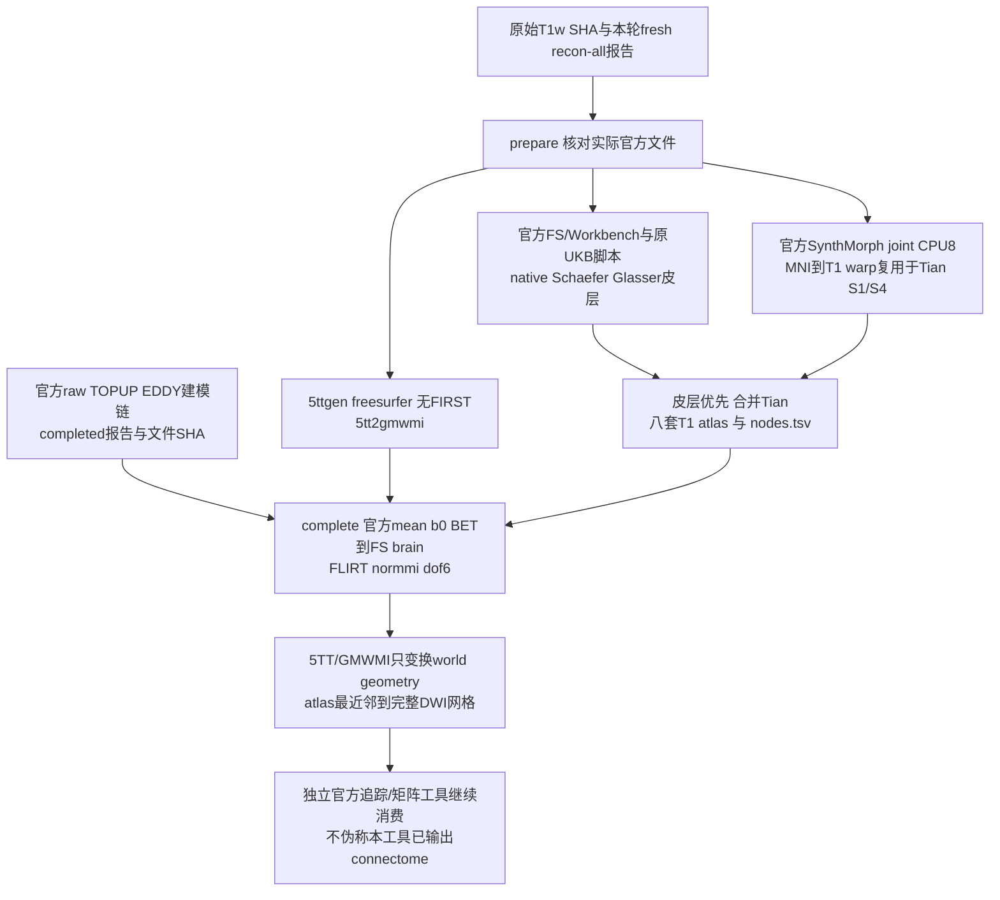
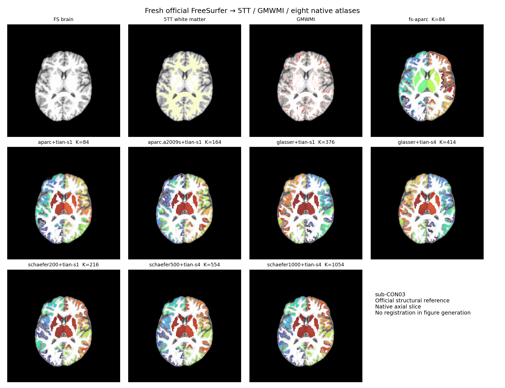

# 新原始数据的独立官方解剖与 atlas 参照

## 1. 功能与流程

`tools/reference/benchmark_connectome_anatomy_official.py` 是独立 benchmark 工具，不进入 FNIT 生产运行时。它使用**本轮从原始 T1w 新跑的官方 recon-all**，构造 FreeSurfer-only 5TT/GMWMI 和八套 atlas；随后消费官方自产 corrected DWI、mean b0/BET，运行官方 FLIRT 并生成 DWI 空间 atlas。工具不导入 FNIT、不产生虚假的 FNIT tracking PT、不再次运行 recon-all。



默认参照为 `fnit-native`：无 FIRST，Tian 使用 SynthMorph。原 UKB 的 FIRST/FNIRT 路线须另报 compatibility 结果。两个模式各使用新目录；`prepare` 的 CPU 工作可与尚未完成的官方 DWI 链并行，`complete` 只复用已完成且哈希不变的准备结果。两阶段及等待分别计时，不称 uninterrupted cold chain。

`recover-prepare` 只用于已经保留的特定读回失败：旧 `prepare` 的官方 register、Tian S1 apply、Tian S4 apply 均真实 exit0，随后普通影像读回器拒绝官方 warp 专用 MGZ。它先校验同例、同输入/资源/源码身份、三条真实 argv 与程序 SHA、原 Tian 输出 SHA，复制到新目录并用官方 Surfa 读回 warp，然后继续此前未执行的5TT与atlas步骤。旧失败报告不改写；复用命令耗时与新续跑耗时分别报告，不能称重新执行或连续冷调用。

原 UKB `convert_native_annot.py` 只为 `-1` 建立背景映射，而官方 FreeSurfer annotation 还可能以索引 `0` 表示名称为 `unknown` 的背景。2026-10-03 实际 CON08/09 左 aparc 分别有 1/2 个这样的顶点，原脚本真实报 `KeyError: 0`。新版隔离参照为该输入生成私有 annotation 副本，仅将经名称核验的 `unknown=0` 改为既定背景 `-1`；读回逐值验证正 ROI 索引、完整颜色表、名称和背景顶点集合不变，前后校验原文件 SHA。没有 `0` 的输入直接使用原字节；`0` 不是 `unknown` 时拒绝适配。原 UKB 脚本、fresh FS 目录、表面坐标和生产 FNIT 均不修改。因此含适配的结果称为**原脚本背景兼容参照**，不称原脚本未经适配的原始流程。

`recover-atlas` 只接受这一已记录的特定失败：同源 `prepare` 的九条官方前缀命令真实 exit0，随后 aparc converter 失败日志明确含 `KeyError: 0`。核对输入、argv、程序及既有输出 SHA后，在新目录复用 SynthMorph、5TT、GMWMI 和 fs-aparc 的结果，再生成背景兼容输入并续其余 atlas。原成功命令、原失败命令和新续跑/适配读写分别计时；首次观测的原失败日志及 nodes SHA也明确标注，不倒填旧报告。

`recover-complete`针对另一种已保留的隔离参照失败：官方brain转换、FLIRT、transformconvert、5TT/GMWMI world变换及首fs-aparc NN均exit0，但MRtrix沿用T1的数据strides，使输出文件轴顺序与DWI模板不同。先证明两者只差signed整数轴置换/翻转及整数offset，并逐体素验证官方`mrconvert -strides OFFICIAL_MEAN_B0`的排序输出和逆排序全部bits一致；实际shape、affine仍须满足原DWI网格检查。恢复入口核对六条原argv、程序/source/report/影像SHA和同例官方DWI合同，复用这些成功结果，在新目录续剩余七套atlas。原MRtrix布局文件、单独格式化命令、首次观测的transform SHA和各段时间保留；不改NN数值、配准或目标网格检查。

## 2. Python、输入格式和输出

```python
from tools.reference.benchmark_connectome_anatomy_official import main

# JSON绑定真实输入、资源许可、官方安装目录和本工具实际冻结提交。
official_reference_config = "/shared/raw10/reference_CON03.json"
# 目录必须不存在，失败输出会保留，不能覆盖旧报告。
fresh_structural_output = "/shared/raw10/official_anatomy_CON03_v1"
main(["prepare", "--config", official_reference_config,
      "--output", fresh_structural_output])

# 上游是独立官方链的自产DWI、mean b0、BET结果，不能用FNIT代替。
official_dwi_contract = "/shared/raw10/official_modeling_CON03/contract.json"
fresh_dwi_atlas_output = "/shared/raw10/official_atlas_CON03_v1"
main(["complete", "--config", official_reference_config,
      "--prepared-report", fresh_structural_output + "/reference_anatomy.json",
      "--official-dwi-contract", official_dwi_contract,
      "--output", fresh_dwi_atlas_output])
```

配置是 UTF-8 JSON，所有文件均为实际绝对路径；不把示例路径当成存在的文件。

| 配置字段 | 输入定义 |
| --- | --- |
| `schema_version`、`profile`、`case_id` | 固定1、`fnit-native`，本轮稳定例号，例如`sub-CON03`。 |
| `tool_commit`、`threads` | 本工具实际冻结Git提交；固定8个CPU线程。不支持GPU开关。 |
| `subject_dir` | 本轮fresh官方subject目录；需brain、aparc+aseg、ribbon、white/pial/sphere.reg、aparc/a2009s annot和recon-all.done。 |
| `anatomy_report` | `{path,sha256,size_bytes}`。完成报告或已完成的独立revalidation；后者必须绑定原报告SHA。校验官方exit0、实际`-i/-sd/-s`、raw T1 SHA和每个anatomy文件SHA；旧失败报告不改写。 |
| `raw_t1w` | 原始T1w `{path,sha256,size_bytes}`，对应原recon命令。 |
| `freesurfer_home`、`fs_license` | 官方FS8.2安装目录、已有许可证路径。只检查许可证路径存在，不读取或记录其正文/哈希。 |
| `mrtrix_bin`、`fsl_bin`、`workbench_command` | 官方MRtrix/FSL目录及Workbench可执行文件；只用于隔离参照。 |
| `runtime_library_dirs`、`runtime_libraries` | 隔离参照的已有Conda运行时目录及其`libstdc++.so.6`文件记录，绑定大小/SHA后加入LD_LIBRARY_PATH；先实际`mrconvert -version`，避免系统旧GLIBCXX使官方二进制无法启动。无需安装新软件。 |
| `python` | 运行本工具与原UKB Python脚本的既有Python环境，需nibabel/numpy/scipy/pandas（项目Conda环境已声明）；prepare先实际import并记录版本，无新增安装。 |
| `upstream_root` | 已核对的原UKB脚本和`data/templates`资源目录；不写入此目录。 |
| `upstream_scripts` | 四个原Python脚本名对应的 `{path,sha256,size_bytes}`：convert_native_annot、convert_schaefer_annot、convert_labels_gii_to_annot、map_surface_label_to_volume。固定实际源码字节，不发布复制的原软件源码。 |
| `fsaverage_dir` | 与FNIT本轮相同的fsaverage目录；绑定双半球sphere.reg身份。 |
| `mni_template` | 与Tian整数标签同网格的MNI T1；MNI为moving，本人FS brain为fixed。 |
| `canonical_nodes84` | FNIT既有静态84节点TSV，仅用于固定矩阵行列语义；工具逐行核对官方FreeSurferColorLUT和MRtrix fs_default对应关系，实际体积由官方labelconvert产生。 |
| `assets` | 每个必需权重、模板、surface、nodes文件的 `{path,size_bytes,sha256,license,license_url,source}`。必须完整覆盖实际消费文件；核对大小/SHA和许可来源。只读既有资源，不下载/再发布资产。 |

官方两份SynthMorph原始h5必须与FNIT固定资源身份一致：affine2为51,455,312字节、SHA `1ac5304b683036e5177f5b4ad38fa09fcbbe7883e742d6fa5bdaedd0e619ced6`；deform3为3,508,630,424字节、SHA `95b367cd30788cc647e4704b650642fc1d70d7e419c20c04f1ba1b2902bc6536`。

额外固定实际官方命令消费的fsaverage双半球`orig`、FreeSurfer/MRtrix LUT及`libmrtrix.so`，保存于preflight的`official_auxiliary_files`，前后校验字节身份。原v2成功SynthMorph命令不使用这些后续表面/LUT资源，恢复入口将续跑资源的首次观测单独记录。

`complete` 消费以下上游JSON：`schema_version=1`、`case_id`相同、`scope="official_self_produced_raw_dwi_chain"`、`state="completed"`、`upstream_report={path,sha256,size_bytes}`；`files` 含 `corrected_dwi`、`mean_b0`、`mean_b0_brain`、`brain_mask` 四个文件记录。上游报告必须完成且有真实官方命令；每个文件必须SHA一致，后三者为与4D DWI同空间的3D影像。该契约不将同输入隔离算子对照升级成独立原始链；上游真实命令/自产来源须由上游工具及审核证据支持。

解剖报告的`official_dwi_origin`保存完整上游合同的原路径、大小和SHA，以及实际消费的四个文件身份和已验证的官方执行状态/命令数。上游未消费的其他影像metadata不复制进该报告；原合同仍完整保留，不能修改其非空间向量轴间距或MRI数值。这一记录方式也避免MRtrix向量影像第四轴`spacing=NaN`使严格JSON报告写出失败。缺失必需文件、错误SHA、未完成状态和错误网格仍按原检查拒绝。

输出结构：

```text
prepare_output/
  reference_anatomy.json       # 模式、状态、完整契约、SHA、命令、时间、几何
  logs/                       # 每条argv的日志、wall/RSS
  five_tissue_t1.nii.gz        # [X,Y,Z,5]，cGM/sGM/WM/CSF/pathology
  gmwmi_t1.nii.gz              # [X,Y,Z] native T1网格
  synthmorph/                 # 一个MNI→T1 warp和Tian S1/S4
  original_wrapper/           # 本例private temporary；脚本和模板只读链接
  annotation_background_inputs/ # 仅需要 unknown=0 适配时创建私有副本
  atlases/<name>/atlas_t1.nii.gz
  atlases/<name>/nodes.tsv     # index original_label hemisphere name
complete_output/
  reference_anatomy.json
  dwi_to_t1_fsl.txt            # FSL格式
  dwi_to_t1_mrtrix.txt         # 官方transformconvert的MRtrix格式
  five_tissue_dwi_world.nii.gz # 保留native sampling grid，仅变换world affine
  gmwmi_dwi_world.nii.gz
  atlases/<name>/atlas_dwi.nii.gz # 完整DWI网格，整数NN标签
  atlases/<name>/nodes.tsv
```

`synthmorph/warp_metadata.json` 是官方Surfa读回的warp格式、source/target shape与affine、有限性及官方Python/packages版本。官方SynthMorph warp MGZ使用`0x301`意图头，并非普通MGH影像；工具不修改header或调用FNIT转换它。

八套名称固定：`fs-aparc`、`aparc+tian-s1`、`aparc.a2009s+tian-s1`、`glasser+tian-s1`、`glasser+tian-s4`、`schaefer200+tian-s1`、`schaefer500+tian-s4`、`schaefer1000+tian-s4`。缺少节点在体积中允许缺席，节点表仍定义矩阵维度。

## 3. 命令行

```bash
python tools/reference/benchmark_connectome_anatomy_official.py prepare \
  --config /shared/raw10/reference_CON03.json \
  --output /shared/raw10/official_anatomy_CON03_v1

python tools/reference/benchmark_connectome_anatomy_official.py complete \
  --config /shared/raw10/reference_CON03.json \
  --prepared-report /shared/raw10/official_anatomy_CON03_v1/reference_anatomy.json \
  --official-dwi-contract /shared/raw10/official_modeling_CON03/contract.json \
  --output /shared/raw10/official_atlas_CON03_v1
```

`--dry-run` 验证真实输入/资源身份并列出SynthMorph argv，**不生成MRI结果**。`--config/--output`必填；`complete`另要求两个输入报告。已有输出目录直接拒绝；失败日志/产物保留。CPU报告中的GPU allocated/reserved为null，不是0。

特定失败恢复使用 `recover-prepare --successful-synthmorph-report /preserved/failed/reference_anatomy.json`，同时给出`--config`与不存在的`--output`。仅接受同源报告中已成功的三条官方命令；恢复时首次记录warp SHA，明确不会倒填到原失败报告。

原脚本背景失败恢复：

```bash
python tools/reference/benchmark_connectome_anatomy_official.py recover-atlas \
  --config /verified/raw10/sub-CON08/config.json \
  --failed-atlas-report /preserved/raw10/sub-CON08/prepare/reference_anatomy.json \
  --output /new/raw10/sub-CON08/prepare_background_compatible
```

此模式不复用任何失败 atlas 输出；完整报告保留 `reused_official_prefix_origin` 与 `annotation_background_compatibility`，其中有原输入和适配输出SHA、受影响顶点数、实际读回核验以及适配wall时间。

官方轴顺序失败的明确恢复：

```bash
python tools/reference/benchmark_connectome_anatomy_official.py recover-complete \
  --config /verified/raw10/sub-CON01/config.json \
  --prepared-report /verified/structure/sub-CON01/reference_anatomy.json \
  --official-dwi-contract /verified/official_modeling/sub-CON01/consumer_contract.json \
  --complete-prefix-proof /verified/official_integer_lattice/layout_proof.json \
  --output /new/raw10/sub-CON01/complete
```

`--complete-prefix-proof`只在`recover-complete`使用；合同未完成、输入不同、原六命令非成功、原文件SHA改变、实际lattice/voxel值不一致均拒绝恢复。普通`complete`直接在官方NN命令中使用实际mean b0为`-strides`模板。

十例调度使用独立工具，最多两例、每例CPU8，不占GPU：

```bash
python tools/reference/benchmark_connectome_official_anatomy_cohort.py \
  --config-template /shared/raw10/reference_CON03.json \
  --baseline-root /shared/raw10/formal_baseline_raw_v2/baseline \
  --raw-root /shared/raw10/raw \
  --official-dwi-root /shared/raw10/current_verified_official_modeling \
  --validation-script /frozen/tools/benchmark_connectome_raw_cohort.py \
  --tool-commit ACTUAL_FROZEN_REFERENCE_COMMIT \
  --prepared-case-report sub-CON03=/verified/pilot/reference_anatomy.json \
  --workers 2 --poll-seconds 30 --wait-timeout-seconds 21600 \
  --output /shared/raw10/official_anatomy_raw10_v1
```

默认十例CON01、CON03、CON04–CON11；`--case-ids`可显式选例。`--prepared-case-report CASE=REPORT`可重复，用于已经完成且SHA不变的同例官方结构准备，原报告与时间独立保留，不重算；没有完成report时不能使用此参数。`--validation-script`绑定项目现有实际MGZ/surface/annotation读回工具，只有baseline本轮recon exit0且特定int32报告序列化失败时，才在新目录生成只读revalidation sidecar，保留原failed报告。其他失败不升级为成功，不使用candidate FS。

示例中的`current_verified_official_modeling`须替换为实际当前上游输出根路径，不能指向已经失败或退役的DWI链。切换producer时在新cohort目录显式绑定各例完成的prepare报告，保留旧namespace；只更换输入来源，不重算已验证的结构准备。

若同例另有已验证的complete前缀，在cohort入口显式增加`--recover-complete-case-proof sub-CON01=/verified/layout_proof.json`（可重复）。它只允许用于同时显式绑定完成prepare的例；原DWI合同实际到达后再执行恢复，不能预先发布consumer。

调度在新输出目录写`cohort_reference.json`及`sub-CONxx/{config.json,prepare/,complete/,consumer_contract.json}`。FS仍运行时等待，官方DWI合同未完成时等待，准备与完成各占一个CPU槽，等待不阻塞其余例的prepare。`consumer_contract`的scope为`official_self_produced_fresh_fs_anatomy_and_raw_dwi_atlases`，含真实T1/FS、prepare/complete/DWI上游报告SHA、5TT/GMWMI world影像、4×4变换、八套atlas影像及nodes/K；明确`tractography_completed=false`、`connectome_completed=false`。后续追踪只能消费该合同和官方建模合同。整个driver wall包含等待，不能替代各例实际官方命令耗时。

## 4. 官方命令及实际CLI

```bash
# 原始官方TensorFlow joint：未传-g，因此CPU；保留extent256、steps7默认。
mri_synthmorph register -m joint -j 8 \
  -w /official/fs/models/synthmorph.affine.2.h5 \
  -w /official/fs/models/synthmorph.deform.3.h5 \
  -t /new/reference/mni_to_t1.mgz MNI_T1.nii.gz FRESH_FS/mri/brain.mgz
# apply的-t是输出dtype，TRANS是位置参数。现有wrapper也已正确采用此接口。
mri_synthmorph apply -m nearest -t int16 TRANS.mgz TIAN.nii.gz TIAN_T1.nii.gz
5ttgen freesurfer FRESH_FS/mri/aparc+aseg.mgz FIVE.nii.gz -nocrop -sgm_amyg_hipp -nthreads 8
5tt2gmwmi FIVE.nii.gz GMWMI.nii.gz -nthreads 8
flirt -in OFFICIAL_B0_BRAIN.nii.gz -ref FS_BRAIN.nii.gz -cost normmi -dof 6 -omat DWI_T1_FSL.txt
transformconvert DWI_T1_FSL.txt OFFICIAL_B0_BRAIN.nii.gz FS_BRAIN.nii.gz flirt_import DWI_T1_MRTRIX.txt
mrtransform ATLAS_T1.nii.gz ATLAS_DWI.nii.gz -linear DWI_T1_MRTRIX.txt -inverse \
  -template OFFICIAL_MEAN_B0.nii.gz -strides OFFICIAL_MEAN_B0.nii.gz \
  -interp nearest -datatype uint32 -nthreads 8
```

MRtrix的`-template`决定输出物理网格，`-strides`决定输出文件数据轴顺序；其官方help明确前者不会替换输入图像的strides。因此两者均引用实际官方mean b0，使NIfTI数组shape/affine直接对应模板。5TT/GMWMI world变换仍不传`-template`，继续保留native采样网格。

FS `mri_surf2surf`、Workbench `-label-resample BARYCENTRIC` 和原UKB投影脚本按每个例的私有工作目录执行。原UKB转换脚本的颜色表随机生成；保留实际annot哈希，不能声称随机颜色字节逐值一致，体积节点语义另核对。

## 5. 真实数据精度与运行时间

**2026-10-03，十例官方结构准备已完成**：CON01、CON03、CON04–CON11均使用本轮baseline原始T1的fresh官方FreeSurfer，每例生成5TT、GMWMI和八套T1 atlas，共27个输出记录。不可变十例绑定SHA为`f1e722565953f032e822de42c2cfb499bbeb24d8edf377b85a0899135c9e904b`；[十例实际来源与耗时摘要](../../validation/connectome/raw10_official_anatomy_20261003/structure_prepare.public.json)再次核对各prepare报告的实际大小/SHA、完成状态、命令exit0和输出数量。影像字节与几何验证保留在各例原报告及该绑定中。本摘要只重新核对报告身份，没有重复计算MRI。

| 真实例 | prepare模式 | 新命令数（全部exit0） | 本次prepare entry wall秒 | 本次命令合计秒 | 复用的此前成功命令秒 |
| --- | --- | ---: | ---: | ---: | ---: |
| CON01 | prepare | 34 | 426.095 | 386.771 | 无 |
| CON03 | recover-prepare | 31 | 161.363 | 119.949 | 403.782 |
| CON04 | prepare | 34 | 424.715 | 384.126 | 无 |
| CON05 | prepare | 34 | 393.881 | 354.633 | 无 |
| CON06 | prepare | 34 | 390.616 | 350.825 | 无 |
| CON07 | prepare | 34 | 367.595 | 326.419 | 无 |
| CON08 | recover-atlas | 28 | 142.298 | 100.843 | 224.273 |
| CON09 | recover-atlas | 28 | 146.390 | 105.430 | 272.558 |
| CON10 | prepare | 34 | 429.375 | 390.161 | 无 |
| CON11 | prepare | 34 | 444.170 | 403.759 | 无 |

这些是官方**结构准备阶段**的实际时间，不包含recon-all、DWI预处理、追踪或矩阵构造，也不与重建时间相加称连续冷调用。CON03/08/09明确复用此前成功阶段，原失败和新恢复目录均保留。CON11的实际recon-all exit0，但原报告在int32序列化时失败；只读重验证真实14个FS文件后完成prepare，没有再次运行recon-all。各例实际工具来源保留其原提交：常规prepare为`b9e48ef4`，CON03恢复为`608a68d8`，CON08/09恢复为`636b73c5`。

此结构摘要生成时，官方原始DWI链的新输入冻结仍待上游完成核验，未产生官方FLIRT/DWI atlas、独立追踪和最终矩阵对照；后续真实DWI完成另由新合同记录。结构准备全部完成不等于十例raw end-to-end完成；下面保留CON03及两例背景恢复的具体过程。

2026-10-03：已实际核对FS8.2 `register/apply --help`及两h5完整大小/SHA；CPU仅用8线程，GPU未使用。官方原生Python3.8.13，TensorFlow2.13.1、surfa0.6.3、voxelmorph0.2、neurite0.2、numpy1.24.3；版本由官方fspython实际读回，无新增安装。

CON03新鲜FS输入的官方CPU命令已真实完成：joint register 385.7606秒，Tian S1 NN apply 12.0240秒，Tian S4 NN apply 5.9971秒。之后普通nibabel影像读回器拒绝warp头，原v2目录保留为failed；独立官方Surfa只读验证该实际warp成功：float32、`[256,256,256,3]`、format3、非有限值0、MNI source与FS target几何吻合。这些是已完成的官方组件证据，**不是十例端到端benchmark**。

分阶段v3续跑的官方Surfa metadata命令完成12.9788秒；5ttgen随后因系统旧libstdc++缺少GLIBCXX_3.4.20/21/22启动失败，未产生5TT。原failed目录保留；既有Conda lib下实际`mrconvert -version`成功，识别3.0.3-103-g026e850d，后续新namespace显式绑定此运行时。参照程序字节与解剖输入不变。

v4已完成5ttgen 10.701秒、GMWMI 1.559秒、fs-aparc84 labelconvert 1.181秒，随后原UKB脚本因指定环境缺pandas启动失败。保持原源码；使用服务器已存在的项目Python环境（pandas2.2.3/nibabel5.4.0/scipy1.11.4/numpy1.26.4）续新的独立namespace，不向正在运行的FNIT Conda环境安装或替换依赖。新增prepare Python import预检，避免运行配准后才发现此问题。

**CON03 v5结构准备已完成**：31条新官方命令全部exit0，27个输出完成SHA和几何读回。新续跑entry wall为161.363秒，命令合计119.949秒；此前成功的SynthMorph register/apply三命令为403.782秒，单独报告，不能相加声称连续冷调用。尚未衔接官方DWI/追踪，故不是完整connectome或十例精度结论。

背景兼容修复的真实输入验证：CON08/09 双半球 aparc、a2009s 共八个 annotation 均完成实际读回；只有左 aparc 的1/2个unknown顶点需要适配，其余六个文件直接使用原字节。适配文件颜色表/名称/正ROI索引与原文件逐值一致，原背景顶点集合不变，完整结构像与资源前后SHA一致；此前九条成功官方命令分别合计224.273/272.558秒。22项focused契约/背景读回测试在实际服务器CPU环境通过（0.78秒）。这一步验证只检查输入兼容，下表另报真实atlas续跑。

**CON08/09 背景兼容 atlas 续跑已完成**，新冻结工具提交`636b73c5`，两例各28条新命令全部exit0、27个输出读回成功。实际冻结部署再次运行22项测试通过（0.93秒）。旧两个failed目录、原始FS、原UKB脚本保持原SHA；临时协调只暂停已验证无child的本工具driver，完成后以相同argv/start_ticks身份恢复，见[实际来源与结果摘要](../../validation/connectome/raw10_official_annotation_background_20261003/official_reference_background.public.json)。

| 真实例 | 原9条成功命令秒 | 原失败converter秒 | 新续跑entry wall秒 | 新命令合计秒 | 实际背景副本读写/核验秒 |
| --- | ---: | ---: | ---: | ---: | ---: |
| CON08 | 224.273 | 0.595 | 142.298 | 100.843 | 0.353 |
| CON09 | 272.558 | 0.667 | 146.390 | 105.430 | 0.458 |

各列是不同阶段，不能相加称连续冷调用或完整connectome。两例实际`aparc.a2009s+tian-s1`节点数为164/166：原UKB算法按左半球出现的正标签过滤双半球LUT，CON09索引42出现，保留该原节点语义；FNIT现有reader也采用此规则。逐例以`nodes.tsv`定义配对矩阵，不硬编码CON03的节点数；背景适配不会删减正脑区。

| T1 atlas | 节点K | 实际存在节点 | 网格 |
| --- | ---: | ---: | --- |
| fs-aparc | 84 | 84 | 256×256×256 |
| aparc+tian-s1 | 84 | 84 | 同上 |
| aparc.a2009s+tian-s1 | 164 | 164 | 同上 |
| glasser+tian-s1 | 376 | 376 | 同上 |
| glasser+tian-s4 | 414 | 414 | 同上 |
| schaefer200+tian-s1 | 216 | 216 | 同上 |
| schaefer500+tian-s4 | 554 | 554 | 同上 |
| schaefer1000+tian-s4 | 1054 | 1054 | 同上 |

`render_connectome_official_anatomy.py --reference-report COMPLETED_REPORT --output FRESH.png`读取实际已绑定结果，绘制brain、5TT、GMWMI与八套atlas，并写图像metadata/SHA；仅作轴排列显示，不重采样，图示本身不构成FNIT与官方匹配结论。

真实CON03实例与[公开结果摘要](../../validation/connectome/raw10_official_anatomy_CON03_20261003/con03_official_anatomy.public.json)；图像SHA与[绘图来源记录](../../validation/connectome/raw10_official_anatomy_CON03_20261003/official_con03_anatomy.json)已核验。此图仅展示官方结构准备输出，DWI/追踪/矩阵对照尚待完成。



以上已完成结构准备与图示；FNIT相对独立官方DWI、FLIRT和最终矩阵的精度/时间对照仍待实际完整上游结果，不填入旧ds004666数据。现有CON03 fixed-FNIT-input官方追踪参照属于另外的验证层级。

首例实际官方CPU原始DWI/建模合同到达后，`official_anatomy_raw10_CPU_budget_v2`的CON01 complete遇到报告写出错误：完整上游合同未消费的`principal_direction.grid.spacing[3]`为NaN。原mri_convert日志及0.35秒time文件已保留；随后complete子进程exit1，尚未运行FLIRT。只在确认该调度无MRI child、argv/start_ticks/源SHA一致后退休其闲等进程，原目录及报告不改。新版本选择性记录实际消费的四个文件并保留完整合同原SHA，不改变任何MRI、配准或重采样。24项focused测试在实际CPU服务器通过（1.60秒），包含同结构的NaN附加metadata、缺失文件和错误SHA；实际CON01原合同SHA`36b56d7d8e218464e4440c99a75a3fe12a7d71f984912f743fa343e42d57a07b`的只读核验及严格JSON写出也通过，原合同SHA不变。这是报告交接修复的验证，完整FLIRT/八atlas结果另按实际运行报告记录。

随后v3中CON01/03的前六条官方命令真实exit0（FLIRT分别13.166/9.833秒），首atlas存储轴检查失败。实际[整数lattice与全部voxel proof](../../validation/connectome/raw10_official_layout_20261003/layout_proof.public.json)给出同一映射`[[1,0,0,0],[0,0,-1,59],[0,1,0,0],[0,0,0,1]]`：全网格world误差最大界为`1.97e-6/3.40e-6 mm`，原LAS模板96×96×60与MRtrix LIA文件96×60×96物理等价。官方`mrconvert -strides`仅格式化，分别0.198/0.049秒，所有uint32 voxel值及逆排序全部bits一致、正ROI IDs不变，最终模板affine差0/`2.98e-8`。原六命令分别17.375/14.039秒，单独报告；布局proof不是最终矩阵匹配证据。v3失败/原输出保留，新的显式恢复复用已完成的配准与world/首atlas阶段，后续NN直接绑定模板strides，不放宽原网格检查。

布局及恢复入口的28项focused测试在实际CPU服务器通过（0.80秒），覆盖真实模板strides argv、全部整数voxel逆排序、真实位移/ROI改变拒绝、错误例号和损坏原报告拒绝。对CON01/03原报告、六命令、source/program/artifact/合同SHA的实际恢复只读核验也通过；此核验没有重新执行FLIRT或NN。

## 6. 更新记录

- 2026-10-03：新增prepare/complete独立官方解剖参照和可审核契约；禁止覆盖原输出，锁定fresh T1/FS，逐例隔离public_0路径，保留官方world-geometry变换与NN atlas定义。
- 2026-10-03：十例官方结构准备实际完成，发布逐例来源、节点表与分阶段耗时；修复首例DWI交接报告复制未消费NaN向量metadata的问题，保留原合同SHA及原缺失/损坏/网格检查。
- 2026-10-03：两例真实MRtrix轴顺序差完成整数lattice和全部voxel逆映射验证；官方NN显式使用模板strides，增加绑定成功六命令前缀的分阶段complete恢复。配准、插值和目标网格检查不变。
- 2026-10-03：真实CON03预检发现官方`lh.pial`为标准`lh.pial.T1`链接；统一比较resolve路径并仍校验目标字节SHA，保留原预检失败，无MRI重算。
- 2026-10-03：真实官方warp头为`0x301`，改用安装内官方Surfa只读读回，并增加明确来源/耗时的分阶段恢复入口；生产配准与重采样代码不变。
- 2026-10-03：新增CPU十例解剖/atlas调度，使用baseline fresh FS与各自官方raw-DWI完成合同；绑定既有运行时并预检官方二进制，禁止把组件对照、旧pilot或FNIT产物称为十例全官方原始链。
- 2026-10-03：核对SynthMorph真正CLI；现有shell wrapper命令原本正确，仅补说明与回归，未修改生产重采样。
- 2026-10-03：真实 CON08/09 触发原 UKB native annotation 背景索引0缺键；增加私有输入背景适配及严格绑定成功前缀的 `recover-atlas`，保留原failed结果。FNIT成熟reader已将−1/0留背景，不改生产实现或统计定义。

## 7. 原实现与参考

- [UKB-connectomics原脚本](https://github.com/sina-mansour/UKB-connectomics)，运行时进一步绑定所消费脚本实际SHA。
- [MRtrix 5ttgen](https://mrtrix.readthedocs.io/en/latest/reference/commands/5ttgen.html)、[5tt2gmwmi](https://mrtrix.readthedocs.io/en/latest/reference/commands/5tt2gmwmi.html)。
- [FreeSurfer SynthMorph](https://surfer.nmr.mgh.harvard.edu/fswiki/SynthMorph)，[joint SynthMorph方法](https://doi.org/10.1162/imag_a_00197)。
- [Schaefer atlas](https://doi.org/10.1093/cercor/bhx179)、[Glasser atlas](https://doi.org/10.1038/nature18933)、[Tian atlas](https://doi.org/10.1038/s41593-020-00711-6)。
