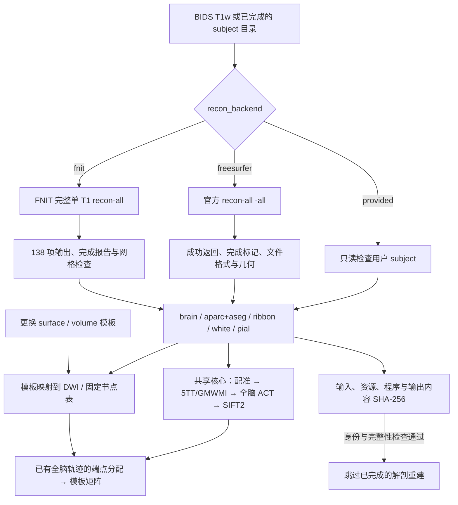

# UKBConnectome_pipeline 的三种 recon-all 来源

## 1. 功能与策略

结构像只在解剖准备阶段重建一次。用户可以提供已经完成的 subject 目录，或明确选择官方 FreeSurfer / FNIT 重建。后续配准、5TT、GMWMI、追踪和 SC 均使用 FNIT 已有实现。



`auto` 是默认值：提供 `freesurfer_subject_dir` 时选择 `provided`，否则选择 `fnit`。FNIT 资源缺失时明确报错；调用官方程序必须显式选择 `freesurfer`。官方分支是用户授权的结构像例外。

FNIT 路径复用 `fnit.recon_all.batch.run_recon_all_python_batch` 的单任务、单设备入口，在新进程中调用完整 `run_recon_all_python`。其实现包含 PyTorch/Numba 和 FNIT Conda 独立源码构建程序，解剖准备先于 TOPUP/EDDY；完整子进程退出后才进入 DWI GPU 阶段，避免 parent 的 EDDY allocator 与重建子进程同时驻留。完整能力、安装方式与当前数值差异见 [recon-all 文档](../recon_all/README.md)。完成检查不代表已与官方逐值等价。

## 2. Python 调用、输入与输出

### 已完成的 subject

```python
from fnit.connectome import UKBConnectome_pipeline

connectome_result = UKBConnectome_pipeline(device="cuda:0").run_bids(
    bids_root="/data/bids",  # 标准 BIDS 数据集，含 DWI/bval/bvec/JSON
    output_dir="/data/results/sub-01",  # 此被试的可重用输出目录
    subject="01",  # BIDS subject 标签；有多个 session 时显式指定 session
    freesurfer_subject_dir="/data/subjects/sub-01",  # 用户已完成的官方或 FNIT subject
    recon_backend="provided",  # 只读消费该目录
    n_seeds=100000,  # 保留既有追踪参数含义
    atlas="fs-aparc",  # 模板或模板配对接口见主说明
)
```

### FNIT recon-all

```python
connectome_result = UKBConnectome_pipeline(device="cuda:0").run_bids(
    bids_root="/data/bids",
    output_dir="/data/results/sub-01",
    subject="01",
    recon_backend="fnit",
    recon_options={
        "weights_dir": "/data/fnit-weights",  # FNIT 安装器校验的模型权重
        "assets_dir": "/data/fnit-recon-assets",  # 固定版本结构像图谱和资产
        "native_bin_dir": "/opt/conda/envs/fnit/bin",  # FNIT 独立源码构建程序
        "threads": 4,  # 每个 subject 总线程预算
        "hemisphere_workers": 1,  # 默认串行；2 使用已有双半球隔离调度
    },
    n_seeds=100000,
    atlas="fs-aparc",
)
```

### 官方 FreeSurfer recon-all

```python
connectome_result = UKBConnectome_pipeline(device="cuda:0").run_bids(
    bids_root="/data/bids",
    output_dir="/data/results/sub-01",
    subject="01",
    recon_backend="freesurfer",
    recon_options={
        "executable": "/opt/freesurfer/bin/recon-all",  # 指定实际官方程序
        "freesurfer_home": "/opt/freesurfer",  # 官方安装根目录
        "threads": 4,  # 传给 -openmp，并设置 OpenMP/ITK 线程预算
    },
    n_seeds=100000,
    atlas="fs-aparc",
)
```

官方分支在独立 Bash 子进程中 source 安装目录的 `SetUpFreeSurfer.sh`，使用完整的官方初始化环境；随后把该目录的 `bin/` 放在 PATH 最前，避免官方脚本误用同名 FNIT 构建程序。MRI 路径作为独立命令参数传入，不插入 shell 字符串。`FS_LICENSE` 从调用进程环境继承；用户自行准备合法许可证。FNIT 不下载、复制或保存许可证内容。

### 输入合同

| 输入 | 格式、内容与检查 |
|---|---|
| `bids_root`、`subject`、可选 session/run/acquisition/direction | 与主流程相同的 BIDS DWI 选择方式；原始 DWI 从选择的扫描处理。 |
| `t1` | 可选显式单幅 T1w；否则从 BIDS 选择。不能同时传入 `t1` 与 `freesurfer_subject_dir`。 |
| `freesurfer_subject_dir` | 已完成 subject 目录，至少包含 `mri/brain.mgz`、`aparc+aseg.mgz`、`ribbon.mgz`、双侧 `surf/*.white` 和 `*.pial`。该目录只读；provided 检查这七个核心文件的格式/几何，不要求官方 done marker 或 FNIT 138 项完整报告。 |
| 体积 | 3D、有有限且可逆 affine；三个核心体积的 shape 和 affine 必须一致；分割为有限的非负整数标签。 |
| 表面 | FreeSurfer 二进制三角网格；坐标有限、面索引合法，同侧 white/pial 有相同顶点数和有序三角面。坐标为 subject 的 surface RAS，单位 mm。 |
| surface 模板依赖 | `sphere.reg`、sphere、annotation 等额外文件由具体模板 builder 检查；七个核心文件检查不代替模板文件检查。 |
| `corrected_dwi`、`rotated_bvecs` | 可选，但必须一起提供；提供时跳过 TOPUP/EDDY，不跳过解剖输入检查。 |

### 所有新增参数

| 参数 | 默认值与含义 |
|---|---|
| `recon_backend` | `"auto"`；允许 auto/provided/freesurfer/fnit。auto 的解析规则见上。 |
| `recon_options` | `None`；backend 对应的 Python mapping。未知键会报错，provided 不接受执行选项。 |
| `threads` | 4；正整数，不接受 bool。 |
| FNIT `weights_dir`、`assets_dir` | 必填目录；沿已有 FNIT 安装与校验流程获取，不自动从系统 FreeSurfer 取文件。 |
| FNIT `native_bin_dir` | `None`，沿成熟入口使用 `FNIT_RECON_ALL_BIN_DIR` 或当前 Conda `bin`。指定时使用该 FNIT 构建目录。 |
| FNIT `profile_stages` | `False`；True 记录已有阶段剖析。 |
| FNIT `cuda_allocator_cache` | `"auto"`；也允许 enabled/disabled，由隔离进程沿已有 API 初始化。 |
| FNIT `hemisphere_workers` | 1；允许1/2，2要求总 threads 至少2，保持原调度的预算含义。 |
| FNIT `native_optimizations` | `"auto"`；也允许 original，沿已有原生能力检查选择。 |
| 官方 `executable` | 未提供时从 PATH 查找 recon-all；仍需显式选择官方 backend。 |
| 官方 `freesurfer_home` | 未提供时继承 `FREESURFER_HOME`；两者都缺失则报错。目录必须含官方 `SetUpFreeSurfer.sh` 和 `FreeSurferEnv.sh`。 |
| `device` | 来自 `UKBConnectome_pipeline(device=...)`，原样传给 FNIT 单设备任务。官方 recon-all 由官方程序执行。 |
| `overwrite` | False；True 发起新的空目录尝试，保留旧结果，不删除用户或历史 subject。 |

### 输出与缓存

BIDS 入口继续返回原来的 connectome 结果。内部 `prepare_bids_connectome` 返回 `BIDSConnectomeInputs`：corrected DWI、bval、rotated bvec、实际 subject 目录、各准备步骤 decision，以及新增 `recon_metadata`。后者包含解析后的 backend、体积/表面格式检查和内容哈希。

下层接口也可直接用于解剖准备：

```python
from fnit.connectome.recon_backend import prepare_recon_subject

recon_result = prepare_recon_subject(
    t1="/data/sub-01_T1w.nii.gz",
    output_dir="/data/results/sub-01",
    subject_name="sub-01",
    recon_backend="fnit",
    recon_options={"weights_dir": "/data/fnit-weights", "assets_dir": "/data/fnit-recon-assets"},
    device="cuda:0",
)
# recon_result.subject_dir 是实际生成或重用的 subject 目录。
# recon_result.stage 为 supplied / completed / skipped。
# recon_result.metadata 为可序列化的来源、完成检查与 SHA-256 字典。
```

生成的目录为 `output_dir/anatomy/<backend>/<subject>-<执行身份哈希前缀>/`；重试在新的 `-attempt-N` 目录运行。成功状态保存在 `output_dir/anatomy/state/*.json`。

官方身份包含实际 recon-all、build-stamp 和两个 setup 脚本的 SHA-256；初始化脚本内容变化也触发重建。重用要求 T1 内容、backend、执行选项与程序身份一致，已产出的 anatomy 内容和完成检查也一致。FNIT 身份另包含源码、权重/资产和实际原生程序的内容 SHA-256。内容变化即使保留相同文件大小和 mtime 也会失效；只有 touch 不触发重建。provided 输入不写入 FNIT 完成标记。更换模板不属于解剖身份，已完成重建可以重用。

失败不发布完成状态。旧实现会在启动官方命令前写入 `fnit_input_state.json`；本版移除该提前写入行为，完成 marker/API、输出和几何检查全部通过后才发布完成缓存。

## 3. 命令行调用

主 CLI 使用同名 backend 和 JSON 选项：

```bash
fnit UKBConnectome_pipeline --bids-root /data/bids --subject 01 \
  --recon-backend provided --freesurfer-subject-dir /data/subjects/sub-01 \
  --atlas fs-aparc --n-seeds 100000 --device cuda:0 \
  --output-dir /data/results/sub-01

fnit UKBConnectome_pipeline --bids-root /data/bids --subject 01 \
  --recon-backend fnit \
  --recon-options '{"weights_dir":"/data/fnit-weights","assets_dir":"/data/fnit-recon-assets","threads":4}' \
  --atlas fs-aparc --n-seeds 100000 --device cuda:0 \
  --output-dir /data/results/sub-01
```

安装仍从主页 Conda 环境与 [FNIT recon-all 安装器](../recon_all/CONDA_CPP_BUILD.md)进行。资产优先从获准分发的固定 FNIT Release 获取，并校验大小/SHA-256；许可未确认的图谱从原作者站点获取。

## 4. 对应原软件调用

官方选项执行的基本命令为：

```bash
export FREESURFER_HOME=/opt/freesurfer
export FS_LICENSE=/path/to/your/legal/license.txt
source "$FREESURFER_HOME/SetUpFreeSurfer.sh"
recon-all -sd /data/subjects -s sub-01 -i /data/sub-01_T1w.nii.gz \
  -all -parallel -openmp 4
```

FNIT 对应入口为：

```bash
fnit-recon-all /data/sub-01_T1w.nii.gz /data/subjects/sub-01 \
  --weights-dir /data/fnit-weights --assets-dir /data/fnit-recon-assets \
  --device cuda:0 --threads 4
```

provided 的目录读取与文件/几何检查没有独立官方重建命令。

自定义模板配对发生在全脑追踪之后。原生注释必须对应实际消费的 subject 顶点顺序；更换重建来源时使用匹配新网格的注释，或从同一 fsaverage 模板映射。跨被试的 volume/surface 两轴应分别提供固定 `nodes_tsv`，格式和缺失节点规则见[模板说明](template_pairs.md#跨被试比较的固定节点表)。

## 5. 当前验证与精度/耗时范围

本功能修改来源选择、完成检查和重用策略，复用原 recon-all 数值实现。专用测试覆盖内容改变且大小/mtime不变、触摸重用、失败不缓存、完整138文件/网格完成报告、非法 volume/surface、后端冲突与源目录只读。[本轮真实 CPU 预检](../../validation/connectome/recon_backends_20261003/README.md)中，10例已有官方 subject 全部通过格式/几何检查；已有 FNIT 队列6例完成138项输出并通过网格报告，2例输出未齐、2例尚无目录。六例FNIT实际输入与原始BIDS T1体素/affine一致，全部原始T1 SHA-256核对下载manifest。专用CPU测试34项通过。它检查已有真实 subject 的可消费性，不计为新的原始 T1 重建或官方数值等价。

最近已有 FNIT recon-all 整例记录绑定 `8d750e2`：两例候选墙钟2248.712和2322.500秒，138项输出齐全、网格检查通过。同期相对基线的几何、分区与统计未变化；官方的既有差异与整体等效未判定仍保留。该历史记录不能改标为本次接入新版本的整例计时。完整表、官方比较和真实脑图见 [已有整例报告](../../validation/recon_all/optimizations/20261002_parallel/FINAL_RESULTS.md)。

十例真实四阶段全部完成，共40次正常CLI调用、400个统计数组核对；首次 1111.52 s、同模板复用 18.83 s、换模板 13.21 s、改半径 19.28 s（逐例范围见报告）。30次核心恢复逐值一致、十例同模板对旧square builder一致；本进程采样峰值5.2995 GB，PyTorch allocated/reserved峰值2.9191/3.3848 GB。十例使用supplied corrected DWI和provided官方subject，首次重新计算共享核心；TOPUP/EDDY和重建不是该十例墙钟的组成部分。新生成官方来源的单例检查、既有FNIT subject预检和SC分别记录，见[新十例报告](../../validation/connectome/paired_pipeline_20261003/README.md)。

### 官方初始化适配器的真实缺陷与修复

本轮 nodecw10、公开 CON01 原始 T1、FreeSurfer 8.2.0-1 的首次新目录调用立即失败：`FREESURFER: Undefined variable.` 当时的版本 `8bc337c4` 仅设置 `FREESURFER_HOME` 和 PATH，没有执行完整官方初始化。实际官方 `recon-all` 使用 `FREESURFER` 等变量，官方 `FreeSurferEnv.sh` 负责设置这些变量。这是来源适配器的环境缺陷；没有解剖数值求解结果，也没有写完成缓存。

修复为完整 source 官方 `SetUpFreeSurfer.sh` 后 exec 独立 argv；保留父环境、许可证环境、线程参数和 subject 输出路径，setup 失败时停止且不写完成状态。两个 setup 脚本的内容哈希纳入缓存身份。首次失败冻结源码和产物保留；修复版使用独立 `official_retry_v2`，不改运行中的十人 provided 源码。修复后的真实单例在CPU完成首次新目录调用：6069.7609秒；第二次1.02243秒返回 `skipped`，同一subject的349个文件内容不变，官方done及格式/几何检查通过。与既有同原始T1官方结果的只读CPU比较用时7.55368秒，brain/aparc+aseg/ribbon体素和bits逐值一致、分割/ribbon label XOR=0，双半球white/pial有序面与float32顶点坐标payload逐值一致，顶点距离全部0 mm。两边同为FreeSurfer8.2.0-d932c45；既有8线程、不启用parallel且亲和性未知，本次4线程、parallel、4CPU亲和性，不能以这两个运行时间判定加速。完整数值、范围、初次失败和冻结版本见 [单例接入记录](../../validation/connectome/paired_generated_official_20261003/README.md)。该单例只验证官方来源适配器，不能用来声明FNIT recon-all数值等价。

## 6. 更新记录

| 日期 | 修改与验证范围 |
|---|---|
| 2026-10-03，官方接入修复 | 真实启动发现完整环境缺失；修复setup/独立argv/安全失败/SHA身份；55项CPU测试通过；真实新目录重建及跳过通过，同源官方七项科学输出严格一致。 |
| 2026-10-03 | 新增 auto/provided/freesurfer/fnit；调用现有完整 FNIT API；成功后才落完成缓存；内容 SHA-256 与 geometry 检查。 |
| 2026-10-03，本轮前 | BIDS入口只能自动调用官方 recon-all或读取用户目录；准备缓存部分依赖mtime，官方 input state 会运行前写入。该分支已被本版来源调度替代。 |

## 7. 原实现与参考文献

- FNIT：[`run_recon_all_python`](../../src/fnit/recon_all/native_free.py)、[单设备 batch 调度](../../src/fnit/recon_all/batch.py)、[138项输出合同](../../src/fnit/recon_all/expected_outputs.py)。
- [FreeSurfer recon-all 官方说明](https://surfer.nmr.mgh.harvard.edu/fswiki/recon-all)。
- [FreeSurfer 源码](https://github.com/freesurfer/freesurfer)。
- Dale AM, Fischl B, Sereno MI. Cortical surface-based analysis. I. Segmentation and surface reconstruction. *NeuroImage*. 1999;9:179–194.
- Fischl B. FreeSurfer. *NeuroImage*. 2012;62:774–781.
