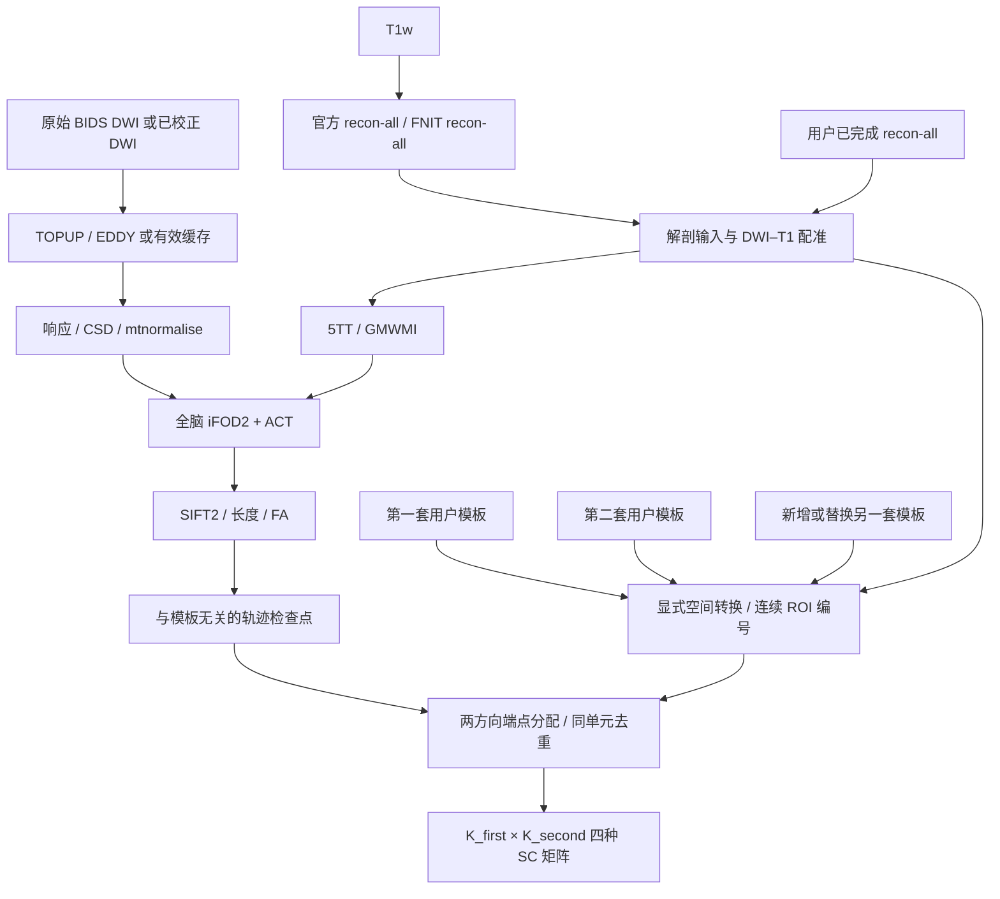
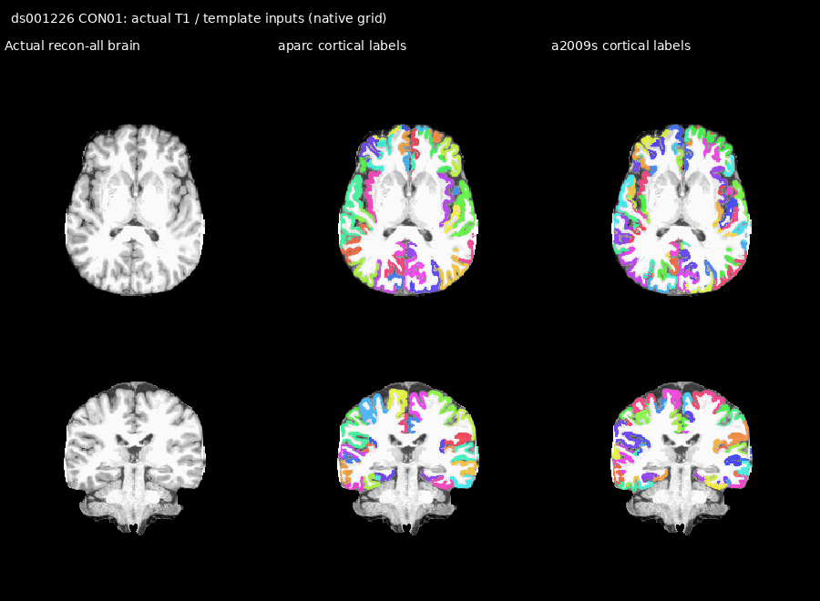

# 两套用户模板之间的结构连接

## 1. 功能与流程

`UKBConnectome_pipeline` 接收一对或多对用户 ROI 模板。每一对的第一张模板定义矩阵的行，第二张定义列；可以是两个 surface 模板、两个 volume 模板，或 surface＋volume。每个 surface 模板本身包含左右半球两个文件。

追踪使用同一份全脑 iFOD2＋ACT 轨迹。播种、传播、ACT 约束及尝试次数由共享核心确定；模板准备后，按已接受轨迹的两个端点筛选第一套 ROI 与第二套 ROI 之间的连接。模板不用于 ROI 播种、waypoint 约束或重新追踪。更换模板仅重做相应标签准备、端点分配和矩阵；已有有效的 DWI、解剖、FOD、追踪与 SIFT2 检查点继续复用。



### 无向轨迹、模板重叠与对角

轨迹 `s` 的端点为 `p0,p1`。各端点分别在两张模板中，按当前 UKB 管线相同的 **4 mm 严格半径**寻找最近的非零标签体素中心；距离正好等于半径时不分配。

一条轨迹的有效单元集合为：

```text
{ (A(p0), B(p1)), (A(p1), B(p0)) }
```

标签为零的组合丢弃；正反方向得到同一单元时只计一次，得到两个不同单元时各计一次。因此交换第一、第二模板得到转置矩阵；模板重叠时，矩阵 count 总和可能大于有效轨迹条数。

跨模板矩阵尺寸为 `K_first × K_second`。行列相同编号不代表同一解剖区，对角无需清零。两个输入为同一个 `TemplateSpec` 时，管线复用原 square builder，保留现有对称矩阵及 self-connections；本次没有改变旧矩阵定义。

## 2. Python 调用、输入和输出

### 管线调用

```python
from fnit import UKBConnectome_pipeline
from fnit.connectome.template_inputs import TemplatePair, TemplateSpec

# 双半球原生注释：必须对应该被试的 white/pial 顶点顺序。
first_template = TemplateSpec(
    name="native_aparc",                # 模板名称，用于输出与缓存记录
    kind="surface",                     # surface 或 volume
    space="native",                     # 已在该 recon-all 被试原生表面
    left_path="templates/lh.custom.annot",
    right_path="templates/rh.custom.annot",
    nodes_tsv="templates/cortex_nodes.tsv",  # 跨被试使用同一行顺序和 ROI 定义
)

# 体积标签：affine 和标签属于该被试 recon-all brain 的 scanner RAS。
second_template = TemplateSpec(
    name="native_subcortex",
    kind="volume",
    space="t1",
    volume_path="templates/subcortex_t1.nii.gz",
    nodes_tsv="templates/subcortex_nodes.tsv",  # 保留未出现的声明节点
)

pipeline = UKBConnectome_pipeline(device="cuda:0")
result = pipeline.run_bids(
    bids_root="bids_dataset",             # 标准 BIDS 根目录
    subject="001",                        # 不含 sub- 的被试编号
    output_dir="derivatives/connectome/sub-001",
    freesurfer_subject_dir="subjects/sub-001",
    recon_backend="provided",            # 读取用户已完成的 recon-all
    template_pairs=[TemplatePair(
        name="cortex_to_subcortex",
        first=first_template,
        second=second_template,
    )],
    n_seeds=100000,                        # 尝试播种次数，模板不会改变它
    seed=0,
    assignment_radius=4.0,                 # mm；默认保持现有 UKB 定义
)

pair_result = result.pair_results["cortex_to_subcortex"]
print(pair_result.matrices["count"].shape)  # K_first × K_second
```

`recon_backend` 的管线策略与缓存由主管线管理；见[主流程说明](README.md)。`prepare_template()` 只读取已有解剖与变换，`build_pair_connectomes()` 只处理现有轨迹端点。管线的 `build_template_pairs()` 在 MNI 模板未提供变换时可调用并缓存一次现有 SynthMorph joint 配准。

### TemplateSpec 参数

| 参数 | 默认值 | 输入含义 |
|---|---|---|
| `name` | 必填 | 非空模板名称；不能包含路径分隔符、换行或 `.`/`..` |
| `kind` | 必填 | `surface` 或 `volume` |
| `space` | 必填 | Volume：`dwi`、`t1`、`mni`；surface：`native`、`fsaverage` |
| `volume_path` | `None` | Volume 的 3D 整数 NIfTI 或 MGH/MGZ；背景和 ROI 标签必须有限且为整数 |
| `left_path` / `right_path` | `None` | Surface 的左右 `.annot` 或 `.label.gii`；GIFTI 必须含一个 LABEL 数组和完整 label table |
| `fsaverage_dir` | `None` | `space='fsaverage'` 必填；包含双半球 `surf/*.sphere.reg`，且与输入注释的顶点几何相符 |
| `nodes_tsv` | `None` | 单人可省略；跨被试比较为每套模板提供固定的 ROI 编号、顺序、名称和半球表。声明节点即使没有体素也保留 |
| `background_labels` | `(0,-1)` | 明确排除的原始背景标签；JSON 可用整数数组 |

单侧 surface ROI 仍须提供左右两个合法标签文件，以保留顶点几何检查。没有 ROI 的半球可以全部为 `background_labels`，且不在 `nodes.tsv` 中声明该半球的节点；自动 label table 也可只含背景。这种模板只输出真实/声明的节点，例如左侧单 ROI 与右侧单 ROI 可形成 **1×1 SS**，不需添加虚构的对侧 ROI。任一未声明的非背景顶点仍报错；整个模板至少有一个真实或声明节点。

Surface 的 `.annot` 原始 ID 是 nibabel 读取的 **color table 行索引**，不是 packed RGB 编码。左右半球可各自拥有相同原始 ID，连续矩阵编号仍独立。GIFTI 的原始 ID 是 label table 的整数 key。

Volume 的 `dwi` 指已校正 DWI 的 scanner RAS，可使用另一个采样网格；`t1` 指当前 recon-all `brain.mgz` 的 scanner RAS，不能直接传 surface RAS 或 voxel 坐标。模板属于其他 T1 世界坐标系时，应先提供正确变换后的标签图。路径名称不用于猜测空间。

MNI 模板需要既有的 MNI→T1 SynthMorph transform，或管线所需的 MNI T1 reference。标签用 `apply_transform(method='nearest', dtype='int32')` 转到 T1，再用原整数最近邻函数转到 DWI。模板与配准参考须属于同一 MNI/RAS 世界坐标系，可以使用不同体素网格：target-grid RAS-mm 位移场保持不变，只将源几何绑定到标签网格，不提前重采样标签。目标几何须匹配 T1 reference；方向或目标不符时报错。

节点表格式如下；`original_label`、`name` 必填，`index` 省略时按文件顺序，volume 的 `hemisphere` 可省略，surface 必须为 `L`/`R`。

```tsv
index	original_label	hemisphere	name
1	1001	L	left_region
2	2002	R	right_region
3	9009		declared_but_absent_region
```

`index` 必须为按行顺序排列的 `1..K`。Volume 的原始 ID 在整张表中唯一；surface 的 `(hemisphere, original_label)` 组合唯一，左右半球可共用同一原始 ID。声明 ID 不能属于背景。输入出现了节点表未声明且未列为背景的 ID 会明确报错。未提供节点表时，volume 按源标签图实际存在的非背景 ID 从小到大编号；surface 按左右半球完整 label table 编号，保留表中未出现的 ROI。

### 跨被试比较的固定节点表

每套模板分别使用固定的 `nodes_tsv`，让不同被试的 `rows.tsv`、`columns.tsv` 保持相同 ROI 含义与顺序。例如一位被试的 volume 只含 ID `10,30`，另一位含 `10,20,30`；省略节点表会产生两节点和三节点的不同轴。共同表声明 `10,20,30` 后，两者都保留三节点；缺失的 ID 20 对应零行或零列。

固定表应绑定模板版本、原始 ID、名称与半球，不能只比较矩阵形状或连续编号。Surface 的完整 LUT 通常能保留缺失 ROI，跨模板版本或重建来源时仍需核对相同 ID 的含义。输出 `rows.tsv`、`columns.tsv` 是实际两轴的定义，组分析前逐项检查。

### 独立函数及参数

```python
from fnit.connectome.template_inputs import prepare_template
from fnit.connectome.paired_assignment import build_pair_connectomes

first = prepare_template(
    first_template,
    subject_dir="subjects/sub-001",       # 完成的 recon-all；surface 必填
    dwi_shape=corrected_dwi.shape[:3],      # 三维目标形状
    dwi_affine=corrected_dwi.affine,        # voxel → scanner RAS，mm
    dwi_to_t1_world=dwi_to_t1_world,        # DWI scanner RAS → T1 scanner RAS
    t1_reference_path="subjects/sub-001/mri/brain.mgz",
    mni_to_t1_transform=None,              # MNI 模板时传现有 transform/路径
    device="cuda:0",
)
# second 同样 prepare，返回 labels、affine 和完整 nodes。
matrices = build_pair_connectomes(
    endpoints=tracks.endpoints,            # [N,2,3]，scanner RAS mm
    first_atlas=first.labels,
    first_affine=first.affine,
    second_atlas=second.labels,
    second_affine=second.affine,
    weights=sift2_weights,                 # [N]；省略则不输出 sift2_fbc
    lengths=tracks.lengths_mm,             # [N]，mm
    fa=tracks.mean_fa,                     # [N]，逐轨迹平均 FA
    first_node_count=len(first.nodes),     # 保留无体素/无连接的行
    second_node_count=len(second.nodes),   # 保留无体素/无连接的列
    radius=4.0,
    batch_size=1024,                       # 轨迹候选批次；内部按候选内存缩小
    same_template=False,                  # 同一模板时为 True，复用旧 square builder
)
```

`prepare_template()` 的 `subject_dir` 对 volume 可为 `None`；`t1_reference_path` 和 `mni_to_t1_transform` 仅 MNI 分支必填。`dwi_to_t1_world` 仅 `space='dwi'` 可省略。它返回 `PreparedTemplate(spec, labels, affine, nodes)`，`labels` 是 DWI 网格 int32 标签 `0..K`。

`build_pair_connectomes()` 以端点所在设备计算。count 使用 int64，输入坐标/逐轨迹统计保持现有 float32，求和保持现有 float64；没有增加低精度或近似。四种矩阵分别为轨迹数、SIFT2 权重和、SIFT2 加权长度均值及加权 FA 均值；没有权重时均值为普通平均，空单元为零。

配对 CLI 输出到 `output_dir/pairs/<pair-name>/`。Python `run_bids()` 从内存中的 `result.pair_results` 读取矩阵、节点与标签；需要这些文件时由用户保存，Python 接口不会自动写出下列配对文件：

- `connectome_count.csv`、`connectome_sift2_fbc.csv`、`connectome_mean_length.csv`、`connectome_mean_fa.csv`：行列按各自节点表排列。
- `rows.tsv`、`columns.tsv`：两轴的 `index/original_label/hemisphere/name`。
- `first_atlas_dwi.nii.gz`、`second_atlas_dwi.nii.gz`：用于分配端点的实际整数标签。
- `pair.json`：该对模板与输出记录；`pairs_run_state.json` 保存缓存和处理阶段状态。

## 3. 命令行

将 pair 定义写入 `template_pairs.json`。路径可以相对该 JSON 文件所在目录。

```json
{
  "pairs": [
    {
      "name": "cortex_to_subcortex",
      "first": {
        "name": "custom_cortex",
        "kind": "surface",
        "space": "native",
        "left_path": "lh.custom.annot",
        "right_path": "rh.custom.annot"
      },
      "second": {
        "name": "custom_subcortex",
        "kind": "volume",
        "space": "t1",
        "volume_path": "subcortex_t1.nii.gz",
        "nodes_tsv": "subcortex_nodes.tsv"
      }
    }
  ]
}
```

```bash
fnit UKBConnectome_pipeline \
  --bids-root bids_dataset \
  --subject 001 \
  --freesurfer-subject-dir subjects/sub-001 \
  --recon-backend provided \
  --template-pairs template_pairs.json \
  --assignment-radius 4 \
  --n-seeds 100000 --seed 0 --device cuda:0 \
  --output-dir derivatives/connectome/sub-001
```

使用同一输出目录并传入新的 `--template-pairs`，管线检查输入哈希与检查点后跳过有效共享步骤。`--checkpoint-dir` 可显式指定共享检查点目录；模板修改只使相关模板与矩阵缓存失效。修改 DWI、解剖、播种次数、种子或追踪参数则按依赖使共享步骤失效。MNI 标签可另传 `--mni-to-t1-transform`，或让管线根据 `--mni-template` 生成并缓存一次 SynthMorph joint 配准。

原始 BIDS 模式在重建或 DWI staging 写文件之前检查用户模板、显式 T1、原始输入与实际输出位置。不要把用户输入放进本次会写入的 `preproc/raw`、`preproc/eddy`、启用 TOPUP 时的 `preproc/topup`，或启用新重建时的 anatomy 后端/状态目录。文件或目录符号链接也检查其实际目标；即使 `--overwrite`，也不允许覆盖本次用户输入。已有 corrected DWI 和 rotated bvec 从旧 `preproc/eddy` 目录提供时，本次不写该预处理目录，仍可正常只读复用。

对会原位写入的 TOPUP/EDDY 文件和准备侧文件，也检查已有目标是否与用户输入指向同一硬链接 inode。成熟 BIDS staging 先删除旧别名，再建立符号链接；这一操作，以及矩阵文件的原子替换，都不修改外部输入 inode，因此正常二次运行不会因 staging 别名被误拒绝。

MNI 模板的缓存另绑定实际 `t1_reference_path` 内容与网格；在缓存命中时也检查 warp target 与 T1 是否一致。改变参考会使相关映射失效，恢复同一参考可命中原缓存；映射或恢复过程中参考发生变化则报错，避免发布或返回失效结果。这个修复只补齐输入保护和缓存依赖，没有改变配准、最近邻采样、追踪或矩阵定义。

## 4. 对应原软件步骤

FNIT 模板准备复用已有 PyTorch 球面最近邻、pial/white→ribbon 投影和整数体积重采样。对应参考步骤：

```bash
# fsaverage 注释 → 被试原生表面；两个半球分别执行。
mri_surf2surf --srcsubject fsaverage --trgsubject SUBJECT \
  --hemi lh --sval-annot lh.template.annot --tval lh.native.annot

# MNI 标签 → T1：先获得 MNI→T1 配准，再用 nearest 作用于标签。
mri_synthmorph register -m joint -t mni_to_t1.mgz MNI_T1.nii.gz brain.mgz
mri_synthmorph apply -m nearest -t int32 mni_to_t1.mgz atlas_mni.nii.gz atlas_t1.nii.gz

# 单张连续 atlas 的现有矩阵参考。
tck2connectome tracks.tck atlas_dwi.nii.gz count.csv \
  -symmetric -assignment_radial_search 4
```

原 UKB surface→volume 步骤为 `map_surface_label_to_volume.py`。稀疏 ID 转连续编号对应 `labelconvert` 的功能。

MRtrix 的上述 `tck2connectome` 命令接收一张标签图；它没有本页定义的、对两张重叠模板分别搜索与去重的单个等价命令。两模板结果用同一 TCK 的逐轨迹端点 oracle 核对；原单模板 builder 继续用已有官方比较。合并两图后直接截取矩阵，仅在两图不重叠且端点半径内模板归属无歧义时可用作额外参考，不能代替一般重叠场景的 oracle。

## 5. 当前验证、精度与时间

本页新组件基于 `231dfaa1`，首个实现提交 `ea3cb054`。已执行的独立 CPU 回归包含原 endpoint assignment/surface/FreeSurfer 节点测试和新 pair 测试，**30 passed**。新测试覆盖双向匹配、重叠去重、交换轴、严格半径、空节点、两模板不同 affine、旧 square 四矩阵逐值保持，以及 native/fsaverage/GIFTI/MNI 已有变换分支。

单侧 ROI 修复 `3e43f05f` 在独立 CPU 环境完成 **52 passed**（新单侧回归15条＋旧模板/CLI测试37条，pytest 5.34 s）。覆盖左右单侧、native/fsaverage、自动 LUT/显式 TSV、真实小型表面投影、1×1 SS/SV、未知非背景拒绝和旧双半球输出。线程4、CPU affinity4–7，CUDA 隐藏且初始化前后均为 False；源码内容核验前后相同。[原 CPU 报告](../../validation/connectome/paired_20261003/task_03/single_hemisphere/focused_cpu_report.json)、[日志](../../validation/connectome/paired_20261003/task_03/single_hemisphere/focused_cpu.log)保留实际版本。测试使用小型模拟 MRI/表面，既不代表真实影像精度，也不代表 GPU 耗时；已运行的十例 benchmark 冻结源码没有切换到此修复。

本子任务真实数据验证使用十例公开 ds001226 的已完成 recon-all，逐例读取双半球 aparc/a2009s 注释与两种真实体积标签；CON01 另将四张模板投影到实际 corrected-DWI 网格。此验证的精度、耗时、源哈希见[专属记录](../../validation/connectome/template_pairs_20261003/task_02/README.md)。它只验证模板准备。本次配对 SC 的四阶段 GPU benchmark **10/10已完成**；使用 supplied corrected DWI 与 provided 官方解剖，每例重新计算共享核心、验证 SS/VV/SV 和换模板缓存。完成数量以[统一评测记录](../../validation/connectome/paired_pipeline_20261003/README.md)的实际 public summary 为准，不用本页测试或历史 raw→SC 指标代替。



图示实际原生 T1 输入与两张 volume 模板的皮层标签。真实输出标签可在 `first_atlas_dwi.nii.gz` / `second_atlas_dwi.nii.gz` 与 corrected mean b0 上叠加检查；矩阵两轴必须对应 `rows.tsv` / `columns.tsv`。该图展示输入空间，不代替十人 DWI 分配与 SC 精度验证。

十例真实四阶段全部完成，共40次正常CLI调用、400个统计数组核对；首次 1111.52 s、同模板复用 18.83 s、换模板 13.21 s、改半径 19.28 s（逐例范围见报告）。30次核心恢复逐值一致、十例同模板对旧square builder一致；本进程采样峰值5.2995 GB，PyTorch allocated/reserved峰值2.9191/3.3848 GB。实际输出脑图、分步时间及源码绑定见[十例配对评测](../../validation/connectome/paired_pipeline_20261003/README.md)。该结果验证模板矩阵与缓存数值一致；独立MRtrix原始DWI→SC对照属于主说明中的历史精度轮。

## 6. 更新和 benchmark 记录

| 日期 | 版本/范围 | 更新与实际验证 |
|---|---|---|
| 2026-10-03 | `ea3cb054`，paired template 首版 | 显式空间与节点表、SS/VV/SV 矩形四矩阵；提取原 endpoint search 并保持旧统计；后续补齐 30 项 CPU 回归 |
| 2026-10-03 | 本次专属真实输入记录 | 十例读取＋CON01 四模板 DWI 准备；结果与源码哈希独立保存 |
| 2026-10-03 | `3e43f05f`，单侧 surface ROI | 全背景半球允许无节点，未知非背景仍拒绝；52 条 CPU 回归通过，旧双半球分支与矩阵定义保持 |
| 2026-10-03 | 输入保护与 MNI 缓存修复 | 写前检查 active preparation 目录、symlink 与原位 writer hardlink；MNI 映射绑定 T1 内容/网格并检查恢复期间变化。CPU 4 线程、interop 4、affinity 4–7、CUDA 隐藏：86 项焦点回归通过，10.93 秒。[源码与运行收据](../../validation/connectome/paired_pipeline_20261003/protection_mni_cpu_gate_receipt.json)和[原始成功日志](../../validation/connectome/paired_pipeline_20261003/protection_mni_cpu_gate.log)绑定 `2dcbdda9`；这是程序正确性测试时间，真实 SC benchmark 仍以冻结版记录为准。 |
| 2026-10-03 | 前轮 SC 精度版本 `0bd7d368` | 原固定 TCK count 对官方逐值一致；独立 raw→SC 仍有未匹配项，详见[前轮报告](ACCURACY_OPTIMIZATION_20261003.md)；此结果不代表新 pair 矩阵精度 |

## 7. 参考文献与源码

- [FNIT paired assignment](../../src/fnit/connectome/paired_assignment.py)、[模板输入与准备](../../src/fnit/connectome/template_inputs.py)、[原 endpoint assignment](../../src/fnit/connectome/assignment.py)。
- [UKB-connectomics 原仓库](https://github.com/sina-mansour/UKB-connectomics)。
- [MRtrix tck2connectome](https://mrtrix.readthedocs.io/en/latest/reference/commands/tck2connectome.html)、[FreeSurfer mri_surf2surf](https://surfer.nmr.mgh.harvard.edu/fswiki/mri_surf2surf)、[SynthMorph](https://surfer.nmr.mgh.harvard.edu/docs/synthmorph/)。
- Tournier JD et al. MRtrix3: A fast, flexible and open software framework for medical image processing and visualisation. *NeuroImage* 202, 116137 (2019). [DOI](https://doi.org/10.1016/j.neuroimage.2019.116137)。
- Smith RE et al. Anatomically-constrained tractography: improved diffusion MRI streamlines tractography through effective use of anatomical information. *NeuroImage* 62, 1924–1938 (2012). [DOI](https://doi.org/10.1016/j.neuroimage.2012.06.005)。
- Smith RE et al. SIFT2: Enabling dense quantitative assessment of brain white matter connectivity using streamlines tractography. *NeuroImage* 119, 338–351 (2015). [DOI](https://doi.org/10.1016/j.neuroimage.2015.06.092)。

用户提供的模板不会随包复制或发布。模板许可、版本与各文件 SHA 应与结果一起保存；使用固定 Release 的资产时沿用项目清单校验。
