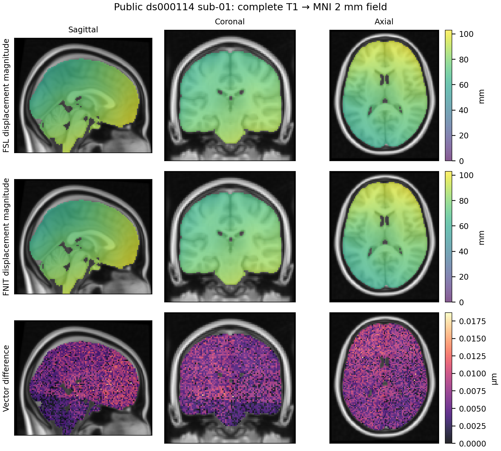

# TorchConvertWarp：组合线性矩阵与非线性场

`TorchConvertWarp` 生成标准空间网格上的 FSL pull 位移场。它支持两类输入：FSL dense/FNIRT 系数场及可选的前后 FLIRT 矩阵；FNIT MMORF 的参考图像轴毫米场及其独立的 FA→MNI FLIRT 矩阵。前一类按 `premat → warp1 → postmat` 组合；后一类先把 MMORF 坐标约定换成 FSL scaled-mm，再把 affine 和非线性变换合为一张场。矩阵不能直接用 NIfTI 的 RAS affine 代替。运行时只使用本包代码、Nibabel、NumPy 和 PyTorch，不调用 FSL。

FNIT dMRI pipeline 的 **TBSS** 输出 `registration/dti_FA_to_MNI_warp.nii.gz` 已经含 FA→MNI 线性部分；将它交给 `warp1` 时**不要**再传 `dti_FA_to_MNI_affine.mat`。**MMORF** 输出 `registration/mmorf_warp.nii.gz` 则是另一种坐标约定，必须使用下述 `from_mmorf` / `--mmorf-warp` 和同目录的 `dti_FA_to_MNI_affine.mat`。这两个分支共用后续 [TorchInvWarp](../invwarp/README.md)。

## Python 单被试调用与输入输出

### 参数

| 参数 | 默认值 | 输入和含义 |
|---|---|---|
| `device` | `"cpu"` | 计算设备；可选 `"cuda:0"` 等可用 CUDA 设备。不可用的 CUDA 设备报错。 |
| `reference` | 必填 | 三维 NIfTI 路径或 Nibabel NIfTI 对象；定义输出 shape、affine、qform 和 sform。 |
| `warp1` | 必填 | 末轴长 3 的 dense 场，或含原始 FNIRT 头信息的 intent-2007 三次样条系数；支持文件路径和 NIfTI 对象。 |
| `premat` | `None` | 输入空间到 `warp1` 源空间的 FLIRT scaled-mm 4×4 矩阵；`None` 是恒等矩阵。接受文本 `.mat` 路径或 NumPy 数组。 |
| `postmat` | `None` | `warp1` 目标空间到最终 `reference` 空间的 FLIRT scaled-mm 矩阵；格式同 `premat`。 |
| `warp_convention` | `"auto"` | dense 场用 `auto`、`relative` / `rel` 或 `absolute` / `abs`；intent 2006 始终按相对场读取，intent 2007 始终按样条系数读取。无明确 intent 的 `auto` 使用 FSL 场标准差启发式。 |
| `output_convention` | `"relative"` | `relative` 保存位移，`absolute` 保存绝对 pull 坐标；单位都是 FSL scaled-mm。 |
| `output` | `run()` 必填 | 输出 `.nii` 或 `.nii.gz`；父目录自动创建。Python `save()` 可覆盖同名文件，CLI 需 `--overwrite`。 |

矩阵须有限、可逆且最后一行为 `[0, 0, 0, 1]`。dense 场和样条系数中的 NaN/Inf 会报错。reference 必须是三维影像，不能用四维时间序列代替；其影像强度不参与变换组合。

```python
from fnit import TorchConvertWarp

result = TorchConvertWarp(device="cuda:0").run(
    reference="/data/MNI152_T1_2mm.nii.gz",  # 输出场的 MNI 网格，对应 --ref
    warp1="/data/T1_to_MNI_warp.nii.gz",  # T1→MNI 的 FSL dense warp 或 FNIRT 三次样条系数，对应 --warp1
    premat="/data/diff_to_T1.mat",  # diffusion→T1 的 FLIRT 4×4 scaled-mm 矩阵，对应 --premat
    postmat=None,  # 可选的 warp 目标→最终参考空间矩阵，对应 --postmat
    warp_convention="auto",  # 按 FSL intent 自动识别 warp1；也可指定 relative 或 absolute
    output_convention="relative",  # 输出相对位移；absolute 输出绝对 pull 坐标
    output="/data/diff_to_MNI_warp.nii.gz",  # 输出 4D NIfTI，末轴长 3，float32，单位 mm
)
print(result.image.shape, result.valid_fraction, result.qc)
```

`result.image` 是保存后的 NIfTI 对象；`valid_fraction` 是采样 `warp1` 时落在其网格内的输出体素比例；`qc` 记录坐标约定和变换顺序。输出 shape 是 `reference.shape + (3,)`，affine、qform、sform 沿用 `reference`。相对场保存为 FSL `convertwarp --relout` 的 dense 形式；`warp1` 可为 FSL intent-2006 dense 位移或 intent-2007 三次样条系数。当前实现覆盖一张非线性场及其前后矩阵，不提供 FSL `--warp2`、shiftmap 或 Jacobian 选项。

`TorchConvertWarp(device)(...)` 只返回结果，不写文件；`result.save(output)` 写出该结果并返回自身。便捷函数 `fnit.convertwarp.convertwarp(reference, warp1, device=..., ...)` 使用相同参数。dense 输出为 float32、intent 0；空间几何和矩阵计算保留 float64，不使用 float16 或 bfloat16。查询在 warp 网格内时使用三线性取样，网格外按 FSL `convertwarp` 规则，用整张绝对组合场的最小二乘 affine 外推；`valid_fraction` 单独记录未越界比例。

### 直接使用 FNIT pipeline 的两类输出

```python
from fnit import TorchConvertWarp

model = TorchConvertWarp(device="cuda:0")  # PyTorch 计算设备
tbss = model.run(
    reference="/data/subject_tbss/registration/standard/FA.nii.gz",  # TBSS MNI 网格
    warp1="/data/subject_tbss/registration/dti_FA_to_MNI_warp.nii.gz",  # 已含 affine 的 FNIRT 系数
    premat=None,  # TBSS 不再次应用 dti_FA_to_MNI_affine.mat
    output="/data/subject_tbss/diff_to_MNI_FSL_warp.nii.gz",  # dense 相对场
)
mmorf = model.run_mmorf(
    reference="/data/subject_mmorf/registration/standard/FA.nii.gz",  # MMORF 的 MNI 网格
    source="/data/subject_mmorf/native/dti_FA.nii.gz",  # FLIRT 矩阵的 native FA 输入网格
    mmorf_warp="/data/subject_mmorf/registration/mmorf_warp.nii.gz",  # 参考图像轴 mm 场
    affine="/data/subject_mmorf/registration/dti_FA_to_MNI_affine.mat",  # native FA→MNI 矩阵
    output="/data/subject_mmorf/diff_to_MNI_FSL_warp.nii.gz",  # FSL scaled-mm dense 相对场
)
```

`run_mmorf` 的 `source` 是产生 affine 的 FA 原图；若概率追踪使用的 BEDPOSTX mask 不与它同 shape 和 affine，须先取得两者之间的配准，不能直接复用这个场。`mmorf.image`、`mmorf.valid_fraction`、`mmorf.qc` 与标准 `run()` 的返回结构相同。MMORF 原场不能直接输入 FSL `convertwarp`；`run_mmorf` 是 FNIT 额外提供的坐标转换。单被试 CLI 对应 `fnit convertwarp --ref ... --source ... --mmorf-warp ... --premat ... --out ... --device cuda:0`，其中 `--premat` 在此模式指 FA→MNI 矩阵。

`from_mmorf(reference, source, mmorf_warp, affine=..., output_convention="relative")` 返回未保存的结果，`run_mmorf(..., output=...)` 同时保存。MMORF 的额外输入如下：

| 参数 | 输入和检查 |
|---|---|
| `source` | 三维 FA 原图，定义 FLIRT 源空间；支持 NIfTI 路径或对象。 |
| `mmorf_warp` | `reference.shape + (3,)` 的 float32 场，位移方向沿参考影像轴、单位 mm；shape 和 affine 必须与 `reference` 相同。NaN/Inf 报错。 |
| `affine` | 必填的 source→reference FLIRT scaled-mm 文本矩阵或 NumPy 数组。 |

该模式在同一参考网格直接读取每个 MMORF 向量，因此 `valid_fraction=1` 表示输入场在整个参考网格有值；它不表示拉回坐标都落在 `source` 内。QC 中 `input_convention` 为 `MMORF reference-axis mm`。

## 命令行调用

```bash
# --ref 指定 MNI 输出网格；--warp1 指定 T1→MNI 非线性场。
# --premat 指定 diffusion→T1 线性矩阵；--out 写出组合场。
fnit convertwarp --ref /data/MNI152_T1_2mm.nii.gz \
  --warp1 /data/T1_to_MNI_warp.nii.gz \
  --premat /data/diff_to_T1.mat \
  --out /data/diff_to_MNI_warp.nii.gz --relout --device cuda:0
```

独立入口 `fnit-convertwarp` 接受相同选项。`--absout` 改写为绝对 pull 坐标；`--rel` / `--abs` 可显式声明输入 dense warp 的约定；`--overwrite` 允许覆盖已有输出。输入系数场的 intent 仍决定其解释方式。

MMORF 模式必须同时提供 `--source` 和 `--premat`，不能提供 `--postmat`、`--rel` 或 `--abs`；标准 `--warp1` 模式不能提供 `--source`。参数互斥或缺失会报错。

## 原软件调用与支持范围

```bash
# 同一组 reference、warp1 与 premat；包括读取、组合和保存。
convertwarp --ref=/data/MNI152_T1_2mm.nii.gz \
  --warp1=/data/T1_to_MNI_warp.nii.gz \
  --premat=/data/diff_to_T1.mat \
  --out=/data/fsl_diff_to_MNI_warp.nii.gz --relout
```

| 功能 | FNIT | 官方对照方式 |
|---|---|---|
| intent-2006 dense 相对场 | 支持 | `convertwarp --warp1=...` |
| 无明确 intent 的 dense 相对/绝对场 | 支持；可显式指定或 `auto` 判断 | `--rel` / `--abs`，或原程序默认判断 |
| intent-2007 三次样条系数及其嵌入 affine | 支持 | `--warp1=...` 保留完整原始 NIfTI 头信息 |
| premat、postmat 和两者同时组合 | 支持 | `--premat=... --postmat=...` |
| 相对和绝对输出 | 支持 | `--relout` / `--absout` |
| reference 网格、保存、命令行入口 | 支持 | 读取同一 `--ref` 并输出完整场 |
| MMORF 参考影像轴 mm 到 FSL scaled-mm 转换 | FNIT 扩展 | 没有直接对应的原版 `convertwarp` 命令；另核对 MMORF 原重采样路径。 |
| warp2、midmat、shiftmap、Jacobian 计算/约束 | 不支持 | 不把这些原程序选项计入已验证范围。 |
| intent-2008 DCT、intent-2009 二次样条系数 | 不支持；明确报错 | 先在隔离的参考处理中用原程序转成 dense 场。 |

官方程序只用于独立 benchmark，FNIT 生产接口不启动这些命令。[FSL FNIRT 官方说明](https://fsl.fmrib.ox.ac.uk/fsl/docs/registration/fnirt/user_guide.html#convertwarp)解释了原软件的场组合选项。

## 当前 CPU 实现与真实数据对照

2026-10-04 的 CPU 修改复用 TorchApplyWarp 的 CPU 三线性取样器：通道相邻存储，并按调用方的现有线程数分割查询。默认或显式恒等 `premat` / `postmat` 不再对整个 float64 坐标卷重复做矩阵乘法。MMORF 的 CPU 绝对输出不再构造未使用的参考 scaled-mm 网格。非恒等矩阵、网格内取样坐标、float32 输出和 CUDA 网格内算式保持原有语义；网格外组合按下述真实对照修复。

供 InvWarp 重复查询的 `_PullField.sample` 还对有限、连续、无梯度的 CPU FP64 查询使用静态对角分支：仅严格对角和正零平移适用，逐轴乘法再加原平移保留 FP64 舍入。普通单次 ConvertWarp、非有限值、其他矩阵和布局、梯度及 CUDA 使用原矩阵乘法；embedded inverse 的乘法原样保留。完整逆场 1/8 线程 old/new 的全部保存文件、QC、有效比例和停止次数一致；异常合同及各一次完整观察见 [CPU 静态坐标记录](../applywarp/CPU_NORMALIZATION_20261004.md#prepared-cpu-静态对角坐标优化)。

源 v28 另在 `_PullField.sample` 的 prepared CPU 系数查询中减少 embedded affine 加法分配：query、embedded matrix 和 sampled values 必须全部为 FP64，并且没有梯度、forward AD 或 `torch.func` 变换；本次 GEMM 新建的数组先加平移，再加插值位移，两步舍入与返回存储独立性不变。普通单次 ConvertWarp、mixed dtype、CUDA 及 AD 路径保留原算式。该分支用于 InvWarp 反复取样；没有改变 ConvertWarp 的网格外 affine 外推。[nodecw8 完整逆场诊断](../invwarp/assets/cpu-allocation-v2-node8-20261004.public.json)验证 1/8 核各一次完整保存文件、QC 与 30 次停止规则均与 v26 相同；时间只属于该完整逆场病例，不能写作 ConvertWarp 官方速度。定向回归另覆盖 signed zero、非有限值、布局、混合类型提升、fresh/no-alias 返回和 AD 回退。源 v28 的[H100 完整逆场与 TBSS 回归](../../validation/multimodal_cpu_20261004/gpu_cpu_final_v28_ready_retry_20261004.public.json)完成 32 次完整保存调用，所有输出数值和元数据逐位一致，旧新对应调用的峰值显存相同；该证据属于共享子函数所在的真实全流程，不代替单次 ConvertWarp benchmark。

**成熟子函数修复：**`from_mmorf` 原来会接受含 NaN/Inf 的场并返回 `valid_fraction=1`；现在在读入场时拒绝非有限值。正常有限场的坐标转换和接口不变。

真实 CPU 对照还发现，原实现对 `postmat` 移到 warp 网格外的查询使用残差边界延伸，而原版 `concat_warps` 对这些点使用整张绝对 prewarp 的 `best_fit_aff`。旧候选的两矩阵案例在 27,829 个越界体素出现最高 `5.0381 mm` 的差异，其中 30 个属于参考影像正值区域；场内最高差异为 `2.4796×10⁻⁵ mm`。现在只在 ConvertWarp 的静态查询网格可能越界时，拟合 float32 绝对组合场的 affine 并替换网格外值。拟合用 float64 轴边缘归约，不创建整卷设计矩阵；InvWarp 的迭代取样规则保持原样。已用冻结 v7 的 CPU 1/8 和 H100 复测，相对/绝对组合场全视野最大差分别为 `2.4796×10⁻⁵` / `3.0518×10⁻⁵ mm`。`10⁻⁷ voxel` 的极小 postmat 也按 FSL 严格边界处理，旧版 `2.4466 mm` 的外场错误已修复。

nodecw10 本次官方配对使用独立物理核，CPU 1/8 线程分别为 `65` 和 `65,69,73,77,81,85,89,93`，组内原版与 FNIT 串行交替，均完整读入和保存。默认系数→相对场的完整进程中位时间为 FSL/FNIT `3.2809/2.1275 s`（1 CPU）和 `3.3974/2.2781 s`（8 CPU）。全部支持模式及最新完成状态见[CPU/GPU benchmark 记录](CPU_BENCHMARK_20261004.md)和[公开机器报告](benchmark_20261004.public.json)。

默认系数场的最新独立官方 CPU 记录如下；每预算完整 warmup 一次、三次配对，表列包含启动、导入、全量读取、转换和保存的中位数。数据绑定 [v7 功能报告](benchmark_20261004.public.json)，后续 prepared CPU 分支用于 InvWarp 迭代，不改变这里的单次转换入口。

| 完整系数转换 | 1 CPU：FSL / FNIT（s） | 8 CPU：FSL / FNIT（s） | 全场最大差（mm） |
|---|---:|---:|---:|
| 相对输出 | 3.2809 / 2.1275 | 3.3974 / 2.2781 | 9.53674e-6 |
| 绝对输出 | 3.0768 / 2.0702 | 3.2954 / 2.2388 | 1.52588e-5 |

专用 adapter 为 [`tools/benchmark_multimodal_cpu_convertwarp.py`](../../tools/benchmark_multimodal_cpu_convertwarp.py)：标准场比较包含完整读入、组合及保存；MMORF 无匹配官方 CLI，只比较源码基线与候选并另核对重采样。真实 MMORF 的相对/绝对场在 CPU 1/8 和 H100 上均与起点 main 逐位一致。模拟场只用于功能回归。

本地功能回归 `tests/convertwarp` 共 44 项通过，其中包含实际 CUDA 的 dense 相对场、绝对场、样条系数和 MMORF 两种输出检查。18 组 CPU 场组合与原恒等矩阵算式逐元素相同；CPU/CUDA float32 输出容差为 `1×10⁻⁵ mm`。外场 affine 拟合另与独立 `numpy.linalg.lstsq` 核对，包含单轴长为 1 的网格。`1×10⁻⁷` 和 `1×10⁻¹⁰` voxel 的 postmat 位移也使用 ConvertWarp 专属的 float32 严格边界；默认 1/2 mm 同网格恒等转换省去外场拟合。这些是接口与数值回归，不是官方真实数据速度 benchmark。

H100 默认系数路径另有独立分步骤诊断：main/v5/v7 均为 108 个 CUDA 核、9 次 copy/memset；两次累计核时间均约 `0.88 ms`，本次 allocation 峰值 `186,100,736 byte`，默认数值与 main/v5 逐位一致。完整读写与 GPU 背景负载的波动保留在报告；外场正确拟合新增的计算成本单独列出。

### 最新独立 GPU 范围与场外修复成本

以下为相同 H100、20 GB 上限、两轮 AB/BA 工作进程的独立 v5→v7 记录。每版排除完整 warmup 后保留六次完整读取、转换和保存的 API 样本；peak 为各进程最后一次调用记录，两个进程的数值相同。v5 是场外修复前版本；当前新增的 prepared CPU 分支没有改变这些 CUDA 单次转换路径。完整样本与原版精度见 [v7 报告](benchmark_20261004.public.json)，[v5/v6 记录](gpu_benchmark_v5_v6_20261004.public.json)保留阶段来源。

| 完整操作 | v5 / v7 API 中位数（s） | v5 / v7 最后调用 peak allocation（B） | v7 对 FSL 全场最大差（mm） |
|---|---:|---:|---:|
| 默认系数→相对场 | 0.0575 / 0.0661 | 186,100,736 / 186,100,736 | 9.53674e-6 |
| 非恒等前后矩阵→相对场 | 0.0685 / 0.0652 | 186,100,736 / 225,821,696 | 2.47955e-5 |
| 非恒等前后矩阵→绝对场 | 0.0613 / 0.0859 | 186,100,736 / 225,821,696 | 3.05176e-5 |
| 极小 postmat→相对场 | 0.0807 / 0.0694 | 186,100,736 / 225,821,696 | 1.14441e-5 |
| 极小 postmat→绝对场 | 0.0646 / 0.0675 | 186,100,736 / 225,821,696 | 1.52588e-5 |

场外修复需要额外 affine 拟合与替换，四个非平凡案例的 allocation 增加 39,720,960 B；两矩阵绝对输出的 API 观察也增加。上文默认系数路径的 108 个 CUDA 核、约 0.88 ms 累计核时钟和未增加峰值仅对应默认分支，不能扩展为所有组合场分支的保证。共享 GPU 背景利用率为 0–100%，表列真实观察，不估计稳定速度变化。

### 公开脑图示例

下图用 [OpenNeuro ds000114 v1.0.2](https://openneuro.org/datasets/ds000114/versions/1.0.2) 的完整公开去面部 T1，经过同一初始化和官方四级 FNIRT，比较其完整系数场的转换。[上游元数据](https://raw.githubusercontent.com/OpenNeuroDatasets/ds000114/master/dataset_description.json)标明 CC0。图显示包含嵌入 affine 的 FSL scaled-mm pull 位移幅值与向量差，灰度背景和脑 mask 为 FSL MNI152 标准模板；全场最大分量差为 `1.5259×10⁻⁵ mm`。



[可编辑 SVG](assets/public_convertwarp_comparison.svg)、[公共来源 SHA 与完整精度](assets/public_figure_report.public.json)和[生成脚本](plot_public_comparison.py)随图保存。该公开示例的转换在 headcw 单核完成，用于精度和可视化；nodecw10 速度数据见上节。

### 历史真实数据记录

在 gpucw1 上，用同一例真实 DWI 已保存的 FNIT pipeline 输出核对两条分支。TBSS 系数单独转换的 dense 场与 FSL `convertwarp --relout` 场均为 `182×218×182×3`、float32，affine 相同；位移分量 MAE `1.984×10⁻⁶ mm`，最大差 `9.54×10⁻⁶ mm`。FSL 完整命令耗时 49.73 秒，FNIT GPU 单次 Python 调用 10.02 秒，计时边界不同，不据此计算加速比。TBSS 场重采样 FA 与 pipeline 标准 FA 的非零并集 `r=0.994361`、MAE `0.001231`；标准 FA 在重采样后另乘模板非零掩膜，因此这里还包含掩膜末步差异。

MMORF warp 加同目录 FLIRT 矩阵转换后重采样 FA，与 pipeline 原 `apply_mmorf_warp` 标准 FA 的 `r=0.999999999996`、MAE `2.14×10⁻⁷`。转换 Python 调用耗时 7.27 秒。FSL `convertwarp` 不能直接读取 MMORF 原场，转换后的 dense 场可供 FSL `invwarp` 和 `applywarp` 使用。[验证记录](../../validation/convertwarp/README.md)列出命令与输入边界；反变换结果及脑图见 [TorchInvWarp](../invwarp/README.md)。

## 更新与 benchmark 记录

| 版本 | 更新和验证边界 |
|---|---|
| 2026-10-04 源 v28 | 供 InvWarp 迭代使用的 prepared FP64 系数路径以 fresh-base 两步加法减少临时数组；单次 ConvertWarp、CPU mixed dtype、AD 和 CUDA 原算式保留。nodecw8 完整逆场 1/8 核与 v26 文件/QC/停止规则一致，不能代替 ConvertWarp 官方计时。 |
| 2026-10-04 v7 严格边界版本 | 修复 postmat 越出 warp 网格后的 affine 外推及 float32 严格边界；44 项功能回归通过，包含独立 affine 拟合、极小偏移与实际 CUDA。CPU 1/8 两矩阵与极小 postmat 官方精度通过；完整支持模式的耗时、H100门和公开例子见本轮报告。 |
| 2026-10-04 v6 外场拟合版本 | 普通越界使用 float32 组合场的 best-fit affine；CPU 1/8 与 H100 对照完成。v7 进一步补齐极小位移的严格 voxel 边界。 |
| 2026-10-04 v3 CPU 冻结候选 | 复用 CPU 取样优化；跳过恒等矩阵全卷复制；MMORF absolute 省略无用网格；拒绝 MMORF NaN/Inf。nodecw10 真实官方对照发现上述外场问题，分区指标完整保留。 |
| 既有 main TBSS/MMORF 版本 | 同一真实 DWI 的两种场转换及重采样对照，指标见上节和机器报告；原计时边界不同。 |

## 参考文献与原软件代码库

- 参考文献：Andersson, Jenkinson & Smith, *Non-linear registration, aka spatial normalisation*, FMRIB Technical Report TR07JA2 (2007), [原文](https://www.fmrib.ox.ac.uk/datasets/techrep/tr07ja2/tr07ja2.pdf)。 `convertwarp` 没有单独的方法论文。
- 原实现代码库：[FSL `fnirt`（含 `convertwarp`）](https://git.fmrib.ox.ac.uk/fsl/fnirt)。
