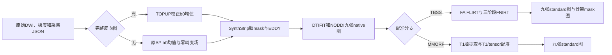
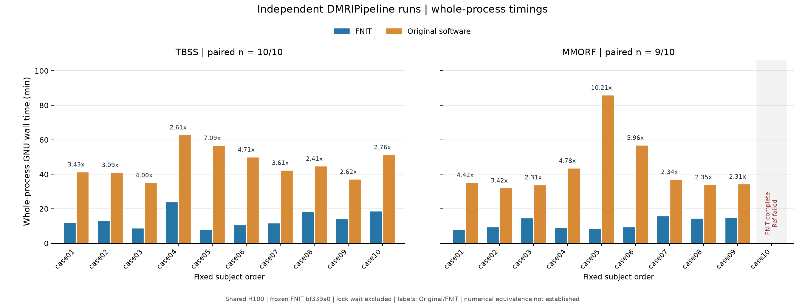
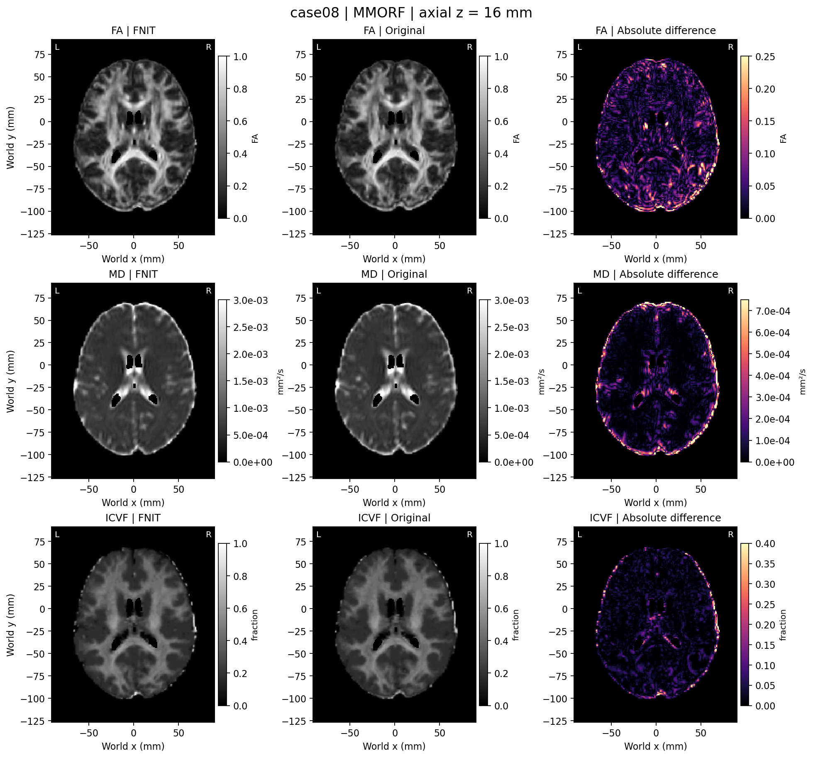

# DMRIPipeline：单被试扩散参数图流程

| 项目 | 内容 |
|---|---|
| 输入 | 原始BIDS DWI或AP/PA目录，梯度、采集JSON和模板 |
| 输出 | 九张native/standard图；TBSS另九张骨架mask图 |
| 对应原软件 | TOPUP、EDDY、DTIFIT、AMICO、TBSS/FNIRT或MMORF |
| Python / CLI | DMRIPipeline.run/run_bids / fnit-dmri-pipeline |
| CPU / GPU | 项目PyTorch CPU/CUDA；nibabel I/O，默认TF32 |

## 1. 功能简介

`DMRIPipeline` 从一名被试的原始DWI生成FA、MD、L1–L3、MO、ICVF、OD、ISOVF九张原生参数图，并传播到指定标准空间。无T1可用FA的TBSS/FNIRT分支；有配对T1和tensor模板可选择联合MMORF。TBSS另生成九张骨架mask图。

流程复用项目成熟TOPUP、SynthStrip、EDDY、DTIFIT、AMICO-NODDI、FLIRT/FNIRT/MMORF和采样函数，运行时不启动原FSL/FreeSurfer或Nipype/DIPY等封装。nibabel读取/保存，PyTorch计算，CUDA默认TF32但保留各子函数float64求解；不用FP16/BF16。原软件只在独立benchmark环境运行。



## 2. Python 调用

```python
from fnit.dmri_pipeline import DMRIPipeline

diffusion_pipeline = DMRIPipeline(
    device="cuda:0",  # 计算设备
    registration_backend="tbss",  # 不需要T1w的FA配准分支
    synthstrip_weights="/data/weights/synthstrip.1.pt",  # 已校验标准权重
    eddy_gp_seed=12345,  # 固定GP抽样种子
)
diffusion_result = diffusion_pipeline.run_bids(
    bids_root="/data/bids",  # 原始BIDS数据集
    output_dir="/data/results/sub-001_tbss",  # 单被试新结果根
    subject="001",  # BIDS sub标签
    session="01",  # 选定ses；没有session时省略
    direction="AP",  # 选择文件dir标签；PE符号仍从JSON读取
    fa_template="/data/templates/FMRIB58_FA_1mm.nii.gz",  # 标准FA及目标网格
    fa_skeleton="/data/templates/FMRIB58_FA-skeleton_1mm.nii.gz",  # 同网格骨架
    overwrite=False,  # 不覆盖已有输出
)
standard_fractional_anisotropy = diffusion_result.standard_maps["FA"]  # 内存标准空间FA
quality_control = diffusion_result.qc  # 子阶段QC与时间
```

### 输入数据格式

```text
bids/
├── dataset_description.json
└── sub-001/ses-01/
    ├── dwi/*_dir-AP_dwi.{nii.gz,bval,bvec,json}
    ├── fmap/*_dir-PA_epi.{nii.gz,json}       # 可选反向图
    └── anat/*_T1w.nii.gz                    # MMORF使用
```

| 输入 | 格式与空间 | 用途与缺少时行为 |
|---|---|---|
| 主DWI | 4D NIfTI `[X,Y,Z,N]`，保留native affine/orientation/强度 | 必需，数据必须有限；不先改成MNI。 |
| bval/bvec | N值s/mm²，3×N或N×3方向；顺序同第四维 | 必需，可按BIDS继承定位；EDDY后默认使用rotated。 |
| DWI JSON | PhaseEncodingDirection与TotalReadoutTime或EffectiveEchoSpacing | 必需，用于体素轴PE向量和以秒计的readout。 |
| 反向epi/DWI与JSON | 同native网格，相反PE，可取b0 | 缺全套跳TOPUP；存在不完整或歧义则报错。 |
| T1w | 同被试3D native结构像，可与DWI网格不同 | MMORF必需；BIDS自动选唯一同session T1，歧义显式指定。 |
| FA/skeleton | 3D标准空间float模板，TBSS同shape/affine | TBSS必需；骨架按≥2000取mask，非自动群体TBSS投影。 |
| T1/tensor模板 | T1 3D，tensor `[X,Y,Z,6]`，与FA同MNI网格 | MMORF必需；template形状定义输出网格。 |
| SynthStrip权重 | 官方标准PT checkpoint | 两分支必需，运行时只解析本地并校验，不自动下载。 |

BIDS多条DWI需run/acquisition/direction消除歧义；反向图按B0FieldSource/B0FieldIdentifier/IntendedFor关联，不能仅按文件名随意取第一张。dir标签不直接决定JSON的PE符号。梯度方向必须与原orientation一致；入口不替用户推断扫描坐标。

`run()`继续支持单被试AP/PA文件结构：

```text
raw/
├── AP.nii.gz / AP.bval / AP.bvec / AP.json
└── PA.nii.gz / PA.bval / PA.json        # 可选，必须整套同时存在
```

AP-only仍运行EDDY，以零susceptibility场并记录topup_applied=false。有PA时选择校正AP/PA b0均值；无PA仅平均AP中b<100的帧，再输入成熟SynthStrip，保持原生网格。

同一pipeline实例首次载入并缓存标准SynthStrip模型，MMORF T1脑提取复用。缓存仍占显存；构造device不等于完整流程一定低于20GB，须看实测及同时驻留张量。

MMORF最短调用：

```python
from fnit.dmri_pipeline import DMRIPipeline

multimodal_pipeline = DMRIPipeline(
    device="cuda:0",  # 目标GPU
    registration_backend="mmorf",  # T1与tensor联合配准
    synthstrip_weights="/data/weights/synthstrip.1.pt",  # 同标准checkpoint
    eddy_gp_seed=12345,  # 固定抽样
)
multimodal_result = multimodal_pipeline.run_bids(
    bids_root="/data/bids",  # 原始数据集
    output_dir="/data/results/sub-001_mmorf",  # 新分支目录
    subject="001",  # 单被试
    session="01",  # 选定session
    direction="AP",  # 选主DWI
    fa_template="/data/templates/FMRIB58_FA_1mm.nii.gz",  # FA affine模板
    t1=None,  # 自动选唯一配对T1，歧义需显式路径
    t1_template="/data/templates/MNI152_T1_1mm_brain.nii.gz",  # 输出MNI网格
    tensor_template="/data/templates/FSL_HCP1065_tensor_1mm.nii.gz",  # 同网格六分量tensor
    overwrite=False,  # 不覆盖
)
```

更换模板网格须核对全部template shape/affine与tensor分量约定。不能把一张随意resize的FA与不同MNI变体T1混用。

**`DMRIPipeline.__init__` 参数**

| 参数 | 必需 | 类型 | 默认值 | 含义 |
|---|---|---|---|---|
| `device` | 否 | `str/torch.device/None` | `None` | PyTorch 设备；None 自动选择可用 CUDA，否则 CPU。 |
| `registration_backend` | 否 | `str` | `'tbss'` | 选择配准分支；pipeline为tbss/mmorf，追踪另允许auto。 |
| `fnirt_config` | 否 | `FNIRTConfig/str或None` | `None` | FNIRTConfig 或 preset 字符串；None 使用 TBSSFNIRTConfig。 |
| `synthstrip_weights` | 否 | `str/PathLike或None` | `None` | 已校验的 SynthStrip 权重路径/目录；None 用包内本地解析器。 |
| `dti_shell` | 否 | `int` | `1000` | DTI使用的目标shell，单位 s/mm²。 |
| `dti_tolerance` | 否 | `int` | `100` | DTI shell选择容差，单位 s/mm²。 |
| `bvec_source` | 否 | `str` | `'rotated'` | rotated使用EDDY旋转方向；raw保留原梯度供协议核对。 |
| `noddi_fit_method` | 否 | `str` | `'amico'` | amico字典拟合或classic连续拟合。 |
| `eddy_gp_seed` | 否 | `int或None` | `None` | 1–4294967295的GP抽样种子；None按时间初始化。 |

**`DMRIPipeline.run` 参数**

| 参数 | 必需 | 类型 | 默认值 | 含义 |
|---|---|---|---|---|
| `raw_dir` | 是 | `路径` | `—` | 含AP影像、bval/bvec/JSON及可选PA的单被试目录。 |
| `output_dir` | 是 | `路径` | `—` | 本次结果目录；路径按当前工作目录解析。 |
| `fa_template` | 是 | `路径` | `—` | FA标准模板；定义TBSS输出网格并用于MMORF affine。 |
| `fa_skeleton` | 否 | `路径或None` | `None` | 与FA模板同网格的骨架图；TBSS要求提供，≥2000为骨架。 |
| `t1` | 否 | `路径或None` | `None` | MMORF配对T1w；BIDS模式可自动选择唯一同session影像。 |
| `t1_template` | 否 | `路径或None` | `None` | MMORF所需脑提取后MNI T1模板与目标网格。 |
| `tensor_template` | 否 | `路径或None` | `None` | MMORF所需六通道tensor模板，须与T1/FA模板同网格。 |
| `overwrite` | 否 | `bool` | `False` | 是否允许覆盖已有结果；默认已有结果时报错。 |

**`DMRIPipeline.run_bids` 参数**

| 参数 | 必需 | 类型 | 默认值 | 含义 |
|---|---|---|---|---|
| `bids_root` | 是 | `路径` | `—` | 含 dataset_description.json 的 BIDS 输入根目录。 |
| `output_dir` | 是 | `路径` | `—` | 本次结果目录；路径按当前工作目录解析。 |
| `subject` | 是 | `str` | `—` | BIDS sub 标签，可带或不带sub-前缀。 |
| `session` | 否 | `str或None` | `None` | 可选 BIDS ses 标签；歧义时必须指定。 |
| `run` | 否 | `str或None` | `None` | 可选 BIDS run 标签；歧义时必须指定。 |
| `acquisition` | 否 | `str或None` | `None` | 可选 BIDS acq 标签。 |
| `direction` | 否 | `str或None` | `None` | 可选 BIDS dir 标签；实际相位编码向量仍读 JSON。 |
| `fa_template` | 是 | `路径` | `—` | FA标准模板；定义TBSS输出网格并用于MMORF affine。 |
| `fa_skeleton` | 否 | `路径或None` | `None` | 与FA模板同网格的骨架图；TBSS要求提供，≥2000为骨架。 |
| `t1` | 否 | `路径或None` | `None` | MMORF配对T1w；BIDS模式可自动选择唯一同session影像。 |
| `t1_template` | 否 | `路径或None` | `None` | MMORF所需脑提取后MNI T1模板与目标网格。 |
| `tensor_template` | 否 | `路径或None` | `None` | MMORF所需六通道tensor模板，须与T1/FA模板同网格。 |
| `overwrite` | 否 | `bool` | `False` | 是否允许覆盖已有结果；默认已有结果时报错。 |

### 输出

```text
sub-001_tbss/
├── bids_input/                         # run_bids选择清单及源输入链接
├── topup/                              # 有PA时的场与校正b0
├── eddy/data.nii.gz / data.eddy_rotated_bvecs
├── eddy/nodif_brain_mask.nii.gz
├── eddy/nodif_brain_mask_report.json
├── native/dti_{FA,MD,L1,L2,L3,MO,tensor}.nii.gz
├── native/NODDI_{ICVF,OD,ISOVF}.nii.gz
├── registration/dti_FA_to_MNI_affine.mat
├── registration/dti_FA_to_MNI_warp.nii.gz  # TBSS系数含affine
├── registration/mmorf_warp.nii.gz          # MMORF场，另一分支才有
├── registration/standard/{FA,MD,L1,L2,L3,MO,ICVF,OD,ISOVF}.nii.gz
├── registration/skeleton/{...}.nii.gz     # 仅TBSS
└── dmri_pipeline_report.json
```

| 图/结果 | dtype、shape、空间和单位 |
|---|---|
| corrected DWI/mask | 4D/3D，native网格affine/orientation，DWI强度沿用输入，mask二值。 |
| native九图 | `[X,Y,Z]` float32，与校正DWI同网格，mask外零。 |
| standard九图 | 3D float32，所传模板shape/affine/orientation/MNI空间。 |
| skeleton九图 | 3D float32，同TBSS模板；固定骨架mask限制的参数图，非群体max投影。 |
| FA/MO/ICVF/OD/ISOVF | 无量纲；ICVF组织内细胞内分数，ISOVF整体自由水分数。 |
| MD/L1/L2/L3 | mm²/s，特征值降序。 |
| tensor | `[X,Y,Z,6]` float32，Dxx/Dxy/Dxz/Dyy/Dyz/Dzz，mm²/s，不计九图。 |
| affine/warp | diffusion FA→MNI scaled-mm矩阵；TBSS为含affine FNIRT系数，MMORF为参考图像轴mm场。 |
| DMRIPipelineResult | native_maps/standard_maps九名→nibabel图，实际backend、output_dir和qc。 |

形变的文件网格和pull采样约定与普通方向图不同。TBSS系数不能再叠加同affine；MMORF用于FSL格式时需按[ConvertWarp](../convertwarp/README.md)规则转换。概率追踪可直接传结果根给 `TorchProbtrackX.run(dmri_pipeline_dir=...)`，先反场再最近邻映射mask。

`dmri_pipeline_report.json`记录TOPUP有无、子步骤QC、设备/TF32、梯度来源和时间；b0脑mask QC另记录校验权重、输入SHA、体素/几何及加载/推理时间。嵌套阶段已包含父阶段，不能再累加。

## 3. 命令行调用

```bash
fnit-dmri-pipeline --bids-root /data/bids --subject 001 --session 01 --direction AP    --output-dir /data/results/sub-001_tbss --registration-backend tbss    --fa-template /data/templates/FMRIB58_FA_1mm.nii.gz    --fa-skeleton /data/templates/FMRIB58_FA-skeleton_1mm.nii.gz    --synthstrip-weights /data/weights/synthstrip.1.pt --eddy-gp-seed 12345 --device cuda:0
```

MMORF将backend改mmorf，去掉fa-skeleton，增加--t1-template和--tensor-template；T1可显式--t1或BIDS唯一自动选择。原AP/PA目录把--bids-root/subject/session替换为--raw-dir。

| CLI | Python | 含义 |
|---|---|---|
| --raw-dir 或 --bids-root | run.raw_dir 或 run_bids.bids_root | 二种输入互斥 |
| --subject / --session / --run / --acquisition / --direction | run_bids同名 | BIDS单被试选择 |
| -o/--output-dir / --overwrite | output_dir / overwrite | 输出和覆盖 |
| --registration-backend | 构造registration_backend | tbss/mmorf |
| --fnirt-preset | fnirt_config字符串 | default/gm/t1/tbss；只TBSS接受 |
| --synthstrip-weights | synthstrip_weights | 本地标准权重 |
| --dti-shell / --dti-tolerance / --bvec-source | 同名下划线构造参数 | DTI与梯度策略 |
| --noddi-fit-method / --eddy-gp-seed / --device | 同名下划线构造参数 | NODDI、种子和设备 |
| --fa-template / --fa-skeleton / --t1 / --t1-template / --tensor-template | 同名下划线运行参数 | 分支template/T1 |

统一命令 `fnit dmri-pipeline`使用同parser。CLI不能传自定义FNIRTConfig对象，Python可以。需要完整参数检查可运行 `fnit-dmri-pipeline --help`；help不等于处理真实MRI成功。

## 4. 原软件调用

独立参考链从相同原始AP/PA完成原TOPUP→官方CPU SynthStrip→原GPU EDDY→DTIFIT/AMICO→TBSS，使用参考侧自己的校正图、mask和rotated bvec。完整driver参数已按源码核对：

```bash
reference_python=/envs/reference/bin/python  # 独立AMICO2.0.3环境
repository_root=/work/Fudan-Neuroimaging-toolkit  # 验证脚本所在检出
fsl_installation=/opt/fsl/6.0.7.4  # 原软件，只供benchmark
export FSLDIR="$fsl_installation" FSLOUTPUTTYPE=NIFTI_GZ
export FNIT_BENCHMARK_PYTHON="$reference_python"  # 原TBSS脚本报告依赖
env -u PYTHONPATH "$reference_python"    "$repository_root/validation/dmri_pipeline/run_official_end_to_end.py"    --raw-dir /data/raw --output-dir /data/reference/tbss    --fsl-dir "$fsl_installation"    --topup-config "$fsl_installation/etc/flirtsch/b02b0.cnf"    --fa-reference /data/templates/FMRIB58_FA_1mm.nii.gz    --fa-skeleton /data/templates/FMRIB58_FA-skeleton_1mm.nii.gz    --config-prefix "$repository_root/src/fnit/dmri_pipeline/assets/oxford"    --amico-runner "$repository_root/validation/dmri_pipeline/run_official_amico.py"    --tbss-runner "$repository_root/validation/dmri_pipeline/run_official_tbss.sh"    --report /data/reference/tbss_report.json --seed 12345 --threads 8    --brain-extractor synthstrip --synthstrip-command /opt/freesurfer/8.2/bin/mri_synthstrip    --synthstrip-weights /data/weights/synthstrip.1.pt
```

该driver是独立benchmark harness，生产pipeline不读取原参考输出。默认brain-extractor为历史BET，复现最新主要协议必须显式synthstrip。

| FNIT阶段/参数 | 原软件对应 |
|---|---|
| 有PA的TOPUP与脑mask | topup原配置及mri_synthstrip，同权重、各自b0均值 |
| eddy_gp_seed / bvec_source=rotated | eddy_cuda10.2 --initrand / eddy_rotated_bvecs |
| dti_shell/tolerance | 先选b0+目标shell再dtifit |
| noddi_fit_method=amico | 独立Python AMICO2.0.3拟合 |
| TBSS配准与九图传播 | FA预处理、FLIRT、Oxford三次FNIRT、applywarp及固定骨架mask |
| MMORF | T1 SynthStrip、T1/FA FLIRT、原GPU MMORF0.3.2、applywarp |

MMORF完整原命令/config与driver见[十人协议](../../validation/dmri_pipeline/public10_20261002/PROTOCOL.md)及[run_official_mmorf.py](../../validation/dmri_pipeline/public10_20261002/run_official_mmorf.py)，不是调用默认TBSS driver后换一个文件名。

这是适配的单被试流程，不含GDC；官方AMICO替代MCR-AMICO，脑mask用各自b0 SynthStrip。TBSS输出为固定骨架mask图；原MMORF LM/MM与FNIT L-BFGS优化不同，不把同迭代上限认作同求解过程。

## 5. 最新精度和运行时间

最新正式真实整链为[2026-10-03固定十人](../../validation/dmri_pipeline/public10_20261002/README.md)：OpenNeuro ds003138 v1.0.1，CC0，首十人ses-1，117帧AP、PA b0及配对T1。候选绑定 `bf339a0368a7711d2c6ca3477c8d7dc1fc17e75a` 和433文件清单SHA `f13a4098…`，不是140c3739新实测；本轮只核对源码和文档。

参考FSL6.0.7.4/eddy_cuda10.2、GPU MMORF0.3.2、官方SynthStrip8.2.0-1、AMICO2.0.3。两侧8CPU线程，单共享H100串行锁；FNIT保留float32/float64及TF32策略，无半精度。完整命令含启动、导入、处理、输出及QC，不含输入下载/无损拼接、排队和锁等待。

| 端到端完整命令中位数 | FNIT | 原软件 | 有效配对 |
|---|---:|---:|---|
| TBSS | 759.91 s | 2606.87 s | 10/10 |
| MMORF | 571.32 s | 2113.98 s | 9/10 |

FNIT主运行20/20完成，原参考19/20；另一原EDDY持续CUDA分配失败，18张缺图保留分母。共432/450图有完整几何/有限值配对。时间较短但19对图均有非零误差，未建立数值等价。

| 代表精度与资源 | 结果 |
|---|---|
| 标准FA r / NRMSE中位数：TBSS | 0.995808 / 0.060759，n=10 |
| 标准FA r / NRMSE中位数：MMORF | 0.929447 / 0.217009，n=9 |
| MMORF标准MO r / NRMSE | 0.771097 / 0.593847，n=9 |
| 整个FNIT TBSS最大allocated/reserved | 6.972 / 11.457 GB |
| 整个FNIT MMORF最大allocated/reserved | 12.335 / 13.810 GB |

20GB是allocator上限，不含CUDA上下文/其他进程；采样显存和allocator分列，reserved不与allocated相加。

| 父阶段中位数，秒 | TBSS FNIT / 原 | MMORF FNIT / 原 |
|---|---:|---:|
| EDDY | 605.03 / 1004.81 | 596.56 / 880.66 |
| DTIFIT（原含shell选择） | 9.46 / 10.78 | 9.48 / 10.74 |
| NODDI | 17.05 / 29.00 | 20.41 / 28.29 |
| 配准与九图传播 | 142.15 / 1271.61 | 67.33 / 881.75 |

MMORF候选阶段n=10、参考n=9；父/嵌套边界不同不重复相加。各人的图、时间、失败和绑定只放[原汇总](../../validation/dmri_pipeline/public10_20261002/summary/RESULTS.md)，本页不复制逐人表。





成熟AMICO子函数真实整链暴露填充行工作区OOM，`bf339a0`在不改模型/精度/API下限工作区并跳填充行，组件回归和完整20条流程已验证。另TOPUP最终接受评分已修复且30/30评分一致，但冻结十人整链未重跑；固定b0控制可见差异来自上游选帧及后续EDDY/MMORF，不能全归配准。


<!-- FNIT-UNIFIED-BENCHMARK-20261008 -->
### 本轮统一 benchmark 摘要（2026-10-08）

原始 DWI→TBSS 的 CPU8 完整链由 **36,821.45 s 降至 25,313.29 s**；47 张影像逐位一致，另 19 个结果科学内容一致。EDDY 累计约 24,460 s 受共享节点竞争影响，仅作观察。TOPUP GPU 新版场图 RMSE 为 0.0108 Hz、API 中位数 10.82 s，完整链观察约 6.75 min；标准空间九张图相关 0.9880–0.9987，仍不是逐体素等价。十人正式整链和本轮 CPU 报告见 [统一 benchmark 索引](../BENCHMARK_INDEX.md)及本页已有验证链接。

## 6. 最近版本和 benchmark

<!-- 旧文档链接兼容锚点；原始记录在本页第6节的历史链接中。 -->
<a id="参考文献与原实现"></a>

| 日期 | commit/version | 变化 | benchmark |
|---|---|---|---|
| 2026-10-03 | a81ffcef | TOPUP最终接受评分修复与发布十人报告 | 评分30/30；完整结果仍bf339a0冻结 |
| 2026-10-02 | bf339a03 | AMICO成熟solver工作区OOM修复 | 接口/模型/精度保持，20/20流程完成 |
| 2026-10-02 | 5d84c7dd / b3ccafe0 | SynthStrip b0整合及同raw配对 | 433源码绑定，单例27图；非十人版本 |
| 2026-10-02 | 7473452 | 固定GP seed、准备/Gram/九图采样复用 | 真实组件差分；不同边界时间单列 |

更早的debug、profiling和长表保留在[旧README归档](../../validation/dmri_pipeline/readme_archive_20261005.md)。归档已修复相对链接；旧科学报告与原始产物不修改。

<a id="1-功能简介与流程"></a>
<a id="2-python-调用输入与输出"></a>
<a id="输入目录"></a>
<a id="b0-脑掩膜与权重"></a>
<a id="python原始-bids-单被试"></a>
<a id="pythonukb-命名输入"></a>
<a id="tbss不使用-t1w"></a>
<a id="mmorf使用-t1w"></a>
<a id="参数逐项说明"></a>
<a id="输出契约"></a>
<a id="3-命令行调用"></a>
<a id="原始-bids-输入"></a>
<a id="ukb-命名输入"></a>
<a id="4-原软件调用"></a>
<a id="原始-appa-的独立-fslamico-完整参照"></a>
<a id="已准备-fa-与-native-参数图的-fsl-tbss-参照"></a>
<a id="ukb-tbss-对应关系"></a>
<a id="mmorf-分支对应关系"></a>
<a id="5-精度运行时间与脑图"></a>
<a id="2026-10-03公开十人-tbss-与-t1tensor-mmorf-对照"></a>
<a id="2026-10-02原掩膜topup-版的-fnirt-完整端到端验证"></a>
<a id="2026-10-02当时-main-的-synthstrip匹配-topup-单例整链"></a>
<a id="2026-10-02synthstrip-b0-接入"></a>
<a id="历史-2026-10-02阈值bet-版同-raw-的完整-tbssamico-复测"></a>
<a id="2026-10-027473452已保留的组件优化"></a>
<a id="既有整链与原软件对照"></a>
<a id="既有-fnirt-脑图示例"></a>
<a id="6-最近版本与-benchmark-记录"></a>
<a id="7-参考文献与原实现"></a>

## 7. 参考文献、原软件和资源

- 原流程：[UK Biobank影像pipeline](https://git.fmrib.ox.ac.uk/falmagro/UK_biobank_pipeline_v_1)，`bb_tbss_1_preproc`至`bb_tbss_4_prestats`、`bb_tbss_non_FA`、`bb_NODDI`。
- 各原命令/文献：[TOPUP](../topup/README.md)、[EDDY](../eddy/README.md)、[DTIFIT](../dtifit/README.md)、[NODDI](../amico_noddi/README.md)、[FNIRT](../fnirt/README.md)、[MMORF](../mmorf/README.md)、[SynthStrip](../synthstrip/README.md)。
- Smith等，2006，[Tract-based spatial statistics](https://doi.org/10.1016/j.neuroimage.2006.02.024)；Alfaro-Almagro等，2018，[Image processing and quality control for the first 10,000 brain imaging datasets](https://doi.org/10.1016/j.neuroimage.2017.10.034)。
- FNIT：[pipeline.py](../../src/fnit/dmri_pipeline/pipeline.py)、[bids.py](../../src/fnit/dmri_pipeline/bids.py)、[tbss.py](../../src/fnit/dmri_pipeline/tbss.py)。

### 外部资源

| 资源 | 用途 | 官方来源 | 大小 | SHA-256 | 是否允许 FNIT 再分发 |
|---|---|---|---|---|---|
| synthstrip.1.pt | b0/T1脑提取 | [SynthStrip官方](https://surfer.nmr.mgh.harvard.edu/docs/synthstrip/) | 30,851,709 bytes | `37417f802196186441aae3e7f385d94f8a98c64a88acaeaa2723af995c653e33` | CC BY4.0；已列固定Release |
| FMRIB58 FA/skeleton | TBSS目标网格/骨架 | [FSL data_standard](https://git.fmrib.ox.ac.uk/fsl/data_standard) | 依所选文件，摘要未记大小 | 模板SHA见原报告，不编造整包SHA | 此功能不分发，原站准备 |
| MNI152 T1 brain / HCP1065 tensor | MMORF标准参考 | [FSL官方模板](https://fsl.fmrib.ox.ac.uk/fsl/docs/other/datasets.html) | 摘要未记单文件大小 | [已用文件绑定](../../validation/dmri_pipeline/public10_20261002/case02_mmorf_memoryfix_full.public.json) | 未核明确单模板再分发，仅原站 |
| Oxford三阶段.cnf | TBSS FNIRT配置 | [原pipeline](https://git.fmrib.ox.ac.uk/falmagro/UK_biobank_pipeline_v_1) | 各文件本地核验 | [源码配置目录](../../src/fnit/dmri_pipeline/assets/)及审核JSON | Apache2.0，已随包声明 |

2026-10-05已核固定[assets-v1](https://github.com/weikanggong1/Fudan-Neuroimaging-toolkit/releases/tag/assets-v1)公开manifest，SynthStrip大小/SHA/许可与安装器一致。权重准备使用 `fnit-setup-weights --model synthstrip`，优先Release再回退官方源；生产运行只读本地权重。

FA/T1/tensor/skeleton未在该权重清单中得到统一再分发授权，保留官方源和实际报告逐文件散列。用户可选同网格模板，但改变模板需要重新验证；不替换正在使用的冻结模板。
