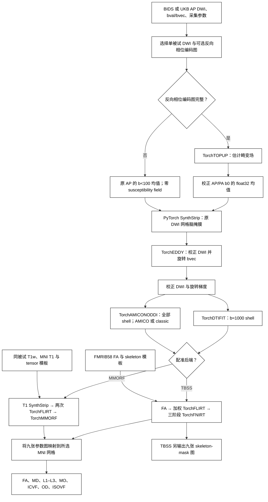

# 单被试 dMRI 参数图流程

[返回首页](../../README.md) · [PyTorch MMORF](../mmorf/README.md)

## 流程策略

两条分支输出相同的九个参数名：FA、MD、L1、L2、L3、MO、ICVF、OD、ISOVF。输入的 FA、T1 和 tensor 模板采用同一 MNI 网格时，两条分支的标准空间图也有相同的 shape、affine 和 float32 dtype；TBSS/FNIRT 与 MMORF 仍会估计不同的非线性形变。TBSS 分支另输出九张 UKB 风格 skeleton-mask 图。

| 输入 | Python 入口 | 命令行入口 | 配准选择 |
|---|---|---|---|
| 原始 BIDS | [`run_bids()`](#python原始-bids-单被试) | [`--bids-root`](#原始-bids-输入) | 无 T1w 用 `tbss`；有 T1w 可用 `mmorf` |
| UKB 命名的 AP/PA 文件 | [`run()`](#pythonukb-命名输入) | [`--raw-dir`](#ukb-命名输入-1) | `tbss` 或另传 T1w 使用 `mmorf` |

## 输入目录

`run_bids()` 和 `--bids-root` 直接读取单被试原始 BIDS 目录。反向相位编码图既可以是本 session 或 subject 层级的 `fmap/*_epi.nii.gz`，也可以是同一 session 的 `dwi/*_dwi.nii.gz`；没有反向图时跳过 TOPUP。`anat/*_T1w.nii.gz` 只供 MMORF 分支使用。

~~~text
bids/
├── dataset_description.json
└── sub-01/
    └── ses-01/
        ├── dwi/
        │   ├── sub-01_ses-01_dir-AP_run-01_dwi.nii.gz
        │   ├── sub-01_ses-01_dir-AP_run-01_dwi.bval
        │   ├── sub-01_ses-01_dir-AP_run-01_dwi.bvec
        │   └── sub-01_ses-01_dir-AP_run-01_dwi.json
        ├── fmap/
        │   ├── sub-01_ses-01_dir-PA_epi.nii.gz
        │   └── sub-01_ses-01_dir-PA_epi.json
        └── anat/
            └── sub-01_ses-01_T1w.nii.gz
~~~

| BIDS 输入 | 用途 | 缺少时的行为 |
|---|---|---|
| `dwi/*_dwi.nii[.gz]`、`.bval`、`.bvec`、JSON | 主 DWI，供 EDDY、DTIFIT、NODDI 使用 | 报错；多条主 DWI 需用 `run`/`acquisition`/`direction` 选一条 |
| 反向 `fmap/*_epi.nii[.gz]` 或 `dwi/*_dwi.nii[.gz]` 及 JSON | 提取反向 b0，供 TOPUP 估计畸变场 | 跳过 TOPUP，EDDY 使用零 susceptibility field |
| `anat/*_T1w.nii[.gz]` | 只供 MMORF 的 SynthStrip 和 T1 配准使用 | TBSS 照常运行；MMORF 报错 |

被选 DWI 必须是 4D，`.bval` 和 `.bvec` 的列数必须等于体积数；梯度文件和 JSON 可按 BIDS 继承规则放在上级目录。运行 EDDY 需要 DWI 的 `PhaseEncodingDirection` 以及 `TotalReadoutTime` 或 `EffectiveEchoSpacing`。反向图的 JSON 也需要这两项，且相位编码方向必须与 DWI 相反；若有 `B0FieldSource`／`B0FieldIdentifier` 或 `IntendedFor`，则按关联选择。多个 DWI 或多个可用反向图不能无依据地任选一个，需指定 run、acquisition、direction 或补充 fieldmap 关联。这些是本流程运行所需的采集信息；BIDS 允许某些 DWI 缺少上述推荐字段，但缺少时不能计算 EDDY 的采集参数。

原来的 `run()` 和 `--raw-dir` 继续读取 UKB 命名：

~~~text
raw/
├── AP.nii.gz
├── AP.bval
├── AP.bvec
├── AP.json
├── PA.nii.gz   # optional
├── PA.bval     # optional
└── PA.json     # optional
~~~

AP 四个文件必须存在。PA 的 image、bval 和 JSON 同时存在时才运行 TOPUP；缺少全部 PA 文件时进入 AP-only 路径，PA 文件只出现一部分时立即报错，避免误把不完整采集当成 AP-only。AP-only 分支仍运行 EDDY，但 susceptibility field 固定为零，并在报告中记录 topup_applied=false。

两条分支均需要官方 `synthstrip.1.pt`，用于 EDDY 的 b0 脑掩膜。TBSS 分支需要 FMRIB58_FA_1mm 和 FMRIB58_FA-skeleton_1mm。MMORF 分支还需要 subject T1w、MNI152_T1_1mm_brain 和与其同网格的 FSL_HCP1065_tensor_1mm。三个标准模板必须有相同 shape 和 affine。

### b0 脑掩膜与权重

有 PA 时，对 `topup/fieldmap_iout.nii.gz` 中选中的 AP/PA 校正 b0 在第四维取 float32 均值；AP-only 时只平均原 AP 中 `b<100 s/mm²` 的 volume。这个三维均值保留原强度和 DWI 的 shape、affine、voxel size，直接输入项目的 [`SynthStrip`](../synthstrip/README.md)，不做额外阈值、强度归一化、侵蚀或 dilation。SynthStrip 内部执行其既有的 LIA 1 mm conform、归一化、距离场预测与原网格回采样，固定 `border=1 mm`、`no_csf=False`。校正 b0 与 AP 网格不一致时会在 EDDY 之前报错。

`synthstrip_weights` / `--synthstrip-weights` 接受官方 PT 文件或所在目录；省略时依次查找 `FNIT_WEIGHTS`、安装器保存的目录和默认缓存。运行时不下载文件。首次加载验证清单中的 30,851,709 bytes 和 SHA-256 `37417f802196186441aae3e7f385d94f8a98c64a88acaeaa2723af995c653e33`，不接受 no-CSF 或其他 checkpoint。联网准备可用 `fnit-setup-weights --model synthstrip`；安装器优先固定 [assets-v1 Release](https://github.com/weikanggong1/Fudan-Neuroimaging-toolkit/releases/tag/assets-v1)，失败时使用原作者下载源，详见[资源与许可](../WEIGHTS.md)。权重不随本次源码变更打包。

同一个 `DMRIPipeline` 实例首次需要掩膜时才加载模型，后续调用及 MMORF 的 T1 脑提取复用它。CUDA 默认 float32 和 TF32，不使用 float16/bfloat16；`device="cpu"` 使用同一模型与几何路径。模型缓存占用随实例保留，U-Net 的工作张量会影响阶段峰值；20 GB 上限需由真实整链验收确认。

`eddy/nodif_brain_mask_report.json` 记录算法、均值来源和 SHA-256、平均 volume 数、权重大小/哈希、shape/affine/voxel size、脑体素数、模型是否复用、权重加载/推理/保存时间及 CUDA allocator 峰值，嵌入总报告的 `brain_mask`。掩膜总时间包含 b0 读盘和均值、权重解析/校验/加载、原始 SynthStrip 全部处理及 NIfTI 写盘，不含 QC JSON 写盘；`topup_and_eddy_preparation` 另覆盖完整 TOPUP 和 EDDY 准备。显存统计在 mask 阶段重置进程的 PyTorch peak counter，包括仍存活的张量和已有 reserve，不包括其他进程或 CUDA context。QC 不记录输入和权重的私密路径。

## Python：原始 BIDS 单被试

无 T1w 时使用 TBSS：

~~~python
from fnit import DMRIPipeline

result = DMRIPipeline(
    device="cuda:0",  # PyTorch 计算设备；默认允许 TF32，nibabel 读写使用 CPU
    registration_backend="tbss",  # 不依赖 T1w，使用 FA 的 FLIRT/FNIRT 配准
    fnirt_config="tbss",  # UKB Oxford 三阶段配置
    synthstrip_weights="/weights/synthstrip.1.pt",  # b0 脑掩膜权重；None 使用本地解析
    dti_shell=1000,  # DTI 拟合目标 b 值，单位 s/mm²
    dti_tolerance=100,  # DTI shell 容差，单位 s/mm²
    bvec_source="rotated",  # DTI/NODDI 使用 EDDY 旋转后的梯度
    noddi_fit_method="amico",  # 默认 AMICO 字典拟合；"classic" 为连续 Watson 拟合
    eddy_gp_seed=12345,  # 固定 GP 抽样，便于重复对照；默认 None 为按时间抽样
).run_bids(
    bids_root="/data/bids",  # 含 dataset_description.json 的原始 BIDS 根目录
    output_dir="/data/results/sub-01_tbss",  # 单被试 FNIT 输出根目录
    subject="01",  # BIDS sub 标签；也可写 "sub-01"
    session="01",  # BIDS ses 标签；没有 session 层时写 None
    run="01",  # 选择 DWI run；只有一条 DWI 时可写 None
    acquisition=None,  # 可按 acq 标签进一步选择 DWI
    direction="AP",  # 选择主 DWI 的 dir 标签，不根据文件名推断实际 PE 符号
    fa_template="FMRIB58_FA_1mm.nii.gz",  # 标准 FA 图及输出网格
    fa_skeleton="FMRIB58_FA-skeleton_1mm.nii.gz",  # TBSS skeleton 模板
    t1=None,  # TBSS 不使用 T1w，即使 anat/ 中存在 T1w
    t1_template=None,  # TBSS 不使用 T1 模板
    tensor_template=None,  # TBSS 不使用 tensor 模板
    overwrite=False,  # 拒绝覆盖已有输出
)
~~~

有 T1w 且需要 T1/tensor 联合配准时，选择 MMORF。`t1=None` 表示从同一 subject/session 的 `anat/` 自动选取唯一 T1w；若有多张 T1w，显式传 `t1` 文件路径。

~~~python
from fnit import DMRIPipeline

result = DMRIPipeline(
    device="cuda:0",  # PyTorch 计算设备；默认允许 TF32，nibabel 读写使用 CPU
    registration_backend="mmorf",  # 使用 T1w 与 DTI tensor 联合估计形变
    fnirt_config=None,  # MMORF 不使用 FNIRT
    synthstrip_weights="/weights/synthstrip.1.pt",  # 官方 SynthStrip 权重文件
    dti_shell=1000,  # DTI 拟合目标 b 值，单位 s/mm²
    dti_tolerance=100,  # DTI shell 容差，单位 s/mm²
    bvec_source="rotated",  # DTI/NODDI 使用 EDDY 旋转后的梯度
    noddi_fit_method="amico",  # 保持与本页 raw-to-standard 对照相同的 NODDI 路径
    eddy_gp_seed=12345,  # 固定 GP 抽样，便于重复对照；默认 None 为按时间抽样
).run_bids(
    bids_root="/data/bids",  # 原始 BIDS 根目录
    output_dir="/data/results/sub-01_mmorf",  # 单被试 FNIT 输出根目录
    subject="01",  # BIDS sub 标签
    session="01",  # BIDS ses 标签；无 session 时写 None
    run="01",  # 主 DWI 的 run 标签
    acquisition=None,  # 可选 acq 标签
    direction="AP",  # 主 DWI 的 dir 标签
    fa_template="FMRIB58_FA_1mm.nii.gz",  # FA 仿射初始化模板
    fa_skeleton=None,  # MMORF 不输出 TBSS skeleton
    t1=None,  # 自动读取唯一的同被试 T1w；也可显式给路径
    t1_template="MNI152_T1_1mm_brain.nii.gz",  # T1 标准模板及输出网格
    tensor_template="FSL_HCP1065_tensor_1mm.nii.gz",  # 同网格六通道 tensor 模板
    overwrite=False,  # 拒绝覆盖已有输出
)
~~~

两种调用均返回 `DMRIPipelineResult`：`native_maps` 和 `standard_maps` 是以 FA、MD、L1、L2、L3、MO、ICVF、OD、ISOVF 为键的 `nibabel.Nifti1Image` 字典；`registration_backend` 是实际分支名，`output_dir` 是结果根目录，`qc` 含各阶段运行记录。MMORF 找不到 T1w 时直接报错；TBSS 不要求 T1w。

## Python：UKB 命名输入

以下两个示例调用 `run(raw_dir=...)`，读取 `AP.*` 和可选 `PA.*`；它们与上面的 `run_bids()` 共用同一计算链。

### TBSS（不使用 T1w）

~~~python
from fnit import DMRIPipeline

result = DMRIPipeline(
    device="cuda:0",  # 运行设备：CUDA float32，允许 TF32
    registration_backend="tbss",  # 配准分支：UKB weighted FLIRT + TorchFNIRT
    fnirt_config="tbss",  # FNIRT 预设；省略时仍为 UKB Oxford 三阶段 TBSS
    synthstrip_weights="/weights/synthstrip.1.pt",  # b0 脑掩膜权重；None 使用本地解析
    dti_shell=1000,  # DTIFIT 使用的目标 b-value，单位 s/mm²
    dti_tolerance=100,  # 纳入 DTI shell 的 b-value 容差
    bvec_source="rotated",  # DTIFIT/NODDI 梯度：EDDY 旋转后；对照试验可选 "raw"
    noddi_fit_method="classic",  # 连续 Watson 非线性拟合；默认 "amico"
    eddy_gp_seed=12345,  # 固定 GP 抽样，便于重复对照；默认 None 为按时间抽样
).run(
    raw_dir="raw",  # 输入：AP.* 及可选 PA.* 的单被试目录
    output_dir="subject_tbss",  # 输出：该受试者的唯一结果根目录
    fa_template="FMRIB58_FA_1mm.nii.gz",  # 输入：标准 FA 模板及输出网格
    fa_skeleton="FMRIB58_FA-skeleton_1mm.nii.gz",  # 输入：UKB skeleton mask 模板
    t1=None,  # TBSS 分支不使用 T1w
    t1_template=None,  # TBSS 分支不使用 T1 模板
    tensor_template=None,  # TBSS 分支不使用 tensor 模板
    overwrite=False,  # 写盘策略：不覆盖已有结果
)
~~~

构造器选择设备和 registration_backend；`fnirt_config` 可传 `TBSSFNIRTConfig()`
或 `dataclasses.replace` 后的配置对象。命令行的 `--fnirt-preset` 默认在 TBSS 分支
选择 `tbss`。run 的前两个参数是原始采集目录和输出目录；fa_template 定义 1 mm MNI grid，fa_skeleton 用于 UKB 的 2000 阈值 skeleton mask。返回的 result.native_maps 与 result.standard_maps 都使用同一组九个键。

### MMORF（使用 T1w）

~~~python
from fnit import DMRIPipeline

result = DMRIPipeline(
    device="cuda:0",  # 运行设备：CUDA float32，允许 TF32
    registration_backend="mmorf",  # 配准分支：T1 + tensor 联合 TorchMMORF
    synthstrip_weights="/weights/synthstrip.1.pt",  # 输入：官方 SynthStrip 权重
    dti_shell=1000,  # DTIFIT 使用的目标 b-value，单位 s/mm²
    dti_tolerance=100,  # 纳入 DTI shell 的 b-value 容差
    bvec_source="rotated",  # DTIFIT/NODDI 梯度：EDDY 旋转后；对照试验可选 "raw"
    noddi_fit_method="classic",  # 连续 Watson 非线性拟合；默认 "amico"
    eddy_gp_seed=12345,  # 固定 GP 抽样，便于重复对照；默认 None 为按时间抽样
).run(
    raw_dir="raw",  # 输入：AP.* 及可选 PA.* 的单被试目录
    output_dir="subject_mmorf",  # 输出：该受试者的唯一结果根目录
    fa_template="FMRIB58_FA_1mm.nii.gz",  # 输入：FA 仿射初始化模板
    fa_skeleton=None,  # MMORF 分支不生成 TBSS skeleton 图
    t1="T1w.nii.gz",  # 输入：个体原始 T1w
    t1_template="MNI152_T1_1mm_brain.nii.gz",  # 输入：T1 模板及输出网格
    tensor_template="FSL_HCP1065_tensor_1mm.nii.gz",  # 输入：公共空间六通道 tensor
    overwrite=False,  # 写盘策略：不覆盖已有结果
)
~~~

该分支复用已为 b0 加载的 SynthStrip 生成 t1_brain，再分别计算 T1→MNI T1 和 FA→FMRIB58 的 12-DOF FLIRT 矩阵。随后它调用公开的 [`run_mmorf`](../mmorf/README.md) 函数，用两份仿射初始化 T1 scalar pair 与 DTI tensor pair，并只估计一个共享 warp；九张 dMRI 参数图全部使用 FA/tensor affine 与同一 warp 重采样。独立函数、命令行和 pipeline 因而共用同一实现和五文件 MMORF 输出。

## 命令行：单被试

### 原始 BIDS 输入

BIDS 无 T1w（TBSS）：

~~~bash
fnit-dmri-pipeline --bids-root /data/bids --subject 01 --session 01 \
  --run 01 --direction AP -o /data/results/sub-01_tbss \
  --registration-backend tbss --fnirt-preset tbss \
  --fa-template FMRIB58_FA_1mm.nii.gz \
  --fa-skeleton FMRIB58_FA-skeleton_1mm.nii.gz \
  --synthstrip-weights /weights/synthstrip.1.pt \
  --bvec-source rotated --noddi-fit-method amico --eddy-gp-seed 12345 --device cuda:0
~~~

BIDS 有 T1w（MMORF）：

~~~bash
fnit-dmri-pipeline --bids-root /data/bids --subject 01 --session 01 \
  --run 01 --direction AP -o /data/results/sub-01_mmorf \
  --registration-backend mmorf --fa-template FMRIB58_FA_1mm.nii.gz \
  --t1-template MNI152_T1_1mm_brain.nii.gz \
  --tensor-template FSL_HCP1065_tensor_1mm.nii.gz \
  --synthstrip-weights /weights/synthstrip.1.pt \
  --bvec-source rotated --noddi-fit-method amico --eddy-gp-seed 12345 --device cuda:0
~~~

`--bids-root` 是原始 BIDS 根目录；`--subject` 选择一名被试，`--session`、`--run`、`--acquisition` 和 `--direction` 在有多次采集时限定主 DWI。第二条命令省略 `--t1`，表示从该被试的 `anat/` 读取唯一 T1w；如果有多张，用 `--t1` 明确指定。`--noddi-fit-method amico` 使用默认字典拟合，改为 `classic` 时使用连续 Watson 拟合。`-o` 保存九张 native 和 standard 参数图及报告。BIDS 图像与梯度不会被改写：`bids_input/` 中保留源文件链接、合并后的 JSON 和 `bids_selection.json`；输出九图沿用下面的 FNIT 目录结构，尚未命名为 BIDS Derivatives。

下面带 T1w 的完整实测将第二条命令中的 FA、T1、tensor 三个 1 mm 模板换为同一 MNI 网格的 2 mm 版本；重采样方法和模板哈希见[验收报告](../../validation/dmri_pipeline/bids_mmorf_2mm.real.current.json)。九图的输出 shape 由模板决定。

### UKB 命名输入

TBSS：

~~~bash
fnit-dmri-pipeline \
  --raw-dir raw \
  -o subject_tbss \
  --registration-backend tbss \
  --fnirt-preset tbss \
  --fa-template FMRIB58_FA_1mm.nii.gz \
  --fa-skeleton FMRIB58_FA-skeleton_1mm.nii.gz \
  --synthstrip-weights /weights/synthstrip.1.pt \
  --bvec-source rotated \
  --noddi-fit-method classic \
  --eddy-gp-seed 12345 \
  --device cuda:0
~~~

MMORF：

~~~bash
fnit-dmri-pipeline \
  --raw-dir raw \
  -o subject_mmorf \
  --registration-backend mmorf \
  --fa-template FMRIB58_FA_1mm.nii.gz \
  --t1 T1w.nii.gz \
  --t1-template MNI152_T1_1mm_brain.nii.gz \
  --tensor-template FSL_HCP1065_tensor_1mm.nii.gz \
  --synthstrip-weights /weights/synthstrip.1.pt \
  --bvec-source rotated \
  --noddi-fit-method classic \
  --eddy-gp-seed 12345 \
  --device cuda:0
~~~

--raw-dir 选择单个 subject；-o 是该 subject 的唯一输出根；--registration-backend 选择非线性标准化分支。其余行分别提供该分支需要的模板、T1 和权重。--device 控制所有 PyTorch 步骤使用同一设备；每次调用只处理这一名被试。--bvec-source rotated 使 DTIFIT 和 NODDI 使用 EDDY 旋转后的梯度；改为 raw 时，两者都使用原始 AP.bvec。`--noddi-fit-method classic` 将 NODDI 阶段切换到[连续 Watson 拟合](../amico_noddi/README.md)；默认 `amico` 保留原数值路径。报告的 `noddi_fit_method` 与 `noddi.fit_method` 记录实际选择。

本页下方既有 raw-to-standard 整链对照使用默认 `amico`；上面的 `classic` 示例是新增的选择方式，单独的集成结果见“经典 NODDI 接入验证”。

`eddy_gp_seed` / `--eddy-gp-seed` 接受 1–4294967295 的整数；省略时保留按时间初始化的 GP 抽样。相同种子用于比较同环境、同输入下的 EDDY 输出，写入报告的 `eddy_gp_seed`。它不改变 GP 样本数量、拟合精度或优化轮数。

TOPUP 已计算的 AP b0 参考体积会直接供 EDDY 使用，避免对同一组 b0 再做一遍成对配准。独立调用 `prepare_ukb_eddy` 时省略 `ref_scan_no` 仍执行原选择流程；传入该参数时，它必须是 AP 中 b<100 体积的从零开始索引。

当前反向图 TOPUP 路径对奇数 z 片数会裁掉末片；传给 EDDY 的 mask 可能与未裁剪 AP 的形状不匹配。最新完整组件验收使用 72 片输入；奇数片输入的裁剪/padding 尚待真实数据修复与验收，见[剩余工作](../../validation/dmri_pipeline/lossless_20261002.md#5-后续工作与更新记录)。

## 输出契约

~~~text
subject/
├── bids_input/                    # 仅 run_bids；源图链接、元数据和选择清单
├── topup/                         # only meaningful when PA is present
├── eddy/data.nii.gz
├── eddy/data.eddy_rotated_bvecs
├── eddy/nodif_brain_mask.nii.gz     # 3D float32 二值 SynthStrip mask，原 DWI 网格
├── eddy/nodif_brain_mask_report.json # 掩膜输入、权重、几何、计时与显存 QC
├── native/
│   ├── dti_FA.nii.gz
│   ├── dti_MD.nii.gz
│   ├── dti_L1.nii.gz
│   ├── dti_L2.nii.gz
│   ├── dti_L3.nii.gz
│   ├── dti_MO.nii.gz
│   ├── dti_tensor.nii.gz
│   ├── NODDI_ICVF.nii.gz
│   ├── NODDI_OD.nii.gz
│   └── NODDI_ISOVF.nii.gz
├── registration/
│   ├── dti_FA_to_MNI_warp.nii.gz     # TBSS only；FNIRT 系数已含 affine
│   ├── dti_FA_to_MNI_affine.mat      # TBSS/MMORF；MMORF 转 FSL 场时使用
│   ├── mmorf_warp.nii.gz            # MMORF only；参考图像轴 mm 场
│   ├── standard/{FA,MD,L1,L2,L3,MO,ICVF,OD,ISOVF}.nii.gz
│   └── skeleton/{...}.nii.gz      # TBSS only
└── dmri_pipeline_report.json
~~~

两条分支的 `registration/standard/` 有相同的九个文件名、float32 dtype 和参数定义；输出网格由传入的模板决定。report 记录是否使用 TOPUP、各阶段耗时、设备、TF32、每个子函数的 QC 和非等价边界。

概率追踪若传入 MNI 掩膜，可把上述单被试输出根作为 `TorchProbtrackX.run(dmri_pipeline_dir=...)` 的输入。它按 TBSS/MMORF 分支生成 FSL dense 组合场，再在 BEDPOSTX diffusion 网格求逆并最近邻映射掩膜；详见[ProbtrackX 的 MNI 掩膜用法](../probtrackx/README.md)。

## UKB TBSS 对应关系

本版在 EDDY 前增加独立 SynthStrip 脑提取。原软件参考先用自己的 TOPUP 校正 b0 生成均值，再调用原版 SynthStrip：

~~~bash
corrected_b0_pair="reference/topup/fieldmap_iout.nii.gz"  # 原版 TOPUP 的 AP/PA 校正 b0
mean_b0_image="reference/topup/mean_b0.nii.gz"  # 三维 b0 均值
brain_mask_image="reference/eddy/nodif_brain_mask.nii.gz"  # EDDY 的原网格 mask
synthstrip_weights="/weights/synthstrip.1.pt"  # 与 FNIT 同哈希的标准权重
fslmaths "$corrected_b0_pair" -Tmean "$mean_b0_image"
mri_synthstrip -i "$mean_b0_image" -m "$brain_mask_image" --model "$synthstrip_weights" -b 1 -t 8
~~~

这些命令只用于独立原软件 benchmark；FNIT 运行时调用项目 PyTorch 实现。AP-only 原软件参考需先按原 bval 选择所有 `b<100` volume，再平均，不应对完整 DWI 取均值。

| 本包步骤 | UKB v1.5 / FSL 命令 |
|---|---|
| FA 上限、support erosion、端层归零 | fslmaths dti_FA -min 1 -ero -roi 1 X 1 Y 1 Z 0 1 |
| FLIRT 权重 | fslmaths mask -dilD -dilD -sub 1 -abs -add mask |
| affine | flirt -ref FMRIB58_FA_1mm -in dti_FA -inweight dti_FA_mask -omat affine.mat |
| nonlinear stage 1–3 | 三次 fnirt，依次使用 oxford_s1.cnf、s2.cnf、s3.cnf |
| 九图传播 | applywarp --rel -r FMRIB58_FA_1mm -w dti_FA_to_MNI_warp |
| skeleton mask | FMRIB58_FA-skeleton_1mm ≥ 2000，再乘以有效 FA mask |

包内三份 Oxford 配置与 UKB ancillary archive 的 SHA-256 完全一致。`TBSSConfig` 使用相同的六层 subsampling、FWHM、lambda、iteration 和 intensity schedule，并明确保留三个 process stage：stage 1 为四层 LM，stage 2/3 分别为 50/25 次 SCG。当前实现也包括 implicit input/reference zero mask、input mask-normalized smoothing，以及 `inwarp/intin` 的 float32 coefficient/header 和 10 位 intensity 交接。交接在一个 Python 进程内完成，不启动三个 FSL executable。

control grid 按 FSL `FullResKsp` 计算：stage 1 的 10 mm `warpres` 在最终 `subsamp=2` 后对应 full-grid 5 mm spacing；stage 2/3 使用 2 mm spacing，最终 coefficient grid 为 `[94,112,94,3]`。验证页的既有 UKB 真实单例覆盖 FLIRT、FNIRT、applywarp 与 `tbss.py`。该例的输出网格合同通过，但逐体素数值等价未通过，因此报告仍记录 `ukb_numerically_equivalent=false`。单被试 UKB 脚本使用官方 skeleton mask 相乘，并不执行经典多被试 TBSS 的跨被试最大投影；本包复现的是该单被试行为。

## MMORF 分支对应关系

MMORF 分支和 TBSS 分支共用 TOPUP、EDDY、DTIFIT、NODDI、九图命名及标准 grid。它用两次 TorchFLIRT 保持相同的 input→reference FSL affine contract，只把 FNIRT 非线性注册换成 [PyTorch MMORF](../mmorf/README.md) 的 T1 scalar + DTI tensor 联合目标。warp 位于 reference grid，三通道保存沿 reference image axes 的毫米位移，因此由 `apply_mmorf_warp` 应用，不能交给 FNIRT 的 `TorchApplyWarp`。

## 真实数据验证与原软件对照

### 2026-10-02：SynthStrip＋匹配 TOPUP 的独立整链复测（合并前源码）

本轮以同一例真实 `104×104×72×105` raw AP/PA 为起点，两侧各自完成 b0 选择、TOPUP、脑提取、EDDY、DTIFIT、AMICO 和 TBSS，在新目录保存九张 native、九张 standard、九张 skeleton 图。主要原软件参考使用官方 TOPUP → 官方 CPU SynthStrip → FSL GPU EDDY → FSL DTIFIT／官方 Python AMICO／FSL TBSS；脑提取输入为参考侧自己的 TOPUP 校正 b0 均值，标准权重与 FNIT 同哈希。DTIFIT 和 AMICO 分别使用各自 EDDY 产生的旋转梯度。参考仍保留 UKB 单被试流程的无 T1、无 GDC 适配。环境为 Python 3.11.16、Torch 2.5.1、FSL 6.0.7.4、AMICO 2.0.3；官方 AMICO 本例 protocol kernels 重建并计入时间，全局 rotation cache 已存在。

双方均使用 8 个 CPU 线程，原软件固定 CPU 0–7，FNIT 固定 CPU 8–15；GPU 阶段在同一张 H100 GPU 1 上串行运行。参考侧 CPU 配准与 FNIT GPU 阶段有时间重叠。处理计时从 raw 输入处理开始，到全部 27 图写盘结束；Python／CUDA 初始化、预检和验证报告统计另行记录。嵌套 TOPUP 子步骤包含在父步骤中，不重复累加。这里记录单被试共享系统上的实测耗时，数值差异按固定脑区及共同有效区域分别报告；较高相关性本身不构成数值等价结论。

| 处理步骤，包含该阶段读写 / 秒 | 最终 FNIT | 独立官方 SynthStrip 参考 |
|---|---:|---:|
| b0 选择、TOPUP、脑掩膜与 EDDY 输入准备 | 12.64 | 330.36 |
| 完整八轮 EDDY | 418.43 | 645.88 |
| shell 选择＋DTIFIT | 13.33 | 15.91 |
| AMICO 准备、拟合与保存 | 27.50 | 35.05 |
| FA 预处理、FLIRT/FNIRT、九图传播与骨架保存 | 27.16 | 1028.33 |
| 总处理时间 | 499.55（8.33 分钟） | 2055.53（34.26 分钟） |
| 完整进程，包含启动、预检和报告 | 503.37 | 2073.54 |

FNIT 的 TOPUP 估计和保存子步骤为 5.01 s，原软件为 215.47 s；二者已包含在准备行中。处理时间比为本例观察值 4.11。各阶段由独立计时记录，总处理时间还包含阶段之间的操作；表中不把嵌套子步骤再次相加。最终整链的 CUDA allocator 已分配／保留峰值为 14.65145／19.98166 GB，低于设置的 20,000,000,000 bytes 预算；它是各公共阶段记录的最大值，包含存活 SynthStrip 模型和 allocator 缓存，不包含 CUDA context 或其他进程。保留峰值接近预算，不能用已分配峰值代表整个进程的设备占用。

本轮同时公开两套精度协议。主要参考是上述新生成的官方 SynthStrip 链；历史协议用同一最终 FNIT 结果与先前独立 FSL BET 链比较，保留脑提取方法的差别。

| 参考协议 | 脑 mask Dice | native 九图 r，固定参考 mask | standard 九图 r，固定模板脑区 | skeleton 九图 r，固定模板骨架 |
|---|---:|---:|---:|---:|
| 独立官方 SynthStrip 链 | 0.9999834 | 0.981587–0.999659 | 0.988013–0.998676 | 0.993251–0.998960 |
| 历史独立 FSL BET 链 | 0.9516551 | 0.508850–0.935956 | 0.846458–0.959704 | 0.818371–0.965032 |

主要参考脑 mask 为 271,080 个体素，FNIT 为 271,075，共同区域为 271,073；固定模板脑区和骨架分别为 1,489,274 与 137,832 个体素。27 对图的 shape、affine 和有限值检查全部通过。固定官方 native mask 内，FA 的 r／RMSE 为 0.999051／0.007924，MD 为 0.999642／1.80561×10⁻⁵ mm²/s；ICVF 和 OD 的 RMSE 为 0.040476／0.037014，最大差为 0.9900／0.9700。较高相关性仍伴随非零误差，不能据此宣布数值等价。

完整 EDDY 105 volume 在固定官方脑区 r=0.999764，MAE／RMSE=23.2314／43.0074（原信号单位）；100 个 DWI 旋转梯度的平均夹角为 0.05585°，离群图共有 1 个条目不同。FA FLIRT 在八个体素中心角点及图像中心的位移 RMS 为 0.24793 mm，属于九点检查。旧阈值/BET 整链的 r 和 6.49 mm 九点位移来自不同上游与掩膜输入，不能把新旧差值单独归因于某个修复，也没有由这些结果隔离 FNIRT 的残差贡献。

本节记录与新 main 合并前已完成的源码验证：最终清理版运行基于 `ac692bb` 加本轮工作源码，以报告中的逐文件 SHA-256 为准；TOPUP core／CUDA sampler 哈希分别以 `d6b9838c`／`ee19a764` 开头。清理前候选的 FNIT 处理时间另为 516.31 s；清理版 fresh 运行的 27 张解码数组与 header binary block 同候选完全相同，未将不同源码的两次时间合并成最终版中位数。合并新 main 后的整链将单独绑定其实际源码与运行记录，本节不把合并前结果归为尚未运行的新版本。

完整方法和脑图见[本轮整链报告](../../validation/dmri_pipeline/end_to_end_synthstrip_topup_20261002.md)，计时、版本与源码见[运行报告](../../validation/dmri_pipeline/report.synthstrip_topup_20261002.public.json)。两协议的逐图误差分别见[官方 SynthStrip 对照](../../validation/dmri_pipeline/comparison.synthstrip_topup_20261002.public.json)和[历史 BET 对照](../../validation/dmri_pipeline/comparison.historical_bet_20261002.public.json)，上游见[校正与配准检查](../../validation/dmri_pipeline/upstream.synthstrip_topup_20261002.public.json)。本轮覆盖 TBSS＋AMICO；MMORF 与经典 NODDI 保留其既有验证范围。

### 2026-10-02：SynthStrip b0 接入

当前改为两侧各自 TOPUP b0 均值的 SynthStrip 脑掩膜。先用同一真实官方 TOPUP b0 均值核对成熟 SynthStrip：FNIT H100 GPU 与官方 CPU mask 分别为 271,077 和 271,080 个脑体素，只差 5 个体素，Dice=0.9999907776，shape/affine 一致；距离场 MAE/RMSE 为 0.00056229/0.00063086 mm。两侧使用上述同哈希标准权重，输入文件 SHA-256 为 `4688abe79c0ce45ce8f28554e1276e5a1727c03a4e5d3277466bcabdf1a9d20f`，PyTorch 2.5.1；匿名指标见[固定输入报告](../../validation/dmri_pipeline/synthstrip_fixed_input_20261002.public.json)。这是直接 SynthStrip 核验，独立 pipeline 整链另见上节。

FNIT 模型加载＋推理为 1.5973 s，allocator allocation/reserve 峰值 6.5031/10.7605 GB。另测完整 FNIT/官方进程为 6.825/122.275 s；官方 CPU 使用 8 线程，并包含 NFS 冷读取、启动和写盘，不能将其除以 FNIT 的加载＋推理时间计算加速比。该次结果不证明稳定整链提速。受支持本地 Conda Python 3.11.16、Torch 2.5.1 的 53 项 CPU 回归通过，命令、版本与相关源码哈希见[测试记录](../../validation/dmri_pipeline/synthstrip_cpu_tests_20261002.public.json)；接口测试中的推理替身不作为 benchmark。

该固定输入核验与上面的独立整链复测分别记录，前者隔离脑提取实现，后者包含双方各自 TOPUP 场、掩膜和后续步骤。

### 历史 2026-10-02：阈值/BET 版同 raw 的完整 TBSS＋AMICO 复测

同一例真实 104×104×72×105 AP/PA，从 b0 选择、TOPUP、EDDY 开始分别独立运行 FNIT 与 FSL 6.0.7.4＋官方 Python AMICO 2.0.3，保存九张 native、standard 和 skeleton 共 27 图；每套流程完整重复两次。数值源码固定为 `7473452`，没有复用历史阶段输出。

| 处理时间 | FNIT | 独立 FSL＋AMICO |
|---|---:|---:|
| 两轮 / 秒 | 507.22、455.06 | 2166.99、1994.29 |
| 中位数 / 分钟 | 8.02 | 34.68 |
| 范围 / 分钟 | 7.58–8.45 | 33.24–36.12 |

本例观察到时间比 4.32；输出有明显差异，尚未证明数值等价加速。27 对图 shape、affine 和有限值检查通过；脑 mask Dice 为 0.888，标准空间九图在固定模板脑区内 r=0.419–0.810，骨架图 r=0.197–0.710。两次 FNIT 内部、两次参考内部各 27 张解码数组和 header binary block 分别完全相同。

参考从同一 raw 自行生成 mask、校正图、native 和配准；无 T1 mask 改用独立 BET，MCR-AMICO 改用官方 Python，后续用各自 rotated bvec，因此是按本例适配的完整原软件链。分步骤时间、逐图 MAE/RMSE、上游校正、共同区域及脑图见[完整报告](../../validation/dmri_pipeline/end_to_end_20261002.md)。本次没有更新 MMORF/经典 NODDI 的完整参考对照。

### 2026-10-02：保持已有 FNIT 输出的组件优化

该轮复用 TOPUP 已选 AP 参考索引、EDDY 不可变几何、NODDI Gram 和固定 warp 的九图采样计划。完整 EDDY、两种全脑 NODDI 与真实九图传播在同输入下均与冻结基线逐值相同，完整 header、affine、sidecar 和模型 QC 也一致；新增 `eddy_gp_seed` 便于配对复现。

| 实测范围 | 基线→本版 | 结果 |
|---|---:|---|
| 完整八轮 EDDY，含读写 | 484.75→404.31 s | 一次共享 H100 配对观察，耗时低 16.6% |
| EDDY 准备，已完成 TOPUP 选择 | 三次中位数 6.991→0.153 s | 消除重复参考选择 |
| TBSS / MMORF 固定 warp 九图传播 | warm 中位数 0.366→0.181 / 0.517→0.270 s | 约 2.02 / 1.91 倍，不包括配准估计或文件读写 |
| 全脑 AMICO / 经典 NODDI，含读写 | 两次中位数 30.77→27.45 / 68.15→79.81 s | 共享 GPU 波动较大；AMICO 稳定收益未确定，经典模式整体未提速 |

详细输入、逐次时间、显存、验收和未采用的缓存方案见[该轮报告](../../validation/dmri_pipeline/lossless_20261002.md)。该组件报告以冻结 FNIT 为对照；上方独立原软件整链分别记录当前 SynthStrip 和历史 BET 协议，下方历史对照继续保留原输入和时间边界。

### 既有整链与原软件对照

下面几组结果的输入和计时边界不同，完整方法、逐图误差及源码范围见[验证页](../../validation/dmri_pipeline/README.md)。

| 验证 | 已完成的输出 | 结果与范围 |
|---|---|---|
| [原始 BIDS、无 T1w、TBSS](../../validation/dmri_pipeline/bids_tbss.real.current.json) | 九张 native、九张标准空间和九张 skeleton 图 | 真实 AP/PA 105 volume DWI；各组 shape/affine 一致、float32、有限值；共享 H100 完整命令 1649.82 s。 |
| [原始 BIDS、带 T1w、MMORF 2 mm](../../validation/dmri_pipeline/bids_mmorf_2mm.real.current.json) | 九张 native、九张标准空间图和 MMORF 形变场 | 同一真实 AP/PA+T1w 采集；standard 九图同 91×109×91 网格、float32、有限值；完整命令 1829.25 s。 |
| [原始 BIDS、带 T1w、MMORF 1 mm](../../validation/dmri_pipeline/bids_mmorf.shared_gpu_oom.json) | 九张 native 图、T1 脑图、两份 FLIRT 矩阵 | 36:20.19 后在 MMORF 非线性阶段因共享 GPU 显存不足退出；标准空间九图未完成。 |
| [既有 UKB TBSS 与 FSL 对照](../../validation/dmri_pipeline/tbss_e2e.real.current.json) | 九张 native、standard、skeleton 图 | 相对匹配 FSL EDDY 的下游对照：native r=0.978640–0.999882、standard r=0.940917–0.988332、skeleton r=0.949470–0.991235。 |
| [经典 NODDI 接入](../../validation/dmri_pipeline/pipeline_classic_real.public.json) | 九图接口与真实体素拟合 | 24 个真实脑内体素的阶段集成测试；使用 identity 配准，不是 raw-to-MNI 整链。 |

上述 FSL EDDY 对照固定 TOPUP 场、掩膜和后续 FNIT 步骤，只替换 EDDY 的校正图。另一个[原版 FSL TBSS 参考](../../validation/dmri_pipeline/README.md#既有-ukb-tbss-与-fsl-对照)从官方 UKB native 参数图开始，其 standard 九图 r=0.358268–0.699381；它与本包 raw AP/PA 起步的输入不同，不能据此计算整链加速比或把差异单独归给 FNIRT。FSL 对照的九图相关性不是本次 BIDS 运行重新测得的结果。

## 最近更新

| 日期 | 更新与验收 |
|---|---|
| 2026-10-02，SynthStrip＋匹配 TOPUP 整链 | 合并前清理源码 fresh TBSS＋AMICO 27 图完成；处理时间 499.55／2055.53 s，官方 SynthStrip 参考标准九图 r=0.988013–0.998676，历史 BET 参考另列 r=0.846458–0.959704；逐图误差、上游、显存和脑图见[最新报告](../../validation/dmri_pipeline/end_to_end_synthstrip_topup_20261002.md)。 |
| 2026-10-02，SynthStrip b0 接入 | TOPUP 校正 b0 均值和 AP-only b0 均值使用项目 SynthStrip；标准权重校验、实例复用、CPU/GPU 和匿名 QC。移除旧阈值形态学代码，修复缺 iout 时平均全部 DWI 的输入准备 bug。相同真实官方 b0 均值的 mask Dice=0.9999907776（差 5 voxel），53 项受支持 CPU 回归通过；独立整链见上一行。 |
| 2026-10-02，历史阈值/BET 完整复测 | 同 raw 的旧 FNIT/独立 FSL BET＋AMICO 各两轮，27 图、上游、误差、重复性与脑图完成，[历史整链报告](../../validation/dmri_pipeline/end_to_end_20261002.md) |
| 2026-10-02，组件优化 | 固定 GP seed、参考索引复用、EDDY/NODDI 不可变缓存、按几何分组的九图采样计划；完整组件和固定 warp 的真实逐值对照通过，[报告](../../validation/dmri_pipeline/lossless_20261002.md) |
| 2026-09-29 至 10-01 | BIDS 入口、TOPUP/EDDY 和 TBSS/MMORF 整链记录、经典 NODDI 接入；对应精度和时间继续见[验证索引](../../validation/dmri_pipeline/README.md) |

## 参考文献与原实现

- 参考文献：Alfaro-Almagro et al., *Image processing and Quality Control for the first 10,000 brain imaging datasets from UK Biobank*, NeuroImage (2018), [论文](https://discovery.ucl.ac.uk/id/eprint/10039942/)。
- 参考文献：Smith et al., *Tract-based spatial statistics: Voxelwise analysis of multi-subject diffusion data*, NeuroImage (2006), [doi:10.1016/j.neuroimage.2006.02.024](https://doi.org/10.1016/j.neuroimage.2006.02.024)。
- 原实现代码库：[UK Biobank pipeline v1.5](https://git.fmrib.ox.ac.uk/falmagro/uk_biobank_pipeline_v_1.5)；[FSL `tbss`](https://git.fmrib.ox.ac.uk/fsl/tbss)；[FSL `MMORF`（可选配准分支）](https://git.fmrib.ox.ac.uk/fsl/MMORF)。
- 脑提取：Hoopes et al., *SynthStrip: Skull-Stripping for Any Brain Image*, NeuroImage (2022), [doi:10.1016/j.neuroimage.2022.119474](https://doi.org/10.1016/j.neuroimage.2022.119474)；[FreeSurfer `mri_synthstrip`](https://github.com/freesurfer/freesurfer/tree/dev/mri_synthstrip)。
- 经典 NODDI 参考：Zhang et al., *NODDI: Practical in vivo neurite orientation dispersion and density imaging of the human brain*, NeuroImage (2012), [doi:10.1016/j.neuroimage.2012.03.072](https://doi.org/10.1016/j.neuroimage.2012.03.072)；[NODDI Matlab Toolbox](https://www.nitrc.org/projects/noddi_toolbox)。
- 输入格式：[BIDS 1.11.1 MRI/DWI 与反向相位编码 EPI 规范](https://bids-specification.readthedocs.io/en/stable/modality-specific-files/magnetic-resonance-imaging-data.html)。
