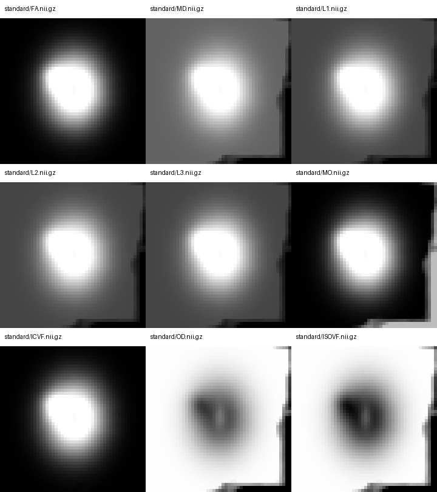

# 单被试 dMRI 参数图 pipeline

[返回首页](../../README.md) · [PyTorch MMORF](../mmorf/README.md)

本流程实现以下固定链：

~~~mermaid
flowchart LR
  A[AP dMRI + optional PA] --> B{PA complete?}
  B -->|yes| C[TorchTOPUP]
  B -->|no| D[zero susceptibility field]
  C --> E[TorchEDDY]
  D --> E
  E --> F[TorchDTIFIT b≈1000]
  E --> G[TorchAMICO-NODDI all shells]
  F --> H{registration backend}
  G --> H
  H -->|tbss| I[weighted TorchFLIRT + three-stage TorchFNIRT]
  H -->|mmorf| J[SynthStrip T1 + two TorchFLIRT + scalar/tensor TorchMMORF]
  I --> K[9 maps on FMRIB58/MNI152 1 mm grid]
  J --> K
~~~

两条分支输出完全相同的九个标准空间参数名：FA、MD、L1、L2、L3、MO、ICVF、OD、ISOVF。这里的“一致”指文件集合、shape、affine、dtype 和参数含义一致；它不表示 TBSS/FNIRT 与 MMORF 会估计相同的非线性形变。TBSS 分支另输出九张 UKB 风格 skeleton-mask 图。

## 输入目录

raw_dir 使用 UKB 命名：

~~~text
raw/
├── AP.nii.gz
├── AP.bval
├── AP.bvec
├── AP.json
├── PA.nii.gz   # optional
├── PA.bval     # optional
└── PA.json     # optional
~~~

AP 四个文件必须存在。PA 的 image、bval 和 JSON 同时存在时才运行 TOPUP；缺少全部 PA 文件时进入 AP-only 路径，PA 文件只出现一部分时立即报错，避免误把不完整采集当成 AP-only。AP-only 分支仍运行 EDDY，但 susceptibility field 固定为零，并在报告中记录 topup_applied=false。

TBSS 分支需要 FMRIB58_FA_1mm 和 FMRIB58_FA-skeleton_1mm。MMORF 分支还需要 subject T1w、官方 SynthStrip 权重、MNI152_T1_1mm_brain 和与其同网格的 FSL_HCP1065_tensor_1mm。三个标准模板必须有相同 shape 和 affine。

## Python：TBSS 分支

~~~python
from fnit import DMRIPipeline

result = DMRIPipeline(
    device="cuda:0",                 # CUDA float32，允许 TF32
    registration_backend="tbss",     # UKB FA registration branch
).run(
    "raw",                            # AP.* and optional PA.*
    "subject_tbss",                   # one-subject output root
    fa_template="FMRIB58_FA_1mm.nii.gz",
    fa_skeleton="FMRIB58_FA-skeleton_1mm.nii.gz",
)
~~~

构造器选择设备和 registration_backend。run 的前两个参数是原始采集目录和输出目录；fa_template 定义 1 mm MNI grid，fa_skeleton 用于 UKB 的 2000 阈值 skeleton mask。返回的 result.native_maps 与 result.standard_maps 都使用同一组九个键。

## Python：MMORF 分支

~~~python
from fnit import DMRIPipeline

result = DMRIPipeline(
    device="cuda:0",
    registration_backend="mmorf",
    synthstrip_weights="/weights/synthstrip.1.pt",
).run(
    "raw",
    "subject_mmorf",
    fa_template="FMRIB58_FA_1mm.nii.gz",
    t1="T1w.nii.gz",
    t1_template="MNI152_T1_1mm_brain.nii.gz",
    tensor_template="FSL_HCP1065_tensor_1mm.nii.gz",
)
~~~

该分支先用 SynthStrip 生成 t1_brain，再分别计算 T1→MNI T1 和 FA→FMRIB58 的 12-DOF FLIRT 矩阵。PyTorch MMORF 用这两份仿射初始化 T1 scalar pair 与 DTI tensor pair，并只估计一个共享 warp；九张 dMRI 参数图全部使用 FA/tensor affine 与同一 warp 重采样。SynthStrip 权重可通过 fnit-setup-weights --model synthstrip 下载。

## 命令行：单被试

TBSS：

~~~bash
fnit-dmri-pipeline \
  --raw-dir raw \
  -o subject_tbss \
  --registration-backend tbss \
  --fa-template FMRIB58_FA_1mm.nii.gz \
  --fa-skeleton FMRIB58_FA-skeleton_1mm.nii.gz \
  --device cuda:0
~~~

MMORF：

~~~bash
fnit-dmri-pipeline \
  --raw-dir raw \
  -o subject_mmorf \
  --registration-backend mmorf \
  --fa-template FMRIB58_FA_1mm.nii.gz \
  --t1 T1w.nii.gz \
  --t1-template MNI152_T1_1mm_brain.nii.gz \
  --tensor-template FSL_HCP1065_tensor_1mm.nii.gz \
  --synthstrip-weights /weights/synthstrip.1.pt \
  --device cuda:0
~~~

--raw-dir 选择单个 subject；-o 是该 subject 的唯一输出根；--registration-backend 只改变非线性标准化分支。其余行分别提供该分支需要的模板、T1 和权重。--device 控制所有 PyTorch 步骤使用同一设备；每次调用只处理这一名被试。

## 输出契约

~~~text
subject/
├── topup/                         # only meaningful when PA is present
├── eddy/data.nii.gz
├── eddy/data.eddy_rotated_bvecs
├── native/
│   ├── dti_FA.nii.gz
│   ├── dti_MD.nii.gz
│   ├── dti_L1.nii.gz
│   ├── dti_L2.nii.gz
│   ├── dti_L3.nii.gz
│   ├── dti_MO.nii.gz
│   ├── dti_tensor.nii.gz
│   ├── NODDI_ICVF.nii.gz
│   ├── NODDI_OD.nii.gz
│   └── NODDI_ISOVF.nii.gz
├── registration/
│   ├── standard/{FA,MD,L1,L2,L3,MO,ICVF,OD,ISOVF}.nii.gz
│   └── skeleton/{...}.nii.gz      # TBSS only
└── dmri_pipeline_report.json
~~~

两条分支的 registration/standard 中九个文件名、MNI grid、float32 dtype 和参数定义相同。report 记录是否使用 TOPUP、各阶段耗时、设备、TF32、每个子函数的 QC 和非等价边界。

## UKB TBSS 对应关系

| 本包步骤 | UKB v1.5 / FSL 命令 |
|---|---|
| FA 上限、support erosion、端层归零 | fslmaths dti_FA -min 1 -ero -roi 1 X 1 Y 1 Z 0 1 |
| FLIRT 权重 | fslmaths mask -dilD -dilD -sub 1 -abs -add mask |
| affine | flirt -ref FMRIB58_FA_1mm -in dti_FA -inweight dti_FA_mask -omat affine.mat |
| nonlinear stage 1–3 | 三次 fnirt，依次使用 oxford_s1.cnf、s2.cnf、s3.cnf |
| 九图传播 | applywarp --rel -r FMRIB58_FA_1mm -w dti_FA_to_MNI_warp |
| skeleton mask | FMRIB58_FA-skeleton_1mm ≥ 2000，再乘以有效 FA mask |

包内三份 oxford 配置与 UKB ancillary archive 的 SHA-256 完全一致。TorchFNIRT 连续执行相同六层 subsampling、FWHM、lambda、intensity-estimation 和 10→2 mm control-resolution 计划；stage 2/3 的官方 SCG 被当前 LM/PCG optimizer 取代，所以 FNIRT 结果仍是 tolerance-level comparison，不是逐值等价。单被试 UKB 脚本使用官方 skeleton mask 相乘，并不执行经典多被试 TBSS 的跨被试最大投影；本包复现的是这一行为。

## MMORF 分支对应关系

MMORF 分支和 TBSS 分支共用 TOPUP、EDDY、DTIFIT、NODDI、九图命名及标准 grid。它用两次 TorchFLIRT 保持相同的 input→reference FSL affine contract，只把 FNIRT 非线性注册换成 [PyTorch MMORF](../mmorf/README.md) 的 T1 scalar + DTI tensor 联合目标。warp 是 MMORF reference-voxel displacement，因此由 apply_mmorf_warp 应用，不能交给 FNIRT 的 TorchApplyWarp。

## 验证

真实 UKB 格式单被试的 FA 前处理图和 FLIRT input-weight 图与 UKB/FSL 命令逐体素完全相同：差异体素 0，最大绝对误差 0。完整 MMORF 分支写出的九张标准图均为 `(182, 218, 182)`、float32、有限且非空，并与 FMRIB58/MNI152 1 mm affine 一致。

从原始 AP/PA 到 MMORF 九图的 H100 wall time 为 372.28 s，内部阶段计时如下：

| stage | seconds |
|---|---:|
| TOPUP + EDDY preparation | 98.55 |
| EDDY | 48.88 |
| DTIFIT | 17.25 |
| AMICO-NODDI | 36.40 |
| SynthStrip + two FLIRT + MMORF + nine-map propagation | 165.33 |
| total internal / full command | 366.41 / 372.28 |

上述完整运行发生在最终显存分块修改之前，AMICO-NODDI 的 PyTorch peak allocation 为 17.06 GB。最终代码把 500 个 LUT direction 按最多 400 个分块；相同输入复测的 peak allocation 为 13.63 GB，`nvidia-smi` 进程占用约 16.5 GiB，wall time 49.19 s。五类输出与未分块结果逐元素完全相同，最大绝对误差 0。计时均来自共享 H100 节点。

端到端 native map 与现有 UKB/FSL 输出使用相同 shape 和 affine。下表同时给出包含任一实现非零体素的 union support，以及双方均非零的 common support；二者差距反映 EDDY 和脑 mask 的支持域差异。

| map | union-support r | common-support r |
|---|---:|---:|
| FA | 0.586157 | 0.876134 |
| MD | 0.547537 | 0.898341 |
| L1 | 0.436994 | 0.886474 |
| L2 | 0.567251 | 0.897319 |
| L3 | 0.634022 | 0.900734 |
| MO | 0.413579 | 0.466099 |
| ICVF | -0.002070 | 0.628843 |
| OD | 0.506862 | 0.757693 |
| ISOVF | 0.608481 | 0.853708 |

TBSS 分支从原始 AP/PA 到全部标准图和 skeleton 图的 wall time 为 2054.62 s，其中注册与九图传播为 1851.05 s；官方 FSL 从已经准备好的 native maps 开始完成 FLIRT、三阶段 FNIRT、九图传播和 skeleton mask 用时 976.88 s。两者计时起点不同，因此不作为端到端加速比。FNIT 注册本身的独立同输入运行用时 982.77 s。

| map | 端到端 standard r | 端到端 skeleton r | 同 native standard r | 同 native skeleton r |
|---|---:|---:|---:|---:|
| FA | 0.753871 | 0.694463 | 0.879642 | 0.893747 |
| MD | 0.493614 | 0.406312 | 0.655100 | 0.561907 |
| L1 | 0.457490 | 0.456469 | 0.591632 | 0.653572 |
| L2 | 0.503689 | 0.442469 | 0.670972 | 0.636938 |
| L3 | 0.530033 | 0.433466 | 0.704715 | 0.623788 |
| MO | 0.313156 | 0.494300 | 0.586139 | 0.746085 |
| ICVF | 0.470968 | 0.386101 | 0.520143 | 0.755608 |
| OD | 0.534512 | 0.563077 | 0.666650 | 0.767782 |
| ISOVF | 0.469608 | 0.393052 | 0.712972 | 0.630840 |

“同 native”列让两种实现使用完全相同的九张 native maps，因此主要反映 weighted FLIRT、FNIRT 和 applywarp 的差异。FA 的同输入相关为 0.879642/0.893747，其余图仍有明显差异。最终 full-pull Jacobian minimum 为 -0.01894，没有通过预设 0.01 下界；当前 TorchFNIRT 不应被描述为与 FSL 只差浮点舍入。

DTIFIT 和 AMICO-NODDI 在各自相同输入的独立功能 benchmark 中更接近参考实现；本表从原始数据开始，因此也包含 TOPUP、EDDY 和 mask 差异。TBSS、MMORF 配准对照、九图完整误差和运行记录见[公开报告](../../validation/dmri_pipeline/report.public.json)及[MMORF 报告](../../validation/mmorf/report.public.json)。

下图使用合成 diffusion maps 展示两条分支共享的九文件标准空间命名和显示范围；真实数据指标来自完整 3D NIfTI，不由该图计算。

公开仓库不包含该真实病例的原图或 subject 标识。示意图使用无身份信息的合成输入；真实验证只发布汇总统计。
