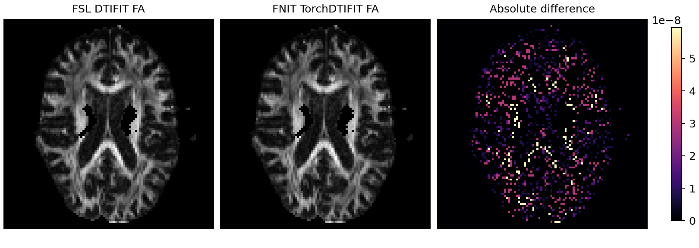

# PyTorch DTIFIT：FSL 默认 OLS diffusion tensor fit

`fnit.dtifit.TorchDTIFIT` 在 CPU 或 CUDA 上实现 FSL DTIFIT 默认的七参数 log-linear ordinary least-squares 路径。它输出 FA、S0、三个 eigenvalue、三个 eigenvector、MD 和 MO；`--save_tensor` 额外写六分量 tensor。运行时不调用 FSL，也不使用模型权重。

实现和验证目标是 [FSL FDT `2202.6` 的 `dtifit.cc`](https://git.fmrib.ox.ac.uk/fsl/fdt/-/blob/2202.6/dtifit.cc)，与 gpucw1 的 FSL 6.0.7.4 `dtifit` 二进制一致。算法步骤与默认 OLS 路径相同，但 PyTorch/LAPACK 的特征分解在近简并 eigenspace 中可以选择不同方向或顺序，因此不声明所有输出逐元素数值等价。

## 输入和原命令对应

FSL 命令：

```bash
dtifit \
  -k data_b1000.nii.gz \
  -m nodif_brain_mask.nii.gz \
  -r data_b1000.bvec \
  -b data_b1000.bval \
  -o dti
```

FNIT 命令：

```bash
fnit dtifit \
  -k data_b1000.nii.gz \
  -m nodif_brain_mask.nii.gz \
  -r data_b1000.bvec \
  -b data_b1000.bval \
  -o dti \
  --device cuda:0
```

- `-k` 是单被试 4D DWI。UKB v1.5 DTI 路径使用 b0 和 b≈1000 shell。
- `-m` 是同一网格的三维脑 mask。
- `-r` 是 FSL 3×N b-vector，`-b` 是 1×N b-value。
- `-o` 是不带扩展名的输出 basename。
- `--device` 选择 CPU 或 CUDA。拟合在 float64 中完成，NIfTI 输出为 float32。
- `--save_tensor` 对应 FSL 同名选项；默认不写 `<out>_tensor.nii.gz`。

FSL 的 `--wls` 不在当前实现中；传入 `weighted=True` 会明确报错，不会静默退化为 OLS。

## Python 调用

```python
from fnit import TorchDTIFIT

model = TorchDTIFIT(device="cuda:0")
result = model.run(
    data="data_b1000.nii.gz",
    mask="nodif_brain_mask.nii.gz",
    bvecs="data_b1000.bvec",
    bvals="data_b1000.bval",
    output_prefix="dti",
    save_tensor=False,
)

fa_image = result.maps["FA"]
print(result.qc)
```

`result.maps` 总是包含计算出的 scalar、vector 和 tensor 对象，便于 Python 内继续使用；`run()` 默认只写 FSL 默认文件。`result.qc` 记录设备、精度、TF32、耗时、峰值显存、voxel 和 volume 数。

如果输入仍含两个非零 shell，可先按照 UKB 的规则抽取 b0+b1000：

```python
from fnit.dtifit import select_shell

select_shell(
    data="eddy/data.nii.gz",
    bvals="AP.bval",
    bvecs="eddy/data.eddy_rotated_bvecs",
    output="data_b1000.nii.gz",
    shell=1000,
    tolerance=100,
)
```

该函数保存选中的 4D NIfTI，并在同目录写 `.bval` 和 `.bvec`；它仍只处理同一个被试。

## 输出合同

| 默认文件 | 内容 |
|---|---|
| `<out>_FA.nii.gz` | fractional anisotropy |
| `<out>_S0.nii.gz` | 拟合的 baseline signal |
| `<out>_L1/L2/L3.nii.gz` | 降序 eigenvalue |
| `<out>_V1/V2/V3.nii.gz` | 对应的三分量 eigenvector image |
| `<out>_MD.nii.gz` | mean diffusivity |
| `<out>_MO.nii.gz` | tensor mode |
| `<out>_tensor.nii.gz` | 仅 `save_tensor=True` 或 `--save_tensor` 时写出 |

文件命名、输出网格、scalar/vector shape 和 float32 dtype 与 FSL 一致。

## 算法对应

1. 建立 FSL 的七列 design matrix：六个对称 tensor 分量和 log-S0 截距。
2. 第一次 OLS 估计 S0；按 FSL 规则处理非正 signal 和过小 S0。
3. 将 signal 下限设为 `0.01×S0`，执行第二次 OLS。
4. 对 3×3 对称 tensor 做特征分解，并按 eigenvalue 降序输出 L1–L3 和 V1–V3。
5. 按 FSL 公式计算 FA、MD 和 MO。

## 真实数据对照

输入来自同一例真实 UKB 格式 AP dMRI 的官方 FSL EDDY 输出，并选择 5 个 b0 和 50 个 b≈1000 volume。脑 mask 内共有 242,261 个 voxel。

| 输出 | Pearson r | MAE | 最大绝对差 |
|---|---:|---:|---:|
| FA | 1.0000000000 | 4.25×10⁻⁹ | 1.19×10⁻⁷ |
| S0 | 1.0000000000 | 4.26×10⁻⁸ | 9.77×10⁻⁴ |
| L1 | 1.0000000000 | 1.09×10⁻¹³ | 4.66×10⁻¹⁰ |
| L2 | 1.0000000000 | 4.54×10⁻¹⁴ | 4.66×10⁻¹⁰ |
| L3 | 1.0000000000 | 2.69×10⁻¹⁴ | 4.66×10⁻¹⁰ |
| MD | 1.0000000000 | 3.44×10⁻¹⁴ | 4.66×10⁻¹⁰ |
| MO | 0.99999918 | 2.20×10⁻⁶ | 0.259 |

V1、V2、V3 的平均无符号夹角分别为 `0.00689°`、`0.00687°` 和 `0.00652°`。最大夹角较大，集中在 eigenvalue 接近、方向不唯一的 voxel；这也解释了 MO 的单 voxel 最大差。FA、S0、eigenvalue 和 MD 的差异处于 float32 写出量级。

三个独立进程计时包含读取、CUDA 初始化、计算和写出：

| 实现 | 三次 wall time (s) | 中位数 (s) | 最大 RSS 中位数 |
|---|---:|---:|---:|
| FSL 6.0.7.4 DTIFIT CPU | 6.58 / 6.47 / 6.25 | 6.47 | 244 MB |
| FNIT TorchDTIFIT H100 | 8.92 / 8.52 / 8.13 | 8.52 | 960 MB |

单个 UKB 被试上，FNIT 总耗时为 FSL 的 `1.32×`，没有速度收益；小型线性拟合不足以抵消 Python、CUDA context 和 NIfTI I/O。GPU 版本的价值是把后续流程保持在 PyTorch/CUDA，并允许调用方在包外组织多个独立被试。



机器可读数值见 [`validation/dtifit/report.public.json`](../../validation/dtifit/report.public.json)。图由 [`tools/plot_dmri_comparisons.py`](../../tools/plot_dmri_comparisons.py) 生成。
