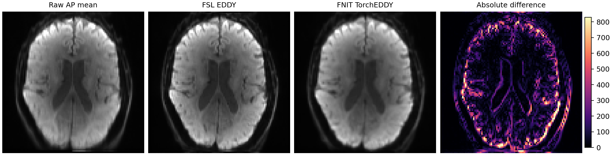

# TorchEDDY：UKB dMRI 运动、涡流和离群切片校正

`fnit.eddy.TorchEDDY` 在 PyTorch/CUDA 中实现单被试 EDDY 路径。它读取 FSL EDDY 的核心输入，联合估计逐体积 6-DOF 运动和 10 参数二次涡流场，使用已有 TOPUP 场校正 susceptibility 畸变，更新 b-vector，并替换离群切片。运行时不调用 FSL，也不需要模型权重。

实现参照 [FSL EDDY `2111.0`](https://git.fmrib.ox.ac.uk/fsl/eddy)、FSL 6.0.7.4 的命令合同，以及 [UK Biobank pipeline v1.5](https://git.fmrib.ox.ac.uk/falmagro/uk_biobank_pipeline_v_1.5) 的参数组合。优化器和 q-space predictor 是适合 PyTorch 自动微分的独立实现，因此输出并非 FSL EDDY 的逐体素数值复制。FNIT 0.14.0 的真实数据基准中，校正后全部脑内 DWI 与 FSL GPU EDDY 的相关系数为 0.9832；报告所列数值源码 SHA-256 与当前 0.16.0 一致；差异明显超过浮点舍入，不能互换用于要求严格 FSL 数值复现的分析。

CUDA 路径使用 float32 并允许 TF32；不自动启用 float16 或 bfloat16。默认 `seed=0`，相同输入、代码和设备上的优化顺序可复现。

## 与 FSL 命令的对应关系

官方 UKB v1.5 路径调用：

```bash
eddy_cuda10.2 \
  --imain=AP.nii.gz --mask=nodif_brain_mask.nii.gz \
  --topup=fieldmap_out --acqp=acqparams.txt --index=eddy_index.txt \
  --bvecs=AP.bvec --bvals=AP.bval --out=eddy/data --ref_scan_no=0 \
  --flm=quadratic --resamp=jac --slm=linear --niter=8 \
  --fwhm=10,8,4,2,0,0,0,0 --ff=10 --sep_offs_move \
  --nvoxhp=1000 --repol --rms
```

FNIT 的直接模式使用相同的影像、mask、TOPUP basename、acquisition parameters、index 和梯度文件：

```bash
fnit eddy \
  --imain AP.nii.gz \
  --mask nodif_brain_mask.nii.gz \
  --topup fieldmap_out \
  --acqp acqparams.txt \
  --index eddy_index.txt \
  --bvecs AP.bvec --bvals AP.bval \
  --out eddy/data --ref-scan-no 0 \
  --device cuda:0
```

各行含义如下：

- `--imain` 是一个被试的 4D AP DWI；第四维必须与 b-value、b-vector 和 index 长度相同。
- `--mask` 是与 DWI 前三维完全一致的脑 mask。
- `--topup` 是不带 `_fieldcoef.nii.gz` 后缀的 TOPUP basename，可来自 FNIT TOPUP 或 FSL TOPUP。
- `--acqp` 每行依次为三个 phase-encoding 分量和 total readout time；`--index` 用 1-based 行号把每个 DWI volume 对应到 `acqp`。
- `--bvecs`、`--bvals` 是 FSL 的 3×N 和 1×N 文本格式。
- `--out` 是不带扩展名的输出 basename；`--ref-scan-no` 是 0-based 固定参考 volume。
- `--device cuda:0` 在第一张可见 GPU 上运行；也可指定 `cpu`，但本功能按 GPU 路径验证。

参数组合在模型层面对应 quadratic EC field、Jacobian resampling、slice outlier replacement 和 RMS 输出。它没有逐项复刻 FSL 的 Gaussian-process hyperparameter sampling、shell alignment 和原生 C++/CUDA 优化器。

## Python 调用

```python
from fnit import TorchEDDY

eddy = TorchEDDY(
    device="cuda:0",  # 运行设备：第一张可见 CUDA GPU
)
result = eddy.run(
    imain="AP.nii.gz",  # 输入：单被试 4D AP DWI
    mask="nodif_brain_mask.nii.gz",  # 输入：DWI 网格上的 3D 脑掩膜
    topup="fieldmap_out",  # 输入：TOPUP coefficient 与运动文件的根名
    acqp="acqparams.txt",  # 输入：相位编码方向和总读出时间
    index="eddy_index.txt",  # 输入：每个 volume 对应的 acqp 行号
    bvecs="AP.bvec",  # 输入：FSL 3×N 梯度方向
    bvals="AP.bval",  # 输入：与 DWI volume 顺序一致的 b-value
    out="eddy/data",  # 输出：FSL 风格结果 basename
    ref_scan_no=0,  # 固定参考：使用第 0 个 volume
    overwrite=False,  # 写盘策略：不覆盖已有文件
)
```

`result.corrected` 是校正后的 NIfTI；`rotated_bvecs`、`parameters`、RMS 和 outlier 字段是 NumPy 数组；`result.qc` 记录设备、TF32、峰值显存、随机种子、耗时和优化层级。`run()` 会把这些对象写到磁盘。

UKB 目录已经由 TOPUP 准备好时，可用单被试便捷接口：

```python
from fnit.eddy import run_ukb_eddy

result, inputs = run_ukb_eddy(
    raw_dir="subject/raw",  # 输入：AP.nii.gz、AP.bval、AP.bvec 的目录
    topup_dir="subject/topup",  # 输入：TOPUP acquisition 参数与 coefficient 目录
    output_dir="subject/eddy",  # 输出：该受试者的 EDDY 结果目录
    device="cuda:0",  # 运行设备：第一张可见 CUDA GPU
    overwrite=False,  # 写盘策略：不覆盖已有文件
)
```

对应命令行为：

```bash
fnit eddy \
  --raw-dir subject/raw \
  --topup-dir subject/topup \
  --output-dir subject/eddy \
  --device cuda:0
```

便捷模式生成一个全 1 的 AP `eddy_index.txt`，从 TOPUP 校正 b0 或 AP 数据估计脑 mask，并使用 UKB b0 选择规则确定参考帧。它仍只处理一个被试。

## 输出

| 文件 | 形状或内容 | 与 FSL 的关系 |
|---|---|---|
| `<out>.nii.gz` | X×Y×Z×N 校正 DWI | 相同命名和网格 |
| `<out>.eddy_rotated_bvecs` | 3×N | 相同文本合同 |
| `<out>.eddy_parameters` | N×16；6 个运动参数和 10 个 EC 参数 | 相同列数，估计值不数值等价 |
| `<out>.eddy_movement_rms` | N×2 | 相同文本合同 |
| `<out>.eddy_restricted_movement_rms` | N×2 | 相同文本合同 |
| `<out>.eddy_outlier_map` | N×Z | 相同布局 |
| `<out>.eddy_outlier_n_stdev_map` | N×Z | 稳健切片残差 z 分数 |
| `<out>.eddy_outlier_n_sqr_stdev_map` | N×Z | 上一项的平方 |
| `<out>.eddy_outlier_report` | 文本 | 相同用途 |
| `<out>.eddy_qc.json` | 运行与资源记录 | FNIT 额外输出 |

FSL 可选的 `eddy_outlier_free_data`、post-eddy shell alignment 和命令快照不在 FNIT 合同中。因此这里的兼容性指共享核心文件的命名、维度和字段含义，不表示 FSL 的全部辅助文件齐全。

## 实现步骤

1. 读取 TOPUP cubic B-spline coefficient，并在 DWI 网格计算 Hz 场及其 phase-encoding 导数。
2. 为每个 volume 建立 6 个刚体参数和 10 个二次 EC 参数；参考帧保持为零。
3. 按 UKB 的八级 FWHM schedule 优化 q-space prediction residual。
4. 用最终 susceptibility + EC displacement 重采样，并用场导数做 Jacobian intensity modulation。
5. 在每个 shell 内计算 slice residual 的 median/MAD z-score，替换超过阈值的切片。
6. 用最终刚体旋转更新 b-vector，并写 FSL 核心输出。

## 当前发布验收状态

当前源码已在同一例真实 UKB 格式 dMRI 上运行。校正 DWI、旋转 b-vector、参数、两种 RMS、outlier map、outlier z-score 和 outlier report 共八项核心输出的逐文件 SHA-256 与报告绑定值相同。因此下述精度和示意图覆盖当前数值路径；机器可读报告同时记录当前调用链源码 hash。

另有一次以 FSL `eddy_cuda10.2` 为固定基准、逐项核对输入 SHA-256 的[匹配输入验证](../../validation/eddy/README.md)。该实验的 b≈1000、b≈2000 每体素跨梯度方向相关中位数分别为 0.780 和 0.755，离群切片只有 1 个重合。严格数值复刻尚未完成；下方 0.14.0 表格和图片是此前一次运行的记录，不代表这次匹配输入实验。

## 真实数据对照

验证输入为一例真实 UKB 格式 dMRI：`104×104×72×105`，5 个 b0、50 个 b≈1000 和 50 个 b≈2000 volume；反向 PA 数据用于先行 TOPUP。FSL 和 FNIT 使用同一 AP、mask、TOPUP field、acqparams、index、bval、bvec 和参考帧。硬件为 gpucw1 的 NVIDIA H100 PCIe 80 GB；节点为共享状态。

| 比较范围 | Pearson r | MAE | RMSE |
|---|---:|---:|---:|
| 全部脑内 voxel×volume | 0.98324 | 238.98 | 372.62 |
| 每 voxel 的 105-volume 均值 | 0.96789 | 137.67 | 220.04 |
| b0 | 0.98960 | 424.56 | 775.61 |
| b≈1000 | 0.94148 | 262.01 | 388.98 |
| b≈2000 | 0.92085 | 197.38 | 283.05 |

旋转后 b-vector 与 FSL 的平均夹角为 `0.646°`，最大 `0.996°`；平移参数 MAE 为 `0.710 mm`，旋转参数 MAE 为 `0.00767 rad`。这些是参考实现一致性指标，不是畸变校正的人工真值精度。

计时范围包含进程启动、NIfTI I/O、优化和写出。FSL CPU、FSL GPU 与当前 FNIT 各完成一次有效运行。节点为共享状态，因此单次耗时用于同机量级比较，不作为稳定吞吐量估计。

| 实现 | 设备 | 总耗时 | 峰值内存 | 相对 FNIT 最终运行 |
|---|---|---:|---:|---:|
| FSL `eddy_cpu` | Xeon Gold 6430 | 1844.16 s | 16.65 GB RSS | 33.05× |
| FSL `eddy_cuda10.2` | H100 PCIe 80 GB | 646.52 s | 1.21 GB RSS | 11.59× |
| FNIT TorchEDDY 0.14.0 | H100 PCIe 80 GB | 55.80 s | 2.24 GB RSS；3.48 GB peak CUDA | 1.00× |

当前 FNIT 运行的内部同步计算为 `28.99 s`。FSL CPU 与 GPU 输出本身并非逐值相同：全部脑内 voxel×volume 的 `r=0.99904`、MAE `42.08`，旋转后 b-vector 平均夹角 `0.070°`。FNIT 对 FSL CPU 的对应 `r=0.98267`、MAE `241.63`，与对 FSL GPU 的结论一致。



机器可读数值见 [`validation/eddy/report.public.json`](../../validation/eddy/report.public.json)。图由 [`tools/plot_dmri_comparisons.py`](../../tools/plot_dmri_comparisons.py) 从同一病例的最终结果生成；仓库不发布原始临床影像。

## 当前边界

- 当前仅支持所有 volume 共用一个 `i`、`j` 或 `k` phase-encoding 轴；UKB AP 的 `j-` 已验证。
- slice-to-volume motion、susceptibility-by-movement、multi-band slice grouping、shell alignment 和 FSL Gaussian-process predictor 未复刻。
- 对需要与 FSL EDDY 完全相同参数或全部辅助文件的研究，应继续使用官方 EDDY。FNIT 适合需要 PyTorch GPU 单被试处理、核心 FSL 文件合同和明确近似边界的场景。
