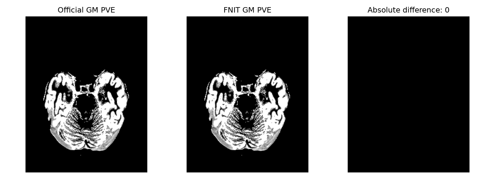

# TorchFAST：T1 组织分割与偏置校正

[返回首页](../../README.md) · [完整旧文档与更早证据](../../validation/fast/readme_archive_20261005.md)

| 项目 | 内容 |
|---|---|
| 输入 | 已脑提取单通道T1w，可选同网格mask |
| 输出 | CSF/GM/WM PVE、分类、bias与restore共8图 |
| 对应原软件 | FSL FAST4（T1三分类无先验） |
| Python / CLI | fnit.fast.TorchFAST；fnit fast |
| CPU / GPU | CPU（Numba）或CUDA（Torch/Triton）；读写用nibabel |

## 1. 功能简介

输入脑提取后的单帧 T1w，输出 CSF、GM、WM 三张部分体积图、三种分类图、乘性偏置场和校正图。计算使用 PyTorch；CUDA 的顺序扫描使用 Triton，CPU 的顺序扫描、随机流、卷积和 PVE 使用 Numba 编译内核。运行时不调用 FSL，不需要权重。

`execution="fsl"` 对应 FAST4 的三分类 T1、无先验路径，保留其原位更新顺序。独立接口默认仍为 `execution="tensor"`，使用同步更新；需要复现 FSL 时请显式选择 `fsl`。当前 fMRI volume 流程已显式选择 `fsl`。

<a id="单被试-python-调用"></a>
<a id="输入输出合同"></a>
<a id="参数"></a>
<a id="既有官方精度-benchmark不同输入与环境"></a>
<a id="张量接口与代码结构"></a>

## 2. Python 调用

```python
from fnit.fast import TorchFAST

tissue_segmentation_model = TorchFAST(
    device="cuda:0",  # 第一张可见 CUDA GPU；也可用 "cpu"
    threads=1,  # PyTorch CPU 线程数
    execution="fsl",  # 按 FAST4 的顺序更新组织后验与混合组织标签
)
tissue_segmentation_result = tissue_segmentation_model(
    image="T1_brain.nii.gz",  # 脑提取后的单帧 T1w：路径或 nibabel 影像
    mask=None,  # 可选同网格脑掩膜；省略时使用 image > 0
)
tissue_segmentation_result.pve_csf.save(path="T1_brain_pve_0.nii.gz")  # CSF 部分体积，0–1
tissue_segmentation_result.pve_gm.save(path="T1_brain_pve_1.nii.gz")  # GM 部分体积，0–1
tissue_segmentation_result.pve_wm.save(path="T1_brain_pve_2.nii.gz")  # WM 部分体积，0–1
tissue_segmentation_result.hard_segmentation.save(path="T1_brain_seg.nii.gz")  # HMRF 最大后验分类
tissue_segmentation_result.pve_segmentation.save(path="T1_brain_pveseg.nii.gz")  # 最大 PVE 分类
tissue_segmentation_result.mixel_type.save(path="T1_brain_mixeltype.nii.gz")  # 纯组织/两组织混合类型
tissue_segmentation_result.bias_field.save(path="T1_brain_bias.nii.gz")  # acquired image 的乘性偏置场
tissue_segmentation_result.restored.save(path="T1_brain_restore.nii.gz")  # 脑内 image / bias_field
```

### 输入数据格式

- `image`：脑提取后的单通道T1w，路径或nibabel SpatialImage，3D `(X,Y,Z)`或只有一帧的4D。有限值、有效affine与header pixdim；保持原生空间和方向。强度无固定物理单位。
- `mask`：同shape、同affine的3D非空掩膜，非零视为脑内；与image>0取交集，None使用image>0。未去颅骨图应先用[SynthStrip](../synthstrip/README.md)。
- 内部按FSL存储手性处理X轴方向；写出后仍与输入网格相同，不需用户手动翻转。CPU原序使用Numba，首次编译与缓存状态影响时间。

### 算法构造

| 参数 | 必需 | 类型 | 默认值 | 含义 |
|---|---|---|---|---|
| `device` | 否 | `str` | `'cpu'` | 计算设备，cpu 或 cuda:N；编号遵循 CUDA_VISIBLE_DEVICES |
| `threads` | 否 | `int 或 None` | `None` | PyTorch CPU 线程预算；None 保留当前值，CLI 默认另见下节 |
| `init_iterations` | 否 | `int` | `15` | 初始 GMM 更新次数；实际初始总数另含 fixed_iterations |
| `bias_iterations` | 否 | `int` | `4` | 组织分割与 bias 联合更新次数 |
| `fixed_iterations` | 否 | `int` | `4` | 固定 bias 后的组织更新次数 |
| `bias_fwhm_mm` | 否 | `float` | `20.0` | bias 平滑尺度，mm；0 关闭 bias 更新 |
| `init_mrf` | 否 | `float` | `0.02` | bias 阶段和首轮固定阶段的组织空间权重 |
| `mrf` | 否 | `float` | `0.1` | 后续固定阶段的组织空间权重 |
| `mixel_mrf` | 否 | `float` | `0.3` | 纯组织/混合类型空间权重 |
| `pve_steps` | 否 | `int` | `100` | 最终 PVE 比例网格步数；默认100 |
| `mean_field_iterations` | 否 | `int` | `5` | 每个 HMRF 外循环扫描遍数；原版默认5 |
| `pve_chunk_size` | 否 | `int` | `8` | tensor/CUDA PVE 候选分块大小；CPU原序路径不由此改变分块 |
| `execution` | 否 | `str` | `'tensor'` | tensor 同步更新；fsl 保留 FAST4 原位顺序，运行时不调用 FSL |

### 单次调用

| 参数 | 必需 | 类型 | 默认值 | 含义 |
|---|---|---|---|---|
| `image` | 是 | `str 或 Path 或 nibabel SpatialImage` | `—` | 输入影像，格式、维数与预处理约束见输入数据格式 |
| `mask` | 否 | `str 或 Path 或 nibabel SpatialImage 或 None` | `None` | 可选同网格脑掩膜，与正输入取交集；None 使用 image>0 |

### 输出

```text
results/
├── T1_brain_pve_0.nii.gz / _pve_1.nii.gz / _pve_2.nii.gz
├── T1_brain_seg.nii.gz / _pveseg.nii.gz / _mixeltype.nii.gz
└── T1_brain_bias.nii.gz / _restore.nii.gz
```

八张`FASTResult`影像均为nibabel兼容、输入原生网格，shape/affine与输入同；Python需逐图save，CLI按前缀自动写默认6图，-b/-B另写bias/restore。

| 返回字段 | 定义 |
|---|---|
| pve_csf / pve_gm / pve_wm | float32；脑内CSF/GM/WM比例，0–1；三者和1，脑外0 |
| hard_segmentation / pve_segmentation | int32；背景0，1CSF、2GM、3WM |
| mixel_type | int32；0/1/2纯CSF/GM/WM，3/4/5为CSF-GM/CSF-WM/GM-WM，脑外0 |
| bias_field | float32乘性bias，脑外1，无量纲 |
| restored | float32，脑内input/bias，脑外0；单位同输入 |
| tissue_means / tissue_variances | 校正线性强度的三组织均值/方差；Python内存返回 |

<a id="单被试命令行"></a>

## 3. 命令行调用

```bash
fnit fast -i T1_brain.nii.gz -o results/T1_brain \
  --execution fsl --device cuda:0 --threads 1 -b -B
```

### fnit fast

| CLI 参数 | Python 参数 / 输出 | 含义 |
|---|---|---|
| `-i` / `--image` | `image` | 输入影像，格式、维数与预处理约束见输入数据格式 |
| `-o` / `--output-prefix` | `影像保存前缀` | 输出文件名前缀 |
| `--mask` | `mask` | 可选同网格脑掩膜，与正输入取交集；None 使用 image>0 |
| `--device` | `device` | 计算设备，cpu 或 cuda:N；编号遵循 CUDA_VISIBLE_DEVICES |
| `--threads` | `threads` | PyTorch CPU 线程预算；None 保留当前值，CLI 默认另见下节 |
| `-W` / `--init-iterations` | `init_iterations` | 初始 GMM 更新次数；实际初始总数另含 fixed_iterations |
| `-I` / `--bias-iterations` | `bias_iterations` | 组织分割与 bias 联合更新次数 |
| `-O` / `--fixed-iterations` | `fixed_iterations` | 固定 bias 后的组织更新次数 |
| `-l` / `--bias-fwhm-mm` | `bias_fwhm_mm` | bias 平滑尺度，mm；0 关闭 bias 更新 |
| `-f` / `--init-mrf` | `init_mrf` | bias 阶段和首轮固定阶段的组织空间权重 |
| `-H` / `--mrf` | `mrf` | 后续固定阶段的组织空间权重 |
| `-R` / `--mixel-mrf` | `mixel_mrf` | 纯组织/混合类型空间权重 |
| `--pve-steps` | `pve_steps` | 最终 PVE 比例网格步数；默认100 |
| `--execution` | `execution` | tensor 同步更新；fsl 保留 FAST4 原位顺序，运行时不调用 FSL |
| `-N` / `--no-bias` | `bias_fwhm_mm=0` | 关闭偏置校正 |
| `-b` / `--save-bias` | `bias_field.save` | 保存乘性bias图 |
| `-B` / `--save-restored` | `restored.save` | 保存校正图 |
| `--overwrite` | `overwrite` | 已有任何同名结果时是否覆盖 |

CLI与Python默认差异：Python threads=None，CLI为1；两者execution默认tensor，需显式fsl。

## 4. 原软件调用

以下命令用于独立原软件参考环境；FNIT生产入口不执行它。

```bash
fast -t 1 -n 3 -I 4 -W 15 -O 4 -f 0.02 -l 20 -H 0.1 -R 0.3 \
  -b -B -o reference/T1_brain T1_brain.nii.gz
```

| FNIT参数 / 产物 | 原软件参数 / 产物 |
|---|---|
| init_iterations / bias_iterations / fixed_iterations | -W / -I / -O |
| bias_fwhm_mm / init_mrf / mrf / mixel_mrf | -l / -f / -H / -R |
| bias_fwhm_mm=0 | -N |
| pve_steps / mean_field_iterations | 原内部iterationspve / 原固定5 |
| image / output-prefix / bias/restore保存 | 最后位置输入 / -o / -b / -B |

固定T1三组织、无先验。T2/PD、多通道、其他类别数、先验、手工均值和nopve未覆盖。tensor同步更新与原FAST算法有差异；需要本页原序结果时显式execution="fsl"，该名称表示内部算法而不启动FSL。

<a id="本轮修复"></a>
<a id="2026-10-04-最新-cpu-精度修复与-gpu-回归"></a>

## 5. 最新精度和运行时间

最新2026-10-04 CPU修复用公开ds003138一例完整SynthStrip脑图，224×288×288、2,843,038正脑体素。原版FSL6.0.7.4，FNIT为f1cbdab1基线上的标量数学冻结v1/v2，源码SHA见[机器报告](../../validation/smri_cpu/fast_fixes_20261004/results/report.json)。CPU评测节点 Xeon Gold6418H同8物理核/8线程预算，原FAST主要单线程；CPU原有float32/float64位置及非fastmath保留。完整CLI含启动、读写、8图保存，排除等待和事后评分。

### 端到端 benchmark

| 指标 | FNIT | 原软件 | 差异 |
|---|---|---|---|
| 默认ABBA完整CLI | 110.173 / 100.174 s | 411.291 / 368.198 s | 八图及affine逐值同 |
| 非默认完整CLI | 53.592 s | 119.226 s | 八图逐值同 |
| 最终延迟导入源码v2单次CLI | 105.840 s | 保存官方参考复用 | 八图仍逐值同；不是新的ABBA |
| 默认采样RSS | 3.104–3.290 GB | 2.240–2.282 GB | FNIT本例更快而内存较多 |

### 分步骤 benchmark

| 阶段 | FNIT | 原软件 |
|---|---|---|
| CPU网络/EM/bias/PVE阶段 | 原报告有34次跟踪；未记录统一双方纯阶段墙钟 | 未记录同边界表 |
| 完整GPU tensor API新/旧/旧/新 | 3.838 / 3.446 / 3.751 / 3.849 s | 非原软件配对 |
| 完整GPU fsl API新/旧/旧/新 | 21.713 / 22.989 / 23.275 / 22.333 s | 非原软件配对 |

默认CPU中位数观测比3.706倍，限定本输入/配置/资源；共享节点load82–123。H100完整真实脑旧新八图SHA与header同，20GB预算内allocated/reserved为tensor3.836/5.505GB、fsl2.603/5.505GB。CUDA数学未改，不据波动声称GPU提速。默认tensor对官方仍有明显PVE差；本例无损结论只属fsl路径。[协议与脑图](../../validation/smri_cpu/fast_fixes_20261004/README.md)。



<a id="最近版本记录"></a>

## 6. 最近版本和 benchmark

| 日期 | commit / version | 变化 | benchmark |
|---|---|---|---|
| 2026-10-04 | cpu_math_source_v2 | 系统libm标量数学、延迟CPU编译器导入 | 默认单次105.840s，全部8图同参考 |
| 2026-10-04 | cpu_math_source_v1 | 修复指数/对数末位引起PVE选点变化 | 默认/非默认完整CLI与官方八图同 |
| 2026-10-04 | f1cbdab1 | CPU原序Numba内核 | [历史CPU记录](../../validation/smri_cpu_20261004/task04/README.md) |
| 较早版本 | FAST报告源码SHA | GPU原位波前、存储手性与随机流 | [历史固定脑对照](../../validation/fast/report.public.json) |

每条记录保留真实冻结源码、输入与时间边界；逐例、debug/profiling和更早脑图见[完整归档](../../validation/fast/readme_archive_20261005.md)。文档整理不重跑MRI，不把执行成功或--help核验作为精度benchmark。

<a id="原实现与文献"></a>

## 7. 参考文献、原软件和资源

- [FAST 官方说明](https://fsl.fmrib.ox.ac.uk/fsl/docs/structural/fast.html)；[FAST4 官方代码库](https://git.fmrib.ox.ac.uk/fsl/fast4)。
- Zhang, Brady & Smith, *Segmentation of brain MR images through a hidden Markov random field model and the expectation-maximization algorithm*, IEEE TMI (2001), [doi:10.1109/42.906424](https://doi.org/10.1109/42.906424)。
- 改写及已有上游参考受 [FSL 6.0 非商业许可](../../licenses/FSL-6.0.txt)约束；源码不会在运行时编译或调用原 FAST。

无模型权重、外部图谱或模板要求。标准脑图由用户提供，算法不联网。Numba/Triton等已在主页Conda环境；原代码及本移植适用[FSL 6.0许可](../../licenses/FSL-6.0.txt)。
