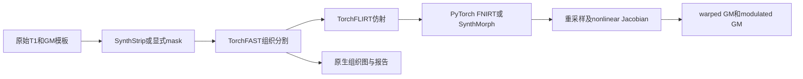

# FastVBM：单被试 T1w 到调制灰质图

[返回首页](../../README.md) · [完整旧文档与更早证据](../../validation/fast_vbm/readme_archive_20261005.md)

| 项目 | 内容 |
|---|---|
| 输入 | 原始3D T1w、GM模板、可选同网格mask |
| 输出 | 10幅原生图及3幅模板图、阶段JSON |
| 对应原软件 | FSL FAST/FLIRT/FNIRT、UKB v1.5 VBM；可选SynthMorph |
| Python / CLI | fnit.FastVBM；fnit fast-vbm |
| CPU / GPU | CPU/CUDA；共享PyTorch组件，读写和部分计算为CPU |

<a id="1-功能简介与流程"></a>

## 1. 功能简介

`FastVBM` 是仓库唯一的 VBM 实现和共享入口。它接收一幅原始 3D T1w 和一幅 GM 模板，输出输入空间的脑提取及三组织分割结果，以及模板空间的 warped GM、nonlinear-only Jacobian 和 modulated GM。它是单被试接口，不负责批量调度。UKB v1.5 的 `bb_struct_init / bb_vbm` 只在[参考配方页](../ukb_vbm/README.md)中单独说明，不对应第二个 Python 类、`run()` 方法或 CLI。

流程在 Python 进程内运行，不启动 FreeSurfer 或 FSL 可执行文件。CUDA 默认允许 TF32 matmul 和 cuDNN 内核；网络及主要连续图计算使用 float32，不启用 float16 或 bfloat16。实际开关写入 `fast_vbm_report.json`。脑图保留输入 dtype，mask 保存为 uint8，组织标签为 int32，PVE、bias、restore 与标准空间连续图为 float32。



<a id="2-python-调用输入与输出"></a>
<a id="输入"></a>
<a id="单被试-python-调用"></a>
<a id="构造参数"></a>
<a id="返回值和文件输出"></a>

## 2. Python 调用

```python
from fnit import FastVBM

vbm_pipeline = FastVBM(
    device="cuda:0",  # PyTorch计算设备
    threads=4,  # CPU线程预算
    registration_backend="fnirt",  # 使用TorchFNIRT GM配置
    fast_execution="fsl",  # 项目内部FAST原序实现，不启动FSL
)
vbm_result = vbm_pipeline.run(
    image="subject_T1w.nii.gz",  # 原始3D T1w
    template="template_GM.nii.gz",  # 固定GM模板，决定模板空间网格
    output_dir="results/sub-01",  # 单被试输出目录
    brain_mask=None,  # 省略时SynthStrip自动提取
    reference_mask="template_brain_mask.nii.gz",  # 同模板网格显式掩膜
    overwrite=False,  # 不覆盖已有同名产物
)
```

### 输入数据格式

| 输入 | 类型 | 约束 | 用途 |
|---|---|---|---|
| `image` | 路径或 `nibabel.spatialimages.SpatialImage` | 单帧、有限值、3D T1w | 脑提取和组织分割 |
| `template` | 路径或 `nibabel.spatialimages.SpatialImage` | 单帧、有限值、3D，至少包含一个正值 | fixed GM template；决定模板空间输出的 shape 和 affine |
| `brain_mask` | 路径或 `nibabel.spatialimages.SpatialImage`，可省略 | 与 T1w shape 和 affine 一致，非空 | 提供时跳过 SynthStrip |
| `reference_mask` | 路径或 `nibabel.spatialimages.SpatialImage`，可省略 | 与 GM template shape 和 affine 一致，非空 | FNIRT 显式 reference mask；SynthMorph 只记录其摘要 |
| `output_dir` | 路径 | 单个受试者的独立目录 | 保存 13 幅 NIfTI 和一份 JSON 报告 |

省略 `reference_mask` 时，FastVBM 从 `template > 0` 构造显式 mask，并在 QC 中标记为派生 mask。复现某次 FSL/UKB 运行时，应传入该运行实际使用的 reference mask；任意 mask 或派生 mask 都不能作为与 FSL 数值等价的证据。

全部影像具有有效4×4 affine与空间单位mm，不需用户重排orientation。T1与GM模板可不同网格；模板应位于明确的MNI或其他目标空间。输入强度无固定物理单位，GM模板为连续GM值。mask非零视为真，不可直接传错网格标签。None时reference_mask由template>0派生；与FSL复现应给当次实际mask。

### pipeline构造

| 参数 | 必需 | 类型 | 默认值 | 含义 |
|---|---|---|---|---|
| `device` | 否 | `str` | `'cpu'` | 计算设备，cpu 或 cuda:N；编号遵循 CUDA_VISIBLE_DEVICES |
| `threads` | 否 | `int 或 None` | `None` | PyTorch CPU 线程预算；None 保留当前值，CLI 默认另见下节 |
| `synthstrip_weights` | 否 | `str 或 Path 或 None` | `None` | SynthStrip PT 文件或目录；仅未提供 brain_mask 时使用 |
| `synthmorph_weights` | 否 | `str 或 Path 或 None` | `None` | SynthMorph deform H5 文件或目录；仅 synthmorph 后端使用 |
| `bias_correction` | 否 | `bool` | `True` | 启用FAST偏置校正；False将bias_fwhm_mm设0 |
| `fast_execution` | 否 | `str` | `'tensor'` | FAST 更新模式：tensor 或内部原序 fsl |
| `synthmorph_extent` | 否 | `int` | `256` | SynthMorph 网络尺寸，192 或256 |
| `synthmorph_hyper` | 否 | `float` | `0.5` | SynthMorph 正则化，严格0<hyper<1 |
| `synthmorph_steps` | 否 | `int` | `7` | SynthMorph 速度场积分步数，至少5 |
| `registration_backend` | 否 | `str` | `'synthmorph'` | 非线性估计器：synthmorph 或 fnirt |
| `fnirt_strides` | 否 | `tuple[int, ...]` | `(4, 2, 1, 1)` | 四个分辨率层的体素采样步长 |
| `fnirt_steps` | 否 | `tuple[int, ...]` | `(5, 5, 10, 5)` | 四层 Gauss–Newton 最大更新次数 |
| `fnirt_input_fwhm_mm` | 否 | `tuple[float, ...]` | `(6.0, 4.0, 2.0, 2.0)` | 四层 moving GM 平滑 FWHM，mm |
| `fnirt_reference_fwhm_mm` | 否 | `tuple[float, ...]` | `(4.0, 2.0, 0.0, 0.0)` | 四层 fixed GM 平滑 FWHM，mm |
| `fnirt_warp_resolution_mm` | 否 | `float` | `10.0` | FNIRT 三次 B-spline 控制点间距，mm |
| `fnirt_regularization` | 否 | `tuple[float, ...]` | `(150.0, 75.0, 50.0, 30.0)` | 四层 bending-energy 正则化权重 |

### run输入与保存参数

| 参数 | 必需 | 类型 | 默认值 | 含义 |
|---|---|---|---|---|
| `image` | 是 | `str 或 Path 或 nibabel SpatialImage` | `—` | 输入影像，格式、维数与预处理约束见输入数据格式 |
| `template` | 是 | `str 或 Path 或 nibabel SpatialImage` | `—` | 3D GM 模板；决定标准空间结果 shape、affine 和空间 |
| `output_dir` | 是 | `str 或 Path` | `—` | 结果或调试文件的目录；具体自动保存范围见输出 |
| `brain_mask` | 否 | `str 或 Path 或 nibabel SpatialImage 或 None` | `None` | 同 T1 网格非空二值掩膜；有值时跳过 SynthStrip |
| `reference_mask` | 否 | `str 或 Path 或 nibabel SpatialImage 或 None` | `None` | 同模板网格非空 mask；FNIRT使用，SynthMorph仅记录 |
| `overwrite` | 否 | `bool` | `False` | 已有任何同名结果时是否覆盖 |

### 输出

```text
results/sub-01/
├── T1_brain.nii.gz / brain_mask.nii.gz
├── T1_brain_pve_0.nii.gz / _pve_1.nii.gz / _pve_2.nii.gz
├── T1_brain_seg.nii.gz / _pveseg.nii.gz / _mixeltype.nii.gz
├── T1_brain_bias.nii.gz / _restore.nii.gz
├── T1_GM_to_template_GM.nii.gz
├── T1_GM_JAC_nl.nii.gz
├── T1_GM_to_template_GM_mod.nii.gz
└── fast_vbm_report.json
```

| Python 属性 | 内容 |
|---|---|
| `brain`、`brain_mask` | 输入 T1 网格的脑图和二值 mask |
| `fast` | `FASTResult`；含三类 PVE、分割、mixel、bias 和 restored T1 |
| `registration` | `VBMRegistrationResult`；含模板空间结果和配准 QC |
| `pve_gm` | `fast.pve_gm` 的便利属性 |
| `warped_gm` | affine 与所选 nonlinear backend 共同重采样后的 GM |
| `jacobian` | nonlinear-only pull Jacobian，不含 FLIRT affine determinant |
| `modulated_gm` | `warped_gm * jacobian` |
| `settings` | 设备、TF32、mask 来源、后端和实际参数 |
| `timing_sec` | 脑提取、FAST、配准/Jacobian/modulation 和总墙钟时间 |

| Python 键 | 文件名 | 网格 | 含义 |
|---|---|---|---|
| `brain` | `T1_brain.nii.gz` | 输入 T1 | 脑内保留输入；默认脑外背景为 `min(input.min(), 0)`，负值输入时为该最小值 |
| `brain_mask` | `brain_mask.nii.gz` | 输入 T1 | 二值脑 mask |
| `pve_csf` | `T1_brain_pve_0.nii.gz` | 输入 T1 | CSF PVE |
| `pve_gm` | `T1_brain_pve_1.nii.gz` | 输入 T1 | GM PVE，配准 moving image |
| `pve_wm` | `T1_brain_pve_2.nii.gz` | 输入 T1 | WM PVE |
| `hard_segmentation` | `T1_brain_seg.nii.gz` | 输入 T1 | PVE 前硬分类 |
| `pve_segmentation` | `T1_brain_pveseg.nii.gz` | 输入 T1 | 最大 PVE 分类 |
| `mixel_type` | `T1_brain_mixeltype.nii.gz` | 输入 T1 | pure/mixed tissue 类型 |
| `bias_field` | `T1_brain_bias.nii.gz` | 输入 T1 | 乘性 bias field，脑外为 1 |
| `restored` | `T1_brain_restore.nii.gz` | 输入 T1 | bias-corrected T1，脑外为 0 |
| `warped_gm` | `T1_GM_to_template_GM.nii.gz` | GM template | affine + nonlinear warped GM |
| `jacobian` | `T1_GM_JAC_nl.nii.gz` | GM template | 仅非线性 pull 变换的行列式 |
| `modulated_gm` | `T1_GM_to_template_GM_mod.nii.gz` | GM template | warped GM × Jacobian |

另写 `fast_vbm_report.json`，记录参数、分阶段时间、FAST 摘要、配准 QC 和输出文件名。报告不保存原始输入路径。

脑图保留输入dtype，mask uint8，三种分类int32；PVE/bias/restore及三模板连续图float32。原生10图shape/affine与T1同，末三图shape/affine与GM模板同。PVE及Jacobian无量纲，modulated GM=warped GM×nonlinear Jacobian；数值体积另可用体素体积积分，单位mm³。

内部forward affine为moving-world→fixed-world；采样为fixed→moving pull，nonlinear Jacobian不含FLIRT affine determinant。CPU FNIRT用已计算的解析coefficient Jacobian，其余路径保留dense-field定义。pipeline不另写warp/coefficient；需要这些用[独立FNIRT](../fnirt/README.md)。FastVBM(...)()与run输入角色相同但无output_dir/overwrite，只返回内存；result.save(output_dir,overwrite=False,report=True)三个保存参数。

## 3. 命令行调用

```bash
fnit fast-vbm -i subject_T1w.nii.gz --template template_GM.nii.gz \
  --reference-mask template_brain_mask.nii.gz -o results/sub-01 \
  --registration-backend fnirt --fast-execution fsl --device cuda:0 --threads 4
```

### fnit fast-vbm

| CLI 参数 | Python 参数 / 输出 | 含义 |
|---|---|---|
| `-i` / `--image` | `image` | 输入影像，格式、维数与预处理约束见输入数据格式 |
| `--template` | `template` | 3D GM 模板；决定标准空间结果 shape、affine 和空间 |
| `-o` / `--output-dir` | `output_dir` | 结果或调试文件的目录；具体自动保存范围见输出 |
| `--brain-mask` | `brain_mask` | 同 T1 网格非空二值掩膜；有值时跳过 SynthStrip |
| `--reference-mask` | `reference_mask` | 同模板网格非空 mask；FNIRT使用，SynthMorph仅记录 |
| `--synthstrip-weights` | `synthstrip_weights` | SynthStrip PT 文件或目录；仅未提供 brain_mask 时使用 |
| `--synthmorph-weights` | `synthmorph_weights` | SynthMorph deform H5 文件或目录；仅 synthmorph 后端使用 |
| `--registration-backend` | `registration_backend` | 非线性估计器：synthmorph 或 fnirt |
| `--device` | `device` | 计算设备，cpu 或 cuda:N；编号遵循 CUDA_VISIBLE_DEVICES |
| `--threads` | `threads` | PyTorch CPU 线程预算；None 保留当前值，CLI 默认另见下节 |
| `--fast-execution` | `fast_execution` | FAST 更新模式：tensor 或内部原序 fsl |
| `--synthmorph-extent` | `synthmorph_extent` | SynthMorph 网络尺寸，192 或256 |
| `--synthmorph-hyper` | `synthmorph_hyper` | SynthMorph 正则化，严格0<hyper<1 |
| `--synthmorph-steps` | `synthmorph_steps` | SynthMorph 速度场积分步数，至少5 |
| `--fnirt-strides` | `fnirt_strides` | 四个分辨率层的体素采样步长 |
| `--fnirt-steps` | `fnirt_steps` | 四层 Gauss–Newton 最大更新次数 |
| `--fnirt-input-fwhm-mm` | `fnirt_input_fwhm_mm` | 四层 moving GM 平滑 FWHM，mm |
| `--fnirt-reference-fwhm-mm` | `fnirt_reference_fwhm_mm` | 四层 fixed GM 平滑 FWHM，mm |
| `--fnirt-warp-resolution-mm` | `fnirt_warp_resolution_mm` | FNIRT 三次 B-spline 控制点间距，mm |
| `--fnirt-regularization` | `fnirt_regularization` | 四层 bending-energy 正则化权重 |
| `--no-bias` | `bias_fwhm_mm=0` | 关闭偏置校正 |
| `--overwrite` | `overwrite` | 已有任何同名结果时是否覆盖 |

CLI与Python默认差异：两者device=cpu、threads=None、registration_backend=synthmorph、fast_execution=tensor；示例显式fnirt/fsl。

## 4. 原软件调用

以下命令用于独立原软件参考环境；FNIT生产入口不执行它。

```bash
fast -t 1 -n 3 -b -B -o reference/T1_brain T1_brain.nii.gz
fsl_reg reference/T1_brain_pve_1.nii.gz template_GM.nii.gz \
  reference/T1_GM_to_template_GM -fnirt \
  "--config=GM_2_MNI152GM_2mm.cnf --jout=reference/T1_GM_JAC_nl"
fslmaths reference/T1_GM_to_template_GM -mul reference/T1_GM_JAC_nl \
  reference/T1_GM_to_template_GM_mod -odt float
```

| FNIT参数 / 产物 | 原软件参数 / 产物 |
|---|---|
| fast_execution=fsl | FAST -t1 -n3原位更新 |
| registration_backend=fnirt | fsl_reg -fnirt及GM配置 |
| fnirt_* 四级默认参数 | GM_2_MNI152GM_2mm.cnf |
| reference_mask | FNIRT --refmask（按GM schedule最后一级） |
| warped_gm / jacobian / modulated_gm | fsl_reg输出 / --jout / fslmaths -mul |
| registration_backend=synthmorph | FreeSurfer mri_synthmorph deform，替换非线性估计器 |

示例原命令从已有brain开始；完整UKB初始化还包含视野裁剪、BET及标准mask回投。FNIT用SynthStrip或显式mask，未复刻其BET前段，官方两条本轮完整参考也采用SynthStrip。公开FastVBM始终用TorchFLIRT，不接受外部affine。FNIRT无权重；SynthMorph不消费reference_mask，两后端不能声称同一估计方法。

<a id="两个非线性后端"></a>
<a id="fnirt-gm-掩膜"></a>
<a id="坐标warp-和-jacobian"></a>
<a id="与-ukb-v15--fsl-vbm-的对应关系"></a>
<a id="5-精度运行时间与脑图"></a>
<a id="2026-10-04cpu-官方完整链对照"></a>
<a id="2026-10-02gpu-fnirt-完整端到端验证"></a>
<a id="2026-09-30原始-t1w-到调制-gm-的-fsl-对照"></a>

## 5. 最新精度和运行时间

本次以公开 ds003138 v1.0.1 的真实原始 T1（224×288×288）为输入，固定同一 GM 模板、参考 mask 和权重。CPU评测节点 两端使用同一组 8 个物理核、8 线程配置，串行运行；节点同时有其他任务。基线为 `1d31e7baaebbb644ab199471f7fe6282721455fd`，显式选择 `fast_execution="fsl"`。该配置使用 FNIT 内部 CPU 顺序分割实现，运行时不调用原版 FAST。先测冻结 v2，再以最终整合 v4（源码 head `6f1e2b38`）从原始 T1、新目录补测两条完整链。v4 各 13 图的数据、几何、17 个科学 header 字段及扩展与 v2 相同；两条链均返回 0。旧参考没有重跑，两版时间不属于紧邻配对。初次独立对照的源码 hash、负载和线程见[CPU 报告](../../validation/smri_cpu_20261004/task04/fast_vbm_cpu_20261004/README.md)及[机器报告](../../validation/smri_cpu_20261004/task04/fast_vbm_cpu_20261004/report.public.json)。

| 分支与处理范围 | FNIT 实际完整 CLI 墙钟 | 官方参考时间与范围 |
|---|---:|---|
| 原始 T1→SynthStrip/FAST/FLIRT/FNIRT→13 图 | **v4 536.788 s**；v2 610.899 s | **769.365 s**，独立完整链墙钟 |
| 原始 T1→SynthStrip/FAST/FLIRT/SynthMorph→13 图 | **v4 317.736 s**；v2 355.802 s | 完整冷链未测；官方 Morph 子链 152.992 s、复用同场后处理 19.534 s |

最终 v4 Morph API 总计 **310.025 s**，其中脑提取 **10.243 s**、FAST **109.200 s**、配准/Jacobian/调制合计 **190.122 s**；API 不含最终 `save()`。v4 FNIRT 对应为 **529.225 s**，三个步骤为 **9.383 / 97.443 / 421.900 s**。此前 v2 Morph API 为 347.725 秒。原版 Morph 实际网络阶段 **138.976 s**；最终参考后处理使用独立 NumPy 坐标适配器与原版 FSL。官方完整 FNIRT 链没有使用候选 GM 或仿射初始化。两条参考均采用 SynthStrip 前处理，因此不是 standard FSL-VBM 的 BET 流程。本轮各一次完整测量，没有 pipeline AB-BA 重复，不据复用阶段和计算正式 Morph 端到端加速比。新进程、源码和全部输出的逐值评分见[最终 v4 报告](../../validation/smri_cpu_20261004/task04/fast_vbm_cpu_20261004/final_v4/README.md)。

三幅模板图的同估计方法脑内 NRMSE 为 `RMSE/(参考 P99−P1)`：

| 模板图 | FNIT FNIRT vs 官方 FNIRT | FNIT Morph vs 官方 Morph |
|---|---:|---:|
| warped GM | **0.0189811** | **0.000561591** |
| nonlinear-only Jacobian | **0.0100674** | **0.000352361** |
| modulated GM | **0.0160380** | **0.000450764** |

FNIRT 完整链尚未数值等价，测得的时间差不能称为等价重建加速。Morph 同算法三图脑内 NRMSE 均小于 10⁻³，但完整 13 图并非逐位同。原空间脑图、mask、seg、mixeltype 的数据完全相同；CSF/GM/WM PVE 分别有 **5/27/22** 个不同体素，pveseg 有 **2** 个。全 FOV、局部 max、软/硬体积、空间变换误差和 Jacobian 定义诊断分别见独立报告，不能只以整体积分体积判断匹配。

13 图 shape、dtype、affine、sform 和空间 pixdim 相同，native qform 最大差 **2.98×10⁻⁹ mm**。非空间 header 仍有差：原空间候选 pixdim[5:8] 为 0、官方为 1；warped/mod 图候选 pixdim[4] 为 1、官方为 2.4（均为 3D 图）。本轮未重跑完整FastVBM GPU pipeline；历史GPU结果仅在证据页保留。

### 分步骤 benchmark

| 阶段 | FNIT v4 | 原软件 |
|---|---|---|
| 脑提取API，含首次模型加载 | FNIRT9.383 /Morph10.243 s | 官方已有子进程40.151 s |
| FAST API | 97.443 /109.200 s | 官方已有子进程359.118 s |
| 配准＋Jacobian＋调制API | 421.900 /190.122 s | 官方FNIRT等子进程，边界不同 |

CPU为Xeon Gold6418H，GPU不可见、张量float32，最终v4采样RSS为FNIRT5.678/Morph12.631GB；本轮峰值GPU不适用。上表子进程含启动与读写，不与API直接相除。后续FAST标量修复与CPU FNIRT Jacobian修复分别有组件/固定输入门，未补测本条v4全链；当前main不能继承为新完整对照。


<a id="6-最近版本与-benchmark-记录"></a>

## 6. 最近版本和 benchmark

| 日期 | commit / version | 变化 | benchmark |
|---|---|---|---|
| 2026-10-04 | CPU FNIRT Jacobian修复SHA | 解析nonlinear-only Jacobian | [固定系数及stage/GPU回归](../../validation/smri_cpu/fnirt_jacobian_20261004/README.md) |
| 2026-10-04 | 6f1e2b38/v4 | 原始T1两完整CPU链与原序FAST | 上节正式全链；后续组件不改标 |
| 2026-10-02 | registration_lossless冻结 | FNIRT梯度/坐标复用 | [完整18图无损回归](../../validation/registration_lossless_20261002/README.md) |
| 2026-09-30 | f958121 | raw T1至全部13图两分支 | [历史完整FSL对照](../../validation/fast_vbm/e2e.public.json) |

每条记录保留真实冻结源码、输入与时间边界；逐例、debug/profiling和更早脑图见[完整归档](../../validation/fast_vbm/readme_archive_20261005.md)。文档整理不重跑MRI，不把执行成功或--help核验作为精度benchmark。

<a id="权重和模板"></a>
<a id="7-参考文献与原实现"></a>

## 7. 参考文献、原软件和资源

- 参考文献：Ashburner & Friston, *Voxel-Based Morphometry—The Methods*, NeuroImage (2000), [doi:10.1006/nimg.2000.0582](https://doi.org/10.1006/nimg.2000.0582)。
- 参考文献：Smith et al., *Advances in functional and structural MR image analysis and implementation as FSL*, NeuroImage (2004), [doi:10.1016/j.neuroimage.2004.07.051](https://doi.org/10.1016/j.neuroimage.2004.07.051)。
- 原实现代码库：[FSL `fslvbm`](https://git.fmrib.ox.ac.uk/fsl/fslvbm)。

模型使用下列官方原始文件，Git/wheel不包含。固定[assets-v1 Release](https://github.com/weikanggong1/Fudan-Neuroimaging-toolkit/releases/tag/assets-v1)及公开asset-manifest与当前weights.py逐项大小/SHA记录一致；本轮未重新下载所有大文件。安装器先Release再原站；完整清单见[资源文件清单](../RESOURCE_MANIFEST.md)。

```bash
fnit-setup-weights --model fast-vbm --dest /data/fnit-weights
fnit-setup-weights --model fast-vbm --dest /data/fnit-weights --verify-only
```

| 资源 | 用途 | 官方来源 | 大小 | SHA-256 | 是否允许 FNIT 再分发 |
|---|---|---|---|---|---|
| `synthstrip.1.pt` | 官方推理权重 / 标签数组 | [原站](https://surfer.nmr.mgh.harvard.edu/docs/synthstrip/requirements/synthstrip.1.pt) | 30,851,709 B | `37417f802196186441aae3e7f385d94f8a98c64a88acaeaa2723af995c653e33` | 允许；CC BY 4.0，保留归属 |
| `synthmorph.deform.3.h5` | 官方推理权重 / 标签数组 | [原站](https://surfer.nmr.mgh.harvard.edu/docs/synthmorph/synthmorph.deform.3.h5) | 3,508,630,424 B | `95b367cd30788cc647e4704b650642fc1d70d7e419c20c04f1ba1b2902bc6536` | 允许；CC BY 4.0，保留归属 |

本页列出的模型/数组共2个，3,539,482,133 B。原始文件许可及归属见[统一资源规则](../WEIGHTS.md#权重许可与归属)。模型推理从本地加载已准备资源。

GM模板优先从FNIT Release取得单个文件，不纳入Git/wheel或模型权重安装器。它属于独立Oxford资源组，不加入`fnit-setup-standard-assets`的11文件profile。

| 资源 | 用途 | 官方来源 | 大小 | SHA-256 | 是否允许 FNIT 再分发 |
|---|---|---|---|---|---|
| `template_GM.nii.gz` | fixed GM模板；[FNIT Release下载](https://github.com/weikanggong1/Fudan-Neuroimaging-toolkit/releases/download/assets-v1/oxford--template_GM.nii.gz) | [Oxford官方冻结文件](https://git.fmrib.ox.ac.uk/falmagro/UK_biobank_pipeline_v_1/-/raw/9458b42e23c3476cc9bd4b6a0ae60e1df3807e55/templates/template_GM.nii.gz) | 707,776 B | `ab933db7455d7c4b88624d54f41a3065be4ba4289d00b9230daec0cdb1597a77` | Apache-2.0，保留Oxford版权和完整条款 |

官方下载冻结于commit `9458b42e23c3476cc9bd4b6a0ae60e1df3807e55`，与原公开包成员的大小/SHA完全相同。
作者出处、许可和完整GET核验见[同字节许可证据](../../validation/assets_release_20261006/supplement_20/oxford_license.public.json)。

下载及大小/SHA校验命令见[共享GM模板获取说明](../ukb_vbm/README.md#7-参考文献原软件和资源)，无须下载689MB完整公开包。
完成后，既有Python调用将`assets/template_GM.nii.gz`作为`template`传入，CLI使用`--template assets/template_GM.nii.gz`；计算API和默认参数不变。

[DATA_public.tar.gz作者原包](https://www.fmrib.ox.ac.uk/ukbiobank/fbp/templates/dckr_build/DATA_public.tar.gz)保留为科学出处，完整archive未上传。
本次Apache-2.0证据对应精确GM模板，不扩展到原包其它文件；资源许可与获取规则见[统一安装说明](../ASSETS.md)。

示例reference_mask须由用户提供同GM模板网格的实际掩膜。不同分辨率的掩膜必须正确空间重采样后使用，不能只修改header。
