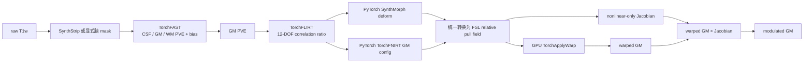
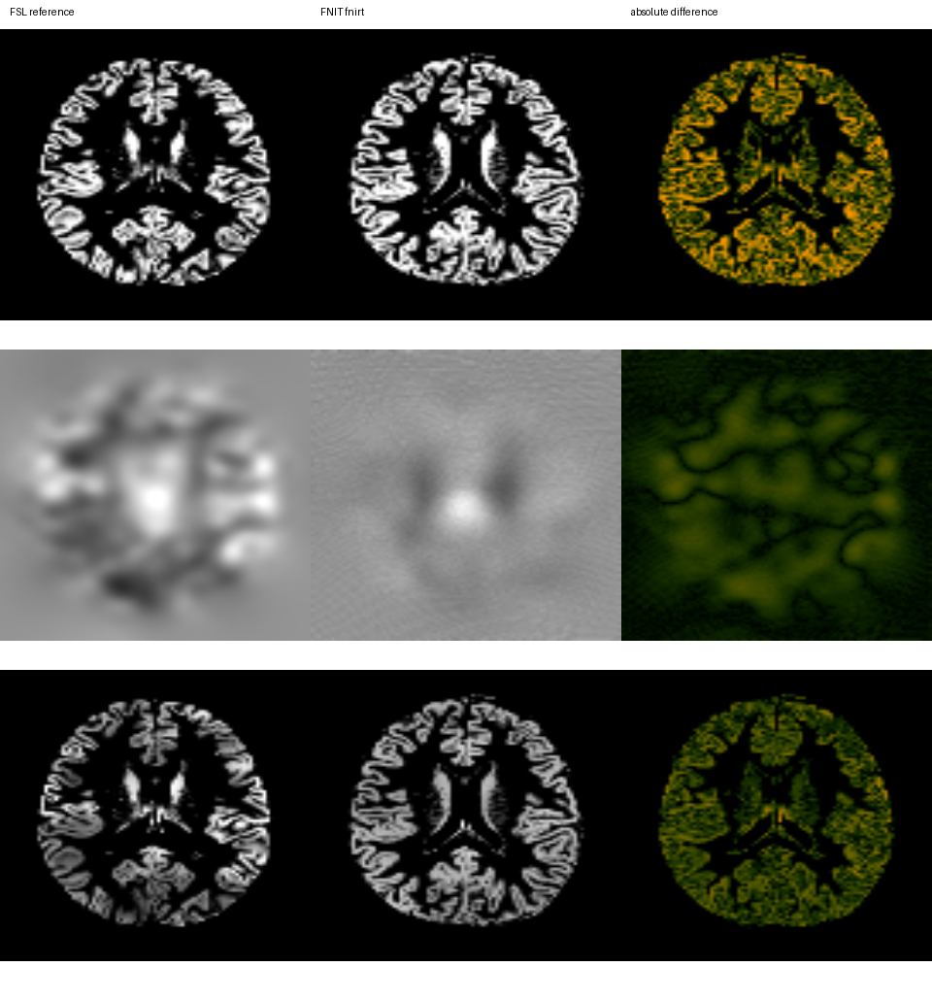
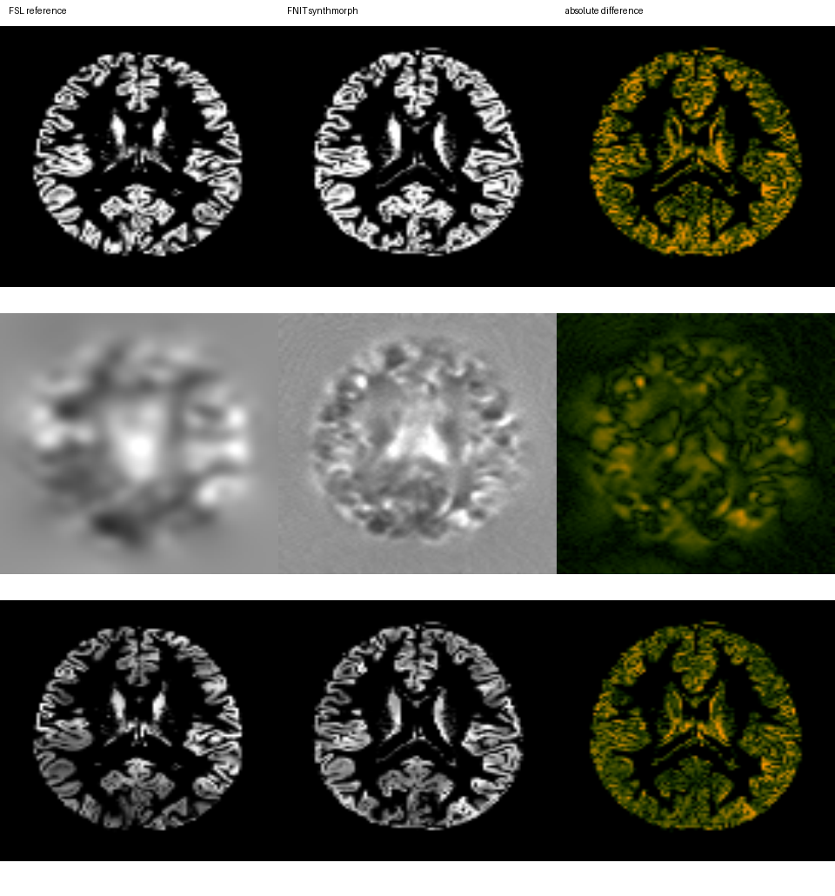

# FastVBM：单被试 T1w 到调制灰质图

[返回首页](../../README.md) · [源码目录](../../src/fnit/fast_vbm/) · [TorchFAST](../fast/README.md) · [TorchFNIRT](../fnirt/README.md) · [权重](../WEIGHTS.md) · [验证状态](../../validation/fast_vbm/README.md)

`FastVBM` 接收一幅原始 3D T1w 和一幅 GM 模板，输出输入空间的脑提取及三组织分割结果，以及模板空间的 warped GM、nonlinear-only Jacobian 和 modulated GM。它是单被试接口，不负责批量调度。

流程在 Python 进程内运行，不启动 FreeSurfer 或 FSL 可执行文件。CUDA 默认允许 TF32 matmul 和 cuDNN 内核；输入、模型权重、主要图像张量和 NIfTI 输出仍为 float32，不启用 float16 或 bfloat16。实际开关写入 `fast_vbm_report.json`。



## 输入

| 输入 | 类型 | 约束 | 用途 |
|---|---|---|---|
| `image` | 路径或 `nibabel.spatialimages.SpatialImage` | 单帧、有限值、3D T1w | 脑提取和组织分割 |
| `template` | 路径或 `nibabel.spatialimages.SpatialImage` | 单帧、有限值、3D，至少包含一个正值 | fixed GM template；决定模板空间输出的 shape 和 affine |
| `brain_mask` | 路径或 `nibabel.spatialimages.SpatialImage`，可省略 | 与 T1w shape 和 affine 一致，非空 | 提供时跳过 SynthStrip |
| `reference_mask` | 路径或 `nibabel.spatialimages.SpatialImage`，可省略 | 与 GM template shape 和 affine 一致，非空 | FNIRT 显式 reference mask；SynthMorph 只记录其摘要 |
| `output_dir` | 路径 | 单个受试者的独立目录 | 保存 13 幅 NIfTI 和一份 JSON 报告 |

省略 `reference_mask` 时，FastVBM 从 `template > 0` 构造显式 mask，并在 QC 中标记为派生 mask。复现某次 FSL/UKB 运行时，应传入该运行实际使用的 reference mask；任意 mask 或派生 mask 都不能作为与 FSL 数值等价的证据。

## 单被试 Python 调用

先安装 SynthStrip 和 SynthMorph 官方权重：

```bash
python tools/setup_weights.py --model fast-vbm
```

SynthMorph 后端：

```python
from fnit import FastVBM

pipeline = FastVBM(
    device="cuda:0",  # 运行设备：第一张可见 CUDA GPU
    threads=4,  # CPU 线程：读写及部分预后处理使用 4 线程
    registration_backend="synthmorph",  # 非线性后端：PyTorch SynthMorph deform
)

result = pipeline.run(
    image="subject_T1w.nii.gz",  # 输入：单幅原始 3D T1w
    template="template_GM.nii.gz",  # 输入：fixed GM 模板及输出网格
    output_dir="results/sub-01",  # 输出：该受试者的结果目录
    brain_mask=None,  # 输入：不提供，使用 SynthStrip 生成脑掩膜
    reference_mask="MNI152_T1_2mm_brain_mask_dil.nii.gz",  # 输入：模板网格二值掩膜
    overwrite=False,  # 写盘策略：不覆盖已有文件
)
```

这段代码依次完成以下工作：

1. `FastVBM(...)` 构造可复用的单被试处理器；模型在首次使用时加载。
2. `device="cuda:0"` 指定第一张可见 GPU；`threads=4` 设置当前进程的 PyTorch CPU 线程数。
3. `registration_backend="synthmorph"` 选择 PyTorch SynthMorph deform 非线性估计器。
4. `run()` 的前三个位置参数分别是 raw T1w、fixed GM template 和输出目录。
5. `reference_mask` 指定 template-grid mask。SynthMorph 不把它送入网络，但报告会记录其摘要，以便核对两后端的共同输入。
6. `overwrite=False` 在发现任何同名结果时停止，避免混合两次运行。

FNIRT 后端：

```python
from fnit import FastVBM

pipeline = FastVBM(
    device="cuda:0",  # 运行设备：第一张可见 CUDA GPU
    threads=4,  # CPU 线程：读写及部分预后处理使用 4 线程
    registration_backend="fnirt",  # 非线性后端：TorchFNIRT GM 配置
    synthstrip_weights="/models/synthstrip.1.pt",  # 权重：SynthStrip checkpoint
)

result = pipeline.run(
    image="subject_T1w.nii.gz",  # 输入：单幅原始 3D T1w
    template="template_GM.nii.gz",  # 输入：fixed GM 模板及输出网格
    output_dir="results/sub-01-fnirt",  # 输出：该受试者的结果目录
    brain_mask=None,  # 输入：不提供，使用 SynthStrip 生成脑掩膜
    reference_mask="MNI152_T1_2mm_brain_mask_dil.nii.gz",  # 输入：FNIRT reference mask
    overwrite=False,  # 写盘策略：不覆盖已有文件
)
```

FNIRT 分支没有非线性 checkpoint。若仍从 raw T1w 开始，只需 SynthStrip 权重：

```bash
python tools/setup_weights.py --model synthstrip
```

已有脑 mask 时，可以跳过 SynthStrip：

```python
result = pipeline.run(
    image="subject_T1w.nii.gz",  # 输入：单幅原始 3D T1w
    template="template_GM.nii.gz",  # 输入：fixed GM 模板
    output_dir="results/sub-01-fnirt",  # 输出：该受试者的结果目录
    brain_mask="subject_brain_mask.nii.gz",  # 输入：与 T1w 同网格的已有脑掩膜
    reference_mask="MNI152_T1_2mm_brain_mask_dil.nii.gz",  # 输入：模板网格二值掩膜
    overwrite=False,  # 写盘策略：不覆盖已有文件
)
```

只需要内存结果时，直接调用实例；该形式不写文件：

```python
result = pipeline(
    image="subject_T1w.nii.gz",  # 输入：单幅原始 3D T1w
    template="template_GM.nii.gz",  # 输入：fixed GM 模板
    brain_mask=None,  # 输入：不提供，使用 SynthStrip 生成脑掩膜
    reference_mask="MNI152_T1_2mm_brain_mask_dil.nii.gz",  # 输入：模板网格二值掩膜
)

result.warped_gm.save(path="warped_gm.nii.gz")  # 输出路径：模板空间 GM
result.jacobian.save(path="jacobian_nonlinear.nii.gz")  # 输出路径：非线性 Jacobian
result.modulated_gm.save(path="modulated_gm.nii.gz")  # 输出路径：调制 GM
```

### 构造参数

```text
FastVBM(
    device="cpu", threads=None,
    synthstrip_weights=None, synthmorph_weights=None,
    bias_correction=True,
    registration_backend="synthmorph",
    synthmorph_extent=256,
    synthmorph_hyper=0.5,
    synthmorph_steps=7,
    fnirt_strides=(4, 2, 1, 1),
    fnirt_steps=(5, 5, 10, 5),
    fnirt_input_fwhm_mm=(6, 4, 2, 2),
    fnirt_reference_fwhm_mm=(4, 2, 0, 0),
    fnirt_warp_resolution_mm=10,
    fnirt_regularization=(150, 75, 50, 30),
)
```

| 参数 | 作用 |
|---|---|
| `device` | `cpu`、`cuda` 或 `cuda:N` |
| `threads` | 当前进程的 PyTorch CPU 线程数；`None` 保留现有设置 |
| `synthstrip_weights` | SynthStrip checkpoint 或目录；提供 `brain_mask` 时不读取 |
| `synthmorph_weights` | SynthMorph deform checkpoint 或目录；仅 SynthMorph 分支读取 |
| `bias_correction` | 是否让 TorchFAST 估计平滑乘性 bias field，默认开启 |
| `registration_backend` | `"synthmorph"` 或 `"fnirt"` |
| `synthmorph_*` | SynthMorph 网络空间、正则化超参数和 velocity integration steps |
| `fnirt_strides` | FNIRT 四层 reference-grid 下采样因子 |
| `fnirt_steps` | FNIRT 四层最大迭代数 |
| `fnirt_input_fwhm_mm` | moving GM 的四层 Gaussian FWHM |
| `fnirt_reference_fwhm_mm` | fixed template 的四层 Gaussian FWHM |
| `fnirt_warp_resolution_mm` | cubic B-spline 控制点目标间距 |
| `fnirt_regularization` | 四层 bending-energy 权重 |

公开 `FastVBM` 始终运行本包 `TorchFLIRT`，不接受外部 affine。固定 affine 仅用于仓库内部诊断，不属于公开 API。

## 单被试命令行

SynthMorph 后端：

```bash
fnit fast-vbm \
  -i subject_T1w.nii.gz \
  --template template_GM.nii.gz \
  -o results/sub-01 \
  --registration-backend synthmorph \
  --reference-mask MNI152_T1_2mm_brain_mask_dil.nii.gz \
  --device cuda:0 \
  --threads 4
```

FNIRT 后端：

```bash
fnit fast-vbm \
  -i subject_T1w.nii.gz \
  --template template_GM.nii.gz \
  -o results/sub-01-fnirt \
  --registration-backend fnirt \
  --reference-mask MNI152_T1_2mm_brain_mask_dil.nii.gz \
  --device cuda:0 \
  --threads 4
```

各行含义：

1. `fnit fast-vbm` 选择单被试 raw-T1w-to-VBM 入口。
2. `-i` 指定 raw T1w。
3. `--template` 指定 fixed GM template 和模板空间输出网格。
4. `-o` 指定该受试者的完整输出目录。
5. `--registration-backend` 选择唯一发生分支的 nonlinear estimator。
6. `--reference-mask` 指定 template-grid mask；FNIRT 使用，SynthMorph 只记录。
7. `--device` 选择 PyTorch 设备；`--threads` 设置当前进程 CPU 线程数。

| 常用选项 | 作用 |
|---|---|
| `--brain-mask MASK` | 使用已有 input-grid mask，跳过 SynthStrip |
| `--reference-mask MASK` | 指定 template-grid reference mask |
| `--synthstrip-weights PATH` | 显式指定 SynthStrip checkpoint 或目录 |
| `--synthmorph-weights PATH` | 显式指定 SynthMorph deform checkpoint 或目录 |
| `--synthmorph-extent / --synthmorph-hyper / --synthmorph-steps` | SynthMorph 参数 |
| `--fnirt-strides / --fnirt-steps` | FNIRT 四层下采样和迭代参数 |
| `--fnirt-input-fwhm-mm / --fnirt-reference-fwhm-mm` | FNIRT 四层平滑参数 |
| `--fnirt-warp-resolution-mm` | FNIRT B-spline 控制点目标间距 |
| `--fnirt-regularization` | FNIRT 四层 bending-energy 权重 |
| `--no-bias` | 关闭 TorchFAST bias correction |
| `--overwrite` | 允许替换同名输出 |

完整参数以 `fnit fast-vbm --help` 为准。

## 两个非线性后端

两个后端共用同一份 TorchFAST GM、TorchFLIRT 结果、template grid、FSL 坐标转换、TorchApplyWarp、dense-field Jacobian 和 modulation。它们只在 nonlinear pull field 的估计方法上不同。

| 项目 | `registration_backend="synthmorph"` | `registration_backend="fnirt"` |
|---|---|---|
| 实现 | `fnit.synthmorph.SynthMorph(model="deform")` | `fnit.fnirt.TorchFNIRT` |
| 初始化 | TorchFLIRT affine，`mid_space=False` | TorchFLIRT input → reference FSL scaled-mm affine |
| 形变模型 | 官方 SynthMorph deform 网络和 stationary velocity integration | fixed-grid cubic B-spline residual displacement |
| 目标和优化 | checkpoint 定义的学习型配准 | 强度尺度 + SSD、bending energy、LM 与 matrix-free PCG |
| 输出 pull | fixed-grid target → source world-RAS displacement | 内部 FSL scaled-mm residual，随后转为相同 world-RAS pull |
| mask | 网络没有 reference-mask 输入 | 使用 implicit masks，并按 schedule 使用显式 reference mask |
| checkpoint | `synthmorph.deform.3.h5` | 无 |

### FNIRT implicit mask 的实际行为

当前 `TorchFNIRT` 的 GM 配置执行以下 mask 规则：

- `fixed != 0` 生成 implicit reference mask，并在四个优化层都参与有效体素筛选。
- `moving != 0` 生成 implicit input mask。输入 Gaussian smoothing 使用 mask-normalized smoothing；配准采样后也要求 warped input mask 有效。
- FastVBM 传入的显式 `reference_mask` 按 GM schedule 在最后一级启用，并与 implicit reference mask 取交集。
- 省略显式 mask 时，FastVBM 传入派生的 `template > 0` mask。它便于正常运行，但不代表某次 FSL 运行实际使用的 mask。
- SynthMorph 网络不消费这些 mask；FastVBM 仅把 reference mask 纳入共同输入摘要和 QC。

FNIRT 当前实现还包括四级 GM schedule、10 mm B-spline control spacing、输入 masked smoothing、reference zero-padded smoothing、bending regularization 和 nonlinear Jacobian 范围检查。它与 FSL 的接口角色和输出用途对应，但当前优化数值轨迹仍不同，不能声明逐体素或完整数值等价。

## 返回值和文件输出

`FastVBM.run()` 返回 `FastVBMResult`，同时保存结果。`FastVBM(...)()` 只返回内存结果。

| Python 属性 | 内容 |
|---|---|
| `brain`、`brain_mask` | 输入 T1 网格的脑图和二值 mask |
| `fast` | `FASTResult`；含三类 PVE、分割、mixel、bias 和 restored T1 |
| `registration` | `VBMRegistrationResult`；含模板空间结果和配准 QC |
| `pve_gm` | `fast.pve_gm` 的便利属性 |
| `warped_gm` | affine 与所选 nonlinear backend 共同重采样后的 GM |
| `jacobian` | nonlinear-only pull Jacobian，不含 FLIRT affine determinant |
| `modulated_gm` | `warped_gm * jacobian` |
| `settings` | 设备、TF32、mask 来源、后端和实际参数 |
| `timing_sec` | 脑提取、FAST、配准/Jacobian/modulation 和总墙钟时间 |

`timing_sec` 包含读取和输出转回 CPU，不包含 `FastVBMResult.save()` 的 NIfTI 写盘。首次调用可能包含 SynthStrip 或 SynthMorph checkpoint 延迟加载。

两个后端保存相同的 13 幅 NIfTI：

| Python 键 | 文件名 | 网格 | 含义 |
|---|---|---|---|
| `brain` | `T1_brain.nii.gz` | 输入 T1 | mask 外清零的 T1 |
| `brain_mask` | `brain_mask.nii.gz` | 输入 T1 | 二值脑 mask |
| `pve_csf` | `T1_brain_pve_0.nii.gz` | 输入 T1 | CSF PVE |
| `pve_gm` | `T1_brain_pve_1.nii.gz` | 输入 T1 | GM PVE，配准 moving image |
| `pve_wm` | `T1_brain_pve_2.nii.gz` | 输入 T1 | WM PVE |
| `hard_segmentation` | `T1_brain_seg.nii.gz` | 输入 T1 | PVE 前硬分类 |
| `pve_segmentation` | `T1_brain_pveseg.nii.gz` | 输入 T1 | 最大 PVE 分类 |
| `mixel_type` | `T1_brain_mixeltype.nii.gz` | 输入 T1 | pure/mixed tissue 类型 |
| `bias_field` | `T1_brain_bias.nii.gz` | 输入 T1 | 乘性 bias field，脑外为 1 |
| `restored` | `T1_brain_restore.nii.gz` | 输入 T1 | bias-corrected T1，脑外为 0 |
| `warped_gm` | `T1_GM_to_template_GM.nii.gz` | GM template | affine + nonlinear warped GM |
| `jacobian` | `T1_GM_JAC_nl.nii.gz` | GM template | 仅非线性 pull 变换的行列式 |
| `modulated_gm` | `T1_GM_to_template_GM_mod.nii.gz` | GM template | warped GM × Jacobian |

另写 `fast_vbm_report.json`，记录参数、分阶段时间、FAST 摘要、配准 QC 和输出文件名。报告不保存原始输入路径。

## 坐标、warp 和 Jacobian

- FLIRT `.mat` 把 input FSL scaled-mm 映射到 reference FSL scaled-mm；它不是 NIfTI world affine。
- FastVBM 内部 affine forward 为 moving-world → fixed-world RAS，重采样使用 fixed-world → moving-world pull。
- 两个 nonlinear estimator 最终都提供 fixed/template grid 上的 target → source world-RAS pull。
- FastVBM 将 pull 转为相对于同一 FLIRT affine 的 FSL scaled-mm nonlinear residual，再构造 full relative field 交给 `TorchApplyWarp`。
- `jacobian` 是 `det(I + du/dq)`，其中 `u` 是 nonlinear residual；不包含 affine determinant。
- FastVBM 不单独写 warp/coefficient 文件。需要 FSL intent-2007 coefficient 时，使用独立 [`TorchFNIRT`](../fnirt/README.md) 接口。

因此，Surfa world-RAS displacement、FSL dense relative warp 和 FSL coefficient NIfTI 不能逐数组元素互换。详见 [`TorchApplyWarp`](../applywarp/README.md) 和 [`TorchFNIRT`](../fnirt/README.md)。

## 与 UKB v1.5 / FSL VBM 的对应关系

UK Biobank `bb_vbm` 对已生成的 FAST GM PVE 执行：

```bash
fsl_reg T1_brain_pve_1.nii.gz template_GM.nii.gz \
  T1_GM_to_template_GM -fnirt \
  "--config=GM_2_MNI152GM_2mm.cnf --jout=T1_GM_JAC_nl"

fslmaths T1_GM_to_template_GM -mul T1_GM_JAC_nl \
  T1_GM_to_template_GM_mod -odt float
```

第一条命令让 `fsl_reg` 完成 GM affine + FNIRT 配准，并输出 warped GM 和 nonlinear-only Jacobian；第二条命令把二者逐体素相乘，得到 modulated GM。FastVBM 的对应单被试命令是：

```bash
fnit fast-vbm \
  -i subject_T1w.nii.gz \
  --template template_GM.nii.gz \
  -o results/sub-01-fnirt \
  --registration-backend fnirt \
  --reference-mask MNI152_T1_2mm_brain_mask_dil.nii.gz \
  --device cuda:0
```

两者起点不同：UKB 这段 `bb_vbm` 以已有 FSL FAST GM 为输入；FastVBM 从 raw T1w 开始，先运行 SynthStrip/TorchFAST。文件角色、后三幅图的 template grid 和 modulation 公式对应，脑提取、GM estimation、affine optimizer 和 nonlinear optimizer 并非同一数值实现。

| 阶段 | UKB/FSL | FastVBM | 对应边界 |
|---|---|---|---|
| 脑提取 | UKB structural 前序 BET/标准 mask | SynthStrip 或显式 mask | 输出角色对应，算法不同 |
| GM 与 bias | FSL FAST | TorchFAST | 三组织顺序和文件角色对应，数值算法独立 |
| affine | `fsl_reg` 内部 FLIRT | PyTorch `TorchFLIRT` | FSL scaled-mm matrix contract 对应；不能据此声明当前输入数值等价 |
| nonlinear | FNIRT GM config | SynthMorph 或 TorchFNIRT GM config | FNIRT 分支接口角色对应；SynthMorph 是替代算法 |
| 重采样 | FSL warp machinery | GPU `TorchApplyWarp` | template grid 和 pull 方向对应 |
| Jacobian | FNIRT `--jout` | 共同 dense residual finite difference | nonlinear-only 角色对应 |
| modulation | `fslmaths -mul` | `warped_gm * jacobian` | 公式一致 |

FastVBM 在 modulated GM 结束，不包含 UKB gradient distortion correction、群体平滑、统计模型或结构 IDP。官方流程和模板来源见 [UKB/FSL 专页](../ukb_vbm/README.md)。

## 权重和模板

| 场景 | 所需 checkpoint |
|---|---|
| SynthMorph 分支，从 raw T1w 开始 | `synthstrip.1.pt` + `synthmorph.deform.3.h5` |
| FNIRT 分支，从 raw T1w 开始 | `synthstrip.1.pt` |
| 提供显式脑 mask | SynthMorph 分支只需 deform；FNIRT 分支无需 checkpoint |

```bash
python tools/setup_weights.py --model fast-vbm
```

该命令安装两后端的权重超集。GM template 和 reference mask 是运行输入，不是模型权重，也不由该脚本下载。下载公开 UKB 模板的方法见 [UKB/FSL 专页](../ukb_vbm/README.md)。

## 当前真实数据验证

2026 年 9 月 27 日在 gpucw1 的 NVIDIA H100 PCIe 上，用数值运行冻结快照完成 1 例去标识化真实临床 T1w 的双后端回归。两条 FNIT 路径使用同一幅 raw T1w、同一 HCP GM template、同一 FSL dilated MNI mask 和同一 SynthStrip checkpoint。`fast_vbm/pipeline.py` 的 SHA-256 为 `aa37774419f0fed952a2a5a3304601d07436fc827522ed32c9088f964e9254b9`；其余依赖源码哈希写在机器可读报告中。

本次数值运行记录的 `flirt/core.py` SHA-256 为 `552856…`；当前文件为 `ce375d…`。[`552856… → f5315f…`](../../validation/runtime_dependencies/flirt_qc_source_equivalence.public.json) 只清理运行时 QC，[`f5315f… → ce375d…`](../../validation/runtime_dependencies/flirt_profile_source_equivalence.public.json) 则只在 FastVBM 使用的 12-DOF/corratio 配置下保持数值路径不变。报告保留原实测 hash，并明确 `fresh_current_hash_full_real_data_rerun=false`；这条链不能用于 6-DOF/normmi。

分支报告的 `candidate.source_sha256` 是共同源码快照清单，不等于每个文件都被执行。FNIRT 分支虽列出旧 `synthmorph/pipeline.py` `e680d3…`，实际没有调用 SynthMorph，因此不对该文件声明数值继承。SynthMorph 分支实际执行 deform registration 的 `SynthMorph.__call__` 和 linear 重采样；[linear 路径证明](../../validation/runtime_dependencies/synthmorph_linear_source_equivalence.public.json)把测量时的 `pipeline.py` `e680d3…`、`spatial.py` `9c629a…` 限定继承到当前 `70e97c…`、`dab615…`。分支清单没有单列旧 `spatial.py`，报告保留这一出处限制；没有 fresh current-hash 完整重跑，也不把 nearest 的定向测试当作本次真实 VBM 数值证据。

FSL 对照来自同一病例的 FAST/FNIRT VBM 工件。原流程把 `warped GM × Jacobian` 原位写回 `T1_GM_2mm_to_template_GM`，所以该文件已是 modulated GM。验证先用官方 intent-2007 coefficient 和 FSL 6.0.7.4 `applywarp` 重建未调制 warped GM，再乘官方 Jacobian；所得图与归档文件逐体素完全一致。下面的指标在 template-grid 显式 mask 内计算，共 292,019 个体素。

| 后端 | 输出 | Pearson r | MAE | RMSE | Dice，阈值 0.2 |
|---|---|---:|---:|---:|---:|
| TorchFNIRT | warped GM | 0.559420 | 0.220316 | 0.354288 | 0.734844 |
| TorchFNIRT | Jacobian | 0.237607 | 0.224483 | 0.331839 | 1.000000 |
| TorchFNIRT | modulated GM | 0.487910 | 0.257733 | 0.438617 | 0.731948 |
| SynthMorph | warped GM | 0.636498 | 0.198546 | 0.326702 | 0.777472 |
| SynthMorph | Jacobian | 0.328663 | 0.223898 | 0.311995 | 1.000000 |
| SynthMorph | modulated GM | 0.575795 | 0.234447 | 0.388955 | 0.770208 |

两条路径的三幅 template-space 图均与 FSL reference 具有相同 shape、affine 和 float32 dtype。数值指标没有达到逐体素等价，FastVBM 当前验收结果为 **输出契约通过，数值等价未通过**。Jacobian 的阈值 Dice 为 1 只表示两幅 Jacobian 在该 mask 内都大于 0.2，不能替代连续值误差。

| 实现 | 计时内容 | compute | 13 图写盘 | 外部进程 wall | 峰值 CUDA allocation |
|---|---|---:|---:|---:|---:|
| FNIT + TorchFNIRT | raw T1w 到 13 幅输出；冷启动 | 49.010 s | 7.416 s | 62.23 s | 12.970 GB |
| FNIT + SynthMorph | raw T1w 到 13 幅输出；冷启动 | 57.852 s | 7.042 s | 75.36 s | 15.487 GB |
| FSL 6.0.7.4 | 固定官方 warp 的 `applywarp` | — | 已包含 | 2.28 s | 未记录 |
| FSL 6.0.7.4 | `fslmaths warped -mul Jacobian` | — | 已包含 | 0.56 s | 未记录 |

FNIT 的 `compute` 包含输入读取、首次 checkpoint 加载和 GPU 结果回传，不含 NIfTI 写盘；外部 wall 还包含 Python 启动、完整三维比较和作图。FSL 两行只测固定 warp 应用和 multiplication，未测 UKB/FSL 的脑提取、FAST、FLIRT 或 FNIRT estimation。因此这些时间不能计算端到端加速比。本次没有取得同边界的 FSL raw-T1w-to-VBM 时间。





该病例的 FNIT raw T1w 网格为 208×320×320，归档的 FSL FAST GM 网格为 208×320×213；官方流程在 FAST 前还执行了不同的 bias correction、裁剪和脑提取。因而这次低相关同时包含上游 GM 估计、affine 和 nonlinear registration 的差异，不能只归因于 FLIRT、FNIRT 或 SynthMorph。若要定位单一阶段，应从同一 native GM 和同一 affine 开始做配准隔离实验。

汇总报告见 [`report.real.current.json`](../../validation/fast_vbm/report.real.current.json)，两个原始分支报告和复现脚本位于 [`validation/fast_vbm`](../../validation/fast_vbm/)。报告只发布文件哈希，不发布受试者标识。当前样本量为 1，不能代替十例或群体稳定性验证。
