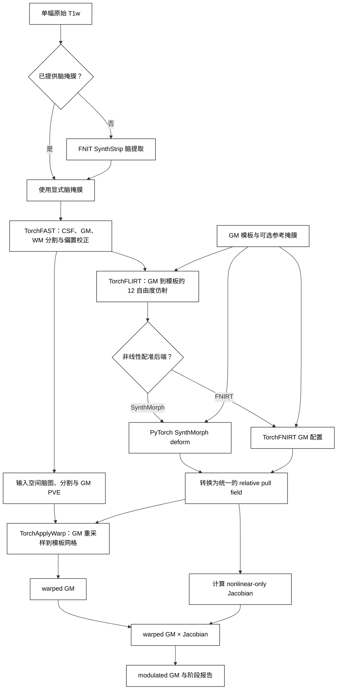

# FastVBM：单被试 T1w 到调制灰质图

[返回首页](../../README.md) · [源码目录](../../src/fnit/fast_vbm/) · [TorchFAST](../fast/README.md) · [TorchFNIRT](../fnirt/README.md) · [权重](../WEIGHTS.md) · [验证状态](../../validation/fast_vbm/README.md)

## 1. 功能简介与流程

`FastVBM` 接收一幅原始 3D T1w 和一幅 GM 模板，输出输入空间的脑提取及三组织分割结果，以及模板空间的 warped GM、nonlinear-only Jacobian 和 modulated GM。它是单被试接口，不负责批量调度。

流程在 Python 进程内运行，不启动 FreeSurfer 或 FSL 可执行文件。CUDA 默认允许 TF32 matmul 和 cuDNN 内核；输入、模型权重、主要图像张量和 NIfTI 输出仍为 float32，不启用 float16 或 bfloat16。实际开关写入 `fast_vbm_report.json`。



## 2. Python 调用、输入与输出

### 输入

| 输入 | 类型 | 约束 | 用途 |
|---|---|---|---|
| `image` | 路径或 `nibabel.spatialimages.SpatialImage` | 单帧、有限值、3D T1w | 脑提取和组织分割 |
| `template` | 路径或 `nibabel.spatialimages.SpatialImage` | 单帧、有限值、3D，至少包含一个正值 | fixed GM template；决定模板空间输出的 shape 和 affine |
| `brain_mask` | 路径或 `nibabel.spatialimages.SpatialImage`，可省略 | 与 T1w shape 和 affine 一致，非空 | 提供时跳过 SynthStrip |
| `reference_mask` | 路径或 `nibabel.spatialimages.SpatialImage`，可省略 | 与 GM template shape 和 affine 一致，非空 | FNIRT 显式 reference mask；SynthMorph 只记录其摘要 |
| `output_dir` | 路径 | 单个受试者的独立目录 | 保存 13 幅 NIfTI 和一份 JSON 报告 |

省略 `reference_mask` 时，FastVBM 从 `template > 0` 构造显式 mask，并在 QC 中标记为派生 mask。复现某次 FSL/UKB 运行时，应传入该运行实际使用的 reference mask；任意 mask 或派生 mask 都不能作为与 FSL 数值等价的证据。

### 单被试 Python 调用

先安装 SynthStrip 和 SynthMorph 官方权重：

```bash
python tools/setup_weights.py --model fast-vbm
```

SynthMorph 后端：

```python
from fnit import FastVBM

pipeline = FastVBM(
    device="cuda:0",  # 运行设备：第一张可见 CUDA GPU
    threads=4,  # CPU 线程：读写及部分预后处理使用 4 线程
    registration_backend="synthmorph",  # 非线性后端：PyTorch SynthMorph deform
)

result = pipeline.run(
    image="subject_T1w.nii.gz",  # 输入：单幅原始 3D T1w
    template="template_GM.nii.gz",  # 输入：fixed GM 模板及输出网格
    output_dir="results/sub-01",  # 输出：该受试者的结果目录
    brain_mask=None,  # 输入：不提供，使用 SynthStrip 生成脑掩膜
    reference_mask="MNI152_T1_2mm_brain_mask_dil.nii.gz",  # 输入：模板网格二值掩膜
    overwrite=False,  # 写盘策略：不覆盖已有文件
)
```

这段代码依次完成以下工作：

1. `FastVBM(...)` 构造可复用的单被试处理器；模型在首次使用时加载。
2. `device="cuda:0"` 指定第一张可见 GPU；`threads=4` 设置当前进程的 PyTorch CPU 线程数。
3. `registration_backend="synthmorph"` 选择 PyTorch SynthMorph deform 非线性估计器。
4. `run()` 的前三个位置参数分别是 raw T1w、fixed GM template 和输出目录。
5. `reference_mask` 指定 template-grid mask。SynthMorph 不把它送入网络，但报告会记录其摘要，以便核对两后端的共同输入。
6. `overwrite=False` 在发现任何同名结果时停止，避免混合两次运行。

FNIRT 后端：

```python
from fnit import FastVBM

pipeline = FastVBM(
    device="cuda:0",  # 运行设备：第一张可见 CUDA GPU
    threads=4,  # CPU 线程：读写及部分预后处理使用 4 线程
    registration_backend="fnirt",  # 非线性后端：TorchFNIRT GM 配置
    synthstrip_weights="/models/synthstrip.1.pt",  # 权重：SynthStrip checkpoint
)

result = pipeline.run(
    image="subject_T1w.nii.gz",  # 输入：单幅原始 3D T1w
    template="template_GM.nii.gz",  # 输入：fixed GM 模板及输出网格
    output_dir="results/sub-01-fnirt",  # 输出：该受试者的结果目录
    brain_mask=None,  # 输入：不提供，使用 SynthStrip 生成脑掩膜
    reference_mask="MNI152_T1_2mm_brain_mask_dil.nii.gz",  # 输入：FNIRT reference mask
    overwrite=False,  # 写盘策略：不覆盖已有文件
)
```

FNIRT 分支没有非线性 checkpoint。若仍从 raw T1w 开始，只需 SynthStrip 权重：

```bash
python tools/setup_weights.py --model synthstrip
```

已有脑 mask 时，可以跳过 SynthStrip：

```python
result = pipeline.run(
    image="subject_T1w.nii.gz",  # 输入：单幅原始 3D T1w
    template="template_GM.nii.gz",  # 输入：fixed GM 模板
    output_dir="results/sub-01-fnirt",  # 输出：该受试者的结果目录
    brain_mask="subject_brain_mask.nii.gz",  # 输入：与 T1w 同网格的已有脑掩膜
    reference_mask="MNI152_T1_2mm_brain_mask_dil.nii.gz",  # 输入：模板网格二值掩膜
    overwrite=False,  # 写盘策略：不覆盖已有文件
)
```

只需要内存结果时，直接调用实例；该形式不写文件：

```python
result = pipeline(
    image="subject_T1w.nii.gz",  # 输入：单幅原始 3D T1w
    template="template_GM.nii.gz",  # 输入：fixed GM 模板
    brain_mask=None,  # 输入：不提供，使用 SynthStrip 生成脑掩膜
    reference_mask="MNI152_T1_2mm_brain_mask_dil.nii.gz",  # 输入：模板网格二值掩膜
)

result.warped_gm.save(path="warped_gm.nii.gz")  # 输出路径：模板空间 GM
result.jacobian.save(path="jacobian_nonlinear.nii.gz")  # 输出路径：非线性 Jacobian
result.modulated_gm.save(path="modulated_gm.nii.gz")  # 输出路径：调制 GM
```

#### 构造参数

```text
FastVBM(
    device="cpu", threads=None,
    synthstrip_weights=None, synthmorph_weights=None,
    bias_correction=True,
    fast_execution="tensor",
    registration_backend="synthmorph",
    synthmorph_extent=256,
    synthmorph_hyper=0.5,
    synthmorph_steps=7,
    fnirt_strides=(4, 2, 1, 1),
    fnirt_steps=(5, 5, 10, 5),
    fnirt_input_fwhm_mm=(6, 4, 2, 2),
    fnirt_reference_fwhm_mm=(4, 2, 0, 0),
    fnirt_warp_resolution_mm=10,
    fnirt_regularization=(150, 75, 50, 30),
)
```

| 参数 | 作用 |
|---|---|
| `device` | `cpu`、`cuda` 或 `cuda:N` |
| `threads` | 当前进程的 PyTorch CPU 线程数；`None` 保留现有设置 |
| `synthstrip_weights` | SynthStrip checkpoint 或目录；提供 `brain_mask` 时不读取 |
| `synthmorph_weights` | SynthMorph deform checkpoint 或目录；仅 SynthMorph 分支读取 |
| `bias_correction` | 是否让 TorchFAST 估计平滑乘性 bias field，默认开启 |
| `fast_execution` | `"tensor"`（默认）或 `"fsl"`；后者使用保留 FAST4 原序的三组织 T1 分割，CPU 使用 Numba 编译内核，CUDA 使用既有 Triton 内核 |
| `registration_backend` | `"synthmorph"` 或 `"fnirt"` |
| `synthmorph_extent` | 网络输入立方网格边长，默认 256；仅 SynthMorph 分支使用 |
| `synthmorph_hyper` | 网络正则化超参数，默认 0.5；仅 SynthMorph 分支使用 |
| `synthmorph_steps` | stationary velocity 的积分步数，默认 7；仅 SynthMorph 分支使用 |
| `fnirt_strides` | FNIRT 四层 reference-grid 下采样因子 |
| `fnirt_steps` | FNIRT 四层最大迭代数 |
| `fnirt_input_fwhm_mm` | moving GM 的四层 Gaussian FWHM |
| `fnirt_reference_fwhm_mm` | fixed template 的四层 Gaussian FWHM |
| `fnirt_warp_resolution_mm` | cubic B-spline 控制点目标间距 |
| `fnirt_regularization` | 四层 bending-energy 权重 |

公开 `FastVBM` 始终运行本包 `TorchFLIRT`，不接受外部 affine。固定 affine 仅用于仓库内部诊断，不属于公开 API。

在 CPU 上显式选择原序分割时，构造为 `FastVBM(device="cpu", threads=8, registration_backend="fnirt", fast_execution="fsl")`，`run()` 的输入输出不变。默认 `fast_execution="tensor"` 延续已有 CPU 和 CUDA 行为；选择 `fsl` 会改变分割方法，不能把这项选择本身称为无损提速。Numba 首次编译和缓存加载时间计入相应进程的测量。

### 两个非线性后端

两个后端共用同一份 TorchFAST GM、TorchFLIRT 结果、template grid、FSL 坐标转换、TorchApplyWarp、dense-field Jacobian 和 modulation。它们只在 nonlinear pull field 的估计方法上不同。

| 项目 | `registration_backend="synthmorph"` | `registration_backend="fnirt"` |
|---|---|---|
| 实现 | `fnit.synthmorph.SynthMorph(model="deform")` | `fnit.fnirt.TorchFNIRT` |
| 初始化 | TorchFLIRT affine，`mid_space=False` | TorchFLIRT input → reference FSL scaled-mm affine |
| 形变模型 | 官方 SynthMorph deform 网络和 stationary velocity integration | fixed-grid cubic B-spline residual displacement |
| 目标和优化 | checkpoint 定义的学习型配准 | 强度尺度 + SSD、bending energy、LM 与 matrix-free PCG |
| 输出 pull | fixed-grid target → source world-RAS displacement | 内部 FSL scaled-mm residual，随后转为相同 world-RAS pull |
| mask | 网络没有 reference-mask 输入 | GM 配准关闭 implicit masks，按 schedule 使用显式 reference mask |
| checkpoint | `synthmorph.deform.3.h5` | 无 |

#### FNIRT GM 掩膜

FastVBM 的默认 GM 配准参数与 `GMFNIRTConfig()` 一致，按 FSL
`GM_2_MNI152GM_2mm.cnf` 设置 `--imprefm=0 --impinm=0`。输入 GM 和模板中的零值
不会因隐式掩膜而自动排除；显式 `reference_mask` 按 GM schedule 在最后一级启用。
省略显式 mask 时，FastVBM 使用 `template > 0` 派生 mask。复现 FSL 运行应提供
当时实际使用的 mask。直接 `TorchFNIRT()` 则使用 FSL 无配置文件的默认预设，
SynthMorph 网络不消费 reference mask。

### 返回值和文件输出

`FastVBM.run()` 返回 `FastVBMResult`，同时保存结果。`FastVBM(...)()` 只返回内存结果。

| Python 属性 | 内容 |
|---|---|
| `brain`、`brain_mask` | 输入 T1 网格的脑图和二值 mask |
| `fast` | `FASTResult`；含三类 PVE、分割、mixel、bias 和 restored T1 |
| `registration` | `VBMRegistrationResult`；含模板空间结果和配准 QC |
| `pve_gm` | `fast.pve_gm` 的便利属性 |
| `warped_gm` | affine 与所选 nonlinear backend 共同重采样后的 GM |
| `jacobian` | nonlinear-only pull Jacobian，不含 FLIRT affine determinant |
| `modulated_gm` | `warped_gm * jacobian` |
| `settings` | 设备、TF32、mask 来源、后端和实际参数 |
| `timing_sec` | 脑提取、FAST、配准/Jacobian/modulation 和总墙钟时间 |

`timing_sec` 包含读取和输出转回 CPU，不包含 `FastVBMResult.save()` 的 NIfTI 写盘。首次调用可能包含 SynthStrip 或 SynthMorph checkpoint 延迟加载。

两个后端保存相同的 13 幅 NIfTI：

| Python 键 | 文件名 | 网格 | 含义 |
|---|---|---|---|
| `brain` | `T1_brain.nii.gz` | 输入 T1 | mask 外清零的 T1 |
| `brain_mask` | `brain_mask.nii.gz` | 输入 T1 | 二值脑 mask |
| `pve_csf` | `T1_brain_pve_0.nii.gz` | 输入 T1 | CSF PVE |
| `pve_gm` | `T1_brain_pve_1.nii.gz` | 输入 T1 | GM PVE，配准 moving image |
| `pve_wm` | `T1_brain_pve_2.nii.gz` | 输入 T1 | WM PVE |
| `hard_segmentation` | `T1_brain_seg.nii.gz` | 输入 T1 | PVE 前硬分类 |
| `pve_segmentation` | `T1_brain_pveseg.nii.gz` | 输入 T1 | 最大 PVE 分类 |
| `mixel_type` | `T1_brain_mixeltype.nii.gz` | 输入 T1 | pure/mixed tissue 类型 |
| `bias_field` | `T1_brain_bias.nii.gz` | 输入 T1 | 乘性 bias field，脑外为 1 |
| `restored` | `T1_brain_restore.nii.gz` | 输入 T1 | bias-corrected T1，脑外为 0 |
| `warped_gm` | `T1_GM_to_template_GM.nii.gz` | GM template | affine + nonlinear warped GM |
| `jacobian` | `T1_GM_JAC_nl.nii.gz` | GM template | 仅非线性 pull 变换的行列式 |
| `modulated_gm` | `T1_GM_to_template_GM_mod.nii.gz` | GM template | warped GM × Jacobian |

另写 `fast_vbm_report.json`，记录参数、分阶段时间、FAST 摘要、配准 QC 和输出文件名。报告不保存原始输入路径。

### 坐标、warp 和 Jacobian

- FLIRT `.mat` 把 input FSL scaled-mm 映射到 reference FSL scaled-mm；它不是 NIfTI world affine。
- FastVBM 内部 affine forward 为 moving-world → fixed-world RAS，重采样使用 fixed-world → moving-world pull。
- 两个 nonlinear estimator 最终都提供 fixed/template grid 上的 target → source world-RAS pull。
- FastVBM 将 pull 转为相对于同一 FLIRT affine 的 FSL scaled-mm nonlinear residual，再构造 full relative field 交给 `TorchApplyWarp`。
- `jacobian` 是 `det(I + du/dq)`，其中 `u` 是 nonlinear residual；不包含 affine determinant。
- FastVBM 不单独写 warp/coefficient 文件。需要 FSL intent-2007 coefficient 时，使用独立 [`TorchFNIRT`](../fnirt/README.md) 接口。

因此，Surfa world-RAS displacement、FSL dense relative warp 和 FSL coefficient NIfTI 不能逐数组元素互换。详见 [`TorchApplyWarp`](../applywarp/README.md) 和 [`TorchFNIRT`](../fnirt/README.md)。

### 权重和模板

| 场景 | 所需 checkpoint |
|---|---|
| SynthMorph 分支，从 raw T1w 开始 | `synthstrip.1.pt` + `synthmorph.deform.3.h5` |
| FNIRT 分支，从 raw T1w 开始 | `synthstrip.1.pt` |
| 提供显式脑 mask | SynthMorph 分支只需 deform；FNIRT 分支无需 checkpoint |

```bash
python tools/setup_weights.py --model fast-vbm
```

该命令安装两后端的权重超集。GM template 和 reference mask 是运行输入，不是模型权重，也不由该脚本下载。下载公开 UKB 模板的方法见 [UKB/FSL 专页](../ukb_vbm/README.md)。

## 3. 命令行调用

SynthMorph 后端：

```bash
fnit fast-vbm \
  -i subject_T1w.nii.gz \
  --template template_GM.nii.gz \
  -o results/sub-01 \
  --registration-backend synthmorph \
  --reference-mask MNI152_T1_2mm_brain_mask_dil.nii.gz \
  --device cuda:0 \
  --threads 4
```

FNIRT 后端：

```bash
fnit fast-vbm \
  -i subject_T1w.nii.gz \
  --template template_GM.nii.gz \
  -o results/sub-01-fnirt \
  --registration-backend fnirt \
  --reference-mask MNI152_T1_2mm_brain_mask_dil.nii.gz \
  --device cuda:0 \
  --threads 4
```

各行含义：

1. `fnit fast-vbm` 选择单被试 raw-T1w-to-VBM 入口。
2. `-i` 指定 raw T1w。
3. `--template` 指定 fixed GM template 和模板空间输出网格。
4. `-o` 指定该受试者的完整输出目录。
5. `--registration-backend` 选择唯一发生分支的 nonlinear estimator。
6. `--reference-mask` 指定 template-grid mask；FNIRT 使用，SynthMorph 只记录。
7. `--device` 选择 PyTorch 设备；`--threads` 设置当前进程 CPU 线程数。

| 常用选项 | 作用 |
|---|---|
| `--brain-mask MASK` | 使用已有 input-grid mask，跳过 SynthStrip |
| `--fast-execution {tensor,fsl}` | 选择 TorchFAST 的同步或原序实现，默认 `tensor`；与 Python `fast_execution` 对应 |
| `--reference-mask MASK` | 指定 template-grid reference mask |
| `--synthstrip-weights PATH` | 显式指定 SynthStrip checkpoint 或目录 |
| `--synthmorph-weights PATH` | 显式指定 SynthMorph deform checkpoint 或目录 |
| `--synthmorph-extent` | 网络输入网格边长，默认 256 |
| `--synthmorph-hyper` | 网络正则化超参数，默认 0.5 |
| `--synthmorph-steps` | velocity 积分步数，默认 7 |
| `--fnirt-strides / --fnirt-steps` | FNIRT 四层下采样和迭代参数 |
| `--fnirt-input-fwhm-mm / --fnirt-reference-fwhm-mm` | FNIRT 四层平滑参数 |
| `--fnirt-warp-resolution-mm` | FNIRT B-spline 控制点目标间距 |
| `--fnirt-regularization` | FNIRT 四层 bending-energy 权重 |
| `--no-bias` | 关闭 TorchFAST bias correction |
| `--overwrite` | 允许替换同名输出 |

完整参数以 `fnit fast-vbm --help` 为准。

## 4. 原软件调用

### 与 UKB v1.5 / FSL VBM 的对应关系

UK Biobank `bb_vbm` 对已生成的 FAST GM PVE 执行：

```bash
fsl_reg T1_brain_pve_1.nii.gz template_GM.nii.gz \
  T1_GM_to_template_GM -fnirt \
  "--config=GM_2_MNI152GM_2mm.cnf --jout=T1_GM_JAC_nl"

fslmaths T1_GM_to_template_GM -mul T1_GM_JAC_nl \
  T1_GM_to_template_GM_mod -odt float
```

第一条命令让 `fsl_reg` 完成 GM affine + FNIRT 配准，并输出 warped GM 和 nonlinear-only Jacobian；第二条命令把二者逐体素相乘，得到 modulated GM。FastVBM 的完整单被试入口见[命令行调用](#3-命令行调用)。

两者起点不同：UKB 这段 `bb_vbm` 以已有 FSL FAST GM 为输入；FastVBM 从 raw T1w 开始，先运行 SynthStrip/TorchFAST。文件角色、后三幅图的 template grid 和 modulation 公式对应，脑提取、GM estimation、affine optimizer 和 nonlinear optimizer 并非同一数值实现。

| 阶段 | UKB/FSL | FastVBM | 对应边界 |
|---|---|---|---|
| 脑提取 | UKB structural 前序 BET/标准 mask | SynthStrip 或显式 mask | 输出角色对应，算法不同 |
| GM 与 bias | FSL FAST | TorchFAST | 三组织顺序和文件角色对应，数值算法独立 |
| affine | `fsl_reg` 内部 FLIRT | PyTorch `TorchFLIRT` | FSL scaled-mm matrix contract 对应；不能据此声明当前输入数值等价 |
| nonlinear | FNIRT GM config | SynthMorph 或 TorchFNIRT GM config | FNIRT 分支接口角色对应；SynthMorph 是替代算法 |
| 重采样 | FSL warp machinery | GPU `TorchApplyWarp` | template grid 和 pull 方向对应 |
| Jacobian | FNIRT `--jout` | 共同 dense residual finite difference | nonlinear-only 角色对应 |
| modulation | `fslmaths -mul` | `warped_gm * jacobian` | 公式一致 |

FastVBM 在 modulated GM 结束，不包含 UKB gradient distortion correction、群体平滑、统计模型或结构 IDP。官方流程和模板来源见 [UKB/FSL 专页](../ukb_vbm/README.md)。

<a id="全流程-benchmark"></a>

## 5. 精度、运行时间与脑图


### 2026-10-04：CPU 官方完整链对照

本次以公开 ds003138 v1.0.1 的真实原始 T1（224×288×288）为输入，固定同一 GM 模板、参考 mask 和权重。nodecw10 两端使用同一组 8 个物理核、8 线程配置，串行运行；节点同时有其他任务。本次候选冻结于 `task5_candidate_cpu_v2/src`，基线为 `1d31e7baaebbb644ab199471f7fe6282721455fd`，显式选择 `fast_execution="fsl"`。该配置使用 FNIT 内部 CPU 顺序分割实现，运行时不调用原版 FAST。后续整合版未在此报告重新测量完整链；源码 hash、实际负载和线程记录见[独立 CPU 报告](../../validation/smri_cpu_20261004/task04/fast_vbm_cpu_20261004/README.md)及[机器报告](../../validation/smri_cpu_20261004/task04/fast_vbm_cpu_20261004/report.public.json)。

| 分支与处理范围 | FNIT 实际完整 CLI 墙钟 | 官方参考时间与范围 |
|---|---:|---|
| 原始 T1→SynthStrip/FAST/FLIRT/FNIRT→13 图 | **610.899 s** | **769.365 s**，独立完整链墙钟 |
| 原始 T1→SynthStrip/FAST/FLIRT/SynthMorph→13 图 | **355.802 s** | **580.141 s**，复用官方自身上游和原版场后的实测阶段和；不是完整冷进程墙钟 |

FNIT Morph API 总计 **347.725 s**，其中脑提取 **11.338 s**、FAST **135.719 s**、配准/Jacobian/调制合计 **200.106 s**；API 不含最终 `save()`。原版 Morph 实际网络阶段 **138.976 s**；最终参考后处理使用独立 NumPy 坐标适配器与原版 FSL。官方完整 FNIRT 链没有使用候选 GM 或仿射初始化。两条参考均采用 SynthStrip 前处理，因此不是 standard FSL-VBM 的 BET 流程。本轮各一次完整测量，没有 pipeline AB-BA 重复，不据复用阶段和计算正式 Morph 端到端加速比。

三幅模板图的同估计方法脑内 NRMSE 为 `RMSE/(参考 P99−P1)`：

| 模板图 | FNIT FNIRT vs 官方 FNIRT | FNIT Morph vs 官方 Morph |
|---|---:|---:|
| warped GM | **0.0189811** | **0.000561591** |
| nonlinear-only Jacobian | **0.0100674** | **0.000352361** |
| modulated GM | **0.0160380** | **0.000450764** |

FNIRT 完整链尚未数值等价，不能将 769.365/610.899 的时间比称为等价重建加速。Morph 同算法三图脑内 NRMSE 均小于 10⁻³，但完整 13 图并非逐位同。原空间脑图、mask、seg、mixeltype 的数据完全相同；CSF/GM/WM PVE 分别有 **5/27/22** 个不同体素，pveseg 有 **2** 个。全 FOV、局部 max、软/硬体积、空间变换误差和 Jacobian 定义诊断分别见独立报告，不能只以整体积分体积判断匹配。

13 图 shape、dtype、affine、sform 和空间 pixdim 相同，native qform 最大差 **2.98×10⁻⁹ mm**。非空间 header 仍有差：原空间候选 pixdim[5:8] 为 0、官方为 1；warped/mod 图候选 pixdim[4] 为 1、官方为 2.4（均为 3D 图）。本轮未重跑完整 FastVBM GPU pipeline；下列历史 GPU 结果保留各自冻结源码、输入与计时范围。


### 本轮 FNIRT 完整端到端验证

本轮从真实原始 T1w 开始，完整执行脑提取、FAST、FLIRT、FNIRT、重采样、Jacobian 与调制，并保存 13 幅影像；与冻结 `7473452` 的 FNIT 基线逐位比较科学输出、网格和 FNIRT solver trace。本轮 13 幅最终影像与 5 幅 FNIRT 捕获影像全部逐位相同，科学 header、affine 和完整科学求解记录也相同；仅将 QC 中执行耗时分开统计。进程内含保存的 API 为 212.67→204.58 s，当前进程峰值 allocated 6.50 GB。共享 H100 的一次完整配对观测不代表稳定加速比；阶段时间、输入/源码哈希与脑图见[本轮验证](../../validation/registration_lossless_20261002/README.md)。

本轮输出另与既有同 raw T1w、同 GM 模板的独立 FSL 保存结果重新比较，区域为模板脑掩膜的全部 292,019 个体素：

| 本轮图像 | 与 FSL 的脑内 r | MAE | RMSE |
|---|---:|---:|---:|
| warped GM | 0.89136 | 0.08853 | 0.18137 |
| nonlinear-only Jacobian | 0.89016 | 0.10328 | 0.16509 |
| modulated GM | 0.86629 | 0.11079 | 0.23773 |

FSL 完整命令计时 3195.14 s 来自 2026-09-30，本轮没有重测原软件时间。未固定 FSL 分割或初始仿射；本轮相对 FNIT 基线的无损优化保留现有跨软件差异。全部指标、网格和参照边界见[本轮 FSL 比较](../../validation/registration_lossless_20261002/vbm_official.public.json)。


### 2026-09-30：原始 T1w 到调制 GM 的 FSL 对照

一例真实原始 T1w 已在 `f958121` 的运行源码上完成两个分支的全流程复测，并检查全部 13 幅输出。与同输入 FSL VBM 比较：

| 分支 | warped GM r | Jacobian r | modulated GM r | 进程内总耗时，含写盘 | 峰值 CUDA allocated |
|---|---:|---:|---:|---:|---:|
| FNIRT | 0.8910 | 0.8858 | 0.8655 | 901.93 s | 12.97 GB |
| SynthMorph | 0.6837 | 0.2927 | 0.6167 | 607.16 s | 15.49 GB |

这是 raw T1 到调制 GM 的比较，未固定 FSL GM 或仿射矩阵。全部输出网格和有限值检查通过，PVE 和、调制公式检查通过；两分支都未达到 FSL 数值等价。FSL 既有完整链的命令计时合计 3195.14 s，来自不同运行与处理边界，不能据此计算加速比。阶段耗时、MAE/RMSE/Dice、参照边界与复现命令见[全流程验证页](../../validation/fast_vbm/README.md)，匿名标量及源码哈希见[JSON](../../validation/fast_vbm/e2e.public.json)。对照图和输入/输出哈希见同一验证页。


## 6. 最近版本与 benchmark 记录

| 版本或日期 | 更新与验证范围 |
|---|---|
| 2026-10-04 CPU 审计 | 新增显式 `fast_execution` 选项，默认不变；FAST 的 CPU 原序热点改为 Numba。真实 FAST 小区域八图逐位相同，完整 CUDA `fsl` / `tensor` 两轮对照共 32 对文件 SHA-256 相同。原始 T1 到两个 VBM 后端的 CPU 官方对照仍待完成；这项阶段验证不改变既有 FSL 等价性状态。见[本轮报告](../../validation/smri_cpu_20261004/task04/README.md)。 |
| 本轮 FNIRT 优化 | 跳过未使用的采样梯度，复用 T1 intensity mapping 与原始 float64 deformation field；真实 FastVBM 完整端到端 18 幅影像及科学 QC 逐位通过，含保存 API 212.67→204.58 s，见[统一验证页](../../validation/registration_lossless_20261002/README.md)。 |
| 2026-09-30，`f958121` | 两个后端从 raw T1w 到全部 13 幅输出；FNIRT / SynthMorph 进程内含保存为 901.93 / 607.16 s。对 FSL 调制 GM 的 r 为 0.865489 / 0.616679，未达到数值等价；见[当次报告](../../validation/fast_vbm/e2e.public.json)。 |

每条记录保留其测量源码、输入和计时边界；本轮与冻结 FNIT 的无损检查及既有 FSL 精度分别报告。

## 7. 参考文献与原实现

- 参考文献：Ashburner & Friston, *Voxel-Based Morphometry—The Methods*, NeuroImage (2000), [doi:10.1006/nimg.2000.0582](https://doi.org/10.1006/nimg.2000.0582)。
- 参考文献：Smith et al., *Advances in functional and structural MR image analysis and implementation as FSL*, NeuroImage (2004), [doi:10.1016/j.neuroimage.2004.07.051](https://doi.org/10.1016/j.neuroimage.2004.07.051)。
- 原实现代码库：[FSL `fslvbm`](https://git.fmrib.ox.ac.uk/fsl/fslvbm)。
