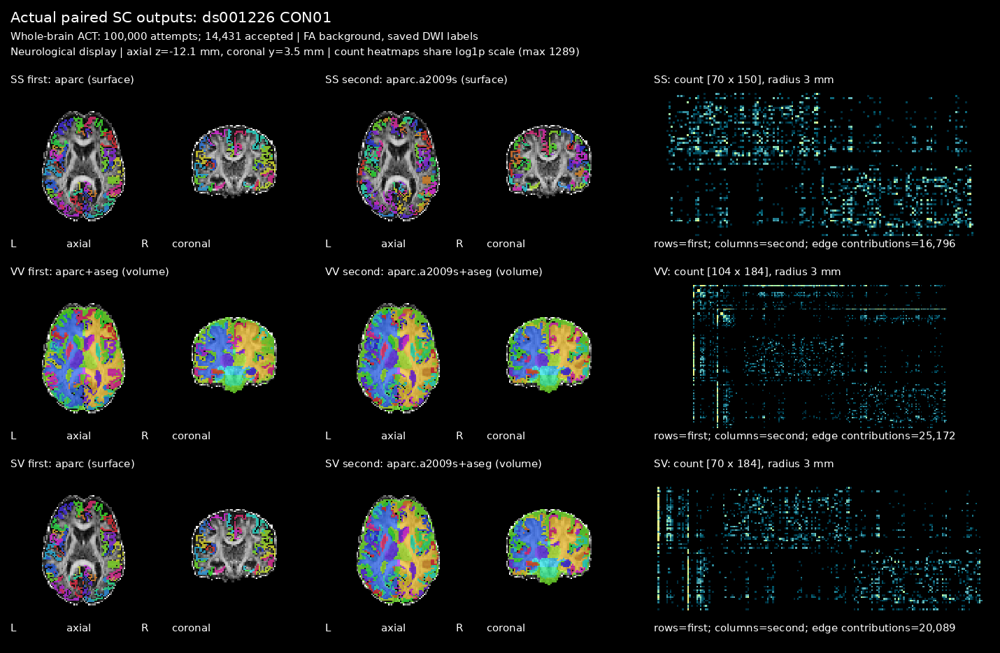

# 真实脑图索引

| 摘要 | 内容 |
|---|---|
| 输入 | 各模块已经保存的真实病例结果与对应来源记录。 |
| 输出 | 对照、差分或overlay图的导航。 |
| 对应原软件 | 按各图所属模块记录。 |
| Python / CLI | 本页没有独立处理入口。 |
| CPU / GPU | 绘图环境及处理设备见对应验证报告。 |

## 1. 功能简介

本页是可视化索引，帮助查看真实影像的处理结果。
每张图保留原始来源链接；数值结论以对应模块最新手册和版本绑定报告为准。
它不是独立影像功能，也不以图片替代完整数据验证。

## 2. Python 调用

本页没有独立Python API。
处理输入、保存结果和公开绘图接口见对应功能页：

| 功能 | 输入与输出说明 |
|---|---|
| [SynthStrip](../synthstrip/README.md) | 三维结构像→脑图、mask和距离场。 |
| [SynthMorph](../synthmorph/README.md) | moving/fixed影像→配准影像与变换。 |
| [fMRI](../fmri/README.md) | 原始T1w＋BOLD→volume与surface衍生时序。 |
| [Connectome](../connectome/README.md) | DWI、解剖和模板→四类矩阵。 |

图片为PNG展示文件，没有可用于科学计算的NIfTI affine或标签编码。
显示色阶、切面和数据空间由原报告解释；不要把图片像素当成原始强度。

## 3. 命令行调用

本页没有独立CLI。
用户按对应模块CLI生成影像，正式绘图复现命令位于各验证报告。

| 图类型 | 入口 |
|---|---|
| 结构像脑提取 | [SynthStrip调用](../synthstrip/README.md#3-命令行调用)。 |
| fMRI标准空间/皮层时序 | [fMRI调用](../fmri/README.md#3-命令行调用)。 |
| 连接矩阵与两端标签 | [Connectome调用](../connectome/README.md#3-命令行调用)。 |

## 4. 原软件调用

原软件处理命令分别见上述功能页第4节。
图中的reference只对应原报告记录的版本、数据和处理范围。

| 对照 | 参考 |
|---|---|
| SynthStrip | FreeSurfer的mri_synthstrip。 |
| fMRI | 独立fMRIPrep参考或固定输入Workbench算子。 |
| Connectome | 当前图为FNIT真实输出QC；不是原软件整链对照图。 |

## 5. 最新精度和运行时间

本页不产生新benchmark，设备、时间边界和精度见每幅图的原报告。
不汇总不同版本、数据或处理范围的指标。

[SynthStrip完整来源与指标](../synthstrip/README.md#5-最新精度和运行时间)。

[fMRI两例最新冻结运行记录](../../validation/fmri/reference_alignment_20261004/CONTINUOUS_BENCHMARK.md)。

[Connectome十例实际输出与缓存验证](../../validation/connectome/paired_pipeline_20261003/README.md)。

## 6. 最近版本和 benchmark

| 日期 | commit/version | 变化 | benchmark |
|---|---|---|---|
| 2026-10-05 | 文档迁移，基线140c3739 | 以版本绑定链接替换本页旧“当前”数值。 | 未重新执行MRI。 |
| 2026-10-04 | fMRI source_v1 | 稳健参考连续链图。 | 原始报告保留。 |
| 2026-10-03～04 | Connectome8bc337c4 | 已保存SS/VV/SV输出QC。 | 原始报告保留。 |

更早索引文本见 [归档](../../validation/figures/readme_archive_20261005.md)。

## 7. 参考文献、原软件和资源

论文、原软件源码、模型许可和外部资源大小/SHA均链接各模块第7节。
公开样例影像来源见 [T1w清单](../../examples/data/SOURCES.json) 和 [FLAIR清单](../../examples/wmh_data/SOURCES.json)。
只展示有来源的真实处理图；本页不新增模型、模板或原始MRI的再分发。
